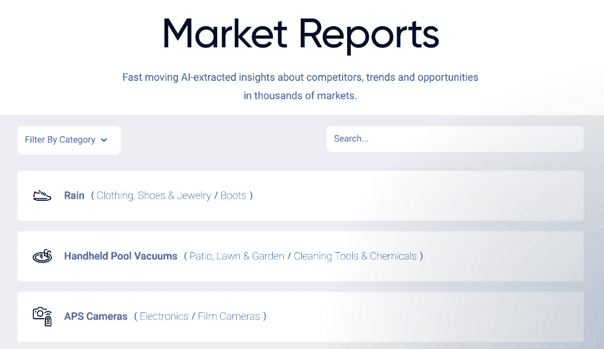

# *第一章*：改善市场机会识别

几年前，关于**人工智能**（**AI**）的每一次讨论似乎都以一种末日般的预言结束。2014 年，埃隆·马斯克曾表示，借助人工智能，我们正在*召唤魔鬼*，而斯蒂芬·霍金则说人工智能*可能意味着人类种族的终结*。然而，最近情况开始发生变化。人工智能已经从一个令人害怕的“黑盒子”变成了人们可以在各种使用场景中应用的工具。

这种转变是因为这些技术终于在大规模上得到探索，包括产品团队在市场机会识别中的应用。人工智能并非一直被应用于这个行业。事实上，它最初只是一种科学好奇心。1950 年代，计算机科学家约翰·麦卡锡想知道是否可以制造出能够自己学习如何做棋类等任务的机器。如今，人工智能无处不在。

在本章中，我们将探讨如何利用大数据和人工智能改善市场机会识别，涵盖以下主题：

+   传统方式识别市场机会

+   市场机会识别中的大数据挑战

+   使用人工智能识别市场机会

+   探索人工智能驱动的市场报告

市场机会识别对于产品团队识别未被满足的需求至关重要。它帮助他们了解他们的产品如何在市场中脱颖而出，以及他们需要做什么才能实现增长。他们需要识别竞争格局，定义市场机会，并利用这些信息创建价值主张。

此外，市场机会识别为后续章节奠定了基础，包括创造产品创意和预测未来市场趋势。

# 传统方式识别市场机会

在商业领域，盲目地冒险进入未知领域注定会失败。对市场机会的信任是不够的——必须有可靠的数据。市场机会识别是一个获取并分析数据的过程，数据来源可以是任何地方，目的是理解市场的潜在规模以及你能够占据的市场份额。

从广义上讲，市场应该被分为三个部分：

+   **外部市场**：外部市场是那些已经建立的市场，它们可能由其他公司提供服务。

+   **内部市场**：内部市场是那些公司内部存在的市场，但可能尚未被识别为市场。

+   **潜在市场**：潜在市场是那些尚未被识别的市场。

传统的市场机会识别可以通过多种方式完成：

+   首先，可以通过**调查消费者**来进行市场机会识别。市场调查是了解客户需求及他们愿意为此支付多少费用的最有效方式之一。这不仅帮助公司了解应该生产什么，还能帮助他们预估产品能带来多少收入。

+   其次，市场机会识别可以通过**头脑风暴技巧**来完成，例如*5 Whys*技巧。5 Whys 技巧非常简单，通过在面对一个主题、问题或难题时连续问五次*为什么？*，可以作为头脑风暴练习来使用。

+   第三，市场机会识别可以通过**分析内部数据**来完成，例如之前已做过的调查和访谈。通常，大公司会拥有大量未整理、未结构化的信息，这些信息分布在各个部门和项目中，从 Google Surveys 到 JotForm 再到 SurveyMonkey。当这些数据被分析时，他们可能会发现之前未曾意识到的机会。

+   最后，传统的市场机会识别可以通过**审视外部数据**以及来自社交媒体平台或同行业竞争者的数据来完成。这包括像 LinkedIn 或 Facebook 这样的网站，这些地方公司和个人的数据都可能非常有价值。

一种越来越受欢迎的市场研究工具是**Google Trends**，它允许人们在一段时间内查看特定兴趣领域的搜索量。例如，如果你对洛杉矶屋顶花园的受欢迎程度感兴趣，可以在 Google Trends 中输入*Los Angeles Rooftop Gardens*，并分析一段时间内的搜索趋势。此外，Google Trends 还允许你轻松导出这些数据，以便进一步分析，无论是用来创建可视化图表，还是与其他数据合并。

一旦潜在的市场机会被识别出来，公司应该考虑是选择追求这些机会，还是忽视它们。如果公司选择进军外部、内部或潜在市场，那么它需要考虑哪种方法最为合适。

例如，如果考虑进军一个*内部*市场，最好为公司员工创造一个激励措施，并将其提供给员工，以便让他们参与到新产品的推广中。

如果考虑进军一个*外部*市场，最好投资于广告活动，让客户了解新产品。

如果考虑进军一个*潜在*市场，公司最好投资于研发，以便创造一个能够吸引这一新市场细分的产品。

还存在**以客户为驱动的识别**和**以机会为驱动的识别**之间的区别。以客户为驱动的识别是指一个组织根据客户的需求或愿望来确定营销需求，而以机会为驱动的识别是指一个组织根据自身的优势和劣势来识别潜在价值的领域。

例如，如果一个组织在制造方面很强，但在营销方面较弱，那么他们可能会在营销领域发现提升机会，而这些机会在进行以客户为驱动的识别时是无法发现的。

尽管传统的市场机会识别方法有很多好处，但在面对大数据挑战的现代世界中，这些方法显得不足。

# 大数据在市场机会识别中的挑战

*大数据* 已成为产品社区中的一个流行词。

大数据涉及数据生成的速度、生成的数据量、可以用它回答的问题类型以及数据来源的数量。简而言之，大数据不仅仅关乎规模。

大数据描述了来自数十亿人访问互联网所带来的数据爆炸。

产品团队希望利用大数据来发现新的市场机会和新的客户目标方式。然而，许多公司在如何收集和分析大数据方面苦苦挣扎，尤其是当数据分散在不同来源时。

商业高管们提出了诸如：*我们如何从这些分散的数据中提取有用信息？我们如何利用大数据做出更好的战略决策？我们如何应对大数据存储、组织和管理的挑战？我们如何增加大数据的价值？*

通常，管理大数据以识别市场机会时会面临几个主要挑战：

+   第一个挑战是**在海量无关变量中找到相关的预测模式非常困难**。例如，使用传统的**商业智能**（**BI**）技术，如数据清洗和手动数据挖掘，可能需要几周甚至几个月的时间才能在一个庞大的客户调查结果数据库中发现预测模式。想象一下，您的数据集包括人口统计、公司信息、心理学特征、购买数据、评论等等。这是大量的信息需要浏览，而且许多变量在初看时可能并不显得相关。

+   第二个挑战是**传统的 BI 工具并不适合高效发现大数据中的预测模式**，因为大数据的增长速度远快于传统数据库的更新速度。这不仅使得追赶最新见解变得困难，而且还使得将洞察集成到现有系统中变得更加昂贵且耗时。

+   大数据的另一个主要挑战是**首先获取数据本身**。

像谷歌和亚马逊这样的大公司，凭借其在硬件和软件服务上的大量投资，拥有巨大的计算能力和几乎无限的存储空间，但对于较小的组织——即使是那些渴望利用大数据潜力的公司——情况则不同。

数据的涌入速度比以往任何时候都要快。产生的数据量的爆炸性增长已经超过了传统数据库系统的处理能力，而像 AWS 或 GCP 这样系统的搭建和维护需要专门的工程师，因为它们对技术专业知识的要求，包括扩展、安全性、数据管道等。

因此，问题通常是企业缺乏必要的资源，这些资源能够帮助它们收集、汇总、分析和解读如此大量的信息，而无需在服务器集群或其他专业基础设施上投入大量资金。

借助 AI，公司可以更轻松地解决这些挑战，并分析大数据以提高市场机会识别能力。

# 使用 AI 进行市场机会识别

使用 AI 进行市场机会识别时，最重要的事情是要记住，它并不是要创造一个*魔法棒*，瞬间识别出所有重大的新市场机会。那是数据科学家或软件开发者的梦想。但在营销的世界中，成功依赖于快速、高效和智能，这些特征却是完全的噩梦。

营销和产品开发专业人员常常面临压力，要求他们将新产品和服务迅速推向市场，并且要做到市场上最先推出。他们需要以成本效益高的方式做到这一点，同时不牺牲质量，通常还要在有限的资源下完成。

AI 提供了速度、效率和智能。通过在可扩展的服务器上部署模型，AI 可以扫描大量数据并识别出人类无法察觉的模式。这意味着，数百万个数据点可以在数小时甚至数分钟内被分析出来。

AI 已在多个领域中得到应用，如自动驾驶汽车、人脸识别和欺诈检测。

通过使用 AI 进行市场机会识别，营销人员可以摆脱手动审查和分析无数潜在市场或新产品类别的信息的负担。他们可以将数据收集和新产品创意的任务交给机器处理。

使用 AI 进行市场机会识别的最佳方法是*专注于需要真正解决方案的实际问题*。例如，营销人员可能希望分析现有客户群体，寻找他们可以进入的潜在新产品类别，或者为这些现有客户创造的特定产品。

另一个例子是，使用 AI 识别现有品牌的新地理市场——甚至是全新的品牌——通过观察全球各地区客户人口统计、购买习惯、生活方式选择和其他标准的各种组合。

在任何情况下，AI 都可以通过帮助营销人员比其他方式更有效地使用他们已经拥有的数据来协助他们（通过自动化一些数据收集任务并简化其他任务）。它还可以帮助克服一些关键障碍，包括评估任何给定潜在市场或产品类别是否真正可扩展。

使用 AI 进行市场机会识别的另一个好处是，你还可以将其作为展示你对创新的承诺并将你的品牌与竞争对手产品区分开来的工具——这也能提升你的品牌认知度、声誉和整体价值。

正如我们所探讨的，AI 对产品团队有许多广泛的好处。让我们深入了解一个具体的用例：**AI 驱动的市场报告**。

# 探索 AI 驱动的市场报告

AI 已经改变了**机器学习**，这是人工智能的一个分支，自动化地识别数据中的模式。大数据分析行业对 AI 生成的市场报告（[www.commerce.ai/reports](http://www.commerce.ai/reports)）在识别机会和趋势方面充满了可能性。

AI 引擎可以用于多种目的，包括生成市场报告，识别营销活动中潜在的改进机会。这项技术为营销专业人员提供了一个良好的机会，使得利用现有数据生成本地或全球报告变得比以往更容易。

以下是使用 AI 生成的**市场报告**的一些好处：

+   **自动化**：自动化重复性任务，如生成报告，可以帮助营销专业人员节省宝贵的时间和精力。

+   **成本效益**：生成报告模板的成本可能更低，AI 在后台快速调整模板，以满足本地或全球的需求。

+   **整体质量提升**：通过使用 AI，营销人员可以获得更准确、精确和完整的信息，用于他们的营销计划。

+   **数据追踪**：使用机器学习算法分析大量数据可以帮助营销人员获得有关消费者偏好和购买趋势的宝贵见解。

强调这些好处并不是说使用 AI 生成的市场报告没有缺点，而是为了突出一些*关键好处*，帮助你做出是否在未来的商业操作中使用这项技术的最终决策。

利用全新的 AI 生成市场报告功能，Commerce.AI 现在能够直接向公众提供高质量的洞察。

以前只有拥有 Commerce.AI 数据引擎访问权限的人才能使用市场报告，现在所有人都可以使用。

市场报告分析基于消费者反馈，提供了关于人们如何消费产品和服务的宝贵洞察。只需按下一个按钮或进行简单搜索，现在任何人都可以访问涵盖 1 万个类别的市场报告。

Commerce.AI 生成的报告是找到下一个产品创意或寻求新客户群的具体方法：

图 1.1 – Commerce.AI 生成的市场报告示例

例如，搜索*游戏键盘*会显示我们一个高机会分数，因为这个细分市场在疫情推动的封锁期间增长迅速。随着 Commerce.AI 的不断发展，它的洞察力也会不断提升，并随着分析与市场中新的趋势相关的更多产品数据，变得更加准确。

Commerce.AI 的数据引擎通过跨市场类别的洞察力已创造超过 1.4 亿美元的收入。这些市场报告是一个了不起的资源，基于来自论坛、博客、调查、视频、客户支持票、客户关系管理系统等来源的数十亿个非结构化产品数据点。它们提供了人们如何消费产品和服务的视角，并有可能帮助你找到下一个大创意。

在创新和产品开发方面，市场调研是无价的。它提供了关于人们如何消费产品和服务的洞察，这些信息可以用来启发下一个能够征服世界的创意。如果不以消费者反馈为起点来构思原创想法，你就限制了可能的努力方向。

Commerce.AI 的市场调研报告包括每个类别的总结、增长最快的品牌、畅销产品、最高评分产品、产品和评论的数量等。所有这些数据都被整合成一个单一的数值——机会计量器——显示当前市场机会的规模。

AI 通过考虑市场的平均规模、每个类别的竞争者数量和增长潜力来计算这一点，创建一个*最佳拟合线*，连接数据点：

图 1.2 – 一份 AI 生成的市场报告示例

传统的市场调研费用高昂、难以接触且令人困惑。Commerce.AI 新的 AI 生成的市场报告功能解决了这些问题，以及在探索市场机会时时间有限的问题。

市场报告无需支付高额费用即可获得数据驱动的消费者洞察。

Commerce.AI 的系统依赖于多种不同类型的产品数据点，包括占网络 95% 的非结构化数据。这些来源包括 Amazon、Walmart、Target 和其他对产品团队至关重要的商业来源。

所有这些数据被汇总并通过 AI 分析，生成市场洞察，提供有关人们如何消费产品和服务的宝贵知识。

通过 Commerce.AI 的新市场洞察，你可以对正在考虑的下一个产品创意以及当前市场充满信心。通过扫描 10,000 个市场类别的数据并提供报告，前所未有的大规模高质量洞察正在向所有人开放。

跳过那些对于人们当今如何花钱一无所知的昂贵市场研究公司，利用 AI 生成的市场报告，分析数十亿个数据点的强大能力。

当然，也有其他市场报告的来源，从 Gartner 到 Nielsen。然而，没有 AI 的强大能力，这些传统市场报告可能受到偏见的影响，同时也错过了分析数十亿个数据点的机会。此外，AI 生成的报告要经济得多，成本只是传统报告的一小部分。

例如，Gartner 的研究订阅每年费用约为 30,000 美元，因为传统报告所涉及的开销较大。这是因为需要高薪的分析师团队花费大量时间来生成报告。

相比之下，AI 生成的报告通过**自然语言处理**（**NLP**）软件，收集来自网络的数十亿个数据点；因此，它们只需几分钟就能生成，且成本远低于传统报告。NLP 通过计算分析语言模式，将其编码为数值化的标记值。它基于一个理念：所有语言都围绕一组核心元素构建，例如单词和短语，这些元素可以通过多种方式组合，表达出在向量空间中广泛的思想。

数十亿个数据点被提炼成每个市场的单一机会评分，提供了无与伦比的准确性和规模，同时不牺牲清晰度和易理解性。这些数据点为组织提供了无可匹敌的洞察，帮助它们推进战略并为全球扩张做好准备。

# 概要

很明显，AI 有潜力从根本上提高市场机会识别的质量和速度。

但这不仅仅是找到更好的方式来做研究人员一直在做的事，甚至不仅仅是自动化任务。相反，AI 可以帮助我们发现以前根本无法发现的新机会。

在传统的商业智能环境中，分析师需要花费数小时筛选成千上万家公司数据，以识别有前景的新目标。

利用以非结构化数据源（如文本文件或图像）为基础的 AI 解决方案，这一任务变得简单直接；AI 系统可以扫描数百万份文件，识别关键字或模式，然后提供具有商业意义的推荐匹配。

Commerce.AI 是产品团队可用的众多先进技术之一。它使用一系列机器学习技术，基于结构化和非结构化数据发现洞察。

理解市场机会识别对于产品团队铺设产品开发过程的基础至关重要。传统方法已经沿用了好几代人，并且今天仍然适用，而基于 AI 的方法则能为团队提供竞争优势。对这一点的理解对接下来的章节至关重要，因为产品开发应该建立在对市场的深刻理解之上。在此基础上，我们将深入讨论诸如构建、选择和迭代产品创意等主题。

在下一章，我们将探讨如何通过 AI 改进产品创作过程。
