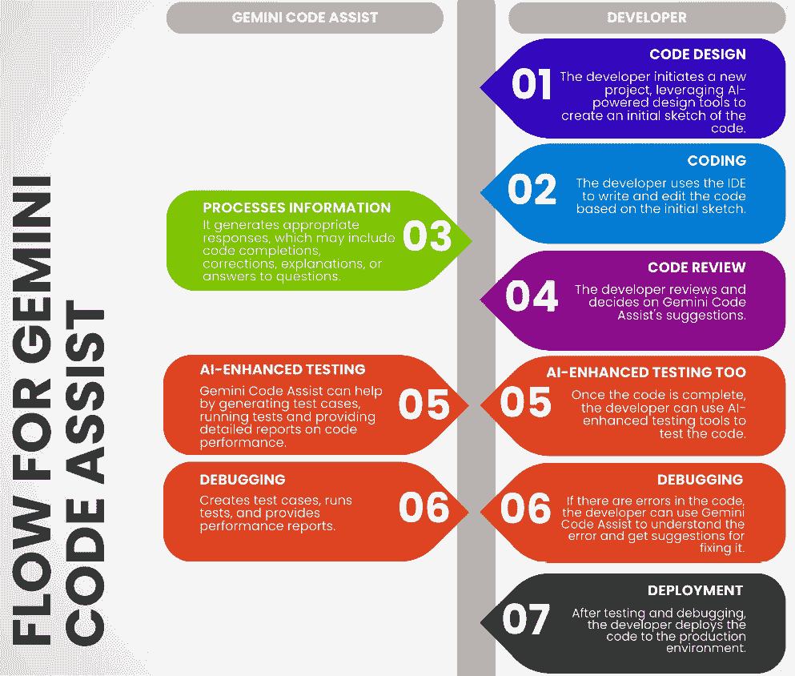
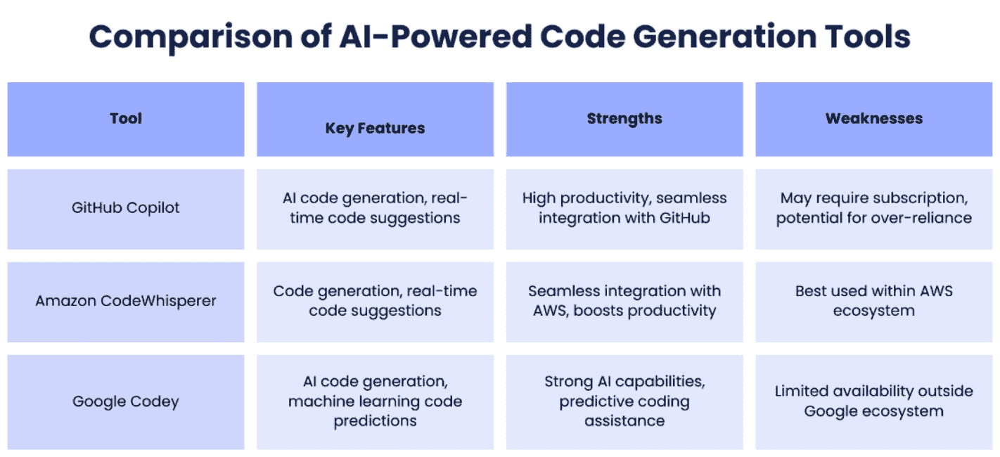

# 13

# AI 增强开发 – 塑造明日数字化景观

在本章中，我们将探讨如何借助**人工智能**（**AI**）进行软件开发，这一趋势正在塑造数字化景观的未来。AI 通过提供自动化、优化和创新开发过程的工具，提高软件开发人员的生产力、创造力和质量。我们将在本章介绍**Gemini 代码助手**（前身为 AI Duet），这是一个集成平台，结合了 AI 开发的三个关键组件：用于代码的设计工具（如 Sketch2Code 和带有 AI 插件的 Figma 等平台）、编码助手（如 Tabnine 和 GitHub Copilot 等工具）以及 AI 增强的测试工具（包括 DeepCode）。我们还将讨论生成性 AI 和**机器学习**（**ML**）如何用于创建个性化和自适应的软件解决方案。最后，我们将探讨 AI 对软件工程领域的影响，以及它带来的机遇与挑战。

在本章中，我们将讨论以下主要内容：

+   AI 增强开发对软件工程的影响

+   理解 AI 增强开发的组成部分

+   利用 Gemini 代码助手（前身为 AI Duet）提升软件开发生命周期

+   在软件开发中利用 AI 的实际策略

+   如何将 AI 集成到软件开发团队中

到本章结束时，你将能够识别 AI 开发对软件工程的好处和挑战。你将理解并应用 AI 技术，彻底改变软件开发过程，拥抱行业的未来。

# AI 增强开发对软件工程的影响

在网页开发的最前沿，我们正在见证 AI 增强开发在软件工程领域的变革力量。AI 与开发过程的整合正在彻底改变我们创建和优化网页应用的方式。在本节中，我们将探讨 AI 对软件工程的深远影响，重点介绍它对开发人员和企业的好处和意义。

现代网页开发的关键之一是实现具有**设计到代码功能**的设计系统。这种创新方法使我们能够无缝地将设计概念转化为功能性代码，从而减少开发时间和工作量。通过 AI 增强开发，这些功能得到了进一步的提升，使我们能够更高效、更准确地创建强大且具有视觉吸引力的网页应用。

通过利用 AI 的力量，我们可以借助机器学习算法分析和解释设计模式，自动生成符合既定设计系统的代码片段。这消除了手动编码的需要，减少了人为错误的可能性。这样，开发人员可以专注于更复杂的任务，如优化性能和提升**用户** **体验**（**UX**）。

AI 增强的开发还促进了开发人员、设计师和利益相关者之间的协作与沟通。借助 AI 驱动的工具，我们可以创建实时协作平台，促进无缝互动和思想交流。这些平台利用**自然语言处理**（**NLP**）和机器学习算法提供智能建议和反馈，增强整体开发过程。

此外，AI 可以帮助自动化重复性任务，让开发人员有更多时间参与更有意义的讨论和创造性的问题解决。通过减少琐碎任务的负担，AI 让我们能够专注于开发的人的一面，促进更加协作和创新的环境。

通过 AI 增强的开发，我们可以显著提高 Web 应用程序的质量和可靠性。AI 算法可以分析海量数据，识别潜在的漏洞、脆弱性和性能问题，使开发人员能够主动解决这些问题。这不仅改善了整体用户体验，还帮助企业确保 Web 应用程序的安全性和稳定性。

为了在 Web 应用程序中实现更高的质量和可靠性，将 AI 工具和技术整合到软件开发生命周期中至关重要。以下是一些最有效的 AI 驱动的质量保证和可靠性测试解决方案：

+   **AI 驱动的** **性能监控**：

    +   **New Relic AI**：它利用机器学习实时自动检测性能异常，识别应用性能数据中的趋势和模式，帮助开发人员快速解决问题。

    +   **Dynatrace**：它运用 AI 提供深入的性能洞察，预测并识别性能下降，进行根本原因分析，并在各种环境中优化应用性能。

+   **异常** **检测系统**：

    +   **Splunk**：它具有一个机器学习工具包，包括异常检测功能，用于识别日志数据中的异常模式或异常值，这对早期检测安全漏洞或系统故障至关重要。

    +   **Amazon CloudWatch 异常检测**：它使用机器学习不断监控和分析度量数据中的异常，帮助检测应用性能或使用模式中的意外变化。

+   **自动化** **测试工具**：

    +   **Testim**：它利用 AI 创建、执行和维护自动化测试，适应 UI 变化，使测试过程更加具有弹性，减少维护工作量。

    +   **Applitools**：这款工具使用 AI 进行视觉 UI 测试，通过对比不同版本的截图自动检测视觉 bug，确保应用在所有设备和浏览器上的外观和功能正确。

+   **静态** **代码分析**：

    +   **DeepCode**：一款由 AI 驱动的代码审查工具，分析代码仓库以识别潜在的 bug 和漏洞，使用在大量开源代码上训练的机器学习模型，为代码改进提供建议。

    +   **SonarQube 与 SonarLint**：它提供带有 AI 增强的静态代码分析，持续反馈代码质量，突出显示潜在问题，如安全漏洞和代码异味。

+   **安全** **漏洞扫描**：

    +   **Snyk**：它与开发环境集成，自动查找并修复开源依赖中的漏洞，利用 AI 根据漏洞的严重性和潜在影响来优先处理漏洞。

    +   **Veracode**：它提供一种由 AI 驱动的应用安全测试方法，扫描代码中的漏洞并提供修复建议，帮助开发人员从一开始就保护应用的安全。

通过结合这些 AI 工具和技术，开发人员可以确保他们的 Web 应用程序功能正常、用户友好、安全且稳定。这种积极的质量保证和可靠性测试方法有助于交付符合用户期望和业务需求的高质量软件。

此外，AI 驱动的测试框架可以自动化测试过程，识别 bug 并提供详细的应用行为报告。这加速了测试阶段，使得软件能够更快部署并发布更加可靠的版本。

考虑使用 Testim，一款由 AI 驱动的自动化测试工具。当集成到开发流程中时，Testim 通过根据用户交互和 UI 变化创建自动化测试开始。随着开发进展，Testim 会根据这些变化进行调整，确保测试保持相关并与时俱进。

在测试阶段，Testim 的 AI 算法分析应用行为以检测异常或 bug。例如，如果一个以前正常的功能突然失败，Testim 会标记该问题，并提供有关故障的详细信息，包括导致 bug 的步骤以及其在代码中的确切位置。

在完成测试后，Testim 会生成详细的报告，总结测试结果。这些报告详细列出了通过和未通过的测试数量、检测到的 bug 的严重程度以及修复问题的建议。报告以用户友好的格式呈现，帮助开发人员理解问题并采取纠正措施。

通过结合这些 AI 工具和技术，开发者可以确保他们的 Web 应用程序不仅功能齐全、用户友好，而且安全可靠。这种主动的质量保证和可靠性测试方法有助于交付符合用户期望和业务需求的高质量软件。

AI 增强开发对软件工程的影响不可忽视。通过利用 AI 驱动的工具和技术，开发者可以简化开发过程，增强协作，并提高软件质量。随着我们不断拥抱 AI 的可能性，Web 开发的未来看起来非常有前景，为数字化领域中的创新和高效解决方案铺平了道路。在下一节中，我们将探索 AI 增强开发的主要组件，如代码助手、自动化测试和智能调试。

# 了解 AI 增强开发组件

最近几年，软件工程领域经历了 AI 增强开发的重大变革。这一创新方法利用 AI 技术的力量，如生成式 AI 和机器学习，来帮助软件工程师创建、测试和交付应用程序。通过集成 AI 增强开发工具，开发者可以提高生产力，满足对软件解决方案日益增长的需求。在本节中，我们将探讨 AI 增强开发的三个关键组件，并讨论为什么它在软件工程行业中成为当前的趋势。

让我们首先来看一下这三个关键组件：

+   **AI 驱动的设计到代码工具**：这些工具彻底改变了软件开发过程。它们使工程师能够将设计原型无缝地转换为功能性代码，从而消除了手动编码的需求。通过自动化这项繁琐的任务，软件工程师可以将更多的精力集中在更高层次的活动上，如设计和构建引人入胜的商业应用程序。这一 AI 增强型开发组件简化了开发过程，提升了整体效率。

+   **AI 编码助手**：想象一下，身边有一个 AI 驱动的助手，帮助你更快、更准确地编写代码。AI 编码助手已成为软件工程师不可或缺的资源。通过分析现有的代码库并利用机器学习算法，这些助手能够建议代码片段、检测错误，甚至自动生成代码。因此，开发者可以显著减少编写代码的时间，提高生产力。根据 Gartner 的预测，到 2028 年，预计 75%的企业软件工程师将使用 AI 编码助手，而 2023 年初这一比例不到 10%（[`www.gartner.com/en/articles/gartner-top-10-strategic-technology-trends-for-2024`](https://www.gartner.com/en/articles/gartner-top-10-strategic-technology-trends-for-2024)）。

+   **AI 增强测试工具**：确保软件应用程序的质量和可靠性是开发过程中的关键。AI 增强测试工具利用 AI 技术提升软件工程师的测试能力。这些工具可以自动生成测试用例，检测漏洞，甚至在问题发生之前预测潜在问题。通过自动化这些测试过程，开发者能够节省时间和资源，同时向最终用户交付高质量的应用程序。

AI 增强开发的兴起可以归因于几个因素。首先，如前所述的工具与开发者环境无缝集成，为开发者提供了增强的代码生成能力、设计到代码的转化能力以及改进的应用程序测试功能。其次，AI 辅助的软件工程显著提高了开发者的生产力，使开发团队能够跟上日益增长的软件解决方案需求。最后，通过减少编写代码的时间，工程师可以将精力集中在更关键的任务上，如设计创新且具有影响力的商业应用程序。

AI 增强开发通过利用 AI 技术的力量，彻底革新了软件工程领域。通过其三大核心组件——设计到代码工具、AI 编程助手和 AI 增强测试工具——开发者可以简化工作流程，提高生产力，并交付高质量的应用程序。随着行业继续拥抱 AI 增强开发，预计未来几年，软件工程师对这些工具的采用将显著增加。

为了说明如何在实践中应用 AI 增强开发，我们将提供一个逐步指南，介绍如何使用 Gemini Code Assist（前身为 AI Duet），这是一个将 AI 增强开发的三大核心组件集成到单一平台中的工具。

# 使用 Gemini Code Assist 增强软件开发生命周期

在当今快节奏的世界中，软件开发必须不断适应新的挑战。AI 增强开发在这种适应中起着关键作用，不仅提供速度和效率，还增强了决策能力。通过集成 AI，开发者可以在问题变得严重之前预测潜在问题，更精确地定制解决方案以满足用户需求，甚至在用户体验设计方面进行创新。这种前瞻性的方法改变了软件的构思和交付方式，使开发过程更紧密地与动态的市场需求和用户期望对接。

DevOps 与软件开发生命周期结合后，形成了两个重要的周期：开发周期和运维周期。**开发周期**涵盖了软件的构思、创建和编码，而**运维周期**则专注于软件在生产环境中的部署、监控和维护。

随着像 Google Cloud 的 Gemini Code Assist 这样的工具引领潮流，开发者可以使用前所未有的能力来简化和增强开发生命周期的每个阶段。本指南将探讨 Gemini Code Assist 如何改变软件创建的传统阶段，从设计、编码到测试和部署，展示 AI 对软件行业的变革性影响。从初始设计阶段到最终的影响评估，我们将向您展示 AI 如何重塑软件开发的世界。让我们开始：

1.  **一起设计**：在这个阶段，团队共同协作以创建有效的设计。在 Google 的 AI 帮助下，开发人员可以快速响应功能请求，进行高效的头脑风暴，并整理架构图。此外，他们还可以使用 Bard 提问架构方面的问题，并识别提议实施中的潜在风险。与 Bard 的对话可以导出到 Google Docs 中，开始撰写设计文档。Google Docs 的 *Help me write* 功能可以用来生成大纲，从而让开发者专注于更复杂的设计问题。

1.  **在帮助下编码**：一旦设计文档获得批准，前端页面准备好开始测试，开发人员可以开始编码。在这个阶段，Google 的 AI 助手可以帮助开发人员更高效地编写和提交代码。生成式 AI 可以自动生成代码的部分内容，从而节省开发者的时间和精力。此外，AI 还可以帮助识别和修复代码中的安全漏洞，并建议改进措施，以增强应用程序的韧性。

1.  **自信操作**：一旦新功能的代码经过审查并合并到主分支，它将部署到生产环境。作为值班的应用开发人员，找到服务日志至关重要，借助于 Gemini Code Assist 控制台在 Cloud Run 控制台中的聊天功能，这一过程变得更加高效。与**站点可靠性工程**（**SRE**）团队的合作促成了库存服务的服务级目标的创建。为了进行详细的服务健康分析，Gemini Code Assist 的功能帮助在 Cloud Monitoring 中构建复杂的查询。此外，之前一周的安全监督中，某个队友保留了过于宽松的**身份和访问管理**（**IAM**）角色，这一问题通过安全指挥中心的洞察得以识别并解决，AI 生成的摘要帮助加速了理解和解决的过程。

1.  **分享影响**：一周过去了，产品负责人要求你在即将举行的全员会议上展示几张幻灯片。与业务分析师同事一起完成工作准备。目标是了解创建新产品展示页面的影响——这些新产品是否在专属页面展示后销量更好？这个过程从在 Google Sheets 中创建待办事项列表开始，使用“帮助我组织”功能。然后，利用 Gemini Code Assist 的 Spanner SQL 代码补全功能查询过去几周的原始交易数据。从 BigQuery 中的销售汇总表中收集更多数据。当业务分析师轻松编写 SQL 查询时，使用 Duet 的代码解释功能更好地理解收集的数据。从那里跳转到 Google Slides，使用 Gemini Code Assist 的 *帮助我可视化* 工具为影响报告生成辅助图像。

总结来说，生成式 AI 在软件开发生命周期的各个阶段都发挥着至关重要的作用，从创意生成到最终用户应用优化。它是一个强大的工具，可以提高软件开发人员的工作效率和效果。这种 AI 增强的开发过程不仅高效，还能确保高质量的输出，使其成为现代软件开发中的一种宝贵方法。

## Gemini Code Assist —— 一款 AI 增强的开发工具

Gemini Code Assist 通过利用先进的 AI 来增强开发过程，开创了软件开发的新范式。本分析探讨了其功能，重点介绍了它如何与现有开发工作流程结合，以提高生产力、创造力和代码质量：

1.  **提高生产力**：Gemini Code Assist 自动化重复且劳动密集的任务，从而提高了生产力。其基于 AI 的代码生成器可以解析自然语言描述并生成代码片段。这一功能使开发人员能够快速生成模板代码，从而专注于项目中更复杂的部分。此外，该工具还提供智能调试系统，能够识别潜在的错误并建议修复方案，从而减少排查问题的时间，提升整体效率。

1.  **促进创造力**：该平台通过实时编码辅助支持创意开发。它使用**大型语言模型**（**LLM**）预测并建议代码补全、替代方案和复杂问题的答案。这种持续的帮助使开发人员能够专注于创新问题解决，而非日常编码任务。通过提供相关建议和解决方案，Gemini Code Assist 鼓励开发人员在工作中探索新的方法和思路。

1.  **提高代码质量**：Gemini Code Assist 包括 AI 增强的测试工具，这些工具在保持高代码质量方面起着至关重要的作用。它们可以自动生成和执行测试用例，分析结果，并提供详细的性能报告。这一自动化测试过程有助于尽早发现问题，确保最终产品的强健和可靠。该工具能够识别代码中的漏洞并提供修复建议，从而进一步帮助生成高质量的软件。

1.  **与开发环境的无缝集成**：该工具设计旨在与流行的 **集成开发环境**（**IDEs**）和代码库无缝集成。当开发人员编写或修改代码时，Gemini Code Assist 会实时监控这些更改，并提供及时的建议和修正。这种集成确保提供的帮助是与上下文相关且及时的，使开发人员能够保持工作流程不中断。

1.  **利用 AI 提供个性化和适应性解决方案**：Gemini Code Assist 运用生成式 AI 和机器学习技术来创建个性化和适应性的 软件解决方案。通过分析用户行为和偏好，工具根据特定需求定制功能，提升用户体验（UX），使软件更加直观。这种适应性在开发需要根据用户交互模式进行定制的应用程序时尤其有用。

1.  **解决伦理和实践挑战**：引入像 Gemini Code Assist 这样的 AI 工具也带来了某些挑战。必须解决的伦理问题包括 AI 算法中的偏见以及潜在的滥用问题。开发人员需要确保所使用的 AI 模型是在多样化且具有代表性的数据集上进行训练，以减轻偏见。此外，AI 技术的快速发展要求开发人员不断学习和适应新技术和方法。

*图 13.1* 详细说明了开发人员如何与 IDE 或代码库交互，以及 Gemini Code Assist（前身为 AI Duet）如何通过 AI 驱动的设计工具和测试工具提升软件开发过程。

图 13.1：开发人员与 Gemini Code Assist 之间的交互流程

前面图示中的交互流程展示了 Gemini Code Assist 如何无缝地融入开发过程，通过从初步设计到部署的各个阶段，提升生产力、创造力和代码质量。借助 AI 驱动的工具，开发人员可以优化工作流程，减少错误，创建更强大且具有适应性的 软件解决方案。

通过了解 Gemini Code Assist 如何转变你的开发过程，接下来我们将深入探讨在软件开发中利用 AI 的实用策略。这些策略将指导你如何有效地将 AI 集成到工作流程中，确保你最大化其效益，并在快速发展的技术环境中保持领先。

# 在软件开发中利用 AI 的实用策略

在今天这个快节奏的世界中，软件开发是商业成功的关键因素之一。随着技术不断进步，对更高效、更有效的软件开发流程的需求也在不断增长。幸运的是，AI 的出现为这一领域带来了新的可能性。根据 Gartner 最近的一项研究 ([`www.gartner.com/en/articles/set-up-now-for-ai-to-augment-software-development`](https://www.gartner.com/en/articles/set-up-now-for-ai-to-augment-software-development))，AI 有潜力自动化枯燥的软件开发任务，并帮助工程师更快速地编写代码。在本节中，我们将探讨软件工程师如何在软件开发生命周期的各个阶段利用 AI，并为软件工程领导者提供如何将 AI 无缝集成到团队中的指导：

+   **通过生成式 AI 强化代码生成**：生成式 AI 工具，如 GitHub Copilot、Amazon CodeWhisperer 和 Google Codey，为寻求 AI 驱动代码生成的企业提供了极好的选择。通过使用这些工具，软件工程师可以自动化编写和理解软件代码的过程，从而显著提高生产力。此外，由机器学习驱动的插件式编码助手可以对未来的代码片段进行预测，帮助快速构建软件应用程序。为了帮助读者根据自己的需求选择合适的 AI 驱动代码生成工具，下面的对比表格 (*图 13.2*) 突出了 GitHub Copilot、Amazon CodeWhisperer 和 Google Codey 的主要特点、优点和缺点。

图 13.2：AI 驱动代码生成工具的对比

通过查看上述表格，开发人员可以做出明智的决策，选择最适合其开发需求的 AI 驱动代码生成工具。

+   **应用现代化变得轻松**：OpenAI 的 ChatGPT 聊天机器人已被证明是将软件代码从一种语言转译为另一种语言的宝贵工具，从而简化了应用现代化过程。然而，在使用生成式 AI 工具时必须谨慎，因为可能会出现不准确或事实错误。尽管如此，预计到 2027 年，70% 的专业开发人员将利用 AI 驱动的编码工具来提高生产力。

+   **利用生成性 AI 管理技术债务**：技术债务起源于软件应用架构、设计和开发，借助生成性 AI 可以有效地进行管理。通过利用 AI，软件工程师可以检测和衡量技术债务的来源，清晰地了解其影响、风险以及解决所需的努力。然而，值得注意的是，生成性 AI 不应被用于解决或跟踪技术债务，因为它可能会得出不准确的结果。

+   **通过 AI 驱动的产品满足用户期望**：生成性 AI 设定了新的用户体验标准，提升了用户对 AI 驱动产品和服务的期望。为了确保用户满意度，软件开发人员应将基于对话的提示界面融入他们的软件产品中。如果忽视这一功能，可能会导致用户不满，并使软件的受欢迎程度下降。

+   **利用 AI 提升软件测试**：AI 正在通过提高测试效果和缩短交付周期时间来改变软件测试领域。通过利用 AI，软件工程师可以受益于增强的测试规划和优先级排序、简化的测试创建和维护、有效的测试数据生成、准确的视觉测试以及全面的测试和缺陷分析。这些在软件测试方面的进步有助于整体产品质量和用户满意度。AI 可以通过分析大量的历史测试数据来显著提升测试规划和优先级排序，识别出需要更严格测试的高风险区域。例如，AI 算法可以分析过去的缺陷模式，预测软件中最可能出现故障的部分，从而帮助测试人员优先考虑这些区域。

AI 有潜力通过自动化日常任务、加速代码生成和提升用户体验来彻底改变软件开发。通过利用生成性 AI 工具，软件工程师可以简化他们的流程、有效管理技术债务并革新软件测试。对于软件工程领导者来说，拥抱 AI 优先的思维模式并投资于专用的 AI 解决方案，是在这一快速发展的领域中保持领先的关键。软件开发的未来在于人类与 AI 之间的和谐合作。

现在，掌握了 AI 增强开发的潜力和力量，让我们将重点转向实际实施。接下来的部分将引导软件工程领导者有效地将 AI 技术融入他们的工作流程中。

# 如何将 AI 整合到软件开发团队中

人工智能是一项能够改变我们创建和使用软件应用方式的技术。它可以帮助我们解决复杂问题，优化流程，改善用户体验，并为企业创造价值。然而，要充分发挥人工智能的潜力，必须将其有效地融入软件开发团队。在本节中，我们将介绍一些软件工程领导者应考虑的行动，以便他们能够实现这一目标，基于 Gartner 的建议（[`www.gartner.com/en/articles/set-up-now-for-ai-to-augment-software-development`](https://www.gartner.com/en/articles/set-up-now-for-ai-to-augment-software-development)）。

让我们开始：

+   **从一开始就采用人工智能思维方式**：第一步是从项目一开始就采用人工智能思维方式，鼓励探索人工智能技术来提升应用开发。这意味着开发者应该对了解人工智能的可能性和挑战保持开放，并寻求利用这项技术的创新解决方案。此外，领导者应为人工智能的应用设定明确且可衡量的目标，并与项目利益相关者对期望值达成一致。因此，鼓励团队通过启动直接涉及人工智能技术的项目来探索人工智能。例如，可以要求开发团队创建一个聊天机器人，以简化客户服务互动，鼓励他们学习并应用自然语言处理技术。

+   **提供识别人工智能机会的框架**：第二个行动是提供一个框架，用于识别何时以及在哪些情况下人工智能能带来更好的结果。这涉及分析项目的需求和要求，并评估人工智能是否能够在质量、效率、可扩展性、安全性或其他方面提供益处。同样，考虑实施人工智能的成本和风险，并与可用的替代方案进行比较也很重要。该框架应指导开发者选择最适合的人工智能技术，例如机器学习、自然语言处理和计算机视觉。开发一个决策矩阵，帮助识别能够提升项目成果的人工智能集成机会。该矩阵可以评估效率和质量的潜在提升与实施人工智能解决方案的成本和复杂性之间的关系，帮助准确定位机器学习等工具最有利的应用场景。

+   **投资于专用的 AI 解决方案**：第三项行动是投资于专用的 AI 解决方案，以支持软件工程中各种角色和任务。这些解决方案可以是使用 AI 来促进或自动化设计、编码、测试、调试、集成、部署和监控等活动的工具、平台、服务或库。这些解决方案能够提高开发人员的生产力、质量和创造力，同时减少错误和返工。软件工程中的 AI 解决方案的例子包括智能助手、代码生成器、代码分析器和自动化测试工具。例如，实施如 TensorFlow 或 PyTorch 等平台来支持机器学习项目，可以帮助完成从预测分析到自动化测试等任务，从而提升生产力并减少错误发生的可能性。

+   **扩展数据工程管道**：第四项行动是扩展数据工程管道，以利用 AI 增强并支持智能应用程序。这意味着开发人员应当高效、安全地收集、存储、处理、分析和可视化数据，利用 AI 从数据中提取洞察和价值。此外，开发人员应将数据与 AI 模型集成，并使用这些模型为应用程序提供智能功能，如推荐、定制、预测和检测。智能应用程序能够提高性能、可用性和最终用户满意度。通过集成如 Apache Kafka 等全面的数据管理工具用于实时数据流处理，团队可以为应用程序添加如实时分析和动态 UX 定制等功能。

+   **促进开发团队与模型构建团队之间的协作**：第五项行动是促进开发团队与模型构建团队之间的协作，以避免职责重叠并确保顺利部署。这涉及到创建一种协作和沟通的文化，让两个团队了解各自的角色和责任，并共同努力实施 AI 解决方案。这有助于避免冲突，减少延误，并确保 AI 模型正确集成到软件应用程序中。定期召开软件开发人员和 AI 模型构建人员的同步会议，以确保对齐，并使 AI 能力能够无缝集成到应用程序中。这些会议可以帮助澄清职责、分享见解并加快开发进度。

+   **持续培训和提升团队技能**：第六个行动是持续对团队进行人工智能技术培训和技能提升。这包括提供定期的培训课程、研讨会和资源，帮助开发者学习最新的人工智能技术和工具。它还涉及创建一个学习文化，鼓励开发者学习并与他人分享知识。这有助于培养一支技能娴熟的人工智能实践团队，能够有效地使用人工智能改善软件开发。创建持续的教育项目，并提供像 Coursera 或 Udemy 平台的课程，涵盖高级人工智能主题。鼓励参与黑客马拉松或聚焦于人工智能的内部项目，也能促进实践经验和创新。

将人工智能有效集成到软件开发团队中是一个复杂的任务，需要战略性和细致的方式。这不仅仅是采用新工具或技术，更是要转变团队的思维方式、流程、技能和文化。为了成功地应对这一转型，结构化的检查清单可以作为一个有价值的指南，确保每个关键方面都得到系统性地处理：

1.  **评估** **与规划**：

    +   **确定目标**：为将人工智能集成到开发过程中设定明确的目标。确定你希望解决的问题或想要实现的改进。

    +   **评估准备情况**：评估团队当前的能力、基础设施和工具，确定是否具备人工智能集成的准备。

    +   **利益相关者对齐**：确保所有利益相关者理解人工智能集成的好处和影响，确保他们支持并与项目目标保持一致。

1.  **数据收集** **与管理**：

    +   **确定数据源**：确定哪些类型的数据对于基于人工智能的洞察有价值（例如，源代码数据、用户交互数据、性能数据）。

    +   **建立数据管道**：使用如 Apache Kafka 等工具实现数据管道，用于实时数据收集和流式传输。

    +   **确保数据质量**：建立数据清理、标准化和验证的流程，以保持高数据质量。

1.  **基础设施** **与工具**：

    +   **选择 AI 工具**：根据开发过程的不同阶段，选择适当的 AI 驱动工具，如 GitHub Copilot 用于代码生成，Testim 用于自动化测试，Dynatrace 用于性能监控。

    +   **可扩展的存储解决方案**：实施可扩展的存储解决方案，如 Amazon S3 或 Google Cloud Storage，以处理大规模数据。

    +   **处理框架**：使用如 Apache Spark 或 Flink 等数据处理框架进行高效的数据处理。

1.  **模型开发** **与集成**：

    +   **构建 AI 模型**：使用像 TensorFlow、PyTorch 和 scikit-learn 等机器学习框架开发能够分析数据并生成洞察的人工智能模型。

    +   **集成 AI 模型**：将 AI 模型集成到开发环境中，提供智能功能，如代码建议、异常检测和预测分析。

1.  **测试和验证**：

    +   **自动化测试工具**：采用像 Testim 这样的 AI 驱动自动化测试工具，创建和维护测试用例，确保软件保持稳健和无错误。

    +   **持续集成**：设置**持续集成**（**CI**）流水线，自动运行测试并验证代码更改。

    +   **性能监控**：使用 New Relic AI 和 Dynatrace 等工具实时监控应用程序性能并检测问题。

1.  **安全和合规性**：

    +   **漏洞扫描**：使用像 Snyk 和 Veracode 这样的 AI 驱动安全工具来识别和修复代码中的漏洞。

    +   **合规性检查**：确保 AI 模型和数据处理符合相关的法规和标准，如**通用数据保护条例**（**GDPR**）。

1.  **部署和维护**：

    +   **自动化部署**：建立自动化部署流水线以简化发布过程。

    +   **实时监控**：使用工具如亚马逊云监控和 Splunk 对生产环境中的应用进行持续监控，用于异常检测。

    +   **反馈循环**：建立反馈循环以收集用户反馈和性能数据，利用这些信息持续改进 AI 模型和开发过程。

遵循这些行动，软件工程领导者能够有效地将人工智能整合到团队中，充分利用其潜力创建创新、高质量和智能的软件应用。这不仅可以显著提高生产力、质量、创造力和用户满意度，还能在当今日益数字化和数据驱动的市场中提供竞争优势。

然而，重要的是要记住，AI 只是一种工具，可以帮助解决问题并产生价值。项目的最终成功取决于团队理解用户需求、创建有效和创新的解决方案以及交付高质量软件的能力。因此，应该以支持和增强这些目标的方式集成 AI，而不是取代它们。

# 摘要

在本章中，您探索了 AI 在软件开发中的应用，这是塑造数字景观未来的趋势。您了解到 AI 如何通过提供自动化、优化和创新的开发工具，改善软件开发人员的生产力、创造力和质量。

你已经了解了 Gemini Code Assist，这是一个集成平台，结合了 AI 开发的三个关键组成部分：代码设计工具、编码助手和 AI 增强测试工具。你还讨论了如何利用生成性 AI 和机器学习来创建个性化和适应性的软体解决方案。最后，你了解了 AI 对软件工程领域的影响以及它带来的机遇与挑战。

本章所涵盖的课程和技能对于现代软件开发至关重要。它们为开发者提供了有效利用 AI 的工具和知识，帮助他们转变工作流程并提高生产力。理解 AI 增强开发的影响使得企业在日益数字化的世界中保持竞争力，确保能够创造创新的、高质量的、以用户为中心的软件解决方案。通过将 AI 集成到开发过程中，团队可以实现更高的效率，减少错误，并增强协作，最终实现更成功且具有影响力的软件项目。

在下一章中，我们将探讨人工智能在创建智能 web 应用程序中的关键作用。

# 进一步阅读

+   Gartner. (2024). *2024 年十大战略技术趋势*. 从 [`www.gartner.com/en/articles/gartner-top-10-strategic-technology-trends-for-2024`](https://www.gartner.com/en/articles/gartner-top-10-strategic-technology-trends-for-2024) 获取。

+   Gartner. (2023). *现在设置好 AI 来增强软件开发*. 从 [`www.gartner.com/en/articles/set-up-now-for-ai-to-augment-software-development`](https://www.gartner.com/en/articles/set-up-now-for-ai-to-augment-software-development) 获取。

+   Google Cloud. (2023). *AI 驱动的软体创作工具如何加速你的开发*. 从 [`cloud.google.com/blog/products/application-development/how-ai-driven-software-creation-tools-speed-up-your-development`](https://cloud.google.com/blog/products/application-development/how-ai-driven-software-creation-tools-speed-up-your-development) 获取。
