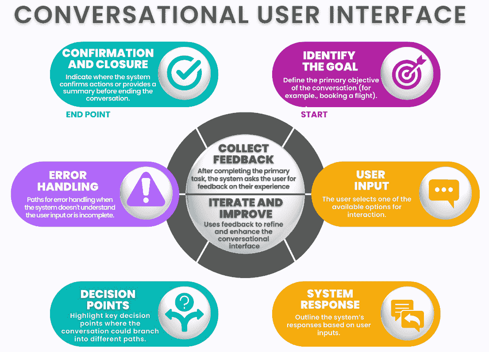

# 新兴现实与界面

本章将深入探讨新兴现实和界面的创新领域及其在网页开发中的变革性作用。首先，我们将探讨如何将前沿技术，如**虚拟现实**（**VR**）和**增强现实**（**AR**），集成到网页平台中。这些技术不仅通过沉浸式体验增强用户互动，还为用户参与和界面设计开辟了新的可能性。

接下来，我们将讨论**对话式用户界面**（**CUI**）在网页开发中的发展和影响。在这里，我们将重点讨论如何利用**自然语言处理**（**NLP**）和机器学习（ML）来创建能够提供无缝、直观的用户互动的界面，从而有效地模拟人类对话。

最后，我们将讨论普适计算及其在网页开发中的应用，重点介绍这项技术如何为个人助理提供支持，并通过普及计算环境拓宽网页应用的功能。

本章将涵盖以下主题：

+   VR/AR 与网页开发

+   探索 CUI 与网页开发

+   普适计算与网页开发

本章结束时，你将掌握对任何现代网页开发者至关重要的基本技能。你将知道如何将 VR 和 AR 技术集成到网页开发中，通过沉浸式体验增强用户参与感。此外，你将精通创建对话式界面的艺术，促进无缝的用户互动，使数字沟通如同面对面的对话一样自然。更重要的是，你将具备通过应用普适计算技术，创建无缝用户体验的能力，确保你的网页应用尽可能普及且用户友好。

# VR/AR 与网页开发

VR 和 AR 是正在重塑数字化领域的变革性技术。这两项技术在提升我们与网页互动的方式方面具有巨大的潜力。

VR 是一种沉浸式体验，用户被带入一个三维的计算机生成环境中。这通常通过使用 VR 头戴设备实现，头戴设备能够跟踪用户的头部运动，使他们能够像身临其境一样环顾虚拟环境。VR 有能力将我们带入新的世界，从探索海洋深处到在火星表面漫步。

AR（增强现实）是一种将数字信息叠加到现实世界中的技术。通过使用智能手机、平板电脑或更专业的设备，如 AR 眼镜，可以实现这一技术。AR 通过添加数字元素或*增强内容*，如地图上的方向、体育比赛中的玩家统计信息，甚至房间中的虚拟家具，来增强我们对现实世界的感知。

虽然这两种技术都提供沉浸式体验，但它们的使用方式不同，并且对 Web 开发的影响也各不相同。

## AR 硬件要求和兼容性

创建 AR 体验涉及不同的硬件要求，主要集中在将数字信息与物理世界融合。

大多数 AR 应用可以通过*移动设备*（智能手机和平板电脑）访问，这些设备配备有摄像头和传感器。这些设备必须支持 AR 框架，如 iOS 的 ARKit 或 Android 的 ARCore，以确保兼容性和性能。

专门的**增强现实眼镜**，如微软的 HoloLens 或 Magic Leap，提供更沉浸的 AR 体验。这些设备需要与正在开发的软件和应用程序兼容，确保它们能够准确地将数字信息叠加到现实世界中。

新兴的 AR 技术包括*可穿戴设备*，如 AR 隐形眼镜或头戴设备，这些设备能够无缝融入日常生活。确保与现有的 AR 平台和软件兼容对于开发有效的 AR 应用至关重要。

*VR 头显*，如 Oculus Rift、HTC Vive 和 PlayStation VR，是创造沉浸式体验的关键。这些头显需要与高性能的 PC 或游戏主机兼容，能够平滑地渲染复杂的 3D 环境。

*运动控制器或手套*是用户与 VR 环境交互所必需的。这些设备必须与所选的 VR 头显兼容，并能够进行精确追踪，以提供无缝的交互体验。

*追踪系统*，包括传感器或摄像头，对于追踪头部和身体动作至关重要。追踪系统与 VR 头显之间的兼容性是确保在 VR 空间内进行准确和响应迅速交互的关键。

高性能**计算能力**是处理 VR 应用程序密集的图形和处理需求所必需的。这通常涉及配备强大 GPU 和充足 RAM 的 PC 或游戏主机，以平滑渲染沉浸式环境，避免卡顿。

总结而言，开发有效的 AR 和 VR 应用需要仔细考虑硬件兼容性和性能需求。确保设备能够支持必要的软件框架，并提供流畅、沉浸式的体验至关重要。当我们超越这些技术考虑时，解决 VR 和 AR 技术面临的更广泛挑战和限制同样重要。理解这些障碍并寻求创新解决方案，将是释放这些变革性技术全部潜力的关键。

## 挑战与限制

尽管有巨大的潜力，VR 和 AR 技术仍面临一些挑战和限制，必须加以解决，才能实现广泛采用和有效实施。

采用 VR 和 AR 技术的主要障碍之一是设备的高成本。VR 头显、AR 眼镜以及所需的计算能力可能非常昂贵，这限制了许多用户和开发者的可及性。此外，开发高质量的 VR 和 AR 体验通常需要在专业软件和硬件上进行大量投资，进一步增加了成本。

VR 和 AR 设备的数据收集功能引发了重大隐私问题。这些技术能够捕捉大量关于用户行为、环境和互动的信息，可能导致未经授权的数据使用或泄露。确保强有力的数据保护和用户同意机制对于解决这些问题至关重要。

VR 和 AR 的沉浸式特性可能引发道德问题，特别是在内容创作和消费方面。对有害活动的逼真描述、用户成瘾问题以及对心理健康的影响是值得关注的领域。开发者必须建立道德指南，并考虑其 VR 和 AR 应用程序对社会的影响。

开发 VR 和 AR 体验需要克服一些技术挑战，包括确保平稳的性能、最小化延迟以及实现精确的跟踪。这些挑战需要高级技术知识和资源来有效解决。

## 潜在解决方案

解决 VR 和 AR 技术的挑战和局限性需要几种策略：

+   **成本降低**：技术进步和市场竞争的加剧可能会推动 VR 和 AR 硬件成本的降低。此外，利用开源软件和工具可以减少开发成本，并促进协作社区的建设。

+   **增强隐私保护**：实施强加密和数据保护协议可以帮助保护用户数据。透明化数据的收集、使用和存储方式对于建立用户信任并确保知情同意至关重要。

+   **道德发展**：为虚拟现实（VR）和增强现实（AR）内容创作建立行业范围的道德指南有助于减少潜在风险。优先考虑可及性并确保 VR 和 AR 体验中的多元化代表性，可以创造更公平和更具吸引力的数字环境。VR 和 AR 正在重塑数字景观，提供沉浸式和增强式体验，显著提升我们与数字内容的互动方式。

通过了解硬件需求、解决挑战并实施最佳实践，开发者可以创建创新且符合道德标准的 VR 和 AR 应用程序，提升用户体验并推动技术进步。

## VR/AR 在网页开发中的应用

VR/AR 在网页开发中的整合是一个快速发展的领域。随着基于 Web 的 VR/AR 库和框架的出现，如 A-Frame 和 React 360，开发者现在拥有了在 Web 上创建 VR/AR 体验所需的工具。

A-Frame 是一个基于 Web 的 VR 开发框架，允许开发者使用 HTML 创建 VR 体验。这使得 VR 对那些已经熟悉 HTML、CSS 和 JavaScript 的 Web 开发者更具可访问性。它提供了一个声明式、可扩展和可组合的结构，能够处理 Web 上 VR 的复杂性。

React 360，另一方面，是一个基于 React 创建 VR 和 AR 体验的框架。它允许开发者使用相同的组件模型，在 VR/AR 中创建复杂的用户界面，正如他们用 React 创建网页应用程序一样。它提供了一种强大的方式来创建沉浸式 3D 体验，可以在 VR 头显和浏览器中运行。

两个框架都提供了一系列功能，帮助开发者在网页上创建 VR/AR 体验，包括支持控制器输入、文本渲染、360 视频支持等。

## 打造沉浸式数字体验

创建沉浸式数字体验时，VR/AR 不仅仅是技术本身。它还需要理解 VR/AR 的设计原则，仔细考虑用户互动，并有意识地考虑可访问性。

VR/AR 的设计原则不同于传统网页设计的原则。例如，在 VR/AR 中，空间是一个关键因素。开发者需要考虑用户如何在虚拟环境中移动和互动。此外，VR/AR 中的用户界面通常是三维的，这需要采取不同的用户界面设计方法。

VR/AR 中的用户互动也不同于传统 Web 上的用户互动。用户在 VR/AR 中可能通过指向、抓取，甚至走动来与界面互动，而不是点击和滚动。这要求开发者仔细思考用户如何与用户界面互动，以及如何促进这些互动。

可访问性是创建沉浸式数字体验时的另一个重要考虑因素。确保 VR/AR 体验对所有用户都可访问，包括残障人士，至关重要。这可能包括提供替代控制选项、确保文本可读性，并考虑诸如晕动症等问题。

## VR/AR 在 Web 开发中的实际应用

VR/AR 在 Web 开发中的应用广泛且多样化。在这里，我们将深入探讨一些最具创新性和影响力的应用，它们正在改变各个行业并重新定义用户体验：

+   **虚拟零售商店**：VR 正在通过创建虚拟零售商店来彻底改变零售行业。这允许用户像在真实商店中一样*走*进商店并*查看*产品。这种沉浸式购物体验可以增加用户参与度，并为企业提供独特的销售主张。例如，想象一下像 IKEA 使用的 VR 设置，用户可以虚拟地导航精心设计的商店布局，并通过查看细节或在房间环境中可视化不同的颜色和配置来与家具互动。

+   **沉浸式房地产参观**：AR 正在被用于创建沉浸式房地产参观，让用户无需离开家就能“参观”房产。这不仅节省时间，还能让用户从传统参观中无法体验到的角度观看房产。比如，像 Zillow 这样的房地产应用程序使用 AR 提供虚拟开放日参观。

+   **互动教育**：VR/AR 正在通过创建互动学习体验来改变教育。从虚拟实地考察到互动教科书，这些技术正在增强学生的参与感并改善学习成果。像 Google Expeditions 这样的教育平台使学生能够踏上全球虚拟实地考察之旅——从海底的珊瑚礁到火星表面。

+   **医疗培训**：VR/AR 正在通过提供真实的模拟来培训医疗专业人员。这让他们能够在安全的环境中练习操作并犯错，然后再进行真实的手术。像 Osso VR 这样的应用程序通过高度详细的虚拟模拟提供外科手术训练。外科医生可以在无风险的环境中练习复杂的手术程序，提升技能，同时避免在真实患者身上实践时所带来的伦理问题和压力。

+   **产品原型设计**：AR 正在用于产品设计和原型制作，让设计师可以在现实世界中可视化并与 3D 模型进行互动。这不仅能加快设计过程，还能促进协作。Autodesk 的 VRED 技术允许汽车设计师创建并与新车型的 3D 模型进行互动。工程师和设计师可以评估外观与功能，直接在 AR 环境中进行虚拟风洞测试或模拟制造过程。

+   **虚拟工作空间**：随着远程工作的兴起，VR 正在被用于创建虚拟工作空间。这些空间让远程团队能够在共享的虚拟环境中进行协作，提升沟通与团队合作。像 Microsoft Mesh 这样的工具使得团队可以在虚拟空间中开会，像面对面一样进行合作、共享和互动 3D 内容。这项技术弥合了远程团队成员之间的鸿沟，促进了模拟真实办公互动的协作环境。

+   **文化保护**：VR/AR 正在用于保护和分享文化遗产。从历史遗址的虚拟游览到博物馆中的互动展览，这些技术使得世界各地的人们更加容易接触到文化。像 CyArk 这样的项目正在利用 VR 数字化捕捉和存档世界的文化遗产遗址。这使得全球能够访问濒危遗址，并能深入探讨历史背景，对于教育和保护工作具有无价的意义。

展望未来，显然 VR/AR 将在网页开发中扮演越来越重要的角色。随着技术的不断发展和变得更加普及，我们可以预见到 VR/AR 在网页开发中的应用将更加创新。通过跟上这些趋势，网页开发者可以利用这些强大的技术创造出沉浸式且富有吸引力的网页体验。

现在我们已经探索了 VR/AR 在网页开发中的变革潜力，重要的是要认识到这些技术为各个领域带来的深度参与和创新。从虚拟零售环境到沉浸式教育工具，VR/AR 不仅提升了用户体验，还为网页开发中的创意和有效解决方案开辟了新的途径。

下一部分将深入探讨 CUI 如何重新定义用户与网页应用程序的互动方式，提供更加直观和类似人类的沟通体验。

# 探索 CUI 和网页开发

在提升与用户在网页平台上互动的过程中，作为开发者，我们面临着让界面更加直观和响应迅速的不断挑战。CUI 正作为一种有前景的解决方案，采用先进的 NLP 技术创造更自然和引人入胜的体验，开发直观的对话流程，将合适的个性和语气融入界面，实施上下文感知的回应，并进行持续的测试和迭代。

一个成功的 CUI 的显著例子是 *Google Assistant*，它利用复杂的自然语言处理（NLP）算法，提供上下文感知的个性化回应，从而增强了用户参与感和满意度。

## 运用 NLP 技术

在我们致力于通过 CUI 提升人机交互的过程中，先进的 NLP 技术的应用至关重要。我们致力于理解和实施最前沿的 NLP 实践，以确保我们的界面不仅具有功能性，还能提供引人入胜的互动体验。

让我们探索构建复杂对话系统的关键步骤：

1.  **理解用户意图**：通过语义分析准确理解用户意图是我们的基础步骤。我们采用在大量数据集上训练的语言模型，使其能够把握人类语言的细微差别。这些模型是制定符合用户期望并丰富对话的回应的基础。例如，当用户问到 *今天巴黎的天气怎么样？* 时，模型能识别出其意图是请求天气信息，而不是关于巴黎的地理细节。

1.  **标记化和解析**：我们利用标记化和句法解析将文本输入分解为更小的组成部分，以便更容易解释用户的请求。这一过程使我们能够识别和提取句子中的关键实体和关系，这对于提供相关和精确的响应至关重要。例如，在句子*Book a flight to New York on Friday*中，标记化有助于将*New York*分离为目的地，将*Friday*分离为旅行日期。

1.  **词义消歧**：解决多义词的挑战，我们应用消歧算法基于上下文正确解释用户意图。这在上下文迅速变化的复杂对话中至关重要。例如，在*I need to visit the bank*和*I sat by the river bank*中区分*bank*的用法。

1.  **实施注意力机制和递归神经网络**：为了在交互会话中保持上下文，我们使用注意力机制和递归神经网络。这些模型确保我们的系统不仅仅响应孤立的输入，而是考虑整个对话流程，根据互动动态调整响应。这种方法允许系统记住对话早期部分，例如在做推荐时记住用户早期表达的偏好。

下面是一些具体示例，说明这些先进技术如何被整合到不同领域中，以增强用户参与度和效率，从而将日常互动转化为无缝的数字体验。

+   **电子商务**：在在线购物环境中，我们基于 NLP 的 CUI 可以通过回答产品相关问题、处理退货或根据先前交互推荐商品来协助客户。

+   **客户支持**：NLP 技术使我们的 CUI 能够及时且具有上下文意识地为客户查询提供解决方案，显著缩短响应时间，提高客户满意度。

+   **医疗保健**：对于远程健康平台，我们的 CUI 能够解释患者用自然语言描述的症状，并提供初步建议或将对话引导到适当的医务人员。

通过这些先进的 NLP 技术，我们不断增强我们的界面理解和有效沟通的能力，使用户交互像人与人之间的对话一样自然。这不仅改善了用户体验，也为 Web 上的会话界面开发设定了新标准。

探索了先进的 NLP 技术如何显著提升界面进行自然有效沟通的能力后，我们认识到其对 Web 开发的转变性影响。在下一节中，我们将揭示如何构建对话结构，以自然地引导用户进行交互，确保无缝愉快的体验。

## 设计直观的对话流程

在构建 CUI 时，创建直观的对话流程至关重要，以确保互动不仅有效，而且令用户感到愉快。我们力求开发能够逻辑且自然地引导用户的流程，确保顺畅和连贯的体验。

设计对话流程的第一步之一是*详细规划可能的用户旅程*。通过理解互动的目的和用户的需求，我们可以构建预见并有效响应这些需求的对话。

*图 17.1* 展示了 CUI 中的一个典型对话流程示例。这个对话流程代表了用户与自动化系统（如虚拟助手）之间的典型互动场景。流程图详细说明了引导用户直观且高效地实现目标的关键步骤，无论是预定航班、查询航班状态，还是取消预订。结构包括识别对话目标、规划用户输入、概述系统响应、突出决策点、处理错误和确认操作。此外，还强调了收集用户反馈并基于该反馈不断改进系统的重要性：

图 17.1：CUI 流程

图中展示的 CUI 对话流程的可视化强调了一个结构良好的互动的关键元素。通过定义明确的目标、规划潜在的用户输入和概述系统响应，CUI 可以提供自然且有效的用户体验。收集反馈和不断改进的过程确保了界面不断发展，更好地满足用户需求。例如，对于航班预订服务，我们的对话流程设计能够按顺序和逻辑地收集目的地、日期和旅行偏好的信息，使用户能够轻松完成任务，而不产生冗余或混淆。

我们还实现了允许用户在对话中主动参与的系统：

+   **入口点**：我们设计了灵活的入口点，让用户能够输入命令或改变对话主题，而不会丢失先前的上下文。这种方法对于保持对话的自然性和适应性至关重要，尊重用户的自主性。

+   **错误恢复机制**：在对话流程中包含错误恢复机制是必不可少的。这意味着当发生误解时——无论是由于模糊的用户输入还是语音识别失败——我们的系统都能够礼貌且高效地请求澄清，引导用户重新回到期望的对话路径，而不产生沮丧感。

此外，不断迭代和测试与真实用户的对话流程是我们设计过程中的重要部分：

+   **收集反馈**：我们收集详细反馈，识别摩擦点和改进机会。

+   **迭代和改进**：根据反馈，我们调整流程，确保每一次互动都更加契合用户期望。

通过设计直观的对话流程，我们不仅简化了用户与计算机的互动，还丰富了用户体验，使技术变得更易于访问和更有趣。我们的目标始终是创造表现得不再像机器，而更像是智能、理解的伙伴的 CUI。

## 将个性和语气融入界面

在开发 CUI 时，我们的主要关注点之一是确保互动不仅具有功能性，而且能够在情感上与用户产生共鸣。这可以通过将适当的个性和语气融入界面来实现，这一策略将基础的数字体验转化为丰富且引人入胜的互动。

首先，我们需要识别目标受众和界面使用的上下文，从而定义一致的语气。例如，针对零售环境中的客户服务设计的 CUI 可能会采用友好和热情的语气，而在线银行服务的界面可能会采用更正式且值得信赖的语气。

我们将通过一个示例来说明这些原则如何在实践中应用。

在比较 Siri 和 Alexa 的对话风格时，可以明显看出它们在设计和用户互动上的不同之处。苹果的 Siri 旨在吸引广泛的 iPhone、iPad 和 Mac 用户群体，其中包括各个年龄段和专业背景的人。Siri 的语气友好、随意且富有人情味，常常融入幽默和非正式语言，创造一种轻松且易于接近的互动体验。这种风格帮助用户在执行各种任务时感到舒适，例如设定提醒、发送信息、提供方向和回答琐事问题。Siri 的语气在不同的上下文中始终保持友好，确保了令人愉悦的用户体验。

相比之下，亚马逊的 Alexa 面向使用 Amazon Echo 及其他 Alexa 启用设备的用户，重点关注智能家居爱好者和经常使用亚马逊服务的用户。Alexa 的语气专业而温暖，旨在提供帮助和高效。与 Siri 相比，这种语气略显正式，突出可靠性和能力。Alexa 在管理智能家居功能（如控制灯光和温控器）、执行购物、提供信息和播放音乐等任务时表现出色。语气直接且务实，非常适合家庭和娱乐系统管理的环境。

总体来说，Siri 偏向于友好和幽默的语气，让互动感觉像是与一个伙伴对话，而 Alexa 则采用更为正式和专业的语气，优先考虑效率和可靠性。两者都会根据具体任务调整语气，但 Siri 通过个性和机智吸引用户，而 Alexa 则专注于提供清晰且可操作的回应。理解这些细微差别使得开发者能够更好地定制 CUI，以适应目标受众和场景，确保互动既高效又引人入胜。

在 CUI 中实现一致的个性包含多个要素：

+   **词汇选择**：我们精心挑选反映所需个性的词语，确保每条信息都传达合适的语气。这包括使用可以识别的表达和短语，营造亲切感和信任感。

+   **回应风格**：回应的风格会根据品牌的个性进行定制。例如，一个年轻且充满活力的品牌可能会采用更为轻松直接的语言风格。

+   **情感反馈**：我们使 CUI 能够识别并回应用户的情感线索，根据感知到的情感状态调整互动。这可能包括在用户感到沮丧时使用同理心，或者在用户表达满意时展现热情。

此外，一致性是维持界面个性在整个互动过程中完整性的关键。这意味着对话的每个部分都应强化相同的品牌形象，从初次问候到互动结束。语气和个性的统一有助于与用户建立更强大、更可信赖的关系。

最后，个性和语气不仅仅关乎界面说什么，而是如何说。加入语速、语调和音量的变化可以让 CUI 的声音听起来更自然、更具个性。这些细微之处显著提升了用户体验，使其更加丰富和令人满意。

通过有效地融入个性和语气，我们将 CUI 从单纯的沟通工具转变为虚拟代表，反映并加强品牌身份，显著提升用户互动体验。

随着我们深入优化 CUI，聚焦于融入情境感知回应变得尤为重要。这种方法通过使互动更加相关和个性化，显著提升了互动质量，确保用户感到被真正理解。接下来，让我们进入下一部分，讨论如何在 CUI 中实现情境感知回应。

## 实现情境感知回应

在 CUI 的发展过程中，提供上下文感知响应的能力标志着我们与用户互动方式的显著进步。根据对话的上下文进行理解和响应，不仅提高了互动的有效性，还通过使体验更加个性化和相关性强，丰富了用户体验。

要实施上下文感知响应，我们必须遵循一个详细的方法：

1.  **上下文分析**：我们首先分析用户所处的上下文。这包括理解对话历史、用户的环境，甚至时间和地点（如果适用）。例如，一个餐厅预订系统可能会建议用户附近的餐厅，或者考虑当前时间来推荐早餐或晚餐选项。

1.  **上下文建模**：我们使用能够在整个对话过程中维护和更新上下文状态的 AI 模型。这些模型经过训练，能够检测对话中的重大变化，并根据这些洞察调整响应。例如，如果用户在交互中提到自己很急，系统可能会选择简化选项并加快响应过程。

1.  **动态响应**：响应不仅仅基于用户说过的话，还会考虑到积累的上下文信息。这使得 CUI 能够提供看似直观地量身定制的解决方案，贴合用户的需求和当前情况。

1.  **反馈与持续学习**：系统持续接收用户反馈，以提高上下文响应的准确性和相关性。这包括实时数据分析和基于机器学习的调整，以精细化上下文建模和响应生成。

此外，确保系统能够有效处理歧义和解读错误也至关重要。在上下文不明确或用户输入模糊的情况下，系统被设计为能够智能且尊重地请求澄清，确保对话能够顺利且连贯地进行。

通过实施上下文感知响应，我们不仅增强了 CUIs 的实用性，还创造了一种真正理解和重视用户的体验。这增强了用户的信任和忠诚度，这对于任何数字平台的长期成功至关重要。

当我们深入探讨实施上下文感知响应的细节时，必须反思所获得的洞察和在创建真正能与用户产生共鸣的 CUI 方面所取得的进展。现在，让我们转向探索测试和迭代这些界面的关键步骤。这个阶段对于确保我们的 CUI 不仅在各种场景下正常运行，而且能根据用户的互动和反馈不断进化和改进至关重要。

## 测试和迭代对话界面，以提供最佳的用户体验

在完善 CUI 的过程中，持续的测试和迭代发挥着至关重要的作用。我们的目标不仅是创建功能性的界面，更是提供异常丰富且直观的用户体验。为此，我们必须采取严格且细致的测试与迭代过程：

1.  **定义成功指标**：在开始测试之前，我们会设定明确的成功指标，包括任务完成率、用户满意度和响应效果。这些指标帮助我们准确评估 CUI 在实际使用场景中的表现。

1.  **可用性测试**：我们会与真实的代表目标用户群体的参与者进行可用性测试。在这些测试中，我们观察用户在各种场景下与 CUI 的互动，以识别可用性问题和摩擦点。直接观察让我们能够调整对话流畅性、响应理解能力和对话导航效率等元素。

1.  **反馈分析**：每次测试结束后，我们都会收集用户的详细反馈，包括他们的定量和定性印象。我们分析这些反馈，识别出模式和趋势，从而找出界面可以改进的地方。

1.  **快速迭代**：基于获得的洞察，我们会迅速对 CUI 的设计和功能进行迭代。我们不断进行调整和改进，然后再次进行测试，以验证这些调整是否带来了实际的改进。这个反馈和迭代的循环对于不断发展我们的界面至关重要，使其能够越来越满足用户的期望和需求。

1.  **A/B 和多变量测试**：为了验证变更，我们经常进行 A/B 和多变量测试。这使我们能够比较 CUI 的不同版本，以确定哪些变更在用户参与度和界面效果方面产生最佳结果。

1.  **持续监控**：即使在部署后，我们仍然继续监控 CUI 的表现。我们使用先进的分析工具来跟踪用户随时间与界面的互动方式，从而在出现新的挑战和机会时，能够做出主动调整。

通过在 CUI 开发中采用迭代方法，我们确保我们的技术不仅满足而且超越用户的期望。这个持续测试和优化的过程对于保持我们的 CUI 在技术和可用性方面的领先地位至关重要。

反思通过持续测试和迭代来完善我们 CUI 的细致过程，突显了适应性和响应性在技术开发中的重要性。接下来，我们将把注意力转向网页开发中的普适计算概念。这个创新领域将计算能力扩展到传统设备之外，将其融入到日常生活的方方面面。

# 普适计算与网页开发

普适计算，或称*ubicomp*，是将计算融入日常环境中。我们利用这一技术的目标是创造人与数字信息之间的无缝互动。通过将计算过程嵌入到日常活动的背景中，我们增强了用户与数字设备的自然互动，使技术成为他们行动的直观延伸。

在智能家居中，普适计算使得住户能够无缝且直观地与他们的生活环境互动。诸如智能恒温器、照明系统和安全摄像头等设备，可以通过智能手机或语音命令远程控制。例如，智能恒温器学习用户的日常习惯，并据此调整温度，提供舒适感并节省能源。智能照明系统可以根据居住者的活动或时间自动开关，提高便利性和能效。

在城市环境中，普适计算在提高城市效率和宜居性方面发挥着重要作用。例如，智能交通管理系统使用传感器和摄像头实时监控交通状况。这些数据经过分析，用于优化交通灯的时序、减少拥堵和提高安全性。另一个应用是在智能停车系统中，传感器检测可用的停车位，并通过移动应用引导司机到达这些停车位，从而减少寻找停车位的时间，缓解交通拥堵。

通过集成这些技术，普适计算改变了我们与数字设备的日常互动，使技术成为我们日常生活的内在部分。计算在我们环境中的无缝集成增强了用户参与感和互动性，使数字体验更加直观和有效。这些进展不仅展示了普适计算的实际应用，还突显了其在提升个人和公共领域效率和生活质量方面的潜力。

## 关键技术

普适计算的基础设施涉及几种复杂的技术，每种技术都有助于这些系统的无缝特性。让我们来看看这些技术：

+   **传感器和物联网设备**：这些设备从其环境中收集大量数据，从温度到用户互动，实时做出响应和调整。挑战在于传感器数据融合和解读，确保系统能够做出准确且具有上下文意识的响应。

+   **云计算**：云计算对于处理大量数据负载和复杂的处理任务至关重要，提供可扩展的资源，支持物联网设备的广泛计算需求。这包括容器化应用程序的部署和微服务架构的使用，以增强可扩展性和可管理性。

+   **边缘计算**：通过在数据生成源或其附近处理数据，边缘计算大幅减少了延迟和带宽使用，这对于需要即时处理的应用至关重要。像雾计算这样的技术通过将计算资源和逻辑从集中式云端分散到网络的边缘，扩展了这一概念。

+   **人工智能和机器学习**：人工智能和机器学习的结合使得系统能够从数据中学习，预测用户需求，并做出自主决策。这涉及复杂的算法，从用于模式识别的神经网络到基于用户交互模式进行适应性响应的强化学习。

现在，让我们将焦点转向这些技术如何在 Web 开发领域的具体应用。

## Web 开发中的应用

泛在计算显著影响着 Web 开发，使得包括以下内容的复杂应用成为可能：

+   **个人助手**：通过自然语言处理（NLP）和预测分析，这些由人工智能驱动的界面能够理解上下文，预测用户需求，并提供个性化建议。这些系统整合了深度学习模型，处理用户输入和环境数据，以提供不仅是反应式的，还包括前瞻性的响应。例如，考虑像 Siri 或 Google Assistant 这样的个人助手。Google Assistant 与包括日历、电子邮件、地图和智能家居设备在内的多种服务集成，提供个性化建议。它能够根据实时交通数据和用户习惯建议会议的出发时间，基于先前的用餐偏好推荐附近的餐馆，甚至为邮件中提到的任务提供提醒。这种跨各种服务的无缝集成使 Google Assistant 能够提供量身定制的建议，融入用户的日常生活和个人偏好。

+   **智能家居与办公室**：家居和办公室中的自动化系统根据用户偏好和学习到的行为实时调整环境参数，如照明和温度。挑战在于创建能够解读各种数据类型并实时作出决策的算法，从而优化环境条件，以提高舒适度和能效。一个实际的例子是 Nest 恒温器，它根据用户行为模式和偏好的变化调整温度。它能够感知是否有人在家，并在无人时调整加热或冷却以节省能源，同时当预见到居民将返回时，它会提前准备好环境。

+   **可穿戴技术**：这些设备持续收集健康和活动数据，向用户提供洞察力和实时反馈。这里的开发重点是创建高效的数据处理算法，这些算法能在可穿戴设备有限的计算资源内运行，同时确保用户隐私和数据安全。Apple Watch 就是一个典型例子。它收集了广泛的健康数据，如心率、血氧水平和身体活动。这些数据不仅帮助用户实时监控健康状况，还能让设备提供个性化的反馈，例如在长时间坐着后提醒用户站起来，或者提供每月健康趋势的总结。

无处不在的计算技术对社会的影响巨大，通过更加直观且不那么突兀的技术互动提升了日常生活和工作效率。我们的持续研究与开发旨在推动这些技术的边界，聚焦于先进的算法、系统集成和以用户为中心的设计。这种不断的进步对于实现无处不在的计算在网页开发及其他领域的全部潜力至关重要。

# 总结

在本章中，我们探讨了无处不在的计算的激动人心的前沿及其在网页开发中的核心作用，特别是通过个人助手、增强现实/虚拟现实（AR/VR）整合和智慧城市技术的视角。我们深入研究了这些技术如何塑造更加互动、个性化和高效的环境，并为您如何在项目中充分利用它们的潜力做好了准备。当我们结束对无处不在计算的讨论时，我们已经为理解这些普及性技术如何无缝融入日常数字互动奠定了坚实的基础。这些知识对于我们继续创新并适应现代网页开发的需求至关重要。

接下来，我们将把重点转向人工智能领域中监管、治理和管理的关键方面。了解如何在人工智能驱动的系统中保护和管理数据，对于确保这些创新不仅能提升用户体验，还能保护用户隐私并遵守监管标准是至关重要的。
