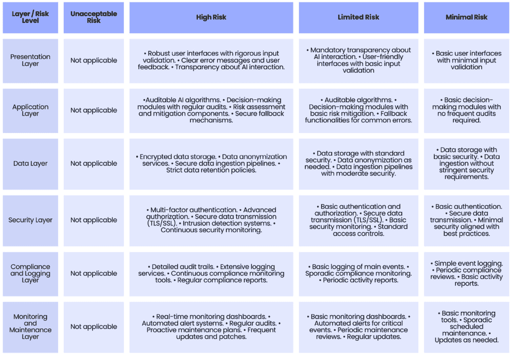
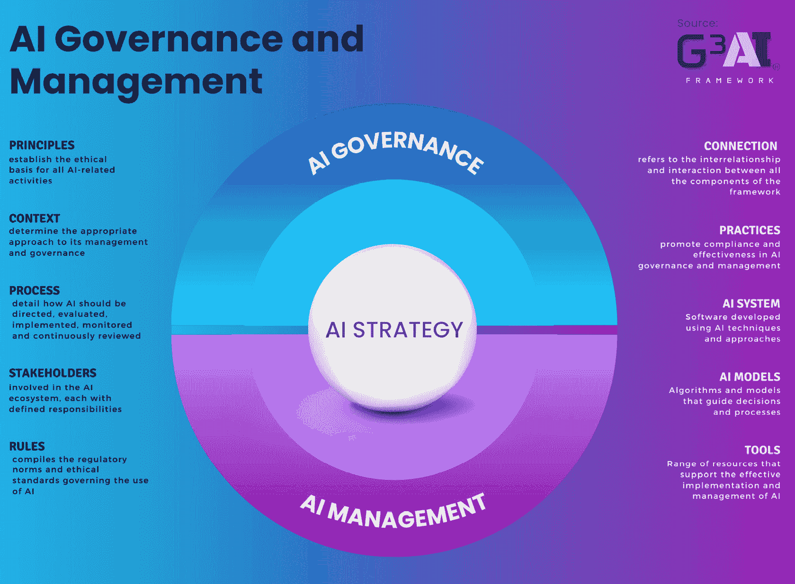
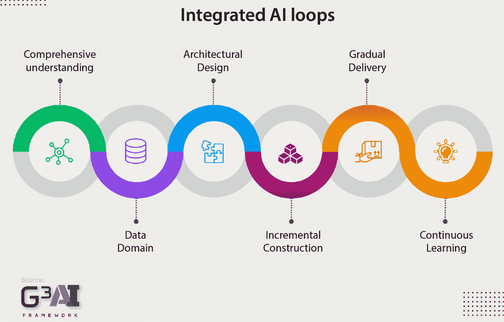

# 18

# AI 法规与治理——符合欧盟 AI 法案和 ISO/IEC 42001 标准的合规性

在这个 AI 时代，理解和遵守新兴的法规，如欧盟 AI 法案([`www.europarl.europa.eu/doceo/document/TA-9-2024-0138_EN.html`](https://www.europarl.europa.eu/doceo/document/TA-9-2024-0138_EN.html))和 ISO/IEC 42001 标准([`www.iso.org/obp/ui/en/#iso:std:iso-iec:42001:ed-1:v1:en`](https://www.iso.org/obp/ui/en/#iso:std:iso-iec:42001:ed-1:v1:en))至关重要。这些法规对指导 AI 技术的安全和伦理发展以及确保符合国际规范起着关键作用。随着 AI 渗透到各个行业，采取结构化的监管方法对其负责任且符合伦理的应用至关重要。

本章将引导您如何在网络开发背景下有效地导航和实施 AI 法规。我们将首先概述 AI 监管环境，然后详细介绍规划和实施符合这些标准的 AI 治理系统的步骤。

本章将涵盖以下主题：

+   AI 法规概述

+   G³AI 框架概述

+   AI 治理

+   AI 管理

到本章结束时，您将掌握解释和应用**欧盟**(**EU**)AI 法案所需的技能，确保 AI 系统在法律框架内开发和使用。您还将了解如何设计和实施有效的 AI 治理和管理系统，以便与组织目标和监管要求保持一致。

此外，您将能够高效管理 AI 操作，同时确保符合监管要求，进行全面的 AI 风险评估，制定减轻风险的策略，并在 AI 项目中采用持续改进策略，使其始终处于技术和监管进步的前沿。

# AI 法规概述

在 AI 在各个行业日益融合的背景下，有效的监管变得不可或缺，以确保其发展和使用是安全的、符合伦理的，并且符合社会需求。本节将探讨两大主要监管框架：欧盟的 AI 法案和 ISO/IEC 42001 标准。

## 欧盟 AI 法案

本节将探讨欧盟 AI 法案对网络中 AI 系统开发和实施的直接影响。随着 AI 不断发展，并与网络开发生态系统更深层次地融合，理解这些法规变得至关重要，以确保应用程序不仅符合法律标准，而且促进伦理和安全的实践。

### AI 法案的目的

**AI 法案**为欧盟内的 AI 制定了法律框架，旨在实现成员国之间的法规协调。其目的是创造一个有利于安全和伦理发展 AI 的环境，同时促进市场内的创新和竞争力。

一个重要的挑战是成员国之间法律和行政程序的差异。每个国家都有自己的监管机构和程序，这可能导致 AI 法案的执行存在差异。对于在多个国家运营的开发者和公司来说，这意味着需要应对不同的监管解读和合规要求。此外，各国用于执行这些法规的资源和专业知识可能存在显著差异，这可能导致规则的应用不一致。

另一个挑战是 AI 技术本身的动态性。AI 系统在不断发展，监管框架必须具备适应性，以跟上这些进展。确保法规足够灵活，能够容纳新技术的发展，同时保持严格的安全和伦理标准，是一项微妙的平衡。定期更新监管框架并为执法人员提供持续的培训是解决这一问题的必要措施。

监控合规性也是一项复杂的任务。有效的监督需要强大的机制来审计 AI 系统，这可能需要大量资源。在所有成员国统一实施这些机制既必要又具有挑战性。制定标准化的工具和流程进行合规检查有助于缓解这些困难，但这需要在欧盟层面进行大量的协调和合作。

尽管面临这些挑战，AI 法案通过统一 AI 法规带来了众多好处。统一的监管框架能够通过提供明确的指导方针并减少可能阻碍投资的法律不确定性，从而促进更大的创新。它还通过确保 AI 系统在整个欧盟范围内满足高标准的安全性和伦理要求，增进用户和公众的信任。

尽管 AI 法案为欧盟范围内 AI 的伦理和安全发展提供了关键框架，但解决不同司法管辖区内实施和监控合规性的问题至关重要。通过解决这些问题，欧盟可以确保 AI 的好处以一致、公平并有利于创新的方式得以实现。

通过明确定义法律和伦理义务，AI 法案直接影响 AI 系统如何在网络平台中整合，从设计阶段到实施和维护。开发者必须了解这些法规，以避免法律违规并确保他们的应用程序负责任且透明。

### AI 法案下的风险分类

AI 系统根据其风险级别进行审查和分类。这一分类对于确定必须采取的合规措施的强度至关重要。

欧盟的 AI 法规（AI 法案）将风险级别分类如下：

+   **不可接受的风险**：禁止使用潜意识、操控性或欺骗性技术扭曲行为并妨碍知情决策的人工智能系统。它还包括推断敏感属性的生物识别分类系统。

+   **高风险**：规范高风险的人工智能系统，如生物识别技术和其他关键系统。这些系统的提供者有特定义务。

+   **有限风险**：适用于有限风险的人工智能系统，如聊天机器人和深度伪造。这里有较轻的透明度义务。

+   **最低风险**：最低风险的人工智能系统不受监管，涵盖当前在欧盟单一市场上可用的大多数人工智能应用。

通过理解这些义务，开发者可以确保他们的人工智能系统符合《人工智能法》，促进安全、伦理和创新的应用。在接下来的部分中，我们将详细探讨实施这些合规措施时的实际挑战和策略。

*图 18**.1* ([`g3ai.global/library`](http://g3ai.global/library)) 展示了《人工智能法》下的风险分类，突出了不同的风险级别及其对应的合规措施。该图形化表示提供了人工智能系统分类的清晰概述，并揭示了它们对设计和操作的影响：

图 18.1 – 欧盟人工智能法下的风险分类（此图来自 G³ AI Global）

开发者需要了解其人工智能系统的分类，以便实施适当的安全措施。被视为高风险的系统将需要定期审计、更高的透明度以及强有力的安全协议，这将直接影响系统的架构和设计。例如，应用于医疗诊断的人工智能系统由于可能影响患者健康和安全而被分类为高风险。这一分类要求严格的安全措施、全面的日志记录和定期的合规审计，从而影响整体系统架构，确保数据完整性、隐私和系统的健壮性。

理解每种风险分类对系统架构的技术影响对于开发者设计符合规范和安全的人工智能系统至关重要。*图 18**.2* 概述了按不同风险级别分类的系统架构层次，并详细描述了每个层级的具体技术影响。这种结构化方法有助于开发者有效实施必要的措施，以确保人工智能应用的安全性、合规性和效率：

图 18.2 – 人工智能系统架构中的层次、风险级别及技术影响

*图 18.2* 提供了不同风险级别下 AI 系统架构的技术影响的清晰概述：

+   **展示层**：这一层涉及用户界面和交互机制，输入验证和 AI 交互的透明度根据风险级别有所不同。

+   **应用层**：这一层包括 AI 算法和决策模块，高风险系统需要严格的审计和风险缓解要求，而低风险系统则具有更简单的功能。

+   **数据层**：这一层涉及数据存储和管理，需要对高风险系统进行加密和严格的匿名化处理，而低风险系统遵循标准的安全做法。

+   **安全层**：这一层包括身份验证、授权和数据安全，从高风险系统的多因素认证等先进措施到低风险系统的基本安全措施。

+   **合规与日志记录层**：这一层涉及对系统活动的审计和日志记录，要求高风险系统提供详细的审计跟踪和持续监控，而低风险系统则进行基本日志记录。

+   **监控与维护层**：这一层专注于持续监控和系统维护，具备实时仪表盘、高风险系统的主动维护以及低风险系统的基本监控工具。

通过理解并实施这些架构考虑因素，开发人员可以确保他们的 AI 系统设计符合适当的监管要求，从而在不同风险级别下增强安全性和合规性。例如，分类为高风险的系统将需要定期审计、更高的透明度和强大的安全协议，这意味着架构必须支持广泛的日志记录、数据安全传输和严格的访问控制。此外，设计必须适应定期更新和监控，以遵守持续的监管要求。通过确保这些元素从一开始就整合，开发人员可以创建不仅合规且安全、值得信赖的 AI 系统。

### 协议的主要要点

在我们探讨欧盟的 AI 法案及其影响时，我们会发现，严格遵守这些标准不仅是法律义务，更是促进信任和负责任创新的杠杆。在这种背景下，我们将重点介绍开发人员在创建和管理 AI 系统过程中应整合的四个基本支柱。这些支柱作为确保 AI 技术伦理开发并符合国际规范的路线图。以下是开发人员需要考虑的关键原则：

+   **透明度和合规性**：在人工智能开发领域，清晰性至关重要。AI 模型的透明度是不可避免的要求，包括严格遵守欧盟版权法并全面披露用于训练的内容。这种做法不仅加强了最终用户的信任，还确保了人工智能应用始终在法律框架内，避免因侵犯版权而遭受严重制裁。

+   **风险管理**：人工智能开发的动态要求不断警惕相关风险。开发人员必须建立并遵循严格的风险评估协议，充分准备应对任何安全事件。持续遵守人工智能法案意味着频繁监控和调整风险缓解策略，确保 AI 系统在面对新兴威胁时保持稳健和可防御。

+   **生物识别监控和分类**：随着技术的进步，隐私和伦理问题也随之增加。对生物识别监控和生物识别分类系统的使用施加了严格的限制，反映了平衡创新与隐私的需求。开发人员面临的挑战是，在不妥协 AI 解决方案有效性的前提下，充分尊重用户身份和个人数据。

+   **不加区分的数据抓取的影响**：在数据成为新黄金的时代，数据收集的完整性至关重要。禁止无目标地收集面部图像强化了对敏感数据滥用的防范。法规的这一方面深刻影响了数据的收集方式以及用来训练 AI 系统的数据使用，要求开发人员采用更加有意识和伦理的数据获取方法。

这些方面指导人工智能和网页开发人员如何在信任、安全和伦理的基础上构建创新。通过整合这些原则，开发人员不仅遵守法规，还为其技术解决方案在全球市场上的接受和成功铺平道路。

在深入了解欧盟人工智能法案及透明度、风险管理、生物识别监控和数据收集完整性等基本原则后，你现在具备了进行伦理和合规的人工智能开发所需的基础知识。这些知识强调了将人工智能创新与监管框架对齐的重要性，从而促进负责任技术使用的文化，并增强公众信任。

在此监管基础上，我们将关注 ISO/IEC 42001，这是一项全面的国际标准，为人工智能系统的治理和管理提供框架。接下来的部分将深入探讨 ISO/IEC 42001 如何与欧盟的人工智能法案互补，提供建立、实施、维护和持续改进 AI 管理系统的结构化指南。

## 了解 ISO/IEC 42001

在今天的技术创新环境中，实施人工智能系统不仅需要技术能力，还需要强烈遵守伦理原则和法规标准。

ISO/IEC 42001 标准已经成为那些希望负责任且有效地指导人工智能工作的组织的指南针。该全球标准旨在统一人工智能管理实践，并得到了来自技术、治理和研究领域全球领先者的贡献。

在本节中，我们将解析该标准的目标、挑战、目标受众和利益。

### 什么是 ISO/IEC 42001？

**ISO/IEC 42001 标准**建立了一个国际框架，旨在为人工智能管理系统提供指导。它代表了全球在负责任地开发、实施和管理人工智能技术方面的最佳实践共识。该标准源于政府、学术界和产业界的合作，旨在帮助组织应对人工智能复杂的法规和伦理环境。

### 标准的目标

ISO/IEC 42001 设定了明确的目标，以确保所有人工智能系统在透明度、安全性和问责制方面得到开发、实施和管理：

+   促进透明和伦理的管理实践

+   保证人工智能系统处理的数据的安全性和隐私性。

+   促进与现行法律法规的持续合规。

通过对标准目标的理解，让我们深入探讨人工智能在实施和日常运营阶段所带来的具体挑战，并探索应对这些复杂问题的有效策略。

### 人工智能挑战

在网络环境中实施人工智能面临独特的挑战，ISO/IEC 42001 帮助应对所有这些挑战：

+   **伦理与透明度**：确保人工智能被公平使用，且其运作对最终用户是可理解的。

+   **数据安全**：它建立了强有力的协议，以保护敏感信息免受未授权访问和泄露。

+   **动态合规性**：它能适应全球法律和市场实践的变化，保持法规合规。

通过深入了解实施人工智能过程中组织所面临的难题，我们现在可以探讨到底是谁最能从遵循 ISO/IEC 42001 标准中受益。这将帮助我们理解，从初创企业到跨国公司，如何在各自的运营框架内有效实施这些实践。

### 目标受众

从创新型初创企业到全球跨国集团，ISO/IEC 42001 标准适用于任何使用人工智能的组织：

+   **科技初创公司**：要求从一开始就正确构建人工智能实践。

+   **跨国公司**：要求管理在多个法域内运作的复杂人工智能系统。

在理解了需要这些指南的群体之后，让我们把注意力转向实施的实际好处。这将说明遵循这些标准不仅增强了操作诚信，还提升了市场竞争力。

### 实施其带来的好处

采用 ISO/IEC 42001 带来了有形和无形的好处：

+   **增强信任**：遵守标准可以增加客户和商业伙伴的信任

+   **优化运营效率**：它促进了改善 AI 系统整体表现的管理实践

+   **市场定位**：它突显了公司作为一个致力于负责任创新的实体

在探索了采用 ISO/IEC 42001 的重要好处——如增强信任、优化运营效率和提升市场定位后——我们可以看到这些优势如何促进一个具有竞争力和伦理的运营环境。这些好处对于任何旨在负责任且高效地利用 AI 技术的组织来说，都是至关重要的。

现在我们理解了实施这些标准的价值，让我们继续讨论组织如何通过 G³AI 框架规划和实施 AI 治理与管理系统的实际操作。

# G³AI 框架概述

**G³AI 框架**代表着为 AI 的治理和管理提供统一全球方法的承诺。这个框架不仅仅是一个工具，更是与 AI 领域中的运营卓越与诚信的约定。它旨在确保 AI 系统的开发和使用符合国际公认的伦理和法律标准，同时应对整合全球不同法规和标准的挑战。

G³AI 框架的核心理念是，技术应公平和负责任地服务于人类。因此，我们制定了有助于组织部署 AI 技术的指南，这些技术不仅要满足性能和创新的期望，还要尊重基本的伦理原则。该框架设计坚固，确保所有 AI 系统的创建都考虑到其广泛的社会和法律影响。

各项法规的整合，如欧盟的 AI 法案、ISO 42.001、联合国教科文组织关于 AI 伦理的建议、OECD 的 AI 分类以及世界经济论坛的指导方针，构成了一个重大挑战。这些标准各自关注 AI 的不同方面，从透明度和数据隐私到责任和 AI 系统的安全性。复杂性在于如何协调这些法规，因为它们的关注点和要求各不相同。

## G³AI 框架的目的

G³AI 框架的开发旨在为全球范围内的 AI 系统治理和管理提供强有力的结构。该框架旨在确保 AI 的采用和实施符合伦理、安全且有效，尊重国际标准并适应多样化的监管和文化背景。它促进负责任的创新、改善治理、最小化风险并提升运营效果，从而使所有相关方受益。

G³AI 是多功能的，适用于广泛的行业，包括健康、金融、教育和工业。它设计得灵活，可以根据每个行业和背景的需求进行特定调整，确保在全球范围内的有效应用。

## G³AI 框架的结构

G³AI 框架的结构旨在指导高管、组织领导者、AI 专家和网页开发人员有效地应用 AI 治理和管理实践。本节深入探讨了框架的维度、组成部分和元模型，重点介绍这些结构如何以技术和详细的方式实施。

*图 18.3* 展示了 G³AI 框架（[`g3ai.global/library`](http://g3ai.global/library)），这是一个经过精心设计的视觉表示，旨在阐明这一创新模型的结构和基本组成部分：

图 18.3：G³ AI 框架（该图来自 G³ AI Global）

在复杂的 AI 领域，结构化的治理和管理需求至关重要，以确保 AI 实施符合伦理、可追责且有效。G³AI 框架旨在指导组织使用 AI，其基于三个主要维度：**AI 战略**、**AI 治理**和**AI 管理**。

### AI 战略

制定强有力的 AI 战略对于将组织的技术能力与其战略和监管目标对齐至关重要。这包括通过咨询识别利益相关者的期望，将已识别的收益与战略目标对齐，并规划所需的资源，包括技术、人力技能和预算。

与现有流程的整合确保了兼容性和优化，同时评估组织影响有助于识别效率提升和培训需求。强有力的治理结构对于持续的政策更新和风险管理至关重要，同时需要遵循如 ISO/IEC 42001 等标准。有效的 AI 投资组合管理包括创建商业案例和识别机会，确保可衡量且一致的收益。管理战略性 AI 风险包括持续的风险分析和缓解策略。在伦理和监管边界内推动创新，并应用持续改进实践，确保战略负责任地发展。

详细的实施计划和利益相关者管理是成功转型的关键，同时，持续的效益管理能够监控成功与可持续性。这种全面的方法确保组织能够随着技术进步进行适应并蓬勃发展，提供显著且可持续的价值。

### AI 治理

这一维度聚焦于制定和实施政策与标准，以引导 AI 的伦理和负责任使用。**AI 治理**涉及定义问责框架、制定隐私和数据安全政策，并实施确保尊重人权和公平的伦理实践。其目标是创建一个不仅促进 AI 安全发展的监管环境，同时还培养公众和利益相关者对技术的信任。

本质上，它作为一种机制，将利益相关者的需求和期望——这可以包括从员工和客户到监管者和整个社会的任何人——转化为清晰、可执行的指南。这些指南是塑造组织在 AI 技术方面行为的关键，并确定所有 AI 项目必须遵循的操作框架。

除了制定标准外，AI 治理在评估管理层是否达成这些指南方面也起着至关重要的作用。这包括不断监控和评估组织政策和战略在推动安全和伦理 AI 实践方面的有效性。这些指南，通常通过详细的组织政策和全面战略表达，不仅旨在引导日常运营，还确保 AI 的实施与组织的更广泛伦理价值和战略目标保持一致。

### AI 管理

这一维度涉及 AI 战略在组织内的实际应用，确保 AI 操作高效执行，并与组织的战略目标保持一致。

**AI 管理**包括从 AI 系统的规划和开发到其实施和持续监控的各个方面。有效的 AI 管理确保实施的技术不仅在技术上可行，而且还优化以提供可持续的战略价值。

ISO/IEC 42001 标准为 AI 管理系统提供了框架，帮助组织建立和维护有效的 AI 实践。该标准强调将 AI 战略与更广泛的商业目标整合的重要性，并通过结构化的过程确保持续改进。ISO/IEC 42001 强调的有效 AI 管理的核心方法之一是**计划-执行-检查-行动**（**PDCA**）循环。这个循环是 AI 领域持续改进的基础：

1.  **规划**：这个阶段涉及建立实现预期结果和组织 AI 政策一致的目标和流程。在规划期间，定义了 AI 策略，确定了必要的资源，建立了成功的标准，并计划采取行动，以确保 AI 解决方案满足利益相关者的需求。

1.  **执行**：这涉及实施计划好的 AI 策略和流程。在这个阶段，AI 解决方案被开发、测试并集成到现有的业务流程中。这是一个直接行动的阶段，通过算法开发、模型构建和 AI 系统执行，思想和计划通过这些步骤得以具体化。

1.  **检查**：在这个阶段，定期监控和评估 AI 系统的表现，以比较实现的结果与规划阶段设定的目标和期望。检查涉及收集和分析数据，评估 AI 解决方案的效果和效率，识别改进的领域，并确保 AI 系统的表现符合预期。

1.  **执行**：根据检查阶段获得的信息，实施纠正措施以改进 AI 流程和系统。这个阶段可能涉及对 AI 模型的调整，策略的重新调整，或操作流程的变更，始终旨在持续改进 AI 解决方案的质量和效果。

在 AI 管理中遵循 PDCA 循环允许组织开发动态和适应性 AI 实践，能够有效响应技术和市场变化。通过遵循这一循环，组织可以确保其 AI 举措与战略目标保持一致，实现期望的结果，并在时间推移中持续改进。根据 ISO/IEC 42001 倡导的 PDCA 循环的整合，确保了 AI 管理的系统性、可重复性，并能够持续取得长期成功。

## G³AI 元模型

术语 *元模型* 经常用来描述一个抽象，定义更广泛系统中各种模型之间的结构、规则和互联。元模型有助于以简化和结构化的方式解释复杂概念，建立可以复制的模式或模板。

让我们在 G³AI 框架的背景下看一下这个问题：

+   元模型使得理解 AI 系统的不同组成部分如何互动和协作更加容易，提供了战略规划和实施所必需的高层视角。

+   它定义了不同元素（如原则、流程、规则、实践和工具）的组织和使用方式，以创建有效和负责任的 AI 系统。

本框架的元模型是一个关键工具，它构建了在动态和多变的环境中开发、实施和管理 AI 的方法。它由多个组成部分构成，涵盖上下文、原则、参与者、过程、规则、实践和工具，每个部分在确保 AI 以高标准的卓越性和问责制进行开发和管理方面都发挥着至关重要的作用。

以下是 G³AI 框架元模型的组成部分：

+   **原则**：G³AI 框架的基本原则包括透明性、问责制和公平性。这些原则指导所有 AI 开发和实施活动，确保解决方案的开发符合道德和公平标准。它们促进社会福祉，并确保 AI 系统尊重基本权利，营造信任和诚信的环境。

+   **上下文**：使用 **Cynefin 框架**（[`thecynefin.co`](https://thecynefin.co)），AI 系统的操作环境被分类为简单、复杂、复杂或混乱。这一分类有助于识别 AI 应用的具体上下文，指导在每种情境中选择最合适的策略和工具。理解上下文对优化 AI 开发和管理方法至关重要，它能够使不同操作情境下的适应更加精确和有效。

+   **过程**：本部分描述了实施、监控和持续审查 AI 系统的详细过程。具有适应性和灵活性的这些过程允许快速适应技术和市场变化，确保 AI 系统持续改进并与组织的战略目标保持一致。

+   **利益相关者**：元模型的这一部分清晰地定义了所有参与 AI 生态系统的利益相关者的角色和责任、权力和影响力，从开发者和操作员到最终用户和监管者。明确的角色定义对于 AI 系统的有效治理和负责任管理至关重要，有助于促进所有利益相关者之间的高效合作和有效沟通。

+   **规则**：本部分包括必须遵守的监管规范和道德标准，以确保 AI 操作安全、符合伦理。这些规则对于防止算法偏见等问题至关重要，并确保个人数据的保护，为建立一个值得信赖和公平的 AI 环境做出贡献。

+   **连接**：这指的是框架所有组成部分之间的相互关系和互动，促进它们之间的沟通与有效合作。此部分对于确保 AI 治理和管理系统的各个部分以协同一致的方式运行至关重要。

+   **实践**：这一部分介绍了促进合规性和 AI 开发管理有效性的最佳实践和公认框架。它包括敏捷方法、DevOps 实践和 CI/CD 技术，支持 AI 系统的动态开发和持续运营。

+   **系统**：系统组件涉及支持 AI 系统所需的架构和基础设施。它包括硬件和软件配置、现有系统的集成以及可扩展性等方面。该组件对确保技术基础设施能够有效支持 AI 模型在生产和开发中的应用至关重要。

+   **模型**：该组件侧重于 AI 模型的设计、开发和验证。它包括建模技术、算法选择、模型训练与优化以及性能评估。这一层对于创建满足特定项目需求、优化效率、准确性和健壮性的 AI 解决方案至关重要。

+   **工具**：本部分描述了支持 AI 实施和管理的一系列工具，如专用软件、模板、管理工具以及商业模型，如商业模式画布（[`www.strategyzer.com/library`](https://www.strategyzer.com/library)）。这些工具对于促进 AI 战略的实际实施并支持日常运营至关重要。

这个扩展且详细的 G³AI 框架元模型为 AI 专家和网页开发者提供了坚实的基础，确保 AI 系统的开发和管理以伦理、负责任和高度有效的方式进行。

在深入了解 G³AI 框架的综合结构后，我们现在理解了在不同领域和环境中有效管理 AI 所需的多维度方法。这一对元模型的详细理解突显了原则、过程和工具之间复杂的相互作用，这对于实现伦理和负责任的 AI 治理与管理至关重要。

当我们认识到这些组件在塑造 AI 系统运营完整性中的关键重要性时，必须从理论框架转向实际应用。基于这一基础知识，让我们将注意力转向规划和实施 AI 治理与管理系统的可操作步骤。

下一部分将指导你如何将这些原则融入到你的组织战略中，确保你的人工智能（AI）项目不仅符合规定，而且与更广泛的商业目标和伦理标准战略性地对齐。

# AI 战略

AI 战略与国际标准 ISO/IEC 22989:2022（关注 AI 质量管理）紧密对接。这一对接确保了我们的 AI 项目在满足战略和企业目标的同时，也能确保其可持续性和有效性。在此过程中，我们考虑到所有利益相关方的需求，同时规划资源和能力，以应对当前需求和未来挑战。

该战略涵盖了几个关键方面：

+   **AI 战略目标**：我们必须为人工智能技术的部署和发展定义明确的战略目标。这些目标旨在提升我们的运营效率、创新服务，同时与我们的长期业务战略保持一致。

+   **资源与能力规划**：我们为支持 AI 战略规划了充足的资源和能力。这包括分配必要的技术、人力和财务资源，确保我们的 AI 项目具有可持续性，并能够适应未来的技术进步和市场变化。

+   **与组织流程的整合**：我们的 AI 战略考虑了 AI 与其他技术和业务流程的互动。通过评估 ISO/IEC 42001 标准第 4.1 节中概述的组织背景，我们确保 AI 系统能够无缝整合，支持并增强现有流程，而非干扰它们。

+   **组织影响评估**：我们必须评估 AI 对组织各个方面可能产生的影响。这包括评估 AI 如何影响运营工作流程、员工角色、客户互动以及整体服务交付。评估 AI 对组织各方面的潜在影响至关重要，具体包括以下内容：

    +   **运营工作流程**：识别通过实施 AI 所能带来的效率提升，并评估流程的自动化潜力。

    +   **员工角色**：规划员工的新技能培训和发展，同时根据新的 AI 技术重新配置角色和职责。

    +   **客户互动**：通过个性化 AI 来改善客户体验，利用 AI 定制化互动和服务。

    +   **服务交付**：提升交付服务的质量，提高服务的速度和准确性。

+   **AI 组合管理与机会评估**：管理 AI 组合包括战略性地优先处理和管理 AI 项目。这包括以下几个方面：

    +   **制定业务案例**：为每个应用案例创建业务案例，评估可行性和预期回报。

    +   **机会评估**：识别 AI 在内部流程以及产品和服务中应用的机会。

+   **AI 价值管理**：确保 AI 受益可衡量并与战略目标一致至关重要。制定价值管理框架使您能够衡量和跟踪 AI 计划提供的受益，并定期审查以调整策略，最大化提供的价值。

+   **AI 规划与转型**：制定详细的实施计划，包括创建实施路线图和管理组织转型策略的关键活动。确保利益相关者的接受和支持对于 AI 转型的成功至关重要。

+   **AI 受益管理**：这涉及识别和监控 AI 计划的预期受益，建立衡量成功的关键绩效指标，进行实施后评估以识别经验教训，并确保 AI 实践的可持续性，制定计划持续维护和改进 AI 实践，以确保组织能够适应和在技术变革中蓬勃发展。

+   **与利益相关者的互动**：我们战略的关键在于积极与利益相关者合作，定义与 AI 相关的目标和期望。这包括内部利益相关者如员工和管理层，以及外部方如客户、合作伙伴和监管者。

+   **利益相关者反馈整合**：我们必须将这些互动中收到的反馈纳入我们的 AI 战略，以确保其与利益相关者的需求和期望保持一致。这种持续的反馈和调整循环有助于优化我们的 AI 部署和管理方法。

理由

ISO/IEC 22989:2022 提供了建立 AI 质量管理系统的指导，确保 AI 战略不仅有效，而且持续改进以满足不断变化的需求。

ISO/IEC 42001 的第 4.1 节确保 AI 系统能够无缝集成，支持和增强现有流程，而不是干扰它们。

ISO/IEC 22989:2022 提供了建立 AI 质量管理系统的指导，确保 AI 战略不仅有效，而且持续改进以满足不断变化的需求。ISO/IEC 42001 的第 4.1 节确保 AI 系统能够无缝集成，支持和增强现有流程，而不是干扰它们。

通过结构化和全面的方法，组织可以制定和实施符合利益相关者期望、与战略目标一致、改进业务流程并确保遵守监管标准的 AI 战略，为企业提供显著和可持续的价值。现在，让我们转向 AI 治理的实际方面。

# AI 治理

在这一部分，我们将探讨 AI 治理，这是确保技术实施符合最高伦理和监管标准的基本支柱。

随着人工智能能力的不断发展，我们对公平和透明地管理这些技术的责任比以往任何时候都更加重要。在接下来的章节中，我们将详细阐述**人工智能治理**的关键组成部分，帮助组织在这一新的技术领域中前行。

## 构建内部控制

有效的人工智能系统治理和管理要求建立强有力的内部控制。这些控制确保人工智能系统在伦理和法律框架内运行，同时实现卓越的运营。作为人工智能审计师和人工智能治理专家，理解如何构建这些内部控制至关重要，需借鉴包括**Treadway 委员会赞助组织委员会**（**COSO**）和 ISO/IEC 42001 等多种标准，特别是第 5.1 节和第 5.2 节。

理由

ISO/IEC 42001 的*第 5.1 节*和*第 5.2 节*指导领导力的承诺以及制定能够促进伦理整合和法规遵从的人工智能政策。

**领导力**必须展现出对**人工智能整合的强烈承诺**，这包括严格遵守法规要求，并制定反映伦理和法律责任的人工智能政策。根据 ISO/IEC 42001 的第 5.1 节和第 5.2 节，组织需要遵循这些政策：

+   **领导承诺（第 5.1 节）**：确保高层管理者表现出对人工智能管理系统的领导力和承诺。这包括制定明确的政策，提供必要的资源，并营造支持伦理人工智能实践的组织文化。

+   **人工智能政策（第 5.2 节）**：制定和实施符合国际标准的人工智能管理系统政策。这些政策必须考虑伦理问题和法律要求，并确保人工智能的负责任部署。

这些政策确保人工智能实践符合国际标准，推动负责任的行为。

为了有效管理人工智能系统，明确界定人工智能管理系统的范围和适用性至关重要。根据 ISO/IEC 42001 第 4.3 节，组织必须确定人工智能管理系统的边界，确保所有与人工智能相关的活动都得到覆盖。这包括识别参与人工智能操作的流程、技术和人员，以及理解人工智能如何与其他组织流程互动。

一个强有力的**人工智能风险管理**系统对于识别、评估和减轻与人工智能系统相关的风险至关重要。COSO 框架因其全面的风险管理方法而广为认可，它为建立有效的风险管理系统提供了宝贵的见解。通过将 COSO 的原则与 ISO/IEC 42001 结合，组织可以确保人工智能风险得到系统性识别、评估和减轻。这包括以下几个方面：

+   **定期风险评估**：进行频繁的风险评估，以识别潜在威胁

+   **制定缓解策略**：制定全面的策略来应对已识别的风险

+   **持续监控**：实施持续的监控过程，以应对新兴威胁

实施**内部控制**和保障措施对于维护 AI 系统的完整性和安全性至关重要。包括以下几个方面：

+   **数据治理政策**：通过严格的数据治理政策确保数据的质量、完整性和隐私

+   **访问控制**：管理数据访问、共享和存储，以遵守 GDPR 等数据保护法规

+   **伦理指南**：将伦理指南融入 AI 开发过程，以防止偏见并确保公平性

这些控制措施符合 ISO/IEC 42001 第 5.1 和 5.2 节的要求，确保 AI 系统的全面治理和伦理管理。

**持续监控和改进 AI 系统**对于保持其有效性和合规性至关重要。ISO/IEC 42001 第 9.1 节强调了定期监控、测量和分析 AI 系统的重要性。组织应执行以下内容：

+   **跟踪 AI 性能**：实施持续监控 AI 性能的机制

+   **识别改进领域**：定期评估 AI 系统的有效性，识别改进机会

+   **适应和增强**：根据监控结果对 AI 系统进行必要的调整，与 COSO 框架的持续改进原则保持一致

投资于**培训和发展**对于建立有效的 AI 治理和管理所需的能力至关重要。组织应提供以下内容：

+   **持续教育计划**：确保员工熟悉 AI 技术、伦理考量和监管要求

+   **技能发展计划**：提升员工技能，培养负责任使用 AI 的文化，增强整体治理框架

总之，构建 AI 治理的内部控制结构涉及多方面的方法，融合伦理与法律责任、明确的范围定义、风险管理、保障措施的实施、持续监控和培训。通过借鉴 ISO/IEC 42001 和 COSO 等标准，组织可以建立一个稳健的 AI 治理框架，促进透明性、问责性和运营卓越。

在建立了对内部控制结构的全面理解后，下一步是深入探讨 AI 系统中的风险评估的实际方面。这涉及评估和分类与 AI 技术相关的风险，以确保有效管理。在下一部分中，我们将探讨如何实施一个稳健的风险评级系统。

### 风险评级

实施严格的风险分析与分类系统对于确保人工智能系统在安全和伦理边界内运行至关重要。每个 AI 系统都会被细致评估以确定其风险水平，高风险系统会受到更严格的监管。这一结构化方法不仅最小化潜在威胁，还确保与全球最佳实践的风险管理保持一致。*表 18.1*概述了欧盟《人工智能法》定义的风险类别，提供了每个类别的全面概述及其对 AI 系统开发的影响：

| **风险类别** | **描述** | **AI 系统示例** | **合规措施** |
| --- | --- | --- | --- |
| **不可接受的** **风险** | 对安全、生计和基本权利构成明确威胁的系统 | 大规模监控系统，社会评分 | 禁止 |
| **高风险** | 可能严重影响个人的安全、健康或基本权利的系统 | 医疗诊断，招聘，关键基础设施 | 定期审计，高透明度，强大的安全协议 |
| **有限风险** | 需要特定透明度要求的系统，例如告知用户他们与 AI 的互动 | 聊天机器人，虚拟助手 | 强制披露 AI 使用情况，风险减轻措施 |
| **最小风险** | 对安全或基本权利构成最小或没有风险的系统 | 垃圾邮件过滤器，音乐推荐系统 | 除了标准安全措施外，暂无具体合规措施 |

表 18.1 – 欧盟《人工智能法》下风险类别概述

本表提供了欧盟《人工智能法》下风险类别的清晰概述，描述了每个类别的风险级别、每个类别中的 AI 系统示例，以及相关的合规措施。

在欧盟《人工智能法》及 ISO/IEC 42001 第*6.1*至*6.3*节的指导下，人工智能风险评估与管理包括从分析高影响力的 AI 模型发布到逆境测试，确保所有潜在风险都被识别并减轻。

向欧洲委员会报告严重事件并保持网络安全和能源效率是防范内外部威胁的关键。

原因

欧盟《人工智能法》规定了高风险人工智能系统的具体要求，确保这些系统经过彻底评估，并遵守更高的问责制和透明度标准。

### 人工智能风险管理

风险识别与减轻是我们人工智能管理框架中的持续过程。通过详细分析，我们制定了前瞻性策略来应对潜在威胁，确保我们的 AI 系统保持安全和可靠。

原因

欧盟的人工智能法案概述了针对风险评估和缓解的具体措施，特别是针对高风险人工智能应用，要求在人工智能系统的整个生命周期内进行定期测试和风险评估。它要求制定强有力的风险处理和缓解策略，以应对与安全、隐私和数据保护相关的风险。

ISO/IEC 42001 通过概述建立、执行、维持和持续增强人工智能管理系统的结构来支持这些要求。该标准强调了管理人工智能风险的重要性，并与确保人工智能系统在定义的伦理和法律边界内运行的需求相一致。

在全面了解了风险评级和人工智能风险管理后，我们可以将注意力转向人工智能治理的另一个关键方面：数据治理。有效的数据治理确保用于人工智能系统的数据得到了负责任的管理，并且其质量、完整性和安全性得到了保障。我们将在下一部分探讨数据治理的原则和实践。

### 数据治理

我们对数据的收集、安全性和使用有严格的政策执行。我们优先保证数据的质量和完整性，确保隐私保护并提供透明的数据访问。这种数据治理水平对于维护操作完整性和在用户中建立信任至关重要。

理由

ISO/IEC 42001 强调了人工智能系统中数据安全性和隐私保护的重要性，为数据的负责任处理提供了框架。

在确立了数据治理的重要性后，我们现在可以深入探讨人工智能治理的另一个关键方面：伦理和合规。通过遵守伦理原则和法规要求，我们可以确保人工智能系统的开发和运营是负责任的。

在了解了代码助手是什么、它们提供的好处以及它们与代码生成器的区别后，我们接下来将学习如何将它们集成到工作流程中。

### 伦理与合规

制定专门的人工智能伦理规范和严格的合规性要求是我们治理框架的支柱。此外，我们不断评估人工智能的社会和文化影响，确保我们的技术对社会产生积极贡献。通过整合伦理指南并遵守合规要求，我们确保我们的人工智能系统不仅具有创新性，还具备责任感和可信度。

要全面理解这一阶段的人工智能治理，*第三章*提供了宝贵的见解。该章节深入探讨了将人工智能融入网页开发项目中的实际挑战和机遇。它分析了开发者可能面临的常见障碍，并提供了优化人工智能应用机会的策略。数据需求、模型选择和伦理考量等话题被详细讨论，提供了对该领域的全面理解。

此外，《联合国教科文组织人工智能伦理建议》为人工智能的发展提供了详细的伦理框架。该建议强调了透明性、问责制和公平性在人工智能系统中的重要性，指导开发者创建尊重人权并促进社会福祉的技术。

### 人工智能审计

定期审计用于评估我们人工智能系统的合规性、有效性和安全性。这些审计对于我们实践和系统的持续改进至关重要，确保它们始终符合我们高标准的伦理和操作要求。

理由

欧盟的《人工智能法案》和 ISO/IEC 42001 都强调了定期监测和重新评估人工智能系统的必要性，以确保持续合规并适应新的法规。

在理解这些伦理和监管基础之后，我们现在可以审视人工智能治理中透明性和问责制的关键方面。

### 透明性和问责制

我们的透明机制确保所有由人工智能系统做出的决策都是可以解释的。我们在所有操作中保持问责制，并且我们对清晰有效的人工智能实践沟通的承诺有助于建立公众信任和接受度。

欧盟的《人工智能法案》强调了高透明度的需求，特别是对于高风险的人工智能应用，要求清晰地提供涉及的逻辑、人工智能处理的意义及其后果。该法规要求人工智能系统的设计能有效支持监督和监管，确保用户和利益相关者能够理解并信任决策过程。

ISO/IEC 42001 通过要求人工智能管理系统包含问责制和可追溯性措施来支持这一目标。这些标准确保人工智能系统不仅遵守法律框架，而且能够通过透明的实践保持用户信任。

为了更深入理解这些原则，请参阅*第十五章*，该章节提供了有价值的见解。该章节深入探讨了 AI 模型治理的关键方面，强调了可信度、公平性、可靠性、稳健性、透明度和数据保护。引入了 AI **信任、风险与模型安全**（**TRiSM**）框架，探讨了确保 AI 应用道德和负责任所需的技术组件和组织治理。

原则

欧盟的 AI 法案强调高透明度的必要性，尤其是对于高风险 AI 应用，要求提供关于涉及的逻辑、处理 AI 系统的意义和后果的明确说明。它要求 AI 系统的设计方式能够实现有效监督。

ISO/IEC 42001 通过要求 AI 管理系统包括问责和可追溯性措施来支持这一目标。这些标准确保 AI 系统不仅遵守法律框架，还能够通过透明的实践维持用户信任。

通过整合*第十五章*中的概念，我们可以进一步强调 AI 治理中透明度和问责制的重要性。这些原则不仅增强了对国际标准的遵守，还促进了用户和利益相关者之间的信任与接受。

了解 AI 透明度和问责制的重要性后，让我们继续探讨 AI 治理的下一个关键方面：AI 审计。下一节将探讨定期审计如何确保 AI 系统的持续合规性、有效性和安全性。

## 绩效评估与持续改进

**绩效评估**是持续进行的，如 ISO/IEC 42001 第*9.1 节*中所述，重点关注 AI 管理系统的有效性。通过定期监控和测量，组织可以适应并改进其 AI 实践，推动响应技术和市场变化的持续改进。

欧盟的 AI 法案强调 AI 系统的持续评估和适应性，特别是对于那些被归类为高风险的系统。这项立法要求 AI 系统在其运营生命周期内进行持续评估，以确保其遵守安全、隐私和伦理标准。它规定了以下内容：

+   **定期测试和重新评估**：AI 系统，特别是那些属于高风险类别的系统，必须根据当前标准定期进行测试，并重新评估以有效管理任何新兴的风险。

+   **适应技术进步**：它承认 AI 技术的快速发展，并要求对 AI 系统进行持续更新和修改，以保持其安全性和有效性。

+   **文档和报告**：保持详细的绩效评估记录，包括任何事件或接近事故的记录，这对监管合规和改进过程至关重要

ISO/IEC 42001 提供了一个全面的框架，与著名的 PDCA 循环（持续改进循环）相一致，该循环是质量管理系统的核心。此标准特别关注以下方面：

+   **第 9.1 节 – 监控、测量、分析与评估**：本节要求组织建立系统化的方法来监控和衡量 AI 系统的绩效。包括以下领域：

    +   **绩效指标**：制定反映 AI 系统在实现预期目标方面有效性的具体指标

    +   **定期评审**：定期审查绩效数据，识别趋势、改进机会以及不合规的领域

    +   **反馈机制**：实施机制，将评估反馈融入 AI 开发和管理过程

+   **第 10.1 节 – 不合格与纠正措施**：本节强调在发现问题时及时采取纠正措施，确保 AI 系统始终在组织的风险容忍度和合规要求范围内运行。

欧盟 AI 法案对安全性和风险管理的严格要求与 ISO/IEC 42001 对持续改进的结构化方法相结合，为管理 AI 系统提供了一个强大的框架。

遵守这些标准，组织可以显著提升 AI 系统的可靠性和安全性。这是通过持续的绩效评估和对高标准风险管理的坚定承诺实现的。此外，组织还能够负责任地推动创新。通过确保 AI 应用的改进和创新是在一个强调道德实践和合规性的框架内进行的，组织能够培养负责任发展的文化。同时，保持监管合规也变得更加易于管理。通过保持 AI 系统与不断变化的法律要求和行业标准的一致性，组织可以确保其运营始终合法且合乎道德。

### AI 审计

定期进行审计，评估我们的 AI 系统的合规性、有效性和安全性。这些审计对于持续改进我们的实践和系统至关重要，确保它们始终符合我们高标准的道德和操作要求。通过遵循国际标准，如 ISO/IEC 42001 和欧盟 AI 法案，组织可以保持与不断变化的法规和最佳实践的一致性，培养对其 AI 技术的信任和责任感。

**内部审计学会**（**IIA**）开发的“三道防线模型”是一个有效的人工智能治理和风险管理的强大框架。该模型明确了组织内部的角色和责任，促进了协作并增强了整体风险管理。模型中的每一“道防线”代表了组织抵御风险的不同方面。

#### 第一线 – 运营管理

运营管理构成了三道防线模型的基础。这一线直接通过日常运营来管理风险。该线的管理者和员工负责维护有效的控制措施并执行风险管理程序。运营管理的角色包括以下方面：

+   **控制实施**：运营管理负责实施和维护内部控制，以管理和减轻与人工智能系统相关的风险。

+   **持续监控**：他们持续监控人工智能系统，确保其在既定参数内运行并遵守监管要求。

+   **实时调整**：这一线还负责对人工智能操作进行实时调整，以应对新出现的风险，并确保持续遵守道德和法律标准。

这正是开发人员、架构师、数据库管理员、基础设施管理员、安全官员、人工智能工程师和 DevOps 专家等重要角色的关键所在。这些专业人士通过合作实施、监控和调整人工智能系统，确保其稳健、合规且安全。

#### 第二线 – 风险管理和合规性

第二线侧重于制定管理和减轻风险的政策和程序。该线提供监督，确保第一线有效地管理风险。涉及以下方面：

+   **政策制定**：这一线制定全面的风险管理政策和程序，专门针对人工智能系统。

+   **风险评估**：定期进行风险评估，以识别人工智能操作中的潜在威胁和漏洞。

+   **合规监控**：确保人工智能系统遵守相关法律、法规和内部政策是关键责任。

协作对组织内部有效的风险管理至关重要。第二线通过提供管理风险所需的工具和框架来支持运营管理，并与内部审计紧密合作，确保风险管理实践的全面性和有效性。这种协作确保了统一的风险管理方法，提高了组织积极应对潜在威胁的能力。

#### 第三线 – 内部审计

内部审计提供独立的保障，确保组织的风险管理、治理和内部控制流程有效运行。这一防线提供了对第一道和第二道防线有效性的客观评估，涉及以下几个方面：

+   **独立保障**：内部审计评估组织 AI 治理框架、风险管理流程和内部控制的有效性。

+   **客观评估**：进行全面审计，以确保 AI 系统在规定的伦理和法律边界内运行。

+   **改进建议**：根据发现，内部审计人员提供可操作的建议，以提升 AI 治理和风险管理实践。

协作对于有效的风险管理和组织内部治理至关重要。内部审计人员与运营管理和风险管理紧密合作，确保已识别的风险得到充分管理，控制措施有效。这种协作方法创造了一个持续反馈的循环，促进了 AI 系统和实践的不断改进。通过共同努力，这些防线增强了组织主动应对风险的能力，并维持强健、合规的 AI 运营。

理由

欧盟的 AI 法案和 ISO/IEC 42001 都强调定期监控和重新评估 AI 系统的必要性，以确保持续合规并适应新法规。

本节介绍了 AI 治理的一些基本流程，借助公司治理结构，建立了其他组织可以遵循的模型，推动了一个 AI 技术以最大诚信和责任开发和管理的未来。

欧盟的 AI 法案和 ISO/IEC 42001 都强调定期监控和重新评估 AI 系统的必要性，以确保持续合规并适应新法规。本节介绍了 AI 治理的一些基本流程，借助公司治理结构，建立了其他组织可以遵循的模型，推动了一个 AI 技术以最大诚信和责任开发和管理的未来。

通过了解“三道防线模型”及其在 AI 治理和风险管理中的应用，我们将深入探讨 AI 管理的具体细节。

# AI 管理

通过探索**Web 开发中的 AI 管理**，我们可以沉浸在一个技术精准与伦理策略交汇的世界中，塑造数字化的未来。本节重点介绍了由 ISO/IEC 42001 和欧盟 AI 法案规定的，有效实施和管理 AI 的细致实践和基本法规。

在这一阶段，集成 AI 循环（见*图 18.4*），正如在*第三章*中概述的那样，发挥着至关重要的作用。这些循环提供了一种结构化和迭代的过程，不仅支持而且增强了 AI 在网页开发项目中的管理。

遵循这些循环，开发人员可以确保他们的 AI 系统能够持续精炼和调整，以符合 ISO/IEC 42001 和欧盟 AI 法案中描述的不断发展的标准和实践。这种集成确保了一个全面的管理系统，既动态又符合最新的监管要求。

这个框架，来自 G³ AI Global 的*图 18.4*，概述了六个相互连接的循环，每个循环都有一个具体目标。让我们更详细地探讨这些循环：

图 18.4 – 集成 AI 循环（此图来自 G³ AI Global）

集成 AI 循环管道（[`g3ai.global/library`](https://g3ai.global/library)）旨在提供一种结构化和迭代的方法，帮助高效且有效地开发和部署 Web 应用中的 AI 模型。通过结合 AI 和 DevOps 的最佳实践，该管道确保 AI 模型满足用户需求和业务目标，促进持续学习和改进的环境。

了解了代码助手是什么、它们带来的好处以及它们与代码生成器的区别后，让我们学习如何将它们集成到工作流程中。

## 规划和实施 AI 管理系统

在规划和实施管理系统时，必须精心设计，以确保其技术能力与组织的战略和监管目标对接。根据 ISO/IEC 42001 的*第 4.3 节*，明确界定 AI 管理系统的边界和适用性至关重要，特别是在网页开发的背景下，以确保所有 AI 活动能够统一且负责任地管理。

在这个阶段，强烈建议使用**AYAI 框架**，正如在*第五章*中讨论的那样，用以指导 AI 解决方案的范围和架构定义。AYAI 框架为在网页开发中集成 AI 系统提供了一种结构化的方法，确保规划和架构设计与组织的战略和监管要求完美契合。这保证了 AI 管理系统既高效又符合规定，符合 ISO/IEC 42001 标准中设定的更广泛目标。

确定 AI 管理系统的范围这一过程是至关重要的，确保所有与 AI 相关的活动都能高效管理，使 AI 操作与组织的战略和合规目标保持一致。

这是关于根据该标准确定范围的重要性和方法的详细解释：

+   **明确边界**：清楚地建立管理系统运作的边界，从而避免可能导致管理失败和意外风险的模糊性

+   **确保充分的全面性**：确保所有为有效管理人工智能所需的元素，从人力资源到技术资源，都包括在范围内

+   **促进合规性和审计**：明确的范围有助于遵守国际法规的合规过程，并通过提供清晰的框架来验证管理实践，从而促进审计

根据 ISO/IEC 42001，范围确定必须遵循一个系统化的过程，涵盖以下方面：

+   **需求分析**：考虑组织需要遵守的与人工智能相关的所有法律、法规和合同要求

+   **资产与技术识别**：识别将在系统内管理的所有人工智能资产和技术，包括硬件、软件、数据和与其他系统的接口

+   **影响评估**：评估人工智能系统在运营、安全和隐私方面的潜在影响，这将有助于确定所需的控制级别

+   **利益相关者咨询**：与内部和外部利益相关者进行交流，以获取对人工智能管理期望和需求的洞察

+   **审查与批准**：提议的范围应由适当的领导层审查和批准，以确保所有关键领域都得到覆盖，并确保范围与组织的整体战略一致

理由

确定人工智能管理系统的范围是一个基本过程，它建立了管理系统的边界和适用性，如 ISO/IEC 42001 的*第 4.3 节*中所述。

确定人工智能管理系统的范围是一个基本过程，它建立了管理系统的边界和适用性，如 ISO/IEC 42001 第 4.3 节中所述 ([`www.iso.org/obp/ui/en/#iso:std:iso-iec:42001:ed-1:v1:en`](https://www.iso.org/obp/ui/en/#iso:std:iso-iec:42001:ed-1:v1:en))。

了解如何确定人工智能管理系统的范围后，我们可以继续前进，着眼于监控和审查人工智能系统，确保它们有效且符合要求地融入组织的工作流程中。

## 人工智能管理中的持续集成/持续部署（CI/CD）

融入 CI/CD 实践可以显著提高人工智能系统开发和部署的效率和可靠性。CI/CD 实践涉及自动化流程，持续集成和部署代码更改，确保更新经过测试并无缝一致地部署：

+   **CI**：这涉及自动将来自多个贡献者的代码更改集成到共享代码库中，每天多次进行。每次集成都由自动构建验证，这让团队能够尽早发现问题。对于 AI 系统来说，CI 确保算法、数据处理管道或模型配置的更改始终根据现有标准和性能基准进行验证。

+   **CD**：这扩展了 CI，通过自动将所有通过自动化测试的代码更改部署到生产环境中。这一做法最小化了人工干预，并确保新功能、改进和修复能够快速而可靠地交付给用户。在 AI 的背景下，CD 确保模型和算法能够不断更新和部署，而不影响服务的可用性或性能。

+   **自动化测试**：自动化测试是持续集成（CI）和持续交付（CD）的核心组成部分，它涉及对代码变更运行预定义测试，以确保这些变更不会引入错误或降低性能。对于 AI 系统来说，这包括对单个组件的单元测试、数据管道的集成测试，以及对模型准确性和效率的性能测试。

+   **监控和日志记录**：实时持续监控和记录 AI 系统的性能有助于及时发现问题。可以使用 Prometheus、Grafana 以及 Elasticsearch、Logstash、Kibana（ELK）堆栈等工具来监控诸如响应时间、错误率和资源使用等指标。详细记录系统操作和用户交互的信息，有助于全面分析和故障排除。

+   **反馈循环**：建立反馈循环，将监控和用户反馈的洞察持续反馈到规划和开发阶段。这确保 AI 系统基于实际表现和用户需求不断演化，从而提高其相关性和有效性。

+   **定期审计和合规检查**：定期的审计和合规检查确保 AI 系统遵循法规要求和伦理标准。这包括审查数据处理实践、模型公平性和透明度，并确保及时解决任何偏见或伦理问题。

通过将 CI/CD 实践整合到 AI 循环中，组织可以建立一个稳健的 AI 管理框架，支持持续改进、快速适应变化，并保持高标准的可靠性和性能。这一方法符合 G³AI 框架的原则，确保 AI 系统在开发和管理过程中遵循伦理、负责任和有效的方式。

本节提供了如何在 ISO/IEC 42001 标准和欧盟立法要求的框架下，将稳健的 AI 管理实践从战略构思到运营和持续审查过程中整合的洞见，确保在网络环境中的 AI 开发是安全、伦理和有效的。

# 概述

本章中，我们探索了人工智能法规的复杂环境，特别是欧盟的人工智能法案和 ISO/IEC 42001 标准。我们首先概述了塑造人工智能技术安全与伦理发展的人工智能法规。通过这次探索，你了解了这些框架如何确保符合国际准则，并增强人工智能系统治理，包括人工智能网络通信和流程挖掘，以优化安全性和效率。

接下来，我们深入探讨了如何规划和实施与这些标准一致的人工智能治理和管理系统。你学习了如何设计和实施有效的人工智能治理系统，这些系统不仅符合监管要求，还支持组织目标。我们涵盖了人工智能系统的操作化和支持，确保你具备高效管理人工智能操作并符合规定的能力。

我们还讨论了人工智能风险评估与管理，教你如何进行全面的风险评估并实施策略来降低潜在威胁，从而确保持续的合规性和安全性。最后，我们聚焦于性能评估与持续改进，提供了促进负责任创新并跟上技术与监管发展的策略。

随着我们结束本章，实际上也是结束本书《网站开发中的人工智能战略》，我们认识到人工智能在网站开发中的深远影响和变革潜力。展望未来，人工智能将继续发展，带来新的挑战和机遇。掌握本书知识的专业人士，已做好充分准备，引领创新、保障安全并道德地指导人工智能发展，重塑数字化格局。

# 进一步阅读

+   G³ AI 全球。（2024）。*全球治理与管理人工智能（G³ AI）框架*。取自 [`g3ai.global/library`](http://g3ai.global/library)。

+   欧洲议会。（2024）。欧洲议会和理事会于 2024 年 3 月 13 日通过的关于人工智能（人工智能法案）及修改某些欧盟立法文件的统一规则的法规（EU 2024/XXX）。欧洲联盟官方公报，L XXX/XX。可访问 [`www.europarl.europa.eu/doceo/document/TA-9-2024-0138_EN.html`](https://www.europarl.europa.eu/doceo/document/TA-9-2024-0138_EN.html)。

+   欧洲议会。（2024）。*人工智能法案浏览器 | 欧盟人工智能法案*。可访问 [`artificialintelligenceact.eu/ai-act-explorer/`](https://artificialintelligenceact.eu/ai-act-explorer/)。

+   IEEE。（2011）。IEEE 指南——ISO/IEC TR 24748-1:2010 系统与软件工程—生命周期管理—第一部分：生命周期管理指南。收录于 IEEE 标准 24748-1-2011（第 1-96 页）。

+   Google. (2021). *机器学习词汇：公平性*。可在[`developers.google.com/machine-learning/glossary/`](https://developers.google.com/machine-learning/glossary/)查看。

+   PwC. (2020). PwC 伦理人工智能框架。

+   IIA. (2017). 内部审计师协会人工智能审计框架：实践应用 A 部分。载于《全球视野与洞察》。

+   IAF. (2019). *伦理数据影响评估与监督模型*。信息责任基金会。

+   ISO/IEC 42001:2023\. (2023). *信息技术 – 人工智能 – 管理系统。国际标准化组织（ISO）和国际电工委员会（IEC）*。可在[`www.iso.org/obp/ui/en/#iso:std:iso-iec:42001:ed-1:v1:en`](https://www.iso.org/obp/ui/en/#iso:std:iso-iec:42001:ed-1:v1:en)查看。

+   美国国家标准与技术研究院（NIST）。(2024 年 4 月 29 日). *人工智能风险管理框架*。可在[`www.nist.gov/itl/ai-risk-management-framework`](https://www.nist.gov/itl/ai-risk-management-framework)查看。
