# 3. 分类简介

概述

本章将带您了解分类。您将实现各种技术，如 k 近邻和支持向量机（SVM）。您将使用欧几里得距离和曼哈顿距离来处理 k 近邻算法。您将应用这些概念来解决一些有趣的问题，例如预测一个信用卡申请人是否有违约风险，或者判断一个员工是否会在公司工作超过两年。在本章结束时，您将足够自信使用分类来处理任何数据，并得出明确结论。

# 简介

在上一章中，您了解了回归模型，并学习了如何拟合一个包含单一或多个变量的线性回归模型，以及如何使用高次多项式进行拟合。

与回归模型不同，回归模型侧重于学习如何预测连续的数值（这些数值可以有无限多种可能性），而分类问题（将在本章中介绍）则是将数据划分成不同的组，也叫做类。

例如，模型可以被训练来分析电子邮件，并预测它们是否是垃圾邮件。在这种情况下，数据被分类为两种可能的类别（或类）。这种分类类型也称为**二分类**，我们将在本章中看到一些例子。然而，如果有多个（超过两个）类别（或类），那么您将处理**多分类问题**（您将在*第四章，决策树简介*中遇到一些示例）。

那么什么是真实世界中的分类问题呢？考虑一个模型，试图预测一个用户对电影的评分，其中评分只能取以下值：*喜欢*、*中立*或*不喜欢*。这是一个分类问题。

在本章中，我们将学习如何使用 k 近邻分类器和 SVM 算法进行数据分类。就像我们在上一章中做的回归一样，我们将基于清理和准备好的训练数据来构建分类器，并使用测试数据来测试分类器的性能。

我们将从分类的基础知识开始。

# 分类的基础

如前所述，任何分类问题的目标是使用训练集将数据准确地划分为相关的组。此类项目在不同行业中有很多应用，例如在教育行业中，模型可以预测学生是否通过考试；在医疗保健行业中，模型可以评估每位患者某种疾病的严重程度。

分类器是一个模型，用于确定任何数据点所属的标签（输出）或值（类）。例如，假设您有一组观察数据，包含信用良好的个人，另一组则包含信用偿还倾向上存在风险的个人。

我们将第一组称为 P，第二组称为 Q。以下是此类数据的示例：


](img/B16060_03_01.jpg)

图 3.1：示例数据集

使用这些数据，你将训练一个分类模型，该模型能够将新的观察结果正确分类到这两组之一（这是二分类问题）。模型可以找到一些模式，例如年薪超过 60,000 美元的人风险较低，或者拥有超过 10 倍的按揭/收入比率使个人更有可能无法偿还债务。这将是一个**多类别分类**练习。

分类模型可以分为不同的算法家族。最著名的几种如下：

+   基于距离的算法，如**k-近邻**

+   线性模型，如**逻辑回归**或**支持向量机（SVM）**

+   基于树的算法，如**随机森林**

在本章中，你将接触到来自前两种类型家族的两种算法：k-近邻（基于距离的）和支持向量机（SVM）（线性模型）。

注意

我们将在*第四章*《决策树简介》中为你讲解基于树的算法，如随机森林。

但是，在深入研究模型之前，我们需要清理并准备本章将要使用的数据集。

在接下来的部分，我们将使用德国信用批准数据集，并进行所有数据准备，以便进入建模阶段。我们先从加载数据开始。

## 练习 3.01：预测信用卡违约风险（加载数据集）

在本练习中，我们将数据集加载到 pandas DataFrame 中并探索其内容。我们将使用德国信用批准的数据集来判断一个人是否有违约风险。

注意

该数据集的 CSV 版本可以在我们的 GitHub 仓库中找到：

[`packt.live/3eriWTr`](https://packt.live/3eriWTr)。

原始数据集及其相关信息可以在 [`archive.ics.uci.edu/ml/datasets/Statlog+%28German+Credit+Data%29`](https://archive.ics.uci.edu/ml/datasets/Statlog+%28German+Credit+Data%29) 找到。

数据文件位于 [`archive.ics.uci.edu/ml/machine-learning-databases/statlog/german/`](https://archive.ics.uci.edu/ml/machine-learning-databases/statlog/german/)。

引用 - *Dua, D., & Graff, C.. (2017). UCI 机器学习库*。

1.  打开一个新的 Jupyter Notebook 文件。

1.  导入 `pandas` 包并将其命名为 `pd`：

    ```py
    import pandas as pd
    ```

1.  创建一个新变量 `file_url`，它将包含原始数据集文件的 URL，如以下代码片段所示：

    ```py
    file_url = 'https://raw.githubusercontent.com/'\
               'PacktWorkshops/'\
               'The-Applied-Artificial-Intelligence-Workshop/'\
               'master/Datasets/german_credit.csv'
    ```

1.  使用 `pd.read_csv()` 方法导入数据：

    ```py
    df = pd.read_csv(file_url)
    ```

1.  使用 `df.head()` 打印 DataFrame 的前五行：

    ```py
    df.head()
    ```

    期望的输出是这样的：

    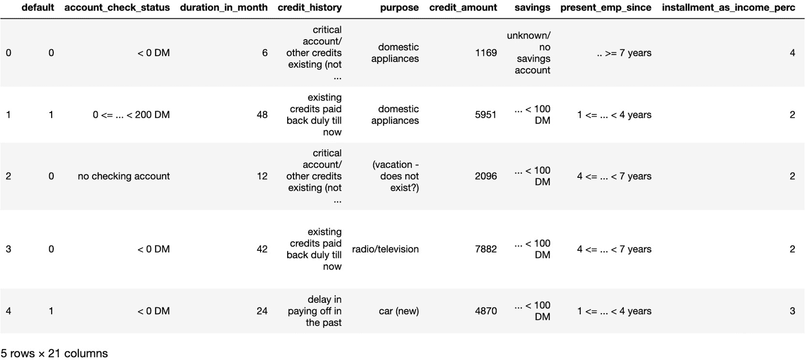

    图 3.2：数据集的前五行

    如你所见，前面的截图输出展示了数据集的特征，这些特征可以是数值型或类别型（文本）。

1.  现在，使用`df.tail()`打印 DataFrame 的最后五行：

    ```py
    df.tail()
    ```

    预期的输出是这样的：

    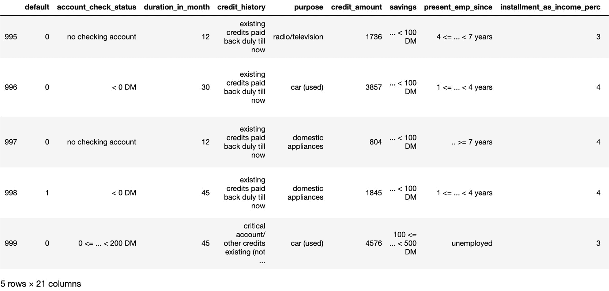

    图 3.3：数据集的最后五行

    DataFrame 的最后几行与我们之前看到的前几行非常相似，因此我们可以假设行间结构是一致的。

1.  现在，使用`df.dtypes`打印列及其数据类型的列表：

    ```py
    df.dtypes
    ```

    预期的输出是这样的：

    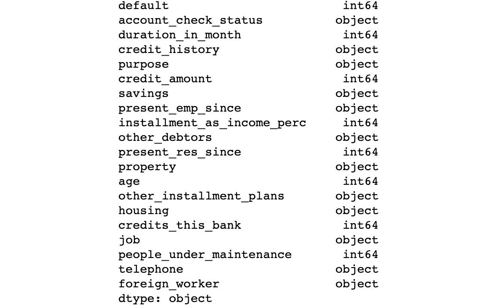

    ](img/B16060_03_04.jpg)

图 3.4：列及其数据类型的列表

注意

要访问此特定部分的源代码，请参考[`packt.live/3hQXJEs`](https://packt.live/3hQXJEs)。

你还可以在线运行此示例，网址为[`packt.live/3fN0DrT`](https://packt.live/3fN0DrT)。你必须执行整个 Notebook，才能获得期望的结果。

从前面的输出中，我们可以看到该 DataFrame 有一些数值特征（`int64`），但也有文本特征（`object`）。我们还可以看到这些特征大多数是与个人相关的细节，如年龄，或财务信息，如信用历史或信用额度。

通过完成这个练习，我们已经成功地将数据加载到 DataFrame 中，并且初步了解了它所包含的特征和信息。

在接下来的章节中，我们将讨论如何对这些数据进行预处理。

# 数据预处理

在构建分类器之前，我们需要格式化数据，以便将相关数据保持在最适合分类的格式中，并删除我们不感兴趣的所有数据。

以下几点是实现这一目标的最佳方法：

+   数据集中的`N/A`（或`NA`）值，我们可能最好将这些值替换为我们可以处理的数值。回顾上一章，`NA`表示缺失值，或者将其替换为异常值。

    ```py
    df.fillna(-1000000, inplace=True)
    ```

    `fillna()`方法将所有`NA`值更改为数值。

    这个数值应该远离 DataFrame 中任何合理的值。负一百万被分类器识别为异常值，假设只有正值存在，如前面的说明所提到的。

+   `0`) 指定我们删除行，而不是列。第二个参数（`inplace=True`）指定我们在不克隆 DataFrame 的情况下执行删除操作，并将结果保存在同一个 DataFrame 中。由于该 DataFrame 没有缺失值，因此`dropna()`方法没有改变 DataFrame。

    ```py
    df.drop(['telephone'], 1, inplace=True)
    ```

    第二个参数（值为`1`）表示我们要删除列，而不是行。第一个参数是我们想要删除的列的枚举（在这里是`['telephone']`）。`inplace`参数用于让该操作修改原始的 DataFrame。

+   `MinMaxScaler`方法属于 scikit-learn 的`preprocessing`工具，代码片段如下所示：

    ```py
    from sklearn import preprocessing
    import numpy as np
    data = np.array([[19, 65], \
                     [4, 52], \
                     [2, 33]])
    preprocessing.MinMaxScaler(feature_range=(0,1)).fit_transform(data)
    ```

    预期的输出是这样的：

    ```py
    array([[1\.        , 1\.        ],
           [0.11764706, 0.59375   ],
           [0\.        , 0\.        ]])
    ```

    二值化将数据基于条件转换为 1 和 0，如下代码片段所示：

    ```py
    preprocessing.Binarizer(threshold=10).transform(data)
    ```

    预期输出是这样的：

    ```py
    array([[1, 1],
           [0, 1],
           [0, 1]])
    ```

在上面的例子中，我们根据每个值是否大于 `10`（由 `threshold=10` 参数定义）将原始数据 `([19, 65],[4, 52],[2, 33])` 转换为二进制形式。例如，第一个值 `19` 大于 `10`，因此在结果中被替换为 `1`。

标签编码对于准备特征（输入）以进入建模阶段非常重要。尽管某些特征是字符串标签，scikit-learn 算法期望这些数据转换为数字。

这时，scikit-learn 的 `preprocessing` 库派上了用场。

注意

你可能注意到，在信用评分的例子中，有两个数据文件。一个包含字符串形式的标签，另一个包含整数形式的标签。我们加载了带字符串标签的数据，以便你能体验如何使用标签编码器正确地预处理数据。

标签编码不是火箭科学。它创建了字符串标签和数值之间的映射，以便我们可以向 scikit-learn 提供数字，以下是一个示例：

```py
from sklearn import preprocessing
labels = ['Monday', 'Tuesday', 'Wednesday', \
          'Thursday', 'Friday']
label_encoder = preprocessing.LabelEncoder()
label_encoder.fit(labels)
```

让我们列举一下编码：

```py
[x for x in enumerate(label_encoder.classes_)]
```

预期输出是这样的：

```py
[(0, 'Friday'),
 (1, 'Monday'),
 (2, 'Thursday'),
 (3, 'Tuesday'),
 (4, 'Wednesday')]
```

上面的结果显示，scikit-learn 为每周的每一天创建了一个映射关系；例如，`Friday` 映射为 `0`，`Tuesday` 映射为 `3`。

注意

默认情况下，scikit-learn 通过按字母顺序排序原始值来分配映射的数字。这就是为什么 `Friday` 被映射为 `0` 的原因。

现在，我们可以使用这个映射（也叫做编码器）来转换数据。

让我们通过 `transform()` 方法在两个例子上试试：`Wednesday` 和 `Friday`：

```py
label_encoder.transform(['Wednesday', 'Friday'])
```

预期输出是这样的：

```py
array([4, 0], dtype=int64)
```

如预期所示，我们得到了 `4` 和 `0` 的结果，这分别是 `Wednesday` 和 `Friday` 的映射值。

我们还可以使用这个编码器通过 `inverse_transform` 函数执行逆向转换。让我们用值 `0` 和 `4` 来试试：

```py
label_encoder.inverse_transform([0, 4])
```

预期输出是这样的：

```py
array(['Friday', 'Wednesday'], dtype='<U9')
```

如预期所示，我们得到了 `Friday` 和 `Wednesday` 的值。现在，让我们在德国数据集上练习我们学到的内容。

## 练习 3.02：应用标签编码将类别变量转换为数值变量

在本练习中，我们将使用我们刚学到的一个预处理技术——标签编码，将所有类别变量转换为数值变量。在训练任何机器学习模型之前，这一步是必要的。

注意

我们将使用与上一个练习中相同的数据集：德国信用审批数据集：[`packt.live/3eriWTr`](https://packt.live/3eriWTr)。

以下步骤将帮助你完成此练习：

1.  打开一个新的 Jupyter Notebook 文件。

1.  导入 `pandas` 包并命名为 `pd`：

    ```py
    import pandas as pd
    ```

1.  创建一个新的变量 `file_url`，其中将包含原始数据集的 URL：

    ```py
    file_url = 'https://raw.githubusercontent.com/'\
               'PacktWorkshops/'\
               'The-Applied-Artificial-Intelligence-Workshop/'\
               'master/Datasets/german_credit.csv'
    ```

1.  使用 `pd.read_csv()` 方法加载数据：

    ```py
    df = pd.read_csv(file_url)
    ```

1.  导入`scikit-learn`中的`preprocessing`：

    ```py
    from sklearn import preprocessing
    ```

1.  定义一个名为`fit_encoder()`的函数，该函数接受一个 DataFrame 和列名作为参数，并在该列的值上拟合一个标签编码器。你将使用`preprocessing`中的`.LabelEncoder()`和`.fit()`以及`pandas`中的`.unique()`（它将提取 DataFrame 列中的所有可能值）：

    ```py
    def fit_encoder(dataframe, column):
        encoder = preprocessing.LabelEncoder()
        encoder.fit(dataframe[column].unique())
        return encoder
    ```

1.  定义一个名为`encode()`的函数，该函数接受一个 DataFrame、列名和标签编码器作为参数，并使用标签编码器转换该列的值。你将使用`.transform()`方法来完成这项工作：

    ```py
    def encode(dataframe, column, encoder):
        return encoder.transform(dataframe[column])
    ```

1.  创建一个名为`cat_df`的新 DataFrame，其中只包含非数字列，并打印其前五行。你将使用 pandas 中的`.select_dtypes()`方法，并指定`exclude='number'`：

    ```py
    cat_df = df.select_dtypes(exclude='number')
    cat_df.head()
    ```

    预期输出（并未显示所有列）如下：

    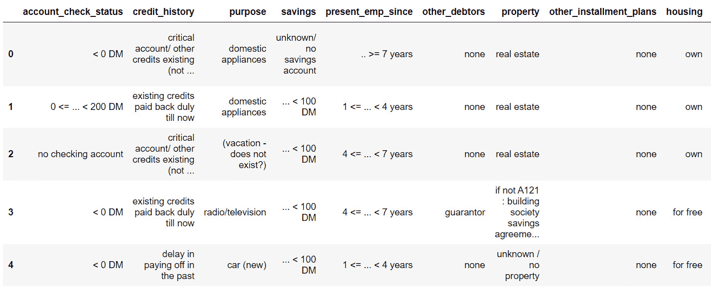

    图 3.5：只包含非数字列的 DataFrame 前五行

1.  创建一个名为`cat_cols`的列表，其中包含`cat_df`的列名，并打印其内容。你将使用 pandas 中的`.columns`来完成：

    ```py
    cat_cols = cat_df.columns
    cat_cols
    ```

    预期输出如下：

    ```py
    Index(['account_check_status', 'credit_history', 'purpose', 
           'savings', 'present_emp_since', 'other_debtors', 
           'property', 'other_installment_plans', 'housing', 
           'job', 'telephone', 'foreign_worker'], dtype='object')
    ```

1.  创建一个`for`循环，迭代`cat_cols`中的每一列，使用`fit_encoder()`来拟合标签编码器，并用`encode()`函数转换该列：

    ```py
    for col in cat_cols:
        label_encoder = fit_encoder(df, col)
        df[col] = encode(df, col, label_encoder)
    ```

1.  打印`df`的前五行：

    ```py
    df.head()
    ```

    预期输出如下：

    

图 3.6：编码后的 DataFrame 前五行

注意

要访问此特定部分的源代码，请参考[`packt.live/2Njh57h`](https://packt.live/2Njh57h)。

你也可以在网上运行这个示例，网址是[`packt.live/2YZhtx5`](https://packt.live/2YZhtx5)。你必须执行整个 Notebook 才能得到期望的结果。

我们已经成功编码了非数字列。现在，我们的 DataFrame 仅包含数字值。

## 特征和标签识别

在训练模型之前，我们仍然需要执行两个最终步骤。第一个步骤是将特征与标签分开（也称为响应变量或因变量）。`label`列是我们希望模型预测的内容。对于德国信用数据集，在我们的案例中，它将是名为`default`的列，它告诉我们一个人是否存在违约风险。

特征是数据集中所有其他列。模型将使用这些列中的信息，找到相关的模式，以准确预测相应的标签。

scikit-learn 包要求标签和特征存储在两个不同的变量中。幸运的是，pandas 包提供了一个方法`.pop()`来提取 DataFrame 中的一列。

我们将提取`default`列，并将其存储在一个名为`label`的变量中：

```py
label = df.pop('default')
label
```

预期输出如下：

```py
0      0
1      1
2      0
3      0
4      1
      ..
995    0
996    0
997    0
998    1
999    0
Name: default, Length: 1000, dtype: int64
```

现在，如果我们查看`df`的内容，我们会看到`default`列已经不再存在：

```py
df.columns
```

预期的输出结果是这样的：

```py
Index(['account_check_status', 'duration_in_month',
       'credit_history', 'purpose', 'credit_amount',
       'savings', 'present_emp_since',
       'installment_as_income_perc', 'other_debtors',
       'present_res_since', 'property', 'age',
       'other_installment_plans', 'housing', 
       'credits_this_bank', 'job', 'people_under_maintenance',
       'telephone', 'foreign_worker'],
      dtype='object')
```

现在我们已经准备好了特征和标签，接下来需要将数据集分成训练集和测试集。

## 使用 Scikit-Learn 拆分数据为训练集和测试集

在训练分类器之前需要完成的最后一步是将数据拆分为训练集和测试集。我们已经在*第二章*，*回归简介*中看过如何做了：

```py
from sklearn import model_selection
features_train, features_test, \
label_train, label_test = \
model_selection.train_test_split(df, label, test_size=0.1, \
                                 random_state=8)
```

`train_test_split`方法会将我们的特征和标签打乱并拆分为训练集和测试集。

我们可以将测试集的大小指定为介于`0`和`1`之间的一个数字。`test_size`为`0.1`意味着`10%`的数据将进入测试数据集。你还可以指定`random_state`，这样如果再次运行这段代码，结果将是完全相同的。

我们将使用训练集来训练我们的分类器，并使用测试集来评估其预测性能。通过这种方式，我们可以评估我们的模型是否过拟合，并且是否学习到仅对训练集相关的模式。

在接下来的章节中，我们将为你介绍著名的 k-近邻分类器。

# K-近邻分类器

现在我们已经有了训练数据和测试数据，接下来是准备我们的分类器来执行 k-近邻分类。在介绍完 k-近邻算法后，我们将使用 scikit-learn 来执行分类。

## 介绍 K-近邻算法（KNN）

分类算法的目标是将数据划分，以便我们能够确定哪些数据点属于哪个组。

假设我们给定了一组已分类的点。我们的任务是确定一个新的数据点属于哪个类别。

为了训练一个 k-近邻分类器（也称为 KNN），我们需要为训练集中的每个观测值提供相应的类别，也就是它属于哪个组。该算法的目标是找出特征之间的相关关系或模式，这些关系或模式将引导至这个类别。k-近邻算法基于一种接近度度量，计算数据点之间的距离。

两种最著名的接近度（或距离）度量是欧几里得距离和曼哈顿距离。我们将在下一节中详细介绍。

对于任何新的给定点，KNN 将找到它的 k 个最近邻，查看这 k 个邻居中哪个类别最频繁，并将其分配给这个新的观测值。但你可能会问，k 是什么？确定 k 的值完全是任意的。你需要预先设置这个值。这不是一个可以由算法学习的参数；它需要由数据科学家设置。这类参数称为**超参数**。理论上，你可以将 k 的值设定为 1 到正无穷之间的任何数。

有两种主要的最佳实践需要考虑：

+   k 应该始终是一个奇数。这样做的原因是我们希望避免出现平局的情况。例如，如果你设置 *k=4*，恰好有两个邻居属于 A 类，另外两个邻居属于 B 类，那么 KNN 就无法决定应该选择哪个类。为了避免这种情况，最好选择 *k=3* 或 *k=5*。

+   k 越大，KNN 的准确度就越高。例如，如果我们比较 *k=1* 和 *k=15* 的情况，后者会让你更有信心，因为 KNN 在做出决策之前会查看更多邻居。另一方面，*k=1* 只查看最接近的邻居，并将同一类分配给观测值。但我们怎么能确定它不是异常值或特殊情况呢？询问更多的邻居会降低做出错误决策的风险。不过，这也有一个缺点：k 越大，KNN 做出预测的时间就越长。这是因为它需要执行更多计算，才能获得观测点所有邻居之间的距离。因此，你需要找到一个“甜蜜点”，既能给出正确的预测，又不至于在预测时间上妥协太多。

## 使用 K 最近邻分类器的距离度量在 Scikit-Learn 中

许多距离度量方法都可以与 k 最近邻算法一起使用。我们将介绍其中最常用的两种：欧几里得距离和曼哈顿距离。

### 欧几里得距离

两个点 `A` 和 `B` 之间的距离，其中 `A=(a1, a2, …, an)` 和 `B=(b1, b2, …, bn)`，是连接这两个点的线段的长度。例如，如果 A 和 B 是二维数据点，欧几里得距离 `d` 将如下所示：

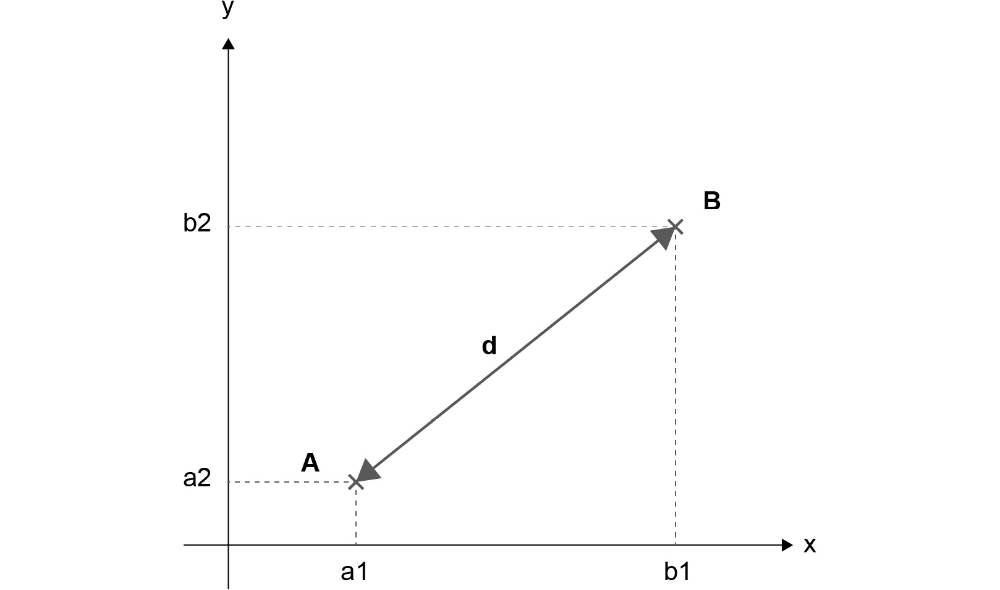

图 3.7：A 点和 B 点之间的欧几里得距离的可视化表示

计算欧几里得距离的公式如下：


图 3.8：A 点和 B 点之间的距离

因为本书将使用欧几里得距离，接下来我们来看一下如何使用 scikit-learn 来计算多个点之间的距离。

我们需要从 `sklearn.metrics.pairwise` 导入 `euclidean_distances`。这个函数接受两组点并返回一个矩阵，矩阵包含每个点与第一组和第二组点之间的成对距离。

让我们以一个观测点 Z 为例，其坐标为 (`4, 4`)。在这里，我们希望计算与另外 3 个点 A、B 和 C 的欧几里得距离，这些点的坐标分别为 (`2, 3`)、(`3, 7`) 和 (`1, 6`)：

```py
from sklearn.metrics.pairwise import euclidean_distances
observation = [4,4]
neighbors = [[2,3], [3,7], [1,6]]
euclidean_distances([observation], neighbors)
```

预期的输出结果如下：

```py
array([[2.23606798, 3.16227766, 3.60555128]])
```

这里，Z=(`4,4`) 和 B=(`3,7`) 之间的距离大约为 `3.162`，这就是我们在输出中得到的结果。

我们还可以计算同一组中各点之间的欧几里得距离：

```py
euclidean_distances(neighbors)
```

预期的输出是这样的：

```py
array([[0\.        , 4.12310563, 3.16227766],
       [4.12310563, 0\.        , 2.23606798],
       [3.16227766, 2.23606798, 0\.        ]])
```

包含 `0` 值的对角线对应于每个数据点与自身的欧几里得距离。这个矩阵是关于对角线对称的，因为它计算了两个点之间的距离以及反向的距离。例如，第一行的值 `4.12310563` 是 A 和 B 之间的距离，而第二行的相同值则是 B 和 A 之间的距离。

## 曼哈顿/汉明距离

曼哈顿（或汉明）距离的公式与欧几里得距离非常相似，但它并不使用平方根，而是依赖于计算数据点坐标差的绝对值：


图 3.9：曼哈顿距离与汉明距离

你可以把曼哈顿距离想象成我们在网格上计算距离，而不是使用直线：

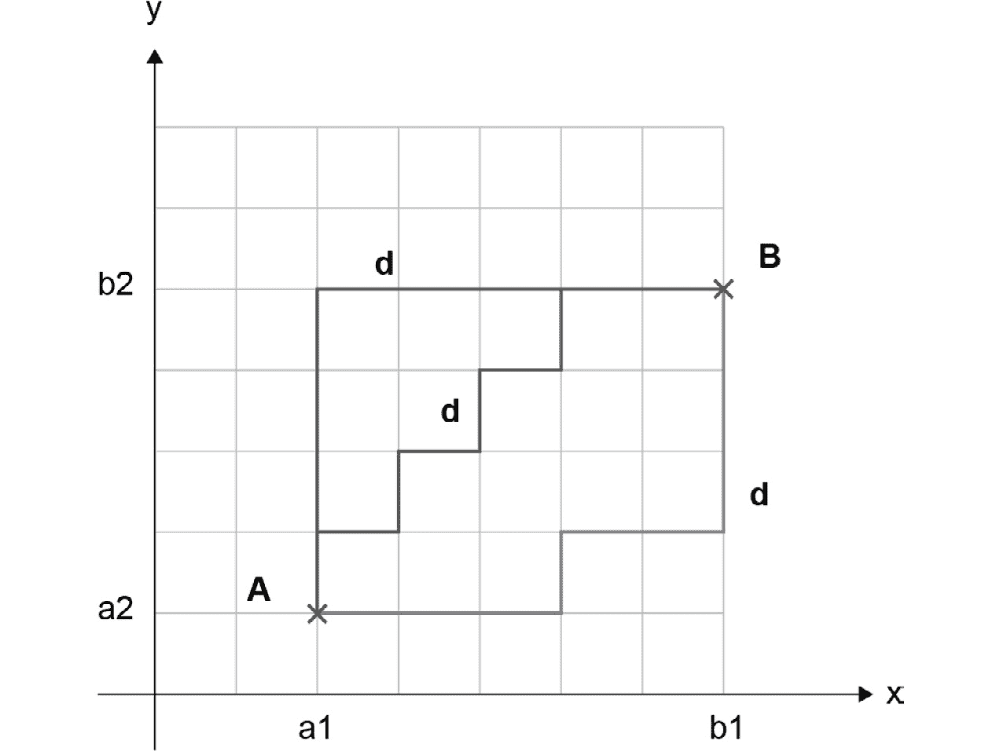

图 3.10：曼哈顿距离在 A 和 B 之间的可视化表示

如上图所示，曼哈顿距离将遵循网格定义的路径，从 A 到达 B。

另一个有趣的属性是，A 和 B 之间可能有多个最短路径，但它们的曼哈顿距离将相等。在上面的示例中，如果网格中的每个单元格表示 1 单位，那么所有三条突出显示的最短路径的曼哈顿距离将都是 9。

欧几里得距离是更准确的距离泛化方法，而曼哈顿距离稍微容易计算一些，因为你只需要计算绝对值之间的差异，而不是计算平方差后再取平方根。

## 练习 3.03：在 Matplotlib 中展示 K 最近邻分类器算法

假设我们有一份员工数据列表。我们的特征是每周工作的小时数和年薪。我们的标签表示员工是否在公司工作超过 2 年。如果停留时间少于 2 年，则用零表示，若大于或等于 2 年，则用一表示。

我们希望创建一个三近邻分类器，来判断一名员工是否会在公司待满至少 2 年。

然后，我们希望使用这个分类器来预测一名要求每周工作 32 小时并且年收入 52,000 美元的员工是否会在公司工作 2 年或更长时间。

按照以下步骤完成本练习：

注意

上述数据集可以在 GitHub 上找到，链接为 [`packt.live/2V5VaV9`](https://packt.live/2V5VaV9)。

1.  打开一个新的 Jupyter Notebook 文件。

1.  导入 `pandas` 包并命名为 `pd`：

    ```py
    import pandas as pd
    ```

1.  创建一个新的变量，命名为 `file_url()`，它将包含原始数据集的 URL：

    ```py
    file_url = 'https://raw.githubusercontent.com/'\
               'PacktWorkshops/'\
               'The-Applied-Artificial-Intelligence-Workshop/'\
               'master/Datasets/employees_churned.csv'
    ```

1.  使用 `pd.read_csv()` 方法加载数据：

    ```py
    df = pd.read_csv(file_url)
    ```

1.  打印数据框的行：

    ```py
    df
    ```

    预期的输出是这样的：

    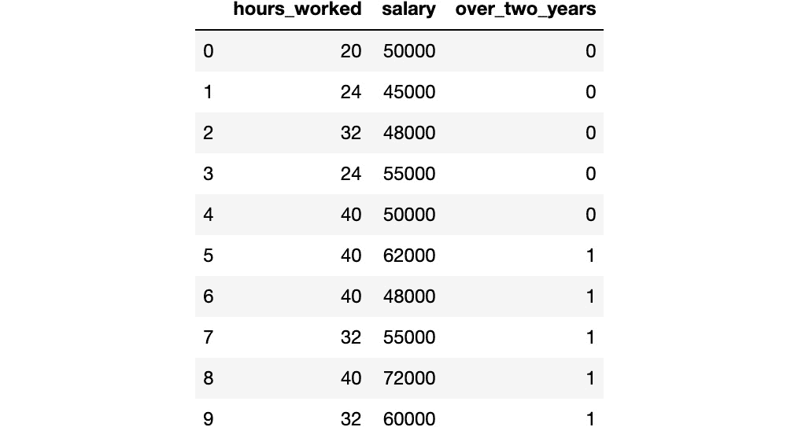

    图 3.11：员工数据集的 DataFrame

1.  从`scikit-learn`导入`preprocessing`：

    ```py
    from sklearn import preprocessing
    ```

1.  实例化一个`MinMaxScaler`，并设置`feature_range=(0,1)`，将其保存到名为`scaler`的变量中：

    ```py
    scaler = preprocessing.MinMaxScaler(feature_range=(0,1))
    ```

1.  使用`.fit_transform()`缩放数据框，将结果保存到名为`scaled_employees`的新变量中，并打印其内容：

    ```py
    scaled_employees = scaler.fit_transform(df)
    scaled_employees
    ```

    预期输出如下：

    ```py
    array([[0\.        , 0.18518519, 0\.        ],
           [0.2       , 0\.        , 0\.        ],
           [0.6       , 0.11111111, 0\.        ],
           [0.2       , 0.37037037, 0\.        ],
           [1\.        , 0.18518519, 0\.        ],
           [1\.        , 0.62962963, 1\.        ],
           [1\.        , 0.11111111, 1\.        ],
           [0.6       , 0.37037037, 1\.        ],
           [1\.        , 1\.        , 1\.        ],
           [0.6       , 0.55555556, 1\.        ]])
    ```

    在前面的代码片段中，我们已经将原始数据集缩放，使得所有值都在 0 到 1 之间。

1.  从缩放后的数据中提取每一列，并将它们保存到名为`hours_worked`、`salary`和`over_two_years`的三个变量中，如下所示的代码片段所示：

    ```py
    hours_worked = scaled_employees[:, 0]
    salary = scaled_employees[:, 1]
    over_two_years = scaled_employees[:, 2]
    ```

1.  导入`matplotlib.pyplot`包，并命名为`plt`：

    ```py
    import matplotlib.pyplot as plt
    ```

1.  使用`plt.scatter`创建两个散点图，`hours_worked`作为* x *轴，`salary`作为* y *轴，然后根据`over_two_years`的值创建不同的标记。你可以使用`plt.xlabel`和`plt.ylabel`添加* x *轴和* y *轴的标签。使用`plt.show()`显示散点图：

    ```py
    plt.scatter(hours_worked[:5], salary[:5], marker='+')
    plt.scatter(hours_worked[5:], salary[5:], marker='o')
    plt.xlabel("hours_worked")
    plt.ylabel("salary")
    plt.show()
    ```

    预期输出如下：

    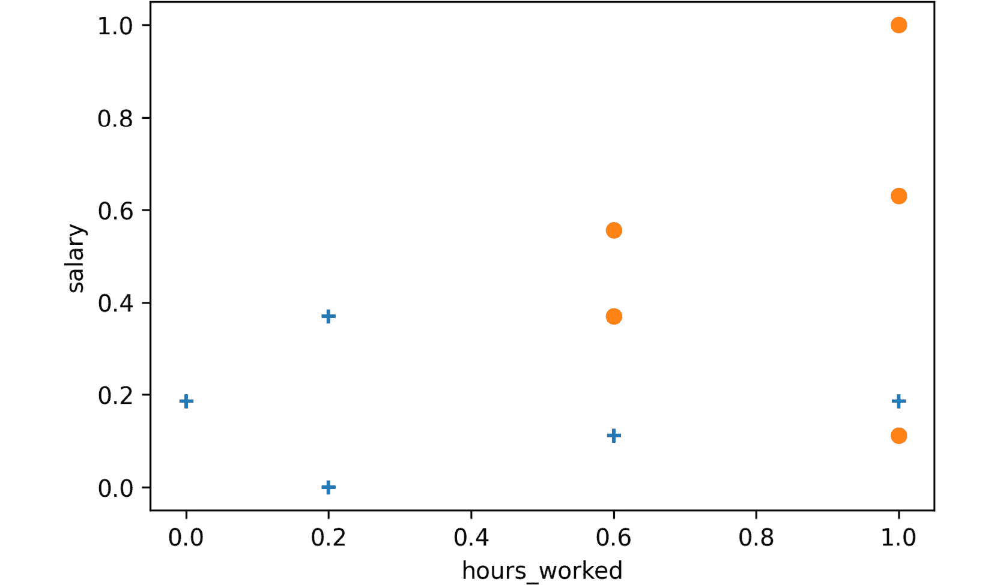

    ```py
    + points represent the employees that stayed less than 2 years, while the o ones are for the employees who stayed for more than 2 years. 
    ```

    现在，假设我们有一个新的观察值，并且我们想计算与缩放数据集中的数据的欧几里得距离。

1.  创建一个名为`observation`的新变量，坐标为`[0.5, 0.26]`：

    ```py
    observation = [0.5, 0.26]
    ```

1.  从`sklearn.metrics.pairwise`导入`euclidean_distances`函数：

    ```py
    from sklearn.metrics.pairwise import euclidean_distances
    ```

1.  创建一个名为`features`的新变量，它将提取缩放数据集中的前两列：

    ```py
    features = scaled_employees[:,:2]
    ```

1.  使用`euclidean_distances`计算`observation`和`features`之间的欧几里得距离，将结果保存到名为`dist`的变量中，并打印其值，如下所示的代码片段所示：

    ```py
    dist = euclidean_distances([observation], features)
    dist
    ```

    预期输出如下：

    ```py
    array([[0.50556627, 0.39698866, 0.17935412, 0.3196586 ,
            0.50556627, 0.62179262, 0.52169714, 0.14893495,
            0.89308454, 0.31201456]])
    ```

    注意

    要访问此特定部分的源代码，请参考[`packt.live/3djY1jO`](https://packt.live/3djY1jO)。

    你也可以在在线运行此示例，网址为[`packt.live/3esx7HF`](https://packt.live/3esx7HF)。你必须执行整个 Notebook 才能获得期望的结果。

从前面的输出中，我们可以看到三个最近的邻居如下：

+   对于点`[0.6, 0.37037037, 1.]`，欧几里得距离是`0.1564897`。

+   对于点`[0.6, 0.11111111, 0.]`，欧几里得距离是`0.17114358`。

+   对于点`[0.6, 0.55555556, 1.]`，欧几里得距离是`0.32150303`。

如果选择`k=3`，KNN 将查看这三个最近邻居的类别，由于其中有两个的标签为`1`，它将把此类别分配给我们的新观察值`[0.5, 0.26]`。这意味着我们的三邻居分类器会将这个新员工分类为更有可能至少待满 2 年的员工。

通过完成此练习，我们了解了 KNN 分类器如何通过找到新观察值的三个最近邻居，并使用欧几里得距离将最频繁的类别分配给它来对新观察值进行分类。

## 在 scikit-learn 中对 K-最近邻分类器进行参数化

分类器的参数化是你微调分类器准确度的地方。由于我们尚未学习所有可能的 k 近邻变种，我们将专注于你基于本主题能够理解的参数：

注意

你可以在这里访问 k 近邻分类器的文档：[`scikit-learn.org/stable/modules/generated/sklearn.neighbors.KNeighborsClassifier.html`](http://scikit-learn.org/stable/modules/generated/sklearn.neighbors.KNeighborsClassifier.html)。

+   `n_neighbors`：这是 k 近邻算法中的 k 值。默认值为`5`。

+   `metric`：在创建分类器时，你会看到一个名称——`Minkowski`。不要担心这个名字——你已经学过了第一阶和第二阶明可夫斯基度量。这个度量有一个`power`参数。对于`p=1`，明可夫斯基度量和曼哈顿度量相同；对于`p=2`，明可夫斯基度量和欧几里得度量相同。

+   `p`：这是明可夫斯基度量的幂次。默认值为`2`。

创建分类器时，你必须指定以下这些参数：

```py
classifier = neighbors.KNeighborsClassifier(n_neighbors=50, p=2)
```

然后，你需要使用训练数据来拟合 KNN 分类器：

```py
classifier.fit(features, label)
```

`predict()`方法可用于预测任何新数据点的标签：

```py
classifier.predict(new_data_point)
```

在下一个练习中，我们将使用 scikit-learn 的 KNN 实现，自动查找最近邻并分配相应的类别。

## 练习 3.04：在 scikit-learn 中进行 K 近邻分类

在本练习中，我们将使用 scikit-learn，自动训练一个 KNN 分类器，基于德国信用审批数据集，并尝试不同的`n_neighbors`和`p`超参数值，以获得最优的输出值。在拟合 KNN 之前，我们需要对数据进行缩放。

按照以下步骤完成本练习：

注意

本练习是*练习 3.02*的延续，*应用标签编码将分类变量转化为数值型*。我们已经将*练习 3.02*的结果数据集保存到 GitHub 仓库：[`packt.live/2Yqdb2Q`](https://packt.live/2Yqdb2Q)。

1.  打开一个新的 Jupyter Notebook。

1.  导入`pandas`包并将其命名为`pd`：

    ```py
    import pandas as pd
    ```

1.  创建一个名为`file_url`的新变量，该变量将包含原始数据集的 URL：

    ```py
    file_url = 'https://raw.githubusercontent.com/'\
               'PacktWorkshops/'\
               'The-Applied-Artificial-Intelligence-Workshop/'\
               'master/Datasets/german_prepared.csv'
    ```

1.  使用`pd.read_csv()`方法加载数据：

    ```py
    df = pd.read_csv(file_url)
    ```

1.  从`scikit-learn`导入`preprocessing`：

    ```py
    from sklearn import preprocessing
    ```

1.  使用`feature_range=(0,1)`实例化`MinMaxScaler`，并将其保存为名为`scaler`的变量：

    ```py
    scaler = preprocessing.MinMaxScaler(feature_range=(0,1))
    ```

1.  拟合缩放器并使用`.fit_transform()`方法应用相应的转换到 DataFrame，并将结果保存到名为`scaled_credit`的变量中：

    ```py
    scaled_credit = scaler.fit_transform(df)
    ```

1.  将`response`变量（第一列）提取到一个新的变量中，命名为`label`：

    ```py
    label = scaled_credit[:, 0]
    ```

1.  将特征（所有列，除了第一列）提取到一个名为`features`的新变量中：

    ```py
    features = scaled_credit[:, 1:]
    ```

1.  从`sklearn`导入`model_selection.train_test_split`：

    ```py
    from sklearn.model_selection import train_test_split
    ```

1.  使用`train_test_split`将缩放后的数据集分成训练集和测试集，`test_size=0.2`，`random_state=7`：

    ```py
    features_train, features_test, \
    label_train, label_test = \
    train_test_split(features, label, test_size=0.2, \
                     random_state=7)
    ```

1.  从`sklearn`导入`neighbors`：

    ```py
    from sklearn import neighbors
    ```

1.  实例化`KNeighborsClassifier`并将其保存到名为`classifier`的变量中：

    ```py
    classifier = neighbors.KNeighborsClassifier()
    ```

1.  在训练集上拟合 K 最近邻分类器：

    ```py
    classifier.fit(features_train, label_train)
    ```

    由于我们没有提到 k 的值，默认值是`5`。

1.  使用`.score()`打印训练集的准确率：

    ```py
    acc_train = classifier.score(features_train, label_train)
    acc_train
    ```

    你应该得到以下输出：

    ```py
    0.78625
    ```

    通过这些操作，我们在训练集上获得了`0.78625`的准确率，使用的是默认的超参数值：*k=5* 和欧几里得距离。

    让我们看一下测试集的得分。

1.  使用`.score()`打印测试集的准确率：

    ```py
    acc_test = classifier.score(features_test, label_test)
    acc_test
    ```

    你应该得到以下输出：

    ```py
    0.75
    ```

    测试集的准确率降至`0.75`。这意味着我们的模型出现了过拟合，不能很好地对未见过的数据进行泛化。在下一个活动中，我们将尝试不同的超参数值，看看是否能改善这一点。

    注意

    要访问此特定部分的源代码，请参见[`packt.live/2ATeluO`](https://packt.live/2ATeluO)。

    你还可以在线运行此示例，地址是[`packt.live/2VbDTKx`](https://packt.live/2VbDTKx)。你必须执行整个 Notebook 才能获得预期结果。

在本练习中，我们学习了如何将数据集划分为训练集和测试集，并拟合 KNN 算法。我们的最终模型可以准确预测一个人 75%的概率是否会违约。

## 活动 3.01：提高信用评分的准确性

在本活动中，你将实现 K 最近邻分类器的参数化并观察最终结果。目前，信用评分的准确率是 75%。你需要找到一种方法，将其提高几个百分点。

你可以尝试不同的 k 值（`5`、`10`、`15`、`25`和`50`），以及欧几里得距离和曼哈顿距离。

注意

这项活动要求你首先完成*练习 3.04*，*scikit-learn 中的 K 最近邻分类*，因为我们将在这里使用之前准备好的数据。

以下步骤将帮助你完成这项活动：

1.  从`sklearn`导入`neighbors`。

1.  创建一个函数来实例化指定超参数的`KNeighborsClassifier`，用训练数据拟合，并返回训练集和测试集的准确率。

1.  使用你创建的函数，评估 k =（`5`、`10`、`15`、`25`、`50`）时，欧几里得距离和曼哈顿距离的准确率。

1.  寻找最佳的超参数组合。

预期输出如下：

```py
(0.775, 0.785)
```

注意

该活动的解决方案可以在第 343 页找到。

在接下来的部分，我们将介绍另一种机器学习分类器：**支持向量机**（**SVM**）。

# 支持向量机分类

我们在 *第二章*，*回归入门* 中首先使用了 SVM 进行回归。在本节中，你将学习如何使用 SVM 进行分类。和往常一样，我们将使用 scikit-learn 来实践我们的示例。

## 什么是支持向量机分类器？

SVM 的目标是找到一个 n 维空间中的表面，将该空间中的数据点分成多个类别。

在二维空间中，这个表面通常是直线。然而，在三维空间中，SVM 通常找到一个平面。这些表面是最优的，因为它们基于机器可以利用的信息，从而优化了 n 维空间的分隔。

SVM 找到的最佳分隔面被称为最佳分隔超平面。

SVM 用于找到一个分隔两组数据点的表面。换句话说，SVM 是 **二分类器**。这并不意味着 SVM 只能用于二分类。尽管我们只讨论了一个平面，SVM 可以通过对任务本身进行推广，将空间划分为任意数量的类别。

分隔面是最优的，因为它最大化了每个数据点与分隔面之间的距离。

向量是定义在 n 维空间中的数学结构，具有大小（长度）和方向。在二维空间中，你可以从原点绘制向量 (*x, y*) 到点 (x, y)。基于几何学，你可以使用勾股定理计算向量的长度，并通过计算向量与水平轴之间的角度来确定向量的方向。

例如，在二维空间中，向量 (3, -4) 的大小如下：

```py
np.sqrt( 3 * 3 + 4 * 4 )
```

预期输出如下：

```py
5.0
```

它具有以下方向（以度为单位）：

```py
np.arctan(-4/3) / 2 / np.pi * 360
```

预期输出如下：

```py
-53.13010235415597
```

## 理解支持向量机

假设给定了两组具有不同类别（类别 0 和类别 1）的点。为了简单起见，我们可以想象一个二维平面，具有两个特征：一个映射在水平轴上，另一个映射在垂直轴上。

SVM 的目标是找到最佳分隔线，将属于类别 0 的点`A`、`D`、`C`、`B`和`H`与属于类别 1 的点`E`、`F`和`G`分开：

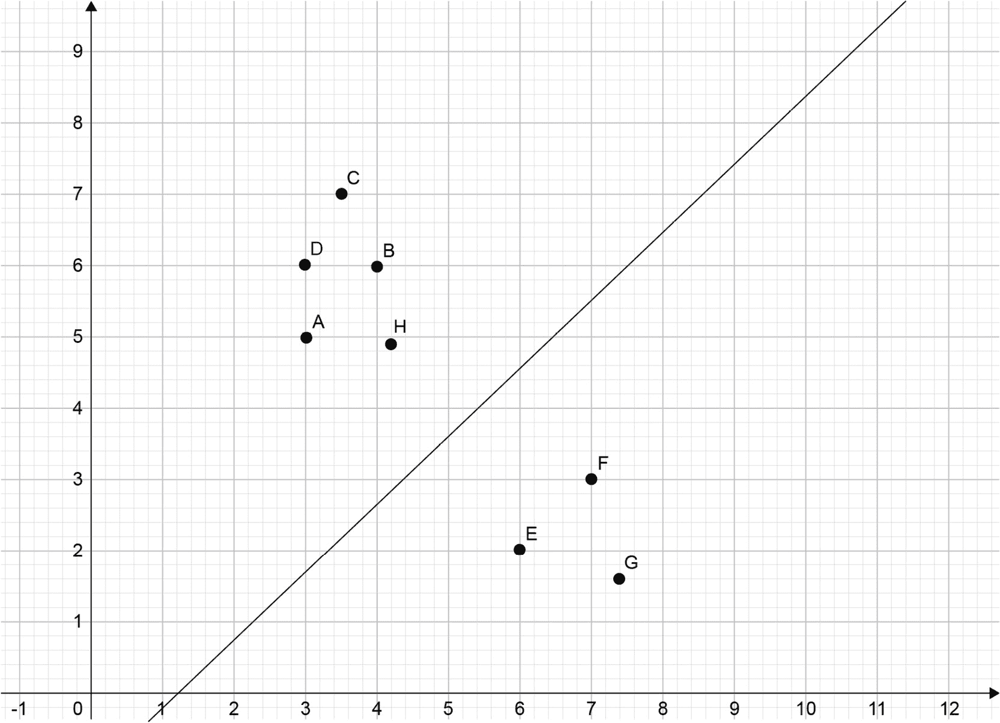

图 3.13：分隔红色和蓝色成员的线

但是，分隔并不总是那么明显。例如，如果类别 0 的新点位于 `E`、`F` 和 `G` 之间，就没有一条线能够分开所有的点而不导致错误。如果类别 0 的点围绕类别 1 的点形成一个完整的圆圈，就没有直线能够分开这两组点：

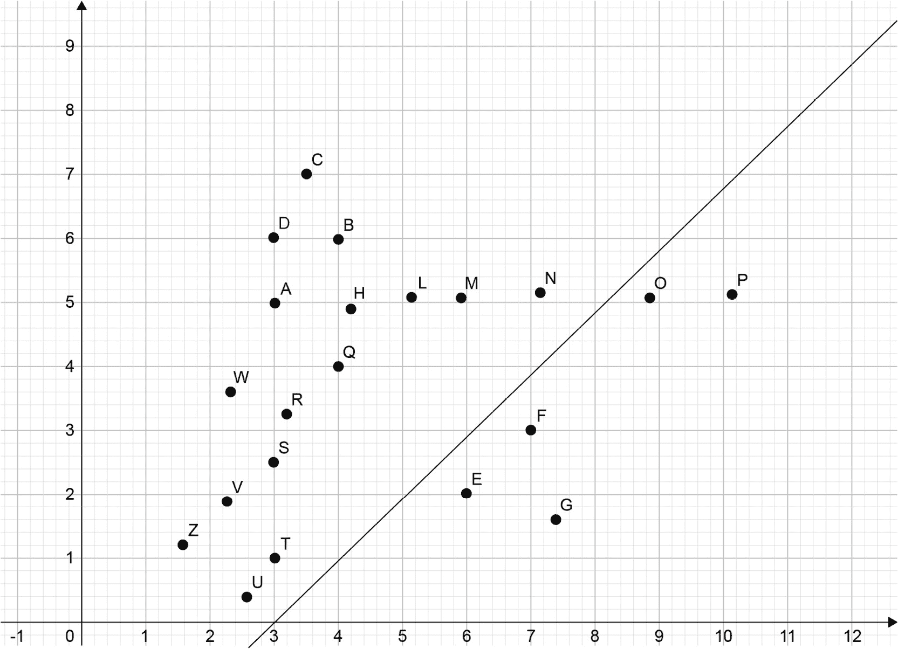

图 3.14：带有两个异常点的图

例如，在前面的图中，我们容忍了两个异常点，`O` 和 `P`。

在以下解决方案中，我们不容忍异常值，而是通过两个半线来构建最佳分隔路径，代替使用一条线：

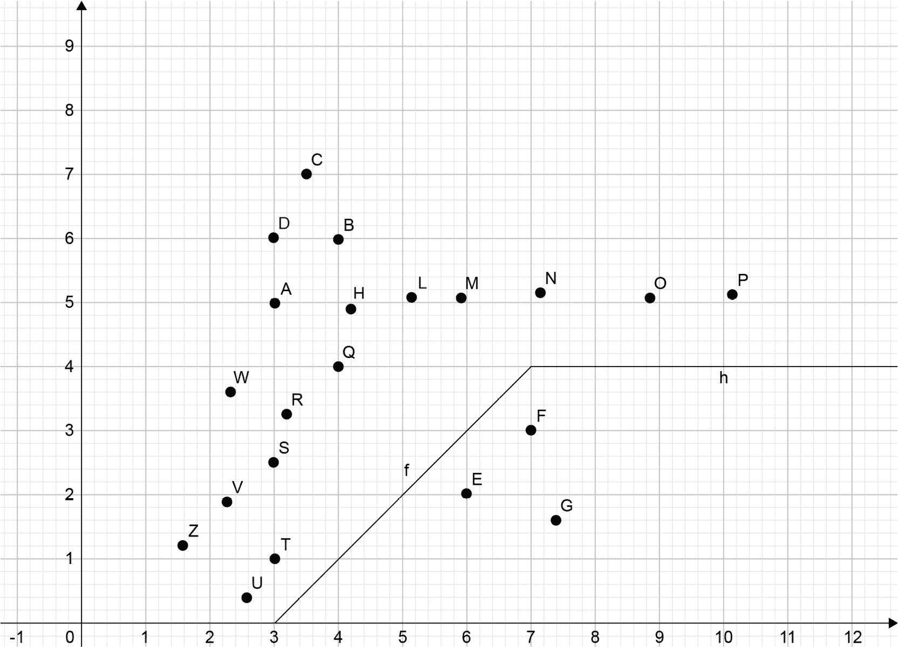

图 3.15：移除两个异常值的分隔图

完美分隔所有数据点通常并不值得投入过多资源。因此，支持向量机可以通过正则化来简化并限制最佳分隔形状的定义，从而允许异常值的存在。

支持向量机的正则化参数决定了允许的误差率或禁止误分类的程度。

支持向量机有一个核函数参数。线性核使用线性方程来严格描述最佳分隔超平面。多项式核使用多项式，而指数核使用指数表达式来描述超平面。

边距是围绕分隔超平面的一片区域，其边界由最靠近分隔超平面的点所限定。一个平衡的边距是从每个类别中选出的点，它们距离分隔线等远。

当涉及到定义最佳分隔超平面的允许误差率时，**gamma** 参数决定了在确定分隔超平面位置时，是仅考虑接近分隔超平面的点，还是考虑最远离分隔线的点。gamma 值越高，影响分隔超平面位置的点数越少。

## scikit-learn 中的支持向量机

我们的切入点是*活动 3.02*，*scikit-learn 中的支持向量机优化*。一旦我们划分了训练数据和测试数据，就可以设置分类器了：

```py
features_train, features_test, \
label_train, label_test = \
model_selection.train_test_split(scaled_features, label,\
                                 test_size=0.2)
```

我们将使用 `svm.SVC()` 分类器，而不是使用 k 最近邻分类器：

```py
from sklearn import svm
classifier = svm.SVC()
classifier.fit(features_train, label_train)
classifier.score(features_test, label_test)
```

期望的输出是这样的：

```py
0.745
```

看起来 scikit-learn 的默认支持向量机分类器比 k 最近邻分类器稍微更好。

## scikit-learn 支持向量机的参数

以下是 scikit-learn 支持向量机的参数：

+   `kernel`：这是一个字符串或可调用参数，用于指定算法中使用的核函数。预定义的核函数包括 `linear`、`poly`、`rbf`、`sigmoid` 和 `precomputed`。默认值是 `rbf`。

+   `degree`：当使用多项式核时，你可以指定多项式的度数。默认值是 `3`。

+   `gamma`：这是用于 `rbf`、`poly` 和 `sigmoid` 核函数的核系数。默认值是 `auto`，它的计算方式是 *1/特征数量*。

+   `C`：这是一个浮动数值，默认值为 `1.0`，表示误差项的惩罚参数。

    注意

    你可以在参考文档中阅读关于这些参数的详细信息，地址为 [`scikit-learn.org/stable/modules/generated/sklearn.svm.SVC.html`](http://scikit-learn.org/stable/modules/generated/sklearn.svm.SVC.html)。

下面是一个支持向量机的例子：

```py
classifier = svm.SVC(kernel="poly", C=2, degree=4, gamma=0.05)
```

## 活动 3.02：scikit-learn 中的支持向量机优化

在这个活动中，你将使用、比较和对比不同 SVM 分类器的参数。通过这些，你将找到一组在我们加载并准备好的训练和测试数据中，能够产生最高分类准确率的参数，这些数据在*活动 3.01*中已经准备好，*提高信用评分的准确性*。

你必须使用不同的 SVM 超参数组合：

+   `kernel="linear"`

+   `kernel="poly", C=1, degree=4, gamma=0.05`

+   `kernel="poly", C=1, degree=4, gamma=0.05`

+   `kernel="poly", C=1, degree=4, gamma=0.25`

+   `kernel="poly", C=1, degree=4, gamma=0.5`

+   `kernel="poly", C=1, degree=4, gamma=0.16`

+   `kernel="sigmoid"`

+   `kernel="rbf", gamma=0.15`

+   `kernel="rbf", gamma=0.25`

+   `kernel="rbf", gamma=0.5`

+   `kernel="rbf", gamma=0.35`

以下步骤将帮助你完成本次活动：

1.  打开一个新的 Jupyter Notebook 文件，并执行前面提到的所有步骤，*练习 3.04*，*在 scikit-learn 中进行 K 近邻分类*。

1.  从`sklearn`导入`svm`。

1.  创建一个函数，用于实例化一个 SVC 模型，设置指定的超参数，使用训练数据进行拟合，并返回训练集和测试集的准确度评分。

1.  使用你创建的函数，评估不同超参数组合的准确度评分。

1.  找到最佳的超参数组合。

预期输出如下：

```py
(0.78125, 0.775)
```

注意

本次活动的解答可以在第 347 页找到。

# 总结

在本章中，我们学习了分类的基础知识，以及回归问题之间的区别。分类是关于预测一个具有有限可能值的响应变量。对于任何数据科学项目，数据科学家都需要在训练模型之前准备好数据。在本章中，我们学习了如何标准化数值并替换缺失值。接着，你了解了著名的 k 近邻算法，并发现它如何使用距离度量来寻找与数据点最接近的邻居，并从中分配最常见的类别。我们还学习了如何将 SVM 应用于分类问题，并调优其一些超参数，以提高模型性能并减少过拟合。

在下一章中，我们将带你了解另一种类型的算法，叫做决策树。
