# 6\. 神经网络与深度学习

概述

在本章中，你将了解神经网络和深度学习的最终主题。你将学习 TensorFlow、卷积神经网络（CNNs）和递归神经网络（RNNs）。你将利用深度学习的核心概念来评估个人的信用 worthiness 并预测社区的房价。稍后，你还将使用学到的技能实现一个图像分类程序。到本章结束时，你将牢牢掌握神经网络和深度学习的概念。

# 介绍

在上一章，我们学习了聚类问题的概念，并了解了几种算法，如 k-means，它们可以自动将数据点分组。在本章中，我们将学习神经网络和深度学习网络。

神经网络与深度学习网络的区别在于网络的复杂性和深度。传统的神经网络只有一个隐藏层，而深度学习网络则有多个隐藏层。

尽管我们将使用神经网络和深度学习进行监督学习，但请注意，神经网络也可以建模无监督学习技术。这种模型在 1980 年代其实非常流行，但由于当时计算能力有限，直到最近，这种模型才被广泛采用。随着图形处理单元（GPU）和云计算的普及，我们现在可以获得巨大的计算能力。这正是神经网络，尤其是深度学习，重新成为热门话题的主要原因。

深度学习能够建模比传统神经网络更复杂的模式，因此如今在计算机视觉（如面部检测和图像识别）和自然语言处理（如聊天机器人和文本生成）中得到了广泛应用。

# 人工神经元

**人工神经网络**（**ANNs**），顾名思义，试图模仿人类大脑的工作方式，特别是神经元的工作方式。

神经元是大脑中的一种细胞，通过电信号与其他细胞进行通信。神经元能够响应声音、光线、触摸等刺激。它们也能引发动作，比如肌肉收缩。平均而言，人脑包含约 100 亿到 200 亿个神经元。这是一个相当庞大的网络，对吧？这也是人类能够实现如此多惊人事物的原因。这也是为什么研究人员试图模仿大脑的运作，并由此创造了人工神经网络。

人工神经网络由多个相互连接的人工神经元组成，形成一个网络。人工神经元简单来说是一个处理单元，它对一些输入（`x1`、`x2`、……、`xn`）进行数学运算，并将最终结果（`y`）返回给下一个单元，如下图所示：

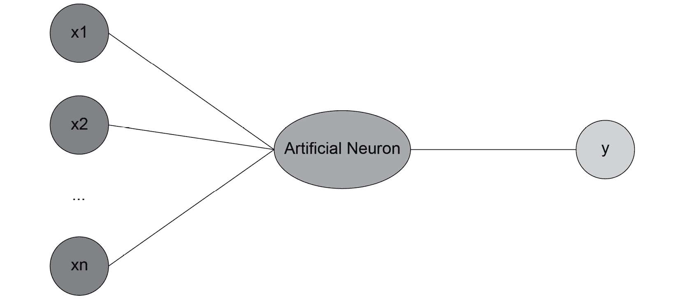

图 6.1：人工神经元的表示

我们将在接下来的章节中更详细地了解人工神经元的工作原理。

# TensorFlow 中的神经元

TensorFlow 目前是最流行的神经网络和深度学习框架。它由 Google 创建并维护。TensorFlow 用于语音识别和语音搜索，也是 [translate.google.com](http://translate.google.com) 背后的大脑。稍后在本章中，我们将使用 TensorFlow 来识别书写字符。

TensorFlow API 支持多种编程语言，包括 Python、JavaScript、Java 和 C。TensorFlow 与 **张量** 一起工作。你可以将张量视为一个容器，它由一个矩阵（通常是高维的）和与其将执行的操作相关的附加信息组成（如权重和偏差，你将在本章稍后看到）。没有维度（即无秩）的张量是标量。秩为 1 的张量是向量，秩为 2 的张量是矩阵，秩为 3 的张量是三维矩阵。秩表示张量的维度。在本章中，我们将讨论秩为 2 和 3 的张量。

注意

数学家使用矩阵和维度的术语，而深度学习程序员则使用张量和秩。

TensorFlow 还提供了数学函数来变换张量，例子包括以下内容：

+   `add` 和 `multiply`

+   `exp` 和 `log`

+   `greater`、`less` 和 `equal`

+   `concat`、`slice` 和 `split`

+   `matrix_inverse`、`matrix_determinant` 和 `matmul`

+   `sigmoid`、`relu` 和 `softmax`

我们将在本章稍后详细讲解这些内容。

在下一个练习中，我们将使用 TensorFlow 来计算一个人工神经元。

## 练习 6.01：使用基本操作和 TensorFlow 常量

在本练习中，我们将使用 TensorFlow 中的算术操作，通过执行矩阵乘法和加法，并应用非线性函数 `sigmoid` 来模拟一个人工神经元。

以下步骤将帮助你完成练习：

1.  打开一个新的 Jupyter Notebook 文件。

1.  导入 `tensorflow` 包并将其命名为 `tf`：

    ```py
    import tensorflow as tf
    ```

1.  创建一个名为 `W` 的形状为 `[1,6]`（即 1 行 6 列）的张量，使用 `tf.constant()`，并使其包含矩阵 `[1.0, 2.0, 3.0, 4.0, 5.0, 6.0]`。打印其值：

    ```py
    W = tf.constant([1.0, 2.0, 3.0, 4.0, 5.0, 6.0], shape=[1, 6]) 
    W
    ```

    预期输出如下：

    ```py
    <tf.Tensor: shape=(1, 6), dtype=float32, numpy=array([[1., 2., 3., 4., 5., 6.]], dtype=float32)>
    ```

1.  创建一个名为 `X` 的形状为 `[6,1]`（即 6 行 1 列）的张量，使用 `tf.constant()`，并使其包含 `[7.0, 8.0, 9.0, 10.0, 11.0, 12.0]`。打印其值：

    ```py
    X = tf.constant([7.0, 8.0, 9.0, 10.0, 11.0, 12.0], \
                    shape=[6, 1]) 
    X
    ```

    预期输出如下：

    ```py
    <tf.Tensor: shape=(6, 1), dtype=float32, numpy= 
    array([[ 7.],
           [ 8.],
           [ 9.],
           [10.],
           [11.],
           [12.]], dtype=float32)>
    ```

1.  现在，创建一个名为 `b` 的张量，使用 `tf.constant()`，并使其包含 `-88`。打印其值：

    ```py
    b = tf.constant(-88.0)
    b
    ```

    预期输出如下：

    ```py
    <tf.Tensor: shape=(), dtype=float32, numpy=-88.0>
    ```

1.  在 `W` 和 `X` 之间执行矩阵乘法，使用 `tf.matmul`，将其结果保存在 `mult` 变量中，并打印其值：

    ```py
    mult = tf.matmul(W, X)
    mult
    ```

    预期输出如下：

    ```py
    <tf.Tensor: shape=(1, 1), dtype=float32, numpy=array([[217.]], dtype=float32)>
    ```

1.  在 `mult` 和 `b` 之间执行矩阵加法，并将结果保存在名为 `Z` 的变量中，打印其值：

    ```py
    Z = mult + b
    Z
    ```

    预期输出如下：

    ```py
    <tf.Tensor: shape=(1, 1), dtype=float32, numpy=array([[129.]], dtype=float32)>
    ```

1.  使用 `tf.math.sigmoid` 对 `Z` 应用 `sigmoid` 函数，将其结果保存在名为 `a` 的变量中，并打印其值。`sigmoid` 函数将任何数值转化到 **0** 到 **1** 的范围内（我们将在后续章节中深入了解这一点）：

    ```py
    a = tf.math.sigmoid(Z)
    a
    ```

    预期的输出是这样的：

    ```py
    <tf.Tensor: shape=(1, 1), dtype=float32, numpy=array([[1.]], dtype=float32)>
    ```

`sigmoid` 函数将 `Z` 的原始值 `129` 转换为 `1`。

注意

若要访问本节的源代码，请参考 [`packt.live/31ekGLM`](https://packt.live/31ekGLM)。

你也可以在 [`packt.live/3evuKnC`](https://packt.live/3evuKnC) 在线运行此示例。你必须执行整个笔记本才能获得预期的结果。

在本次练习中，你成功地使用 TensorFlow 实现了一个人工神经元。这是任何神经网络模型的基础。

在接下来的章节中，我们将深入研究神经网络的架构。

# 神经网络架构

神经网络是**人工智能**（**AI**）最新的分支。神经网络的灵感来源于人类大脑的工作方式。它们由 Warren McCulloch 和 Walter Pitts 在 1940 年代发明。神经网络是一个数学模型，用于描述人类大脑如何解决问题。

当我们谈论人类大脑时，使用 ANN 来指代数学模型和生物神经网络。

神经网络的学习方式比其他分类或回归模型更为复杂。神经网络模型具有许多内部变量，输入和输出变量之间的关系可能涉及多个内部层次。神经网络的准确性通常高于其他监督学习算法。

注意

精通使用 TensorFlow 构建神经网络是一个复杂的过程。本节的目的是为你提供一个入门资源，帮助你开始学习。

在本章中，我们将使用的主要示例是从图像中识别数字。我们采用这种格式是因为每张图像较小，并且我们有约 70,000 张图像可供使用。处理这些图像所需的计算能力类似于普通计算机的能力。

神经网络（ANN）工作原理与人类大脑相似。人类大脑中的树突与细胞核相连，细胞核与轴突相连。在神经网络中，输入相当于树突，计算发生的地方是细胞核，输出则是轴突。

人工神经元被设计成模拟细胞核的工作方式。它将通过矩阵乘法计算和激活函数来转化输入信号。如果激活函数判定神经元必须激发，那么一个信号将出现在输出端。这个信号可以是网络中其他神经元的输入：

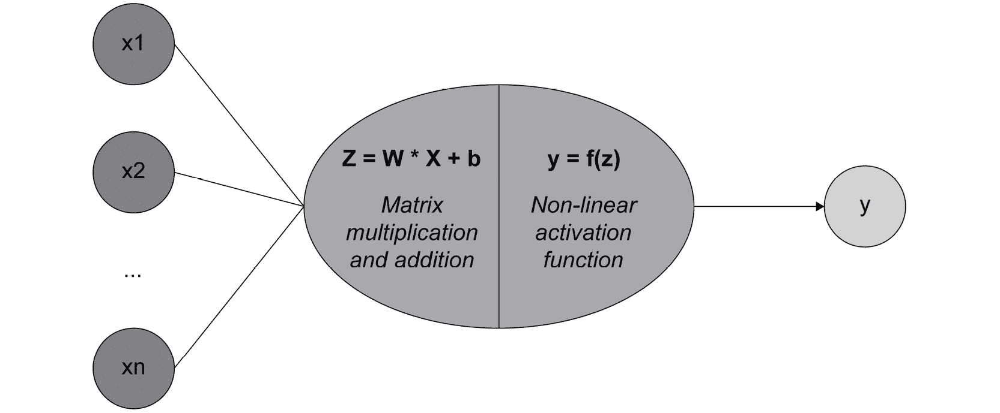

图 6.2：显示神经网络如何工作的图

通过以 `n=4` 为例，我们可以进一步理解前面的图形。在这种情况下，适用的公式为：

+   `X` 是输入矩阵，由 `x1`、`x2`、`x3` 和 `x4` 组成。

+   `W`，权重矩阵，将由 `w1`、`w2`、`w3` 和 `w4` 组成。

+   `b` 是偏置。

+   `f` 是激活函数。

我们将首先通过矩阵乘法和偏置计算 `Z`（神经元的左侧）：

```py
Z = W * X + b = x1*w1 + x2*w2 + x3*w3 + x4*w4 + b
```

然后，输出 `y` 将通过应用函数 `f` 来计算：

```py
y = f(Z) = f(x1*w1 + x2*w2 + x3*w3 + x4*w4 + b)
```

很好——这就是人工神经元在幕后工作的方式。它是两个矩阵运算，先乘积后求和，再经过函数变换。

现在我们进入下一部分——权重。

## 权重

`y`。

一个单一的神经元是加权和与激活函数的组合，可以称之为隐藏层。具有一个隐藏层的神经网络称为**常规神经网络**：

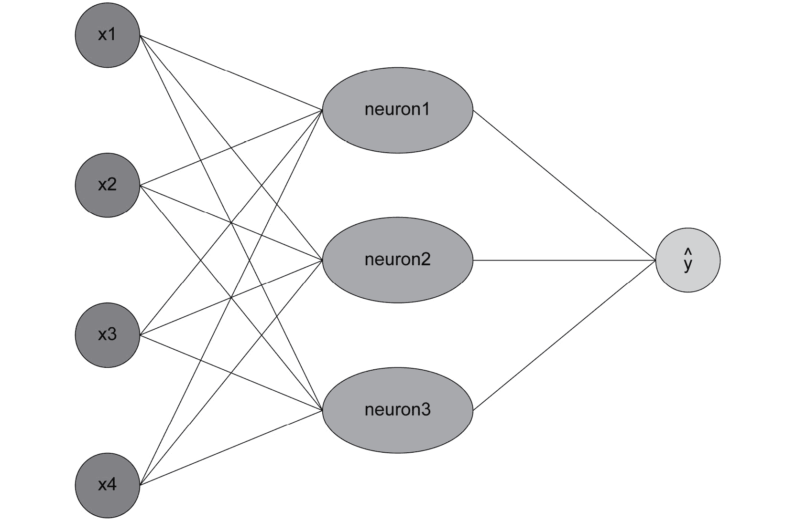

](img/B16060_06_03.jpg)

图 6.3：神经元 1、2 和 3 构成了这个示例网络的隐藏层

在连接输入和输出时，我们可能会有多个隐藏层。具有多个层的神经网络称为**深度神经网络**。

“深度学习”一词来自于多个层次的存在。在创建**人工神经网络**（**ANN**）时，我们可以指定隐藏层的数量。

## 偏置

之前，我们看到神经元的方程如下：

```py
y = f(x1*w1 + x2*w2 + x3*w3 + x4*w4)
```

这个方程的问题在于，缺少一个依赖于输入 `x1`、`x2`、`x3` 和 `x4` 的常数因子。前面的方程可以表示任何经过原点的线性函数：如果所有 `w` 值都等于 0，那么 `y` 也会等于 0。但对于那些不经过原点的其他函数呢？例如，假设我们正在预测某员工的流失概率，按其在职月份来算。即使他们还没有工作满一个月，流失概率也不可能为零。

为了适应这种情况，我们需要引入一个新参数 `b`，它可以等于 0.5，因此新雇员在第一个月的流失概率将是 50%。

因此，我们在方程中加入偏置：

```py
y = f(x1*w1 + x2*w2 + x3*w3 + x4*w4 + b)
y = f(x  w + b)
```

第一个方程是详细形式，描述了每个坐标、权重系数和偏置的作用。第二个方程是向量形式，其中 `x = (x1, x2, x3, x4)` 和 `w = (w1, w2, w3, w4)`。向量之间的点运算符表示这两个向量的点积或标量积。这两个方程是等效的。我们在实践中将使用第二种形式，因为使用 TensorFlow 定义变量向量比逐一定义每个变量更为简便。

类似地，对于 `w1`、`w2`、`w3` 和 `w4`，偏置 `b` 是一个变量，意味着它的值在学习过程中可以发生变化。

通过在每个神经元中内置这个常数因子，神经网络模型变得更加灵活，能够更好地拟合特定的训练数据集。

注意

由于某些负权重的存在，可能会发生产品`p = x1*w1 + x2*w2 + x3*w3 + x4*w4`为负的情况。我们可能仍然希望给予模型一定的灵活性，使其在值大于某个负数时能够激活（*或触发*）神经元。因此，添加一个常数偏置，例如`b = 5`，可以确保神经元在`-5`到`0`之间的值也能触发。

TensorFlow 提供了`Dense()`类来建模神经网络的隐藏层（*也叫做全连接层*）：

```py
from tensorflow.keras import layers
layer1 = layers.Dense(units=128, input_shape=[200])
```

在这个示例中，我们创建了一个包含`128`个神经元的全连接层，该层的输入为形状为`200`的张量。

注意

你可以在[`www.tensorflow.org/api_docs/python/tf/keras/layers/Dense`](https://www.tensorflow.org/api_docs/python/tf/keras/layers/Dense)找到有关此 TensorFlow 类的更多信息。

`Dense()`类要求输入是一个展平的数组（只有一行）。例如，如果输入的形状是`28`×`28`，你需要先使用`Flatten()`类将其展平，才能得到一个包含 784 个神经元（`28 * 28`）的单行数据：

```py
from tensorflow.keras import layers
input_layer = layers.Flatten(input_shape=(28, 28))
layer1 = layers.Dense(units=128)
```

注意

你可以在[`www.tensorflow.org/api_docs/python/tf/keras/layers/Flatten`](https://www.tensorflow.org/api_docs/python/tf/keras/layers/Flatten)找到有关此 TensorFlow 类的更多信息。

在接下来的部分中，我们将学习如何使用额外的参数扩展这一神经元层。

## 人工神经网络（ANNs）的应用场景

人工神经网络（ANNs）在监督学习技术中占有一席之地。它们可以处理分类和回归问题。分类器神经网络试图找到特征与标签之间的关系。特征是输入变量，而分类器可以选择作为返回值的每个类别是一个独立的输出。在回归的情况下，输入变量是特征，而只有一个输出：预测值。尽管传统的分类和回归技术在人工智能中有其应用场景，但人工神经网络通常更擅长发现输入与输出之间复杂的关系。

在下一节中，我们将探讨激活函数及其不同类型。

# 激活函数

如前所述，一个神经元需要通过应用激活函数来执行变换。神经网络中可以使用不同的激活函数。如果没有这些函数，神经网络将仅仅是一个线性模型，可以通过矩阵乘法轻松描述。

神经网络的激活函数提供了非线性，因此能够建模更复杂的模式。两种非常常见的激活函数是`sigmoid`和`tanh`（双曲正切函数）。

## Sigmoid

`sigmoid`的公式如下：


图 6.4：Sigmoid 公式

`sigmoid`函数的输出值范围是**0**到**1**。这种激活函数通常用于神经网络的最后一层，用于二分类问题。

## Tanh

双曲正切的公式如下：


图 6.5：tanh 公式

`tanh` 激活函数与 `sigmoid` 函数非常相似，并且直到最近都非常流行。它通常用于神经网络的隐藏层。它的值范围在 **-1** 和 **1** 之间。

## ReLU

另一个重要的激活函数是 `relu`。**ReLU** 代表 **Rectified Linear Unit**，目前是最广泛使用的隐藏层激活函数。其公式如下：


图 6.6：ReLU 公式

目前有不同版本的 `relu` 函数，例如 `leaky ReLU` 和 `PReLU`。

## Softmax

该函数将列表中的值缩放到 `softmax` 函数如下所示的范围：


图 6.7：softmax 公式

`softmax` 函数通常作为神经网络的最后一层，用于多类分类问题，因为它能够为每个不同的输出类别生成概率。

请记住，在 TensorFlow 中，我们可以通过激活函数扩展 `Dense()` 层；只需要设置 `activation` 参数即可。在以下示例中，我们将添加 `relu` 激活函数：

```py
from tensorflow.keras import layers
layer1 = layers.Dense(units=128, input_shape=[200], \
                      activation='relu')
```

让我们使用这些不同的激活函数，观察它们如何通过解决以下练习来抑制加权输入。

## 练习 6.02：激活函数

在本次练习中，我们将使用 `numpy` 包实现以下激活函数：`sigmoid`、`tanh`、`relu` 和 `softmax`。

以下步骤将帮助你完成练习：

1.  打开一个新的 Jupyter Notebook 文件。

1.  导入 `numpy` 包并命名为 `np`：

    ```py
    import numpy as np
    ```

1.  创建一个 `sigmoid` 函数，如下所示的代码片段，使用 `np.exp()` 方法实现 sigmoid 公式（如前所述）：

    ```py
    def sigmoid(x): 
        return 1 / (1 + np.exp(-x))
    ```

1.  计算 `sigmoid` 函数在值 `-1` 上的结果：

    ```py
    sigmoid(-1)
    ```

    预期输出如下：

    ```py
    0.2689414213699951
    ```

    这是对值 `-1` 执行 sigmoid 变换后的结果。

1.  导入 `matplotlib.pyplot` 包并命名为 `plt`：

    ```py
    import matplotlib.pyplot as plt
    ```

1.  创建一个名为 `x` 的 `numpy` 数组，包含从 `-10` 到 `10` 的均匀间隔的值，增量为 `0.1`，使用 `np.arange()` 方法。打印其值：

    ```py
    x = np.arange(-10, 10, 0.1)
    x
    ```

    预期输出如下：

    ```py
    array(-1.00000000e+01, -9.90000000e+00, -9.80000000e+00,
           -9.70000000e+00, -9.60000000e+00, -9.50000000e+00,
           -9.40000000e+00, -9.30000000e+00, -9.20000000e+00,
           -9.10000000e+00, -9.00000000e+00, -8.90000000e+00,
           -8.80000000e+00, -8.70000000e+00, -8.60000000e+00,
           -8.50000000e+00, -8.40000000e+00, -8.30000000e+00,
           -8.20000000e+00, -8.10000000e+00, -8.00000000e+00,
           -7.90000000e+00, -7.80000000e+00, -7.70000000e+00,
           -7.60000000e+00, -7.50000000e+00, -7.40000000e+00,
           -7.30000000e+00, -7.20000000e+00, -7.10000000e+00,
           -7.00000000e+00, -6.90000000e+00,
    ```

    很好——我们生成了一个包含从 `-10` 到 `10` 的值的 `numpy` 数组。

    注意

    前面的输出已被截断。

1.  使用 `plt.plot()` 和 `plt.show()` 绘制 `x` 和 `sigmoid(x)` 的折线图：

    ```py
    plt.plot(x, sigmoid(x))
    plt.show()
    ```

    预期输出如下：

    ![图 6.8：使用 sigmoid 函数的折线图        图 6.8：使用 sigmoid 函数的折线图    我们可以看到，`sigmoid` 函数的输出范围在 `0` 和 `1` 之间。对于接近 `0` 的值，斜率非常陡峭。1.  创建一个 `tanh()` 函数，使用 `np.exp()` 方法实现 Tanh 公式（如前所述）：    ```py    def tanh(x):         return 2 / (1 + np.exp(-2*x)) - 1    ```1.  使用`plt.plot()`和`plt.show()`绘制`x`和`tanh(x)`的折线图：    ```py    plt.plot(x, tanh(x))    plt.show()    ```    预期输出是这样的：    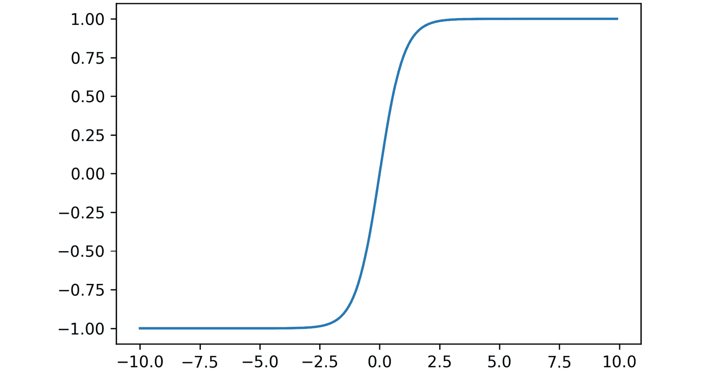

    图 6.9：使用 tanh 函数的折线图

    `tanh`函数的形状与`sigmoid`非常相似，但在接近`0`的值时，它的斜率更陡。记住，它的值域介于**-1**和**1**之间。

1.  创建一个`relu`函数，使用`np.maximum()`方法实现 ReLU 公式（如上一节所示）：

    ```py
    def relu(x):
        return np.maximum(0, x)
    ```

1.  使用`plt.plot()`和`plt.show()`绘制`x`和`relu(x)`的折线图：

    ```py
    plt.plot(x, relu(x))
    plt.show()
    ```

    预期输出是这样的：

    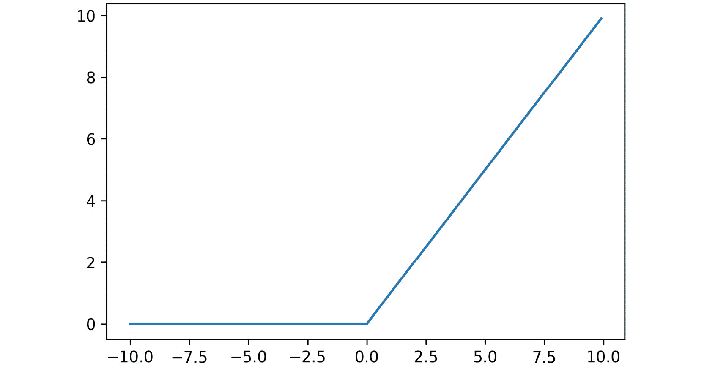

    图 6.10：使用 relu 函数的折线图

    当值为负数时，ReLU 函数等于`0`，当值为正数时，ReLU 函数等于恒等函数`f(x)=x`。

1.  创建一个`softmax`函数，使用`np.exp()`方法实现 softmax 公式（如上一节所示）：

    ```py
    def softmax(list): 
        return np.exp(list) / np.sum(np.exp(list))
    ```

1.  计算列表`[0, 1, 168, 8, 2]`上`softmax`的输出：

    ```py
    result = softmax( [0, 1, 168, 8, 2]) 
    result
    ```

    预期输出是这样的：

    ```py
    array([1.09276566e-73, 2.97044505e-73, 1.00000000e+00, 
           3.25748853e-70, 8.07450679e-73])
    ```

如预期的那样，第三个位置的项具有最高的 softmax 概率，因为它的原始值是最高的。

注意

要访问此特定部分的源代码，请参阅 [`packt.live/3fJzoOU`](https://packt.live/3fJzoOU)。

你也可以在网上运行这个示例，网址是 [`packt.live/3188pZi`](https://packt.live/3188pZi)。你必须执行整个 Notebook，才能获得预期的结果。

完成此练习后，我们实现了神经网络中一些最重要的激活函数。

# 前向传播和损失函数

到目前为止，我们已经看到一个神经元如何接收输入并对其进行一些数学运算以得到输出。我们了解到，神经网络是由多个神经元层组合而成的。

将神经网络的输入转化为结果的过程称为**前向传播**（或前向传递）。我们要求神经网络做的事情是，通过将多个神经元应用于输入数据，来进行预测（神经网络的最终输出）：

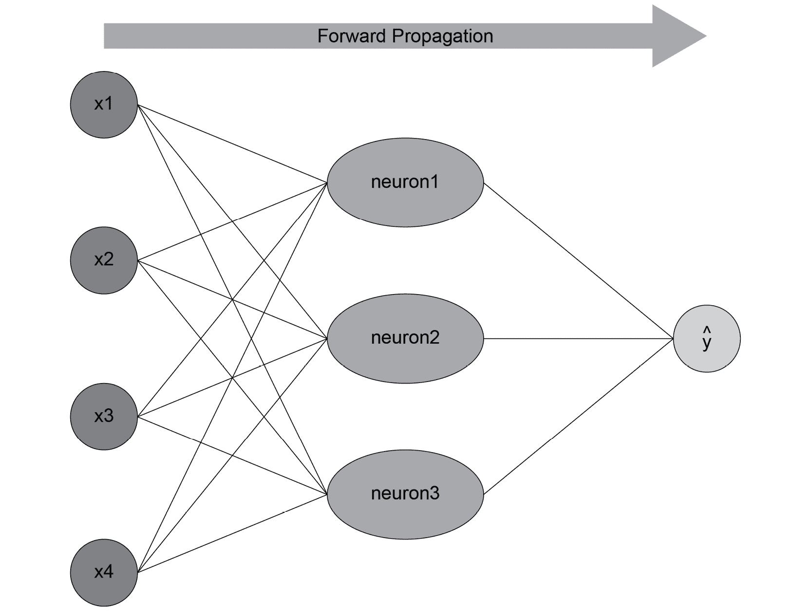

图 6.11：展示前向传播的图示

神经网络依赖于每个神经元的权重矩阵、偏置和激活函数来计算预测的输出值，。目前，我们假设权重矩阵和偏置的值已预设。激活函数在设计神经网络架构时定义。

对于任何监督式机器学习算法，目标都是做出准确的预测。这意味着我们需要评估预测与真实值之间的准确度。对于传统的机器学习算法，我们使用诸如均方误差、准确率或 F1 分数等评分指标。这同样适用于神经网络，但唯一的区别是，这些分数有两种不同的使用方式：

+   数据科学家使用它们来评估模型在训练集和测试集上的表现，然后根据需要调整超参数。这同样适用于神经网络，所以这里没有什么新鲜的东西。

+   神经网络利用它们自动从错误中学习，并更新权重矩阵和偏差。这个过程将在下一节详细解释，那个部分讲的是反向传播。因此，神经网络将使用一个度量标准（也叫做**损失函数**）来比较预测值与真实标签（y），并学习如何自动进行更好的预测。

损失函数对神经网络学习做出良好预测至关重要。这是一个超参数，需要数据科学家在设计神经网络架构时定义。选择使用哪种损失函数是完全任意的，取决于你想解决的数据集或问题，你会选择一种或另一种。幸运的是，有一些基本的经验法则在大多数情况下都有效：

+   如果你正在处理回归问题，可以使用均方误差。

+   如果是二分类问题，损失函数应该使用二元交叉熵。

+   如果是多类分类问题，那么你应该选择类别交叉熵作为损失函数。

最后需要注意的是，损失函数的选择也将决定你在神经网络最后一层使用哪种激活函数。每个损失函数都需要特定类型的数据来正确评估预测性能。

以下是根据损失函数和项目/问题类型列出的激活函数：


图 6.12：不同激活函数及其应用概述

使用 TensorFlow 时，为了构建自定义架构，你可以实例化 `Sequential()` 类，并按如下代码片段添加完全连接的神经元层：

```py
import tensorflow as tf
from tensorflow.keras import layers
model = tf.keras.Sequential()
input_layer = layers.Flatten(input_shape=(28,28))
layer1 = layers.Dense(128, activation='relu')
model.add(input_layer)
model.add(layer1)
```

现在是时候看看神经网络是如何通过反向传播改进预测的。

# 反向传播

之前，我们学习了神经网络如何通过使用其神经元的权重矩阵和偏置（我们可以将它们合并成一个单一的矩阵）来进行预测。通过使用损失函数，网络可以确定预测结果的好坏。如果它能利用这些信息并相应地更新参数，那就太好了。这正是反向传播的目的：优化神经网络的参数。

训练神经网络涉及多次执行前向传播和反向传播，以便进行预测并根据误差更新参数。在第一次传播中，我们首先初始化神经网络的所有权重。然后，进行前向传播，接着进行反向传播，后者会更新权重。

我们多次应用这个过程，神经网络会逐步优化其参数。你可以通过设置神经网络遍历整个数据集的最大次数（也叫做 epoch）来决定是否停止这个学习过程，或者如果神经网络在几个 epoch 后得分不再提升，则定义一个提前停止的阈值。

# 优化器和学习率

在前一节中，我们看到神经网络遵循一个迭代过程，以找到任何输入数据集的最佳解决方案。它的学习过程是一个优化过程。你可以使用不同的优化算法（也叫做`Adam`、`SGD`和`RMSprop`）。

神经网络优化器的一个重要参数是学习率。这个值定义了神经网络更新权重的速度。设置过低的学习率会减慢学习过程，神经网络需要很长时间才能找到合适的参数。另一方面，学习率过高会导致神经网络无法学习到合适的解决方案，因为它在每次更新时都会做出比需要更大的权重变化。一个好的做法是从一个不是很小的学习率开始（例如**0.01**或**0.001**），然后当神经网络的得分开始平稳或变差时停止训练，接着降低学习率（例如降低一个数量级）并继续训练网络。

使用 TensorFlow，你可以从`tf.keras.optimizers`实例化一个优化器。例如，下面的代码片段展示了如何创建一个学习率为`0.001`的`Adam`优化器，然后通过指定损失函数（`'sparse_categorical_crossentropy'`）和要显示的指标（`'accuracy'`）来编译我们的神经网络：

```py
import tensorflow as tf
optimizer = tf.keras.optimizers.Adam(0.001)
model.compile(loss='sparse_categorical_crossentropy', \
              optimizer=optimizer, metrics=['accuracy'])
```

一旦模型编译完成，我们就可以像这样使用`.fit()`方法训练神经网络：

```py
model.fit(features_train, label_train, epochs=5)
```

在这里，我们对训练集进行了`5`个 epoch 的神经网络训练。训练完成后，我们可以使用该模型在测试集上进行评估，并通过`.evaluate()`方法评估其性能：

```py
model.evaluate(features_test, label_test)
```

注意

你可以在[`www.tensorflow.org/api_docs/python/tf/keras/optimizers`](https://www.tensorflow.org/api_docs/python/tf/keras/optimizers)上找到更多关于 TensorFlow 优化器的信息。

在下一个练习中，我们将基于数据集训练一个神经网络。

## 练习 6.03：分类信用批准

在本练习中，我们将使用德国信用批准数据集，并训练一个神经网络来分类个人是否具备信用。

注意

数据集文件也可以在我们的 GitHub 仓库中找到：

[`packt.live/2V7uiV5`](https://packt.live/2V7uiV5)。

以下步骤将帮助你完成练习：

1.  打开一个新的 Jupyter Notebook 文件。

1.  从`numpy`中导入`loadtxt`方法：

    ```py
    from numpy import loadtxt
    ```

1.  创建一个名为`file_url`的变量，包含指向原始数据集的链接：

    ```py
    file_url = 'https://raw.githubusercontent.com/'\
               'PacktWorkshops/'\
               'The-Applied-Artificial-Intelligence-Workshop'\
               '/master/Datasets/german_scaled.csv'
    ```

1.  使用`loadtxt()`加载数据到一个名为`data`的变量中，并指定`delimiter=','`参数。打印其内容：

    ```py
    data = loadtxt(file_url, delimiter=',')
    data
    ```

    期望的输出是这样的：

    ```py
    array([[0\.        , 0.33333333, 0.02941176, ..., 0\.      , 1\.      ,
            1\.        ],
           [1\.        , 0\.        , 0.64705882, ..., 0\.      , 0\.      ,
            1\.        ],
           [0\.        , 1\.        , 0.11764706, ..., 1\.      , 0\.      ,
            1\.        ],
           ...,
           [0\.        , 1\.        , 0.11764706, ..., 0\.      , 0\.      ,
            1\.        ],
           [1\.        , 0.33333333, 0.60294118, ..., 0\.      , 1\.      ,
            1\.        ],
           [0\.        , 0\.        , 0.60294118, ..., 0\.      , 0\.      ,
            1\.        ]])
    ```

1.  创建一个名为`label`的变量，包含来自第一列的数据（这将是我们的响应变量）：

    ```py
    label = data[:, 0]
    ```

1.  创建一个名为`features`的变量，包含除第一列外的所有数据（第一列对应于响应变量）：

    ```py
    features = data[:, 1:]
    ```

1.  从`sklearn.model_selection`中导入`train_test_split`方法：

    ```py
    from sklearn.model_selection import train_test_split
    ```

1.  将数据拆分为训练集和测试集，并将结果保存到四个变量中，分别为`features_train`，`features_test`，`label_train`，`label_test`。使用 20%的数据作为测试集，并指定`random_state=7`：

    ```py
    features_train, features_test, \
    label_train, label_test = train_test_split(features, \
                                               label, \
                                               test_size=0.2, \
                                               random_state=7)
    ```

1.  导入`numpy`为`np`，`tensorflow`为`tf`，并从`tensorflow.keras`中导入`layers`：

    ```py
    import numpy as np
    import tensorflow as tf
    from tensorflow.keras import layers
    ```

1.  使用`np.random_seed()`和`tf.random.set_seed()`分别将`1`设置为`numpy`和`tensorflow`的种子：

    ```py
    np.random.seed(1)
    tf.random.set_seed(1)
    ```

1.  实例化一个`tf.keras.Sequential()`类，并将其保存到一个名为`model`的变量中：

    ```py
    model = tf.keras.Sequential()
    ```

1.  实例化一个`layers.Dense()`类，包含`16`个神经元，`activation='relu'`，`input_shape=[19]`，然后将其保存到一个名为`layer1`的变量中：

    ```py
    layer1 = layers.Dense(16, activation='relu', \
                          input_shape=[19])
    ```

1.  实例化第二个`layers.Dense()`类，包含`1`个神经元，`activation='sigmoid'`，然后将其保存到一个名为`final_layer`的变量中：

    ```py
    final_layer = layers.Dense(1, activation='sigmoid')
    ```

1.  使用`.add()`将你刚才定义的两个层添加到模型中：

    ```py
    model.add(layer1)
    model.add(final_layer)
    ```

1.  实例化一个`tf.keras.optimizers.Adam()`类，学习率为`0.001`，并将其保存到名为`optimizer`的变量中：

    ```py
    optimizer = tf.keras.optimizers.Adam(0.001)
    ```

1.  使用`.compile()`编译神经网络，`loss='binary_crossentropy'`，`optimizer=optimizer`，`metrics=['accuracy']`，如下代码片段所示：

    ```py
    model.compile(loss='binary_crossentropy', \
                  optimizer=optimizer, metrics=['accuracy'])
    ```

1.  使用`.summary()`打印模型的摘要：

    ```py
    model.summary()
    ```

    期望的输出是这样的：

    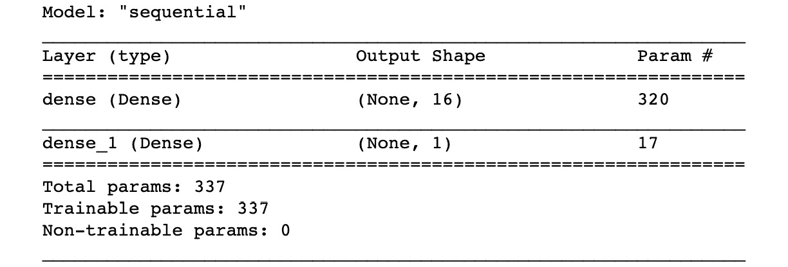

    ](img/B16060_06_13.jpg)

    图 6.13：顺序模型的摘要

    这个输出总结了我们神经网络的架构。我们可以看到它由三层组成，符合预期，并且知道每一层的输出大小和参数数量，这些参数对应于权重和偏置。例如，第一层有`16`个神经元和`320`个需要学习的参数（权重和偏置）。

1.  接下来，使用训练集拟合神经网络并指定`epochs=10`：

    ```py
    model.fit(features_train, label_train, epochs=10)
    ```

    期望的输出是这样的：

    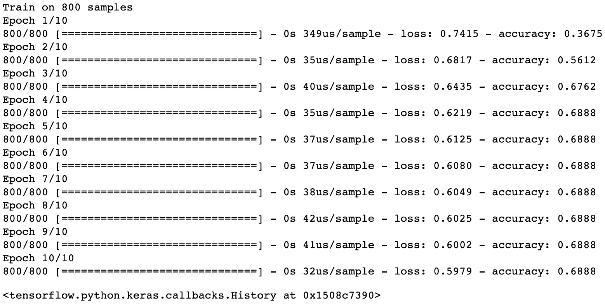

图 6.14：使用训练集拟合神经网络

输出提供了大量关于神经网络训练的信息。第一行告诉我们训练集由`800`个观测值组成。然后我们可以看到每一轮训练的结果：

总处理时间（秒）

每个数据样本的处理时间（微秒/样本）

损失值和准确度得分

这个神经网络的最终结果是最后一轮训练（`epoch=10`），我们在此达到了`0.6888`的准确度得分。但我们可以看到趋势在持续改善：每一轮训练后准确度得分都在增加。因此，如果我们通过增加训练轮数或降低学习率来延长训练时间，可能会得到更好的结果。

注意

要访问此特定部分的源代码，请参考 [`packt.live/3fMhyLk`](https://packt.live/3fMhyLk)。

你也可以在 [`packt.live/2Njghza`](https://packt.live/2Njghza) 在线运行这个示例。你必须执行整个 Notebook，才能得到预期的结果。

完成这个练习后，你就训练了你的第一个分类器。在传统的机器学习算法中，你需要编写更多的代码才能实现这一点，因为你需要定义神经网络的整个架构。在这里，神经网络在`10`轮训练后达到了`0.6888`，但如果让它训练得更长一些，性能仍然有提升空间。你可以尝试自己做一下。

接下来，我们将探讨正则化。

# 正则化

与任何机器学习算法一样，神经网络在学习仅对训练集相关的模式时，可能会面临过拟合的问题。在这种情况下，模型无法对未见过的数据进行泛化。

幸运的是，有多种技术可以帮助减少过拟合的风险：

+   L1 正则化，它向损失函数中添加了一个惩罚参数（权重的绝对值）

+   L2 正则化，它向损失函数中添加了一个惩罚参数（权重的平方值）

+   早停法，它会在验证集的误差增加而训练集的误差减少时停止训练

+   Dropout，它会在训练过程中随机移除一些神经元

所有这些技术都可以添加到我们创建的神经网络的每一层。在下一个练习中，我们将会深入探讨这一点。

## 练习 6.04：使用正则化预测波士顿房价

在这个练习中，你将构建一个神经网络，用来预测波士顿某个郊区的房价中位数，并了解如何为网络添加正则化方法。

注意

数据集文件也可以在我们的 GitHub 仓库中找到：[`packt.live/2V9kRUU`](https://packt.live/2V9kRUU)。

引用：数据最初由*Harrison, D. 和 Rubinfeld, D.L. 'Hedonic prices and the demand for clean air', J. Environ. Economics & Management, vol.5, 81-102, 1978*发布。

数据集包含`12`个不同的特征，提供有关郊区的信息和一个目标变量（`MEDV`）。目标变量是数字型，表示以$1,000 为单位的自有住房的中位数价值。

以下步骤将帮助你完成练习：

1.  打开一个新的 Jupyter Notebook 文件。

1.  将`pandas`包导入为`pd`：

    ```py
    import pandas as pd
    ```

1.  创建一个包含原始数据集链接的`file_url`变量：

    ```py
    file_url = 'https://raw.githubusercontent.com/'\
               'PacktWorkshops/'\
               'The-Applied-Artificial-Intelligence-Workshop'\
               '/master/Datasets/boston_house_price.csv'
    ```

1.  使用`pd.read_csv()`将数据集加载到一个名为`df`的变量中：

    ```py
    df = pd.read_csv(file_url)
    ```

1.  使用`.head()`显示前五行：

    ```py
    df.head()
    ```

    预期输出是这样的：

    

    图 6.15：输出显示数据集的前五行

1.  使用`.pop()`提取目标变量，并将其保存到一个名为`label`的变量中：

    ```py
    label = df.pop('MEDV')
    ```

1.  从`sklearn.preprocessing`导入`scale`函数：

    ```py
    from sklearn.preprocessing import scale
    ```

1.  对 DataFrame `df`进行缩放，并将结果保存到一个名为`scaled_features`的变量中。打印其内容：

    ```py
    scaled_features = scale(df)
    scaled_features
    ```

    预期输出是这样的：

    ```py
    array([[-0.41978194,  0.28482986, -1.2879095 , ..., -0.66660821,
            -1.45900038, -1.0755623 ],
           [-0.41733926, -0.48772236, -0.59338101, ..., -0.98732948,
            -0.30309415, -0.49243937],
           [-0.41734159, -0.48772236, -0.59338101, ..., -0.98732948,
            -0.30309415, -1.2087274 ],
           ...,
           [-0.41344658, -0.48772236,  0.11573841, ..., -0.80321172,
             1.17646583, -0.98304761],
           [-0.40776407, -0.48772236,  0.11573841, ..., -0.80321172,
             1.17646583, -0.86530163],
           [-0.41500016, -0.48772236,  0.11573841, ..., -0.80321172,
    ```

    从输出中可以看到，我们的所有特征现在已经标准化。

1.  从`sklearn.model_selection`导入`train_test_split`：

    ```py
    from sklearn.model_selection import train_test_split
    ```

1.  将数据拆分为训练集和测试集，并将结果保存到四个变量中，分别为`features_train`，`features_test`，`label_train`和`label_test`。使用 10%的数据作为测试集，并指定`random_state=8`：

    ```py
    features_train, features_test, \
    label_train, label_test = train_test_split(scaled_features, \
                                               label, \
                                               test_size=0.1, \
                                               random_state=8)
    ```

1.  将`numpy`导入为`np`，`tensorflow`导入为`tf`，并从`tensorflow.keras`导入`layers`：

    ```py
    import numpy as np
    import tensorflow as tf
    from tensorflow.keras import layers
    ```

1.  使用`np.random_seed()`和`tf.random.set_seed()`设置 NumPy 和 TensorFlow 的种子为`8`：

    ```py
    np.random.seed(8)
    tf.random.set_seed(8)
    ```

1.  实例化一个`tf.keras.Sequential()`类，并将其保存到一个名为`model`的变量中：

    ```py
    model = tf.keras.Sequential()
    ```

1.  接下来，使用`tf.keras.regularizers.l1_l2`创建一个结合了`l1`和`l2`正则化器，`l1=0.01`和`l2=0.01`。将其保存到一个名为`regularizer`的变量中：

    ```py
    regularizer = tf.keras.regularizers.l1_l2(l1=0.1, l2=0.01)
    ```

1.  实例化一个`layers.Dense()`类，使用`10`个神经元，`activation='relu'`，`input_shape=[12]`，以及`kernel_regularizer=regularizer`，并将其保存到一个名为`layer1`的变量中：

    ```py
    layer1 = layers.Dense(10, activation='relu', \
             input_shape=[12], kernel_regularizer=regularizer)
    ```

1.  实例化第二个`layers.Dense()`类，使用`1`个神经元，并将其保存到一个名为`final_layer`的变量中：

    ```py
    final_layer = layers.Dense(1)
    ```

1.  使用`.add()`将刚定义的两个层添加到模型中，并在它们之间添加一个`layers.Dropout(0.25)`层：

    ```py
    model.add(layer1)
    model.add(layers.Dropout(0.25))
    model.add(final_layer)
    ```

    我们在每个全连接层之间添加了一个 dropout 层，它会随机移除 25%的神经元。

1.  实例化一个`tf.keras.optimizers.SGD()`类，学习率为`0.001`，并将其保存到一个名为`optimizer`的变量中：

    ```py
    optimizer = tf.keras.optimizers.SGD(0.001)
    ```

1.  使用`.compile()`编译神经网络，配置`loss='mse'`，`optimizer=optimizer`，`metrics=['mse']`：

    ```py
    model.compile(loss='mse', optimizer=optimizer, \
                  metrics=['mse'])
    ```

1.  使用`.summary()`打印模型的摘要：

    ```py
    model.summary()
    ```

    预期输出是这样的：

    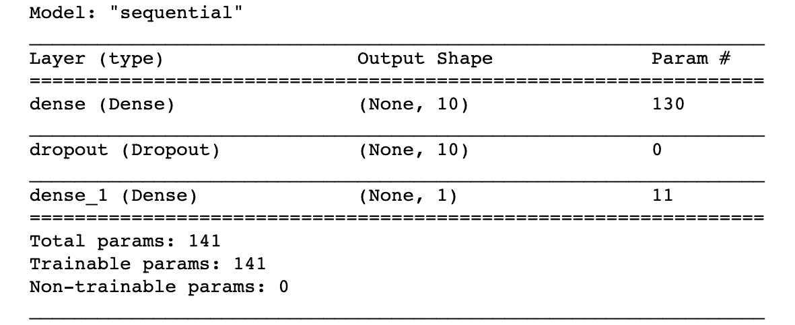

    图 6.16：模型摘要

    此输出总结了我们神经网络的架构。我们可以看到它由三层组成，其中有两层密集层和一层丢弃层。

1.  实例化一个`tf.keras.callbacks.EarlyStopping()`类，设置`monitor='val_loss'`和`patience=2`作为学习率，并将其保存到名为`callback`的变量中：

    ```py
    callback = tf.keras.callbacks.EarlyStopping(monitor='val_loss', \
                                                patience=2)
    ```

    我们刚刚定义了一个回调，声明神经网络将在验证损失（`monitor='val_loss'`）在`2`个 epochs（`patience=2`）内未改善时停止训练。

1.  使用训练集拟合神经网络，并指定`epochs=50`，`validation_split=0.2`，`callbacks=[callback]`和`verbose=2`：

    ```py
    model.fit(features_train, label_train, \
              epochs=50, validation_split = 0.2, \
              callbacks=[callback], verbose=2)
    ```

    预期输出如下：

    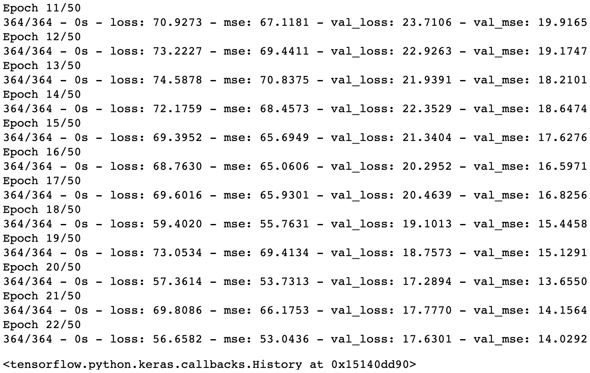

图 6.17：使用训练集拟合神经网络

在输出中，我们看到神经网络在第 22 个 epoch 后停止了训练。它在最大 epochs 数`50`之前停止了训练。这是因为我们之前设置的回调：如果验证损失在两个 epoch 后没有改善，训练应该停止。

注意

要访问此特定部分的源代码，请参见[`packt.live/2Yobbba`](https://packt.live/2Yobbba)。

你也可以在[`packt.live/37SVSu6`](https://packt.live/37SVSu6)在线运行此示例。你必须执行整个 Notebook 才能获得预期的结果。

你刚刚应用了多种正则化技术，并训练了一个神经网络来预测波士顿郊区的住房中位数值。

## 活动 6.01：为数字数据集找到最佳准确度得分

在本活动中，你将训练和评估一个神经网络，该网络将识别由 MNIST 数据集提供的手写数字图像。你将专注于实现最佳的准确度得分。

注意

你可以在 TensorFlow 官网上阅读更多关于该数据集的信息：[`www.tensorflow.org/datasets/catalog/mnist`](https://www.tensorflow.org/datasets/catalog/mnist)。

引用：该数据集最初由*Yann Lecun*分享。

以下步骤将帮助你完成该活动：

1.  导入 MNIST 数据集。

1.  通过将数据除以`255`来标准化数据。

1.  创建一个具有以下层的神经网络架构：

    一个扁平化的输入层，使用`layers.Flatten(input_shape=(28,28))`

    一个完全连接的层，使用`layers.Dense(128, activation='relu')`

    一个丢弃层，使用`layers.Dropout(0.25)`

    一个完全连接的层，使用`layers.Dense(10, activation='softmax')`

1.  指定一个学习率为`0.001`的`Adam`优化器。

1.  在验证损失上定义一个早停机制，`patience=5`。

1.  训练模型。

1.  评估模型并找到准确度得分。

预期输出如下：

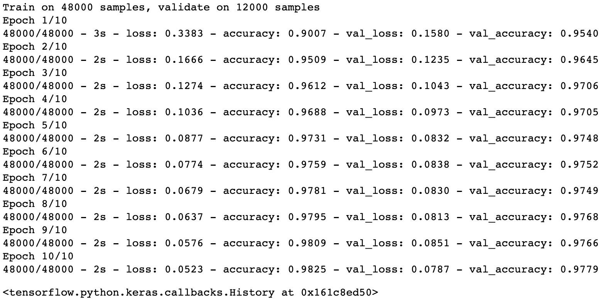

图 6.18：预期的准确度得分

注意

该活动的解决方案可以在第 378 页找到

在下一部分，我们将深入探讨深度学习的主题。

# 深度学习

现在我们已经能够构建和训练一个具有一个隐藏层的神经网络，我们可以研究更复杂的深度学习架构。

深度学习只是传统神经网络的扩展，但具有更深和更复杂的架构。深度学习可以建模非常复杂的模式，应用于检测图像中的物体、将文本翻译成不同语言等任务。

## 浅层与深层网络

现在我们已经能够构建和训练一个具有一个隐藏层的神经网络，我们可以研究更复杂的深度学习架构。

如前所述，我们可以在神经网络中添加更多的隐藏层。这将增加需要学习的参数数量，但有可能帮助建模更复杂的模式。这就是深度学习的核心：增加神经网络的深度，以解决更复杂的问题。

例如，我们可以在前向传播和损失函数部分中呈现的神经网络中添加第二层：

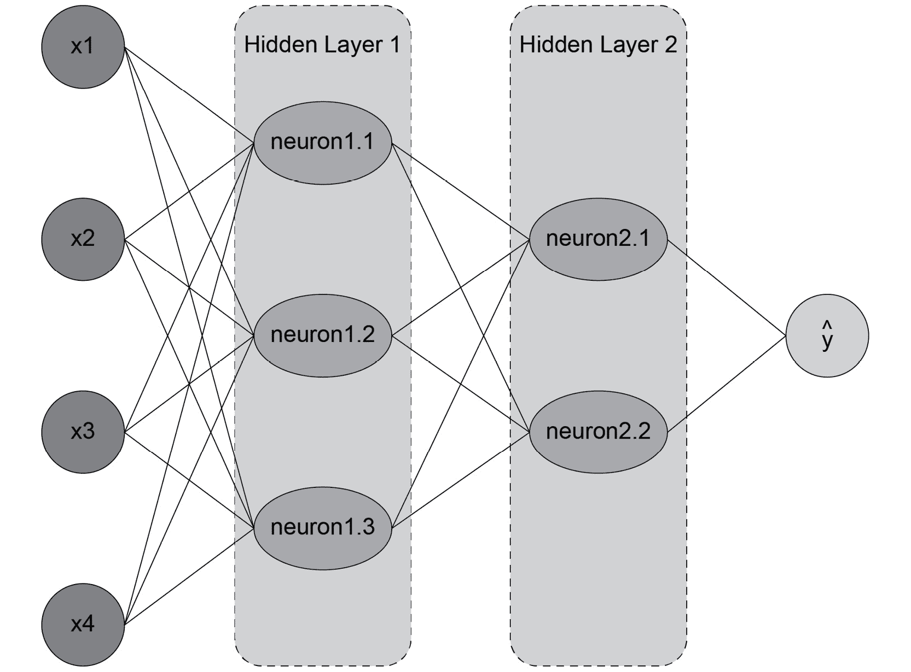

图 6.19：显示神经网络中两个隐藏层的图

理论上，我们可以添加无限多个隐藏层。但深层网络有一个缺点。增加深度还会增加需要优化的参数数量。因此，神经网络需要训练更长时间。所以，作为良好的实践，最好从更简单的架构开始，然后逐步增加其深度。

# 计算机视觉与图像分类

深度学习在计算机视觉和自然语言处理方面取得了惊人的成果。计算机视觉是一个涉及分析数字图像的领域。数字图像是由**像素**组成的矩阵。每个像素的值在**0**到**255**之间，这个值表示像素的强度。一张图像可以是黑白的，并且只有一个通道。但它也可以是彩色的，在这种情况下，它将有三个通道，分别代表红色、绿色和蓝色。这种数字版本的图像可以输入到深度学习模型中。

计算机视觉有多种应用，例如图像分类（识别图像中的主要物体）、物体检测（定位图像中的不同物体）和图像分割（寻找图像中物体的边缘）。本书将只关注图像分类。

在下一节中，我们将讨论一种特定类型的架构：CNNs。

## 卷积神经网络（CNNs）

**卷积神经网络（CNNs）**是针对图像相关模式识别优化的人工神经网络。CNNs 基于卷积层，而不是全连接层。

卷积层用于通过滤波器检测图像中的模式。滤波器只是一个矩阵，通过卷积操作应用到输入图像的某个部分，输出将是另一张图像（也称为特征图），其中突出显示了滤波器找到的模式。例如，一个简单的滤波器可以识别花朵上的垂直线条，如下图所示：

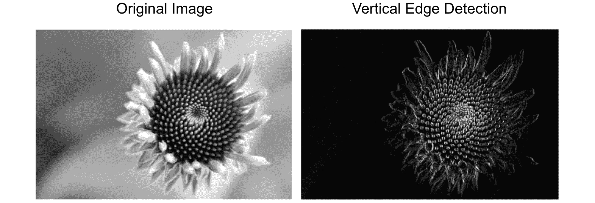

图 6.20：卷积在图像中检测模式

这些滤波器不是事先设定好的，而是通过卷积神经网络（CNN）自动学习的。训练结束后，CNN 可以识别图像中的不同形状。这些形状可以出现在图像的任何地方，卷积操作符无论图像的精确位置和方向如何，都能识别类似的信息。

## 卷积操作

卷积是一种特定类型的矩阵运算。对于输入图像，大小为`n*n`的滤波器将遍历图像的特定区域，执行逐元素相乘和求和，并返回计算结果：

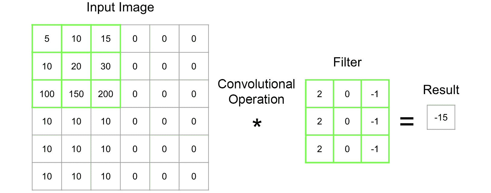

图 6.21：卷积操作

在前面的例子中，我们将滤波器应用到图像的左上部分。然后，我们执行逐元素相乘，将输入图像中的一个元素与滤波器上对应的值相乘。在这个例子中，我们计算了以下内容：

+   第 1 行，第 1 列：`5` * `2` = `10`

+   第 1 行，第 2 列：`10` * `0` = `0`

+   第 1 行，第 3 列：`15` * `(-1)` = `-15`

+   第 2 行，第 1 列：`10` * `2` = `20`

+   第 2 行，第 2 列：`20` * `0` = `0`

+   第 2 行，第 3 列：`30` * `(-1)` = `-30`

+   第 3 行，第 1 列：`100` * `2` = `200`

+   第 3 行，第 2 列：`150` * `0` = `0`

+   第 3 行，第 3 列：`200` * `(-1)` = `-200`

最后，我们对这些值进行求和：`10` + `0` -`15` + `20` + `0` - `30` + `200` + `0` - `200` = `-15`。

然后，我们将通过将滤波器向右滑动一个列来执行相同的操作。我们会一直滑动滤波器，直到覆盖整个图像：

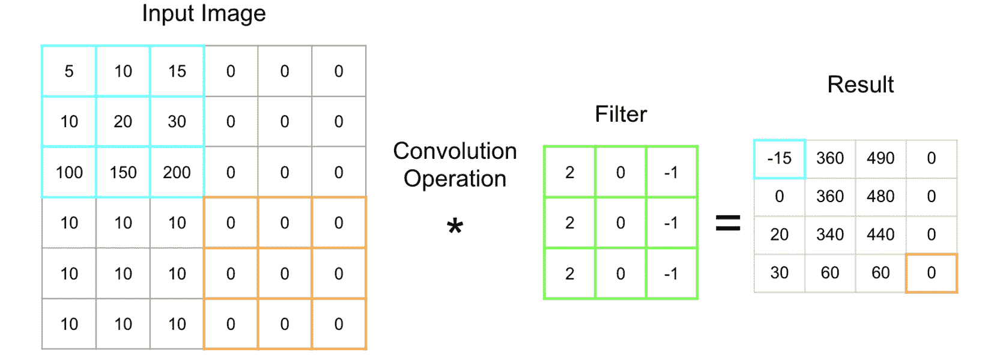

图 6.22：在不同的行和列上进行卷积操作

我们不仅可以按列滑动，也可以按两列、三列或更多列滑动。定义滑动操作长度的参数称为**步幅**。

你可能已经注意到，卷积操作的结果是一个尺寸比输入图像小的图像（或特征图）。如果你想保持相同的尺寸，可以在输入图像的边界周围添加额外的行和列，值为 0。这种操作称为**填充**。

这就是卷积操作背后的原理。卷积层就是应用这种操作并使用多个滤波器。

我们可以在 TensorFlow 中用以下代码片段声明一个卷积层：

```py
from tensorflow.keras import layers
layers.Conv2D(32, kernel_size=(3, 3), strides=(1,1), \
              padding="valid", activation="relu")
```

在上面的示例中，我们已经实例化了一个具有 `32` 个滤波器的卷积层（也叫做 `(3, 3)` 卷积，步幅为 `1`（每次滑动窗口按 1 列或 1 行移动），并且没有填充（`padding="valid"`）。

注意

您可以在 TensorFlow 的官方网站上阅读更多关于 Conv2D 类的信息，网址为 [`www.tensorflow.org/api_docs/python/tf/keras/layers/Conv2D`](https://www.tensorflow.org/api_docs/python/tf/keras/layers/Conv2D)。

在 TensorFlow 中，卷积层期望输入为具有以下格式的张量：（**行数**，**高度**，**宽度**，**通道数**）。根据数据集的不同，您可能需要重塑图像以符合此要求。TensorFlow 提供了一个函数来执行此操作，如下所示：

```py
features_train.reshape(60000, 28, 28, 1)
```

## 池化层

CNN 架构中另一个常见的层是池化层。我们之前已经看到，如果没有添加填充，卷积层会减小图像的大小。这种行为是预期的吗？为什么我们不保持输入图像的完全相同的大小？通常，在 CNN 中，我们倾向于随着不同层的推进，逐渐减少特征图的大小。这样做的主要原因是，我们希望在网络的末端有更多和更多特定的模式检测器。

在网络的前端，CNN 更倾向于具有更通用的滤波器，例如垂直或水平线检测器；但随着网络的加深，例如，如果我们训练一个 CNN 来区分猫和狗，它可能会有可以检测狗尾巴或猫胡须的滤波器；或者如果我们分类水果图像，滤波器可以检测物体的纹理。此外，较小的特征图能降低检测到错误模式的风险。

通过增加步幅，我们可以进一步减小输出特征图的大小。但还有另一种方法可以做到这一点：在卷积层后添加池化层。池化层是一个给定大小的矩阵，它会对特征图的每个区域应用聚合函数。最常见的聚合方法是找到一组像素中的最大值：

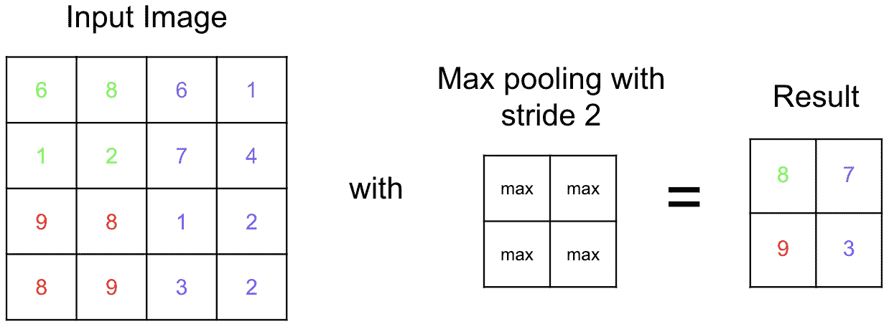

图 6.23：池化层的工作原理

在上面的示例中，我们使用了大小为 (`2, 2`) 且步幅为 `2` 的最大池化。我们查看特征图的左上角，找到像素 `6`、`8`、`1` 和 `2` 中的最大值，得到结果 `8`。然后，我们通过步幅 `2` 滑动最大池化，对像素 `6`、`1`、`7` 和 `4` 执行相同的操作。我们对底部的区域重复相同的操作，得到一个大小为 (`2,2`) 的新特征图。

在 TensorFlow 中，我们可以使用 `MaxPool2D()` 类来声明一个最大池化层：

```py
from tensorflow.keras import layers
layers.MaxPool2D(pool_size=(2, 2), strides=2)
```

注意

您可以在 TensorFlow 的官方网站上阅读更多关于 Conv2D 类的信息，网址为 [`www.tensorflow.org/api_docs/python/tf/keras/layers/MaxPool2D`](https://www.tensorflow.org/api_docs/python/tf/keras/layers/MaxPool2D)。

## CNN 架构

正如你之前看到的，你可以通过指定隐藏层的类型和数量、激活函数等，定义你自己的自定义 CNN 架构。但对于初学者来说，这可能有些令人畏惧。我们如何知道每一层需要添加多少个滤波器，或者适当的步幅是多少呢？我们必须尝试多种组合，看看哪种效果最好。

幸运的是，深度学习领域的许多研究人员已经做了这样的探索性工作，并公开了他们设计的架构。目前，最著名的架构包括：

+   AlexNet

+   VGG

+   ResNet

+   Inception

    注意

    我们不会详细介绍每种架构，因为它超出了本书的范围，但你可以在 TensorFlow 的官方网站上阅读更多关于不同 CNN 架构的信息，网址为[`www.tensorflow.org/api_docs/python/tf/keras/applications`](https://www.tensorflow.org/api_docs/python/tf/keras/applications)。

## 活动 6.02：使用 CNN 评估时尚图像识别模型

在本活动中，我们将训练一个 CNN 来识别属于 Fashion MNIST 数据集中的 10 个不同类别的服装图像。我们将计算这个 CNN 模型的准确性。

注意

你可以在 TensorFlow 的网站上阅读更多关于这个数据集的信息，网址为[`www.tensorflow.org/datasets/catalog/fashion_mnist`](https://www.tensorflow.org/datasets/catalog/fashion_mnist)。

原始数据集由*Han Xiao*分享。

以下步骤将帮助你完成这个活动：

1.  导入 Fashion MNIST 数据集。

1.  重新调整训练集和测试集的形状。

1.  通过对数据进行`255`除法标准化。

1.  创建一个具有以下层的神经网络架构：

    三个卷积层，使用`Conv2D(64, (3,3), activation='relu')`，后跟`MaxPooling2D(2,2)`

    一个 Flatten 层

    一个全连接层，使用`Dense(128, activation=relu)`

    一个全连接层，使用`Dense(10, activation='softmax')`

1.  指定一个学习率为`0.001`的`Adam`优化器。

1.  训练模型。

1.  在测试集上评估模型。

预期输出如下：

```py
10000/10000 [==============================] - 1s 108us/sample - loss: 0.2746 - accuracy: 0.8976
[0.27461639745235444, 0.8976]
```

注意

这个活动的解决方案可以在第 382 页找到。

在接下来的部分中，我们将学习另一种深度学习架构：RNN。

# 循环神经网络（RNNs）

在上一部分中，我们学习了如何使用 CNN 进行计算机视觉任务，如图像分类。随着深度学习的发展，计算机现在能够实现甚至超越人类的表现。另一个正在吸引研究人员大量关注的领域是自然语言处理，这是一个 RNN 表现突出的领域。

在过去的几年里，我们见证了 RNN 技术的许多不同应用，如语音识别、聊天机器人和文本翻译应用。但 RNN 在预测时间序列模式方面也表现得相当出色，这一点在股票市场预测中得到了广泛应用。

## RNN 层

所有先前提到的应用程序的共同点是它们的输入是顺序的。输入中有一个时间组件。例如，句子是单词的序列，单词的顺序很重要；股票市场数据由一系列日期和相应的股价组成。

为了适应这样的输入，我们需要神经网络能够处理输入序列，并能够保持对它们之间关系的理解。一种方法是创建记忆，让网络考虑先前的输入。这正是基本循环神经网络的工作方式：

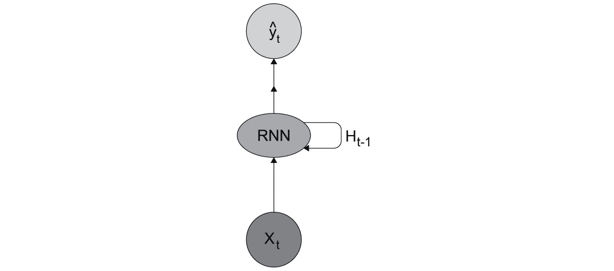

图 6.24：单个循环神经网络概述

在前面的图中，我们可以看到一个神经网络接收称为 `X`t 的输入，并进行一些转换，并给出输出结果，。到目前为止没有新东西。

但您可能已经注意到，还有一个名为 Ht-1 的附加输出，它是一个输出，但也是神经网络的输入。这就是 RNN 模拟记忆的方式 - 通过考虑其先前的结果并将其作为额外输入。因此，结果  将取决于输入 xt，但也取决于 Ht-1。现在，我们可以表示四个输入的序列，这些输入被馈送到同一个神经网络中。

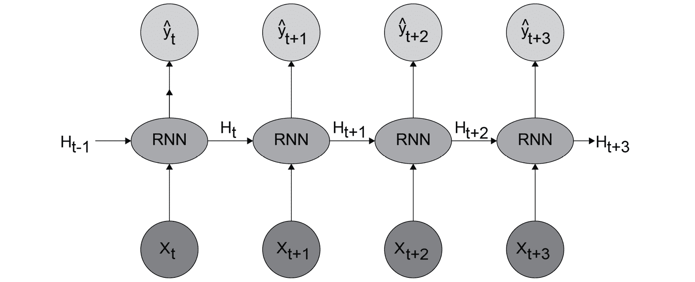

图 6.25：循环神经网络概述

我们可以看到神经网络在每个时间步（`t`、`t+1`、…、`t+3`）中接收一个输入（`x`）并生成一个输出（`y`），同时生成另一个输出（`h`），该输出将传递到下一次迭代。

注意

前面的图可能有点误导性 - 这里实际上只有一个循环神经网络（中间的所有循环神经网络框形成一个神经网络），但从这种格式更容易看出顺序如何工作。

RNN 单元内部如下所示：


图 6.26：使用 tanh 的 RNN 的内部工作方式

它与简单神经元非常相似，但接受更多的输入，并使用 `tanh` 作为激活函数。

注意

在 RNN 单元中，您可以使用任何激活函数。在 TensorFlow 中，默认值是 `tanh`。

这是 RNN 的基本逻辑。在 TensorFlow 中，我们可以使用 `layers.SimpleRNN` 实例化一个 RNN 层：

```py
from tensorflow.keras import layers
layers.SimpleRNN(4, activation='tanh')
```

在代码片段中，我们创建了一个具有 `4` 个输出和 `tanh` 激活函数（这是用于 RNN 的最常用的激活函数）的 RNN 层。

## GRU 层

前一类型层的一个缺点是最终输出考虑了所有先前的输出。如果您有 1,000 个输入单元的序列，则最终输出 `y` 受每一个先前结果的影响。如果此序列由 1,000 个单词组成，而我们试图预测下一个单词，则必须记住所有 1,000 个单词真的太多了。可能只需查看最终输出之前的前 100 个单词。

这正是 **门控循环单元**（**GRU**）单元的作用。我们来看看它们的内部结构：

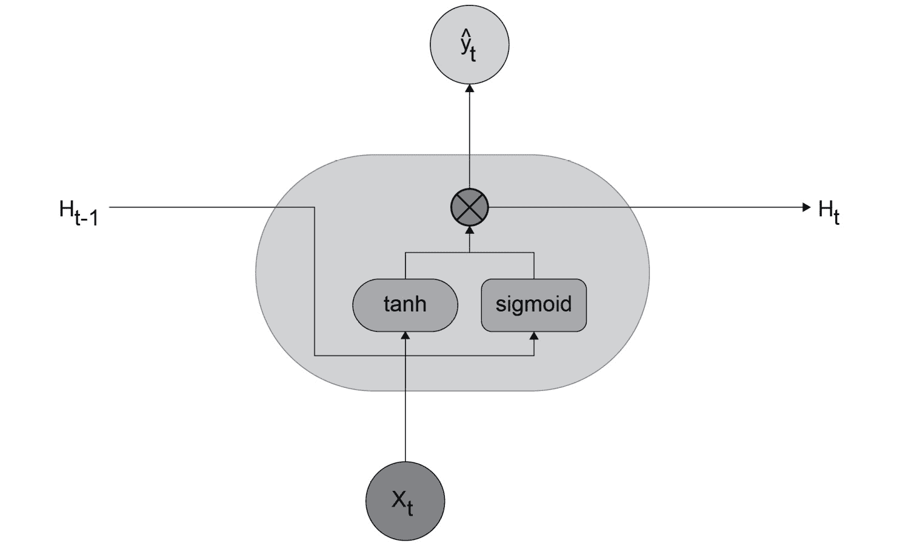

图 6.27：使用 tanh 和 sigmoid 的 RNN 内部工作原理

与简单的 RNN 单元相比，GRU 单元有更多的元素：

+   第二个激活函数，即 `sigmoid`

+   在生成输出之前执行的乘法运算  和 Ht

通常使用的 `tanh` 路径仍然负责进行预测，但这次我们称之为“候选”。sigmoid 路径充当“更新”门。它将告诉 GRU 单元是否需要丢弃此候选值。记住，输出范围在 **0** 到 **1** 之间。如果接近 0，则更新门（即 sigmoid 路径）会表示我们不应考虑这个候选。

另一方面，如果它更接近 1，则我们肯定应该使用这个候选的结果。

记住，输出 Ht 与 Ht-1 相关，Ht-1 又与 Ht-2 相关，依此类推。因此，更新门还将定义我们应保留多少“记忆”。它倾向于优先考虑与当前输出更接近的先前输出。

这就是 GRU 的基本逻辑（请注意，GRU 单元还有一个额外的组件，即重置门，但为了简化，我们将不讨论它）。在 TensorFlow 中，我们可以通过 `layers.GRU` 实例化这样的层：

```py
from tensorflow.keras import layers
layers.GRU(4, activation='tanh', \
           recurrent_activation='sigmoid')
```

在代码片段中，我们创建了一个具有 `4` 个输出单元的 GRU 层，候选预测使用 `tanh` 激活函数，更新门使用 sigmoid 激活函数。

## LSTM 层

还有另一种非常流行的 RNN 架构单元，叫做 LSTM 单元。**LSTM** 代表 **长短期记忆**。LSTM 比 GRU 先出现，但后者更简单，这就是我们首先介绍 GRU 的原因。LSTM 的内部结构如下：

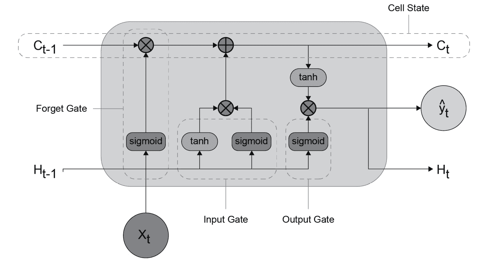

图 6.28：LSTM 概述

一开始，这看起来非常复杂。它由几个元素组成：

+   `细胞状态`：这是所有先前输出的拼接。它是 LSTM 单元的“记忆”。

+   `遗忘门`：它负责定义是否应该保留或忘记给定的记忆。

+   `输入门`：它负责定义是否需要更新新的记忆候选。然后，将此新记忆候选加入到先前的记忆中。

+   `输出门`：它负责根据先前的输出（Ht-1）、当前输入（xt）和记忆进行预测。

LSTM 单元可以考虑先前的结果，也可以考虑过去的记忆，这就是它如此强大的原因。

在 TensorFlow 中，我们可以通过 `layers.SimpleRNN` 实例化这样的层：

```py
from tensorflow.keras import layers
layers.LSTM(4, activation='tanh', \
            recurrent_activation='sigmoid')
```

在代码片段中，我们创建了一个具有 `4` 个输出单元的 LSTM 层，候选预测使用 `tanh` 激活函数，更新门使用 sigmoid 激活函数。

注意

你可以在这里阅读更多关于 TensorFlow 中 SimpleRNN 实现的内容：[`www.tensorflow.org/api_docs/python/tf/keras/layers/SimpleRNN`](https://www.tensorflow.org/api_docs/python/tf/keras/layers/SimpleRNN)。  

## 活动 6.03：评估基于 RNN 的 Yahoo 股票模型  

在本活动中，我们将使用 LSTM 训练一个 RNN 模型，以预测基于过去 `30` 天数据的 Yahoo! 股票价格。我们将寻找最佳的均方误差值，并检查模型是否发生过拟合。我们将使用在*第二章*《回归简介》中看到的相同的 Yahoo 股票数据集。  

注意  

数据集文件也可以在我们的 GitHub 仓库中找到：[`packt.live/3fRI5Hk`](https://packt.live/3fRI5Hk)。  

以下步骤将帮助你完成此活动：  

1.  导入 Yahoo 股票数据集。  

1.  提取 `close price` 列。  

1.  对数据集进行标准化。  

1.  创建过去`30`天的股票价格特征。  

1.  重塑训练集和测试集。  

1.  创建神经网络架构，包含以下层：  

    五个 LSTM 层，使用 `LSTM(50, (3,3), activation='relu')` 后跟 `Dropout(0.2)`  

    一个全连接层，使用 `Dense(1)`

1.  指定学习率为 `0.001` 的 `Adam` 优化器。  

1.  训练模型。  

1.  在测试集上评估模型。  

期望的输出结果是：  

```py
1000/1000 [==============================] - 0s 279us/sample - loss: 0.0016 - mse: 0.0016
[0.00158528157370165, 0.0015852816]
```

注意  

该活动的解决方案可以在第 387 页找到。  

在接下来的部分，我们将讨论深度学习所需的硬件。  

## 深度学习硬件  

如你所见，训练深度学习模型比传统机器学习算法需要更长的时间。这是因为前向传播和反向传播过程中需要进行大量计算。在本书中，我们训练了只有少数几层的简单模型。但也有一些架构有数百层，甚至更多。那种网络的训练可能需要几天，甚至几周。  

为了加速训练过程，建议使用一种名为 GPU 的特定硬件。GPU 擅长执行数学运算，因此非常适合深度学习。与**中央处理单元**（**CPU**）相比，GPU 在训练深度学习模型时速度可以快到 10 倍。你可以亲自购买 GPU 并搭建自己的深度学习计算机，只需要确保所购买的 GPU 支持 CUDA（目前只有 NVIDIA 的 GPU 支持）。  

另一种选择是使用像 AWS 或 Google Cloud Platform 这样的云服务提供商，并在云端训练模型。你只需为实际使用的部分付费，且在完成后可以随时关闭它们。好处是，你可以根据项目的需求调整配置的规模，但要注意费用。如果你的实例一直开启，即使没有训练模型，也会产生费用。所以，如果不使用时，记得关闭实例。  

最后，谷歌最近发布了一些专门用于深度学习的新硬件：**张量处理单元**（**TPUs**）。它们比 GPU 快得多，但成本也相当高。目前，只有谷歌云平台在其云实例中提供这种硬件。

## 挑战与未来趋势

像任何新技术一样，深度学习也面临着挑战。其中之一是巨大的入门门槛。要成为一名深度学习从业者，你曾经需要非常了解深度学习背后的所有数学理论，并且是一名熟练的程序员。此外，你还需要学习你选择使用的深度学习框架的具体知识（无论是 TensorFlow、PyTorch、Caffe，还是其他任何框架）。一段时间以来，深度学习无法接触到广泛的受众，主要局限于研究人员。但这种情况已经发生了变化，尽管仍不完美。例如，TensorFlow 现在有了一个更高级的 API，叫做 Keras（这就是你在本章看到的），它比核心 API 更容易使用。希望这种趋势会继续下去，让深度学习框架对任何有兴趣的人都更加易于接触。

第二个挑战是，深度学习模型需要大量的计算能力，正如前面一节所提到的。这再次成为任何想要尝试的人面临的主要障碍。尽管 GPU 的成本已经下降，深度学习仍然需要一些前期投资。幸运的是，现在我们有了一个免费的选择来使用 GPU 训练深度学习模型：Google Colab。这是谷歌推出的一项倡议，旨在通过提供免费的临时云计算来促进研究。你需要的唯一条件是一个 Google 账号。注册后，你可以创建笔记本（类似于 Jupyter 笔记本），并选择一个内核，在 CPU、GPU（每天限制 10 小时）甚至 TPU（每天限制½小时）上运行。因此，在投资购买或租赁 GPU 之前，你可以先在 Google Colab 上进行练习。

注意

你可以在[`colab.research.google.com/`](https://colab.research.google.com/)上找到更多关于 Google Colab 的信息。

更先进的深度学习模型可能非常深，训练可能需要数周。因此，基础的从业者很难使用这种架构。但幸运的是，许多研究人员已经接受了开源运动，并不仅分享了他们设计的架构，还分享了网络的权重。这意味着你现在可以访问最先进的预训练模型，并对其进行微调，以适应你自己的项目。这被称为迁移学习（此书不涉及）。它在计算机视觉领域非常流行，你可以在 ImageNet 或 MS-Coco 上找到预训练模型，例如，这些是包含大量图片的数据集。迁移学习也在自然语言处理领域发生，但其发展程度不如计算机视觉领域。

注意

你可以在[`www.image-net.org/`](http://www.image-net.org/)和[`cocodataset.org/`](http://cocodataset.org/)找到有关这些数据集的更多信息。

另一个与深度学习相关的重要话题是对模型结果进行解释的需求日益增加。很快，这些算法可能会受到监管，深度学习从业者将必须能够解释模型为何做出某个特定决策。目前，由于网络的复杂性，深度学习模型更像是黑盒。研究人员已经提出了一些倡议，寻找解释和理解深度神经网络的方法，例如*Zeiler 和 Fergus*的《*Visualizing and Understanding Convolutional Networks*》，*ECCV 2014*。然而，随着这些技术在我们日常生活中的民主化，仍然需要在该领域做更多的工作。例如，我们需要确保这些算法不会存在偏见，并且不会做出影响特定群体的、不公平的决策。

# 总结

我们刚刚完成了整本*《应用人工智能工作坊（第二版）》*。在这个工作坊中，我们学习了 AI 的基本原理及其应用。我们写了一个 Python 程序来玩井字游戏。我们学习了广度优先搜索和深度优先搜索等搜索技术，并了解了它们如何帮助我们解决井字游戏。

在接下来的几章中，我们学习了使用回归和分类的监督学习。这些章节包括数据预处理、训练-测试拆分以及在多个实际场景中使用的模型。线性回归、多项式回归和支持向量机在预测股票数据时都发挥了重要作用。分类是通过 k-最近邻和支持向量分类器进行的。几个活动帮助你将分类的基础应用于一个有趣的实际用例：信用评分。

在*第四章*，*决策树简介*中，你学习了决策树、随机森林和极端随机树。本章介绍了评估模型效用的不同方法。我们学习了如何计算模型的准确率、精确度、召回率和 F1 分数。我们还学会了如何创建模型的混淆矩阵。本章的模型通过对汽车数据的评估得以实践。

*第五章*，*人工智能：聚类*中介绍了无监督学习，以及 k-均值和层次聚类算法。一个有趣的方面是，这些算法在聚类过程中没有预先给定标签，而是通过聚类过程来检测标签。

本次研讨会以*第六章*，*神经网络与深度学习*为结束，其中介绍了如何使用 TensorFlow 进行神经网络和深度学习。我们运用了这些技术，在实际应用中取得了最佳准确度，例如手写数字检测、图像分类和时间序列预测。
