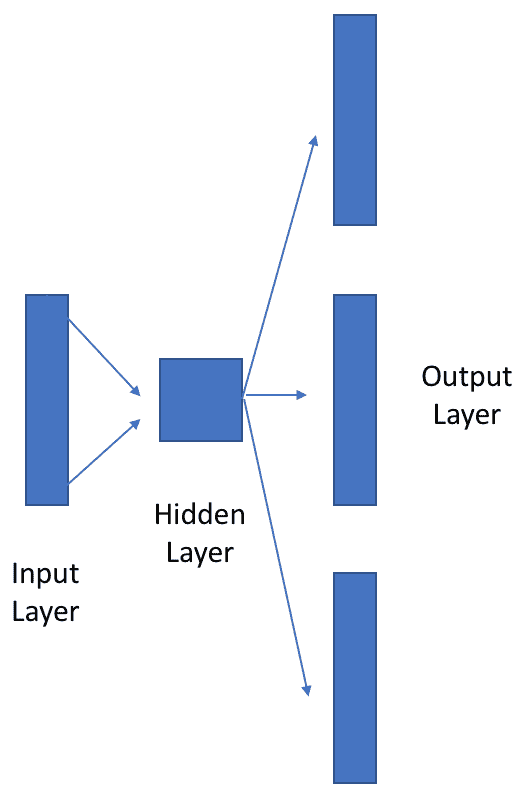
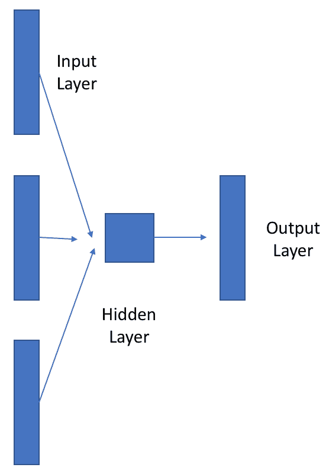
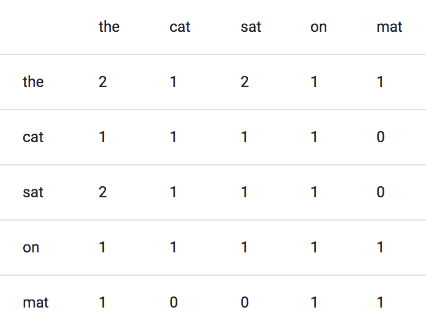
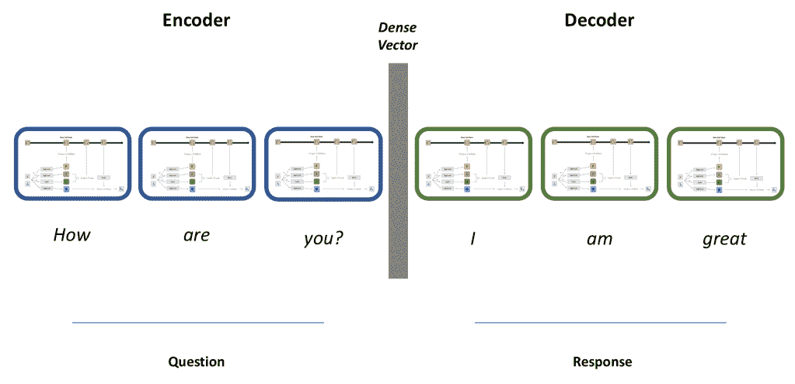

# 智能代理的深度学习

智能助手是我们日常生活中最显眼的**人工智能**（**AI**）形式之一。Siri、Alexa 和其他系统已经成为 21 世纪日常生活中的常见事物。本章将开始深入探讨**人工神经网络**（**ANNs**）在创建 AI 系统中的应用。在本章中，我们将介绍一个新话题，词嵌入，然后继续聚焦于**递归神经网络**（**RNNs**）和生成网络在自然语言处理任务中的应用。尽管整本书可以专门写关于自然语言处理的深度学习内容（实际上也已经有了相关书籍），我们会简要介绍…

# 技术要求

在本章中，我们将使用 Python 3 和一些你之前见过的标准 Python 包：

+   Numpy

+   TensorFlow

+   一台支持 GPU 的计算机，或一个用于云计算的 AWS 账户，详细信息请参见第三章，*平台与其他必需工具*

# 词嵌入

目前为止，在我们对 AI 和深度学习的讨论中，我们重点讨论了该领域在基本数学原理中的根基；那么，当我们面临像文本这样未结构化的数据源时，我们该怎么办呢？在前几章中，我们讨论了如何通过卷积将图像转换为数字，那么我们如何用文本做同样的事情呢？在现代 AI 系统中，我们使用一种叫做**词嵌入**的技术。

词嵌入本身并不是一种预测模型，而是处理文本的手段，使其能够作为预测模型的输入，或作为数据挖掘中的一种探索性技术。它是将单词和句子转换为数字向量的方式，这些数字向量被称为**词嵌入**。

# Word2vec

Word2vec 算法由 Tomas Mikolav 在 2013 年于 Google 发明，是最早的现代嵌入方法之一。它是一个浅层的、两层的神经网络，其直觉与自编码器类似，目的是执行某个特定任务，但并不直接用于执行该任务。在 Word2vec 算法的情况下，这个任务就是学习自然语言的表示。你可以将这个算法看作一个上下文算法——它所知道的一切都来源于学习单词在句子中的上下文。它基于所谓的**分布假设**，该假设告诉我们每个单词的上下文是通过它相邻的单词来定义的。例如，假设有一个 500 维的语料库向量，语料库中的每个单词都会通过权重分布在这些元素上进行表示。这不是一种一对一的映射；每个单词的嵌入是依赖于语料库中其他所有单词的。

在其基本形式中，Word2vec 具有与我们已经看到的许多前馈神经网络类似的结构——它有一个**输入层**、一个**隐藏层**和一个**输出层**，所有这些都由矩阵**W**进行参数化。它逐字遍历输入语料库，并为每个单词开发向量。实际上，该算法包含两种不同的变体，**CBOW**（**连续词袋模型**）和 **skip-gram 模型**，它们以不同的方式处理词向量的生成。从架构上讲，skip-gram 模型和 CBOW 模型本质上是彼此的倒置版本。

skip-gram 模型如以下图所示：



skip-gram 模型的镜像是 CBOW 模型：



在 skip-gram 模型中，网络查看词语序列，并尝试预测某一特定词语组合发生的可能性。skip-gram 方法在给定一个特定单词的情况下预测上下文。该模型输入一个单一的字母，*w*，并输出一个词向量，*w[1], w[2]... w[n]*。分解这个过程，前述模型在训练过程中接收一个输入单词的 one-hot 编码表示。输入层与隐藏层之间的矩阵代表了网络正在构建的词汇表，其行将成为我们的向量。矩阵中的每一行对应词汇表中的一个单词。随着新数据流经网络，矩阵按行逐步更新，添加新的嵌入。再次提醒，我们实际上并不关心网络输出的结果；我们关心的是在矩阵 *W* 中创建的嵌入。该方法在训练数据较少时表现良好，并且适合嵌入稀有单词。在 CBOW 方法中，模型的输入是 *w[1], w[2]* ... *w[n]*，即当前单词周围的上下文单词。CBOW 根据上下文预测单词。CBOW 方法比 skip-gram 方法速度更快，适合嵌入频繁出现的单词，但它需要大量的数据，因为它依赖于上下文作为输入。

为了进一步说明这一点，考虑这个简单的句子：

*The dog jumped over the fence*

skip-gram 模型通过关注一个主题来解析句子，将该主题分解为称为**gram**的块，每次跳过如下：

{*The dog jumped*, *The dog over*, *dog jumped over*, *dog jumped the* .... 等等}

另一方面，在 CBOW 方法下，gram 会依次遍历句子的上下文，如下所示：

{*The dog jumped*, *dog jumped over*, *jumped over the*, *over the fence*}

# 训练 Word2vec 模型

由于 Word2vec 模型本身是神经网络，我们像训练标准的前馈神经网络一样训练它们，使用损失函数和随机梯度下降。在训练过程中，算法扫描输入语料库，并将其批量输入。每处理完一个批次，就会计算一次损失。在优化时，我们希望像训练标准的前馈神经网络一样最小化损失。

让我们来看看如何在 TensorFlow 中创建和训练一个 Word2vec 模型：

1.  首先，让我们从导入开始。我们将使用标准的`tensorflow`和`numpy`导入，以及 Python 库 itertools，还会使用机器学习包`scikit-learn`中的两个实用函数。以下代码块展示了...

# GloVe

**全球化向量** (**GloVe**) 是斯坦福 NLP 小组在 2014 年开发的，作为 Word2Vec 的概率性后续版本。GloVe 旨在保留 Word2vec 使用的类比框架，但采用维度约简技术来保留关于单词本身的关键统计信息。与通过流式句子学习的 Word2vec 不同，GloVe 通过构建丰富的共现矩阵来学习词嵌入。共现矩阵是一个全球语义信息存储库，是 GloVe 算法的关键。GloVe 的创造者基于这样的原则开发了它：在上下文中，两个词之间的共现比率与其意义密切相关。

那么它是如何工作的，和 Word2vec 有什么不同呢？GloVe 通过以下方式创建词嵌入：

1.  逐字迭代句子

1.  对于每个词，算法会查看它的上下文。

1.  给定词汇及其上下文，GloVe 会在共现矩阵中创建一个新条目。

1.  GloVe 随后通过降低共现矩阵的维度来创建词嵌入。

1.  在创建词嵌入后，GloVe 会根据该嵌入的准确性计算新的损失函数。

让我们通过 Python 实现一步步走过 GloVe 算法，看看它是如何进行的。我们将使用康奈尔电影台词数据集，它包含超过 200,000 行虚构的电影剧本台词。稍后，我们将在智能体中使用从该数据集生成的词嵌入。首先，让我们写一个函数来导入数据：

```py
import os
 def loadText(fileName, fields):
 ''' Function to Load the Movie Lines text '''
     lines = {}
     with open(fileName, 'r', encoding='iso-8859-1') as f:
     for line in f:
         values = line.split(" +++$+++ ")
         lineObj = {}
         for i, field in enumerate(fields):
             lineObj[field] = values[i]
        lines[lineObj['lineID']] = lineObj

 return lines
```

然后我们可以使用这个函数来加载电影台词：

```py
lines = {}
movie_lines = ["lineID","characterID","movieID","character","text"]
lines = loadText("/users/patricksmith/desktop/glove/movie_lines.txt", movie_lines)
```

现在，回到 GloVe。与 Word2vec 不同，GloVe 逐字解析句子，通过使用固定的上下文窗口大小来关注局部上下文。在词嵌入中，窗口大小表示算法关注的范围及其为词义提供上下文的方式。GloVe 中有两种上下文窗口大小——对称和不对称。例如，看看以下句子：

*马在比赛的终点线上快速跑过。*

在对称窗口大小的情况下，算法会查看主题两侧的单词。如果 GloVe 在前面的示例中查看单词 *finish*，窗口大小为 2，那么上下文将是 *across the* 和 *line in*。非对称窗口仅查看前面的单词，因此相同的窗口大小 2 将捕获 *across* 和 *the*，但不会捕获 *line in*。

让我们继续初始化我们的 GloVe 类和变量：

```py
class GloVeModel():
    def __init__(self, embedding_size, window_size, max_vocab_size=100000, min_occurrences=1,
                 scaling_factor=3/4, cooccurrence_cap=100, batch_size=512, learning_rate=0.05):
        self.embedding_size = embedding_size
        if isinstance(context_size, tuple):
            self.left_context, self.right_context = context_size
        elif isinstance(context_size, int):
            self.left_context = self.right_context = context_size

        self.max_vocab_size = max_vocab_size
        self.min_occurrences = min_occurrences
        self.scaling_factor = scaling_factor
        self.cooccurrence_cap = cooccurrence_cap
        self.batch_size = batch_size
        self.learning_rate = learning_rate
        self.__words = None
        self.__word_to_id = None
        self.__cooccurrence_matrix = None
        self.__embeddings = None

def fit_to_corpus(self, corpus):
     self.__fit_to_corpus(corpus, self.max_vocab_size,             self.min_occurrences,
     self.left_context, self.right_context)
     self.__build_graph()

def __fit_to_corpus(self, corpus, vocab_size, min_occurrences, left_size, right_size):
     word_counts = Counter()
     cooccurrence_counts = defaultdict(float)
     for region in corpus:
         word_counts.update(region)
         for l_context, word, r_context in _context_windows(region, left_size, right_size):
             for i, context_word in enumerate(l_context[::-1]):
                 cooccurrence_counts[(word, context_word)] += 1 / (i + 1)
             for i, context_word in enumerate(r_context):
                 cooccurrence_counts[(word, context_word)] += 1 / (i + 1)
     if len(cooccurrence_counts) == 0:
         raise ValueError("No coccurrences in corpus. Did you try to reuse a generator?")
         self.__words = [word for word, count in word_counts.most_common(vocab_size)
         if count >= min_occurrences]
     self.__word_to_id = {word: i for i, word in         enumerate(self.__words)}
     self.__cooccurrence_matrix = {
     (self.__word_to_id[words[0]], self.__word_to_id[words[1]]): count
         for words, count in cooccurrence_counts.items()
         if words[0] in self.__word_to_id and words[1] in self.__word_to_id}
```

我们得到一个共现矩阵，可以告诉我们在给定窗口大小的情况下，某些单词一起出现的频率：



虽然这张表看起来很简单，但它包含了关于单词共现的全局统计特性。我们可以从中计算出某些单词一起出现的概率：


由于共现矩阵的大小是组合性的（它会迅速变得非常大），这导致了极其庞大的共现信息矩阵。我们该如何解决这个问题？我们可以对矩阵进行分解，创建一个低维矩阵，其中每一行包含给定单词的向量表示。这对共现矩阵执行一种降维操作。然后我们通过标准化和对数平滑处理该矩阵中的发生信息。GloVe 将学习向量，使它们的差异预测发生比率。所有这些操作会保持丰富的全局统计特性，同时仍然保留使得 Word2vec 如此受欢迎的类比关系。

GloVe 通过最小化重建损失来训练，帮助模型找到能够解释原始数据中最大方差的低维表示。它使用最小二乘损失函数，旨在最小化单词的两个嵌入的点积与它们的共现计数的对数之间的差异：


让我们来解析一下；*w*[i] 是一个单词向量，b[i] 是特定单词 *i* 的偏置因子，而 w[*j*] 和 b[*j*] 是上下文向量的单词向量和偏置因子。*X[ij]* 是共现矩阵中记录 *i* 和 *j* 一起出现次数的计数。*f* 是一个加权函数，用于处理稀有和频繁的共现，以避免它们对结果产生偏差。总的来说，这个损失函数查看一个单词及其邻近上下文单词的加权共现，然后将其乘以右侧项，这个项计算了单词、其上下文、偏置和共现的组合。

让我们继续初始化 GloVe 的图形，并在 TensorFlow 中进行训练过程：

```py
def __build_graph(self):
 self.__graph = tf.Graph()
 with self.__graph.as_default(), self.__graph.device(_device_for_node):
 count_max = tf.constant([self.cooccurrence_cap], dtype=tf.float32,
 name='max_cooccurrence_count')
 scaling_factor = tf.constant([self.scaling_factor], dtype=tf.float32,
 name="scaling_factor")

 self.__focal_input = tf.placeholder(tf.int32, shape=[self.batch_size],
 name="focal_words")
 self.__context_input = tf.placeholder(tf.int32, shape=[self.batch_size],
 name="context_words")
 self.__cooccurrence_count = tf.placeholder(tf.float32, shape=[self.batch_size],
 name="cooccurrence_count")

 focal_embeddings = tf.Variable(
 tf.random_uniform([self.vocab_size, self.embedding_size], 1.0, -1.0),
 name="focal_embeddings")
 context_embeddings = tf.Variable(
 tf.random_uniform([self.vocab_size, self.embedding_size], 1.0, -1.0),
 name="context_embeddings")

 focal_biases = tf.Variable(tf.random_uniform([self.vocab_size], 1.0, -1.0),
 name='focal_biases')
 context_biases = tf.Variable(tf.random_uniform([self.vocab_size], 1.0, -1.0),
 name="context_biases")

 focal_embedding = tf.nn.embedding_lookup([focal_embeddings], self.__focal_input)
 context_embedding = tf.nn.embedding_lookup([context_embeddings], self.__context_input)
 focal_bias = tf.nn.embedding_lookup([focal_biases], self.__focal_input)
 context_bias = tf.nn.embedding_lookup([context_biases], self.__context_input)

 weighting_factor = tf.minimum(
 1.0,
 tf.pow(
 tf.div(self.__cooccurrence_count, count_max),
 scaling_factor))

 embedding_product = tf.reduce_sum(tf.multiply(focal_embedding, context_embedding), 1)

 log_cooccurrences = tf.log(tf.to_float(self.__cooccurrence_count))

 distance_expr = tf.square(tf.add_n([
 embedding_product,
 focal_bias,
 context_bias,
 tf.negative(log_cooccurrences)]))

 single_losses = tf.multiply(weighting_factor, distance_expr)
 self.__total_loss = tf.reduce_sum(single_losses)
 tf.summary.scalar("GloVe_loss", self.__total_loss)
 self.__optimizer = tf.train.AdagradOptimizer(self.learning_rate).minimize(
 self.__total_loss)
 self.__summary = tf.summary.merge_all()

 self.__combined_embeddings = tf.add(focal_embeddings, context_embeddings,
 name="combined_embeddings")
```

接下来，我们将编写两个函数，为 GloVe 模型准备数据批次，和我们在 Word2vec 中做的一样。记住，这一切仍然包含在我们的 GloVe 类中：

```py
def batchify(batch_size, *sequences):
     for i in range(0, len(sequences[0]), batch_size):
         yield tuple(sequence[i:i+batch_size] for sequence in sequences) 

def MakeBatches(self):
     ''' Make Batches of Data to Feed The Model'''
     cooccurrences = [(word_ids[0], word_ids[1], count)
     for word_ids, count in self.__cooccurrence_matrix.items()]
         i_indices, j_indices, counts = zip(*cooccurrences)
         return list(batchify(self.batch_size, i_indices, j_indices, counts))
```

现在，我们将了解不同的属性。对于那些之前使用过 Java 的朋友来说，你们一定熟悉 getter 和 setter 的概念。这些方法可以控制变量的变化。`@property` 装饰器是 Python 对这些概念的回应，具体如下：

```py
@property
def foo(self): return self._foo 

## Is the same as

def foo(self): 
    return self._foo

foo = property(foo)
```

在这里，`foo` 函数被一个新的函数 `property(foo)` 替代，这个新函数是一个具有特殊属性的对象，称为**描述符**。现在，让我们回到 Word2vec：

```py
 @property
     def vocab_size(self):
         return len(self.__words)

     @property
     def words(self):
         if self.__words is None:
             raise NotFitToCorpusError("Need to fit model to corpus before accessing words.")
             return self.__words

     @property
     def embeddings(self):
     if self.__embeddings is None:
         raise NotTrainedError("Need to train model before accessing embeddings")
         return self.__embeddings

     def id_for_word(self, word):
         if self.__word_to_id is None:
             raise NotFitToCorpusError("Need to fit model to corpus before looking up word ids.")
             return self.__word_to_id[word]
```

我们还将为 `ContextWindow` 创建一个函数，告诉 GloVe 哪些词语需要关注：

```py
 def ContextWindow(region, left_size, right_size):

    for i, word in enumerate(region):
         start_index = i - left_size
         end_index = i + right_size
         left_context = _window(region, start_index, i - 1)
         right_context = _window(region, i + 1, end_index)
         yield (left_context, word, right_context)

## Function to Create the Window Itself
def window(region, start_index, end_index):                   
     last_index = len(region) + 1
     selected_tokens = region[max(start_index, 0):min(end_index, last_index) + 1]
     return selected_tokens
```

最后，我们将编写一个用于训练的函数：

```py
def train(self, num_epochs, log_dir=None, summary_batch_interval=1000):

    ## Initialize the total steps variable, which will be incrementally adjusted in training 
    total_steps = 0

    ## Start a TensorFlow session
     with tf.Session(graph=self.__graph) as session:
         if should_write_summaries:
             summary_writer = tf.summary.FileWriter(log_dir, graph=session.graph)
            ## Initialize the variables in TensorFlow
             tf.global_variables_initializer().run()

         for epoch in range(num_epochs):
             shuffle(batches)

         for batch_index, batch in enumerate(batches):
             i_s, j_s, counts = batch

         if len(counts) != self.batch_size:
             continue
             feed_dict = {
             self.__focal_input: i_s,
             self.__context_input: j_s,
             self.__cooccurrence_count: counts}
             session.run([self.__optimizer], feed_dict=feed_dict)
```

最后，我们可以使用以下内容运行我们的 GloVe 模型：

```py
model = GloVeModel(embedding_size=300, context_size=1)
model.fit_to_corpus(corpus) 
model.train(num_epochs=100)
```

GloVe 关于共现信息的密集矩阵的想法并不新鲜；它来源于一种更传统的技术，叫做**潜在语义分析**（**LDA**），该技术通过使用一种叫做**奇异值分解**（**SVD**）的数学方法，分解词袋模型的文档矩阵来学习嵌入。

# 构建基本代理

使用 TensorFlow 构建人工助手的最简单方法是使用**序列到序列**（**Seq2Seq**）模型，这个我们在 RNN 章节中已经学过。



虽然最初是为神经机器翻译开发的，但我们可以调整这个模型使其作为智能聊天机器人，以便实现我们自己的目的。我们将创建作为助手“大脑”的 Python 类，命名为 `IntelligentAssistant`。然后，我们将创建助手的训练和聊天函数：

1.  首先，让我们从标准导入开始，并初始化我们的变量。请特别注意这里的 `mask` 变量；`masks` 是占位符，允许……

# 总结

在这一部分中，我们学习了如何通过使用词嵌入和人工神经网络（ANN）来创建新型的、最先进的智能助手。词嵌入技术是自然语言人工智能应用的基石。它们使我们能够将自然语言编码为数学模型，然后将其输入到下游模型和任务中。

智能代理利用这些词嵌入进行推理。它们使用两个 RNN，一个编码器和一个解码器，构成所谓的 Seq2Seq 模型。如果你回想一下 RNN 章节中的内容，Seq2Seq 模型中的第一个 RNN 将输入编码为压缩表示，而第二个网络则从该压缩表示中获取信息来生成句子。通过这种方式，智能代理学会根据训练过程中学到的表示来回应用户。

在下一章节中，我们将探讨如何创建能够玩棋类游戏的智能代理。
