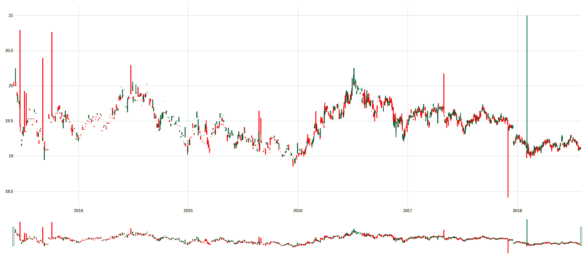
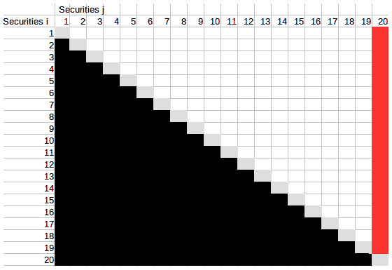
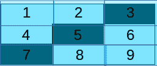
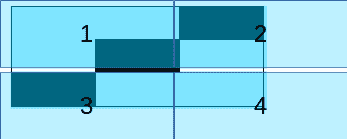
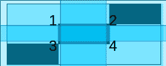
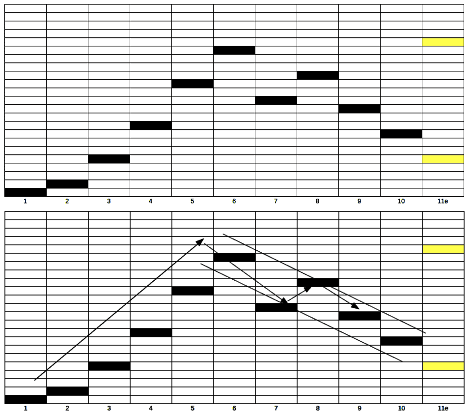
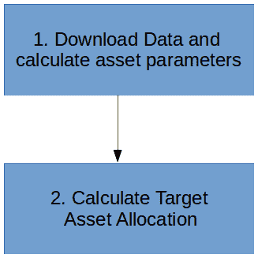
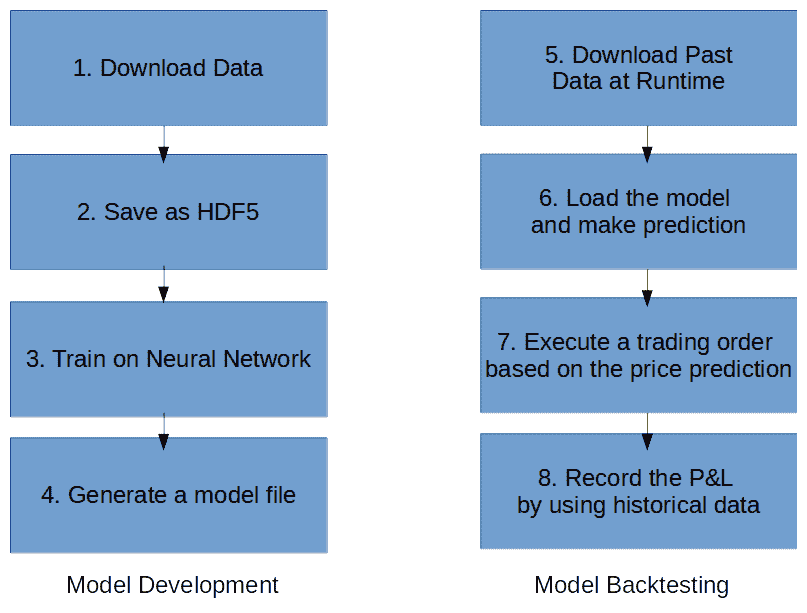

使用特雷诺-布莱克模型和 ResNet 的自动化投资组合管理

在上一章中，我们介绍了投资银行的基本概念。我们还学习了**并购**（**M&A**）和**首次公开募股**（**IPO**）的概念。我们探讨了聚类模型，它是人工智能中的一种建模技术。我们查看了详细的步骤和例子，解决了自动化联合的问题。我们实现了一个示例，识别了收购方和目标方。因此，前两章主要针对投资银行证券方面的发行人。

本章将探讨投资者的动态。投资者以战略方式推动投资行为。股权或债务的发行可以通过两种方式进行——通过一级市场或二级市场。一级市场的角色是代表公司、政府或其他团体发行新证券，以通过债务或股权导向的证券获得融资。二级市场的角色是为有兴趣的各方提供买卖已发行证券的便利。投资组合经理的角色是根据证券的价格波动做出更智能的决策，以增加客户的利润。投资组合经理试图了解投资者的需求，并将资金投入那些能够产生最大回报的投资。

本章将涵盖以下主题：

+   金融概念

+   马科维茨均值方差模型

+   特雷诺-布莱克模型

+   使用特雷诺-布莱克模型的投资组合构建

+   趋势预测

# 金融概念

在本节中，我们将探索各种金融概念。若要深入了解该领域的知识，建议参考**特许金融分析师**（**CFA**）的课程大纲。

## 资本资产定价模型中的 alpha 和 beta 回报

根据**资本资产定价模型**（**CAPM**），投资回报等于*risk-free rate + alpha + beta * 市场回报 + 噪声*（噪声的均值为零）。Alpha 是公司或投资者优异表现所赚取的回报，而 beta 是资产相对于整体市场回报的风险性。投资风险较高时，beta 值较高，表明投资比市场平均风险更大。噪声是随机波动或运气，长期回报为零。

资产管理行业，尤其是专业的投资经理，通常根据 alpha 向客户收费。这也解释了人们为何如此关注 alpha。

## 已实现和未实现的投资回报

投资回报（收益）可以是已实现的或未实现的。已实现回报是实际获得并已收入囊中的回报。未实现回报是如果今天卖掉资产并以现金结算，我们本应获得的回报。

## 投资政策声明

投资行业的运作是代表资产所有者进行投资。作为资产管理者，我们的受托责任是为客户提供建议并代表其进行投资。到目前为止，在本书中，我们通过观察行为/交易数据来理解投资者的投资需求。然而，关键数据实际上是投资者将要制定的**投资政策声明**（**IPS**）。

一份 IPS 包含投资者制定的回报目标、风险承受能力和约束条件。回报目标和风险承受能力都是可以量化定义的变量。回报可以定义为扣除通胀率后的净年回报率。如果目标回报率为 1%，通胀率为 1%，这意味着随着物价水平按通胀率增长，资本的价值保持不变。从长远来看，我们投入投资组合的购买力保持不变，因为其价值与物价水平同步增长。

这些变量可以用数学方式表示如下：

+   **回报目标**：这个回报目标叫做资本保值。1%的回报率叫做名义回报率。从名义回报率中扣除通胀率之后，得到的叫做实际回报率：


+   **风险承受能力**：风险承受能力可以定义为回报的波动性。我们通常这样定义它：


风险承受能力的选择是主观的——有些人喜欢伴随兴奋而来的起伏。而有些人则喜欢坐在沙发上阅读这本书（挺无聊的，是吧？），有些人则喜欢坐在桌子旁的椅子上阅读。有人喜欢在枯燥的 9 到 5 工作中稳定拿薪水，而另一些人则喜欢创业公司的刺激，抱有迅速致富的希望，同时承担失败的风险。

也就是说，无聊并不意味着被解雇的风险较低，而令人兴奋的工作并不意味着失业的风险较高。有些明显的情况是，我们可以拥有令人兴奋的工作、高潜力和稳定性。这正是通过这个资产配置过程所希望达到的目标结果。

鉴于本书涉及工作中的实际问题，关于更多细节，我推荐 CFA 协会的《*Managing Investment Portfolio, A Dynamic Process*》（[`www.wiley.com/en-us/Managing+Investment+Portfolios%3A+A+Dynamic+Process%2C+3rd+Edition-p-9780470080146`](https://www.wiley.com/en-us/Managing+Investment+Portfolios%3A+A+Dynamic+Process%2C+3rd+Edition-p-9780470080146)）。我们在这里的目标是定义执行机器学习程序所需的参数。

在 AI 时代的挑战是如何将这个政策转化为机器能够理解的代码形式。实际上，投资界的任务是将投资政策数字化。

区块链的最新进展带来了智能合约，其基于某些声明可以作为逻辑进行数字化的假设。如果合同可以在区块链上作为智能合约进行编码并执行，那么为什么不可以是投资政策呢？假设在本章剩余部分中，投资政策被编码化。

## 资产类别

**投资组合管理**是根据资产类别或风险因素的特征，将资金分配到不同投资资产的过程。我们将从资产类别分配开始讲解。**资产类别**被定义为具有相似特征的资产组合。实际上，这听起来很像聚类模型的结果。

为了融入我们的金融知识，资产类别通常指的是股票、债券、货币市场和另类投资。**另类投资**可以细分为房地产、私人股本、对冲基金和商品。**股票**是指在公开交易市场上发行的股权，而**债券**是指公司发行的债务。**货币市场**是指期限在一天到一年之间的短期债务。它们不同于债券，因为货币市场具有高度流动性（市场交易活跃，定价公允），而债券市场则可能非常不流动，或者由某些投资者主导。债券通常指期限较长的债务，例如 10 年期或更长的到期债务。当然，它也可以包括任何超过 1 年的债务，通常称为**票据**。

## 投资行业的参与者

投资者在金融行业中扮演着核心角色。然而，同样重要的是要了解其他主要参与者——投资经理（管理投资者资金的人）、被称为卖方的经纪人（通常是投资银行或证券公司），以及为投资者提供如何选择投资经理的专业建议的顾问和顾问公司。保管人指的是负责投资交易和与交易所市场的结算及行政事务的方。

如果投资经理来自机构，他们被称为**机构投资者**，而如果是个人自己操作，则被称为**个人投资者**。机构投资者对投资资金的受益所有者负有受托责任。这些受益者是投资经理的真正客户。例如，在杜克能源的案例中，最终的受益者可能是杜克能源的员工。在这其中，可能是管理基金的财务主管作为投资经理，也可能是外包的投资基金经理作为选定的投资经理。

在行业的销售方面，基金可以面向机构投资者、个人投资者，或通过银行或保险公司面向零售分销。在零售分销的情况下，确保投资符合所有者需求的责任在于分销商。虽然机构投资者或个人投资者是与投资经理直接接触的对象，但匹配的责任则由投资经理或顾问来承担。

## 基准 – 比较的基础线

基准被投资组合用来定义他们应该与之对比的市场平均回报。它可以指市场回报或 CAPM 中的 beta。任何高于平均水平的部分被称为**alpha**。在本章的示例中，我们假设全球股票**交易型基金**（**ETF**）是市场基准。

如果我们要为全球资产中的投资者构建全球市场基准，我们可以通过分析创建这样一个指数，权重分配不同的指数或回报篮子。

## 投资者追求回报

国际结算银行的一项研究显示，投资者表现出追逐回报的行为。这意味着投资的一个关键原则是跟随市场（回报）。这也意味着，如果我们仅仅依赖回报来驱动我们的资产配置决策，我们将永远比市场慢。所以，在人工智能的世界里，可能有两种方式来提升：

+   使用超快速的机器迅速跟随回报趋势

+   比大众更好地预测市场

ETF 承诺做前者，前提是我们足够快速地将资金分配给 ETF——这反而违背了跟随市场的初衷，因为市场上有太多不同种类的 ETF。只有当我们投资于真正的市场代表时——例如，一个主要的市场指数 ETF——我们才能实现这一目标；否则，我们仍然会面临同样的挑战，即试图分配到正确的证券/投资，以产生 alpha（战胜市场）。

在大多数交易书籍中，作者会隐藏他们的获胜策略——这使得我们理解什么是策略变得困难。为了保持实际性，我们将从一个失败的策略开始，您可以在此基础上进行改进。这至少向您展示了从头到尾的策略开发过程，并给您一个全面的交易工作方式。

## 趋势跟随基金

在将资产配置给基金经理之后，我们来深入探讨所投资的基金。如果我们是 ETF，我们的一个关键需求是跟踪基础证券。例如，如果基金的任务是根据一组规则跟踪一篮子证券的表现，我们可以简单地购买并持有这些基础资产直到赎回（即投资者提取他们的钱）。

然而，如果我们尝试提前预测价格波动并据此采取行动，我们有可能获得超越基准的收益——这就是我们所说的**阿尔法**。

### 使用技术分析作为生成阿尔法的手段

一种交易思维方式认为证券定价中展现出的趋势是非常重要的。这就是所谓的**技术分析**。它假设过去的定价走势可以预测未来的走势。以下图表展示了证券价格在某一时期内的趋势：



从一个非常高的层次来看，我们可以看到证券价格是按趋势波动的，但趋势的持续时间并非总是相同的。关于如何解读价格波动中的模式，已有大量研究。然而，这难道不是一个计算机视觉的挑战吗？与我们手动挑选无数特征不同，是否应该让计算机来读取图表并学习如何画出趋势线？

关于模式类型，一个好的起点是*《金融市场的技术分析：交易方法与应用的综合指南》*（纽约金融学院）。有关用于检测模式的精确数据处理的信息，请参考*《机器学习进展》*。在这里，Prado 博士通过在数据输入机器之前，给你提供深入的见解，将这一领域提升到了另一个层次。

## 交易决策 – 策略

交易策略是指在交易活动中需要考虑和采取的行动。因此，在本章中，我将展示一个在设计时失败的实际策略，而不是排除这些策略。对于真实的交易员来说，公开成功的交易策略会导致其失效，因为别人可以反其道而行之——例如，反向交易者可以在你预期买入时卖出，反之亦然。

我们在这里提出的简短策略，与使用相同资产的简单买入持有策略相比，并未产生正的阿尔法。然而，我会指出改进它的方法。

要了解更多关于交易员和银行家行为的比较，请参考*《金融补偿专家》*（《金融学杂志》）[`onlinelibrary.wiley.com/doi/abs/10.1111/jofi.12372`](https://onlinelibrary.wiley.com/doi/abs/10.1111/jofi.12372)。

# 理解马克维茨均值-方差模型

投资组合管理的目标是通过最小化风险来确保目标回报，在这个过程中，我们根据特定投资者的目标回报和风险容忍度（从投资政策声明（IPS）和历史回报中获取）来进行决策。行业中常用的典型投资组合优化模型包括马克维茨均值-方差模型和特雷诺-布莱克模型。

一位名叫哈里·马克维茨（Harry Markowitz）的经济学家在 1952 年提出了均值-方差分析，这也被称为**现代投资组合理论**（**MPT**）。由于这一理论，他获得了诺贝尔经济学奖。

均值-方差模型是一个用于组建资产组合的框架，以便在给定的风险水平下最大化回报。它是投资多样化的扩展。**投资多样化**是一种建议投资者应投资于不同类型金融资产的理念。与仅投资单一类型资产相比，投资多样化的风险较低。

投资者选择最大化回报的资产配置，这也被称为**回报方差**。在进行资产投资时，风险与回报的比率成为关键决策因素。风险与回报比率是预期回报与可能损失的比率。预期回报与实际回报之间的差异被称为**风险**。关键挑战是计算目标组合的回报方差。例如，它可能是 40%的股票和 60%的债券，或者是一个更复杂的资产类别配置，如房地产、商品等。要得出 40%股票和 60%债券的回报方差，我们首先需要分别计算股票和债券的回报方差。同时，我们还需要考虑股票和债券之间的协方差，即股票和债券的回报是如何同步或完全不同步的。

关于资产和财富管理行业如何发展的详细见解，请参考*普华永道，2017 年，《资产管理 2020：回顾与展望，资产与财富管理见解》*。

想象一个团队中的每个人（每个人代表一个资产类别）共同完成一项任务，以提供回报。投资组合经理的工作是确定团队内每个人在组内的发言权大小（资产配置工作）。这取决于个人的生产力（回报）和表现波动性：有些人表现极端，而有些人在生产力（方差）方面相当稳定。我们还需要了解个人团队成员之间的互动——这种互动还必须考虑每个成员如何互补或增强彼此的生产力（相关性）。一些团队成员之间表现出强烈的化学反应，能够共同取得极好的结果（正相关），有些人则在一天的不同时间工作——一个是夜猫子，另一个是晨型人——他们各自有不同的工作时间（负相关），还有一些人没有任何一致的相似性或不相似性模式（零相关）。

下图展示了两个资产（i 和 j）之间的相关性矩阵。灰色的对角线表示证券的回报方差，剩余的单元格表示证券间的回报协方差。黑色单元格是多余的，因为它们与对角线对面的值是镜像关系。对于仅 20 个证券，我们将需要估算 190 个值：



为了进一步说明这个问题，假设证券**20**是非流动性的，我们无法可靠地估计它与另一证券的协方差。我们可能已经影响了与其他 19 个证券的协方差数据质量。在实际应用中，这个模型的问题如下：

+   一些资产没有足够的数据点来计算它们与其他资产的相关性（例如，团队中新加入的成员）。

+   在金融市场中，资产之间的相关性是动态变化的，且很难预测未来的相关性。

+   相关性不是线性的。

该模型适用于具有高效定价和大量数据点的公共股权市场，但不适用于非流动性资产——例如初创公司的私人股本、发展中市场的证券或债券，这些资产的定价往往无法完全透明，且很多情况下需要通过分析重建。

风险中的一种特定类型的相关性是信用风险——在经济景气时，资产间的风险相关性较低；而在危机时，相关性飙升并朝着相同方向变化。有关违约相关性的示例，请参考 Duffie D. 和 Singleton, K.J.的*《信用风险定价、衡量与管理》*。

一些成熟企业的财务主管负责管理自己的养老金资金。我们假设财务主管需要处理养老金基金的目标资产配置。我们将使用每个资产类别的指数回报数据。我们将使用 Quandl 提供的 ETF 订阅数据作为数据来源。

ETF 是指可以在公共交易所（如**纽约证券交易所**（**NYSE**））买卖的基金。它是一种基金，因为它投资于更多的基础证券，如股票或债券。随着它允许投资者专注于基金所投资的主题，而不是单一股票，因此变得越来越受欢迎。例如，我们可以通过购买投资美国最大 500 只股票的基金，来对美国经济的强势做出明确判断。

# 探索特雷诺-布莱克模型

由于马克维茨均值-方差模型在处理多资产类别投资组合相关问题时的不稳定性，特雷诺-布莱克模型应运而生。特雷诺-布莱克模型适用于现代投资组合配置方法，其中某些投资组合是主动的，另一些则是被动的。这里的“被动”指的是一种跟随市场回报率的投资方式——目标不是超过市场平均回报，而是紧密跟随市场回报。

主动投资组合是指我们力求实现超过市场平均回报的投资组合。市场回报越低、市场风险水平越高，投资组合越大。然后，我们将总资本分配到一个主动投资组合中。那么，如果市场回报已经足够好，为什么还要承担更多的风险呢？Treynor-Black 模型旨在将更多的权重分配给那些能够在总风险/回报水平下提供更高回报/风险水平的资产。

## 介绍 ResNet——用于模式识别的卷积神经网络

应用计算机视觉类型的神经网络的特殊之处在于，我们可以使用以下隐藏层。在我们的例子中，我们将使用 Keras 实现的 ResNet 作为示例来说明这些概念。我们还将展示一种提高性能的方法——然而，您需要深入研究超参数调优。

卷积层就像是对输入图像的一个子集进行处理。在技术分析中，它就像使用滑动窗口来计算统计值。每种类型的滑动窗口都会被训练来检测某种模式，比如上升、下降和平坦的线条。在神经网络术语中，每种类型被称为**过滤器**。对于每种类型的过滤器，都会有多个窗口来完全运行（或滑动）整个输入图像；这个数字由层中的神经元数量表示。

为了说明术语，我们以一个大小为*3* *×* *3*的输入图像和一个*2* *×* *2*的卷积核形状为例。在编码示例中，我们的实际输入比这个大小要大。

**输入图像**是一个*3* *×* *3*的图像，图像中有一条从左下角到右上角斜着穿过的黑线（由 3 个像素表示）。它显示了股价每天上升 1 个像素：


滑动窗口的形状叫做**卷积核**。卷积核是一个函数，它可以将输入的矩阵/向量转换为另一种形式，如下图所示：


为了说明，我们假设卷积核大小为*2* *×* *2*，*步长 = 1*，并且默认使用零填充，除非另有说明。

下图中的数字显示了卷积核移动的顺序。每次移动都会由卷积层中的一个神经元表示：


下图显示了*2* *×* *2*的卷积核，且卷积核移动了 4 次（即需要 4 个神经元）：

+   **卷积核形状**：当卷积核移动时（我们称之为滑动），它可能会覆盖相同的输入像素，也可能不会，这使得蓝色变得更深，我们想显示哪些像素被多次覆盖：


卷积核*形状 =* *2* *×* *2*，它需要 4 次移动才能覆盖整个图像：



卷积核*形状 =* *1* *×* *1*，它需要 9 次移动才能覆盖整个图像。

+   **步幅**：这表示每次向右和向下移动多少像素：


这里，*步幅 = 1*，需要 4 步才能覆盖整个图像。注意，每次移动时，像素会有所重叠：



这里，*步幅 = 2*，需要 4 步才能覆盖整个图像。注意，每次移动时，滤波器覆盖的像素不会有任何重叠。

+   **填充**：这表示输入图像周围有多少个白色像素：



以下图展示了零填充：


这里，*填充 = 1*，这允许边缘单元格被不同的神经元覆盖。

### 池化层

池化层的含义非常直白——它的作用是从输入中池化结果。想象一下，在卷积层之后，对于每种滤波器，都会有多个输出——例如四个。我们能否将这四个输出压缩为一个变量，而不是四个输出变量？池化可以起到压缩这些信息的作用。例如，可以取四个输出中的最大值（最大池化）或四个输出的平均值（平均池化）。从视觉角度来看，池化层的意义在于模糊图像或计算移动平均趋势。

### ReLU 激活层

对于金融专业人士来说，**整流线性单元**（**ReLU**）层就像一个看涨期权的支付结构——一旦超过某个阈值，输出值就会随着输入的增加线性变化。它的意义在于减少定价中的噪音，确保只考虑强烈的市场趋势。

### Softmax

Softmax 是我们在本书早些章节中接触的逻辑回归模型的超级增强版，能够进行多个预测结果——例如，逻辑回归模型中的第一版二元结果。在我们的案例中，我们希望确定下一天的定价。

# 使用特雷诺-布莱克模型的投资组合构建

假设我们给定了 10 天的定价数据，技术分析的工作就是画出右侧的趋势线，以理解趋势并生成第 11 天的定价。很明显，这正是卷积神经网络可以处理的任务。

事实上，我们所看的时间单位可能是每 100 毫秒或每 10 毫秒，而不是 1 天，但原理是一样的：



继续以杜克能源为例。在这个假设的案例中，我们假设我们是杜克能源的财务主管，管理着一个资产总额为 150 亿美元的养老金计划，且该计划为固定缴款计划。假设我们知道我们的投资政策声明（IPS）是数字化格式：

+   目标回报 = 实际回报的 5%（即扣除商品通货膨胀后的回报）

+   风险 = 回报波动率为 10%

+   约束条件：不包括电力公用事业公司，以避免投资其他同行/竞争者

请注意，这是一个假设性的示例。不会对实际公司做任何推断。

使用 IPS，我们将首先展示如何将资金分配到各个资产类别作为第一个示例。然后，在第二个示例中，我们将探讨趋势跟踪策略，以帮助投资经理跟随市场，鉴于当前被动投资的趋势。

## 解决方案

我们创建了两个独立的 Python 文件，因为资产参数应该独立于资产如何分配。这个过程有四个步骤，其中两个主要步骤（即文件）如下：



我们将下载并估计资产参数，并生成目标资产配置：

1.  为了下载并估计资产参数，我们将导入库和关键变量值。然后，我们将定义函数以下载每个资产的数据、市场回报、无风险利率、资产回报以及其他参数。

1.  为了生成目标资产配置，我们将导入库和关键变量值，找出证券在活跃投资组合中的权重，并找出活跃投资组合在总投资组合中的权重。

随着章节的推进，我们将通过这个示例尝试展示传统数据库的使用，而不是创建一个没有数据库存储的数据转储。这也符合我们之前提到的观点：结构化的数据库（SQL 数据库）非常适合证券定价数据，因为这些数据是结构化的。我们使用 SQLite，它是数据库的轻量版。它的目的是向金融专业人士展示数据库在我们应用场景中的作用。对于实际的 IT 实现，当然可以使用许多企业级的数据库，它们既安全又快速。

### **下载目标资产的价格数据**

本示例中使用的单个资产和市场资产都是 ETF。数据通过 Quandl 下载，包含免费和付费订阅数据——包括由美国国债代表的无风险数据和由全球股票 ETF 代表的市场回报。下载的数据是每日结束数据，我们还需要定义我们所称的价格。在我们的示例中，我们取每日最高价和最低价之间的中间点作为当天的价格。

步骤如下：

1.  导入必要的库；`sqlite3` 是本章新引入的内容。这展示了如何将 SQL 数据库用于交易数据的应用场景。我们将使用一种轻量级的 SQL 数据库，称为 **SQLite**，它本身以文件的形式展示：

`6A_1_cal_assetpara.py`

```py
'''*************************************
#1\. Import libraries and key variable values
'''
import quandl
import pandas as pd
import numpy as np
from sklearn import linear_model
from sklearn.metrics import r2_score
import sqlite3
import math
import os
#not needed when using database
import pickle

#API Key

#dates variables for all the download

#db file
```

1.  定义函数以下载每个资产的数据：

```py
'''*************************************
#2\. Define function to download data for each of the asset
'''

```

如果没有 Python，你也可以通过工具直接评估文件，例如 Chrome 浏览器的插件、SQLite 查看器等。

该函数将从 Quandl 的`SHARADAR`数据库下载给定代码的价格数据。除此之外，它还将按天计算该代码的回报。

它的功能是下载数据并计算回报序列。

### **计算无风险回报率并定义市场**

在我们的示例中，我们以美国 3 个月期国库券作为无风险回报率的代表。在投资世界中，美国被认为是无风险的，政府永远不会违约。任何我们获得的超出无风险回报率的收益，都是我们承担更多风险所得到的回报。

整体市场可以通过全球所有投资资产的回报来表示——理论上这很简单，但在现实中却很难定义。最具挑战性的部分是定期生成这个市场回报，以便在下一步中使用。我们将采取捷径，使用 ETF 来代表市场回报：

```py
'''*************************************
#3\. Market Return
'''
```

给定一个代码作为市场代理，运行前面的函数：

```py
'''*************************************
#4\. Risk Free Rate
'''
#day count

#risk free rate

# override return of market
```

无风险回报率相对复杂。根据行业惯例，通常使用 3 个月期国库券。为了获得整个期间的无风险回报率，我们需要使用约 10 年的数据来计算该期间的无风险回报率。

然而，我们还需要将利率年化。根据 3 个月期国库券的定义，计算的天数是 360 天。利率是指每天都被计算在内的。

### **计算每种资产类型的阿尔法、贝塔和误差方差**

在了解了无风险回报率和市场回报率之后，我们的下一个任务是通过回归市场回报与资产回报，找出阿尔法（alpha）、贝塔（beta）和误差方差：

*投资回报 = 无风险回报率 + 阿尔法 + 贝塔 * 市场回报 + 噪声（误差方差）*

在执行此计算后，我们将把数据保存在 SQLite 数据库中，以便以后检索。

我相信，在初创企业的未来，我们的机器人顾问将专注于 ETF/智能贝塔——也就是将各个行业配置在一起，以便对抗市场生成回报。因此，在这个示例中，我选择了 ETF 代码。

我们将对行业 ETF 与市场基准进行线性回归。然而，ETF 和市场的价格报价日期可能不同；因此，我们只在行业 ETF 和市场 ETF 都有价格时才进行回归——在 SQL 中使用内连接命令。

内连接隐式要求行业 ETF 和市场基准的索引在连接之前必须相同。数据集的索引是指回报的日期：

```py
'''*************************************
#5\. Asset Return and parameters
'''
#list of stocks for selection in the active portfolio

#connect to the databases and reset it everytime with drop indicator

#write out the risk free and market parameters

#loop through the tickers
for tkr in list_tkr:
 #calculate the CAPM:
 #download data for the ticker

#make sure the ticket we select has market data

 #linear regression

#obtain the result and write out the parameters
```

### 计算最优投资组合配置

我们已经进入第二个主要过程——即计算投资组合配置。首先，我们将计算主动投资组合的规模和不同资产在主动投资组合中的权重。步骤如下：

1.  导入所有相关的库：

`6A_2_treynor_black.py`

```py
'''*************************************
#1\. Import libraries and key variable values
'''
import sqlite3
import datetime

#create a table to store weight
```

1.  计算主动投资组合的参数，并将其与市场表现进行比较，以找出我们应该从总投资组合中分配给主动投资组合的权重：

```py
'''*************************************
#2\. Find out the weight of the securities in the active portfolio
'''
#total alpha/variance of the active securities

#insert into the table the weight of each active securities
```

主动投资组合的权重通过聚合属于该投资组合的证券（行业 ETF）的参数来求解。

1.  然后，根据市场回报/风险与主动投资组合回报/风险的比率，主动投资组合表现越强，分配给该组合的总投资组合权重就越大：

```py
'''*************************************
#3\. Find out the weight of the active portfolio in the total portfolio
'''
#calculate the parameters of the active portfolio

#read back the risk free and market para

#calculate the weight of active portfolio

#display the result
```

获得最优投资组合后，下一步是根据 IPS 的回报和风险要求将其分配给*你*。

以下两个约束条件需要满足：

+   *% 最优投资组合 x 最优投资组合的回报 + (1-%最优投资组合) x 无风险资产的回报 >= IPS 要求的回报*

+   *% 最优投资组合 x 最优投资组合的风险 <= IPS 要求的风险*

恭喜！你已经学会了如何将资本分配到不同的投资资产上，从而获得最佳的回报和风险水平。在接下来的章节中，我们将通过一个示例来讲解如何预测证券的趋势，这将帮助投资者做出明智的投资决策。

# 预测证券的趋势

在前面的示例中，我们扮演了一个跟随财务主管设定的投资组合分配的交易员角色。假设我们的工作是跟随财务主管要求的证券，我们作为交易员的盈亏关键在于如何通过低买高卖获利。我们使用证券的日常定价历史数据来建立模型。在接下来的部分中，我们将展示如何在做出买入决策之前预测资产的趋势。

## 解决方案

有两个主要过程——一个是模型开发，另一个是模型回测。两个过程总共包括八个步骤，用于实时部署，这里我们不再包含。然而，它与模型回测非常相似。以下图示展示了该过程的流程：



### **加载、转换并存储数据**

在这一步中，我们将加载数据，将数据转换为图像数组，然后将其存储为 HDF5 数据文件格式。首先，我们将从 Quandl 加载数据作为数据框架，然后将数据转换为数组——这将像之前展示的那样绘制数据。在我们的示例中，我们通过仅绘制一天的日终数据点来简化问题。我们只取当天的最高点和最低点的中间值，而不考虑其交易量。

当我们要在一个固定尺寸的数组上绘制价格时，在 *y* 轴——即价格——我们将开发一个函数，通过缩放数据点，将最大值和最小值固定到固定尺寸内。这称为 **归一化**。在 *x* 轴上，每一天由 *x* 轴上的一个点表示，最左边是给定窗口大小的最早日期，最右边是最新日期。在某一点上，价格点的颜色是相同的，*颜色 = 255* 用于显示图片，或者为 1 用于神经网络输入。

对目标变量也进行相同的处理——它仅是使用相同尺度的 *y* 轴表示的第二天图表。如果第二天的价格实际上高于最大值或低于最小值，我们可以强制它取当前的最大值和最小值。

在准备好数组后，我们将按指定的持续时间堆叠数组——每一天由一个图表表示，展示过去的 *X* 天，其中 *X* 是窗口大小。堆叠完成后，我们将整个数组放入 HDF5 文件中——这是一种分布式文件格式，允许文件存储在多个物理位置。

定义库和变量。我们已经定义了一个股票代码列表用于下载步骤：

`6B_1_trendFollowing.py`

```py
'''*************************************
#1\. Import libraries and key variable values

'''
import quandl
import plotly
import plotly.graph_objs as go
import numpy as np

from datetime import datetime
try:
    import Image
except ImportError:
    from PIL import Image
import os
import h5py

#dates parameters
...
#quandl setting
...
#parameters for the image generation
...
#create path for the output dataset
...
#ticker lists
...
#generate png file for each of the input or now
...
#generate interactive plot to the ticket stock price or not
...
```

定义函数将股票价格的变量范围转化为固定高度和宽度的固定尺寸图像。它将返回一个已经按比例缩放的数值列，并附带缩放因子：

+   *像素值 = (价格值 - 列的最小值) x 每个值的像素数*

+   *像素数 = (列的最大值 - 列的最小值) / 总像素数*

代码如下：

```py
'''*************************************
#2\. Define the function to rescale the stock price according to the min and max values

'''
#input_X is a series of price
#output_X is a series of price expressed in pixel
def rescale(input_X, pixel, min_x,max_x):
...
```

逐个股票代码，我们将下载并转换数据，作为机器学习的输入图像和目标结果。代码中最具技术性的部分与 HDF5 文件保存有关。在文件内部，它进一步划分为数据集，在数据集内我们可以存储文件。数据集的一个特性是，它的大小在创建时一旦定义就固定。此外，它不应当动态更新——尽管从技术上讲，这是可能的。

彩色图像存储在三个通道中——红色、绿色和蓝色——每个通道都是一个矩阵，其中每个像素的值在 0 到 255 之间。然而，在我们的示例中，我们将只使用一个通道来处理黑白图像。在将图像存储到 HDF5 之前，所有数字会被除以 255，这样输入变量就会被归一化到 0 和 1 之间，方便后续神经网络训练。

为了让你更直观地感受数据，我们还提供了另一个交互式图表功能（使用`ploty`）。这个功能已被关闭以提高速度。然而，对于首次使用该代码的用户，建议你尝试一下，看看数据如何被下载。

请参考图像处理相关书籍进行深入讨论——我最喜欢的是 Nixon M.S. 和 Aguado, A.S. 的*《计算机视觉中的特征提取与图像处理》*，因为它更侧重于提取我们需要的特征，而不是仅仅阐述理论背景。

然而，缺点是本书中的代码不是用 Python 编写的——考虑到学习原理比演化中的代码更为重要，这是一个可以接受的挑战：

```py
'''*************************************
#3\. Go through the tickers
'''
for tkr in tkr_list:
    ...
    #if the ticker has been downloaded, skip the ticket and go for the next 
     one
    ...
    #download and create dataset
    ...
    #sort the date from ascending to descending...
    ...    
    #charting interactive chart for viewing the data
    ...
    #calculate mid price of the day
    ...    
    #remove the file if there is one
    ...
    #remove the file if there is one
    ...
    #create dataset within the HDF5 file
    #now we create the dataset with a fixed size to fit all the data, it 
     could also be create to fit fixed batches    
    ...

    #loop through the dates
    for i in range(num_img):
        ...
        #create min and max values for the mid price plot within a given 
         timeframe
        ...
        #in case of low liquidity ETF which has the same price, no graph be 
         drawn
        ...
        #draw the dot on the x, y axis of the input image array
        ...
        #output the image for visualization
        ...        
        #draw the dot on the target image for training
        ...        
        #stack up for a numpy for Image Recognition
        ...
```

### 设置神经网络

根据 Keras 示例中的 ResNet 代码，我们不会对网络设计做任何修改。我们同时使用版本 1 和版本 2，并禁用批量归一化，因为数据点的颜色相同，并且*y*轴已针对给定的窗口大小进行归一化，因此进一步归一化没有太大意义。

批量归一化与在当前批次记录中协调网络中看到的值有关——如果我们绘制的图像中包含不同颜色，它的效果会很好。然而，由于我们已经在每个数据点的*y*轴上对定价进行了归一化，因此目前代码保持不变，因为我们需要这种处理，当输入具有不同规模和分布的数据时。

### 将数据加载到神经网络进行训练

我们之前从 HDF5 文件中获取了数据，并将其放入在前一步中刚设置好的网络中。数据会被分成训练集、测试集和验证集。然而，在我们的案例中，我们将所有数据同时作为训练集和测试集。验证集可以是另一只股票——因为我们仅在训练一般智能来观察股票的技术走势。

我们将批量归一化和一定的训练周期数一起输入到网络中。这一步需要耗费最多的时间。

在训练过程中，我们保持一个性能日志，以便后续可视化：

`6B_2_TrainCNN.py`

```py
'''*************************************
#1\. Import libraries and key variable values
'''
'''*************************************
#2\. Define functions
'''
def lr_schedule(epoch):
def resnet_layer(inputs,
                 num_filters=16,
                 kernel_size=3,
                 strides=1,
                 activation='relu',
                 batch_normalization=True,
                 conv_first=True):
def resnet_v1(input_shape, depth, num_classes=10):
def resnet_v2(input_shape, depth, num_classes=10):

```

请参考 [`arxiv.org/abs/1512.03385`](https://arxiv.org/abs/1512.03385) 了解设计的解释，并参考 Keras 文档获取进一步的实现细节：[`keras.io/applications/#resnet50`](https://keras.io/applications/#resnet50)。

代码本质上是创建两个不同结构的神经网络设计——鉴于我们有一个相当大的数据输入，且数据源可用，读者只要数据量足够，便会在版本 2 中体验到更好的性能：

```py
#3\. Execute the model training
'''
# Computed depth from supplied model parameter n

# Model name, depth and version

# create list of batches to shuffle the data

#check if the prev step is completed before starting

#decide if we should load a model or not

#loop through the tickers

#load dataset saved in the previous preparation step

#start if both file exists:

#calculate number of batches
 #do it at the first one

# Input image dimensions.
        # Prepare model model saving directory.

        # Prepare callbacks for model saving and for learning rate 
          adjustment

        # loop over batches

            # Run training, without data augmentation.

        #when model training finished for the ticket, create a file to 
         indicate its completion

# Score trained model.

```

### **保存并微调神经网络**

最后，网络被保存。在这个示例中，我们没有对模型进行微调——但这与超参数调优有关——这意味着我们应该调节网络中的每个单一参数。我建议你阅读 Andrew Ng 的《*机器学习的渴望*》([`www.deeplearning.ai/machine-learning-yearning/`](https://www.deeplearning.ai/machine-learning-yearning/))。这个步骤在本示例中没有实现，但我们在第三章中进行了更详细的说明，标题是《使用特征和强化学习自动化银行融资》。

### 加载运行时数据并通过神经网络进行处理

网络可以重新加载并在新数据集上运行作为验证集。然而，在我们的示例中，我们使用另一只股票来测试这个通用的技术分析机器是否有效。网络的输出是对第二天价格的预测。

在这个程序中，最特别的数据将是策略参数。一切从一个货币值开始。我们正在测试三种策略——一种买入并持有，作为基准，另外两种根据不同的价格输出进行交易。

相关步骤如下：

1.  导入所有必要的库和变量：

`6B_3_RunCNN.py`

```py
'''*************************************
#1\. Import libraries and key variable values
'''
#folder path

#date range for full dataset

#Create list of dates

#API key for quandl

#Parameters for the image generation

#model path

#number of channel for the image

#strategies parameter
```

使用 ResNet v2，我们有接近 100 万个参数，而我们正在输入大约 300 万条记录 ~14.5 年 x 200 个交易日 x 125 个股票代码（但某些股票代码不具备流动性进行交易）。

1.  然后，定义将价格点适配到具有固定高度的图像的函数：

```py
'''*************************************
#2\. Define functions
'''
```

1.  获取新数据并运行预测价格的函数。从票据中加载数据并准备数据；然后运行从训练过程中构建的模型：

```py
'''*************************************
#3\. Running the test
'''
#Get the data

#write header for the log of the strategy back-testing

#loop through the dates
 #make sure both start and end dates are valid

#prepare the input data

#if no trend, then drop this data point

#stack up for a numpy for Image Recognition
 #print the historical data

#make prediction
#Obtain predicted price
```

### 从结果中生成交易策略并进行绩效分析

对于给定的价格预测，我们可以设计出不同的操作方式来利用这个价格预测。

该循环的目标是通过依赖前一部分模型的预测来衡量交易策略的盈亏。

在任何给定的日期，只有一个价格预测，其形式为一个 1D 数组，表示在给定比例下每个价格点的概率。各种策略（1 和 2）处理如何使用该预测：

```py
#calculate expected values

#Strategy Back-Testing
 #Benchmark - Strategy 0 - buy and hold

#Testing of strategy1

#Testing of strategy2

#print the final result of the strategies

```

恭喜！你已经完成了使用计算机视觉模型进行价格预测的过程。

在现实世界中，可能会有更多由不同模型做出的预测，这将增加测试的策略复杂度。我们需要一个基准来判断这些策略是否优于正常的市场情况，也就是买入并持有策略。如果我们的策略成功，它们应该能够通过显示更高的盈亏数字来超越市场。

在策略回测中，我们通常将其部署到一个未见过的、未来的数据样本中。

# 概述

在本章中，我们学习了多种投资组合管理技巧。我们将它们与人工智能结合，以实现自动化决策过程，特别是在购买资产时。我们了解了用于投资组合构建的 Markowitz 均值方差模型和 Treynor-Black 模型。我们还看了一个使用 Treynor-Black 模型进行投资组合构建的实例。我们还学习了如何预测证券交易的趋势。

在下一章，我们将探讨资产管理中的卖方部分。我们将了解情绪分析、投资产品的算法营销、网络分析，以及如何提取网络关系。我们还将探索如 Network X 等技术和 Neo4j、PDF Miner 等工具。
