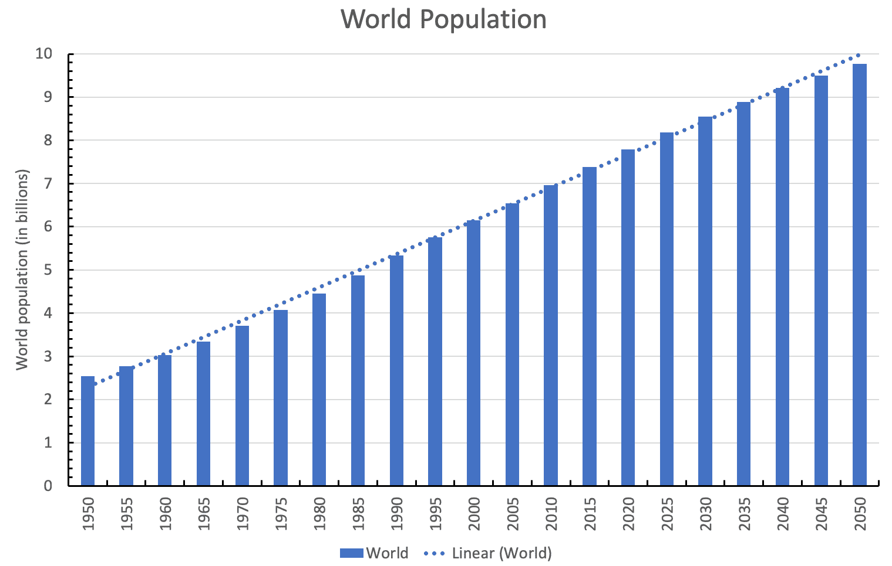
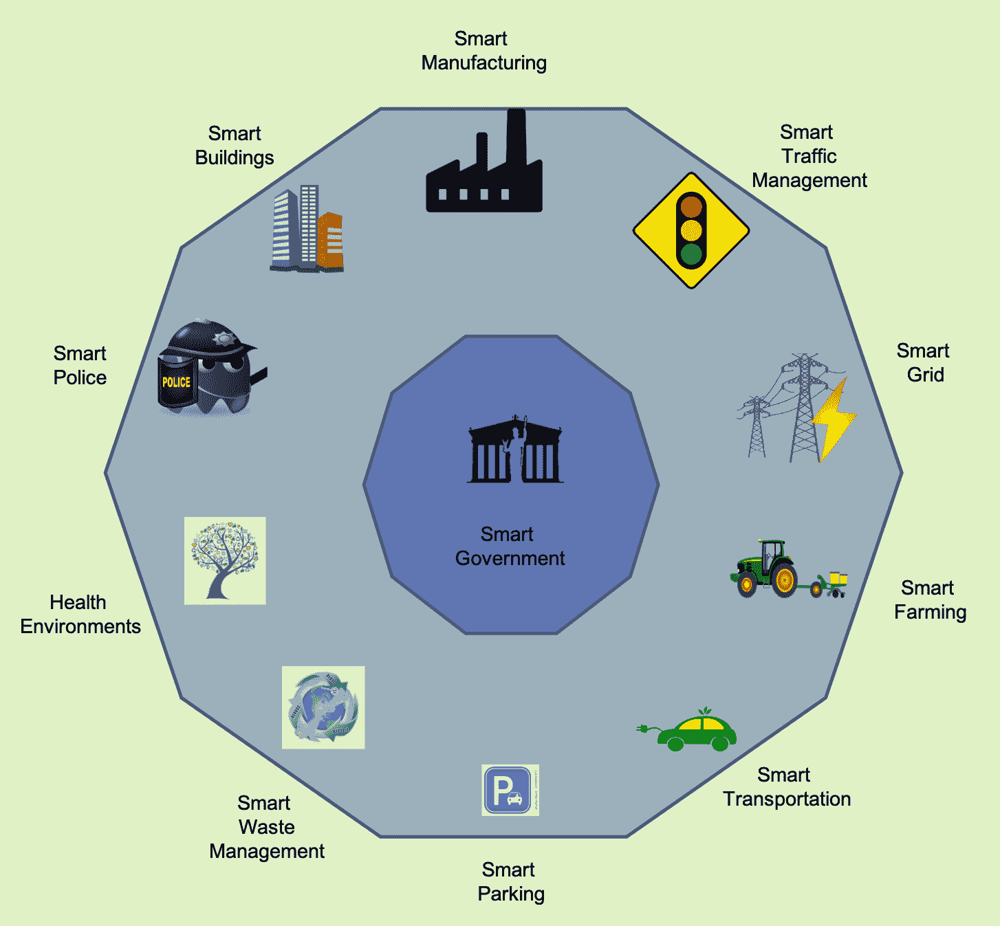
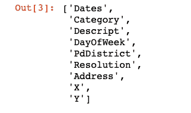
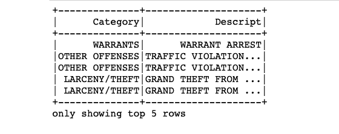

# 智能城市物联网（AI for Smart Cities IoT）

本章将向读者介绍智能城市。通过案例研究，将展示如何将本书中学到的概念应用于开发各种智能城市组件。在阅读本章时，您将学习以下内容：

+   什么是智能城市？

+   智能城市的基本组件

+   全球各地的城市正在实施智能解决方案

+   建设智能城市面临的挑战

+   编写代码以从旧金山犯罪数据中检测犯罪描述

# 我们为什么需要智能城市？

根据联合国数据（[`population.un.org/wup/DataQuery/`](https://population.un.org/wup/DataQuery/)），到 2050 年底，世界人口将达到 97 亿（9.7 × 10⁹）。预计其中约 70%将是城市人口，许多城市的人口将超过 1000 万。这是一个巨大的数字，随着人口的增长，我们不仅迎来了新的机会，同时也面临许多独特的挑战：



预测的世界人口（数据来源：联合国）

最困难的挑战是如何让所有居民都能获得资源和能源，同时避免环境恶化。目前，城市消耗了全球 75%的资源和能源，并产生了 80%的温室气体；尽管绿色能源的趋势在增长，但我们都知道地球的资源，如食物和水，是有限的。另一个关键挑战是行政管理；随着人口的增加，需要采取策略来防止卫生问题、缓解交通拥堵和遏制犯罪。

许多这些问题可以通过使用 AI 支持的物联网来解决。利用技术进步可以为城市居民创造新的体验，并使他们的日常生活更加舒适和安全。这催生了智能城市的概念。

根据 techopedia（[`www.techopedia.com/definition/31494/smart-city`](https://www.techopedia.com/definition/31494/smart-city)）的定义，**智能城市**是利用信息和通信技术提升城市服务（如能源和交通）质量和性能的城市，从而减少资源消耗、浪费和整体成本。Deakin 和 AI Waer 列出了四个有助于定义智能城市的因素：

+   在城市基础设施中使用广泛的电子和数字技术

+   利用**信息和通信技术**（**ICT**）来转变生活和工作环境

+   将 ICT 嵌入政府系统

+   实施将人们和信息通信技术（ICT）结合在一起的实践和政策，以促进创新并增强其提供的知识

因此，智能城市不仅拥有信息通信技术（ICT），而且还以一种积极影响居民的方式使用技术。

Deakin 和 AI Waer 的论文定义了智慧城市，并聚焦于所需的转型：

Deakin, M., 和 Al Waer, H.（2011）。*从智能到智慧城市*。*《智能建筑国际》, 3**(3), 140-152*。

**人工智能**（**AI**）与物联网（IoT）共同具有应对城市人口过度增长所带来的关键挑战的潜力；它们可以帮助解决交通管理、医疗、能源危机等诸多问题。物联网数据和人工智能技术可以改善智慧城市中市民和企业的生活。

# 智慧城市的组成部分

智慧城市有许多 AI 驱动的物联网技术应用场景，从维护更健康的环境到提升公共交通和安全。在下面的图表中，您可以看到一些智慧城市的应用场景：



智慧城市组成部分

本节将概述一些最受欢迎的应用场景——其中一些已经在全球各地的智慧城市中得到了实施。

# 智能交通管理

人工智能和物联网可以实施智能交通解决方案，确保智慧城市的居民能够尽可能安全、高效地从一个地点到达另一个地点。

洛杉矶，作为世界上最为拥堵的城市之一，已实施智能交通解决方案以控制交通流量。它已安装了路面传感器和闭路电视摄像头，将关于交通流量的实时更新发送到中央交通管理系统。来自传感器和摄像头的数据流被分析，并通知用户交通拥堵和信号灯故障的情况。2018 年 7 月，洛杉矶市在每个交叉口进一步安装了**先进交通控制器**（**ATC**）机柜。通过启用**车与基础设施通信**（**V2I**）和 5G 连接功能，这使得它们能够与具备交通信号灯信息功能的汽车（如 Audi A4 或 Q7）进行通信。您可以通过洛杉矶智慧交通系统的官方网站了解更多信息（[`dpw.lacounty.gov/TNL/ITS/`](https://dpw.lacounty.gov/TNL/ITS/)）。

启动嵌入传感器的自动化车辆可以提供车辆的位置和速度；它们可以与智能交通信号灯直接通信，防止交通拥堵。此外，利用历史数据，可以预测未来的交通情况，并加以利用防止可能的拥堵。

# 智能停车

住在城市中的任何人都一定感受到过找停车位的困难，尤其是在假期期间。智能停车可以缓解这一难题。通过在停车位地面嵌入路面传感器，智能停车解决方案能够判断停车位是否空闲，并创建实时停车地图。

阿德莱德市在 2018 年 2 月安装了智能停车系统，并推出了一款移动应用程序：Park Adelaide，该应用将为用户提供准确的实时停车信息。该应用可以让用户定位、支付，甚至远程延长停车时长。它还会提供可用停车位的导航、停车管理信息，并在停车时段即将结束时发出提醒。阿德莱德市的智能停车系统旨在改善交通流量，减少交通拥堵，并减少碳排放。智能停车系统的详细信息可通过阿德莱德市官网查看（[`www.cityofadelaide.com.au/city-business/why-adelaide/adelaide-smart-city/smart-parking`](https://www.cityofadelaide.com.au/city-business/why-adelaide/adelaide-smart-city/smart-parking)）。

**旧金山交通管理局**（**SAFTA**）实施了 SFpark 智能停车系统（[`sfpark.org`](http://sfpark.org)）。他们使用无线传感器实时检测计时停车位的占用情况。SFpark 于 2013 年推出，已将工作日的温室气体排放减少了 25%，交通量下降，驾驶员寻找停车位的时间减少了 50%。SAFTA 还报告称，通过简化停车缴费过程，损失因停车计时器损坏而减少，停车相关收入增加了约 190 万美元。

在伦敦，西敏市（[`iotuk.org.uk/smart-parking/#1463069773359-c0d6f90f-4dca`](https://iotuk.org.uk/smart-parking/#1463069773359-c0d6f90f-4dca)）与 Machina Research（[`machinaresearch.com/login/?next=/forecasts/usecase/`](https://machinaresearch.com/login/?next=/forecasts/usecase/)）合作，在 2014 年建立了智能停车系统。此前，驾驶员平均需要等待 12 分钟，导致了拥堵和污染，但自从安装了智能停车系统后，驾驶员无需等待，可以通过手机找到可用的停车位。这不仅减少了拥堵和污染，还提高了收入。

# 智能废物管理

垃圾收集及其妥善管理和处理是城市的重要服务。城市人口的增长要求采用更好的智能垃圾管理方法。一个智能城市应全面解决其垃圾管理问题。采用人工智能（AI）进行智能回收和垃圾管理可以提供可持续的垃圾管理系统。在 2011 年，芬兰公司 ZenRobotics（[`zenrobotics.com/`](https://zenrobotics.com/)）展示了如何利用计算机视觉和人工智能（机器人）来训练机器人，从传送带上分拣和挑选可回收材料。自那时以来，我们取得了长足的进展；许多公司提供智能垃圾管理解决方案，城市和建筑物也开始采纳这些方案。领导者和社区建设者对于智能城市基础设施部署的潜在好处有着日益增长的意识。

巴塞罗那的垃圾管理系统（[`ajuntament.barcelona.cat/ecologiaurbana/en/services/the-city-works/maintenance-of-public-areas/waste-management-and-cleaning-services/household-waste-collection`](http://ajuntament.barcelona.cat/ecologiaurbana/en/services/the-city-works/maintenance-of-public-areas/waste-management-and-cleaning-services/household-waste-collection)）是一个很好的案例研究。他们在垃圾桶上安装了传感器和设备，这些设备可以向有关部门发送警报通知，一旦垃圾桶即将被填满，相关部门就会派遣垃圾收集车。他们在每个地区都保持有单独的垃圾桶，分别用于纸张、塑料、玻璃和食品垃圾。巴塞罗那的管理部门已经建立了一个由地下真空管道连接的容器网络，这些管道能够吸走垃圾并将其送到处理单元；这也消除了垃圾车收集垃圾的需求。

另一个好的案例研究是丹麦的垃圾管理（[`www.smartbin.com/tdc-denmark-cisco-showcase-the-future-of-smart-city-waste-collection/`](https://www.smartbin.com/tdc-denmark-cisco-showcase-the-future-of-smart-city-waste-collection/)），由 SmartBin 提供。SmartBin 与丹麦最大的电信服务商 TDC 及思科（Cisco）合作，为一系列垃圾桶安装了传感器，这些传感器与城市数字平台集成。此外，路灯和交通信号灯也安装了传感器，这些传感器将数据发送到市政厅的控制台。这些传感器收集的实时数据帮助清洁服务更有效地规划垃圾收集路线；他们只需要去那些需要清空的地方。

在阿联酋沙迦安装了十个太阳能驱动的 Bigbelly 垃圾桶，并配备了 Wi-Fi 单元；他们计划在不久的将来部署数百个这样的智能垃圾桶，以实现可持续发展目标。

# 智能警务

不幸的是，犯罪是无处不在的。每个城市都有警察力量，致力于抓捕罪犯并降低犯罪率。智能城市同样需要警务：智能警务，指的是执法机构采用基于证据、数据驱动的策略，这些策略既有效、又高效、且经济。智能警务的概念大约于 2009 年出现，主要受限于预算约束。推动智能警务概念的根本思想来自赫尔曼·戈德斯坦（威斯康星大学，1979 年）。他认为，警察不应将犯罪事件视为孤立事件，而应将其视为具有历史和未来的公开问题系统。

在美国，**司法援助局**（**BJA**）资助了许多**智能警务倡议**（**SPI**），根据其研究结果，这些倡议显著减少了暴力犯罪。SPI 侧重于警察与研究合作伙伴的合作，研究合作伙伴负责持续的数据收集和分析，监控数据，参与解决方案的开发，并评估其影响。这些倡议帮助警察识别出以下内容：

+   犯罪热点

+   常犯罪犯

新加坡也已启动了其智能国家计划。几乎在城市的每个角落都安装了摄像头和传感器。通过这些设备获取的视频流，能够识别出哪些地方有人在禁烟区吸烟，或者从高楼上闲逛。摄像头使当局能够监控人群密度、公共场所的清洁情况，甚至追踪所有登记车辆的确切位置。这些摄像头的影像流被输入到一个名为**虚拟新加坡**的在线平台，该平台提供有关城市实时运作的信息。

# 智能照明

街灯是必要的，但它们消耗大量能源。智能照明系统可以帮助提高街灯的能效。除此之外，灯柱还可以配备额外的传感器，或作为 Wi-Fi 网络热点。

一个可以帮助在任何城市安装智能照明的发明是 CitySense ([`www.tvilight.com/citysense/`](https://www.tvilight.com/citysense/))，这是一款屡获殊荣的街道灯运动传感器，具有集成的无线照明控制功能。CitySense 为恶劣的外部环境设计，提供按需自适应照明。灯具可以根据行人、自行车或汽车的存在调整亮度。它通过实时网状网络触发邻近灯光，并在人体周围创建一个安全的光圈。它还配备智能过滤器，能够过滤掉由小动物或树木移动引起的干扰。该系统可以自动检测任何灯具故障，并触发维护请求。荷兰的梵高村已将 CitySense 应用于其智能街道照明系统。

值得一提的是巴塞罗那的照明大师计划，它报告了街道照明功耗的显著降低。大约在 2014 年，城市的大多数灯柱都安装了 LED 灯，并且在灯柱中安装了物联网驱动的传感器。传感器会在街道空旷时自动调暗灯光，这有助于降低能源消耗。此外，这些灯柱还充当 Wi-Fi 网络热点，并配备了监测空气质量的传感器。

# 智能治理

智能城市的主要目的是为其居民创造一个舒适便捷的生活。因此，智能城市基础设施在没有智能治理的情况下是不完整的。智能治理意味着利用信息和通信技术，通过不同利益相关者（包括政府和公民）之间更好的合作来提高决策质量。智能治理可以被视为智能、开放和参与性政府的基础。这需要重新塑造政府、公民和其他社会行为者的角色，并探索新技术来构建新的治理模式，包括新的关系、新的流程和新的政府结构。智能治理能够利用数据、证据和其他资源来改进决策，并能够交付满足公民需求的成果。这将提升决策过程并提高公共服务的质量。

# 使物联网适应智能城市及其必要步骤

建设智能城市不是一项一日之功，也不是某个人或某个组织的工作。这需要许多战略合作伙伴、领导者，甚至是公民的共同协作。这种协作的动态超出了本书的范围，但由于本书面向人工智能爱好者和工程师，我们来探讨一下人工智能社区能做些什么，哪些领域为我们提供了职业或创业的机会。任何物联网平台都必然需要以下内容：

+   用于收集数据的智能设备网络（传感器、摄像头、执行器等）

+   可以从低功耗物联网设备收集数据、存储数据并将其安全地转发到云端的现场（云）网关

+   用于汇聚多个数据流并将其分发到数据湖和控制应用程序的流数据处理器

+   存储所有原始数据的数据湖，甚至包括那些当前看似无价值的数据

+   一个可以清理和结构化收集到的数据的数据仓库

+   用于分析和可视化传感器收集数据的工具

+   用于基于长期数据分析自动化城市服务的 AI 算法和技术，并寻找提高控制应用程序性能的方法

+   用于向物联网执行器发送命令的控制应用程序

+   用于连接智能设备和公民的用户应用程序

除此之外，还会有关于安全性和隐私的问题，服务提供商必须确保这些智能服务不会对市民的福祉构成威胁。服务本身应该易于使用和操作，以便市民能够采纳它们。

如你所见，这为 AI 工程师提供了很多就业机会。物联网生成的数据需要被处理，要真正从中受益，我们需要超越监控和基础分析。AI 工具将被用来识别传感器数据中的模式和隐藏的关联。利用机器学习/人工智能工具分析历史传感器数据可以帮助识别趋势，并基于这些趋势创建预测模型。然后，这些模型可以被控制应用使用，向物联网设备的执行器发送命令。

建设智能城市的过程将是一个迭代的过程，每次迭代都会增加更多的处理和分析。以智能交通信号灯为例，让我们看看如何逐步改进它。

与传统交通信号灯相比，我们的智能交通信号灯会根据交通流量调整信号时间。我们可以使用历史交通数据来训练模型，以揭示交通模式并调整信号时间，从而最大化平均车速，避免拥堵。这种独立的智能交通信号灯很好，但还不够。如果一个地区发生了拥堵，那如果路上的驾驶员可以被告知避免这条路线，那就太好了。为了实现这一点，我们可以增加一个额外的处理系统；它通过交通信号灯的传感器数据识别拥堵，并使用车辆或驾驶员智能手机的 GPS，告知靠近拥堵区域的驾驶员避开该路线。

下一步，交通信号灯可以增加更多传感器，比如可以监测空气质量的传感器，然后训练模型以确保在达到临界空气质量之前生成警报。

# 开放数据的城市

在过去的十年里，世界各地的许多城市都建立了开放数据门户。这些开放数据门户不仅帮助市民保持信息通畅，对于 AI 开发者来说也是一大福音，因为数据是驱动 AI 的动力。我们来看看一些有趣的数据门户及其提供的数据。

这篇文章在《福布斯》上列出了 90 个拥有开放数据的美国城市：[ https://www.forbes.com/sites/metabrown/2018/04/29/city-governments-making-public-data-easier-to-get-90-municipal-open-data-portals/#4542e6f95a0d](https://www.forbes.com/sites/metabrown/2018/04/29/city-governments-making-public-data-easier-to-get-90-municipal-open-data-portals/#4542e6f95a0d)。

# 亚特兰大市 大亚特兰大快速交通局数据

**亚特兰大都市快速交通局** (**MARTA**) 发布了实时公共交通数据，旨在为开发者提供机会，开发定制的 web 和移动应用程序。MARTA 平台为开发者提供了资源，供他们访问数据并利用这些数据开发应用程序 ([`www.itsmarta.com/app-developer-resources.aspx`](https://www.itsmarta.com/app-developer-resources.aspx))。

**通用交通数据格式** (**GTFS**) 用于提供数据。GTFS 是一个用于公共交通时刻表和地理信息的标准格式。它由一系列文本文件组成，每个文件描述了交通信息的特定方面：停靠点、路线、行程及类似的计划数据。

MARTA 还通过 RESTful API 提供数据。要访问 API，你需要安装 MARTA-Python，这是一个用于访问 MARTA 实时 API 的 Python 库。可以使用 `pip` 安装该 Python 库：

```py
pip install tox
```

在使用 API 之前，你需要注册并申请 API 密钥 ([`www.itsmarta.com/developer-reg-rtt.aspx`](https://www.itsmarta.com/developer-reg-rtt.aspx))。API 密钥将存储在 `MARTA_API_KEY` 环境变量中。要设置 `MARTA_API_KEY`，你可以使用以下命令：

在 Windows 上，使用以下命令：

```py
set MARTA_API_KEY=<your_api_key_here>
```

在 Linux/MAC 上，使用以下命令：

```py
export MARTA_API_KEY=<your_api_key_here>
```

它提供了两个主要的封装函数 `get_buses()` 和 `get_trains()`，这两个函数都接受关键字参数来过滤结果：

```py
from marta.api import get_buses, get_trains

# To obtain list of all buses
all_buses = get_buses()

# To obtain a list of buses by route
buses_route = get_buses(route=1)

# To obtain list of all trains
trains = get_trains()

# To obtain list of trains specified by line
trains_red = get_trains(line='red')

# To obtain list of trains by station
trains_station = get_trains(station='Midtown Station')

# To obtain list of trains by destination
trains_doraville = get_trains(station='Doraville')

# To obtain list of trains by line, station, and destination
trains_all = get_trains(line='blue', 
            station='Five Points Station', 
            destination='Indian Creek')
```

`get_buses()` 和 `get_trains()` 函数分别返回 `Bus` 和 `Train` 字典对象。

# 芝加哥 "Things Array" 数据

**Things Array** (**AoT**) 项目于 2016 年启动，项目内容包括在灯杆上安装一个传感器盒网络。传感器收集有关环境和城市活动的实时数据。生成的数据可以通过批量下载以及 API 提供给开发者和爱好者。

传感器部署在多个地理区域，每个部署区域被称为 **项目**，其中最大部署位于芝加哥，属于名为芝加哥的项目。

部署的物理设备被称为 **节点**，每个节点通过其独特的序列号 VSN 进行标识。这些节点通过网络连接在一起。节点中包含 **传感器**，这些传感器观察环境的各个方面，如温度、湿度、光强度和颗粒物。传感器记录的信息称为 **观测数据**。

这些观测数据存在冗余，并可以通过 API 获取原始形式的数据。节点和观测、传感器和观测之间存在一对多的关系。项目、节点和传感器之间也存在多对多的关系。有关 AoT 项目的完整数据和详细信息，可以从芝加哥市开放数据门户访问：[`data.cityofchicago.org/`](https://data.cityofchicago.org/)。

# 使用旧金山犯罪数据检测犯罪

旧金山市也有一个开放数据门户（[`datasf.org/opendata/`](https://datasf.org/opendata/)），提供来自不同部门的在线数据。在本节中，我们使用提供大约 12 年（从 2003 年 1 月到 2015 年 5 月）的犯罪报告数据集，数据涵盖了旧金山市所有社区，并训练一个模型来预测发生的犯罪类别。共有 39 个离散的犯罪类别，因此这是一个多类别分类问题。

我们将使用 Apache 的 PySpark，并利用其易于使用的文本处理功能来处理这个数据集。所以第一步是创建一个 Spark 会话：

1.  第一步是导入必要的模块并创建 Spark 会话：

```py
from pyspark.ml.classification import LogisticRegression as LR
from pyspark.ml.feature import RegexTokenizer as RT
from pyspark.ml.feature import StopWordsRemover as SWR
from pyspark.ml.feature import CountVectorizer
from pyspark.ml.feature import OneHotEncoder, StringIndexer, VectorAssembler
from pyspark.ml import Pipeline
from pyspark.sql.functions import col
from pyspark.sql import SparkSession

spark = SparkSession.builder \
        .appName("Crime Category Prediction") \
        .config("spark.executor.memory", "70g") \
        .config("spark.driver.memory", "50g") \
        .config("spark.memory.offHeap.enabled",True) \
        .config("spark.memory.offHeap.size","16g") \
        .getOrCreate()
```

1.  我们加载存储在 `csv` 文件中的数据集：

```py
data = spark.read.format("csv"). \
        options(header="true", inferschema="true"). \
        load("sf_crime_dataset.csv")

data.columns
```



1.  数据包含九个列：[`Dates, Category, Descript, DayOfWeek, PdDistrict, Resolution, Address, X, Y`]，我们只需要 `Category` 和 `Descript` 字段来构建训练集和测试集：

```py
drop_data = ['Dates', 'DayOfWeek', 'PdDistrict', 'Resolution', 'Address', 'X', 'Y']
data = data.select([column for column in data.columns if column not in drop_data])

data.show(5)
```



1.  现在我们拥有的数据集包含文本数据，因此我们需要进行文本处理。三个重要的文本处理步骤是：对数据进行分词、去除停用词以及将词向量化。我们将使用 `RegexTokenizer`，它使用正则表达式将句子分词成一个单词列表，由于标点符号或特殊字符不会对含义产生任何影响，我们只保留包含字母数字内容的单词。像 `the` 这样的词在文本中非常常见，但对上下文没有任何意义。我们可以使用内置的 `StopWordsRemover` 类去除这些词（也叫做 **停用词**）。我们使用标准的停用词 `["http","https","amp","rt","t","c","the"]`。最后，通过使用 `CountVectorizer`，我们将单词转换为数字向量（特征）。正是这些数字特征将作为输入来训练模型。我们的数据输出是 `Category` 列，但它也是文本的，并且有 36 个不同的类别，因此我们需要将其转换为独热编码向量；PySpark 的 `StringIndexer` 可以轻松完成这个转换。我们将所有这些转换步骤添加到数据 `Pipeline` 中：

```py
# regular expression tokenizer
re_Tokenizer = RT(inputCol="Descript", 
            outputCol="words", pattern="\\W")    

# stop words
stop_words = ["http","https","amp","rt","t","c","the"] 
stop_words_remover = SWR(inputCol="words", 
            outputCol="filtered").setStopWords(stop_words)

# bag of words count
count_vectors = CountVectorizer(inputCol="filtered",
         outputCol="features", vocabSize=10000, minDF=5)

#One hot encoding the label
label_string_Idx = StringIndexer(inputCol = "Category", 
                outputCol = "label")

# Create the pipeline
pipeline = Pipeline(stages=[re_Tokenizer, stop_words_remover,
             count_vectors, label_string_Idx])

# Fit the pipeline to data.
pipeline_fit = pipeline.fit(data)
dataset = pipeline_fit.transform(data)

dataset.show(5)
```


1.  现在，数据已经准备好，我们将其分成训练集和测试集：

```py
# Split the data randomly into training and test data sets.
(trainingData, testData) = dataset.randomSplit([0.7, 0.3], seed = 100)
print("Training Dataset Size: " + str(trainingData.count()))
print("Test Dataset Size: " + str(testData.count()))
```

1.  让我们为此拟合一个简单的逻辑回归模型。在测试数据集上，它提供了 97% 的准确率。耶！

```py
# Build the model
logistic_regrssor = LR(maxIter=20, 
                regParam=0.3, elasticNetParam=0)
# Train model with Training Data
model = logistic_regrssor.fit(trainingData)

# Make predictions on Test Data
predictions = model.transform(testData)

# evaluate the model on test data set
evaluator = MulticlassClassificationEvaluator(predictionCol="prediction")
evaluator.evaluate(predictions)
```

完整的代码可在 GitHub 仓库 `Chapter11/SF_crime_category_detection.ipynb` Jupyter Notebook 中找到。

# 挑战与好处

人工智能正在改变城市的运作、交付和维护公共设施的方式，从照明、交通到连接性和健康服务。然而，采用技术时，如果技术之间无法高效协同工作或与其他城市服务无法整合，可能会成为阻碍因素。因此，考虑到改造性解决方案非常重要。

另一个需要关注的重要事项是合作。为了让城市真正从智能城市的潜力中受益，必须改变思维方式。各级政府应进行长期规划，并跨多个部门协作。所有人——包括技术专家、地方政府、企业、环保人士以及公众——都必须携手合作，才能让城市成功转型为智能城市。

尽管预算可能是一个大问题，但世界各地多个城市成功实施智能城市组件的成果表明，通过正确的实施，智能城市更加经济。智能城市的转型不仅创造了就业机会，还能帮助保护环境、减少能源支出并创造更多收入。巴塞罗那市就是一个典型的例子；通过实施物联网系统，预计创造了 47,000 个就业岗位，节省了 4,250 万欧元的水费，并通过智能停车每年额外创收 3,650 万欧元。我们可以清楚地看到，城市可以从利用人工智能驱动的物联网解决方案的技术进步中受益良多。

# 概要

基于人工智能的物联网解决方案可以帮助连接城市并管理多个基础设施和公共服务。本章介绍了智能城市的多种应用场景，从智能照明和道路交通到互联公共交通和废物管理。从成功的案例研究中，我们还了解到，智能城市可以减少能源成本、优化自然资源的使用、提高城市安全性，并创造更健康的环境。本章列出了一些开放的城市数据门户及其提供的信息。我们使用本书中学到的工具，对 12 年间旧金山的犯罪报告数据进行分类。最后，本章讨论了建设智能城市的一些挑战与好处。
