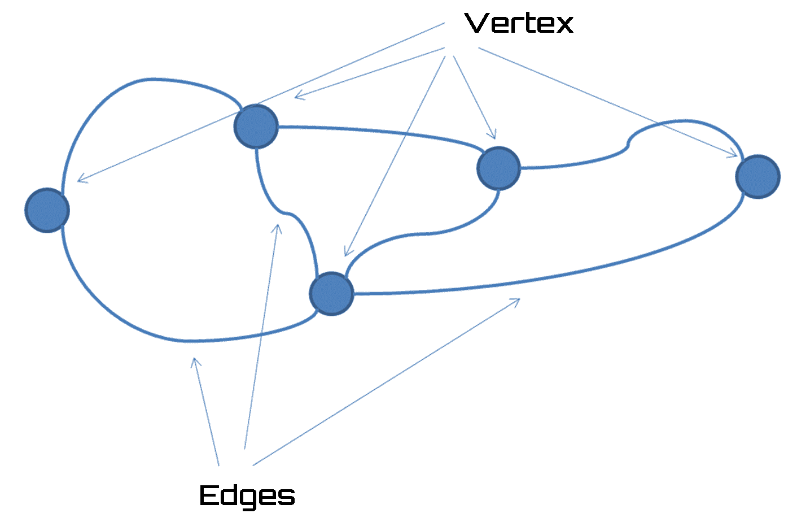
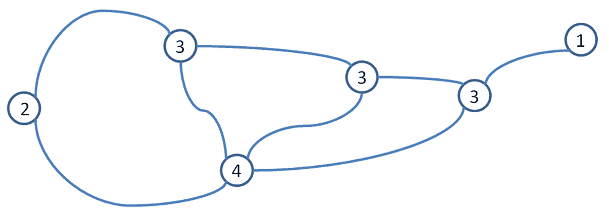
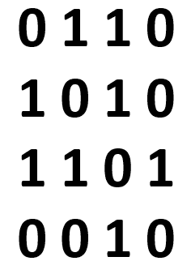
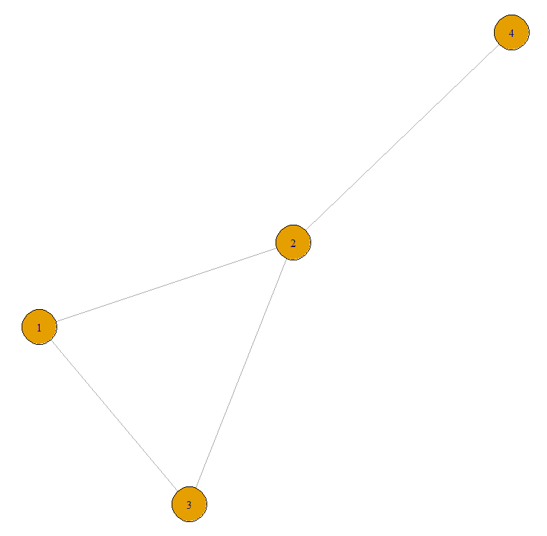
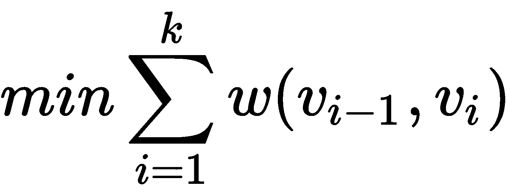
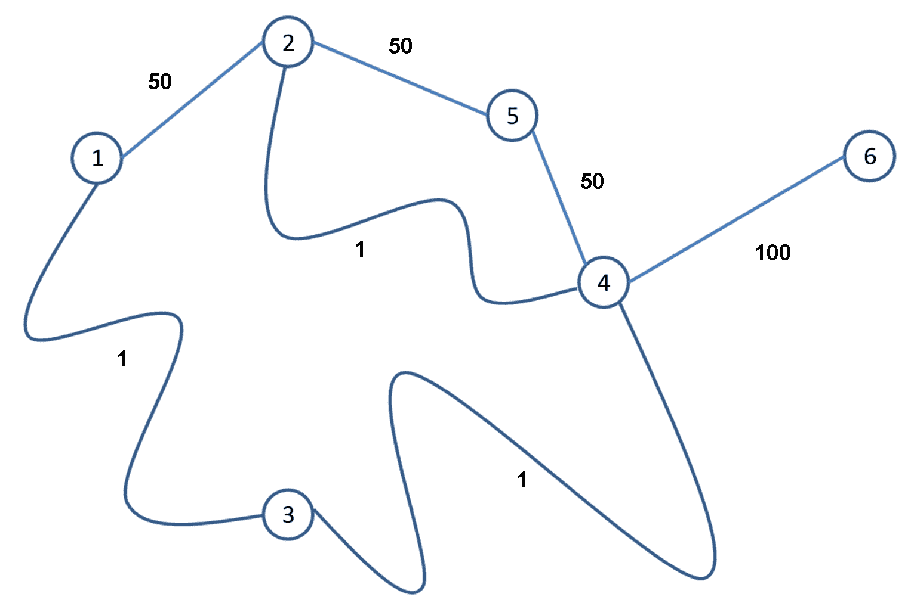

# 时序差分学习

**时序差分** (**TD**) 学习算法基于减少代理在不同时间做出的估计之间的差异。它是 **蒙特卡洛** (**MC**) 方法和 **动态规划** (**DP**) 思想的结合。该算法可以直接从原始数据中学习，而无需环境动态模型（就像 MC）。更新估计部分依赖于其他已学得的估计，而无需等待结果（自举，就像 DP）。在本章中，我们将学习如何使用 TD 学习算法来解决车辆路径规划问题。

本章将涵盖以下主题：

+   理解 TD 方法

+   介绍图论及其在 R 中的实现

+   将 TD 方法应用于车辆路径规划问题

本章结束时，你将学习到不同类型的 TD 学习算法，并了解如何使用它们来预测系统的未来行为。我们将学习 Q 学习算法的基本概念，并使用它们通过当前最优策略估计生成系统行为。最后，我们将区分 SARSA 和 Q 学习方法。

查看以下视频，看看代码的实际操作：

[`bit.ly/2YTB7dD`](http://bit.ly/2YTB7dD)

# 理解 TD 方法

TD 方法基于减少代理在不同时间做出的估计之间的差异。Q 学习是一个 TD 算法，我们将在接下来的部分学习，它基于相邻时刻状态之间的差异。TD 方法更加通用，可能会考虑更远的时刻和状态。

TD 方法结合了 MC 方法和动态规划（DP）的思想，正如你可能记得的那样，可以总结如下：

+   MC 方法使我们能够根据获得结果的平均值来解决强化学习问题。

+   DP 代表一组算法，这些算法可以在给定环境的完美模型（MDP）下，用于计算最优策略。

一方面，TD 方法继承了从与系统交互中积累的经验中直接学习的思想，这与蒙特卡洛（MC）方法类似，而不需要系统本身的动态信息。另一方面，它们继承了动态规划（DP）方法的思想，即基于其他状态的估计来更新某一状态下的函数估计（自举）。TD 方法适合在没有动态环境模型的情况下进行学习。如果时间步长足够小，或者随着时间的推移减少，你需要通过一个固定策略来收敛。

这些方法与其他技术的不同之处在于，它们试图最小化连续时间预测的误差。为了实现这一目标，这些方法将价值函数的更新重写为贝尔曼方程的形式，从而通过自举法提高预测精度。在这里，每次更新步骤都会减少预测的方差。为了实现更新的反向传播并节省内存，采用了资格向量。示例轨迹的使用效率更高，从而获得了良好的学习速率。

基于时间差异的方法使我们能够通过根据向下一个状态过渡的结果来更新价值函数，从而管理控制问题（即寻找最优策略）。在每一步中，函数*Q*（行动-价值函数）基于它为下一个状态-动作对所假定的值以及通过以下方程获得的奖励来更新：


通过采用一步前瞻，很明显，也可以使用两步公式，如下所示：


术语“前瞻”指的是一种试图预测在评估某个值时选择一个分支变量的效果的过程。该过程有以下目的：选择一个变量稍后进行评估，并评估分配给它的值的顺序。

更一般地说，通过*n*步前瞻，我们得到以下公式：


基于时间差异的不同类型算法的一个特征是选择行动的方法。有“在策略”方法，其中更新基于由所选策略确定的行动的结果；还有“离策略”方法，在这种方法中，可以通过假设的行动评估不同的策略，这些假设的行动实际上并未执行。与“在策略”方法不同，后者可以将探索问题与控制问题分离，且学习策略在学习阶段并不一定被应用。

在接下来的章节中，我们将通过两种方法学习如何实现时间差异方法：SARSA 和 Q 学习。

# SARSA

正如我们在第一章《使用 R 进行强化学习概述》中所预期的，SARSA 算法实现了一种在策略的时间差异方法，其中，行动-价值函数(*Q*)的更新是基于从状态*s = s (t)*过渡到状态*s' = s (t + 1)*的结果，并且该过渡是基于所选策略*π (s, a)*采取的行动*a (t)*。

一些策略总是选择提供最大奖励的行动，而非确定性策略（如ε-贪心、ε-软策略或软最大策略）则确保在学习阶段有一定的探索成分。

在 SARSA 中，必须估算动作价值函数 𝑞 (𝑠, 𝑎)，因为在没有环境模型的情况下，状态 𝑣 (𝑠)（价值函数）的总值不足以让策略根据给定的状态判断执行哪个动作是最好的。然而，在这种情况下，值是通过遵循贝尔曼方程，并考虑状态-动作对代替状态，逐步估算的。

由于其在策略中的特性，SARSA 根据π策略的行为估算动作价值函数，同时根据从动作价值函数中更新的估算值，修改策略的贪婪行为。SARSA 的收敛性，和所有 TD 方法一样，依赖于策略的性质。

以下代码块展示了 SARSA 算法的伪代码：

```py
Initialize
   arbitrary action-value function
Repeat (for each episode)
   Initialize s
   choose a from s using policy from action-value function
   Repeat (for each step in episode)
      take action a
      observe r, s'
     choose a' from s' using policy from action-value function
      update action-value function
      update s,a
```

动作价值函数的`update`规则使用所有五个元素（`s[t]`，`a[t]`，`r[t + 1]`，`s[t + 1]`，以及 `a[t + 1]`），因此被称为**状态-动作-奖励-状态-动作** (**SARSA**)。

# Q-learning

Q-learning 是最常用的强化学习算法之一。其原因在于它能够比较可用动作的期望效用，而不需要环境模型。得益于这项技术，可以在完成的 MDP 中为每个给定的状态找到最优动作。

强化学习问题的一个通用解决方案是在学习过程中估算评估函数。这个函数必须能够通过奖励的总和评估特定策略的便利性或其他方面。事实上，Q-learning 试图最大化 Q 函数（动作价值函数）的值，Q 函数表示我们在状态 *s* 下执行动作 *a* 时的最大折扣未来奖励。

Q-learning 和 SARSA 一样，逐步估算函数值 𝑞 (𝑠, 𝑎)，在环境的每个步骤中更新状态-动作对的值，遵循更新 TD 方法估算值的通用公式逻辑。与 SARSA 不同，Q-learning 具有离策略特性。也就是说，虽然策略是根据 𝑞 (𝑠, 𝑎) 估算的值进行改进的，但价值函数更新估算值时遵循严格的贪婪次级策略：给定一个状态，选择的动作总是那个能够最大化值 *max*𝑞 (𝑠, 𝑎) 的动作。然而，π策略在估算值方面起着重要作用，因为要访问和更新的状态-动作对是通过它来决定的。

以下代码块展示了 Q-learning 算法的伪代码：

```py
Initialize
   arbitrary action-value function
Repeat (for each episode)
   Initialize s
   choose a from s using policy from action-value function
   Repeat (for each step in episode)
      take action a
      observe r, s'
      update action-value function
      update s
```

Q-learning 使用一个表格来存储每个状态-动作对。在每个步骤中，智能体观察当前环境的状态，并使用π策略选择并执行动作。通过执行该动作，智能体获得奖励 𝑅[𝑡+1]，以及新的状态 𝑆[𝑡+1]。此时，智能体可以计算 𝑄 (s[𝑡], a[𝑡])，并更新估算值。

在接下来的部分中，将给出图论的基础，并说明如何在 R 中处理这项技术。

# 引入图论并在 R 中实现

图是广泛应用于优化问题的数据结构。图由顶点和边的结构表示。顶点可以是从中出发的不同选择（即边）。通常，图用于清晰地表示网络：顶点代表独立的计算机、路口或公交车站，边则是电气连接或道路。边可以以任何可能的方式连接顶点。

图论是数学的一个分支，它允许你描述对象集合及其关系；由莱昂哈德·欧拉在 1700 年发明。

图通常用*G = (V, E)*的紧凑形式表示，其中*V*表示顶点集合，*E*表示构成图的边集合。顶点的数量是*|V|*，边的数量是*|E|*。图的顶点数，或其子部分的顶点数，显然是定义其维度的基本量；边的数量和分布描述了它们的连接性。

有不同类型的边：我们讨论的是无向边，其边没有方向，而与有向边相比。有向边称为弧，相关的图称为**有向图**。例如，无向边用于表示具有同步链路的数据传输计算机网络（如下图所示），而有向图则可以表示道路网络，允许表示双向和单向道路。

下图表示一个简单的图：



如果我们能够从任何给定的顶点到达图中的所有其他顶点，我们就说这个图是连通的。如果每条边都关联一个权重，并且通常由权重函数(*w*)定义，则图是加权图。权重可以视为两个节点之间的成本或距离。成本可能取决于流量通过边的规律。在这个意义上，权重函数*w*可以是线性的，也可以不是，并且取决于通过边的流量（非拥塞网络）或周围边的流量（拥塞网络）。

顶点的特征是其度数，度数等于以该顶点为终点的边的数量。根据度数，顶点如下所示：

+   度数为 0 的顶点称为孤立顶点。

+   度数为 1 的顶点称为叶子顶点。

下图展示了一个按度数标记的图：



在有向图中，我们可以区分出度（即出发边的数量）和入度（即进入边的数量）。基于这一假设，入度为零的顶点称为源顶点，出度为零的顶点称为汇顶点。

最后，简约顶点是其邻居形成团体的顶点：每两个邻居都是相邻的。通用顶点是与图中所有其他顶点相邻的顶点。

表示图的方法有多种，例如以下几种：

+   图形表示（如前图所示）

+   邻接矩阵

+   顶点 *V* 和弧 *E* 的列表

表示图的第一种方法通过实际示例进行了清晰的介绍（见前面的图示）。在图形表示中，圆圈表示顶点，线条表示两个顶点之间的连接，如果它们相连。若该连接具有方向性，则通过添加箭头来表示。在接下来的部分，我们将分析表示图的其他两种方法。

# 邻接矩阵

到目前为止，我们已经通过顶点和边来表示图。当顶点数量较少时，这种表示方法是最好的，因为它使我们能够直观地分析图的结构。当顶点数量变大时，图形表示变得混乱。在这种情况下，通过邻接矩阵表示图会更好。邻接矩阵或连接矩阵是图表示中常用的数据结构，广泛应用于图操作算法的设计以及图的计算机表示中。如果它是稀疏矩阵，使用邻接表优于使用矩阵。

给定任何图，其邻接矩阵由一个方形二进制矩阵组成，矩阵的行和列是图中顶点的名称。在矩阵的 (*i, j*) 位置上，如果图中存在一条从顶点 *i* 到顶点 *j* 的边，则该位置为 1；否则为 0。在无向图的表示中，矩阵相对于主对角线是对称的。例如，查看以下图示所表示的图：


前面的图可以通过以下邻接矩阵来表示：



如预期所示，矩阵相对于主对角线是对称的，表示图是无向的。如果矩阵中不是 1 而是其他数字，那么这些数字表示分配给每个连接（边）的权重。在这种情况下，矩阵被称为马尔可夫矩阵，因为它适用于马尔可夫过程。例如，如果图的顶点集表示地图上的一系列点，那么边的权重可以解释为它们连接的点之间的距离。

这个矩阵的一个基本特点是，它可以计算从节点*i*到节点*j*的路径数，这些路径必须经过*n*个顶点。为了得到这些信息，只需将矩阵的*n*次方计算出来，并查看在*i, j*位置上的数字即可。另一种表示图的方式是使用邻接列表。我们来看一下。

# 邻接列表

**邻接列表**是图在内存中的一种表示方式。这可能是最简单的实现方式，尽管通常来说，它在占用空间方面不是最有效的。

让我们分析一个简单的图；每个顶点旁边列出的是其相邻顶点的列表。表示方法的基本思想是，每个顶点*Vi*都与一个包含所有与其相连的顶点*Vj*的列表相关联，即存在一条从*Vi*到*Vj*的边。

假设你记住了所有类型为(*Vi, L*)的顶点对，其中*L*是顶点*Vi*的邻接列表，那么我们就能得到图的唯一描述。或者，如果你决定对邻接列表进行排序，那么就不需要显式地存储顶点了。

让我们举个例子——我们将使用上一节中采用的相同图形，图示如下：


基于前面提到的内容，我们将构建邻接列表。上图中的图可以表示如下：

| 1 | 相邻于 | 2,3 |
| --- | --- | --- |
| 2 | 相邻于 | 1,3 |
| 3 | 相邻于 | 1,2,4 |
| 4 | 相邻于 | 3 |

邻接列表由对组成。每个图中的顶点都有一对。对的第一个元素是正在分析的顶点，第二个元素是由所有与它相邻的顶点组成的集合，这些顶点通过一条边与之相连。

假设我们有一个包含*n*个顶点和*m*条边（有向）的图，且假设邻接列表已按顺序记忆（为了避免显式记忆索引），那么每条边会出现在一个且仅一个邻接列表中，并且它会以指向的顶点编号的形式出现。因此，需要记住总共*m*个小于等于*n*的数字，总的成本为*mlog2n*。

对于无向图来说，没有明显的方法来优化这种表示法；每条弧必须在连接的两个顶点的邻接列表中都进行记忆，从而降低了效率。如果图是有向图，我们仍然需要一种有效的方法来知道指向某个顶点的弧。在这种情况下，将每个顶点关联两个列表是比较方便的：一个是进入弧的列表，另一个是出去弧的列表。

在时间效率方面，邻接列表的表示方式在访问和插入操作中表现得相当不错，主要操作在*O(n)*时间内完成。到目前为止，我们已经分析了图形表示的技术。接下来，让我们学习如何在 R 环境中使用这些技术。

# 在 R 中处理图形

在 R 中，节点集（*V*）和弧集（*E*）是不同类型的数据结构。对于*V*，一旦我们为每个节点分配唯一标识符，就可以无歧义地访问每个节点。因此，它就像是在说，托管节点属性的数据结构是一维的，因此是一个向量。

相反，弧集（节点之间的链接）*E*的数据结构不能是向量，它不表示单一对象的特征，而是表示对象对之间的关系（在这种情况下是节点对之间的关系）。因此，如果例如在*V*（节点集）中有 10 个节点，那么*E*的维度将是 10 × 10，即所有可能节点对之间的关系。最终，*E*有两个维度，因此它不是向量，而是矩阵。

在矩阵*E*中，我们有多行等于*V*中节点的数量，多列等于*V*中节点的数量。这表示在*邻接矩阵*部分中详细分析的邻接矩阵。

要在 R 中处理图形，我们可以使用`igraph`包——该包包含用于简单图形和网络分析的函数。它能够很好地处理大型图形，并提供生成随机图和规则图、图形可视化、中心性方法等功能。

以下表格提供了有关该包的一些信息：

| 包 | `igraph` |
| --- | --- |
| 日期 | 2019-22-04 |
| 版本 | 1.2.4.1 |
| 标题 | 网络分析与可视化 |
| 维护者 | Gábor Csárdi |

为了开始使用可用工具，我们将分析一个简单的示例。假设我们有一个由四个节点和四条边组成的图。首先要做的是定义这四个节点之间的链接；为此，我们将使用`graph`函数（记得在安装后加载`igraph`库）：

```py
library(igraph)
Graph1 <- graph(edges=c(1,2, 2,3, 3, 1, 3,4), n=4, directed=F)
```

`graph`函数是`graph.constructors`方法的一部分，提供了创建图形的各种方法：空图、有给定边的图、从邻接矩阵构建的图、星形图、格状图、环形图和树形图。我们使用的方法是通过使用数值向量来定义边来定义图形，向量中的第一个元素到第二个元素为第一条边，第三个元素到第四个元素为第二条边，以此类推。

实际上，我们可以看到传入了四对值：第一对定义了节点 1 和节点 2 之间的连接，第二对定义了节点 2 和节点 3 之间的连接，第三对定义了节点 3 和节点 1 之间的连接，最后，第四对定义了节点 4 和节点 2 之间的连接。为了更好地理解图中节点之间的连接，我们将绘制该图：

```py
plot(Graph1)
```

绘制了以下图形：



我们创建的图是一个具有特征的对象，可以按如下方式进行分析：

```py
Graph1
```

返回的结果如下：

```py
IGRAPH 143ffd1 U--- 4 4 --
+ edges from 143ffd1:
[1] 1--2 2--3 1--3 3--4
```

节点之间的边已指示。然后，我们计算节点 1 和节点 4 之间的最短路径：

```py
get.shortest.paths(Graph1, 1, 4)
```

`get.shortest.paths()` 计算从源顶点到目标顶点的单一最短路径。该函数对于无权图使用广度优先搜索，对于有权图使用 Dijkstra 算法。在我们的例子中，由于添加了权重属性，因此使用了 Dijkstra 算法。

返回以下结果：

```py
$vpath
$vpath[[1]]
+ 3/4 vertices, from 1b5d9f3:
[1] 1 3 4
```

现在，计算此路径上两点之间的距离：

```py
distances(Graph1, 1, 4)
```

返回以下结果：

```py
[1,]    2
```

目前我们所表示的图在识别两地之间最短路径方面的用途有限，这正是我们的目标。为了计算最佳路径，需要引入边权重的概念。在我们的例子中，我们可以将此属性视为两个节点之间路径长度的度量；通过这种方式，我们可以通过路径来评估两个节点之间的距离。为此，我们将使用以下方式来定义属性权重：

```py
WeightsGraph1<- c(1,1,4,1)
E(Graph1)$weight <- WeightsGraph1
```

首先，我们通过一个向量定义了权重，确认了在图创建时定义的边的顺序。然后，我们将权重属性添加到先前创建的图中。现在，每条边都有了自己的长度。如果没有定义权重会怎样呢？简单地说，它们都会被设为 1；在这种情况下，最短路径将是节点数最少的路径。

现在，让我们重新计算节点 1 和节点 4 之间的最短路径：

```py
get.shortest.paths(Graph1, 1, 4)
```

返回以下结果：

```py
$vpath
$vpath[[1]]
+ 4/4 vertices, from 1b5d9f3:
[1] 1 2 3 4
```

我们可以看到，现在的路径涉及多个节点。我们将验证这两个节点之间的距离：

```py
distances(Graph1, 1, 4)
```

返回以下结果：

```py
[1,]    3
```

通过这种方式，我们验证了所指示的路径是最短路径，因为最长的连接已被避免。在下一节中，我们将看到如何使用 Dijkstra 算法找到最佳路径。

# Dijkstra 算法

Dijkstra 算法用于解决从源节点 *s* 到所有节点的最短路径问题。该算法为节点维护一个标签 *d(i)*，表示节点 *i* 最短路径长度的上限。

在每一步中，算法将 *V* 中的节点分成两组：一组是永久标记的节点，另一组是仍然是临时标记的节点。永久标记节点的距离表示从源节点到这些节点的最短路径距离，而临时标记的节点则包含一个值，该值可以大于或等于最短路径长度。

该算法的基本思想是从源节点开始，尝试永久标记后继节点。开始时，算法将源节点的距离值设为零，并将其他节点的距离初始化为一个任意高的值（按照惯例，我们将距离的初始值设为 *d[i] = + ∞, ∀i ∈ V*）。在每次迭代中，节点标签 *i* 是从源节点出发的路径中最小距离的值，该路径除了 *i* 之外只有永久标记的节点。算法选择那些临时标记的节点中标签值最低的节点，将其永久标记，并更新所有与之相邻节点的标签。当所有节点都被永久标记时，算法终止。

通过执行该算法，针对每个目标节点 *v*（属于 *V*），我们可以获得一个最短路径 *p*（从 *s* 到 *v*），并计算以下内容：

+   *d [v]*：节点 *v* 到源节点 *s* 的距离 *p*

+   *π [v]*: 节点 *v* 的前驱节点为 *p*

对于每个节点 *v*（属于 *V*）的初始化，我们将使用以下过程：

+   *d [v] = ∞ 如果 v ≠ s*，否则 *d [s] = 0*

+   *π [v] = Ø*

在执行过程中，我们使用泛化边 *(u, v)*（属于 *E*）的松弛技术来改善 *d* 的估算值。

边 *(u, v)* 的松弛操作，旨在评估是否可以通过将 *u* 作为 *v* 的前驱节点来改善当前的距离值 *d [v]*，如果可以改善，则更新 *d [v]* 和 *π [v]*。该过程如下：

1.  如果 *d[v]> d[u] + w (u, v)* 则

1.  *d[v] = d[u] + w (u, v)*

1.  *π [v] = u*

该算法基本上执行两个操作：节点选择操作和更新距离的操作。第一个操作在每一步选择标签值最低的节点；另一个操作验证条件 *d[v]> d[u] + w(u, v)*，如果满足条件，则更新标签值，令 *d[v] = d[u] + w (u, v)*。

在接下来的部分中，我们将实现一种 TD 方法来解决一个实际应用问题。

# 将 TD 方法应用于车辆路径问题

给定一个加权图和一个指定的顶点 *V*，通常需要找出从一个节点到图中每个其他顶点的路径。识别连接两个或多个节点的路径是许多离散优化问题的子问题，并且在现实世界中有广泛的应用。

例如，考虑一个问题：在一张道路地图上标识两地之间的路线，其中顶点表示地点，边表示连接它们的道路。在这种情况下，每个代价都与道路的公里长度或覆盖该段道路的平均时间相关。如果我们想要识别的是最小总代价的路径，而非任意路径，那么所得到的问题被称为图中的最短路径问题。换句话说，图中两个顶点之间的最短路径是连接这两个顶点并最小化穿越每条边的代价之和的路径。

所以，让我们通过一个实际的例子来考虑——假设一位游客开车从罗马前往威尼斯。假设他手中有一张意大利地图，上面标出了各个城市之间的直连路径及其长度，游客如何找到最短的路径？

该系统可以通过一个图来示意，其中每个城市对应一个顶点，道路对应顶点之间的连接弧。你需要确定图中源顶点和目标顶点之间的最短路径。

该问题的解决方案是为从罗马到威尼斯的所有可能路线编号。对于每条路线，计算总长度，然后选择最短的一条。这个解决方案不是最有效的，因为需要分析的路径有数百万条。

实际上，我们将意大利地图建模为一个加权有向图 *G = (V, E)*，其中每个顶点表示一个城市，每条边 *(u, v)* 表示从 *u* 到 *v* 的直接路径，而每个权重 *w(u, v)* 对应于边 *(u, v)*，表示 *u* 和 *v* 之间的距离。因此，要解决的问题是找到从表示罗马的顶点到表示威尼斯的顶点的最短路径。

给定一个加权有向图 *G = (V, E)*，路径 *p = (v0, v1, ..., vk)* 的权重由其组成的边的权重之和给出，如下公式所示：


从节点 *u* 到节点 *v* 的最短路径是一个路径 *p = (u, v1, v2, ..., v)*，使得 *w(p)* 最小，如下所示：



从 *u* 到 *v* 的最短路径的代价用 *δ(u, v)* 表示。如果从 *u* 到 *v* 没有路径，则 *δ(u, v) = ∞*。

给定一个连通的加权图 *G = (V, E)* 和一个源节点 *s*，有多种算法可以找到从 *s* 到 *V* 中其他节点的最短路径。在上一节中，我们分析了 Dijkstra 算法，现在是时候使用基于强化学习的算法来解决这个问题了。

正如本章开始时预期的那样，车辆路径问题（VRP）是一个典型的配送和运输问题，旨在优化使用一组有限容量的车辆来接送货物或人员，并将其运送到地理上分布的站点。以最佳方式管理这些操作可以显著降低成本。在用 Python 代码解决问题之前，让我们分析一下这一主题的基本特征，以便理解可能的解决方案。

基于迄今为止所述，很明显，这类问题可以被视为路径优化过程，可以通过图论有效地解决。

假设我们有以下图，其中边上的数字表示顶点之间的距离：


很容易看出，从 1 到 6 的最短路径是 1 – 2 – 5 – 4 - 6。

在*理解 TD 方法*部分中，我们已经看到，选择动作的方法根据 TD 的不同，算法的类型也会有所不同。在基于策略的方法（SARSA）中，更新是根据由选定策略决定的动作结果进行的，而在离策略方法（Q-learning）中，策略是通过假设的动作来评估的，而这些动作并未真正执行。我们将通过这两种方法来解决刚才提到的问题，突显解决方案的优点和缺点。那么，让我们看看如何使用 Q-learning 来处理车辆路径问题。

# Q-learning 方法

正如我们在*Q-learning*部分所说，Q-learning 试图最大化 Q 函数（动作-价值函数）的值，该函数表示当我们在状态*s*中执行动作*a*时，能够获得的最大折扣未来奖励。

以下代码块是一个 R 代码的实现，通过 Q 学习技术让我们研究这一路径：

```py
N <- 1000
gamma <- 0.9
alpha <- 1
FinalState <- 6

RMatrix <- matrix(c(-1,50,1,-1,-1,-1,
                      -1,-1,-1,1,50,-1,
                      -1,-1,-1,1,-1,-1,
                      -1,-1,-1,-1,-1,100,
                      -1,-1,-1,50,-1,-1,
                      -1,-1,-1,-1,-1,100),nrow=6,byrow = TRUE)

print(RMatrix)

QMatrix <- matrix(rep(0,length(RMatrix)), nrow=nrow(RMatrix))

for (i in 1:N) {
  CurrentState <- sample(1:nrow(RMatrix), 1)
 repeat {
    AllNS <- which(RMatrix[CurrentState,] > -1)
    if (length(AllNS)==1)
      NextState <- AllNS
    else
      NextState <- sample(AllNS,1)
    QMatrix[CurrentState,NextState] <- QMatrix[CurrentState,NextState] + alpha*(RMatrix[CurrentState,NextState] + gamma*max(QMatrix[NextState, which(RMatrix[NextState,] > -1)]) - QMatrix[CurrentState,NextState])

    if (NextState == FinalState) break
    CurrentState <- NextState
  }
}

print(QMatrix)
```

我们将逐行分析代码，从以下参数的设置开始：

```py
N <- 1000
gamma <- 0.9
alpha <- 1
FinalState <- 6
```

这里，我们有以下内容：

+   `N`: 迭代的回合数

+   `gamma`: 折扣因子

+   `alpha`: 学习率

+   `FinalState`: 目标节点

让我们继续设置奖励矩阵：

```py
RMatrix <- matrix(c(-1,50,1,-1,-1,-1,
                      -1,-1,-1,1,50,-1,
                      -1,-1,-1,1,-1,-1,
                      -1,-1,-1,-1,-1,100,
                      -1,-1,-1,50,-1,-1,
                      -1,-1,-1,-1,-1,100),nrow=6,byrow = TRUE)
```

我们看到矩阵的呈现方式如下：

```py
print(RMatrix)
```

以下矩阵被打印出来：

```py
 [,1] [,2] [,3] [,4] [,5] [,6]
[1,]   -1   50    1   -1   -1   -1
[2,]   -1   -1   -1    1   50   -1
[3,]   -1   -1   -1    1   -1   -1
[4,]   -1   -1   -1   -1   -1  100
[5,]   -1   -1   -1   50   -1   -1
[6,]   -1   -1   -1   -1   -1  100
```

让我们尝试理解如何设置这个矩阵。一切都非常简单：我们在最方便的边上（那些权重较低的边，即较短的路径）关联了高奖励。然后，我们将最高的奖励（100）赋给了通向目标的边。最后，我们将负奖励分配给不存在的连接。下图显示了我们如何设置奖励：



我们只是将边的权重替换成与长度值相对应的奖励。较长的边返回较低的奖励，而较短的边返回较高的奖励。最终，当目标到达时，将获得最大的奖励。

正如我们在*Q-learning*部分所说，我们的目标是估计一个评估函数，该函数根据奖励的总和来评估策略的便利性。Q-learning 算法试图最大化 Q 函数（行动值函数）的值，Q 函数表示我们在状态*s*中执行动作*a*时的最大折现未来奖励。

让我们再次分析我们需要使用 R 实现的程序：

```py
Initialize
   arbitrary action-value function
Repeat (for each episode)
   Initialize s
   choose a from s using policy from action-value function
   Repeat (for each step in episode)
      take action a
      observe r, s'
      update action-value function
      update s
```

在每一步，代理观察环境的当前状态，并使用π策略选择并执行动作。通过执行该动作，代理获得奖励𝑅𝑡 *+ 1*和新状态𝑆𝑡 *+ 1*。此时，代理可以通过更新估计来计算𝑄 (*s*𝑡, *a*𝑡)。

因此，Q 函数代表了程序的核心元素；它是一个与奖励矩阵维度相同的矩阵。首先，我们将其初始化为全零矩阵：

```py
  QMatrix <- matrix(rep(0,length(RMatrix)), nrow=nrow(RMatrix))
```

此时，我们必须设置一个循环，对每个回合重复操作：

```py
for (i in 1:N) {
```

循环的初始部分用于设置初始状态和初始策略；在我们的案例中，我们将随机选择一个初始状态：

```py
  CurrentState <- sample(1:nrow(RMatrix), 1)
```

设置初始状态后，我们必须插入一个循环，直到达到最终状态，即我们的目标：

```py
  repeat {
```

现在我们必须根据当前状态中可用的可能动作选择下一个状态。为了移动到下一个节点，我们可以采取哪些行动？如果只有一个可能的动作可用，我们将选择那个动作。否则，我们将随机选择一个动作，然后再分析其他动作：

```py
    AllNS <- which(RMatrix[CurrentState,] > -1)
    if (length(AllNS)==1)
      NextState <- AllNS
    else
      NextState <- sample(AllNS,1)
```

根据获得的结果，我们可以更新行动值函数（`QMatrix`）：

```py
    QMatrix[CurrentState,NextState] <- QMatrix[CurrentState,NextState] + alpha*(RMatrix[CurrentState,NextState] + gamma*max(QMatrix[NextState, which(RMatrix[NextState,] > -1)]) - QMatrix[CurrentState,NextState])
```

用于更新 Q 函数的公式如下：


现在，我们将检查已达成的状态：如果我们已经达到了目标，则使用 break 命令退出循环；否则，我们将把下一个状态设为当前状态（`NextState`）：

```py
    if (NextState == FinalState) break
    CurrentState <- NextState
  }
}
```

一旦程序完成，我们将打印 Q 矩阵：

```py
print(QMatrix)
```

返回以下结果：

```py
 [,1]  [,2]  [,3] [,4] [,5] [,6]
[1,]    0 864.5 811.9    0    0    0
[2,]    0   0.0   0.0  901  905    0
[3,]    0   0.0   0.0  901    0    0
[4,]    0   0.0   0.0    0    0 1000
[5,]    0   0.0   0.0  950    0    0
[6,]    0   0.0   0.0    0    0 1000
```

让我们尝试理解这个矩阵告诉了我们什么。首先，我们可以说这个矩阵允许我们计算从任何状态开始的最短路径，因此，不一定是从节点 1 开始。在我们的案例中，我们将从节点 1 开始，以确认视觉上获得的结果。回想一下，矩阵的每一行代表一个状态，每一列中的值告诉我们转移到列索引标记的状态时的奖励。

在接下来的流程路径中，我们有如下内容：

1.  从第一行开始，我们看到最大值位于第二列，因此，最佳路径将我们从状态 1 带到状态 2。

1.  然后，我们进入由第二行标识的状态 2；在这里，我们看到最大奖励值位于第五列，因此，最佳路径将我们从状态 2 带到状态 5。

1.  然后我们继续讨论由第五行标识的状态 5。在这里，我们看到奖励的最大值与第四列相对应，因此，最佳路径将我们从状态 5 带到状态 4。

1.  最后，我们转到由第四行标识的状态 4。在这里，我们看到奖励的最大值与第六列相对应，因此，最佳路径将我们从状态 4 带到状态 6。

我们已经到达目标，并且通过这样做，我们从节点 1 到节点 6 绘制了更短的路径，路径如下：

1 – 2 - 5 – 4 – 6

这条路径与本节开始时视觉上得到的路径一致。提取`QMatrix`矩阵的最短路径的过程可以如下轻松地自动化：

```py
RowMaxPos<-apply(QMatrix, 1, which.max)
ShPath <- list(1)
i=1
while (i!=6) {
 IndRow<- RowMaxPos[i]
 ShPath<-append(ShPath,IndRow)
 i= RowMaxPos[i]
}

print(ShPath)
```

返回以下结果：

```py
[[1]]
[1] 1
[[2]]
[1] 2
[[3]]
[1] 5
[[4]]
[1] 4
[[5]]
[1] 6
```

如我们所见，返回的结果是相同的。现在，让我们看看如果我们尝试用不同的方法解决同样的问题会发生什么。

# SARSA 方法

正如我们在 SARSA 中所预见的，从当前状态*St*出发，采取一个动作*At*并且代理获得奖励 R。这样，代理就被转移到下一个状态*St + 1*，并在*St + 1*中采取动作*At + 1*。实际上，SARSA 是元组(*S, A*, *R*, *St + 1*, *At + 1*)的缩写。

以下是 SARSA 方法的完整代码：

```py
N <- 1000
gamma <- 0.9
alpha <- 1
FinalState <- 6

RMatrix <- matrix(c(-1,50,1,-1,-1,-1,
                      -1,-1,-1,1,50,-1,
                      -1,-1,-1,1,-1,-1,
                      -1,-1,-1,-1,-1,100,
                      -1,-1,-1,50,-1,-1,
                      -1,-1,-1,-1,-1,100),nrow=6,byrow = TRUE)

print(RMatrix)

QMatrix <- matrix(rep(0,length(RMatrix)), nrow=nrow(RMatrix))

for (i in 1:N) {
  CurrentState <- sample(1:nrow(RMatrix), 1)
 repeat {
    AllNS <- which(RMatrix[CurrentState,] > -1)
    if (length(AllNS)==1)
      NextState <- AllNS
    else
      NextState <- sample(AllNS,1)

    AllNA <- which(RMatrix[NextState,] > -1)
    if (length(AllNA)==1)
      NextAction <- AllNA
    else
      NextAction <- sample(AllNA,1)

    QMatrix[CurrentState,NextState] <- QMatrix[CurrentState,NextState] + alpha*(RMatrix[CurrentState,NextState] + gamma*QMatrix[NextState,NextAction]  - QMatrix[CurrentState,NextState])

    if (NextState == FinalState) break
    CurrentState <- NextState
  }
}

print(QMatrix)

RowMaxPos<-apply(QMatrix, 1, which.max)
ShPath <- list(1)
i=1
while (i!=6) {
 IndRow<- RowMaxPos[i]
 ShPath<-append(ShPath,IndRow)
 i= RowMaxPos[i]
}

print(ShPath)
```

如你所见，大部分代码与前一个案例（Q-learning）相似，因为这两种方法之间有许多相似之处。我们只会分析两者之间的差异。在代码的第一部分，设置了初始参数并定义了奖励矩阵：

```py
N <- 1000
gamma <- 0.9
alpha <- 1
FinalState <- 6

RMatrix <- matrix(c(-1,50,1,-1,-1,-1,
                      -1,-1,-1,1,50,-1,
                      -1,-1,-1,1,-1,-1,
                      -1,-1,-1,-1,-1,100,
                      -1,-1,-1,50,-1,-1,
                      -1,-1,-1,-1,-1,100),nrow=6,byrow = TRUE)

print(RMatrix)
```

现在，让我们继续初始化 Q 矩阵并设置将允许我们更新动作价值函数的循环：

```py
QMatrix <- matrix(rep(0,length(RMatrix)), nrow=nrow(RMatrix))

for (i in 1:N) {
  CurrentState <- sample(1:nrow(RMatrix), 1)

 repeat {
    AllNS <- which(RMatrix[CurrentState,] > -1)
    if (length(AllNS)==1)
      NextState <- AllNS
    else
      NextState <- sample(AllNS,1)
```

到目前为止，与前一个示例中分析的公式相比，没有任何变化。但现在有了一些重要的变化。在*SARSA*部分，我们看到了算法的伪代码；为了方便起见，我们在此重复一下：

```py
Initialize
   arbitrary action-value function
Repeat (for each episode)
   Initialize s
   choose a from s using policy from action-value function
   Repeat (for each step in episode)
      take action a
      observe r, s'
      choose a' from s' using policy from action-value function
      update action-value function
      update s,a
```

与前一部分（Q-learning 方法）中提出的方法相比，我们可以看到这两种方法的实质性区别在于更新动作价值函数所使用的公式以及计算下一状态要采取的动作。我们将在下一个状态中执行的动作计算公式如下：

```py
AllNA <- which(RMatrix[NextState,] > -1)
    if (length(AllNA)==1)
      NextAction <- AllNA
    else
      NextAction <- sample(AllNA,1)
```

该方法用于评估下一个状态。我们将使用的公式如下：


这个公式在 R 代码中变为：

```py
     QMatrix[CurrentState,NextState] <- QMatrix[CurrentState,NextState] + alpha*(RMatrix[CurrentState,NextState] + gamma*QMatrix[NextState,NextAction]  - QMatrix[CurrentState,NextState])
```

其余的代码与前一部分类似：

```py
    if (NextState == FinalState) break
    CurrentState <- NextState
  }
}

print(QMatrix)

RowMaxPos<-apply(QMatrix, 1, which.max)
ShPath <- list(1)
i=1
while (i!=6) {
 IndRow<- RowMaxPos[i]
 ShPath<-append(ShPath,IndRow)
 i= RowMaxPos[i]
}
print(ShPath)
```

然后我们可以分析结果：

```py
 [,1] [,2] [,3] [,4] [,5]     [,6]
[1,]    0   50    1    0    0   0.0000
[2,]    0    0    0    1   50   0.0000
[3,]    0    0    0    1    0   0.0000
[4,]    0    0    0    0    0 999.9999
[5,]    0    0    0   50    0   0.0000
[6,]    0    0    0    0    0 999.9999
```

最短路径如下：

```py
[[1]]
[1] 1
[[2]]
[1] 2
[[3]]
[1] 5
[[4]]
[1] 4
[[5]]
[1] 6
```

结果与前一个示例中得到的结果相同。让我们来理解这两种方法有何不同。

# 区分 SARSA 和 Q-learning

从算法的角度来看，我们在前面章节分析的两种方法之间的实质性差异在于我们用来更新动作价值函数的两个方程。我们来对比一下它们，以便更好地理解：


Q 学习计算*Q (s, a)*和动作的最大值之间的差异，而 SARSA 计算*Q (s, a)*与下一步动作的值之间的差异。在这样做时，您可以突出以下几点：

+   SARSA 使用智能体在环境中生成经验时使用的策略（如 epsilon-贪心），以选择额外的动作*A t + 1*。然后，它使用*Q (S t + 1, A t + 1)*来折扣 gamma 因子，并将其作为预期的未来回报，计算更新目标。

+   Q 学习不使用此策略来选择额外的动作*A t + 1*。相反，它在更新规则中估计期望的未来回报，将其表示为*max Q (S t + 1, A)*，并对所有动作进行计算。

这两种方法收敛到不同的解：

+   SARSA 通过遵循与生成经验时相同的策略收敛到最优解。这将包含一些随机性，以确保收敛。

+   Q 学习通过遵循贪心策略生成经验并进行训练，最终收敛到一个最优解。

当我们需要确保智能体在学习过程中的表现时，建议使用 SARSA。这是因为在学习过程中，我们必须确保错误的数量较少，而这些错误对于我们使用的设备来说是昂贵的。因此，我们关心其在学习过程中的表现。

像 Q 学习这样的算法在我们不关心学习过程中智能体的表现，仅仅希望智能体学会一个最优的贪心策略（我们将在过程结束时采用）时是值得推荐的。

# 总结

在这一章中，介绍了 TD 学习算法。这些算法基于减少智能体在不同时间做出的估计之间的差异。SARSA 算法实现了一个在策略的 TD 方法，而 Q 学习具有脱离策略的特点。

然后，介绍了图论的基础——包括邻接矩阵和邻接列表的内容。我们已经看到如何使用`igraph`包在 R 中表示图。通过这样做，我们解决了最短路径问题，并且分析了 R 中的 Dijkstra 算法。

最后，使用 Q 学习和 SARSA 算法解决了车辆路径规划问题。详细分析了这两种方法解决该问题的差异。

在下一章，我们将学习博弈论的基本概念。我们将学习如何安装和配置 OpenAI Gym 库，并理解它是如何工作的。我们将了解 Q-learning 和 SARSA 算法之间的区别，并理解如何进行学习阶段和测试阶段。最后，我们将学习如何使用 R 开发 OpenAI Gym 应用。
