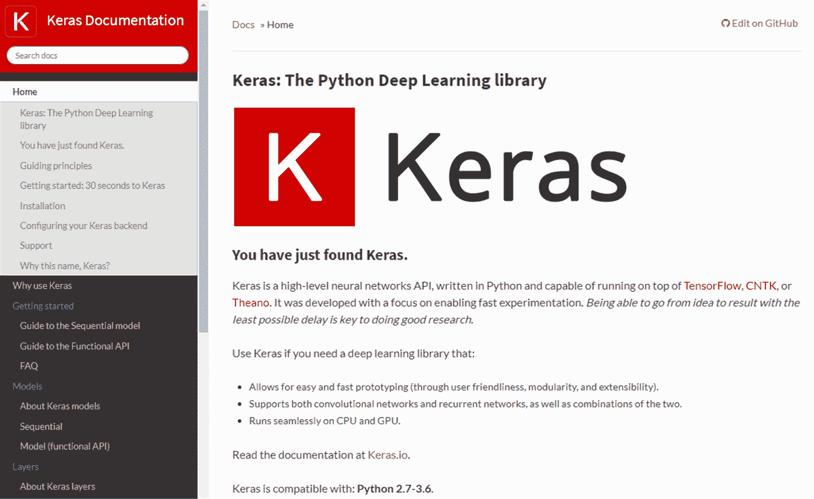
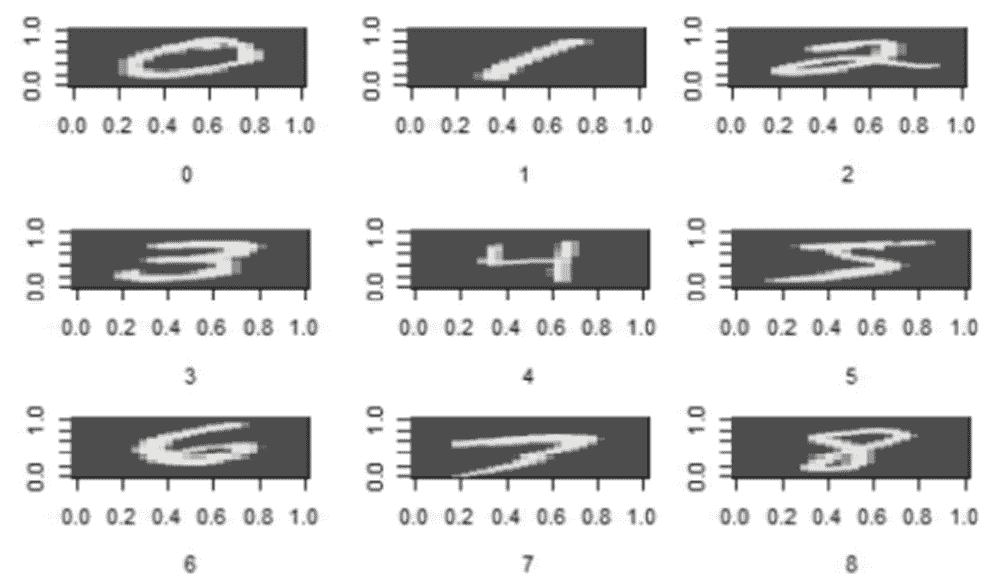
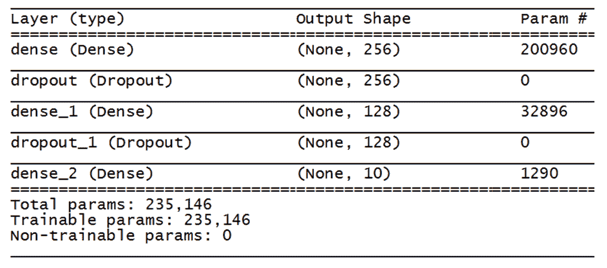
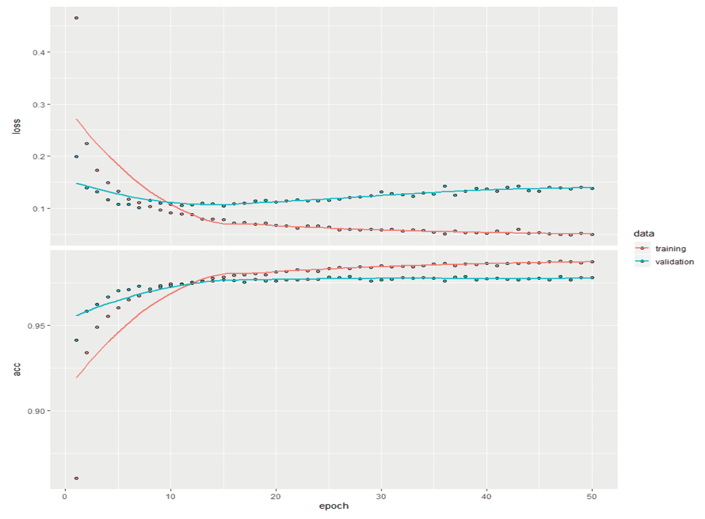
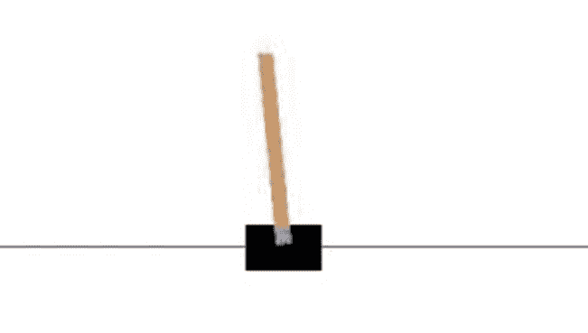
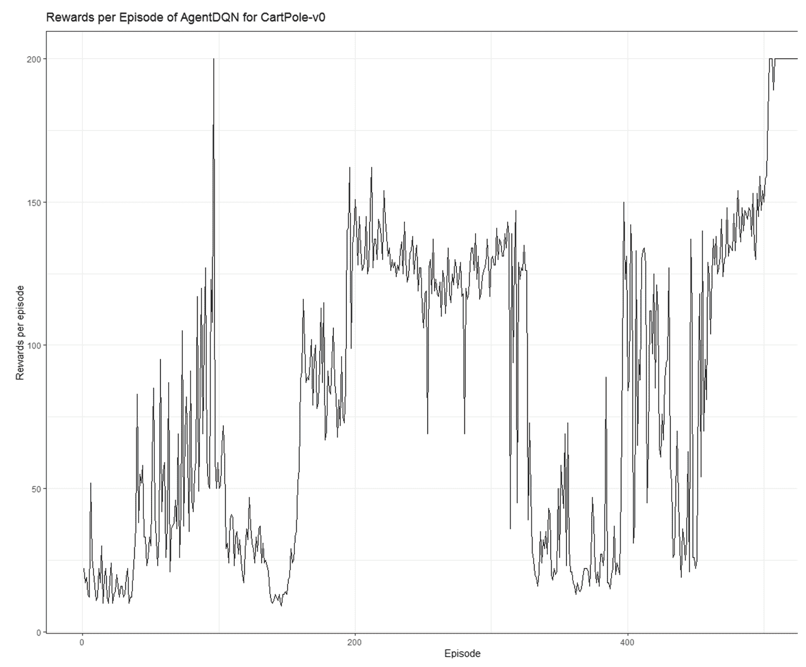

# 使用 Keras 进行深度 Q 学习

Keras 是一个高级神经网络库，使用 Python 编写，并能够与不同的支持库配合使用。它的开发旨在允许快速实验。Keras 通过完全模块化、极简主义和可扩展性，提供了简单且快速的原型设计功能。它支持卷积网络和递归网络，以及两者的组合。此外，它支持任意连接方案，并能在 CPU 和 GPU 上平稳运行。在本章中，我们将学习如何使用 Keras 处理强化学习。我们将学习如何使用 Keras 开发一个能够识别手写数字的模型。随后，我们将使用深度 Q 学习来平衡小车摆杆系统。

在本章中，我们将涵盖以下主题：

+   Keras 介绍

+   图像处理中的多层感知机

+   深度 Q 学习方法

在本章结束时，我们将探索使用 TensorFlow 作为后端引擎的 Keras 模型，并学习如何使用 Keras 设置**多层感知机**（**MLP**）模型。接着，我们将学习如何使用深度强化学习来平衡小车摆杆系统。

# 技术要求

查看以下视频，观看代码运行实例：

[`bit.ly/2qMtw3I`](http://bit.ly/2qMtw3I)

# Keras 介绍

Keras 是一个 Python 库，提供了一种简单、清晰的方式来创建各种深度学习模型。Keras 的代码在 MIT 许可下发布。Keras 的结构基于简洁和简约原则，提供了一种没有多余功能的编程模型，最大限度地提高了可读性。它允许神经网络以非常模块化的方式表达，将模型视为一系列组件或单一图形。这是一个很好的近似，因为深度学习模型的组件是可以任意组合的离散元素。新的组件可以在为工程师设计的框架内轻松集成和修改，以快速测试和探索新想法。最后，使用 Python 编程语言提供的构造允许在小规模和大规模上进行清晰编程。

在下方截图中，我们可以看到 Keras 的官方网站首页（[`keras.io/`](https://keras.io/)）：



Keras 的易用性是其强大优势之一。在设计阶段，开发者一直将用户需求作为重点，创造出了通过简单一致的 API 来减少用户工作量的产品。这样，解决常见用例所需的操作数量被大大减少。此外，结果返回清晰，便于迅速识别潜在错误。

在 Keras 中，一个模型由一系列自主且完全可配置的模块组成，这些模块可以与最低限度的约束条件相关联。Keras 中的一切都是模块——神经网络层、代价函数、优化器、初始化方案、激活函数和正则化方案。这些独立的模块可以组合在一起，创建新的、更复杂的模型。

Keras 中可用的所有模块都很容易添加，就像在编程语言中添加新的类和函数一样。此外，这些模块已经可用，并且附带了大量解释其实际应用的示例。但 Keras 并不限于内置模块的可用性。用户可以轻松创建新的模块，使得 Keras 成为一个易于扩展的环境。

`keras` 库基于用于管理输入和输出的层技术。在 Keras 中，应用可以通过以下四个简单步骤实现：

1.  准备输入和输出数据。

1.  创建第一个层以管理输入数据。

1.  设置中间层以进行分析。

1.  创建输出层以管理目标。

Keras 作为一个特定的高层 API 用于神经网络。它可以充当用户界面，并且可以扩展它所运行的其他深度学习框架后端的功能。正因为这个特点，Keras 成为了框架之间迁移的封装器。不仅可以交换深度学习神经网络的算法和模型，还可以交换网络和预训练权重。

封装库由一层薄代码组成，负责将库的现有接口转换为兼容的接口。

另一方面，由于 Keras 是自主的，它可以在不与其运行的后端框架交互的情况下使用。Keras 有自己的图数据结构用于定义计算图；它并不依赖于底层后端框架的数据结构。这样，你就不必学习如何编程后端框架。

Keras 易于学习和使用。使用 Keras 就像玩 LEGO® 积木一样；你只需要将一系列兼容的模块按顺序排列即可。它的设计目的是让人们能够通过一个高度模块化和可扩展的框架，快速进行模型的实验阶段。Keras 主要集中在定义神经网络的层。你不需要处理张量，但可以用更少的代码轻松编写。

后端负责复杂的数学运算，在下一节中，我们将看到 TensorFlow 后端的工作原理。

# TensorFlow 中的 Keras 后端

Keras 是一个模型级库，提供用于深度学习模型开发的高级模块。Keras 开发者专注于创建高级模型，而忽略了低级操作，如张量乘积和卷积。这些操作已被交给专门的、经过优化的张量操作库来处理，因此它们充当了 Keras 的后端引擎。多个后端引擎可以完美地连接到 Keras。实际上，Keras 提供了三个可用的后端实现——TensorFlow、Theano 和微软 **认知工具包**（**CNTK**）。

TensorFlow 是一个基于图模型（数据流图）的开源软件库，用于数值计算。图被定义为在张量上操作的数学运算的抽象管道，并被称为多维数组。每个图由节点和弧线组成，其中节点是数据上的操作，弧线表示通过各种操作传递的张量。

你可以在以下链接找到该库的最新版本和所有提供的文档：[`www.tensorflow.org`](http://www.tensorflow.org)。

TensorFlow 是机器学习和神经网络领域最常用的库。它有许多 API，包括最低级别的 TensorFlow Core，允许完全控制编程。这些 API 通常用于机器学习领域，因为它们使得可以详细检查实现中的所有模型元素。最高级别的 API 是基于 TensorFlow Core 构建的。在某些情况下，它们可以使某些操作，如重复性和预定义任务，更加快速和简单，但通常无法深入细节，且在神经网络的实现中，往往需要更精确地控制操作。然而，它们在标准机器学习模型的开发中仍然非常有用。

那么，让我们来看一下如何利用 `keras` 库在 R 环境中提供的潜力。

# 在 R 中使用 Keras

正如我们在 *Keras 简介* 部分中预见到的那样，Keras 是用 Python 编写的，因此它是操作的自然开发环境。尽管如此，和许多库一样，已经构建了一个接口，使我们能够利用 Keras 在 R 环境中进行操作。这是因为 `keras` 库技术的极大简易性，它使得基于机器学习的算法实现变得简单而直观。

要在 R 中使用 Keras，我们可以使用以下网址提供的接口：[`keras.rstudio.com/index.html`](https://keras.rstudio.com/index.html)。

在下面的截图中，我们可以看到 R 接口到 Keras 的官方网站首页：


将能够检索安装界面所需的所有信息，并开始使用它。在接下来的部分中，我们将看到如何使用 Keras 识别手写数字，确认使用`keras`库的简易操作性。

# 用于图像处理的多层感知器

正如我们在第十一章中看到的*探索深度强化学习方法*，MLP 是一个前馈人工神经网络。最简单的变体是单层变体，它由一个输出节点层组成，而输入则通过一系列权重直接提供给单元。MLP 是一种网络类型，其前馈连接至少包括三个相互连接的层——输入层、隐藏层和输出层。

对于除输入层外的每个节点，都使用非线性激活函数。事实上，如果 MLP 网络具有线性激活函数，将每个神经元的加权输入映射到输出，即使有多个层，也被认为是一个两级输入/输出模型。在训练阶段，通过处理模型中包含的数据来修改连接的权重。更新基于输出中存在的错误量与预期结果的比较。

误差函数是属于权重空间的函数，用于衡量网络在解决问题时的可靠性。学习算法的任务是最小化此函数，因此要找到权重空间中使函数达到全局最小点的点，或者在某些情况下，局部最小点可能就足够了。

为了验证 Keras 在图像处理中的潜力，我们将处理手写数字识别的实际案例。为此，我们将使用开发者社区广泛使用的数据集——MNIST 数据集。

# MNIST 数据集

**美国国家标准与技术研究院改进版**（**MNIST**）数据集是一个大型手写数字数据库。它包含 70,000 个数据示例。它是 NIST 更大数据集的子集。这些数字的分辨率为 28x28 像素，并存储在一个 70,000 行和 785 列的矩阵中；784 列形成每个 28x28 矩阵的像素值，其中一个值是实际数字。这些数字已经进行了尺寸标准化和中心化处理，存储在固定大小图像中。

MNIST 数据集中的数字图像最初由 Chris Burges 和 Corinna Cortes 选择并进行了边界框归一化和居中处理的实验。Yann LeCun 的版本使用了较大窗口中心质量的中心化方法。数据可在 Yann LeCun 的网站上获取：[`yann.lecun.com/exdb/mnist/`](http://yann.lecun.com/exdb/mnist/)。

下图展示了 MNIST 数据集中 0-8 的图像样本：



该数据集已经包含在 `keras` 库中，包含 60,000 张 28x28 的灰度图像（用于训练）以及 10,000 张图像的测试集，数字范围为 10。

首先，我们通过适当地准备数据来进行预处理，以便在接下来的 Keras 模型中使用。

# 数据预处理

在这一部分，我们将分析 MNIST 数据集的特征，并学习如何将数据准备为 Keras 可兼容的格式：

1.  让我们开始导入 `keras` 库：

```py
library(keras)
```

1.  要导入 `mnist` 数据集，我们可以使用以下命令：

```py
MnistData <- dataset_mnist()
```

1.  让我们看看数据集里包含了什么：

```py
str(MnistData)
```

以下是返回的结果：

```py
List of 2
 $ train:List of 2
 ..$ x: int [1:60000, 1:28, 1:28] 0 0 0 0 0 0 0 0 0 0 ...
 ..$ y: int [1:60000(1d)] 5 0 4 1 9 2 1 3 1 4 ...
 $ test :List of 2
 ..$ x: int [1:10000, 1:28, 1:28] 0 0 0 0 0 0 0 0 0 0 ...
 ..$ y: int [1:10000(1d)] 7 2 1 0 4 1 4 9 5 9 ...
```

现在我们可以看到，数据集包含了 60,000 个训练样本和 10,000 个测试样本。每个观察值代表一个 28x28 像素的 (*x*) 图像，并为每个观察值提供了相应的标签 (*y*)。

1.  现在，我们将提取四个列表，并将它们放入四个变量中，这些变量代表我们要处理的模型的输入和输出数据：

```py
Xtrain <- MnistData$train$x
Ytrain <- MnistData$train$y
Xtest <- MnistData$test$x
Ytest <- MnistData$test$y
```

在*MNIST 数据集*部分，我们之前提到过该数据集包含 10 个数字。

1.  让我们验证一下；我们还将分析数据集中这些数字的分布情况：

```py
table(Ytrain)
table(Ytest)
```

以下是返回的结果：

```py
Ytrain
 0    1    2    3    4    5    6    7    8    9
5923 6742 5958 6131 5842 5421 5918 6265 5851 5949
Ytest
 0    1    2    3    4    5    6    7    8    9
 980 1135 1032 1010  982  892  958 1028  974 1009
```

1.  实际上，我们有 10 个数字——从 0 到 9。此外，我们可以验证每个数字的频率是相似的。为此，我们可以绘制一个直方图：

```py
hist(Ytrain)
hist(Ytest)
```

以下图显示了两个分布的直方图并排展示（**YTrain** 在左侧，**YTest** 在右侧）：


通过分析之前的图，我们可以看到这两个数据集中 10 个数字的出现频率是均匀分布的。正如我们所说，每个样本图像由一个 28x28 的矩阵组成。

1.  为了确认这一点，我们将提取这两个输入向量的维度：

```py
dim(Xtrain)
dim(Xtest)
```

以下是返回的形状：

```py
> dim(Xtrain)
[1] 60000    28    28
> dim(Xtest)
[1] 10000    28    28
```

因此，每个观察值包含与 28x28 像素的灰度值相关的数据。

1.  为了降低维度，我们将 28x28 的图像展平为大小为 `784` 的向量：

```py
Xtrain <- array_reshape(Xtrain, c(nrow(Xtrain), 784))
Xtest <- array_reshape(Xtest, c(nrow(Xtest), 784))
```

`array_reshape()` 函数重新塑形一个多维数组，默认情况下使用行主序（C 风格）重新塑形语义。此函数为数组赋予新形状，而不改变其数据。新形状应与原始形状兼容。新形状的第一维是观察值的数量，第二维表示起始数据的最后两个维度的乘积（*28 x 28 = 784*）。

1.  为了更好地理解这一转化，我们打印出转化后数据集的形状：

```py
dim(Xtrain)
dim(Xtest)
```

以下是打印的结果：

```py
> dim(Xtrain)
[1] 60000   784
> dim(Xtest)
[1] 10000   784
```

现在，我们必须将所有值归一化到 0 和 1 之间。MNIST 图像以像素格式存储，其中每个像素（共 28x28）作为一个 8 位整数存储，数值范围从 0 到 255。通常，0 被认为是黑色，255 被认为是白色。

1.  其中的值构成了不同的灰度。现在，为了将所有值标准化到 0 和 1 之间，只需将每个值除以 255。因此，包含值 255 的像素将变为 1，而包含值 0 的像素保持不变；介于两者之间的是所有其他值：

```py
Xtrain <- Xtrain / 255
Xtest <- Xtest / 255
```

在准备好输入数据之后，需要重新排列输出数据。我们之前说过，输出数据表示图像的标签。我们已经看到每个图像都标注了一个从 0 到 9 的数字。为了在 Keras 模型中使用这些值，必须对它们进行修改。

1.  定量化每个类别的定性预测变量的方法涉及创建一个二进制变量，0-1（称为虚拟变量），该变量表示每个统计单元中属性的存在与否。我们来看看如何操作：

```py
Ytrain <- to_categorical(Ytrain, 10)
Ytest <- to_categorical(Ytest, 10)
```

`to_categorical()` 函数接受一个类标签的向量或 1 列矩阵，并将其转换为一个有 *p* 列的矩阵，每一列代表一个类别。这是神经网络拟合和预测中最常用的格式。虚拟变量可以取两个值：

+   0：如果属性不存在

+   1：如果属性存在

现在，每个观测将是一个包含 10 个值的行，除了标识包含 1 的数字的列外，其余列均为零。

在准备好数据之后，是时候使用这些数据训练 Keras 模型了。

# Keras MLP 模型

在适当预处理数据之后，我们可以定义 Keras 模型的架构。Keras 是基于面向对象的编程方法构建的。因此，创建模型非常简单：选择基本架构，然后添加必要的层以构建所需的模型。如前所述，顺序模型允许你逐层创建模型，作为层的线性堆叠。然而，顺序模型不能创建共享层或具有多个输入或输出的模型。顺序模型是通过将一系列层实例传递给构造函数来创建的：

1.  首先，我们从 `keras_model_sequential` 类实例化一个对象：

```py
KerasMLPModel <- keras_model_sequential()
```

所有关于网络的信息，如权重、层和操作，都将存储在这个对象中。

1.  在实例化对象之后，我们将继续添加层：

```py
KerasMLPModel %>%
  layer_dense(units = 256, activation = 'relu', input_shape = c(784)) %>%
```

`layer_dense()` 函数将一个密集连接的神经网络层添加到输出中。在一个密集连接的层中，每个输入都通过一个权重与每个输出相连，通常后面跟着一个非线性激活函数。第一个参数包含输出空间的维度（units = 256）。第二个参数包含激活函数（`activation = 'relu'`）。**修正线性单元**（**ReLU**）是自 2015 年以来最常用的激活函数。它是一个简单的条件，并且相对于其他函数具有优势。

1.  最后，第三个参数包含输入形状（`input_shape = c(784)`）。请记住，传递给顺序模型的第一层应该有一个已定义的输入形状。接下来我们添加第二层：

```py
layer_dropout(rate = 0.45) %>%
```

dropout 层对输入进行 dropout。dropout 在训练期间通过随机将一定比例的输入单元设为 0 来帮助防止过拟合。只传入一个参数，即比例，它是一个介于 0 和 1 之间的浮动数值，表示丢弃单元的比例。

1.  然后，添加第二个全连接层：

```py
layer_dense(units = 128, activation = 'relu') %>%
```

在这种情况下，输入不存在，输出节点的数量逐渐调整，并且激活函数始终为`relu`。

1.  让我们再加一个 dropout 层：

```py
layer_dropout(rate = 0.3) %>%
```

1.  让我们结束时加上最后一个全连接层：

```py
layer_dense(units = 10, activation = 'softmax')
```

在前面的代码块中，输出单元为 10，因为系统必须分类 10 个数字。softmax 函数是一种更通用的逻辑激活函数，通常用于多类别分类。

现在，我们将分析我们所定义的 Keras 模型的整体架构。在 Keras 中，若要总结模型，可以使用`summary()`函数。该总结以文本格式返回，并包括以下信息：

+   模型中的层及其顺序

+   每一层的输出形状

+   每一层的参数数量（权重）

+   模型中的总参数数量（权重）

要打印模型的总结，我们只需键入以下命令：

```py
summary(KerasMLPModel)
```

以下截图展示了定义的 Keras 模型架构：



在上一张截图中，我们可以清晰地看到每一层的输出形状和权重数量。

1.  在训练模型之前，您需要配置学习过程，这可以通过`compile()`方法来完成，如下所示：

```py
KerasMLPModel %>% compile(
  loss = 'categorical_crossentropy',
  optimizer = optimizer_rmsprop(),
  metrics = c('accuracy')
)
```

`compile()`方法配置 Keras 模型以进行训练。传入三个参数，如下所示：

+   `loss`：传入`categorical_crossentropy`损失函数。使用`categorical_crossentropy`时，您的目标应该是分类格式。我们有 10 个类别；每个样本的目标必须是一个 10 维的向量，除非对应类别的索引位置为 1，其余位置都为 0。

+   `optimizer`：传入`optimizer_rmsprop`。该优化器通过平方梯度的指数衰减平均值来调整学习率。

+   `metrics`：传入准确率度量。度量是用来评估模型在训练和测试过程中的表现的函数。

现在，我们可以进入训练阶段。首先，您需要设置一些参数：

```py
BatchSize <- 128
NumEpochs <- 50
```

`BatchSize`是每次梯度更新的样本数量。`NumEpochs`是训练模型的轮次。一个轮次是对提供的整个输入和输出数据的一次迭代。

1.  要训练模型，可以使用`fit()`方法，如下所示：

```py
ModelHistory <- KerasMLPModel %>% fit(
  Xtrain, Ytrain,
  batch_size = BatchSize,
  epochs = NumEpochs,
  verbose = 1,
  validation_split = 0.3
)
```

传入以下参数：

+   `Xtrain`：这是输入训练数据的数组。

+   `Ytrain`：这是目标（标签）数据的数组。

+   `epochs`：这是训练模型的轮次。一个轮次是对提供的整个*x*和*y*数据的一次迭代。

+   `batch_size`：这是每次梯度更新的样本数量。

+   `verbose`：这是一个整数值，值可以是 0、1 或 2。详细程度模式为：0 = 静默，1 = 进度条，2 = 每个周期一行。

+   `validation_split`：这是一个介于 0 和 1 之间的浮动值，表示将用于验证的数据占训练数据的比例。

当使用`fit()`函数时，训练周期结束时会显示损失和准确度，如下截图所示：


1.  为了了解损失函数和准确度在训练周期中的变化情况，可以通过如下方式绘制损失和准确度图表，展示训练和验证阶段的表现：

```py
plot(ModelHistory)
```

绘制出以下图表：



我们可以看到模型在两个子集上的演化，随着损失和准确度的变化。

1.  为了评估我们刚刚调整的模型的表现，我们使用`evaluate()`函数，如下所示：

```py
ScoreValues <- KerasMLPModel %>% evaluate(
  Xtrain, Ytrain,
  verbose = 0
)
```

1.  该函数返回模型在测试模式下的损失值和度量值。计算是分批进行的。让我们打印出损失和准确度：

```py
cat('Loss :', ScoreValues[[1]], '\n')
cat('Accuracy:', ScoreValues[[2]], '\n')
```

打印出以下结果：

```py
Loss: 0.04588709
Accuracy: 0.99245
```

获得的准确度证明了深度神经网络能够对手写数字进行分类。

在接下来的部分，我们将看到如何使用深度 Q 学习来平衡一个推车。

# 接近深度 Q 学习

在第十一章，*探索深度强化学习方法*中，我们看到深度 Q 学习采用神经网络作为值函数的近似。这些方法是基本 Q 学习方法的演变，因为动作-状态表被神经网络所替代，以逼近最优值函数。深度 Q 学习只需要环境的状态作为输入，并提供所有状态-动作值，因为在环境中可以执行的动作是已知的。因此，在这个算法中，学习的过程并不是更新表格，而是调整构成网络的神经元的权重。这一更新过程通过反向传播技术完成。

首先，让我们看看如何安装我们将用作深度 Q 学习初步方法的库。

# R 中的深度 Q 学习

为了在 R 中实现 DQN，我们将使用`rlR`库。要使用此库，必须在我们的计算机上安装 Keras，并将 TensorFlow 作为后端。此外，为了运行我们将要提出的示例，还需要安装 OpenAI Gym 库：

1.  首先，我们提供安装`rlXR`库的方法。该库可以在 GitHub 上找到，网址为：[`github.com/smilesun/rlR`](https://github.com/smilesun/rlR)。

1.  要安装一个在 GitHub 上提供的 R 包，我们可以使用`install_github()`函数，该函数来自`devtools`包。

1.  然后，我们首先需要安装`devtools`包：

```py
install.packages("devtools")
```

`devtools`包包含了多个用于开发 R 包的函数。通过使用这个库，许多常见任务变得更加简单。

1.  在此时，我们可以使用`devtools`中包含的`install_github()`函数，方法如下：

```py
devtools::install_github("smilesun/rlR")
```

此命令将首先从 GitHub 网站下载包并安装。函数参数包含一个文本字符串，调用了作者和包名。

1.  现在，我们可以加载库：

```py
library(rlR)
```

作为该方法应用的示例，我们将使用一个已经在第八章中介绍的 OpenAI 库环境，*游戏应用中的强化学习*。我指的是`CartPole-v0`环境，这是一个经典的强化学习问题。

系统由一个杆子（像倒立摆一样）和通过关节连接的小车组成，如下图所示：



系统通过向小车施加+1 或-1 的力来控制。小车上施加的力量可以控制，目标是将杆子向上摆动并保持稳定。必须在小车不掉到地面的情况下完成这一过程。平衡过程包括以下动作：智能体将杆子向右或向左移动。每当杆子保持平衡时，返回一个奖励值 1。如果杆子偏离垂直位置超过 15 度，过程结束。为了平衡杆子并解决问题，需要施加与杆子倾斜方向相反的推力：

1.  要使用 OpenAI Gym 库加载`CartPole`环境，只需输入以下代码：

```py
CPEnv = makeGymEnv("CartPole-v0")
```

1.  我们检查有哪些牌号是可用的：

```py
CPEnv
```

返回以下信息：

```py
action cnt: 2
state original dim: 4
discrete action
```

有两个动作（`action cnt: 2`）；这与前述内容一致。系统通过向小车施加+1 或-1 的力来控制。这是两个可用的动作。第二个信息，`state original dim: 4`，告诉我们系统的状态由四个信息组成，具体如下：

+   小车位置

+   小车速度

+   杆子角度

+   杆尖的速度

最后，第三个信息，`discrete action`，告诉我们动作空间是由离散选择定义的。这使得 DQN 成为处理此类问题的最佳解决方案。

我们初始化的环境包含多个方法。例如，我们可以使用`step()`方法，它执行一个动作并返回环境的状态：

```py
CPEnv$step(1)
```

返回以下结果：

```py
$state
[1] -0.02800090 -0.17157109 -0.01648416  0.27999059
$reward
[1] 1
$done
[1] FALSE
$info
named list()
```

返回的值具有以下含义：

+   `$state`：这是一个环境特定的对象，表示你对环境的观察。

+   `$reward`：这是前一个动作所获得的奖励值。奖励的规模因环境而异，但目标始终是增加你的总奖励。

+   `$done`：这表示是否需要重置环境。大多数（但不是所有）任务被划分为明确的阶段，当`done`为`True`时，表示该阶段已经结束。

+   `$info`：这是用于调试的诊断信息，有时也对学习很有帮助。

到此为止，我们可以基于深度 Q 学习进一步构建模型：

1.  让我们初始化智能体：

```py
CPAgent = initAgent("AgentDQN", CPEnv)
```

1.  让我们分析一下我们实例化的对象包含了什么：

```py
str(CPAgent)
```

我们获得了大量的信息，这里我们仅突出显示了其中的一部分：

```py
Classes 'AgentDQN', 'AgentArmed', 'Agent', 'R6' <AgentDQN>
 act_cnt: 2
 afterEpisode: function ()
 afterStep: function ()
 env: EnvGym, Environment, R6 epochs: 1
 gamma: 0.99 lr_decay: 0.999000499833375
 mem: ReplayMemUniform, ReplayMem, R6
 policy: PolicyEpsilonGreedy, Policy, R6
 replay: function (batchsize)
 sess: tensorflow.python.client.session.Session, tensorflow.python.client.session.BaseSession, tensorflow.python.client.session.SessionInterface, python.builtin.object
 state_dim: 4
 stopLearn: function ()
```

1.  通过详细分析这些信息，我们可以得到此智能体可用的功能。在实例化智能体后，是时候开始训练它了：

```py
CPAgent$learn(500L)
```

1.  下一步是训练智能体进行 500 轮。每轮结束时，以下信息将被打印出来：

```py
Episode: 472 finished with steps:200, rewards:200.000000 global step 44519 
Last 100 episodes average reward 131.702970 
Epsilon0.010000 
rand steps:2 
replaymem size GB:0.0388956144452095 
learning rate: 0.000589783361647278 
```

1.  最后，我们可以打印出一张图表，展示奖励在各轮之间的变化：

```py
CPAgent$plotPerf(F)
```

以下图表将被打印出来：



我们可以看到，随着智能体的学习，从系统中获得的奖励逐渐增加，这意味着智能体正在执行最佳策略，以实现期望的结果。

# 总结

在这一章中，我们学习了如何使用 Keras 解决深度强化学习问题。首先，我们探讨了`keras`库并分析了 TensorFlow 后端。接着，我们使用 Keras 通过多层神经网络识别手写数字。通过这种方式，我们理解了 Keras 模型的结构，并通过一个实际的例子来学习。最后，我们使用`rlR`库，在 OpenAI Gym 库的 CartPole 环境中应用深度强化学习。

在下一章中，我们将总结本书到目前为止的内容，并讨论从此时起的下一步。我们将探讨在构建和实现机器学习模型过程中面临的实际挑战，以及其他资源和技术，帮助我们学习如何提升机器学习能力。
