# 人工神经网络和 TensorFlow 简介

本章将介绍**人工神经网络**（**ANNs**），这些基本上是受到生物大脑启发的计算模型，以及感知器，它们是 ANNs 的构建块。我们还将讨论在构建深度神经网络模型时需要考虑的所有元素。接着，我们将介绍 TensorFlow，这是我们将用于创建这些深度神经网络模型的库。最后，我们将讨论使用该库的核心概念，如变量、占位符、会话、图和其他在使用该库时至关重要的概念。

接下来我们将覆盖以下主题：

+   人工神经网络简介

+   深度神经网络的元素

+   TensorFlow 的安装和简介

+   TensorFlow 的核心概念

# 人工神经网络简介

人工神经网络（ANNs）是生物学启发的计算模型，可用于通过数据训练计算机执行任务。这些模型属于机器学习模型的广泛范畴。与其他模型的区别在于，这些模型基于一组名为**人工神经元**的连接单元。

人工神经网络有许多类型，在本书中，我们将使用一种特定类型，称为**多层感知器**（**MLP**）。请注意，人工神经网络有更多的变种。这些是机器学习模型，我们可以用它们进行分类和回归任务，但我们实际上可以扩展这些模型，将其应用于其他非常具体的任务，如计算机视觉、语音识别和机器翻译。这些模型是深度学习这一激动人心且不断发展的领域的基础，近年来在许多领域取得了巨大的成功。

# 感知器

感知器是最简单的人工神经元类型，是作为二分类的简单模型发明的。我们使用本书中使用的数据集，即信用卡数据集。假设我们只有两个特征来分类违约者和非违约者：年龄和账单金额。那么感知器的思路是创建某种得分。为此，你将一个常数`w1`与`age`的值相乘，然后再加上另一个常数`w2`，它与`bill`金额的值相乘，如下所示：

```py
 score = w1age+w2bill
```

作为规则，如果`score` > `b`，我们将此人分类为违约者。

因此，从这个简单的操作中，我们创建了一个得分。接着，我们根据规则将人们分类为违约者或非违约者。所以，如果这个`score`大于某个数值，那么我们就将此人归类为违约者。

以下截图显示了一种等效的规则表述方式：


所以，这个模型的预测结果将是 `1`，即违约者，如果该数量大于 `0`，预测将是 `0`，即非违约者，如果该数量小于或等于 `0`。`b` 值也称为阈值或偏置。

一般来说，如果我们有 *n* 个特征，那么我们的感知器看起来会类似于下面的截图：

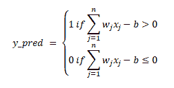

如你所见，我们有相同的形式。如果所有特征的权重与特征值的乘积和 **-b** 实际上大于 **0**，那么我们预测 **1**，否则我们预测 **0**。假设所有特征都在相同的尺度上，那么权重将表示每个特征在做出决策时的重要性。因此，我们知道，在这个特定问题中，所有特征的尺度是非常不同的。例如，年龄的尺度与账单金额的尺度不同，但假设你将所有特征设置为相似的尺度。你可以将 **w** 变量视为权重，它们是做出决策时每个特征最重要的部分。

以下截图展示了另一种可视化感知器的方法：

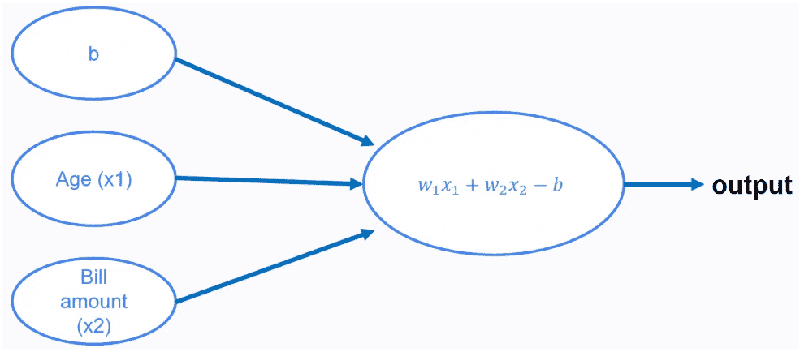

所以，你有阈值或偏置 **b** 的值，以及 **Age**（年龄）、**x1** 和 **Bill amount**（账单金额）、**x2** 的值。然后这三个值会进入一个操作，得出输出。现在，我们可以对感知器做一点修改，那就是添加一个被称为 **激活函数** 的东西。激活函数是任何一个函数，它接受操作结果，并通过 **f** 函数对输入值进行某些变换。因此，激活函数的输入是操作的结果量，经过激活函数 **f** 后，我们将得到以下输出：

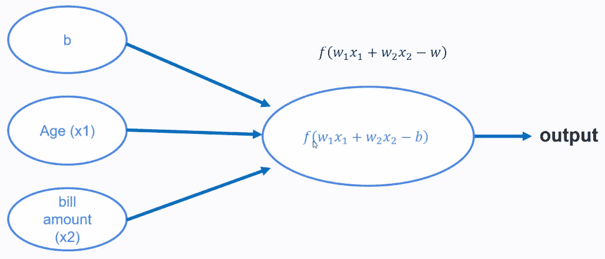

这是感知器。我们可以向感知器添加一个激活函数，然后我们得到规则或分类 `1` 或 `0`。

现在，也许你在想我们如何决定感知器的最佳权重和阈值？我们可以使用什么激活函数？这些问题的答案由感知器学习算法提供。所以，我们有一个学习算法，可以用来实际训练感知器。感知器的好处是它们非常容易理解。然而，与我们在之前章节中使用的更复杂的方法相比，它们的性能非常弱。因此，实际上没有必要学习这个感知器学习算法。然而，这些非常简单的模型是人工神经网络（ANNs）的构建块。

# 多层感知器

人工神经网络（ANN）是基于感知器或其他类似基本构建块的模型，本书中我们将学习的就是基于感知器的模型。最流行的人工神经网络模型之一是多层感知器（MLP），我们将在本书中使用它。使用感知器作为 ANN 的一部分的动机是，为什么不使用多个感知器，而不是仅仅使用一个感知器进行分类呢？请看以下截图：

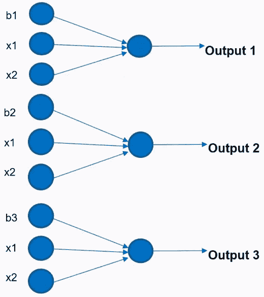

在这里，我们有三个感知器，并注意到每个感知器都有不同的偏置项。但我们的特征值在所有情况下都是相同的。如果我们使用三个感知器，我们将得到三个输出值，但我们知道这是一个二分类问题，因此我们只需要一个输出。现在我们有了三个输出值，可以将它们结合起来，或者将这些输出值视为另一个感知器的输入。请看以下截图：

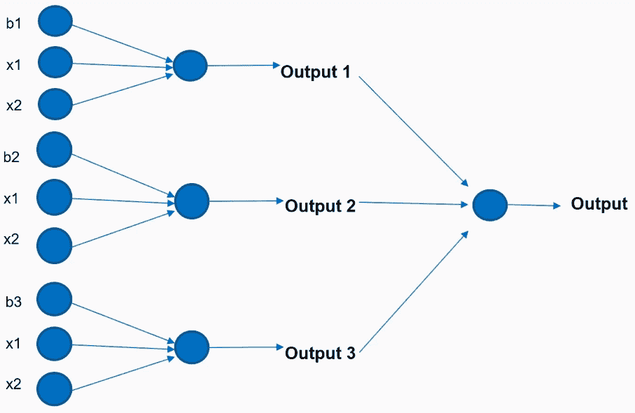

如下图所示，我们可以将前面感知器的输出值作为输入值提供给另一个感知器，后者将输出结果。因此，这就是构建神经网络或多层感知器（MLP）的直观理解，下面是一个人工神经网络（ANN）的示例：

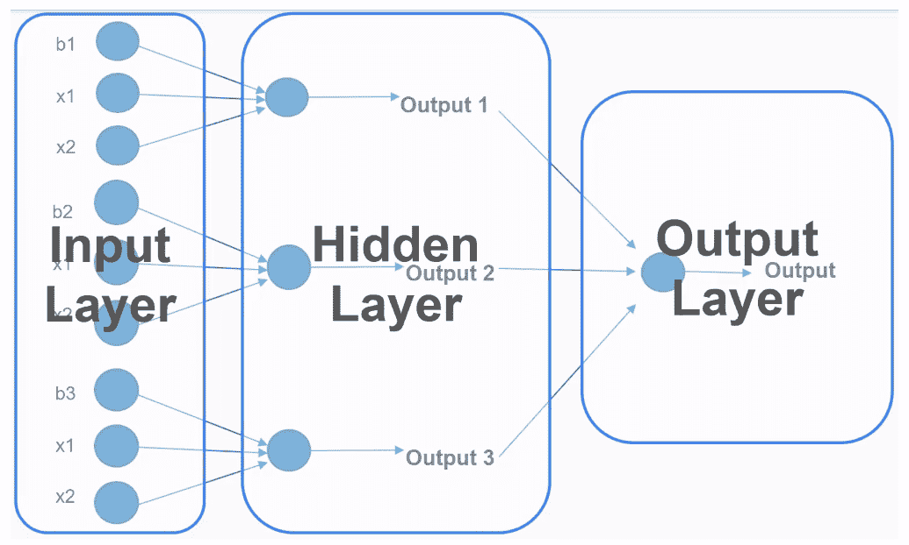

在前面的截图中，我们展示了一个多层感知器（MLP）的三层结构：

+   **输入层**：在此层中，您将拥有原始数据或用于训练此模型的训练数据

+   **隐藏层**：该中间层是前一个感知器的输出，作为下一个感知器的输入

+   **输出层**：在此层中，您将得到从网络获得的输出

以下截图是另一种可视化相同人工神经网络（ANN）的方法：

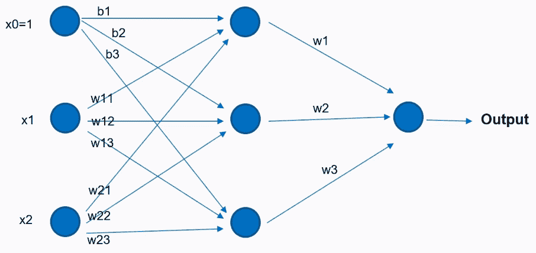

这是一种更紧凑的可视化方式，但它实际上是相同的网络。所以，除了使用三个偏置项外，我们为每个观察值添加了一个常数特征**1**。该值**1**会与不同的偏置相乘，并作为输入提供给隐藏层的神经元。**x1**的值会与某些权重相乘，并作为下一个神经元的输入，**x2**的值也是如此。然后，隐藏层神经元的结果将作为最后一个感知器的输入，得出整体输出。

# 深度神经网络模型的元素

**深度神经网络（DNN）**的动机是类似的，这里问的是，如果我们使用多个隐藏层，而不是一个隐藏层，会怎样？在这种情况下，我们的模型将看起来类似于以下结构：

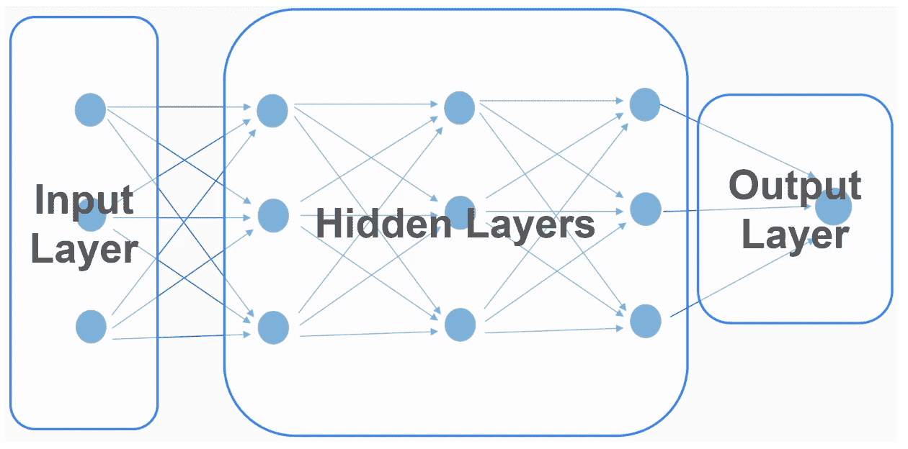

在这里，我们有相同的输入层。然而，在这种情况下，我们将有许多隐藏层，而输出层保持不变。这里的关键是网络的隐藏部分，即隐藏层；我们不再只有一个隐藏层，而是有许多隐藏层，这被称为**DNN**。

# 深度学习

深度学习是一类基于神经网络的机器学习模型及其相关技术，用于使用数据训练此类模型。深度学习模型有很多种。它们是一类具有以下特点的机器学习算法：

+   这些模型使用许多非线性处理单元的多层结构，可以进行抽象特征提取和转换。

+   这些模型使用某种形式的梯度下降，通过反向传播进行训练。

+   这些模型通常需要大量数据和大量计算能力才能表现得非常好。

+   这些模型现在被认为是许多应用（如计算机视觉、语音识别和游戏）中的最先进技术。

# MLP 模型的元素

在构建深度学习模型时，有许多需要考虑的因素，特别是在多层感知机中。你必须考虑架构、激活函数、优化算法、`loss`函数、权重初始化策略、正则化策略和训练策略。我们将在以下列表中进一步讨论它们：

+   **架构**：在构建深度学习模型时，第一个需要考虑的元素是你的 MLP 架构。当我们说架构时，我们指的是层数和每层的神经元数量。输入层的神经元数量由数据集中你所拥有的特征数量决定。输出值的数量也是如此。所以，它们基本上由你的问题在分类设置中来决定。输出值的数量通常是你分类问题中的类别数，在回归问题中，输出层只会有一个输出。你需要做出的选择是使用多少隐藏层以及每个隐藏层的神经元数量。没有简单的规则来设置这些数字；在实践中，我们通常先使用几个层。如果几个层不起作用，也许我们会增加更多的层，而每层的神经元数量通常是在输入值数量和输出数量之间的一个数字，`[n_inputs, n_outputs]`。

这只是一个经验法则。然而，还有一些更正式的方法可以选择隐藏层的数量和神经元的数量，研究人员也在不断努力提出更好的方法来选择这些值。

+   **激活函数**：激活函数是每个隐藏层神经元中使用的函数。有很多选择；**sigmoid** 是这些模型最早使用的函数，但后来研究人员发现使用这个函数存在很多问题，因此他们提出了其他激活函数，如**修正线性单元**（**ReLU**）、**双曲正切**、**漏泄 ReLU**，以及一些其他选择，我们将在接下来的示例中使用这些函数。

+   **优化算法**：这是用于学习网络权重的算法。每个你选择的算法都有不同的超参数，需要由你，作为建模者来选择。训练这些网络的最基本算法是**梯度下降**。然而，梯度下降可能较慢，并且存在一些问题，因此研究人员提出了其他算法，如**动量优化器**、**AdaGrad**、**RMSProp** 和 **Adam** 动量算法。在 TensorFlow 中，我们有很多算法可以选择，包括 Adam 动量算法，实际上我们将在示例中使用的就是这个算法。

+   **损失函数**：这是一个函数，它会生成一个量，这个量将被优化器最小化。损失函数的选择取决于问题。如果我们处理的是回归问题，可以选择均方误差或均方成对误差。对于分类问题，有更多的选择，比如交叉熵、平方损失和铰链损失。这就像试错一样；有时候，一个损失函数适用于你的问题，而有时候则不适用。因此，你必须考虑很多不同的损失函数。然而，记住，损失函数会生成一个量，这个量将被优化算法用来调整网络中不同感知机的不同权重。因此，这是生成量的函数，而优化器的目标是使这个量尽可能小。

+   **权重初始化策略**：网络中每个感知机的权重必须初始化为一些值，这些值将被优化算法逐步调整，以最小化损失。初始化这些值的方法有很多种。你可以选择初始化为零。多年来，研究人员通常使用随机正态分布进行初始化，但近年来，研究人员提出了更好的选择，包括 Xavier 初始化和 He 初始化。

+   **正则化策略**：这是一种可选但强烈推荐的功能，因为深度学习模型由于计算的参数数量，往往会出现过拟合的情况。你可以使用多种选择，包括 L1 正则化、L2 正则化和 Dropout 正则化策略。在本书中，我们的示例中不会使用正则化，但请记住，如果你想构建真正有效的深度学习模型，正则化策略很可能是必需的。

+   **训练策略**：训练策略指的是数据呈现给训练算法的方式。这不是模型本身的一部分，但它会影响模型的结果和性能。在谈到训练深度学习模型时，你会听到“epoch”这个词。一个 epoch 就是所有训练样本通过网络的一次传递。在这些深度学习模型中，你需要多次将数据输入网络，以便网络可以学习到模型的最佳参数。这里还有一个概念：批次大小（batch size）。这是指同时呈现给训练算法的元素数量。因此，在深度学习模型中，我们不会将整个训练数据集一次性提供给模型。我们做的是将数据集分成批次，在每个批次中，我们仅发送一些样本，可能是 100 个或 50 个，这就是我们训练深度学习模型的方式。现在，你可以使用 epoch 和批次大小来计算模型中的迭代次数，而迭代次数就是训练步骤的数量，也就是优化算法对模型中的权重进行调整的次数。例如，如果你有 1,000 个训练样本，并且你使用的批次大小是 100，那么完成一个 epoch 需要 10 次迭代。你可以使用以下公式来计算总迭代次数：


因此，作为建模者，你需要做出许多决策。这些模型非常复杂，训练起来可能非常棘手。所以，在你开始使用这些模型之前，以下是一些需要考虑的指导：

+   由于这些模型中有很多选择，它们的构建可能非常棘手。因此，当尝试进行预测时，它们不应是你的首选。总是先从简单且易于理解的模型开始，如果这些模型不起作用，再转向更复杂的模型。

+   对于我们看到的所有选择，都有最佳实践，但如果你想构建有效的深度学习模型，你需要更多关于这些元素的知识。

+   为了让这些模型表现得很好，你需要大量的数据。因此，你不能在非常小的数据集上使用这些模型。

+   了解更多关于这些模型的理论，以便更好地使用它们。所以，如果你真的想用这些模型来解决实际问题，深入学习这些模型背后的理论是必须的。

# TensorFlow 简介

TensorFlow 是一个开源软件库，用于通过数据流图进行数值计算。计算图的概念在 TensorFlow 中非常重要，专为创建深度学习模型而设计。这个库允许开发者将计算任务部署到一个或多个 CPU 或 GPU 上，可以是台式机、服务器，甚至是移动设备。这个库最初由谷歌的研究人员和工程师开发，并于 2015 年开源。从那时起，它已经成为机器学习领域的主要库之一。

TensorFlow 提供了多个 API，通常可以分为以下两大类：

+   **低级**：也称为 TensorFlow Core，这是最低级别的 API。这个 API 为我们提供了完全的编程控制，旨在为研究人员和需要在构建深度学习模型时拥有高度灵活性的用户提供服务。

+   **高级**：高级 API，例如 `tf.contrib.learn`、`keras` 和 TF-Slim，通常更容易使用。它们会处理重复的任务和低级细节，作为高级用户，你无需担心这些细节。它们旨在快速实现常用的模型。

# TensorFlow 安装

现在，为了准备我们的安装，我们将在 Anaconda 中创建一个新的虚拟环境。我们可以通过以下指令来完成：

1.  我们打开 Anaconda 提示符。

1.  我们输入以下命令行来创建一个新的虚拟环境，并使用 `anaconda` 传递环境名称，这样会安装 Anaconda 中包含的所有包：

```py
conda create-n apa anaconda
```

这里 `apa` 代表高级预测分析。根据你的网络速度，安装可能需要一些时间。

1.  安装完成后，输入 `activate apa` 来激活新的虚拟环境。以下是 Anaconda 提示符的屏幕截图，显示了 Anaconda 包的安装过程：

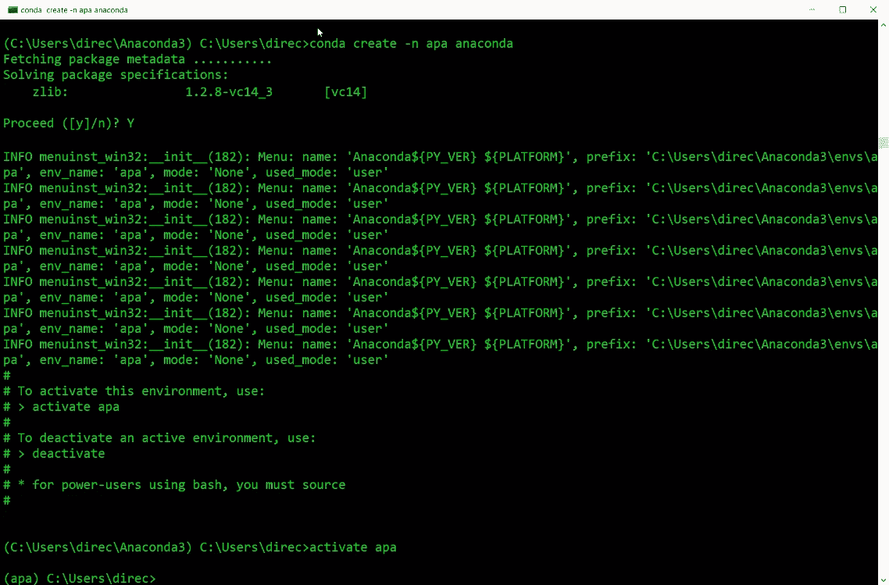

现在，新的虚拟环境已经激活，我们准备在这个新的虚拟环境中安装 TensorFlow。

但是在安装 TensorFlow 之前，你必须知道，基本上有以下两种 TensorFlow 安装方式：

+   仅支持 CPU 的 TensorFlow

+   支持 GPU 的 TensorFlow

第二种选择通常更快，因为它利用了你电脑或设备中的 GPU，但这种安装需要 **Nvidia** 的支持。你还需要额外的软件才能运行这种安装，而且安装过程稍微复杂一些。

在这里，为了方便起见，我们将安装并使用 CPU 版本，因为在编写程序和运行程序时，CPU 版本与 GPU 版本没有区别，唯一的差别是速度。我们使用以下代码行来安装 TensorFlow 到我们的系统中：

```py
pip install --ignore-installed --upgrade tensorflow
```

运行代码后，TensorFlow 的安装将会启动，安装完成后，你将在屏幕上看到以下输出：

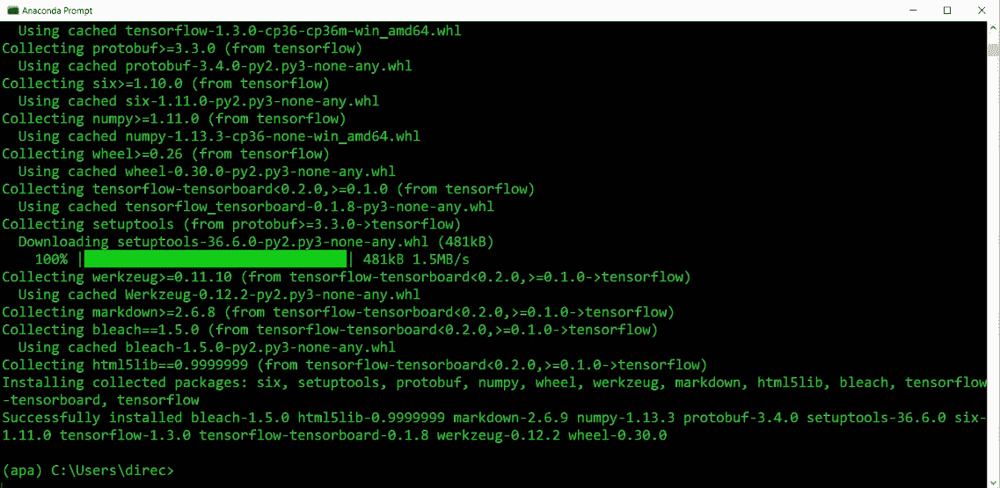

现在，我们将启动一个 Python shell，通过执行以下步骤来测试安装：

1.  我们输入`python`启动 Python shell。

1.  我们使用`import tensorflow as tf`将 TensorFlow 导入到我们的 Python shell 中。

1.  我们运行`hello = tf.constant("Hello")`；这将创建一个名为`hello`的常量。

1.  我们使用`sess = tf.Session()`创建一个会话。

如果你看到类似以下截图中的警告消息，可以忽略它们，因为它们只是告诉你可以通过不同的选项进行安装，从而让 TensorFlow 运行得更快。

1.  让我们通过在会话中运行常量`print(sess.run(hello))`来打印`hello`的结果：

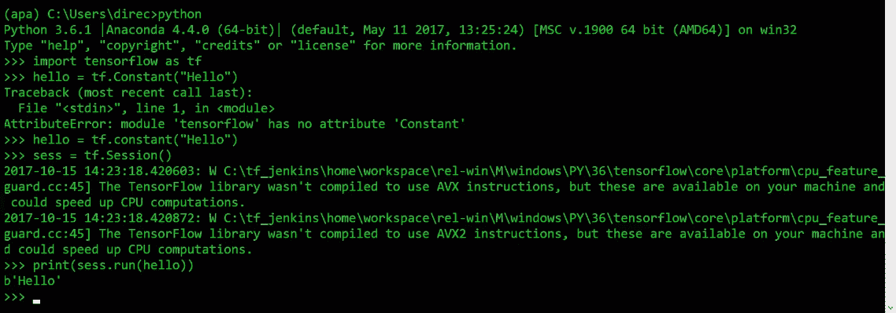

如果你得到一个类似于`Hello`的结果，如截图所示，这意味着我们的安装是正确的。所以，现在我们准备使用 TensorFlow 来构建一些模型。

# TensorFlow 中的核心概念

在实际使用`tensorflow`库之前，有一些重要的概念需要理解。以下是本书将涵盖的概念：

+   张量

+   计算图

+   会话

+   变量

+   占位符

+   常量

# 张量

**张量**是 TensorFlow 中数据的核心单元。张量由一组原始值组成，这些值被组织成一个任意维度的数组。它基本上是一个多维数组，类似于 NumPy 数组。维度的数量定义了张量的秩。我们来看一些以下的示例：

+   `3`：如果我们有一个单一的数字，那么张量将被视为秩为`0`的张量。这可以是一个具有`shape[]`的标量。

+   `[2., 2., 1.]`：如果我们有一个向量，它将被视为秩为`1`的张量，因此这就是我们所谓的形状为`3`的向量，因为它有三个元素。

+   `[[9., 5., 3.], [4., 5., 7]]`：一个形状为`[2, 3]`的矩阵将是一个秩为`2`的张量。

+   `[[[8., 3.]], [[7., 9.,]]]`：一个形状为`[2, 1, 2]`的矩阵将是一个秩为`3`的张量，正如你在最外层看到的，我们有两个元素，然后在下一层我们只有一个元素，最后一维中有两个元素。这就是为什么我们有`2`、`1`和`2`这些值，它们都是张量。

# 计算图

计算图是由一系列 TensorFlow 操作（也称为**操作**）组成的，这些操作被排列成一个节点图。TensorFlow 核心使用以下两个主要步骤：

1.  定义计算图

1.  运行计算图

让我们通过一个非常简单的例子来理解这个概念。假设你有一个包含两个变量**x**和**y**的函数，如下截图所示：


我们将使用前面的公式来计算或构建一个计算图，以获得当你分别传入**x**和**y**的值**3**和**2**时该函数的实际值：


现在，让我们为实际从这个计算模型中获取结果构建一个计算图：

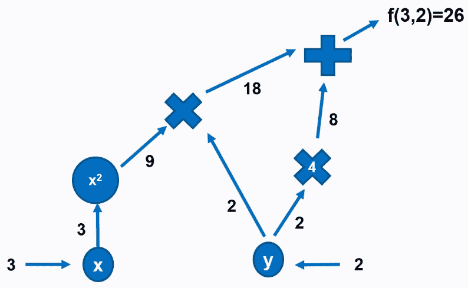

在前面的截图中，我们看到值流经计算图到达图中的不同节点。因此，在第一个节点中，值**3**被赋给**x**，在另一个节点中，值**2**被赋给**y**。现在，**x**的值流向一个操作节点，在那里它被平方，而该节点的结果流向另一个操作，结果与**y**的值相乘。我们还有另一个节点，其中**y**的值与**4**相乘。**x**和**y**乘法节点的结果以及**y**乘法节点的结果流向最后一个节点，即加法节点，最终输出**26**。所以，这基本上就是 TensorFlow 的工作原理。在节点之间流动的是张量。

以下是我们在 TensorFlow 中使用的其他对象：

+   **会话**：会话是一个封装执行操作对象环境的对象。因此，会话是将操作放置到设备（如 CPU 或 GPU）上的对象。

+   **占位符**：占位符是一个承诺，表示稍后会提供一个值。这些对象通常用于在机器学习模型中提供训练和测试值。

+   **变量**：这些是初始化时有值的对象，并且该值可以在图执行过程中改变。通常，它们用作机器学习模型中的可训练变量。

+   **常量**：常量是那些值永远不变的对象。

为了更好地理解这些对象概念，让我们看一个例子。首先，我们将通过执行以下代码片段来导入所需的库：

```py
import tensorflow as tf
import numpy as np
import matplotlib.pyplot as plt
%matplotlib inline
```

然后，我们通过执行以下代码片段来定义一些 TensorFlow 对象、占位符和常量：

```py
#Placeholders
x = tf.placeholder(tf.float32)
y = tf.placeholder(tf.float32)
c = tf.constant(5)
```

在这里，我们定义了一个名为`x`的占位符和另一个名为`y`的占位符。你必须明确给出在 TensorFlow 中将要使用的对象类型，在我们的示例中是`float32`。然后我们定义了一个常量`c`，其值为`5`。

创建这些对象后，如果你尝试打印它们，你将不会看到对象的值，而是会显示对象的类型，如下截图所示：


现在，让我们用我们的占位符来实现以下函数：


我们将使用刚刚创建的占位符，通过执行以下代码行来定义我们图中的不同节点：

```py
square_node = x*x
mult_node = square_node*y
quadruple_node = 4*y
adder_node = mult_node + quadruple_node
```

同样，如果你尝试打印这些对象的值，你将得到对象类型而不是值，如下截图所示：


因此，为了对这些对象进行计算，你必须创建一个会话对象，然后在会话内运行所有对象：

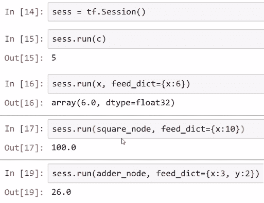

如果你正在进行一些计算，你不需要定义计算图，因为 TensorFlow 会在后台自动完成这一过程。所以，假设你想计算`f`并打印出其值，它仍然会给出对象类型。但要实际看到`f`的值，我们将在会话对象中再次运行该函数：

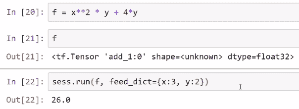

你可以通过两种方式在 TensorFlow 中运行对象。还有其他方式，但这些是你可以运行对象的基本且最常见的方式。你可以使用会话中的`run()`方法，或者你可以使用张量中的`eval()`方法：


如我们所见，我们使用`with`语句创建了一个会话，并在这个语句中运行了这两个方法。

现在，我们将构建一个基本的线性模型。我们将让 TensorFlow 猜测下面截图中显示的`b`和`w`参数的最佳值：


在前面的方程中，`w`的值是`5`，`b`的值是`1`。我们将使用这些值进行训练并将它们绘制在散点图上：

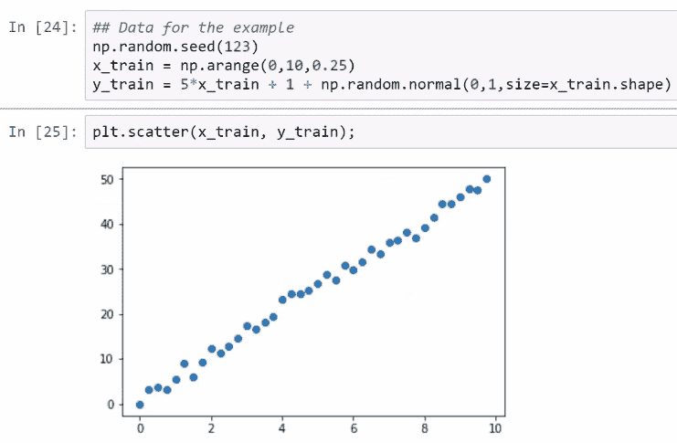

如你所见，我们在这两个值之间建立了线性关系。

现在，我们将初始化变量对象`w`和`b`，并将其值设为`0`，它们将成为我们的可训练参数。占位符通常是我们用来传递数据的对象，因此我们将创建两个占位符，`x`和`y`，现在线性模型将是我们计算图中的一个节点。接着，我们将定义一个`loss`函数，优化器将使用它来实际改变我们变量的值。每次运行训练操作时，优化器都会调整`w`和`b`的值，以最小化损失。然后，我们将初始化这些变量并创建一个会话来运行`init`初始化节点，如下图所示：

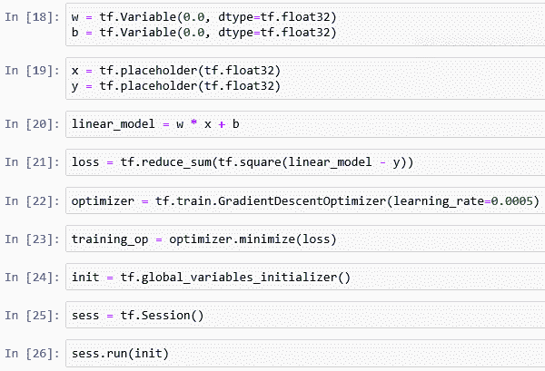

现在，我们可以开始训练我们的机器学习模型。我们将运行训练操作 20 次，这将对`w`和`b`的值进行修正，以最小化损失：

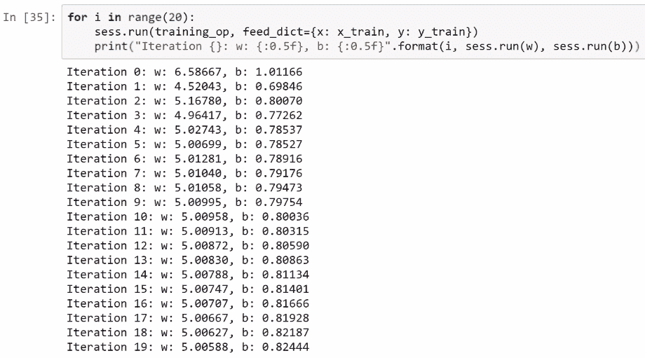

如我们所见，在第一次迭代后，优化器修正了`w`和`b`的值，这在每次迭代中都会发生。

我们也可以使用一些线性代数来实现这一点，但请记住，机器学习的目标实际上是从数据中学习参数，在这种情况下，我们已经使用 TensorFlow 运行了我们的第一个机器学习模型。

# 总结

在这一章中，我们讨论了人工神经网络（ANNs）、深度学习以及深度学习模型的要素。接着，我们安装了 TensorFlow，并学习了 TensorFlow 中的核心概念。

在下一章中，我们将使用 TensorFlow 和深度学习进行预测分析。
