# *第十一章*：使用聊天机器人查询文档

想象一下，如果你能够与文档中的文本数据进行双向对话。假设你订阅了多本期刊，定期收到关于技术趋势的研究文章。这些文章可能涵盖多个行业和技术，但你只对某个特定行业和技术的洞察感兴趣。传统上，你会有一支团队去翻阅这些文档，解读、理解，并推荐你需要采取的方向。如果你可以仅通过拿起手机，与一个聊天机器人对话，获得你需要的答案，而这些答案就来自你的文档库，岂不是太棒了吗？这就是将**自然语言处理**（**NLP**）技术与聊天机器人结合的力量。你可以真正和你的文档“对话”，并得到回答。

在上一章中，我们讨论了企业如何依靠技术帮助其国际化扩展，但传统的人工翻译以本地化客户网站既费时又昂贵。因此，我们构建了一个利用**机器学习**（**ML**）翻译能力与**Amazon** **Translate**相结合的解决方案，高效应对网站本地化挑战。

在本章中，像之前一样，我们将回到我们最喜欢的银行公司，*LiveRight Holdings*，并帮助他们通过自然语言处理（NLP）和聊天机器人解决一个独特的使用案例。但在我们讨论挑战和解决方案之前，先来谈谈将对话界面（即聊天机器人）与基于文本的文档搜索结合的理念（稍后会详细讲解）。记得我们曾说过，NLP 可以帮助揭示看似无关的文档中的模式，就像阿里巴巴洞中的宝藏一样（*第一章*，*商业环境中的 NLP 与 AWS AI 服务简介*——我们知道，感觉像是很久以前的事情了）？如果你有一个像《阿拉丁神灯》中的神灯精灵，根据你的问题提供所需的洞察，岂不是很酷？当我们将 NLP 和聊天机器人结合起来时，就像是让神灯精灵随时按需从阿里巴巴的宝藏洞中分发宝藏。如果你还记得，我们之前确实讨论过如何通过 NLP 创建智能搜索索引，但本章中我们将讨论的解决方案更进一步，使得搜索更加用户友好。为了学习如何构建一个查询文档的聊天机器人，我们将通过以下几个部分进行讲解：

+   介绍聊天机器人使用案例

+   创建一个以**Amazon** **S3** 为数据源的**Amazon** **Kendra** 索引

+   构建**Amazon** **Lex** 聊天机器人

+   使用**AWS** **CloudFormation** 部署解决方案

# 技术要求

本章中，您需要拥有一个**AWS** **账户**。请确保按照*第二章*《介绍 Amazon Textract》部分中指定的*技术要求*，创建您的 AWS 账户，并登录到**AWS** **管理控制台**。如果您需要了解如何将对象上传到 Amazon S3 桶中，请参考*创建 Amazon S3 桶、文件夹以及上传对象*部分。在尝试*构建查询文档的聊天机器人*步骤之前，请完成这些任务。

在本章中，我们将通过 AWS 管理控制台完成所有任务。GitHub 仓库提供了解决方案所需的输入文档和 FAQ 列表，您可以在此查看：[`github.com/PacktPublishing/Natural-Language-Processing-with-AWS-AI-Services/tree/main/Chapter%2011`](https://github.com/PacktPublishing/Natural-Language-Processing-with-AWS-AI-Services/tree/main/Chapter%2011)。

请使用以下部分的指示来构建解决方案。

# 介绍聊天机器人用例

现在让我们讨论一下，使用具备自然语言处理（NLP）能力的聊天机器人如何为企业带来益处。通过举例说明总是有帮助的，因此我们回到我们虚构的银行公司**LiveRight Holdings Private Limited**。LiveRight 公司中的**按揭产品研究**（**MPR**）部门对按揭业务至关重要，因为他们的建议直接影响着 LiveRight 提供给客户的按揭产品、特性和选择。这对 LiveRight 的收入和盈利能力有直接影响，因为按揭产品占 LiveRight 年收入的 40%以上。MPR 团队每月都会逐步收到数百份研究文档，这些文档既来自基于订阅的行业分析师，也来自专业的独立研究员。通常，这些文档提供了关于买家在购买房屋时的需求、房地产经纪人的角色、房价对卖家的影响等方面的洞察、趋势报告和详细视角。这些文档被存储到一个 Amazon S3 桶中，该桶已经包含了成千上万的文档，并且还在增长。

MPR 团队的“日常生活”场景是阅读这些大量的文档，分析其内容，识别感兴趣的领域、趋势和指标，并对这些事实进行分类，最终，这些信息会在一天的集体会议活动中被团队共同收集和评估，与过去几个月的统计数据进行比较，最终将建议写下来并发送给高层管理人员，同时将这些信息输入机器学习模型以确定抵押贷款产品特征。文档通常在前一个月的月底或月初收到，团队需要整个月的时间来阅读、分析、分类、讨论并做出建议。LiveRight 的高层管理人员长期以来一直认为这一过程非常耗时且成本高昂，这种看法是正确的。作为一个以经济实用为荣的组织，他们希望通过自动化这一过程来节省时间并降低成本。在看到使用 AWS AI 服务中的 NLP 技术在其他用例中对他们的帮助后，他们联系了你，ML 企业架构师，寻求帮助重新设计这一流程并构建一个高效的解决方案。此外，高层管理人员希望能够利用 MPR 团队中非常有才华的研究人员进行新的创新，而不是让他们浪费时间在琐碎和重复的任务上。

你发现来自 LiveRight 的这个请求既具有挑战性又令人兴奋，因为它是一个完全为 NLP 和 AI 量身定制的用例。你立即决定，帮助 MPR 团队讨论并决定他们的建议的最佳方式是一个**智能 AI 助手**，它可以参与他们的会议——倾听他们的问题并为他们回答。在经过一些分析后，你决定使用 Amazon Lex（[`aws.amazon.com/lex/`](https://aws.amazon.com/lex/)），这是一个完全托管的 AI 服务，通过机器学习模型来构建智能聊天机器人，能够进行语音和文本的互动，并具备持续学习的能力；以及 Amazon Kendra（[`aws.amazon.com/kendra/`](https://aws.amazon.com/kendra/)），这也是一个完全托管的机器学习驱动的企业搜索服务，利用 NLP 技术为你的文档创建智能索引，接受自然语言查询，并返回精确匹配上下文的响应。你查看了 Amazon Lex 定价（[`aws.amazon.com/lex/pricing/`](https://aws.amazon.com/lex/pricing/)），发现对于美国东部（北弗吉尼亚）地区每月 8,000 个语音请求和 2,000 个文本请求与聊天机器人的交互，每月只需支付 33.50 美元。你再查看了 Amazon Kendra 定价（[`aws.amazon.com/kendra/pricing/`](https://aws.amazon.com/kendra/pricing/)），发现开发者版支持每天处理 10,000 个文档和 4,000 个查询，价格为每小时 1.125 美元或每月 810 美元。你决定在试点阶段使用开发者版，待用户验收后再升级到企业版。

注意

这些价格截至撰写时是正确的。请检查链接以获取最新数据。

现在您已经准备好构建解决方案了。如前所述，我们将完全使用 AWS 管理控制台([`aws.amazon.com/console/`](https://aws.amazon.com/console/))来步行这个解决方案。如果您没有访问 AWS 管理控制台，请按照本书*第二章*中*介绍 Amazon Textract*部分中*技术要求*部分的详细说明进行操作。

首先，在我们继续解决方案构建之前，让我们完成前提条件：

1.  从我们的 GitHub 存储库下载样本家庭买家研究文档。从您的本地计算机打开一个互联网浏览器（最好是**Google** **Chrome** *版本* *9.1*及以上），并访问[`github.com/PacktPublishing/Natural-Language-Processing-with-AWS-AI-Services/tree/main/Chapter%2011`](https://github.com/PacktPublishing/Natural-Language-Processing-with-AWS-AI-Services/tree/main/Chapter%2011)。

1.  逐个点击文档名称下载每个四个文档。

1.  在文档页面上，点击右侧的**下载**按钮将文档下载到您的计算机上。

1.  按照本书*第二章*中*创建 Amazon S3 桶、文件夹和上传对象*部分的说明，将这些下载的文档上传到 Amazon S3 桶。在创建桶中的 Amazon S3 文件夹时，请使用以下文件夹/前缀路径 – `chapter11/kendra-faq/faqs.csv`、`chapter11/kendra/2019-NAR-HBS.pdf`、`chapter11/kendra/2020-generational-trends-report-03-05-2020.pdf`、`chapter11/kendra/` `Zillow-home-buyers-report.pdf`。

1.  现在，你已经准备好开始构建解决方案了。

在本节中，我们介绍了使用 NLP 的聊天机器人的需求以及与此解决方案相关的商业利益。在接下来的部分中，我们将逐步介绍解决方案的构建过程。

# 使用 Amazon S3 作为数据源创建 Amazon Kendra 索引

在本节中，我们将首先创建一个 Amazon Kendra 索引，并将我们在上一节中上传的样本研究文档的 S3 存储桶添加为 Amazon S3 数据源。

注意

在继续之前，请确保您已经执行了*技术要求*部分和*介绍聊天机器人使用案例*部分中提到的先决条件。

请执行以下步骤创建您的 Amazon Kendra 索引：

1.  如果尚未完成，请按照本书*第二章*中*介绍 Amazon Textract*部分中*技术要求*部分的详细说明登录到您的**AWS 管理控制台**。

1.  在页面顶部中央的**服务**搜索栏中输入`kendra`并从列表中选择**Amazon Kendra**。当**Amazon Kendra**控制台打开时，点击**创建索引**，如图所示：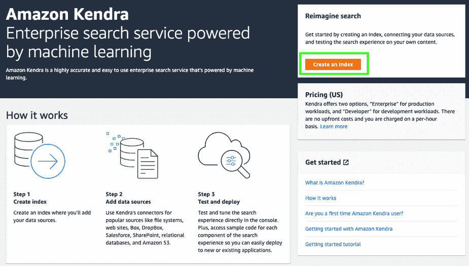

    图 11.1 – 创建亚马逊 Kendra 索引

1.  在**指定索引详细信息**页面中，输入索引的名称，添加可选描述，从**IAM 角色**列表框中选择**创建新角色（推荐）**，并输入**角色名称**，如下截图所示。然后点击**下一步**继续：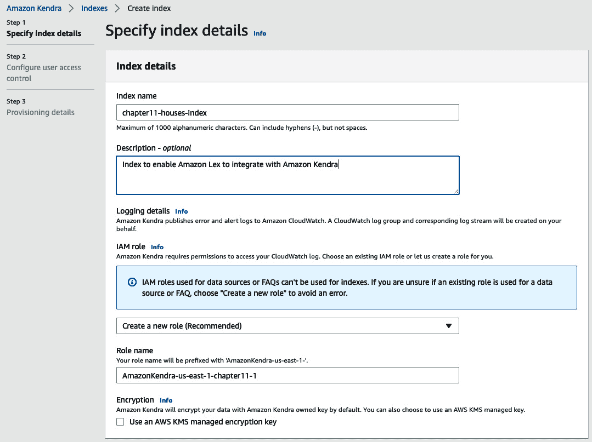

    图 11.2 – 指定索引详细信息

1.  在**配置用户访问控制**页面中保持默认选择，并点击**下一步**继续。

1.  在**指定配置**页面中，保持默认选择，指向**开发者版**，然后点击**创建**。亚马逊 Kendra 将开始创建索引的工作。可能需要大约 15 到 30 分钟，因此您可以在此期间享用一些零食和咖啡/茶。

1.  索引成功创建后，点击**添加数据源**按钮继续。

1.  在**向 Amazon Kendra 索引添加数据源连接器**页面中，向下滚动并点击**添加连接器**，位于**选择数据源连接器类型**下的**Amazon S3**卡片中。

1.  在**指定数据源详细信息**页面中，输入**数据源名称**并点击**下一步**。

1.  在`chapter11/kendra`中，点击**添加**按钮：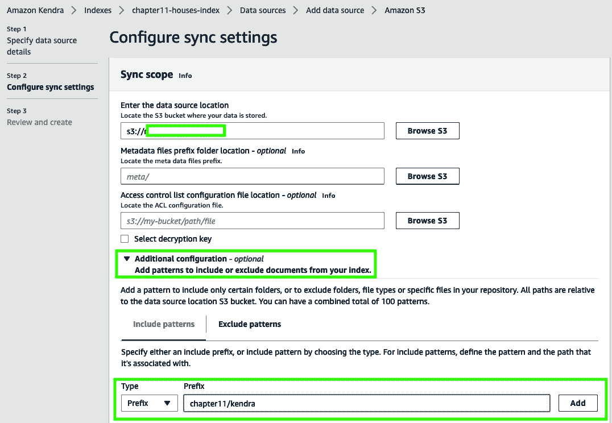

    图 11.3 – 配置同步设置

1.  现在，向下滚动页面，找到**IAM 角色**信息，在**IAM 角色**列表框中选择**创建新角色（推荐）**并输入您选择的**角色名称**。在**同步运行计划**信息中，选择**按需运行**作为**频率**。点击**下一步**继续。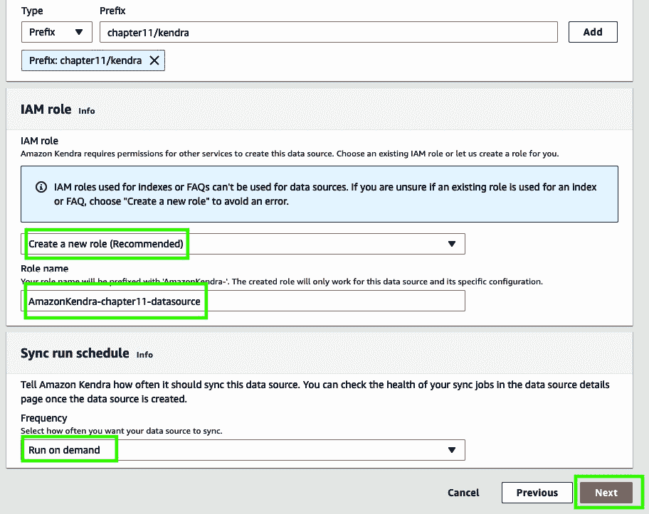

    图 11.4 – 数据源同步设置 IAM 角色和运行计划

1.  审核您的输入并点击**添加数据源**。亚马逊 Kendra 将首先传播 IAM 角色，然后创建数据源。

1.  数据源创建后，点击**立即同步**按钮，开始为我们的文档建立索引，以便搜索。

1.  同步大约需要 30 分钟（时间可以用来休息）。完成后，您可以查看**同步运行历史**。

1.  现在，我们将向索引添加一些常见问题解答（FAQ），以便为搜索添加更多背景信息。从左侧窗格中的**数据管理**标题下选择**常见问题解答**选项，然后点击**添加常见问题解答**。

1.  在*介绍聊天机器人使用案例*部分的前提步骤中输入`faqs.csv`文件。在**IAM 角色**中，选择**创建新角色（推荐）**并输入您选择的**角色名称**。向下滚动并点击**添加**。

1.  亚马逊 Kendra 将开始 FAQ 任务，几分钟后应该完成。

我们现在已完成使用 Amazon Kendra 设置智能搜索所需的步骤。在下一部分，我们将构建创建 Amazon Lex 聊天机器人的步骤。

# 构建 Amazon Lex 聊天机器人

在本节中，我们将执行构建 Amazon Lex 聊天机器人的步骤，并使用内置的*意图*（这是机器人基于用户请求执行的任务）将我们的聊天机器人与前一节中创建的 Amazon Kendra 索引集成。请按以下步骤执行：

1.  在 AWS 管理控制台中，在页面顶部中央的**服务**搜索框中输入`lex`，并从列表中选择**Amazon Lex**以进入 Amazon Lex 控制台。在 Amazon Lex 控制台的左侧窗格中，点击**切换到新的 Lex V2 控制台**链接，如下图所示：

    图 11.5 – 切换到新的 Lex V2 控制台

1.  在 Lex V2 控制台页面上，点击右侧的**创建机器人**，如图所示：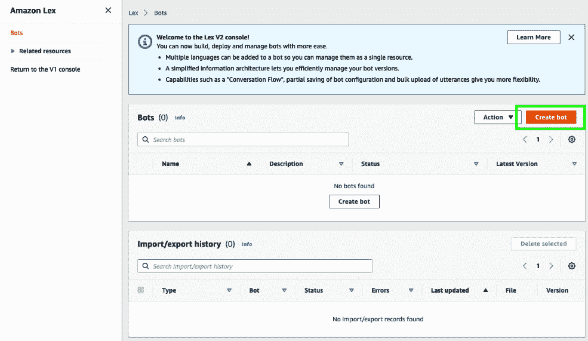

    图 11.6 – 创建机器人

1.  在`HomeBuyerResearch`中，为**Bot 名称**，在**IAM 权限**部分，选择**创建具有基本 Amazon Lex 权限的角色**作为**运行时角色**。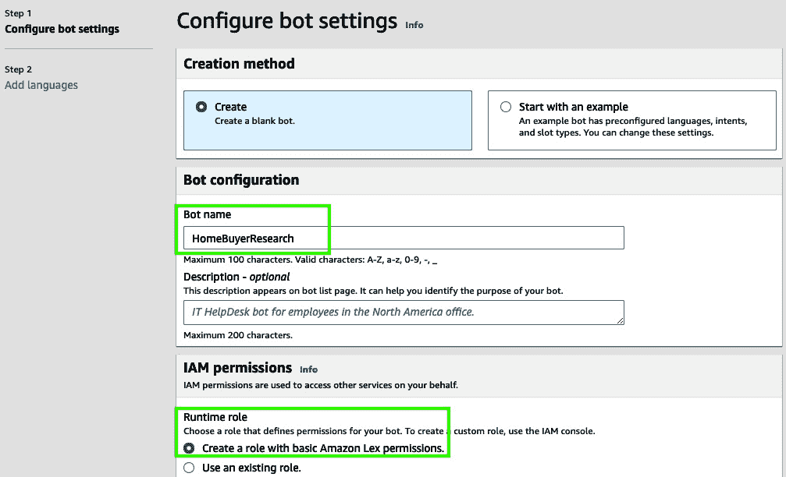

    图 11.7 – 配置机器人设置

1.  向下滚动至`5`，并为**空闲会话超时**选择**分钟数**，然后点击页面右下角的**下一步**。

1.  在**为机器人添加语言**页面，保持**选择语言**为**英语（美国）**，并在**语音交互**列表框中选择**Joanna**。点击页面右下角的**完成**。

1.  当机器人创建完成后，Amazon Lex 将自动添加一个名为`NewIntent`的意图来启动机器人构建过程。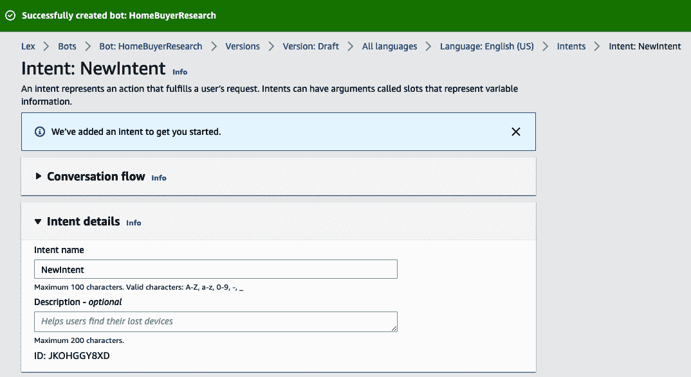

    图 11.8 – Lex 添加的 "NewIntent"

1.  向下滚动到页面底部的`新意图的发话内容`，点击`NewIntent`，这是一个自定义意图（在构建机器人时是必需的），并通过提供一个在与机器人交互时不会使用的发话内容来使其不可解析。这样可以强制将解析转到我们的 Amazon Kendra 内置意图。

1.  向下滚动并点击页面右下角的**保存意图**。

1.  现在，让我们返回到意图列表。点击**返回到意图列表**，它位于**Amazon Lex**标题下的左上方。

1.  在**意图**页面上，点击右侧的**添加意图**，并选择**使用内置意图**，如下图所示：

    图 11.9 – 添加内置意图

1.  在列表框中的`kendra`中，选择**AMAZON.KendraSearchIntent**。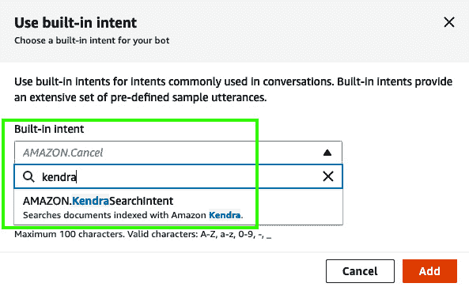

    图 11.10 – Amazon Kendra 为 Lex 提供的内置意图

1.  在`ResearchBuyers`中，以及在`chapter11-houses-index`中（如果你使用了书中提到的相同名称），点击**添加**。

1.  向下滚动到**消息**字段中的`Here is what I found for your query:((x-amz-lex:kendra-search-response-answer-1))`，点击**保存意图**。保存意图后，点击**更多响应选项**。

1.  在**消息**字段中的`I found a FAQ question for you: ((x-amz-lex:kendra-search-response-question_answer-question-1)) and the answer is ((x-amz-lex:kendra-search-response-question_answer-answer-1))`，点击**更新响应**。再次点击**保存意图**。图 11.11 – 添加文本消息组

    

    图 11.11 – 添加文本消息组

1.  现在，滚动到页面顶部，点击蓝色导航链接中的**语言：英语（美国）**。

1.  向下滚动并点击页面右下角的**构建**按钮。这大约需要几分钟时间，但不会超过。

1.  当机器人完全构建完成后，点击页面底部**构建**按钮旁边的**测试**按钮。

1.  在输入框中输入`Who is a first-time buyer?`，然后按**Enter**键。

1.  机器人使用我们添加到亚马逊 Kendra 索引中的文档中的答案进行响应：图 11.12 – 机器人响应查询，内容来自示例研究文档

    

    图 11.12 – 机器人响应查询，内容来自示例研究文档

1.  现在，滚动到页面顶部，点击蓝色导航链接中的**版本**。

1.  在**版本**页面，点击右侧的**创建版本**按钮。

1.  向下滚动到页面底部，点击**创建**按钮。

1.  新版本已成功为我们的机器人创建。记下创建的版本号，我们在接下来的步骤中将需要它。

1.  现在，在左侧面板中找到**部署**标题，点击**别名**，

1.  点击`hbr-web-ui`。向下滚动，选择在前一步创建的机器人版本，点击**选择一个现有版本**，然后点击页面右下角的**创建**按钮。

    注意

    如果你是第一次创建版本，请选择会显示给你的**版本 1**。

1.  创建别名后，请记下我们的机器人**别名 ID**。在下一节部署机器人时需要用到这个 ID。

1.  同时，点击页面顶部蓝色导航链接中的机器人名称，并记下你的**机器人 ID**——我们在部署时也需要这个。

这就是构建我们 Amazon Lex 聊天机器人的全部内容。在下一部分，我们将使用 AWS CloudFormation ([`aws.amazon.com/cloudformation/`](https://aws.amazon.com/cloudformation/))，这是一项托管服务，允许我们将基础设施配置任务写成**JSON**或**YAML**模板代码，从而自动化我们在 AWS 上构建解决方案所需的资源部署。由 Oliver Atoa 和 Bob Strahan 撰写的 Amazon Lex 博客文章《*为你的聊天机器人部署 Web 用户界面*》提供了一个 AWS CloudFormation 模板示例，用于将 Amazon Lex 聊天机器人集成到网站中：[`aws.amazon.com/blogs/machine-learning/deploy-a-web-ui-for-your-chatbot/`](https://aws.amazon.com/blogs/machine-learning/deploy-a-web-ui-for-your-chatbot/)。

我们将使用此模板创建一个网站，并将聊天机器人嵌入为小部件。

# 使用 AWS CloudFormation 部署解决方案

在前面两个部分中，我们逐步展示了如何使用 Amazon Kendra 创建索引并将来自 Amazon S3 存储桶的文档作为数据源，以及如何构建 Amazon Lex 聊天机器人并通过内置意图将其与我们的 Amazon Kendra 索引集成。这完成了我们解决方案构建的大部分内容。在这一部分，我们将使用来自附带仓库的 AWS CloudFormation 模板示例，这个仓库是我们在上一部分中提到的博客文章：[`github.com/aws-samples/aws-lex-web-ui/tree/master/templates`](https://github.com/aws-samples/aws-lex-web-ui/tree/master/templates)。

让我们开始吧：

1.  点击[`github.com/aws-samples/aws-lex-web-ui/tree/master/templates`](https://github.com/aws-samples/aws-lex-web-ui/tree/master/templates)，并向下滚动到网页上的**Launch**部分，点击第一个**Launch Stack**按钮以启动**CodeBuild 模式**。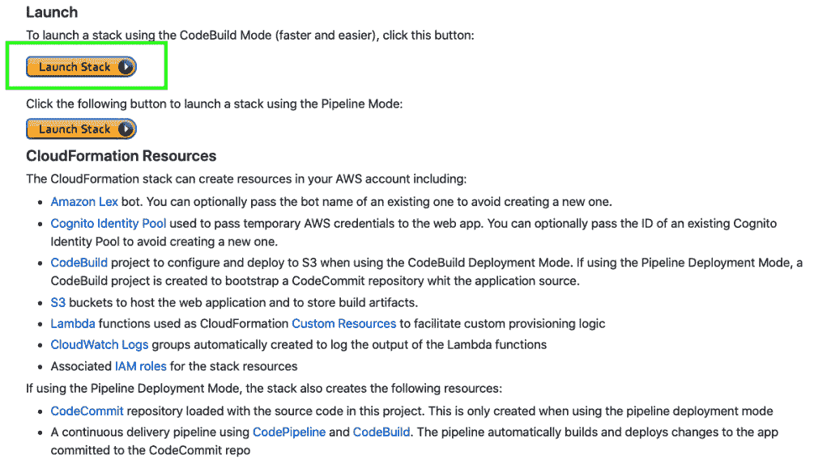

    图 11.13 – 启动 AWS CloudFormation 堆栈

1.  该操作将打开 AWS CloudFormation 服务，进入 AWS 管理控制台，并带你到**创建堆栈**页面。点击**下一步**。

1.  为**堆栈名称**和**CodeBuildName**输入一个你选择的名称，或者使用提供的示例。

1.  向下滚动到名为`en_US`的部分。

    图 11.14 – 创建堆栈，Lex V2 机器人配置参数

1.  向下滚动到`true`。这将强制用户注册**Amazon** **Cognito** ([`aws.amazon.com/cognito/`](https://aws.amazon.com/cognito/))，这是一个完全托管的用户身份验证和授权服务，适用于 Web 和移动应用程序。注册后，用户可以使用他们的凭证登录网站以访问聊天机器人。

1.  向下滚动一点，提供一个**CognitoIdentityPoolName**的名称。

1.  滚动到`You can ask me questions on home buyers. For example – what is important for home buyers?`，该内容位于`Say 'what is important for home buyers' to get started`的**WebAppConfBotInitialSpeech**字段中。当点击麦克风图标时，机器人会通过语音提示用户这一信息。

1.  向下滚动一点，找到`ResearchHomeBuyers`。然后，点击**下一步**。

1.  在此页面上，保持默认设置不变，点击页面底部的**下一步**。

1.  向下滚动到**功能**部分，选择两个复选框以确认创建 IAM 资源，并且可能需要自动扩展的能力。点击**创建堆栈**。

1.  创建我们所需的所有资源可能需要大约 15 分钟。有关将要创建的资源的详细信息，请参阅以下链接：[`github.com/aws-samples/aws-lex-web-ui/blob/master/templates/README.md#cloudformation-resources`](https://github.com/aws-samples/aws-lex-web-ui/blob/master/templates/README.md#cloudformation-resources)。

1.  当 CloudFormation 堆栈的状态更改为`Create_Complete`时，我们所需的资源已经配置完毕。在启动我们的网站之前，我们需要对父网站进行修改，以确保它发送正确的语言表达给我们的聊天机器人。点击您的 CloudFormation 堆栈的**输出**标签，查看已配置资源的列表。复制名为**WebAppBucket**的键的值。这是用于托管您网站的 Amazon S3 存储桶的名称：

    图 11.15 – 托管我们网站的 S3 存储桶

1.  现在，进入您的`S3`，并从列表中点击`parent.html`。

1.  在`parent.html`中，点击`parent.html`并将其下载到您的计算机：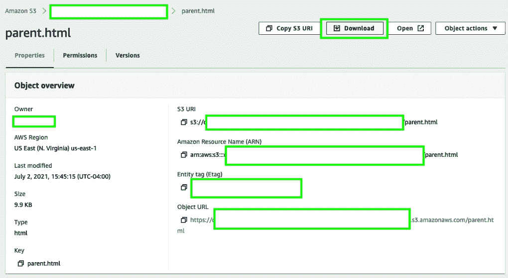

    图 11.16 – 下载 parent.html

1.  在您喜欢的文本编辑器中打开`parent.html`，并将 panel-heading 标签的值更改为`Send "what is important for buyers" utterance to iframe`，如以下截图所示。要找到该条目，请搜索`Buy Flowers`。

    图 11.17 – 更改 parent.html 中的 panel-heading 标签

1.  继续搜索`Buy Flowers`，并将`sendUtterance`函数的参数更改为`'what is important for buyers?'`，如以下截图所示：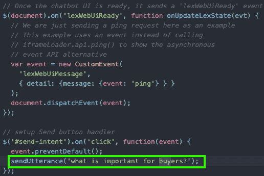

    图 11.18 – 更改发送语言表达函数输入

1.  现在，返回您的 Amazon S3 控制台，打开`parent.html`，点击**上传**，然后点击**添加文件**。

1.  从您的本地计算机选择修改后的`parent.html`，向下滚动并点击**上传**。

1.  CloudFormation 堆栈配置的资源之一是 CloudFront 分发。点击 **CloudFront**，在列表中点击 **CloudFront** 以进入 Amazon CloudFront 控制台：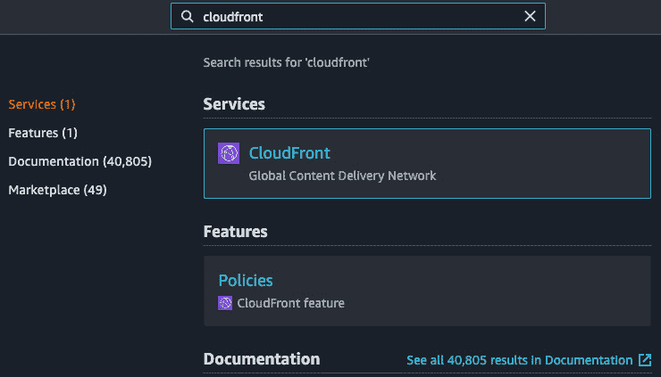

    图 11.19 – 导航至 Amazon CloudFront 控制台

1.  在 **CloudFront 分发** 页面中，检查 **Origin** 字段。您应该能在此看到一个条目，它的名称与您从 CloudFormation 堆栈的 **Outputs** 选项卡中复制的 **WebAppBucket** 值匹配。点击此条目的 **ID**。

1.  在 CloudFront 分发的详细信息页面中，点击 **Invalidations** 选项卡以打开它。然后，点击 **创建无效化** 按钮。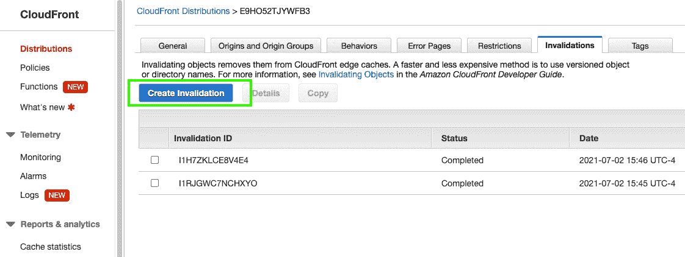

    图 11.20 – 为 CloudFront 分发创建无效化

1.  在 **Object Paths** 字段中的 `/` 处点击 **无效化**，如下截图所示。这个过程大约需要 5 分钟左右：

    图 11.21 – 无效化 CloudFront 分发

1.  无效化完成后，返回 **Amazon CloudFormation** 控制台中的堆栈 **Outputs** 选项卡，点击 **ParentPageUrl** 值：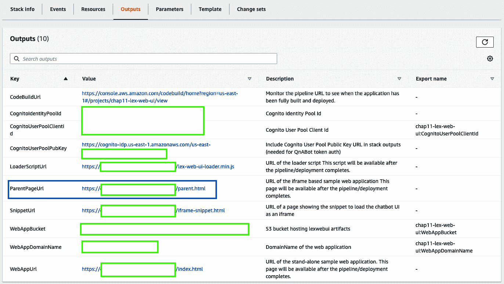

    图 11.22 – 点击 ParentPageUrl 值

1.  这将启动您配置的网站，并展示您的聊天机器人。但在使用聊天机器人之前，Amazon Cognito 会强制您登录到网站，如下所示。如果这是您第一次访问该网站，请点击 **注册** 按钮并按照提示进行注册：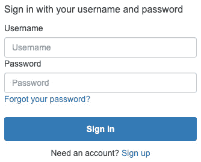

    图 11.23 – 注册或登录到您的网站

1.  注册过程完成后，您将收到一封包含验证码的邮件。输入验证码即可登录：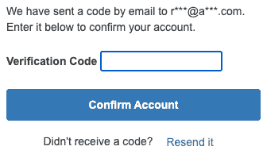

    图 11.24 – 输入验证码

1.  登录后，您的网站及其作为小部件的聊天机器人将显示出来。点击 **发送** 按钮将第一次输入的语句发送给机器人。您可以输入后续问题：

    图 11.25 – 与嵌入在主网站中的 Amazon Lex 聊天机器人小部件进行文本交互

1.  点击聊天小部件中的麦克风按钮与机器人对话。机器人会用语音回应，如下图所示。接受浏览器的通知，允许它使用麦克风继续操作。

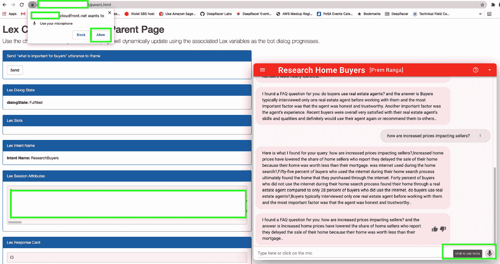

图 11.26 – 与您的聊天机器人进行语音交互

这就完成了本章的解决方案构建。请随时尝试这个解决方案并给我们反馈。你可以根据自己的需求轻松地定制我们在本章中构建的内容。有关如何利用 Amazon Kendra 和 Amazon Lex 满足你需求的更多想法，请参考*进一步阅读*部分。

# 总结

在本章中，我们使用 Amazon Kendra 构建了一个解决方案，用于自动搜索并从文档语料库中提取洞察，无需手动阅读文档、理解上下文、解释含义、识别跨文档与共同主题相关的内容等等。我们还展示了如何使用 Amazon Lex 设置一个智能的基于 AI 的聊天助手，该助手隐式集成了 Amazon Kendra 的智能搜索功能，提供了一个无缝的聊天和语音界面，用于（字面上）“与文档对话”。最后，我们使用 AWS CloudFormation 的最佳实践方法将我们的聊天机器人部署到父网站作为嵌入式小部件，并通过 Amazon CloudFront 内容分发网络进行了分发。

有趣的是，NLP 在医学领域有着多种应用，正如我们在下一章中将看到的那样，在那里我们将回顾 NLP 和 AI 技术如何帮助转变现代医疗索赔处理。我们将从讨论如何自动从医疗接收表单中提取数据开始，如何使用**Amazon** **Comprehend Medical** ([`aws.amazon.com/comprehend/medical/`](https://aws.amazon.com/comprehend/medical/))理解临床数据，以及如何为医疗索赔的裁定设置无服务器的实时管道。如之前所述，我们将介绍使用案例，讨论如何设计架构，建立前提条件，并详细讲解构建解决方案所需的各种步骤。

# 进一步阅读

+   *通过 Amazon Kendra 增强企业搜索*，作者：Leonardo Gomez：[`aws.amazon.com/blogs/machine-learning/enhancing-enterprise-search-with-amazon-kendra/`](https://aws.amazon.com/blogs/machine-learning/enhancing-enterprise-search-with-amazon-kendra/)

+   *Citibot 的聊天机器人搜索引擎如何利用 AI 找到更多答案*，作者：Francisco Zamora、Bratton Riley 和 Nicholas Burden：[`aws.amazon.com/blogs/machine-learning/how-citibots-chatbot-search-engine-uses-ai-to-find-more-answers/`](https://aws.amazon.com/blogs/machine-learning/how-citibots-chatbot-search-engine-uses-ai-to-find-more-answers/)

+   *使用 Amazon Connect、Amazon Lex、Amazon Kendra 以及开源 QnABot 项目构建全渠道问答聊天机器人*，作者：Bob Strahan 和 Michael Widell：[`aws.amazon.com/blogs/machine-learning/building-a-multi-channel-qa-chatbot-with-amazon-connect-amazon-lex-amazon-kendra-and-the-open-source-qnabot-project/?nc1=b_rp`](https://aws.amazon.com/blogs/machine-learning/building-a-multi-channel-qa-chatbot-with-amazon-connect-amazon-lex-amazon-kendra-and-the-open-source-qnabot-project/?nc1=b_rp)
