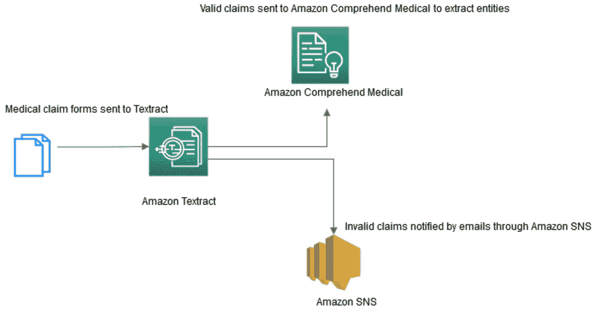
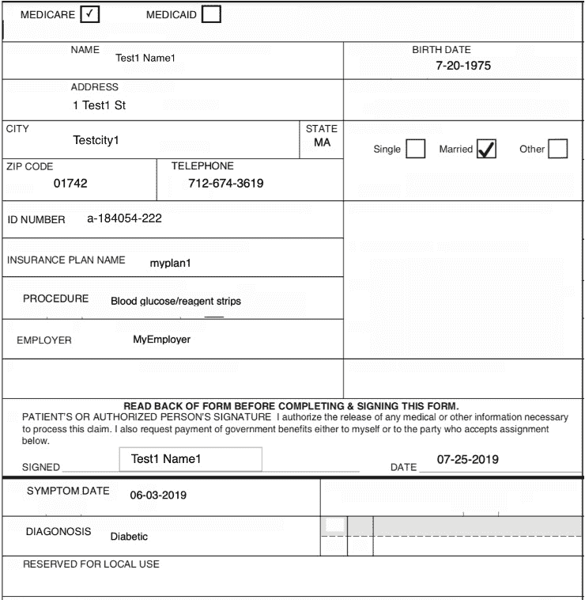
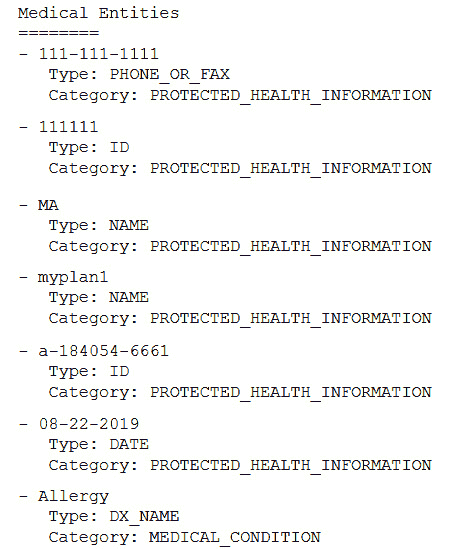
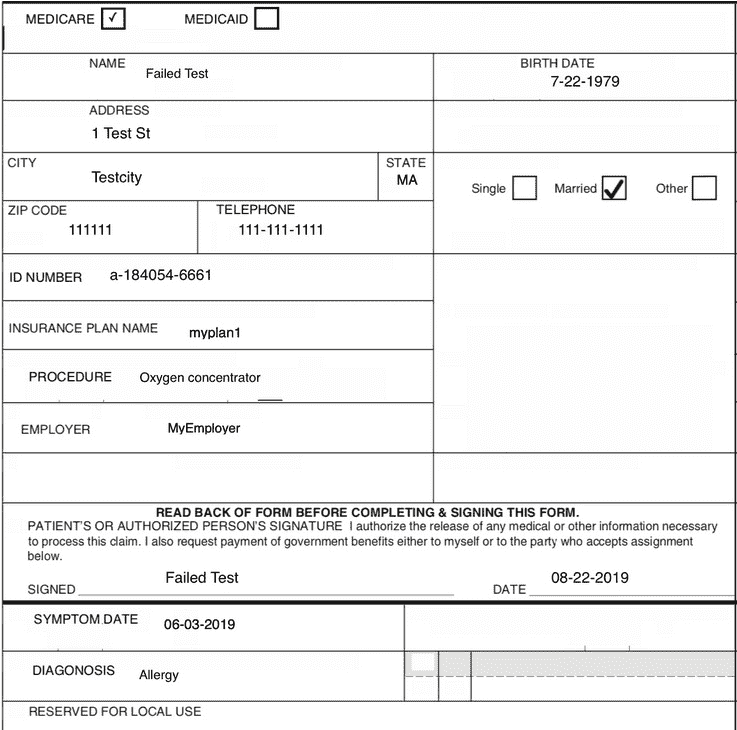
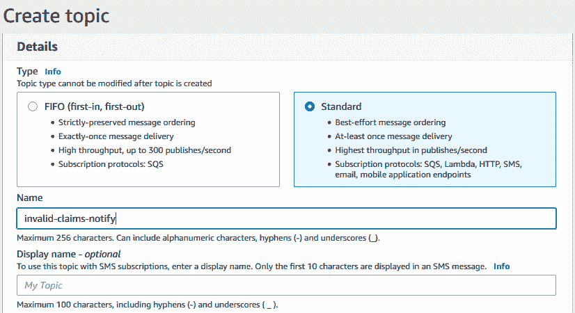
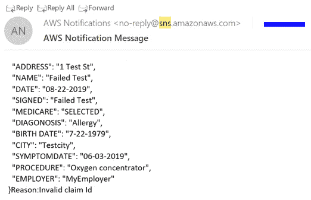
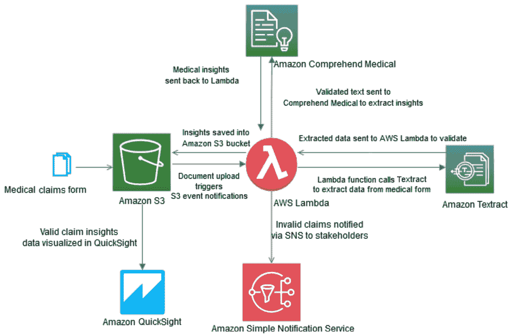

# *第十二章*：医疗行业中的 AI 和 NLP

在上一章中，我们讨论了如何使用 AWS AI 服务，通过**Amazon Lex**和**Amazon Kendra**为您的文档工作流设置聊天机器人。在这一章中，我们将讨论**Amazon Textract**和**Amazon Comprehend Medical**如何帮助数字化医疗索赔。我们将讨论医疗行业的索赔处理系统，以及为什么自动化医疗索赔如此重要。接着，我们将引导您如何使用 Amazon Textract 将这些纸质索赔数字化，并使用后处理进行验证。然后，我们将展示如何使用 Amazon Comprehend Medical API 从这些索赔中提取 NLP 洞察，例如判断个人是否患有糖尿病。

对于无效的索赔，我们将向您展示如何轻松设置通知，以提醒提交索赔的人重新提交正确数据，如邮政编码或索赔 ID。最后，我们将向您展示一些架构模式，帮助您使用 AWS Lambda 函数自动化所有流程。通过这种方式，您将创建一个端到端的无服务器解决方案，从而缩短索赔处理工作流的市场时间。这是因为您无需设置和管理服务器，也无需扩展以处理数百万个此类索赔。

本章将涵盖以下主题：

+   介绍自动化索赔处理的使用案例

+   理解如何从医疗入院表单中提取和验证数据

+   理解使用 Amazon Comprehend Medical 的临床数据

+   理解无效医疗表单处理及通知

+   理解如何为医疗索赔创建无服务器管道

# 技术要求

本章需要您访问一个 AWS 账户：

+   请确保按照*第二章*中的*技术要求*部分的说明，创建您的 AWS 账户。

+   在尝试*提高文档处理工作流准确性*部分的步骤之前，请登录 AWS 管理控制台。

我们解决方案的 Python 代码和示例数据集可以在[`github.com/PacktPublishing/Natural-Language-Processing-with-AWS-AI-Services/tree/main/Chapter%2012`](https://github.com/PacktPublishing/Natural-Language-Processing-with-AWS-AI-Services/tree/main/Chapter%2012)找到。请使用以下章节中的说明，并结合前面仓库中的代码来构建解决方案。

查看以下视频，了解代码的实际应用：[`bit.ly/3GrClSK`](https://bit.ly/3GrClSK)。

# 介绍自动化索赔处理的使用案例

根据*2018 CAHQ 指数报告*（[`www.caqh.org/sites/default/files/explorations/index/report/2018-index-report.pdf`](https://www.caqh.org/sites/default/files/explorations/index/report/2018-index-report.pdf)），2018 年，医疗行业共提交了约 61 亿个医疗理赔，预计这一数字在未来几年将继续增长。

医疗支付公司不断寻找高效且具有成本效益的方式，以可扩展的方式处理如此大量的理赔。由于当前理赔处理的手工流程，处理这些理赔需要花费大量时间。因此，医疗公司正在寻找使用 AI 和机器学习方法来自动化和数字化这些理赔。一旦他们能够将这些理赔数字化，就能够轻松推动一些洞察力，比如改善整体人群健康。此外，分析这些理赔文件可能有助于你发现一些行为，帮助预防某些医疗状况的发生。同时，医疗支付方也在寻找符合法规的解决方案，如*HIPAA 合规*。对于美国以外的朋友，HIPAA 是美国医疗行业特定的合规法律。

现在，我们理解了为什么自动化理赔如此重要。接下来，我们将讨论如何帮助你使用 AWS AI 服务，如 Amazon Textract，来自动化这一流程，数字化理赔处理。你可以通过从这些扫描的理赔文件中提取文本，并使用自然语言处理（NLP）和 Amazon Comprehend Medical 来验证它们，从中获取一些患者健康洞察。

在这个用例中，我们的虚构公司*LiveRight Holdings Private Limited*与一家名为*AwakenLife*的医疗保险提供商合作，处理由他们的保险持有人提交的理赔。这些理赔大多数是扫描图像，他们的大部分时间和精力都花费在处理这些理赔上，因为其中一些是无效的。这给组织带来了损失。由于 LiveRight 公司已经在前几章中使用了 Amazon Textract 来自动化、数字化并进一步创新他们的文档处理工作流，他们推荐使用*AwakenLife*，这样他们就可以利用一些 AWS AI 服务来改善和自动化他们的整体理赔流程。在本章中，我们将设置一个简单的基于 AI 的工作流来验证 AwakenLife 的理赔，从而进一步减少他们的整体处理时间。

这个解决方案具有高度的成本效益和可扩展性，因为这些服务是无服务器的，并且可以根据你的需求扩展来处理文档。在本章中，我们将向你展示以下架构：



图 12.1 – 用于笔记本的医疗理赔处理架构

在前面的图表中，我们可以看到以下内容：

+   您的医疗接待表单可以是图像或 PDF 格式，并且会被发送到 Amazon Textract 进行数字化或文本提取。

+   Amazon Textract 从这些高度非结构化的医疗接待文档中提取文本。

+   您必须对 Amazon Textract 的响应进行 *后处理*，以验证索赔。对于本博客，我们使用邮政编码和索赔 ID 来确保索赔的有效性。您可以根据您的业务案例自定义这些验证规则。

+   一旦邮政编码和索赔 ID 被验证，合法的数据将被发送到 Amazon Comprehend Medical，以获得关于患者程序等的洞察和实体。

+   如果邮政编码和索赔 ID 无效，将向相关人员发送电子邮件，通知他们这是一个无效的索赔。

我们将使用 Jupyter 笔记本来演示之前的架构。一旦完成这部分内容，我们将介绍如何使用基于事件的 Lambda 函数自动化实现该架构。

在下一部分中，我们将讨论如何使用 Amazon Textract 从医疗接待表单中提取数据。

# 理解如何从医疗接待表单中提取和验证数据

在这一部分中，我们将展示如何使用 Amazon Textract 从医疗接待表单中提取关键值对或表单数据。然后，通过简单的逻辑，您将验证提取的值是否有效或无效。

如果您在之前的章节中没有这样做，您需要创建一个 Amazon SageMaker Jupyter 笔记本，并设置 `Chapter 12` 文件夹，打开 `ch 12 automating claims processing.ipynb` 笔记本。

注意：

确保笔记本中的 IAM 角色具备 **AmazonSNSFullAccess**、**AmazonComprehendMedicalFullAccess** 和 **AmazonTextractFullAccess** 权限。

现在，使用这个笔记本，我们将学习如何使用 Textract API 提取数据，并通过一个示例医疗接待表单使用一些后处理逻辑进行验证：

1.  我们将使用以下示例医疗接待表单开始。运行以下代码块加载示例医疗表单，这是一份有效的索赔医疗表单：

    ```py
    documentName = "validmedicalform.png"
    display(Image(filename=documentName))
    ```

    您将看到以下医疗接待表单已经加载：

    

    ```py
    def calltextract(documentName): 
        client = boto3.client(service_name='textract',
             region_name= 'us-east-1',
             endpoint_url='https://textract.us-east-1.amazonaws.com')
        with open(documentName, 'rb') as file:
                img_test = file.read()
                bytes_test = bytearray(img_test)
                print('Image loaded', documentName)
        response = client.analyze_document(Document={'Bytes': bytes_test}, FeatureTypes=['FORMS'])
                   return response
    ```

1.  至此，我们已经定义了一个 Textract 函数。现在，我们将通过传递扫描的医疗接待表单来调用此函数，并获取 Textract 响应。运行以下单元格：

    ```py
    response= calltextract(documentName)
    print(response)
    ```

    如果 Textract 的响应成功，您将收到以下消息，并附有提取数据的 JSON 响应：

    

    图 12.3 – 医疗表单的 Textract JSON 响应

    前面的响应包含了大量信息，例如几何、页面以及文档元数据中的文本。

1.  现在，我们将创建一个函数来解析从此 JSON 响应中提取的表单数据或键值文本响应。我们使用 Textract 解析器来解析此 JSON 响应。在这里，我们创建了一个方法，它接受一个 JSON 响应并使用 Textract 解析器解析表单键值并返回键值对：

    ```py
    from trp import Document
    def getformkeyvalue(response):
        doc = Document(response)
        key_map = {}
        for page in doc.pages:
            # Print fields
            for field in page.form.fields:
                if field is None or field.key is None or field.value is None:
                    continue
                key_map[field.key.text] = field.value.text
        return key_map
    ```

1.  现在，我们将把 Textract 的 JSON 响应传递给`def getformkeyvalue(response)`方法，以从 Textract JSON 响应中获取键值对或表单数据：

    ```py
    get_form_keys = getformkeyvalue(response)
    print(get_form_keys)
    ```

    你将得到如下输出：

    

    ](img/B17528_12_04.jpg)

    图 12.4 – 从 JSON 响应解析的 Textract 表单数据

    所有表单项都作为键值对提取。

1.  现在，我们将使用一些定义好的业务规则检查这些键值对或表单项是否有效。对于本书来说，我们通过有效的邮政编码和索赔 ID 来检查表单的有效性。你也可以根据自己的业务需求修改验证代码。我们创建了一个方法，它接受键值对并检查从 Textract 提取的邮政编码或 ID 号码信息是否有效。如果有效，它将返回所需的 ID，如果无效，它将返回一条消息，说明索赔 ID 和邮政编码无效：

    ```py
    def validate(body):
        json_acceptable_string = body.replace("'", "\"")
        json_data = json.loads(json_acceptable_string)
        print(json_data)
        zip = json_data['ZIP CODE']
        id = json_data['ID NUMBER']
        if(not zip.strip().isdigit()):
            return False, id, "Zip code invalid"
        length = len(id.strip())
        if(length != 12):
            return False, id, "Invalid claim Id"
        return True, id, "Ok"
    ```

1.  现在，我们将通过发送从`getformdata(response)`方法提取的键值对来测试这种验证方法是否适用于有效的医疗表单：

    ```py
    textract_json= json.dumps(get_form_keys,indent=2)
    res, formid, result = validate(textract_json)
    print(result)
    print(formid)
    ```

1.  由于这是有效的索赔，邮政编码和索赔 ID 都是有效的，因此此方法返回有效的响应（有效的响应）：


](img/B17528_12_05.jpg)

图 12.5 – 有效的索赔响应

正如你所看到的，我们得到了一个`Ok`响应，并附带有效的索赔 ID。

现在，回到架构，有两种情况可能发生：

+   如果表单有效或此方法的响应是`Ok`，我们将把这些数据发送到 Comprehend Medical 以获得洞察，这将在下一节中讲解。

+   如果表单无效，我们将使用 Amazon **Simple Notification Service**（**SNS**）通知客户，该服务用于发送电子邮件或电话通知。我们将在最后一节中讨论这个内容，*理解如何为医疗索赔创建无服务器管道*。

在本节中，我们介绍了如何使用 Amazon Textract Analyze Document API 从医疗接收表单中提取表单值。我们还讨论了如何验证 Textract 响应。

由于响应对于医疗接收表单有效，在下一节中，我们将向你展示如何使用 Amazon Comprehend Medical 提取医疗洞察。

# 使用 Amazon Comprehend Medical 理解临床数据

在本节中，我们将讨论如何使用**Amazon Comprehend Medical**从有效的医疗接收表单中获取洞察。我们在*第三章*中介绍了 Amazon Comprehend 的功能，*介绍 Amazon Comprehend*。在本章中，我们将学习如何使用 Amazon Comprehend Medical Entity API 提取诸如*患者诊断*和个人健康信息（PHI）数据类型，如*申诉 ID*等医疗接收表单中的实体。让我们开始吧：

1.  回到您的笔记本并运行以下单元格，使用 Comprehend Medical `boto3` API：

    ```py
    comprehend = boto3.client(service_name='comprehendmedical')
    ```

1.  现在，我们将使用`comprehend.detect_entities_v2` API ([`docs.aws.amazon.com/comprehend/latest/dg/API_medical_DetectEntitiesV2.html`](https://docs.aws.amazon.com/comprehend/latest/dg/API_medical_DetectEntitiesV2.html)) 来分析来自医疗接收表单的临床文本数据，并返回与医疗文本相关的实体，如类型或诊断。运行以下单元格查看我们从有效医疗接收表单中提取的实体：

    ```py
    cm_json_data =  comprehend.detect_entities_v2(Text=textract_json)
    print("\nMedical Entities\n========")
    for entity in cm_json_data["Entities"]:
        print("- {}".format(entity["Text"]))
        print ("   Type: {}".format(entity["Type"]))
        print ("   Category: {}".format(entity["Category"]))
        if(entity["Traits"]):
            print("   Traits:")
            for trait in entity["Traits"]:
                print ("    - {}".format(trait["Name"]))
        print("\n")
    ```

    您将使用此 API 获得以下医疗洞察：

    

    图 12.6 – 医疗实体

    它能够将电话号码和医疗 ID 识别为个人健康信息（PHI）。如果您有合规要求，您可以轻松地屏蔽或删除这些实体类型，因为它们已经被该 API 正确识别。

1.  现在我们已经提取了实体，我们将把这些提取的数据保存在 Amazon S3 中的 CSV 文件里。对于大规模的医疗接收表单处理，您会希望将所有这些洞察保存在 CSV 文件中，放入 S3 桶中，并使用分析服务进行分析，如我们在*第八章*中介绍的，*利用 NLP 将您的媒体内容货币化*。我们已经创建了一个函数，该函数接受 Comprehend Medical 的响应和来自医疗接收表单的验证 ID，并将其保存到 Amazon S3 中。运行以下代码：

    ```py
    def printtocsv(cm_json_data,formid):       
            entities = cm_json_data['Entities']
            with open(TEMP_FILE, 'w') as csvfile: # 'w' will truncate the file
                filewriter = csv.writer(csvfile, delimiter=',',
                                quotechar='|', quoting=csv.QUOTE_MINIMAL)
                filewriter.writerow([ 'ID','Category', 'Type', 'Text'])
                for entity in entities:
                    filewriter.writerow([formid, entity['Category'], entity['Type'], entity['Text']])
    filename = "procedureresult/" + formid + ".csv"
     S3Uploader.upload(TEMP_FILE, 's3://{}/{}'.format(bucket, prefix))
    ```

1.  现在，我们将通过传递 Comprehend Medical Entity API 的 JSON 响应和来自验证逻辑的`formid`，调用`printtocsv(cm_json_data,formid)`方法：

    ```py
    printtocsv(cm_json_data,formid)
    ```

    您将获得以下响应：

    ```py
    "successfully parsed:procedureresult/a-184054-6661.csv"
    ```

在本节中，我们介绍了如何使用 Amazon Comprehend Medical API 提取来自 Amazon Textract 的有效申诉中的医疗洞察或实体。在下一节中，我们将使用 Amazon Textract 提取一个无效申诉表单的数据，并对这些数据进行后处理以检查其有效性。如果无效，我们将向您展示如何设置 SNS，通过电子邮件通知相关方。

# 了解无效医疗表单处理及通知

在本节中，我们将讲解当 Textract 后处理识别为无效时，如何按照*图 12.1*中指定的架构进行操作。我们将通过 Amazon SNS 向相关方发送消息。现在让我们回到笔记本：

1.  在笔记本中，我们将通过运行以下代码开始加载扫描的医疗入院表单：

    ```py
    InvalidDocument = "invalidmedicalform.png"
    display(Image(filename=InvalidDocument))
    ```

    你将得到以下示例医疗表单，我们将检查其中的无效用例：

    

    图 12.7 – 医疗入院无效索赔表单

    在此表单中，**邮政编码**和**身份证号码**输入错误。

1.  现在，我们将调用之前章节中创建的`calltextract(document)`函数，并传入该文档以使用 Amazon Textract Sync API 提取文本或数据。为此，请运行以下代码：

    ```py
    response = calltextract(InvalidDocument)
    ```

1.  在此之后，我们将调用在前面章节中定义的`getformdata(response)`方法，该方法以 Textract 的响应作为输入，并返回表单的键值数据：

    ```py
    get_form_keys = getformkeyvalue(response)
    print(get_form_keys)
    ```

    你将得到以下输出：

    

    图 12.8 – 使用 Textract 提取的表单数据

    在这里，我们获取了所有的键值对或表单数据。

1.  现在，我们将通过将提取的键值对，如`邮政编码`和`身份证号码`，作为输入传递给前面章节中定义的`validate(body)`方法来检查其有效性。如果内容有效，该方法返回 true；如果提交的`邮政编码`和`身份证号码`无效，则返回 false：

    ```py
    textract_json= json.dumps(get_form_keys,indent=2)
    res, formid, result = validate(textract_json)
    print(result)
    print(formid)
    print(res)
    ```

    你将得到以下响应：

    

    图 12.9 – 无效索赔响应

    有效的方法返回一个无效的索赔和`false`，以及无效的索赔 ID。

1.  现在，我们想通知用户此索赔无效。为此，我们将引导你如何通过 Amazon SNS 控制台设置**Amazon SNS**。请访问此链接创建一个主题，在该主题中发布无效消息：[`console.aws.amazon.com/sns/v3/home?region=us-east-1#/create-topic`](https://console.aws.amazon.com/sns/v3/home?region=us-east-1#/create-topic)。

1.  对于`invalid-claims-notify`，如以下截图所示：

    图 12.10 – 在 SNS AWS 控制台创建主题

    确保选择**标准**主题类型。

1.  向下滚动并点击**创建主题**按钮。

1.  创建主题后，我们必须添加订阅者或将要订阅此主题以接收通知的人，方法是访问[`console.aws.amazon.com/sns/v3/home?region=us-east-1#/create-subscription`](https://console.aws.amazon.com/sns/v3/home?region=us-east-1#/create-subscription)。

1.  从下拉菜单中选择你的**主题 ARN**，设置**协议**为**电子邮件**，并在**终端**框中输入你的电子邮件 ID，如以下截图所示：

    图 12.11 – 通过电子邮件订阅主题

    向下滚动并点击**创建订阅**。

1.  一封电子邮件将发送到你刚刚用于订阅的地址。请检查你的邮箱或垃圾邮件，查看来自 SNS 的电子邮件，邮件主题为 **AWS 通知 - 订阅确认**，点击 **确认订阅**。

    注意：

    确认订阅非常重要，否则你将无法收到通知。

1.  现在，返回 [`console.aws.amazon.com/sns/v3/home?region=us-east-1#/topics`](https://console.aws.amazon.com/sns/v3/home?region=us-east-1#/topics) 复制 `invalid-claims-notify`：

    图 12.12 – 从 AWS 控制台复制主题的 ARN

1.  复制此 ARN 后，返回到笔记本，并将其粘贴到以下笔记本单元格中，以加载 SNS `boto3` 客户端。在这里，输入一个主题：

    ```py
    sns = boto3.client('sns')
    topicARN="<Enter your topic arn>"
    ```

1.  现在，我们将把无效信息转换为负载，并发布到此主题：

    ```py
    snsbody = "Content:" + str(textract_json) + "Reason:" + str(result)
    print(snsbody)
    ```

1.  接下来，我们将使用 `sns.publish` Python `boto3` API ([`boto3.amazonaws.com/v1/documentation/api/latest/reference/services/sns.html#SNS.Client.publish`](https://boto3.amazonaws.com/v1/documentation/api/latest/reference/services/sns.html#SNS.Client.publish))，将无效电子邮件信息发送到已注册的电子邮件地址：

    ```py
    try:
        response = sns.publish(
                        TargetArn = topicARN,
                        Message= snsbody
        )
        print(response)
    except Exception as e:
            print("Failed while doing validation")
            print(e.message)
    ```

    你将收到如下响应：

    

    图 12.13 – 将无效索赔信息推送到主题

1.  检查你订阅时使用的电子邮件地址，查看是否有通知无效医疗索赔的电子邮件：



图 12.14 – 发送的电子邮件通知

你可以随时选择退出你创建的主题。

在本节中，我们讲解了如何使用 Amazon Textract 处理医疗索赔，检查无效医疗索赔，并通知相关方。接下来，我们将学习如何为医疗索赔创建一个无服务器管道。

# 理解如何为医疗索赔创建无服务器管道

在前面的章节中，我们通过使用 Amazon Textract Sync API、Amazon Comprehend Medical Detect Entities Sync API 和 Amazon SNS 发送无效索赔，讲解了架构的构建模块。我们为此工作流定义了函数，并调用了文本提取和验证函数，展示了有效和无效医疗索赔表单的用例或工作流。这些函数可以移入 Lambda 代码中，并与 **S3 事件通知** 一起被触发，用于创建一个可扩展的医疗索赔处理管道。我们可以通过以下架构来实现：



图 12.15 – 使用 AWS Lambda 自动化扩展架构

我们通过一个 Jupyter 笔记本，展示了使用单一接收表单处理医疗理赔的各个代码组件。我们创建了 Python 函数来提取数据、验证数据、收集洞察，并将这些洞察转换为 CSV 文件。为了处理数百万这样的文档，我们将学习如何将代码函数转换为 AWS Lambda 函数，利用前面的架构图创建一个端到端的自动化无服务器架构。我们将使用的医疗理赔表单已由*AwakenLife Ltd*的付款方上传到 Amazon S3 存储桶：

+   Amazon S3 声明上传会触发一个 Amazon S3 事件通知，进而触发 lambda 函数。

+   在这个 lambda 中，你可以调用我们在*理解如何从医疗接收表单中提取和验证数据*部分定义的`textract`函数，并通过传递该图像作为输入来调用 Amazon Textract。

+   你会收到一个文本响应。这些提取的文本可以被发送到我们在前一节中定义的`validation`函数。

+   对于有效的理赔，验证过的数据将发送到 Amazon Comprehend Medical 以提取洞察。提取的洞察将被返回给 AWS Lambda。

+   你可以将我们在*使用 Amazon Comprehend Medical 理解临床数据*部分定义的`printtocsv`（`cm_json_data`，`formid`）函数代码移到这个 lambda 函数中，将提取的洞察转换为 CSV 文件，并将其保存到 Amazon S3。

+   对于无效的理赔，你可以使用 SNS 通知相关方。

我们可以通过几行代码，在大规模处理医疗理赔文档时使用扩展性和流程化的方式。这种架构可以快速实现自动化，并以*CloudFormation 模板*的形式进行部署，从而让你能够设置**基础设施即代码**（**IaC**）。如果你有兴趣，我们已经在*进一步阅读*部分提供了一个类似的可扩展实现，以博客的形式呈现。

在本节中，我们讲解了如何使用我们在前面各节中定义的代码，并将其移至 AWS Lambda 部分，以构建一个使用逐步架构的端到端自动化工作流。现在，让我们总结一下这一章。

# 总结

在本章中，我们介绍了医疗理赔处理的使用案例。然后，我们讨论了如何使用 AWS AI 服务，如 Amazon Textract 来从这些扫描的医疗表单中提取表单数据。接着，我们讨论了如何根据您的业务规则对提取的文本进行一些后处理，以验证其表单数据。一旦表单数据经过验证，我们向您展示了如何使用 Amazon Comprehend Medical 来提取医疗见解，正如在*第三章*，*介绍 Amazon Comprehend*中所涵盖的那样。一旦您获得了医疗见解，这些数据可以转换为 CSV 文件并保存在 Amazon S3 中。完成这些步骤后，您可以使用**Amazon Athena**或**Amazon QuickSight**来分析这些数据以进行人口健康分析。我们还讨论了如何通过显示如何快速通过 AWS 控制台配置 Amazon SNS 并添加订阅者来处理无效理赔。您可以通过电子邮件通知您的订阅者提交的无效医疗索赔。

最后，我们向您展示了如何使用 AWS Lambda 架构一个无服务器可扩展解决方案，以调用这些 Textract Sync 和 Amazon Comprehend Medical Sync API。这确保了您在 Amazon S3 中上传的理赔文档具有端到端的自动化工作架构。

在下一章中，我们将介绍如何使用*Amazon 增强 AI*和人工协作流程来提高现有文档处理工作流程的准确性。我们还将深入探讨为什么需要人工协作流程以及如何帮助提高现有 AI 预测准确性的方面。

# 进一步阅读

要了解本章涵盖的主题的更多信息，请查看以下资源：

+   *使用 Amazon Textract 和 Amazon Comprehend Medical 自动化理赔审批工作流*，作者为 Sonali Sahu 和 Ujjwal Ratan（[`aws.amazon.com/blogs/industries/automating-claims-adjudication-workflows-using-amazon-textract-and-amazon-comprehend-medical/`](https://aws.amazon.com/blogs/industries/automating-claims-adjudication-workflows-using-amazon-textract-and-amazon-comprehend-medical/)）
