# 风险规避方法和框架的出现

本章详细概述了定义和架构机器学习防御框架的方法，这些框架能够在机器学习训练和评估流程的不同阶段保护数据、机器学习模型及其他必要的人工制品。在本章中，您将了解不同的匿名化、加密和应用层隐私技术，以及作为机器学习模型开发基础的混合安全措施，这些措施适用于集中式和分布式学习。此外，您还将发现基于场景的防御技术，这些技术可以应用于保护数据和模型，以解决实际的行业级机器学习用例。本章的主要目标是解释大型机器学习 SaaS 平台上常用的防御工具、库和度量标准的应用。

本章将通过以下各节介绍这些主题：

+   威胁矩阵和防御技术

+   匿名化与数据加密

+   **差分隐私** (**DP**)

+   混合隐私方法与模型

+   对抗性风险缓解框架

此外，使用`pysft`、`Pyhfel`、`secml`、`ml_privacy_meter`、`tensorflow_privacy`、`mia`、`diffprivlib`和`foolbox`，我们将看到如何测试模型对抗性攻击的鲁棒性。

# 技术要求

本章要求您安装 Python 3.8，并且安装以下列出的 Python 包（以及其安装命令），同时还需安装 Keras 2.7.0 和 TensorFlow 2.7.0：

+   `pip` `install adversarial-robustness-toolbox`

+   `pip` `install syft==0.2.9`

+   `pip` `install Pyfhel`

+   `pip` `install secml`

+   `git` `clone https://github.com/privacytrustlab/ml_privacy_meter`

+   `pip install -r requirements.txt`, `pip` `install -e`

+   `pip` `install diffprivlib`

+   `pip` `install tensorflow-privacy`

+   `pip` `install mia`

+   `pip` `install foolbox`

# 分析威胁矩阵和防御技术

本节将探讨对企业而言，在以下阶段中主动管理与对抗性攻击相关的威胁所必需的各种防御技术：

+   初始研究、规划和系统与模型设计/架构阶段

+   机器学习模型训练与部署

+   机器学习模型投入生产

您还将学习到组织需要投资的其他能力、专业知识和基础设施，以建立一个万无一失的防御系统。

## 系统和模型设计/架构阶段的研究与规划

此阶段（*图 2.1*）与模型设计、架构规划和概念化期间采取的所有行动有关，在此期间，攻击者进行初步调查，试图获取有关受害者的基础设施、数据集和模型的信息，这些信息将使他们能够建立自己的能力，以便在机器学习 SaaS 平台上发起攻击。

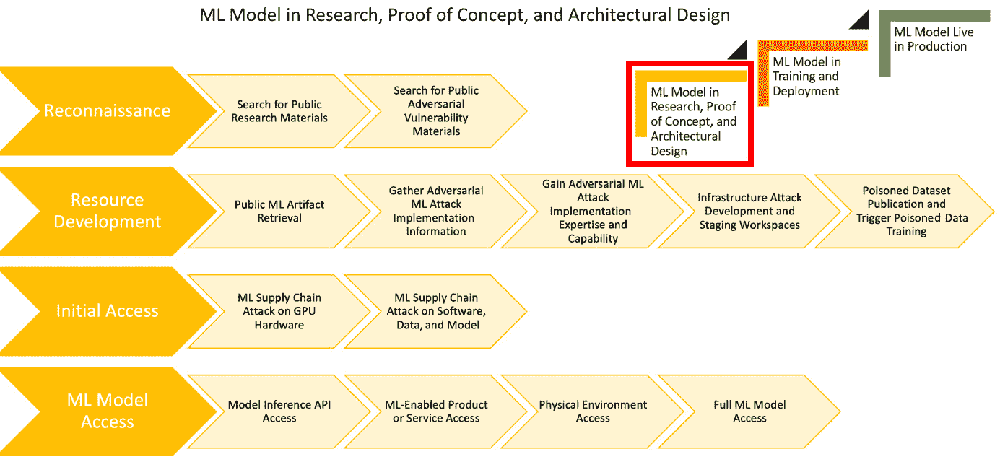

图 2.1 – 在机器学习模型设计和开发过程中的相关攻击阶段

我们可以看到，初期阶段的范围非常广泛，对手的行动可能对我们的模型和架构设计构成不利影响。现在，让我们讨论对手在尝试进行攻击时所采取的不同步骤。

### 侦察

**侦察**是对手主动或被动地收集信息的早期阶段，收集的信息将在后续的对抗阶段中使用，以促进**资源开发**、执行**初步访问**或导致持续的侦察尝试。一些与此阶段相关的风险和缓解措施如下所述。受害者减轻侦察尝试的最佳方法是将敏感信息对外部实体的可用性降到最低，并采用网络内容、网络流量、文件创建和应用程序日志监控代理，以便在从单一 IP 源检测到可疑活动（如机器人或网站抓取）时发出警报。

现在我们来描述侦察是如何进行的：

+   **主动扫描**：此步骤涉及对手通过扫描操作收集信息以进行目标定位。扫描和搜索操作（在网站/域名或开放技术数据库上）可能通过网络流量（如 ICMP 协议）在受害者基础设施上执行，或者通过外部远程服务或面向公众的应用程序收集信息。

+   **收集受害者主机/身份/组织信息**：此步骤涉及对手活动，旨在获取与受害者的管理数据相关的信息（例如，姓名、分配的 IP、功能、IP 范围、域名等）、配置（例如，操作系统、语言等）、部门/部门名称、业务操作以及主要员工的角色和职责。

+   `User-Agent` 字符串 HTTP/S 字段）自动删除恶意链接和附件。

+   使用反欺骗机制、提供对附件（`.pdf`、`.docx`、`.exe`、`.pif`、`.cpl`等）的限制访问权限，并启用电子邮件身份验证，可以有效防止钓鱼活动。

+   **搜索封闭源、开放技术数据库、网站和域名以及受害者拥有的网站**：对手进行的这些搜索操作有助于从信誉良好的私人源（如数据库、仓库或订阅技术/威胁情报数据的付费信息源）中检索机密信息。此外，域名/证书注册；通过流量和/或扫描收集的网络数据/痕迹；来自在线网站的业务、部门和员工相关信息；以及社交媒体等都可以帮助攻击者收集目标所需的信息。

### 资源开发

**资源开发**是对抗性行动的另一个早期阶段，在此阶段，攻击者致力于创建用于后续攻击阶段的资源。资源可以通过创建、购买或盗取来针对受害者。我们来更详细地分析这一点：

+   **公共机器学习模型获取**：这是对手从公共来源、云存储、面向公众的服务和数据仓库中获取机器学习模型（ML）工件的重要行为。这些工件可以揭示与用于训练、部署、测试和评估机器学习模型的软件堆栈、库、算法、超参数和模型架构相关的信息。对手可以利用受害者的代表性数据集或模型，修改并构建数据集和模型，从而训练适用于离线攻击的代理机器学习模型，而无需直接访问目标模型。组织可以采取的最佳控制措施包括以下几点：

    +   通过采用内建的多因素认证方案，启用多层次安全规则以全面保护数据集、模型和工件

    +   使用云安全规则和访问控制列表（ACL）提供对机器学习数据和工件的受限访问

+   **收集对抗性机器学习攻击实现信息**：机器学习算法和对抗性攻击代码的开源实现（如 CleverHans 或 ART（[`researchain.net/archives/pdf/Technical-Report-On-The-Cleverhans-V2-1-0-Adversarial-Examples-Library-2906240`](https://researchain.net/archives/pdf/Technical-Report-On-The-Cleverhans-V2-1-0-Adversarial-Examples-Library-2906240)）和 Foolbox（[`arxiv.org/pdf/1707.04131.pdf`](https://arxiv.org/pdf/1707.04131.pdf)））可能被攻击者滥用。这些开源工具不仅促进研究，也可以被用来对受害者的基础设施发起攻击。在本章中，我们通过示例展示如何使用 ART 和 Foolbox。

+   **获得对抗性机器学习攻击实现专业知识和能力**：在获得开源攻击工具信息后，攻击者可以深入研究论文，运用自己的思路制作攻击模型并开始使用它们。

+   **获取基础设施——攻击开发和部署工作空间**：在这一阶段，攻击者依赖于主要云服务提供商（如 AWS、Google Cloud、Google Colaboratory 和 Azure）提供的免费计算资源来启动攻击。使用多个工作空间可以帮助他们避免被检测。

+   **发布毒化数据集并触发毒化数据训练**：此步骤涉及创建毒化数据集（通过修改源数据集、数据或其标签），并将其发布，以破坏受害者的机器学习供应链。这些使用毒化数据的机器学习模型中所嵌入的漏洞在之后会被激活，且不易被检测到。

防御中毒攻击的策略之一是利用 De-Pois（De-Pois: 一种针对数据中毒攻击的攻击无关防御：[`arxiv.org/pdf/2105.03592.pdf`](https://arxiv.org/pdf/2105.03592.pdf)），这是一个用于构建模仿模型的攻击无关防御框架。该框架使用**生成对抗网络**（**GANs**）来训练带有增强数据的模型，并创建在结果上与原始模型行为相似的模型。通过评估目标模型和模仿模型之间的预测差异，该模型可以检测中毒样本。

除了增强对上述可能入侵的防御意识外，企业级防御框架应考虑一些安全瓶颈的方面，并采取适当的补救措施：

+   **建立账户**：在这个阶段，外部对手通过在不同的社交媒体平台上（如 LinkedIn）以及 GitHub 上创建账户来建立虚假身份，冒充真实人物。这些虚假身份可以用于积累公开信息、设置电子邮件账户和强化公开个人资料，进而在一段时间内帮助窃取信息。

防止此类行为的最佳策略是识别任何声称为组织工作或已向不同组织账户发送连接请求的可疑活动。

+   **获取能力**：在此阶段，对手依赖于窃取、购买或免费下载恶意软件、许可软件、漏洞利用、证书和与漏洞相关的信息。缓解措施包括以下几点：

    +   仔细分析和检测易于嵌入且与恶意软件提供者（如编译器、调试文档、代码片段或任何其他与**恶意软件即服务**（**MaaS**）相关的产品）相关的特征和服务。

    +   恶意软件仓库扫描和特征识别有助于将对手列入黑名单。

现在，让我们讨论一种防御策略，该策略使用开源 secml 库（[`secml.github.io/class6/`](https://secml.github.io/class6/)，一个安全评估框架）来构建、解释、攻击和评估安全性，使用的算法包括**支持向量机**（**SVM**）和 ClassifierRidge（一个自定义的 ML Ridge 分类器）。这些类型的分类算法可用于检测安卓应用中的恶意软件，并解释 ML 分类器模型的预测结果。

在以下代码片段中，我们加载了一个名为`DrebinRed`的 Android 应用程序玩具数据集。加载的数据集包含 12,000 个良性样本和 550 个恶意样本，这些样本来自 Drebin。通过使用 SVM 或岭回归分类器对数据集进行训练（采用 0.5:0.5 的训练-测试划分），我们观察到模型在正确识别良性和恶意样本时的**假阳性率**（**FPR**）为 2%：

```py
repo_url = 'https://gitlab.com/secml/secml-zoo'
file_name = 'drebin-reduced.tar.gz'
DrebinRed/' + file_name
output_dir = fm.join(settings.SECML_DS_DIR, 'drebin-red')
md5_digest = 'ecf87ddedf614dd53b89285c29cf1caf'
dl_file_gitlab(repo_url, file_path, output_dir,
branch='v' + min_version, md5_digest=md5_digest)
```

以下输出片段进一步说明了 Android 恶意软件检测器应用程序中最重要的组件。secml 使用`Gradient * Input`基于梯度的解释技术来解释分类阶段不同点的归因。最重要的特征（前五名）及其相关性（以百分比表示）有助于解释每个正确（非恶意软件组件）和被污染的样本，甚至这种方法/技术可用于解释稀疏数据集上的归因。

```py
Explanations for sample 137 (true class: 0)
 -7.49 suspicious_calls::android/net/Uri;->toString
 -5.63 suspicious_calls::getSystemService
 -5.42 api_calls::android/media/MediaPlayer;->start
 -4.99 used_permissions::ACCESS_NETWORK_STATE
 -4.55 req_permissions::android.permission.ACCESS_FINE_LOCATION
```

由于大约 25%的相关性归因于五个特征，这些特征对分类器易受对抗性规避攻击的影响更大。利用恶意软件检测器的这一行为，可以采用基于梯度的最大置信度规避攻击来生成对抗样本，攻击该分类器。这可以通过一次改变一个特征来触发 L1 阶稀疏攻击，将输出错误分类为 1 而不是 0，反之亦然。我们可以触发类似于以下代码片段中展示的攻击，其中特征添加比特征移除更能欺骗恶意软件分类器。移除特征可能会删除模型的其他重要组件，使得错误分类更难实现。相反，特征添加是一个轻松的方式，可以让模型将正确的（数据集中的良性部分）样本错误分类为被污染样本。

添加对抗样本后，我们可以使用`classifier`、`distance`以及其他参数触发规避攻击，如下所示：

```py
params = {"classifier": clf,
    "distance": 'l1',
    "double_init": False,
    "lb": 'x0', #feature addition, lb=0 for feature removal
    "ub": 1,  #feature addition
    "attack_classes": 'all',
    "y_target": 0,
    "solver_params": {'eta': 1, 'eta_min': 1, 'eta_max': None, 'eps': 1e-4}
}
from secml.adv.attacks.evasion import CAttackEvasionPGDLS
evasion = CAttackEvasionPGDLS(**params)
```

secml 通过使用`epsvalue`（在 0 到 28 之间变化，步长为`4`）来确定模型的鲁棒性。

为了测试 Android 恶意软件检测器在更多新增特征下的表现，我们可以对安全评估方法进行规避攻击，具体代码如下：

```py
from secml.adv.seceval import CSecEval
sec_eval = CSecEval(
    attack=evasion,
    param_name=param_name,
    param_values=param_values)
sec_eval.run_sec_eval(adv_ds)
```

现在，让我们绘制 SEC：

1.  以下代码开始获取 SEC 的过程：

    ```py
    from secml.ml.peval.metrics import CMetricTHatFPR, CMetricTPRatTH
    ```

1.  接下来，获取应计算检测率的 ROC 阈值：

    ```py
    th = CMetricTHatFPR(fpr=fpr_th).performance_score(y_true=ts.Y, score=score_pred[:, 1].ravel())
    ```

1.  最后，使用方便的函数来绘制 SEC：

    ```py
    fig.sp.plot_sec_eval(sec_eval.sec_eval_data, metric=CMetricTPRatTH(th=th),percentage=True, label='SVM', color='green', marker='o')
    fig.sp.ylabel(r'Detection Rate $(\%)$')
    fig.sp.xlabel(r"$\varepsilon$")
    ```

我们可以看到，SVM 分类器对对抗性攻击非常脆弱，尤其是对攻击最具影响力的特征特别敏感。攻击可以通过一个像 eps（ε）= 0.1 这么小的扰动来规避该分类器。当我们将特征数减少到少于 10 个（这些是最重要的特征）时，半数的被污染样本被错误分类为正确样本。

在下图中，*图 2.2*，标记为**A**的图表显示了 97%的检测率和 20 的 FPR。当ε增大时，检测率会下降；然而，我们观察到，Ridge 分类器（**C**）的下降非常陡峭，而 SVM（**B**）则呈阶梯式下降。由于 Ridge 分类器的下降更陡峭，它并不是比 SVM 更好的选择，后者将表现出更低的 FPR。请确保查看下图中的**SECs**，它们提供了随ε变化的检测率（%）的估算值。SEC 图帮助我们得出结论，即随着对抗性扰动的增加，恶意软件检测器的表现停止。


图 2.2 – SVM 和 Ridge 分类器上的恶意软件检测率和 SEC

**阶段化**是指对手在之前被攻陷或租用的基础设施上进行上传、安装和设置功能，以便针对受害者网络进行攻击。这些活动可能包括设置网页资源以利用受害者的浏览网站（窃取机密信息）或上传恶意软件工具以启动对受害者网络的攻击。没有有效的检测技术可以避免这种情况；然而，互联网扫描工具可能会揭示这些攻击的日期和时间。

### 初始访问

初始访问帮助对手利用公共面向的网络服务器上的安全漏洞并获得对网络的访问权限。这可能发生在开发的早期阶段，当模型设计和系统架构仍处于开发阶段时。减轻初始对抗访问的主要步骤包括通过适当的用户账户管理控制凭证滥用，发放有效账户，执行特权账户管理实践，定义组织密码策略（例如密码更改的频率），并建立系统化的用户培训流程和应用开发者指导，以限制任何不正当的系统访问。

现在让我们来探讨一下，如果对手成功获得初始访问，他们可能采取的不同行动：

+   **供应链妥协**：在这一步骤中，攻击者会妥协受害者系统的不同组件（如 GPU 硬件、数据及其注释、机器学习软件栈的部分内容或模型），以进行攻击。攻击者操控开发工具、环境、代码库、开源依赖项和软件更新/分发机制；妥协系统镜像；并通过替换合法软件（使用不同版本）来成功妥协受害者的系统。组织应通过使用技术验证分发的二进制文件（哈希检查），结合使用扫描恶意签名的工具，并进行硬件实物检查来减少篡改活动。即使使用补丁管理流程和漏洞扫描工具扫描依赖项、不必要的功能、组件和文件，也有助于通过在部署前执行严格的测试规则来防止攻击者的访问。

+   **驱动式妥协**：这涉及到攻击受害者的浏览器（攻击者可能通过 JavaScript、iFrames 和跨站脚本注入恶意代码，或者协助投放恶意广告）和应用程序访问令牌，这可以通过以下方式减轻：

    +   使用浏览器沙箱、部署虚拟化措施以及应用微分段逻辑。我们可以通过在数据中心和云环境中创建和定义区域来隔离应用程序和网页浏览器（以隔离工作负载），从而限制攻击。这是限制网络流量和客户端利用的最有效方法之一。

    +   使用**增强型缓解体验工具**（**EMET**）、具有 SSL/TLS 检测功能的网络入侵检测器、防火墙、代理服务器、广告拦截器以及脚本阻止扩展可以帮助控制利用行为，阻止恶意域名和广告，并防止 JavaScript 的执行。

+   **利用面向公众的应用程序**：由于这种技术涉及攻击者访问、利用并破坏面向公众的服务，如数据库、**服务器消息块**（**SMB**）以及其他具有开放套接字的应用程序，主要的修复任务在于安全架构师在设计和部署应用程序时进行隔离和沙箱化（限制被利用目标对其他进程的访问）、应用程序防火墙、网络分段（将公共接口分段到非军事区或单独的托管基础设施中）以及特权账户管理（遵循最小特权原则来访问服务），以限制攻击流量。此外，定期进行软件更新、补丁管理、漏洞扫描工具、应用程序日志和网络流量监控工具（使用深度数据包检查来发现恶意流量的痕迹，如 SQL 注入）可以用于检测不当的输入流量并发出警报。

+   **外部远程服务**：这种方法涉及对手发现面向外部的远程服务，如 VPN 或 Citrix，并找到从这些外部位置连接到内部企业网络资源的路径。为了减少这种风险，安全团队应格外小心：

    +   禁用或阻止不必要的远程可用服务，限制通过网络访问资源（通过提示使用受管的远程访问系统，如 VPN），启用多因素认证，并允许网络分段（通过使用网络代理、网关和防火墙）。

    +   促进与应用程序、会话登录和网络流量相关的日志监控，以检测已认证会话，发现异常的访问模式和操作时间，并帮助检测对抗行为。

+   **硬件添加**：在网络中引入额外的计算机配件或硬件组件，可能使对手进行被动网络监听、通过对抗者/中间人攻击修改网络流量、键盘注入或通过 **直接内存访问** (**DMA**) 读取内核内存。为了避免这种情况，应使用资产管理系统执行以下操作：

    +   限制通过网络访问资源，限制硬件安装，并使用硬件检测器或终端传感器来发现 USB、Thunderbolt 及其他外部设备通信端口在网络中的增加。

    +   此外，为了保护对抗性复制操作在可移动介质上的行为，组织政策应禁止或限制可移动介质的使用。

### ML 模型访问

对手可能通过四种不同的技术合法地访问 ML 模型，我们将在本节中进行讨论。最好的缓解策略是包含足够的安全规则（基于云和令牌的授权方案），以便对模型 API、ML 服务、物理环境和 ML 模型进行有效的访问授权，如下所述：

+   **模型推理 API 访问**：这涉及通过使用 API 限制对手访问，以发现 ML 模型的本体或类型。相应的防御措施是通过单一代理限制测试数据的引入，以防止与逃避 ML 模型和破坏 ML 模型完整性相关的问题。正如我们在 *第一章* 中所看到的，存在一种逃避攻击的可能性，攻击者通过隐藏垃圾邮件和恶意软件代码的内容来逃避检测。通过使用模型推理 API，也可以进行类似的攻击，将示例（单个数据样本）错误分类为合法的。

+   **ML 启用的产品或服务限制**：这种方法限制间接访问 ML 模型，从而隐藏与模型推理相关的信息，如日志和元数据。间接访问可能来自任何由对手构建的产品或服务，用以访问受害者的 ML 模型。

+   **物理环境访问**：为了消除数据工程管道中的对抗攻击范围，需要在多个层级的数据输入、预处理和特征工程中启用数据验证检查。

+   **完全的机器学习模型访问**：为了防止对手获得模型的完全访问权限，最佳的防御策略是结合隐私保护的机器学习技术进行数据聚合和训练，从而提供对抗白盒攻击的保护。否则，这些攻击使得对手能够完全掌握模型的架构、参数和类别本体，并在模型运行并使用生产数据时将模型外泄，进而执行离线攻击。

防御白盒（模型参数）和黑盒（输出预测）攻击的首选机制之一是训练模型并评估攻击的准确性。如果我们在发布模型之前使用**ML Privacy Meter**（一个帮助量化机器学习模型风险的 Python 库），我们可以通过发起攻击来测试模型，并确定模型泄露信息的倾向。这有助于我们作为对手，检测每个数据实例是否确实属于所需数据集。对抗此类攻击的模型训练可以通过两种方式完成：

+   **白盒**：通过观察模型的参数，当模型被部署在不受信任的云环境中或作为**联邦学习**（**FL**）设置中的参与模型之一时

+   **黑盒**：通过从输出中获取模型的预测

在模型训练和评估过程中，攻击的准确性在验证/测试集上进行评估。此外，只有在所有攻击模型中表现最佳的攻击模型上，准确性才被考虑。在*图 2.3*中，我们可以看到三张图表，展示了基于成员身份状态实际响应攻击的概率（范围为 0 到 1）。


图 2.3 – 整体隐私风险（左）和类 24 和 35 的隐私风险（中间和右）

使用以下代码，我们能够检测模型实现的准确性（正确识别训练数据集中的成员）与错误（错误识别或假阳性）之间的权衡。以下代码片段展示了如何调用攻击模型并验证每个成员通过对抗攻击被发现的概率：

```py
import ml_privacy_meter
import tensorflow as tf
datahandlerA = ml_privacy_meter.utils.attack_data.attack_data(dataset_path=dataset_path,
member_dataset_path=saved_path,
            batch_size=100, attack_percentage=10,
input_shape=input_shape,
            normalization=True)
```

发起攻击的方法如下所示，其中前两个参数指定目标训练模型和目标攻击模型，第三和第四个参数表示训练数据集和攻击数据集，而其余的参数用于指定层、梯度、模型名称等：

```py
attackobj = ml_privacy_meter.attack.meminf.initialize(
    target_train_model=cmodelA,
    target_attack_model=cmodelA,
    train_datahandler=datahandlerA,
    attack_datahandler=datahandlerA,
    layers_to_exploit=[26],
    gradients_to_exploit=[6],
    device=None, epochs=10, model_name='blackbox1')
attackobj.train_attack()
attackobj.test_attack()
```

此外，我们还可以看到每个输出类别的隐私风险直方图。第一个直方图显示，训练数据成员在每一步的风险都有所增加，而类别 24 的隐私风险在 0.4 到 1.0 之间分布得较为均匀。另一方面，类别 35 的隐私风险在大多数训练成员中更多地集中在 0.85 到 1.0 之间。整体隐私风险直方图是所有隐私风险类别的平均聚合。

## 模型训练与开发

如*图 2.4*所示，本阶段涉及模型训练和部署过程中的所有操作，在此过程中，攻击者开始提取模型和系统参数及约束，利用这些参数逃避目标环境中的防御框架，并为持续攻击做好准备。

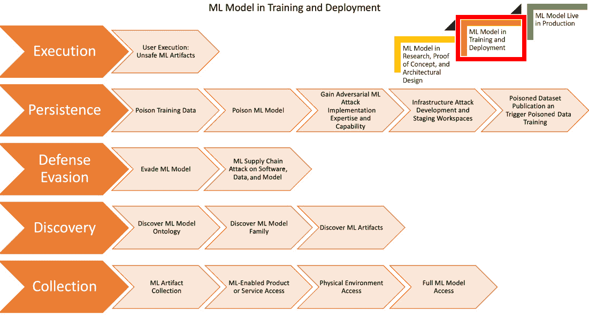

图 2.4 – 模型训练和部署过程中不同的攻击阶段

### 执行

不同的命令和脚本解释器可以被对手用来执行命令、脚本或二进制文件，将其嵌入为有效载荷以误导和诱捕受害者。容器管理命令和容器部署（无论是否具有远程执行功能）可以帮助对手在容器内执行命令，并促进容器在环境中的部署，从而规避防御措施。对手还可以被诱使安排任务，定期执行恶意代码，或强迫用户执行特定操作（例如，打开恶意文件）来执行恶意代码。

执行可以通过以下方式完成。

+   **用户执行 – 不安全的机器学习工件**：对手可能会开发不安全的机器学习工件（未遵循序列化原则），这将使他们能够获取访问权限并执行有害工件。

+   **客户端执行的利用**：对手可能会通过利用浏览器漏洞、进程间通信、系统服务和本地 API（及其接口层次结构），在客户端软件中利用漏洞，强制执行恶意内容。

+   **软件部署工具**：在获得企业第三方软件的访问权限后，攻击者可以更轻松地访问并擦除所有端点硬盘上的信息。

除了我们在第一阶段中检查的常用防御机制外，防御策略应侧重于对有害操作进行限制，例如以下几种：

+   限制通过网络访问资源（启用身份验证的本地和安全端口访问，以帮助通过 TLS 与 API 进行通信），特权账户管理（不允许容器或服务以 root 身份运行），终端行为防止，执行防止（使用应用控制逻辑和工具，如 Windows Defender 应用控制和 AppLocker，或软件限制策略），代码签名，应用隔离和沙箱化。

+   在采取系统级安全措施时，DevOps 和安全团队应明智地使用和管理操作系统的配置管理（强制计划任务以认证账户身份运行，而不是允许它们以系统服务身份运行）。

+   配置 Active Directory，以加强组策略执行，隔离并限制对关键网络元素的访问。

为了进一步遏制对手的执行操作，系统管理员应强制实施以下持久化措施，以防止不必要的入侵。

### 持久化

以下是防止入侵的操作列表：

+   防止执行未从合法存储库下载的代码（这意味着确保只有没有漏洞的应用程序允许设置`setuid`和`setgid`位）

+   特权账户管理（不要允许用户不必要地加入管理员组）

+   限制文件和目录权限

+   通过权限和审计限制库加载

+   用户账户控制（使用最高强制级别，消除绕过访问控制的可能性）

### 防御规避

防御规避包含对手用来逃避检测和现有安全控制的所有操作。对手足够强大，能够通过受害者系统突破并执行下表中列出的不受信任的活动：

| **项目** **编号** | **防御规避方式** |
| --- | --- |
| 1 | 卸载/禁用安全软件；提升特权权限；规避虚拟化/沙箱；隐藏程序、文件、网络连接、服务和驱动程序的存在；执行恶意代码；将反射代码加载到进程中以掩盖恶意载荷的执行；模糊和加密代码/数据（使用 XSL 文件嵌入脚本）。 |
| 2 | 受信任的进程可以帮助对手隐藏、掩盖恶意软件，并以使其看起来是合法操作的方式操纵特征伪影。通过运行恶意代码的代理执行或部署没有任何安全、火墙、网络规则、访问控制或用户限制的新容器镜像来绕过并削弱现有基于签名的防御。 |
| 3 | 执行进程或模板注入；执行脚本劫持代码流；修改身份验证过程、云计算基础设施、注册表、系统镜像、文件和目录权限、网络边界桥接（控制网络边界设备并允许禁止的流量通过），以及目标环境中的 Active Directory 数据（包括凭证和密钥）。 |

表 2.1 – 不同的机器学习模型防御规避模式

由于防御规避依赖于系统故障的滥用，应采取严格的安全措施以堵塞所有漏洞。前述的大多数防御策略在此适用。此外，需要特别关注的预防技术包括以下内容：

+   部署网络监控工具以过滤网络流量。

+   部署防病毒和反恶意软件检测器进行监控。

+   使用端点行为异常检测技术来阻止恶意载荷的获取和执行。

+   操作系统应配置为不枚举管理员账户并不泄露账户名。

+   在不使用时，应从程序中删除活动宏和内容，以减轻因执行恶意载荷而引发的风险。

+   应阻止不必要的脚本，密码应加密，网络设备的启动镜像应始终进行加密签名。

### 发现

发现阶段帮助对手了解受害者的账户、操作系统和配置（如*表 2.2*所列）以进行系统性规划，进而入侵受害者的系统。

| **项目编号** | **发现机制** |
| --- | --- |
| 1 | 浏览器数据（与银行网站、兴趣和社交媒体相关的信息），打开的应用程序窗口列表，网络信息（配置设置，如 IP 和/或 MAC 地址）、程序和服务（外围设备、远程程序和文件夹） |
| 2 | 系统（位置、时间和所有者）、云基础设施（实例、虚拟机和快照，以及存储和数据库服务）、仪表板、编排/容器服务、域信任关系、组策略设置（识别特权升级路径），以及与连接入口点相关的其他信息 |
| 3 | 快速改变恶意软件并与受害者的系统断开连接，以隐藏植入物的核心功能 |

表 2.2 – 不同的发现机制

由于对手的预先规划，最初的防御步骤包括以下内容：

+   启用对所有事件的监控，避免将任何可疑行为单独查看。顺序的信息发现和收集是更大攻击计划的一部分，如横向数据移动或数据破坏。

+   发现和证据收集（使用屏幕截图和键盘输入），这有助于在数据窃取行为中进行调解以证明行为的正当性。

### 收集

在发现数据源之后，攻击者将热衷于手动或通过自动化手段收集和窃取（外泄）机密敏感信息。常见的目标来源包括各种驱动器类型、可移动介质、浏览器会话、音频、视频、电子邮件、云存储和配置。其他信息来源还包括代码库、本地系统、网络共享驱动器、截图、音视频捕获和键盘输入。

## 机器学习模型在生产环境中的应用

如*图 2.5*所示，这一阶段涉及对机器学习模型和机器学习 SaaS 平台的大规模攻击。在这里，攻击者完全掌握系统级信息、数据和代理模型，这些对执行攻击并影响受害者的业务操作至关重要。


图 2.5 – 当机器学习模型在生产环境中运行时的不同攻击阶段

这一阶段涉及攻击者操控、干扰或破坏数据，以破坏系统完整性并扰乱业务操作。攻击可以从数据篡改活动到涉及制造对抗性数据的技术，以限制机器学习模型无法提供正确预测结果。

### 策划机器学习（ML）模型攻击

一旦发现和收集阶段完成，攻击者利用他们的新知识，通过训练代理模型并通过向目标模型注入对抗性输入来触发毒化攻击，从而智能地计划并攻击系统（在线或离线）。目标模型作为策划攻击操作的重要资源：

+   **收集机器学习工件**：一旦攻击者成功收集了网络中存在的机器学习工件信息，他们可能会将其导出，以便立即在策划机器学习攻击时使用。为了减少与收集模型工件相关的风险，请注意以下事项：

    +   机器学习模型训练方法应包括所有隐私保护技术。

    +   此外，所有访问控制列表（ACL）规则（与相关微服务的 ACL 规则）和加密逻辑应定期审核和重新审视。

+   **训练代理机器学习模型**：攻击者通常训练机器学习模型来创建代理模型，并以模拟的方式触发对目标模型的攻击。这种离线模拟帮助他们从目标模型中获取信息，并在没有更高级别访问权限或特权的情况下验证并发起攻击。

+   **复制机器学习模型**：在这一过程中，攻击者将目标模型复制为一个单独的私有模型，并将目标模型的推理结果记录为标签，用于训练离线私有版本的模型。这种操作涉及对受害者模型推理 API 的重复查询。为了限制来自同一 IP 的重复请求，防御者可以使用速率限制并将源 IP 列入黑名单，从而限制此类查询以及随之而来的推理次数。

+   **毒化 ML 模型**：对手可以通过注入毒化数据进行训练或仔细检索模型推理，从前述步骤中生成毒化模型。事实上，毒化模型是受害者端的持久性产物，对手可以利用这一点插入并触发具有完全随机模式和位置的后门触发器，规避后门防御机制，使监控工具难以检测问题并发出警报。

防御毒化攻击的一种机制是使用光谱特征（[`proceedings.neurips.cc/paper/2018/file/280cf18baf4311c92aa5a042336587d3-Paper.pdf`](https://proceedings.neurips.cc/paper/2018/file/280cf18baf4311c92aa5a042336587d3-Paper.pdf)），它应该能够检测由少数毒化输入子群体所造成的平均值偏差。该算法依赖于这样一个事实：两个子群体的均值与总体方差相比非常不同，因为这两个子群体展示了是否存在正确标记的样本或被破坏的样本。在这种情况下，可以使用`SpectralSignature`防御方法对 Keras 分类器进行应用，来识别一个包含错误标记的破坏性输入的子群体，它会返回一份报告（包含键值对索引的字典，作为怀疑毒化样本的异常得分）以及`is_clean_lst`，表示训练数据中的每个数据点是否为干净数据或毒化数据：

```py
defence = SpectralSignatureDefense(classifier, x_train, y_train,  batch_size=128, eps_multiplier=1, expected_pp_poison=percent_poison)
report, is_clean_lst = defence.detect_poison(nb_clusters=2,                                           nb_dims=10,reduce="PCA")
pp = pprint.PrettyPrinter(indent=10)
pprint.pprint(report)
is_clean = (is_poison_train == 0)
confusion_matrix = defence.evaluate_defence(is_clean)
```

+   **验证攻击**：此行为帮助对手根据选择的时机和受害者物理或虚拟环境的可用性来计划、准备并验证计划中的攻击。针对这种攻击的缓解策略很难实施，因为对手可以利用有限查询次数的推理 API，或者创建受害者目标模型的离线版本。这会导致受害者 API 账单费用增加，因为 API 费用直接由他们承担。

+   **制造对抗数据**：作为机器学习（ML）模型输入的对抗数据可能会被错误分类，增加能耗，或使模型容易失败。白盒优化、黑盒优化、黑盒迁移和手动修改是能够帮助对手生成输入数据样本以规避 ML 架构的流行算法。对手的关键目的是通过挑战 ML 模型的完整性来破坏其运行。

### 指挥和控制请求

这些操作帮助对手更进一步从受害者的网络中提取有用信息，如下表所示。

| **项目编号** | **控制操作模式** |
| --- | --- |
| 1 | 使用可移动介质（例如，通过在主机和目标网络上的其他受损服务之间发起通信），利用不常用的端口-协议对，或部署认证的 Web 服务。 |
| 2 | 将命令与现有流量混合，通过加密/回退（当主通道无法访问时）/多阶段混淆通道对请求进行编码/混淆，以触发命令，并与目标基础设施动态建立连接。 |

表 2.3 – 不同的控制操作模式

然而，攻击者足够聪明，可以以一种方式进行操作，使得目标网络上的现有防御策略不会触发警报。因此，以下是一些适当的防御技术：

+   启用特别设计的对抗性协议隧道，通过流量信号隐藏开放端口，并利用代理来避免命令与控制服务器与受害者网络之间的直接通信。

+   强烈建议使用前面讨论过的不同的应用层和网络层认证机制以及应用沙箱技术。

+   此外，通过适当配置防火墙来进行网络分段，以限制现有微服务、数据库和代理的外出流量是至关重要的。

+   只应为主机开放授权的端口和网络网关，以便主机通过这些授权接口建立通信。

### 外泄

在数据收集、加密、压缩和打包之后，攻击者可以通过网络进行外泄（如*表 2.4*所列），数据可以被打包和压缩成不同大小的块，然后通过命令与控制通道或替代通道策略从网络中传输出去。

| **项目编号** | **外泄模式** |
| --- | --- |
| 1 | 自动化外泄（未经授权的信息转移），通过替代协议进行外泄（依赖不同的协议，如 FTP、SMTP、HTTP/S、DNS 或 SMB，而不是现有的命令与控制通道），以及通过现有的命令与控制通道进行外泄（随着时间推移以规避防御） |
| 2 | 网络媒介（Wi-Fi 连接、调制解调器、移动数据连接、蓝牙或其他**射频**（**RF**）通道等） |
| 3 | 物理媒介（可移动驱动器）或 Web 服务（SSL/TLS 加密） |
| 4 | 将数据转移到云账户的定时传输 |

表 2.4 – 不同的外泄模式

执行外泄攻击最常见且最简单的方式如下：

+   **推理机器学习模型 API 用于外泄**：机器学习模型推理 API 访问是攻击者寻找外泄/窃取私密信息的主要途径。

为了缓解外泄风险，以下防御措施是必需的：

+   应该使用应用层隐私技术或最大化利用混合安全措施（应用层和传输层安全）来训练私密数据，以防止**个人可识别信息**（**PII**）泄露。

+   **数据丢失防护**（**DLP**）API 可用于检测并阻止通过未加密协议传输敏感数据。

+   网络入侵检测与防御系统可以与网络签名结合使用，以监控并阻止恶意流量。

+   通过使用网络代理限制 Web 内容访问可以帮助最小化未经授权的外部访问。

+   **规避机器学习模型**：对手可以使用传统的网络攻击，采取对抗性行动，避开基于机器学习的病毒/恶意软件检测。

+   **拒绝服务攻击（DDoS）**：在这种情况下，对手的目标是通过发起大量请求，使生产中的机器学习系统崩溃。这些请求可能计算密集，需消耗大量内存、GPU 资源和处理周期，可能导致生产化系统过载，响应变得缓慢。

+   **垃圾信息攻击机器学习系统**：在这种情况下，对手通过向机器学习系统发送虚假和任意数据，增加输出中的预测数量。这会影响受害者组织的机器学习团队，他们最终需要花费额外时间从数据中推导正确的推论。

+   **侵蚀机器学习模型完整性**：对手可能通过对抗性数据输入降低目标模型的性能，从而逐渐侵蚀系统的可信度。这可能导致受害者组织浪费时间和金钱，试图修复系统。

+   **资源收割成本**：这类似于 DDoS 攻击，对手通过针对受害者的机器学习服务发起攻击，通过向系统发送虚假和特别设计的查询，增加计算和运行成本。海绵示例是特制的对抗性输入，旨在提高处理速度和能耗，从而降低受害者系统的整体性能。

+   **机器学习知识产权盗窃**：在这种情况下，对手从机器学习模型、训练和评估数据集及其相关工件中窃取知识产权，目的是对受害组织造成经济损害。这种行为使对手能够无限制地免费访问受害者的服务，避免机器学习即服务（MLaaS）提供者的 API 费用。

+   **系统崩溃**：除了一些常用机制外，影响策略（如*图 2.5*中所示的第三种攻击策略）主要针对生产系统，包括各种不可恢复的数据销毁机制，如用随机数据覆盖文件和目录、篡改数据、篡改外观、清除数据、损坏固件、大规模加密目标系统上的数据，以干扰系统和网络资源的可用性，停止服务的命令、系统关机/重启以及资源劫持，目的是使受害者的系统资源崩溃。

缓解与影响相关风险的理想方式是遵循以下最佳实践：

+   拥有数据备份流程，以防止任何数据丢失/修改尝试。

+   制定模型鲁棒性测试策略，通过彻底测试 ML 模型对海绵攻击的抵抗能力。

+   最坏情况或低阈值边界用于验证模型的鲁棒性，也有助于检测对抗性攻击，其中系统性能的退化是外部来源输入的症状，这些输入并非为该系统设计。

到目前为止，我们已经讨论了攻击威胁矩阵，该矩阵首次出现在 *第一章*，*图 1.13* 中，以及针对不同类型对抗性攻击的不同防御机制。

现在让我们研究用于保护敏感数据的数据匿名化和加密技术。

# 匿名化和数据加密

由于可能遭遇不同的攻击和威胁，组织在保护员工数据权益方面变得更加负责任。2019 年的数据泄露调查显示，79% 的 CIO 认为公司数据在前一年因员工的行为而处于风险中（[`www.grcelearning.com/blog/cios-increasingly-concerned-about-insider-threats`](https://www.grcelearning.com/blog/cios-increasingly-concerned-about-insider-threats)）。多达 61% 员工的数据安全做法使公司面临风险，这促使组织采纳与数据匿名化相关的最佳实践。本节将讨论组织应遵循的一些做法，以遵守 GDPR 和其他法规。

数据匿名化或伪匿名化需要针对个人身份信息（PII）进行处理，主要包括姓名、年龄、**社会保障号码**（**SSNs**）、信用卡详情、银行账户号码、薪资、手机号码、密码和安全问题。

除此之外，公司政策和数据库管理员可以在应用匿名化技术之前定义额外的过程。现在，让我们看看一些最常用的数据匿名化技术。

## 数据屏蔽

该技术通过随机生成其镜像版本并与原始数据版本混合，来隐藏和保护原始数据。数据屏蔽有五种主要类型的措施，使攻击者难以解密原始数据：

+   **确定性数据屏蔽**：此过程允许将任何列值替换为表中任何位置的特定值——无论是在相同的行、相同的数据库/模式，还是在不同的实例/服务器/数据库类型之间。它考虑了类似的设置来生成替代的全局盐密钥（这些是加密元素，用于对数据进行哈希处理以确保安全性；例如，网站的 cookies）。例如，XYZ 可以替换为 ABC。

+   **动态数据遮蔽** (**DDM**)：此遮蔽技术的目标是对实时生产级数据进行遮蔽，使得实时数据流被修改，同时数据生成者/请求者无法访问敏感数据。通过设置中央数据遮蔽策略，可以使用完整或部分遮蔽功能来遮蔽敏感字段，同时对数值数据进行随机遮蔽。它还广泛应用于简单的事务性 SQL 命令（一个或多个 SQL 命令组合在一起，可以作为单一逻辑单元提交到数据库或回滚）（例如，在 SQL Server 2016（13.x）和 Azure SQL 数据库中）。现在，让我们来看一个在 Azure 中如何进行遮蔽的例子：

    ```py
    Email varchar (100) MASKED WITH (FUNCTION = 'email ()') NULL
    ```

在这里，`Email`方法使用遮蔽，只显示电子邮件地址的第一个字母和常量后缀`.com`，生成如下内容：aXXX@XXXX.com。

然而，动态遮蔽不能应用于加密列、文件流、`COLUMN_SET`或没有依赖其他列且没有遮蔽的计算列。

+   **即时数据遮蔽**：当数据从开发环境被遮蔽，而没有使用暂存环境时，这一过程很常见，原因包括额外空间不足，或数据必须迁移到目标环境的限制。此遮蔽技术常用于敏捷开发流程中，其中**提取、转换、加载** (**ETL**) 能直接将数据加载到目标环境，而不需要创建备份和副本。然而，通常建议不要广泛使用此技术（除了在项目初期阶段），以避免与合规性和安全性问题相关的风险。

+   `Julia Gee` 转为 `NULL Fhjoweeww`，`andwb@yahoo.com` 转为 `yjjfd@yahoo.com`。

+   **合成数据**：合成数据是一种数据匿名化技术，旨在保持原始数据集的统计特性，同时在可变隐私增益和不可预测的效用损失之间保持较大幅度的平衡。通过此方法提供的隐私保护能够防止与隐私相关的攻击，并防止个人身份的重新识别。通过生成模型（例如，使用深度学习技术生成深度伪造，其中合成数据再现了类似原始图像的虚假图像）生成的合成数据，确保通过生成与原始数据相似的推理，保持高效用性。

## 数据交换

该过程通过打乱和重新排列数据，彻底打破原始数据集与结果数据集之间的相似性。有三种常用的数据交换技术：

+   K-匿名性

+   L-多样性

+   T-接近性

这些技术都可以用于使数据的去匿名化对任何入侵者变得困难。

## 数据扰动

这种数据匿名化原则通过向数据库中的数值数据添加噪声，确保其机密性。添加或乘以随机噪声（加法噪声、乘法噪声，或使用高斯或拉普拉斯分布的随机噪声）有助于扭曲数据，从而保护其不被攻击者解析。

## 数据泛化

这种方法通过允许删除数据中的某些范围或部分（例如，异常值），使数据变得不容易识别。一个例子是将`年龄 45 岁`替换为`<= 45`，其中该值被一个更广泛的范围所替代，且在语义上仍然一致。这种数据分区或将属性分配到特定类别的方式可以作为对数据进行泛化的措施。

广义上，泛化可以应用于整个领域级别或单个子领域。在前者中，数据转换发生在通用领域或层次的级别上，而在后者中，泛化级别发生在同一领域的不同子集上。

基于泛化的技术可以进一步应用于分类或离散数值属性，以保持其私密性。泛化可以应用的主要方式有两种：*基于层次的方式*或*基于分区的方式*（其中需要在对连续数值属性进行分区方案之前，先对数据项建立分区的结构或顺序）。基于分区的方式将数据项分为不同范围，而基于层次的泛化要求存在泛化层次结构，可用于分类和离散数值属性。以下部分描述了这些泛化技术。

## K-匿名性

Sweeney 首次提出了 K-匿名性原则，这可以作为一个框架来评估涉及敏感信息的算法（[`epic.org/wp-content/uploads/privacy/reidentification/Sweeney_Article.pdf`](https://epic.org/wp-content/uploads/privacy/reidentification/Sweeney_Article.pdf)）。在缺乏 K-匿名性的情况下，敏感属性可能泄露并揭示出信息元素的边界限制。K-匿名性的应用旨在通过泛化或抑制来转换保护元素，以确保数据集不被入侵者获取。

K-匿名性确保任何由单个记录组成的概括性块，无法在任何一组准标识符（如邮政编码、年龄或性别）方面与 K-1 个其他个体区分开。这一匿名化原则有助于防范联结攻击，正如在*第一章*中讨论的那样。我们看到，在联结攻击中，攻击者能够揭示受害者的身份（如唯一标识号码、信用卡号等），并将其与其他背景信息（如用户的旅行细节，包括出发地、目的地和交通工具）结合起来。这些组合信息可以帮助攻击者追踪用户的整个行踪。例如，针对年龄、**社会安全号码（SSN）**、国籍、薪资和银行账户等受保护属性，如果 K 值为 10，则每种定义属性的组合将产生至少 10 条不同的记录。

如*图 2.6*所示，当 K=2 时，记录中有两个为亚洲人，两个为西班牙裔。我们可以看到，在这两种种族中，与年龄和薪资等敏感属性相关的记录数量是相等的。*图 2.6*展示了一个完整的端到端流程，显示了风险评分评估、信息识别、伪匿名化和匿名化过程，以便审计和存储敏感数据。

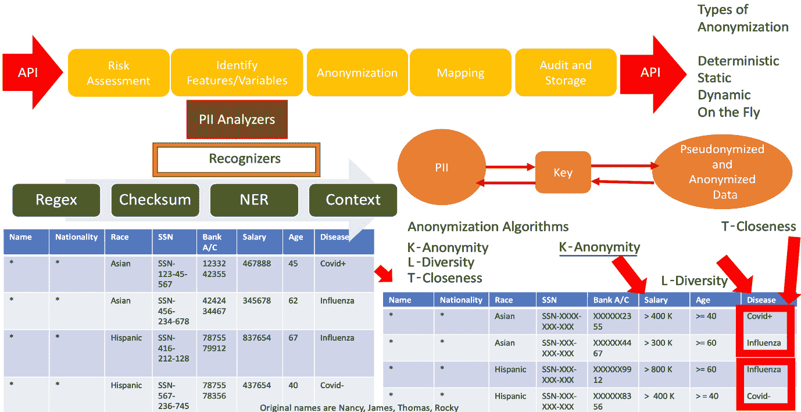

图 2.6 – 不同的匿名性模型 – K-匿名性、L-多样性和 T-接近性

该系统的局限性在于，如果攻击者事先掌握关于受害者的任何信息（例如，年龄），那么他们就更容易识别其他属性，如薪资和与疾病相关的信息。例如，南希的朋友可能知道她所属的年龄组和种族，这将使她的朋友能够猜测并获取她的薪水。相同薪资或年龄组的存在使得攻击者可以通过排除法或负面披露的过程推导出敏感信息。攻击者更容易成功发起攻击并充满信心。因此，已经提出了改进 K-匿名性的方法，以防止基于背景知识和同质性的攻击。

## L-多样性

L-多样性原则（由 Machanavajjhala 等人定义）旨在处理 K-匿名算法的缺点，以减少同质性和背景知识攻击的概率。L-多样性原则在数据发布者不了解攻击者所掌握的知识的情况下提供隐私保护。L-多样性的基本理念是要求每个组看到等同的敏感值。通过应用贝叶斯推理，已知信息可以被建模为概率分布，从而减少基础数据表示的粒度。泛化的主要目标是获得均匀分布的不同敏感数据值。

当数据分布存在偏斜时，算法的主要限制便显现出来，无法实现每个等价类的 L 个不同敏感值的均匀分布的熵。在这种情况下，表格的整体熵水平下降，算法变得无法运行，无法提供足够的保护。

尽管该算法考虑了每个组内敏感值的多样性，但它未能约束多样化组的值范围和边界。对于边界非常接近的特征（例如，薪资 > 2 万美元与薪资 > 3 万美元），攻击者可以从具有不同年龄组的两个等价类（具有相似边界的类）中检索薪资信息。

## T-紧密性

由于 K-匿名性和 L-多样性不能共同防范偏斜和相似性攻击，因此 T-紧密性应运而生，以增强匿名化框架的稳健性。该原则指出，两个分布——其中一个是任何组的敏感值分布（例如，种族组；在我们示例中的*图 2.6*中的亚洲人和西班牙裔人群），另一个是整体敏感值分布——它们之间的差异不能超过阈值`t`。用于评估两个分布之间差异的距离度量是**地球搬运工距离**（**EMD**）。它通过评估它们之间的最大距离来计算可能的敏感属性集合。该度量在 0 到 1 之间给出一个值，空间被归一化到 1，旨在包括属性值的语义接近度，以及准标识符的泛化和敏感值的抑制。

尽管**T-接近性**可以解决**K-匿名性**和**L-多样性**的缺点，通过提供免受同质性、背景知识、偏斜和相似性攻击的保护，但仍然容易受到最小性和组合攻击的影响。在前者中，攻击者推断出匿名化模型（K-匿名性、L-多样性和 T-接近性）不能为外部威胁提供足够保护的边界条件或最小性标准。利用这些信息，入侵者可以解密部分等价类的敏感信息。在第二类攻击中，攻击者利用匿名化数据集所有不同版本的可用性将它们集成为一个单一单位，其中统一的数据集用于突破个人隐私。

在其他较不流行的匿名化模型中，有 p-敏感 K-匿名性模型，它确保在`p`上的 K-匿名性条件。此外，它还同时阻止学习敏感关联。我们可以将匿名性模型表示为（∊，`m`）（敏感属性值频率∊在用户定义的等价类中保持在阈值内）。这设计用于保护敏感数值属性免受接近侵犯，其中数据边界过于接近，使攻击者能够以高信心收集到敏感属性值在指定区间内的信息。

加密

个人数据的加密是一种方法，用于保护数据免受外部来源的侵害，并限制未经授权的用户访问。可以使用对称加密、非对称加密和混合加密这三种主要的数据加密方案来进行密钥生成、注册、使用、存储、监视、旋转和删除。

**对称加密**技术，如**高级加密标准**（**AES**），速度快，并且可以通过处理器加速批量加密。此过程依赖于客户端和服务器之间预共享/交换的单个密钥，用于加密和解密目的。为了支持完整性和认证，可以在此基础上添加消息认证码。

**非对称加密**方案，如**Rivest**、**Shamir**、**Adleman**（**RSA**）、**数字签名算法**（**DSA**）和**椭圆曲线密码学**（**ECC**），使用两个密钥，一个公钥和一个私钥，并且对抗攻击的能力强大。然而，该过程速度较慢，对于在机器学习系统中保护数据的应用有限。通信各方负责秘密存储其私钥，而公钥则是共享的。这些步骤如下进行：

1.  使用**传输层安全**（**TLS**），发送方和接收方最终确定用于加密发送数据的对称密钥（会话密钥）。

1.  发送方负责使用接收方的公钥对对称密钥进行加密。

1.  对称密钥由接收者使用他们自己的私钥进行解密。

1.  使用对称密钥，接收者对数据进行解密。

现在我们已经概述了一些加密技术，让我们看看假名化的另一个抽象层次的过程，它进一步增加了对手破解加密密钥的难度。

## 假名化

这种方法有助于对数据进行匿名化，同时保持统计数据和数值的准确性。在此过程中可以使用不同类型的加密和哈希技术。个人身份信息（准标识符）被用假名编码并单独保存，这使得通过交叉引用或标识符容易重新识别原始数据。与匿名化技术相比，这个过程通过替代原则防止永久性的数据替换。假名化也可用于个人身份信息（PII）的加密与解密，其中原始数据被转换为密文，可以通过相关的解密密钥进行反向解密。

这一过程的主要缺点是，当数据集包含数十亿或数万亿条记录时，人工审核和重新评估或重新识别变得不可能。此外，当最敏感的字段需要精确值时，由于隐私与效用的权衡，我们可能会错过潜在的重新识别攻击源。

这一过程进一步允许 PII 的纵向或横向分发（通过将其存储在某些受保护的存储单元中），并保持标识符之间的联系。在纵向数据分发系统中，通过将不同敏感属性子集对应的个人数据分隔存储在不同地点来确保假名性。在横向数据分发系统中，靠近用户位置的站点负责存储具有相同用户属性集的数据。横向数据分发的一个主要例子是与健康相关的信息，在这种情况下，来自不同来源的数据整合是推断个体健康相关信息的初步步骤。

一些常见的假名化技术类型如下：

+   **使用秘密密钥加密**：个人身份信息（PII）可以使用前面讨论的对称或非对称加密方法进行加密，然后由所有者解密。

+   **哈希函数**：该函数用于将具有可变特征属性和数据大小的数据集转换为固定大小的输出。此方法往往存在泄露敏感 PII 的风险，如果已知哈希函数应用的输入值范围。为了提供更高的保护，可以使用加盐哈希函数，这种方法通过添加随机化来减少攻击者获取实际值的可能性。

+   **带有存储密钥的哈希函数**：用于转换的哈希函数将密钥作为输入，这进一步降低了攻击者通过重放攻击（即攻击者拦截网络）来恢复实际数据的概率。数据拥有者仍然可以使用密钥恢复数据，但对于攻击者来说，计算所有种类的排列并生成用于加密的实际密钥变得越来越困难。

+   **带有删除密钥的哈希函数**：该过程涉及为数据集中的每个特征选择一个随机数字作为伪名。此外，关联表被删除，以减少链接攻击的概率，在这种攻击中，攻击者可以将数据集中的个人数据与其他可用数据集中的其他伪名进行关联。这使得攻击者更难使用所有可能的排列来重放该函数并恢复原始数据。

+   **令牌化**：这种数据加密方法通过随机生成的令牌将敏感数据转换。这种方法在支付卡行业广泛应用于信用卡、钱包及其他涉及唯一标识符的应用（如 PAN 卡、驾驶证、社会安全号码等）。处理这些机密标识符的组织通常会使用一个令牌化服务，负责通过基于用户身份生成和验证令牌来进行支付授权。生成的令牌可以存储并映射在第三方服务提供商的数据库中。存储服务通过提供无限的数据保存能力来减少数据丢失的风险。第三方服务提供商的介入有助于减少与**支付卡行业数据安全标准**（**PCI** **DSS**）合规性相关的问题。

## 同态加密

**同态加密**（**HE**）因其提供的保护程度，在数据安全行业中获得了广泛关注，尤其是在高端云安全应用的设计中。该技术依赖于概率性非对称算法，并增加了一层额外的保护层，使得没有加密和解密密钥的方无法解密加密数据。与传统加密方法相比，这种方法的主要优势在于，它允许云服务提供商处理已经加密的数据，而无需先解密。处理后的结果以加密形式提供给数据拥有者，后者可以使用解密密钥检索处理结果。

同态加密遵循乘法加密和计算规律，其中加密和计算的顺序可以互换。任何计算，当它应用于数据集 *a* 和 *b*，在它们被单独加密为 *E*(*a*) 和 *E*(*b*) 后，都会得出与加密结果 *E*(*a ** *b*) 应用到计算结果时相同的结果。

因此，从数学角度来看，*E*(*a * b*) = *E*(*a*) * *E*(*b*)，其中 *E*(*a*) 和 *E*(*b*) 分别表示对数据集 *a* 和 *b* 应用的加密，*E*(*a * b*) 则表示对 *a* 和 *b* 的计算结果应用的加密。

由于它们是相等的，*E*(*a * b*) 和 *E*(*a*) * *E*(*b*) 的解密值也相等。

*图 2.7* 说明了同态加密（HE）的一个应用场景，帮助实现匿名数据处理（a）单一用户和（b）多个用户在云服务器上处理他们加密（使用公钥加密）敏感数据的情况。在第一个案例（a）中，个体可以直接获得由服务器计算、评估并返回的解密结果。在第二个案例（b）中，服务器可以通过去除身份信息来聚合个体数据，处理它们的加密数据，推断出统计信息，并将推断的数据发送回负责收集最终结果的第三方来源。第三方来源接收到数据后可以解密并获取推断的结果。

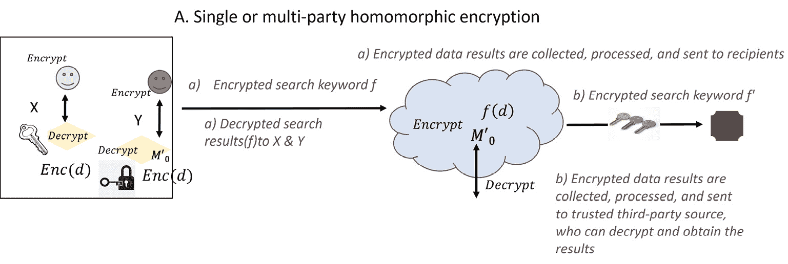

图 2.7 – 单方或多方同态加密（HE）

使用同态加密（HE）的多方代理可以有效地运行电子投票系统。单个选民可以使用他们的公钥加密选票并将其发送到投票服务器。云服务器利用同态计算对加密的选票进行额外的有效性检查，并计算汇总的加密结果。计算出的加密结果可以发送给组织者，组织者可以解密并推导出整体投票结果，而无需了解具体选民如何投票。

*图 2.8* 展示了使用同态加密（HE）与传统隐私保护方法相比，在隐私保护方法上的变化。在传统的隐私机制中，用户依赖于相关的云存储及其计算设施来进行数据传输、处理和存储功能。客户需要与服务提供商建立额外的信任关系，服务提供商不得在未经客户同意的情况下与第三方共享私人信息。如今，基于同态加密的隐私系统（例如微软的 SEAL 平台）除了加密存储和计算能力外，还能确保完全保护客户数据的机密性。

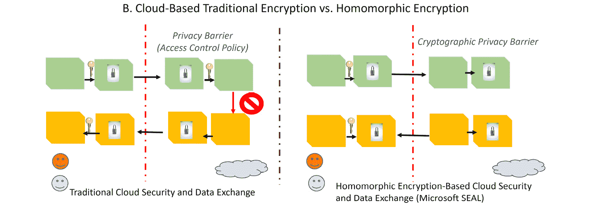

图 2.8 – 显示传统加密与同态加密（HE）对比的示意图

该方法论还可以高效应用于以下涉及云服务的安全领域：

+   私有存储与计算

+   私有预测服务

+   托管的私有培训

+   私有集合交集

+   安全协同计算

以下代码演示了在客户端实例化一个`Pyfhel`对象（包括公钥和私钥），并在上下文中生成和保存公私钥对。`contextGen`函数用于根据输入参数生成一个同态加密上下文。我们将公钥与上下文一起保存：

```py
HE = Pyfhel()
HE.contextGen(p=65537, m=2**12)
HE.keyGen() # Generates both a public and a private key
HE.savepublicKey(pk_file)
HE.saveContext(contx_file)
a = 1.5
b = 2.5
ca = HE.encryptFrac(a)
cb = HE.encryptFrac(b)
```

然后，我们尝试使用`PyCtxt`在云端解密加密值（`a`和`b`）。但如输出所示，解密过程在云端失败。随后，云服务器对加密值进行平均操作，并将其发送回客户端。客户端成功解密结果，并获得平均值（1.5 和 2.5 的平均值是 2）。

云端服务器尝试解密并对客户端发送的加密结果进行数学平均操作：

```py
c2a = PyCtxt(pyfhel=HE_Cl, fileName=sec_con / "ca.ctxt", encoding=float)
c2b = PyCtxt(pyfhel=HE_Cl, fileName=sec_con / "cb.ctxt", encoding=float)
try:
    print (HE_Cl.decrypt(c2a))
    raise Exception ("This should not be reached!")
except RuntimeError:
    print ("The cloud tried to decrypt but couldn't!")
```

云端计算前一步得到的密文的平均值：

```py
c_mean = (c2a + c2b) / 2
c_mean.to_file(sec_con / "c_mean.ctxt")
```

客户端加载并解密结果：

```py
c_res = PyCtxt(pyfhel=HE, fileName=sec_con / "c_mean.ctxt", encoding=float)
print ("Client decrypt results", c_res.decrypt())
```

这会生成如下输出：

```py
The cloud tried to decrypt but couldn't!
Client decrypt results 2.0
```

让我们看看这种技术何时可能派上用场。

### 同态加密的应用

同态加密广泛应用于需要强大计算能力来处理大量用户无法访问的敏感数据的场景。一些实际的应用包括基因组学研究、金融、医疗保健、制药、政府、保险、制造业和石油天然气行业的预测与分析案例，以下列表列出了这些应用：

+   利用云服务进行股市交易策略的回测，以确保数据在外部系统（包括攻击者和云操作员）面前仍然安全私密

回测

回测是一种策略，允许交易者利用历史数据模拟交易策略，生成结果并据此识别和分析风险与盈利性，从而在实际投资之前评估风险。

+   与欺诈检测、自动理赔处理和威胁情报相关的机器学习应用

+   基于机器学习的 SaaS 平台通过 DNA 测序分类器分析 DNA，向医疗机构和医院提供预测性洞察

+   基于机器学习的 SaaS 平台提供医疗诊断、医疗支持系统（如健康护理机器人）以及预防性护理

+   基于机器学习的复杂设计和架构模式，用于创新并运行新算法；还可以用于运行航空航天或建筑行业的机械结构分析

+   运行安全拍卖的预测平台

然而，HE（同态加密）的使用存在一些限制，例如数据库上的加密搜索（返回搜索结果而不泄露查询内容）或垃圾邮件过滤加密邮件。在前一种情况下，服务器无法确定搜索查询的内容，这将使服务器进行同态评估整个搜索操作时产生巨大的处理负担和成本。在垃圾邮件过滤的情况下，程序可以生成加密消息列表作为垃圾邮件，但在客户端不知道过滤标准（例如关键词）来判定哪些邮件为垃圾邮件之前，这些垃圾邮件无法被删除。

## 安全多方计算（MPC/SMPC）

这是在机器学习中用于训练私人敏感数据并创建防风险的机器学习模型的一种安全技术。在这里，参与者可以对私密数据进行计算，并用另一个参与者的私密数据来评估一个参与者的私密模型。

该协议基于秘密共享原理，其中一个分发者可以在 *n* 方之间共享一个秘密 *s*。该方案可以保护秘密免受 *t* 或更少参与者的泄露，同时，*t + 1* 个参与者的子集可以重建该秘密。参与者会在输出中获得各自的份额，帮助他们通过插值重建实际输出。如果只配置了少数选定参与者来获得其份额，参与者也可以仅将份额发送给相关个体。现在，让我们来探讨一些实际的使用案例，其中使用 MPC 来保护敏感数据。

Google 使用 MPC 来评估广告转化率，通过计算展示广告的用户与最终购买产品的用户之间的隐私保护集交集。一些组织依赖门限密码学而非传统硬件来保护加密密钥。在这种情况下，组织依赖 MPC 来进行密钥生成、计算和存储，而不是允许个人持有私密信息。

这一过程有助于组织保护密钥免受对手的攻击，因为密钥份额被放置在不同的环境中。MPC 对大数据和大规模预测系统最有用的特点如下：

+   它能轻松适应跨平台部署模型。

+   多租户的 MPC 可以作为云原生的**密钥管理** **服务** (**KMS**)运行。

+   可以在多个云平台（例如 AWS、Google 和 Azure）上同时运行，以最大化安全性和可用性。

+   支持混合云多站点企业部署。

+   易于扩展。

+   持续的安全操作。

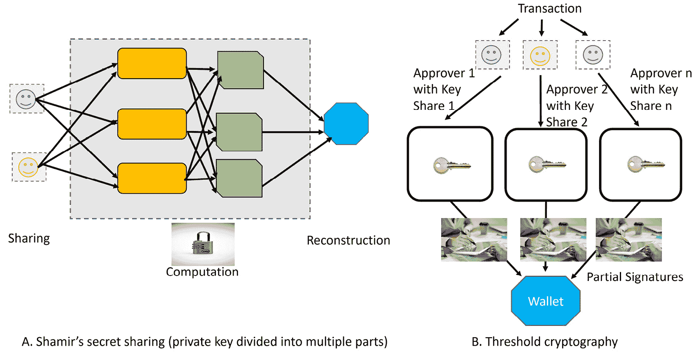

图 2.9 – SMPC – A. Shamir 的秘密共享和 B. 门限密码学

以下代码片段演示了如何使用`mpyc`库，通过五个传感器以隐私方式确定飞机的位置。每个传感器使用 SMPC 通信，通过共享秘密来加密敏感信息，如飞机的位置信息和到达时间：

```py
from mpyc.runtime import mpc
secint = mpc.SecInt(l)
scaling = 10**args.accuracy
locations[i] = mpc.input(list(map(secint, position_i)), senders=sender_pid)
toas[i] = mpc.input(secint(toas_i), senders=sender_pid)
x, y, z = await schmidt_multilateration(locations, toas)
```

在理解了多方通信中使用的不同加密方法以及机器学习模型训练过程中使用的隐私保护技术后，接下来让我们探讨如何在模型的训练阶段应用应用层隐私技术。

# 差分隐私（DP）

差分隐私（DP）是一种流行的应用层隐私保护框架，用于保护大型数据集中的私密或敏感数据。当在两个几乎相同的数据集上执行统计查询时，该方法保证几乎相同的输出，这两个数据集只在一个记录的存在与否上有所不同。

差分隐私通过隐藏任何单一记录（例如，个人可识别信息（PII））或小群体用户记录对预测结果的影响，提供抵御记录连接攻击的安全性。数据训练过程中对个体记录存在与否的匿名化以及信息可用性的保护，与数据隐私和防止连接攻击密切相关。累积损失定义为*隐私预算*，也称为**ε**（**ε**），表示提供的隐私量，其中低值表示高隐私级别。损失还与效用（准确性）的下降相关，数据科学家的任务是找到两者之间的可接受平衡。

*图 2.10* 展示了一个启用**随机梯度下降**（**SGD**）的差分隐私（DP）训练过程，损失函数的计算、随机噪声的添加以及梯度的裁剪在连续迭代中的过程。当查看该图时，请注意以下几点：

+   使用了从两个不同数据集（*D*1 和 *D*2，均∈ *S* 且仅在一条记录上有所不同）中随机抽取的数据点进行训练。

+   训练误差（或训练损失）是根据模型的预测输出和训练标签计算的，在后续步骤中，训练标签相对于模型参数进行求导。

+   该过程是迭代进行的，计算出的梯度（使用 SGD）应用于模型的参数，同时考虑到每个点在结果梯度中所留下的影响。

+   每个梯度的影响通过裁剪（或界定）梯度来控制。通过随机化过程，向每个数据点添加噪声，从而减少推断某个点是否包含在数据集中的确定性。

+   一旦模型收敛，计算最终的梯度以推导隐私估计，使得*O*1 – *O*2 < ε。


图 2.10 – 使用差分隐私在两个输入数据集 D1 和 D2 上训练模型

以下代码片段展示了必要的导入，包括 IBM 的 `Diffprivlib`，用于训练基于差分隐私的模型。第一步是导入必要的库，并从网上获取 `adult_income` 数据集，对于 `X_train`，我们只使用第 0、4、10、11 和 12 列，对于 `y_train`，我们使用标记为 income <=50K 或 >50K 的列：

```py
import numpy as np
import sklearn as sk
from sklearn.pipeline import Pipeline
from diffprivlib import models
X_train = np.loadtxt("https://archive.ics.uci.edu/ml/machine-learning-databases/adult/adult.data", usecols=(0, 4, 10, 11, 12), delimiter=", ")
y_train = np.loadtxt("https://archive.ics.uci.edu/ml/machine-learning-databases/adult/adult.data", usecols=14, dtype=str, delimiter=", ")
```

下一个代码片段展示了如何在管道的不同组件中结合差分隐私，如 `StandardScaler`、`PCA` 和 `LogisticRegression`。初步步骤涉及缩放特征属性，然后进行降维和机器学习模型分类。

`data_norm` 参数量化了我们添加的拉普拉斯分布随机噪声，用于生成差分隐私的机器学习模型。`bounds` 参数定义了数据的边界，并以 *min, max* 的元组值作为输入，这两个值代表在特征级别聚合后的标量。从 *图 2.11* 中可以进一步看出，准确度在 ε 从 10^-3 到 10^-1.5 的范围内波动，此后准确度变得稳定。这一观察结果进一步强化了我们的发现：在不影响准确度的情况下，选择准确度与效用之间的可接受权衡值，以增加更高的隐私边际是必要的。

```py
dp_pipe = Pipeline([
    ('scaler', models.StandardScaler(bounds=([17, 1, 0, 0, 1], [90, 160, 10000, 4356, 99]))),
    ('pca', models.PCA(2, data_norm=5, centered=True)),
    ('lr', models.LogisticRegression(data_norm=5))])
dp_pipe.fit(X_train, y_train)
for epsilon in epsilons:
    _eps = epsilon / 3
    dp_pipe.set_params(scaler__epsilon=_eps, pca__epsilon=_eps, lr__epsilon=_eps)
    dp_pipe.fit(X_train, y_train)
```

现在，当我们绘制结果时，我们得到以下图表，展示了准确度与 ε 的变化关系：

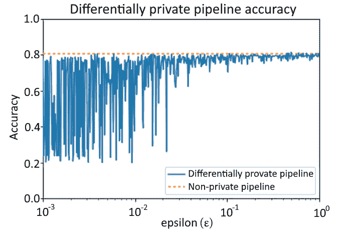

图 2.11 – 一个展示准确度和隐私预算（ε）权衡的差分隐私管道

到目前为止，我们已经理解了 ε 作为衡量差分隐私（DP）模型期望隐私性的重要指标。现在，让我们尝试理解第二个最重要的指标——敏感性。

## 敏感性

敏感性被定义为单个数据记录对响应数字查询的差分隐私结果产生的最大影响。对于任何任意的函数 *f*，在两个相邻数据集 *x* 和 *y* 上，*f* 的敏感性 *∆f* 可以如下表示：

Δ*f* = *max* { || *f*(*x*) – *f*(*y*) ||1 }，其中 ||.||1 表示向量的 L1 范数

## DP 的属性

差分隐私解决方案具有后处理的基本属性：

+   不变性/鲁棒性

+   可量化性

+   组合性

DP 的不可变性/鲁棒性确保对ε-DP 解决方案执行的额外计算也是ε-DP 的。此外，DP 的可量化特性使得其具有透明性的灵活性（对于数据科学家）。透明性揭示了随机化过程中噪声/扰动的确切数量。DP 算法的这一特征使其在其他传统去标识化算法中具有额外的优势。传统算法隐藏了数据转换过程，因此数据科学家无法解释和分析这些模型的准确性。此外，借助合成特性，可以通过对重叠数据集执行不同的 DP 算法来推导隐私的降级量。例如，在ε1-DP 和ε2-DP 上执行的两个 DP 算法是 DP 私密的，其组合为(ε1+ε2)-DP。

我们现在已经熟悉了在模型训练和推理过程中可以使用的各种隐私和安全措施。然而，这些方法各有其特定的优势，整个系统只有在混合安全支持的系统中才能充分发挥其效益。

# 混合隐私方法和模型

*图 2**.12*展示了前面章节中讨论的不同隐私组件级别的集成，以创建一个完全经过验证的隐私保护 AI 系统。**2**和**5**与模型所有者的访问相关，而**2’**和**5’**则与对抗者的访问相关，他们通过构造对抗数据来窃取重要的模型信息。

系统可以从多个异构设备中摄取数据（**1**和**2**），然后触发不同的算法训练（**3**、**6**和**8**）。这种混合系统不仅可以确保数据和算法的主权，还可以遵守伦理、合规、透明性和应用程序的可信度。主要目标是建立一个强大的伦理防御框架，保护单个数据记录免受身份或**成员推断攻击（MIAs）**的影响，通过识别其在数据集中的存在（**2’**）。

这一问题通过拥有一个私有 AI 单元来解决，该单元负责通过 DP（在模型训练过程中或模型收敛后）添加应用层隐私、匿名化和假名化（*图 2**.12*）以保护数据。在这里，DP 算法（使用 SGD 或教师集的私有聚合训练）的随机噪声和正则化可以增强抵御反转攻击的能力。

如我们之前所学，匿名化和假名化仍然为通过特征重新推导和重新识别（**2’**）提供了去标识化过程的空间，攻击者可以突破查找表。因此，需要采用额外的安全措施来保护不安全的存储。

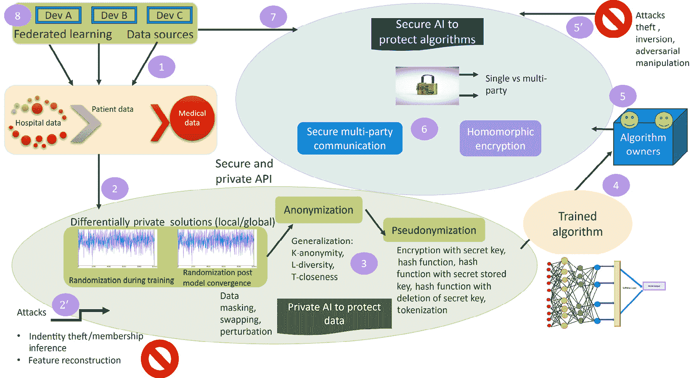

图 2.12 – 在混合隐私框架中应用不同的隐私措施

为了保护查找表相关的风险，人工智能研究集中于去中心化，其中远程执行成为训练全球模型的核心机制。通过将本地训练的机器学习（ML）模型及其权重、参数和数据（来自移动设备、**物联网**（**IoT**）和**医疗物联网**（**IoMT**）设备）更新到中央库，从而在全球层面聚合模型。然而，本地模型的权重仍然面临被对手通过中毒或模型反演/重建攻击（**5'**）修改传输参数的风险，在这种情况下可以使用安全多方计算（SMPC）和同态加密（HE）来有效应对现有的威胁。

联邦拓扑中的数据训练去中心化方法正在革命性地改变人工智能行业的隐私格局，因为设备在参与消息传递策略时能够保持主权。通过限制设备持续可用性，参与训练过程并与对等节点共享模型参数，帮助设备在较长时间内维持电池寿命。这不仅为这种联邦训练模式提供了更广泛的应用范围，还增强了数据和模型治理能力，其中可以监控每个设备发送模型参数的时间、收敛情况和性能指标。

**FL** 带来了在没有加密技术的情况下，模型参数和个人身份信息（PII）可能被对手从节点和通信接口中窃取或重建的潜在风险。因此，本地算法需要加密并安全地聚合，在这种情况下可以使用同态加密（HE）（有或没有差分隐私 DP）来安全地聚合加密的算法。神经网络带来的另一个可行风险是它们的压缩表示。这种压缩格式是通过应用以下机制之一实现的：剪枝卷积层、量化、张量分解、知识蒸馏，或者是所有上述方法的组合。如果没有加密，攻击者将容易执行模型反演或重建攻击，并以高精度恢复机密的模型参数。

你可以在*知识蒸馏：原理、算法、应用*中阅读更多关于知识蒸馏的内容：[`neptune.ai/blog/knowledge-distillation`](https://neptune.ai/blog/knowledge-distillation)，关于量化的内容请参阅*深度神经网络加速的剪枝与量化：综述*，[`arxiv.org/pdf/2101.09671.pdf`](https://arxiv.org/pdf/2101.09671.pdf)

该解决方案进一步扩展，包含了安全的多方计算，涉及多个参与实体，每个实体接收加密数据的一部分，以便进行后续处理。这种去中心化的方法消除了完全数据暴露或泄漏的风险，只有通过互相一致的方法才能恢复数据。SMC 也适用于半信任和低信任环境，但该方法的一个要求是各方之间持续的数据传输和设备的持续在线可用性，从而导致额外的通信开销。这对系统的可靠性、冗余性和可扩展性构成了限制，但可以通过为设备设计适当的休眠和唤醒周期来克服，更多内容将在*第十一章*中讨论。数据科学家应采用整体方法，结合所有讨论的隐私措施来验证预测的机器学习结果的完整性和质量。

# 对抗性风险缓解框架

本节中，我们将讨论一些新兴的风险缓解框架，这些框架针对模型在训练和服务过程中使用时，输入数据分布或模型架构的特定场景。这些框架在遏制现实世界攻击方面取得了很大的成功。一个例子是疾病识别，其中临床数据集被用于训练相关模型。在这种情况下，攻击者可以通过临床记录推断出某个病人可能患有特定疾病，并且有较高的成功率。

现在让我们讨论如何评估**MIA**的模型风险，其中对手能够复制主模型功能并触发对抗性攻击。MIA 可以是黑盒攻击或白盒攻击。在黑盒攻击中，攻击者只知道模型输入，并且只能查询模型的预测输出标签；而在白盒攻击中，攻击者知道模型的输入、架构以及模型的内部信息，如权重、偏置和其他系数值。

MIA（成员推断攻击）的目标是推测给定的数据记录是否属于目标数据集。为了构建 MIA 模型，采用影像训练技术生成成员推断的真实标签。*图 2**.13* 显示了 MIA 的概述。

MIAs 使攻击者能够确定目标模型*a*的训练集中是否存在特定数据点*z*。当这种攻击发生在使用敏感数据训练的模型上时，评估个体在数据集中的存在将暴露攻击者敏感的个人信息。MIAs 在**独立同分布（IID）**数据上表现出色，完全忽视了训练样本中的数据依赖关系，这低估了攻击的表现。这表明，研究应朝着评估漏洞并为相关数据制定防御技术的方向发展，以保护敏感信息。

因此，需要一种风险缓解技术，可以评估和标注存在此类数据依赖关系的机器学习模型（例如，所有成员来自某个特定健康区域（或医院），而非成员来自其他所有区域，或当两者都来自相同来源时）。为了评估这种关联风险，可以使用该框架来访问/测试模型在数据依赖关系存在且模型容易正确推断成员资格时的行为。例如，在 MIAs 的情况下，模型能够预测来自相同种族背景的人是否可能患有某种疾病。

该风险评估框架首先使用公共数据训练一组影子模型，模仿/模拟目标模型的功能。在下一步中，训练一个攻击模型，利用影子模型的输出揭示样本的成员资格状态。在识别阶段开始之前，可以通过将数据集分为成员和非成员（例如，通过聚类算法）来进行划分。

在以下代码片段中，我们使用`adult_income`数据集来训练一个影子模型（80%用于训练，20%用于测试数据拆分），并采用 CNN 方法。影子模型和攻击模型使用相同的数据集，在将数据集平分成两部分后进行训练。这个框架的目的是衡量差分隐私（DP）对 MIAs 的有效性。我们可以在最佳目标模型上进行 MIAs，并评估 DP 在不同隐私预算、噪声倍数和正则化值下提供的保护效果。

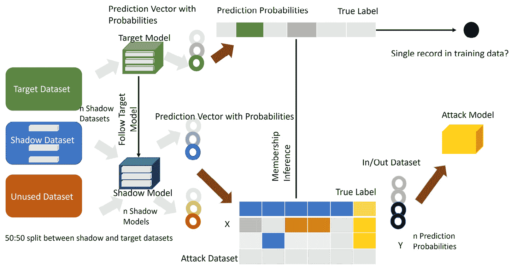

图 2.13 – 使用启用差分隐私（DP）训练的模型来衡量针对 MIAs 的模型鲁棒性

如*图 2.13*所示，我们这里使用的影子模型依赖于目标模型的架构和权重。因此，拥有一个白盒模型攻击可以简化我们的工作，因为可以从目标模型中重用相同的架构和超参数。影子模型在影子数据集上训练，以跟踪目标模型并生成训练攻击模型所需的真实标签数据。影子模型的概率输出与真实标签结合，生成攻击数据集，其中攻击数据集的输入根据是否用于训练影子模型，标记为`in`或`out`。

由于训练集和测试集的数据来源相同，因此攻击准确率大约为 50%。但是，如果目标模型的私有训练数据集与训练影子模型的公共数据集不重叠，攻击准确率将会降低。这个 MIA 攻击模型已经使用`RandomForestClassifier`进行了训练。攻击模型可以执行多次攻击，执行次数为*n*：

1.  我们的第一步是使用影子数据集创建一个影子模型实例：

    ```py
    SHADOW_DATASET_SIZE = int(shadow_X.shape[0] / 2)
    smb = ShadowModelBundle(
        shadow_model,
        shadow_dataset_size=SHADOW_DATASET_SIZE,
        num_models=)
    ```

1.  在下一步中，我们使用与目标模型相同的参数训练影子模型，并生成攻击数据：

    ```py
    attacker_X, attacker_y = smb.fit_transform(shadow_X, shadow_y.values,                                         fit_kwargs=dict(epochs=epochs,
    batch_size=batch_size,verbose=1))
    ```

1.  训练完影子模型后，我们使用`RandomForestClassifier`训练攻击模型：

    ```py
    clf = RandomForestClassifier(max_depth=2)
    clf.fit(attacker_X, attacker_y
    ```

1.  下一步是评估攻击的成功与否。为此，我们将用于训练的数据点与未在训练中出现的数据点进行区分，并对独立变量和目标变量分别进行处理：

    ```py
    ATTACK_TEST_DATASET_SIZE = unused_X.shape[0]
    data_in = target_X_train[:ATTACK_TEST_DATASET_SIZE], target_y_train[:ATTACK_TEST_DATASET_SIZE]
    unused_X1 = unused_X.values.reshape((unused_X.shape[0],
    unused_X.shape[1], 1))
    data_out = unused_X1[:ATTACK_TEST_DATASET_SIZE], unused_y[:ATTACK_TEST_DATASET_SIZE]
    ```

1.  最后一步是通过比较攻击模型的预测结果与成员标签，来计算攻击测试数据的攻击准确率。攻击数据已按照`AttackModelBundle`的预期格式进行准备：

    ```py
    attack_test_data, real_membership_labels = prepare_attack_data(tm, data_in, data_out)
    attack_guesses = clf.predict(attack_test_data)
    attack_accuracy = np.mean(attack_guesses == real_membership_labels)
    print('attack accuracy: {}'.format(attack_accuracy))
    acc = accuracy_score(real_membership_labels, attack_guesses)
    print('attack acc: {}'.format(acc))
    ```

这两个模型都是通过 DP 训练的，使用的是`DPKerasSGDOptimizer`，它是一个基于`SGDOptimizer`的优化器，用于 DP。`noise_multiplier`是一个传递给优化器的参数，用来控制采样并添加到梯度中的噪声量。`steps`参数表示优化器在训练数据上执行的步数/训练轮数，而`l2_norm_clip`参数提供了一种机制，通过考虑每个 mini-batch 中单个梯度的最大欧几里得范数，来调节优化器对单个训练点的敏感度：

```py
optimizer = DPKerasSGDOptimizer(
    l2_norm_clip=l2_norm_clip,
    noise_multiplier=noise_multiplier,
    num_microbatches=int(microbatches_perc * batch_size),
    learning_rate=learning_rate)
```

1.  第一项任务是按照前面的代码片段设置优化器。接下来，我们计算每个样本的损失向量，而不是其在一个 mini-batch 中的平均值。如下一个代码片段所示，我们使用 Keras 将模型损失与模型分类器进行编译：

    ```py
    loss = tf.keras.losses.SparseCategoricalCrossentropy(from_logits=True, reduction=tf.compat.v2.losses.Reduction.NONE)
    classifier.compile(optimizer=optimizer, loss=loss, metrics=['accuracy'])
    ```

epsilon 的计算在下一个代码片段中给出。采样概率是使用 `batch_size` 和输入数据大小的倒数（即 delta）计算的，输入数据集中的大小约为 50,000。概率指标表示单个训练点被包含在小批次中的概率，之后与噪声倍增器一起用于评估 `rdp`，最终用于计算 epsilon。这是可以用来判断隐私保障的最终模型指标，通过考虑单个训练记录样本的包含（或去除）如何影响特定模型输出的概率变化。微批次的概念是在 `tensorflow_privacy` 中引入的（[`github.com/tensorflow/privacy`](https://github.com/tensorflow/privacy)），通过提供一定程度的并行性来促进更快的处理，在这种方式下，梯度不再按样本逐个裁剪，而是以微批次为粒度进行裁剪。

该过程可以对微批次中平均的 32 个梯度进行裁剪，每个微批次包含 8 个数据样本：

```py
sampling_probability = batch_size / 50000
steps = epochs * 50000 // batch_size
orders = [1 + x / 10\. for x in range(1, 100)] + list(range(12, 64))
rdp = compute_rdp(q=sampling_probability,
                  noise_multiplier=noise_multiplier,
                  steps=steps,
                  orders=orders)
epsilon = get_privacy_spent(orders, rdp, target_delta=1e-5)[0]
print("Privacy Budget Epsilon", epsilon)
```

*表 2.5* 展示了关于 epsilon、噪声倍增器和攻击模型指标的研究。当噪声倍增器的值增加时，epsilon 会减少，这意味着隐私预算会增加。尽管大多数攻击模型指标保持不变，但当 epsilon 从 1.2203 减少到 0.3283 时，攻击准确率下降了 1%。这一点进一步证明了更高的隐私性增强了模型对攻击的鲁棒性（至少在某种程度上）。攻击指标还显示出低精度和高召回率，这意味着存在更多的假阳性（即被误认为来自训练数据集的记录，实际上并非如此）以及正确识别出相关记录在训练数据集中的存在。然而，使用差分隐私（DP）训练的模型仍然不足以抵御 MIA（模型反向推断攻击），尤其是在数据相关时。

| **Epsilon** | **噪声倍增器** | **攻击指标** |
| --- | --- | --- |
| 1.2203 | 0.8 | 攻击准确率：0.5023300438596491 精度：0.5012701733413031 召回率：0.9195449561403509 |
| 0.6952 | 1.0 | 攻击准确率：0.5006167763157895 精度：0.5004499550044995 召回率：0.6859923245614035 |
| 1.2203 | 1.2 | 攻击准确率：0.5023300438596491 精度：0.5012701733413031 召回率：0.9195449561403509 |
| 0.3283 | 1.4 | 攻击准确率：0.49828673245614036 精度：0.4988314480695522 召回率：0.731359649122807 |
| 0.2523 | 1.6 | 攻击准确率：0.49828673245614036 精度：0.49885352655232507 召回率：0.7454769736842105 |
| 0.20230 | 1.8 | 攻击准确率：0.49897203947368424 精度：0.49929158401813545 召回率：0.7245065789473685 |
| 0.16715 | 2.0 | 攻击准确率：0.49780701754385964 精度：0.49852643212377973 召回率：0.7419133771929824 |

表 2.5 – 显示 epsilon 和噪声倍增器变化的表格

## 模型鲁棒性

模型的鲁棒性是衡量模型性能的标准之一，它考虑到模型输入中不可区分的变化。不同的扰动技术帮助我们比较和基准测试机器学习模型在鲁棒性指标上的表现。Python 包 **Foolbox** ([`arxiv.org/pdf/1907.06291.pdf`](https://arxiv.org/pdf/1907.06291.pdf)) 通过生成对抗扰动来帮助确定模型的鲁棒性。这是基于一个事实，即当应用最小扰动生成对抗样本时（例如，图像），它有助于量化模型对预先输入的对抗样本的鲁棒性，并展示模型对对抗攻击的易受攻击性。该框架提供的灵活性使得超参数调整成为可能，从而帮助评估最小对抗扰动，导致输出中的预测类别概率发生误分类。

要使用该工具箱进行不同的攻击，我们需要输入、标签、模型、对抗准则以及衡量扰动长度的距离参数，称为 *L*1 范数。我们还可以通过复合模型功能进行组合与匹配，其中一个模型的预测结果可以与另一个模型的梯度结合，从而允许我们通过利用基于梯度的攻击启动不可微分的模型。该工具提供了多个准则，用于启动攻击，在这些准则下，给定的输入和标签可以被视为对抗样本：

+   **Misclassification**：模型输出中错误的预测类别

+   **TopKMisclassification**：修改对抗输入，以改变原始类别，使其与前 k 个预测类别之一不同

+   **OriginalClassProbability**：修改对抗输入，使原始类别的概率低于指定的阈值

+   **TargetedMisclassification**：修改对抗输入，使得预测类别变为目标类别

+   **TargetClassProbability**：修改对抗输入，以增加目标类别的概率超过阈值

现在，让我们通过以下代码片段来研究必要的导入，这些导入可以触发对 PyTorch 重置模型的对抗攻击：

```py
import torchvision.models as models
import eagerpy as ep
from foolbox import PyTorchModel, accuracy, samples
import foolbox.attacks as fa
import numpy as np
```

在完成必要的导入后，让我们如下触发攻击：

```py
model = models.resnet18(pretrained=True).eval()
preprocessing = dict(mean=[0.485, 0.456, 0.406], std=[0.229, 0.224, 0.225], axis=-3)
fmodel = PyTorchModel(model, bounds=(0, 1), preprocessing=preprocessing)
images, labels = ep.astensors(*samples(fmodel, dataset="imagenet", batchsize=16))
clean_acc = accuracy(fmodel, images, labels)
print(f"clean accuracy:  {clean_acc * 100:.1f} %")
attacks = [fa.FGSM(),fa.LinfPGD(),fa.LinfBasicIterativeAttack(),
fa.LinfAdditiveUniformNoiseAttack(), fa.LinfDeepFoolAttack()]
epsilons = [0.0,0.0005,0.001,0.0015,0.002,0.003,0.005, 0.01, 0.02, 0.03, 0.1, 0.3, 0.5, 1.0]
```

在前面的例子中，我们观察到以下情况：

+   我们展示了几种攻击，包括 **快速梯度符号方法** (**FGSM**)（扰动所加的噪声与成本函数的梯度同向）

+   **Linf 投影梯度下降**（白盒类型，攻击者可以访问模型梯度并能更改代码以规避基于机器学习的检测系统）

+   **L-infinity 基本迭代方法**（通过评估两个图像之间的绝对值差异生成对抗样本，返回所有像素中的最大距离）

+   **AdditiveUniformNoiseAttack**和**DeepFoolAttack**（一种基于快速梯度的对抗攻击，通过修改模型分类器为线性分类器，考虑到最小距离以到达类边界）在预训练的 ResNet 模型上执行，改变执行攻击的步数（由 epsilon 表示）

然后，通过改变执行攻击的步数，对预训练的 ResNet 模型执行上述攻击：

```py
for i, attack in enumerate(attacks):
    _, _, success = attack (fmodel, images, labels, epsilons=epsilons)
    assert success.shape == (len(epsilons), len(images))
    success_ = success.numpy()
    assert success_.dtype == np.bool
    attack_success[i] = success_
    print("  ", 1.0 - success_.mean(axis=-1).round(2))
```

模型的鲁棒准确性可以如下评估。该度量表示在对模型的最佳样本触发攻击时，模型的准确性：

```py
robust_accuracy = 1.0 - attack_success.max(axis=0). mean(axis=-1)
```

结果如下所示：

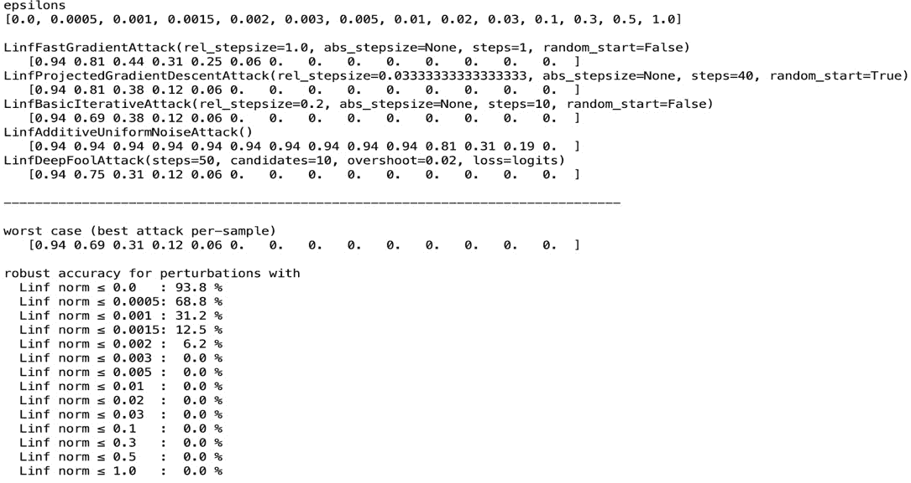

图 2.14 – 不同攻击下鲁棒准确率的变化

### 带约束的模型鲁棒性

通过使用对抗扰动和约束来训练模型，可以增加模型的鲁棒性。添加领域约束（就像在设计网络的人工智能解决方案时一样，例如入侵检测系统）对对手施加了额外的限制和挑战，要求其维持输入特征之间的复杂关系，以便触发和实现攻击。尽管领域约束限制了对手通过生成扰动样本来触发攻击的能力，但对手通常仍然可以创建现实的（符合约束的）示例。研究结果表明，当模型被强制执行约束时（其中约束变量的集合通过可解的线性程序进行优化），模型的鲁棒性得到提升，准确率可提高 34%。设计时考虑约束的威胁模型能够合理评估现实的攻击向量，并成功优化防御性能。

一个相关的例子是基于 AdvGAN 和 FGSM 的防御性能（[`www.hindawi.com/journals/scn/2021/9924684/`](https://www.hindawi.com/journals/scn/2021/9924684/)），如*图 2.15*所示，其中**A**是没有约束训练的，而**B**是带约束训练的。


图 2.15 – 使用对抗扰动训练时的模型准确率 A) 无约束和 B) 有约束

### 模型鲁棒性度量

FGSM、JSMA、DeepFool 和**Carlini 和 Wagner**（**CW**）攻击在生成对抗样本和触发对抗攻击方面非常有效，导致预测输出的误分类。在为神经网络输入对抗性输入进行训练的过程中，评估模型鲁棒性的度量方法已经进行了严格的研究。

这项研究提出了改进的鲁棒性度量方法，其中一个度量标准叫做**跨利普希茨极值网络鲁棒性**（**CLEVER**），它定义了攻击成功所需的最小失真度的近似下限。这个鲁棒性度量是与攻击无关的（即使是对不同类型的分类器和神经网络（如 ResNet、Inceptionv3 和 MobileNet）进行强大攻击时，也能成功）。研究还发现它适用于连续可微函数到特殊类型的不可微函数——具有 ReLU 激活的神经网络。CLEVER 度量作为比较不同网络设计和训练过程的技术手段。

该算法首先在每个批次中，以独立且均匀的方式生成位于给定样本周围的*N*个样本，批次总大小是固定的。然后计算每个样本的梯度范数，并评估这些*N*个样本中最大梯度值。最小值用于确定最大似然估计，进而用于检索分布参数（逆威布尔分布），并最大化这些梯度的概率。

对不同目标类别获得平均 CLEVER 得分。较高的 CLEVER 得分意味着网络具有更好的鲁棒性，其中最小的对抗扰动将*L*p 范数提升到更高的值。IBM 提出的这一框架为构建可靠系统奠定了基础，而不需要特定的对抗攻击。

这个 CLEVER 得分可以用来评估卷积神经网络（CNN）的有效性，并帮助我们验证神经网络的抗攻击能力。例如，在任务关键型应用（如自动驾驶车辆）中，分类鲁棒性的评估可以增加人类的信心，并作为合规性和伦理性的重要指标。

如果引入对抗扰动影响了交通标志识别的准确性，并导致限速标志被误分类，那么这将对人类产生灾难性的影响。因此，在大规模部署模型之前，必须评估机器学习模型在合适鲁棒性度量标准下的表现。IBM 提出的这一度量标准考虑了 CNN 网络架构，包括卷积层、最大池化层、批归一化层和残差块，以及常见激活函数，并将每个像素的扰动限制在一个阈值范围内，以确保网络分类不受任何外部攻击的影响。IBM 研究进一步确认，这一度量标准通过每一层输入和输出关系得出一个计算效率较高的矩阵。*图 2.16*展示了 18 个不同 ImageNet 模型的鲁棒性（由 CLEVER 分数确定）与准确率之间的权衡。近期的研究提出了一个新的防御框架，名为 TRADES（[`proceedings.mlr.press/v97/zhang19p/zhang19p.pdf`](http://proceedings.mlr.press/v97/zhang19p/zhang19p.pdf)），它优化了对抗鲁棒性，在准确性和鲁棒性之间实现了权衡，为黑盒和白盒攻击提供了强大的抗干扰能力。

研究发现，当深度神经网络通过正则化输入梯度进行训练时，它们变得更加鲁棒且易于解释。梯度正则化指的是通过添加约束来控制输入特征梯度相对于损失函数的变化。因此，除了寻找模型准确率和 CLEVER 分数之间的最佳权衡外，我们还应寻找模型准确率和可解释性之间的最佳权衡。我们还应意识到，深度学习模型的准确性或预测能力较高，而线性模型和广义加法模型的可解释性则更强。按可解释性的大小顺序排列，我们可以这样说：线性模型、广义加法模型、决策树、支持向量机（SVM）、随机森林和神经网络。

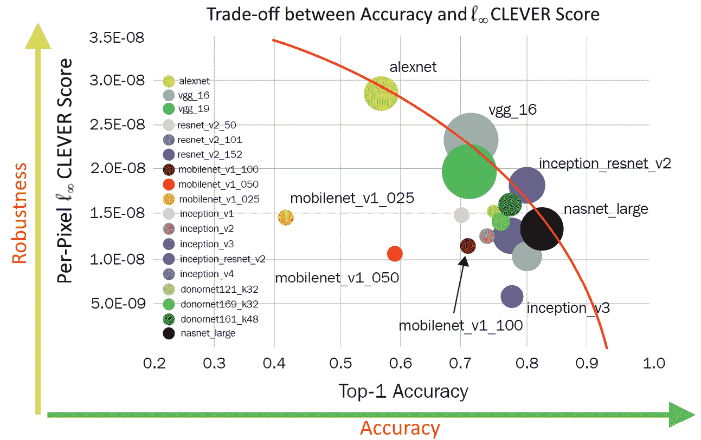

图 2.16 – 模型 CLEVER 分数（鲁棒性）与准确率之间的权衡

# 概要

在本章中，我们已经学习了关于在数据和模型生命周期管理的不同阶段中减轻攻击的不同防御实践。我们讨论了可以用于数据匿名化、去匿名化、使用差分隐私训练机器学习算法以及加密传输方法的不同云组件、技术和措施。在此基础上，我们深入探讨了对抗风险缓解框架（特别是基于开源深度学习的框架），这些框架可以在部署之前测试机器学习模型的健壮性，并将机器学习模型暴露给公共 API。利用现有框架并设计新框架可以提供对抗试图破坏人工智能模型、系统和服务的半诚实或不诚实参与者/对手的韧性。此外，我们还看到了分散化数据存储、FL 以及高效的加密和隐私措施如何作为下一代、潜力巨大的隐私启用系统的设计选择。

在接下来的章节中，我们将探索一些防御管道创建方法、优化策略和指标，以及它们在权衡准确性、可解释性、公平性、偏见和隐私（隐私-效用权衡）方面的能力。所有这些重要参数作为生产安全、私密、可审计和客观设计的值得信赖的人工智能系统的先决条件，使其能够被消费者和决策者普遍接受。

在下一章中，我们将了解到实施正确标准和最佳实践的不同法律和政策，以构建完全符合伦理的系统。

# 进一步阅读

+   *数据脱敏*: *它是什么，它如何工作，类型和最佳实践*, Cem Dilmegani:[`research.aimultiple.com/data-masking/`](https://research.aimultiple.com/data-masking/)

+   *远程机器学习服务中隐私风险的防御框架,* 杨白, 余丽, 谢明创, 和樊明宇:[`www.hindawi.com/journals/scn/2021/9924684/`](https://www.hindawi.com/journals/scn/2021/9924684/)

+   *关于 k-匿名性、l-多样性和 t-接近性技术在医疗数据中的研究. 17,* Rajendran, Keerthana, Jayabalan, Manoj, 和 Rana, Muhammad Ehsan. (2017):[`www.researchgate.net/publication/322330948_A_Study_on_k-anonymity_l-diversity_and_t-closeness_Techniques_focusing_Medical_Data`](https://www.researchgate.net/publication/322330948_A_Study_on_k-anonymity_l-diversity_and_t-closeness_Techniques_focusing_Medical_Data)

+   *Dataprof - 确定性数据* *脱敏*:[`www.datprof.com/solutions/deterministic-data-masking/`](https://www.datprof.com/solutions/deterministic-data-masking/.)

+   *匿名性模型的研究，* 卡门·马尔卡诺：[`education.dellemc.com/content/dam/dell-emc/documents/en-us/2020KS_Marcano-Study_of_the_Use_of_Anonymity_Models.pdf`](https://education.dellemc.com/content/dam/dell-emc/documents/en-us/2020KS_Marcano-Study_of_the_Use_of_Anonymity_Models.pdf)

+   *隐私保护*：*p-敏感 k-匿名性属性。IEEE 计算机学会，2006 年，94-94，10.1109/ICDEW.2006.116\.* Truta, T. M. & Vinay, Bindu.（2006）：[`www.researchgate.net/publication/4238176_Privacy_Protection_p-Sensitive_k-Anonymity_Property`](https://www.researchgate.net/publication/4238176_Privacy_Protection_p-Sensitive_k-Anonymity_Property)

+   MITRE ATT&CK: [`attack.mitre.org/#`](https://attack.mitre.org/#)

+   *De-Pois*：*一种防止数据投毒攻击的抗攻击防御方法。C*hen, J., Zhang, X., Zhang, R., Wang, C., & Liu, L.（2021）：[`arxiv.org/pdf/2105.03592.pdf`](https://arxiv.org/pdf/2105.03592.pdf)

+   *设计带有差分隐私的访问控制，* Wood, Alexandra, Micah Altman, Kobbi Nissim, 和 Salil Vadhan.（2020）：[`admindatahandbook.mit.edu/book/v1.0/diffpriv.html`](https://admindatahandbook.mit.edu/book/v1.0/diffpriv.html)

+   *带有差分隐私的机器学习在* *TensorFlow*中：[`www.cleverhans.io/privacy/2019/03/26/machine-learning-with-differential-privacy-in-tensorflow.html`](http://www.cleverhans.io/privacy/2019/03/26/machine-learning-with-differential-privacy-in-tensorflow.html)

+   *匿名化与* *假名化* 指南：[`ispo.newschool.edu/guidelines/anonymization-pseudonymization/`](https://ispo.newschool.edu/guidelines/anonymization-pseudonymization/)

+   *用于安全和可解释机器学习的 Python 库，* Melis, M. Demontis, A., Pintor, M. Sotgiu, A., Biggio, B.*secml*：[`arxiv.org/pdf/1912.10013.pdf`](https://arxiv.org/pdf/1912.10013.pdf)

+   *评估神经网络的鲁棒性*：*极值理论方法，* Weng, Tsui-Wei 等人：[`openreview.net/pdf?id=BkUHlMZ0b`](https://openreview.net/pdf?id=BkUHlMZ0b)

+   *Foolbox*：*一个用于评估机器学习模型鲁棒性的 Python 工具箱。可靠机器学习在野外研讨会，34 届国际机器学习会议，* J. Rauber, W. Brendel, 和 M. Bethge：[`arxiv.org/pdf/1707.04131.pdf`](https://arxiv.org/pdf/1707.04131.pdf)

+   *领域约束的鲁棒性。CCS '21*: *2021 年 ACM SIGSAC 计算机与通信安全会议论文集，* 瑞安·谢茨利，布莱恩·霍克，埃里克·保利，约翰·贝金，迈克尔·J·韦斯曼，帕特里克·麦克丹尼尔：[`arxiv.org/pdf/2105.08619.pdf`](https://arxiv.org/pdf/2105.08619.pdf)

+   L-多样性：超越 k-匿名性的隐私保护，ASHWIN MACHANAVAJJHALA DANIEL KIFER JOHANNES GEHRKE，[`www.cs.rochester.edu/u/muthuv/ldiversity-TKDD.pdf`](https://www.cs.rochester.edu/u/muthuv/ldiversity-TKDD.pdf)
