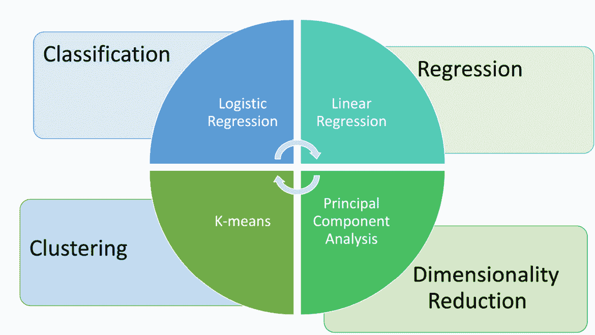
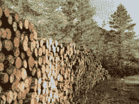
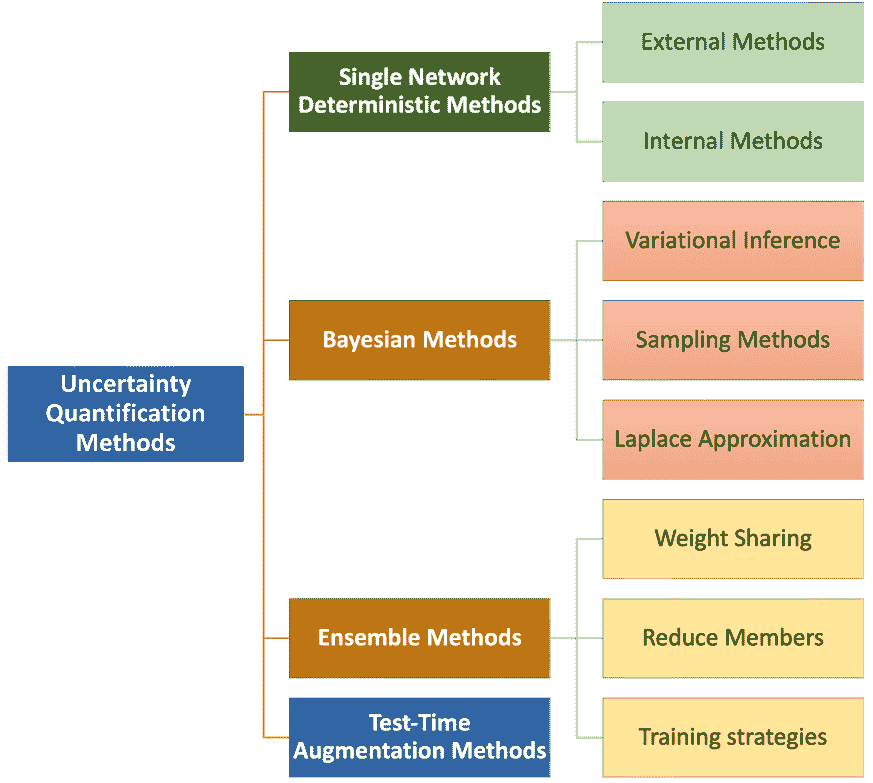
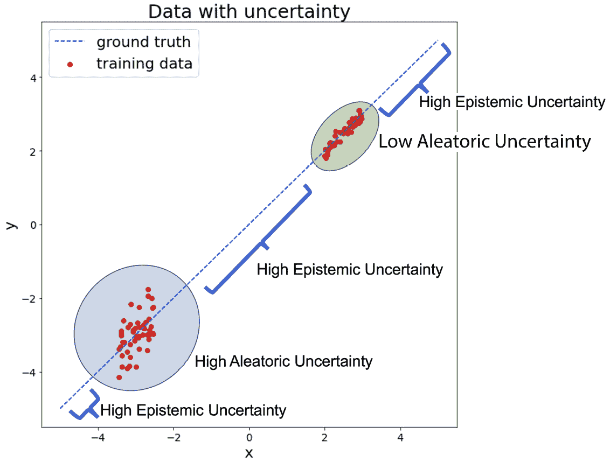
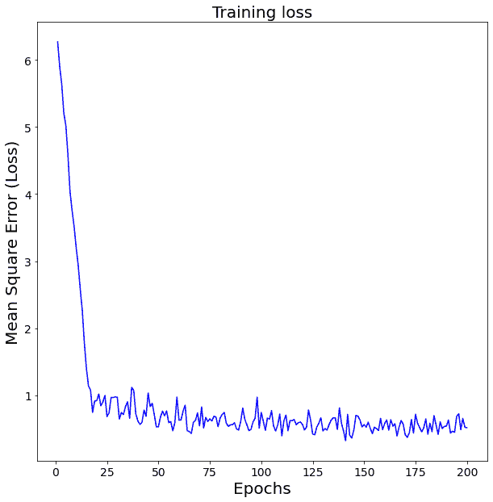
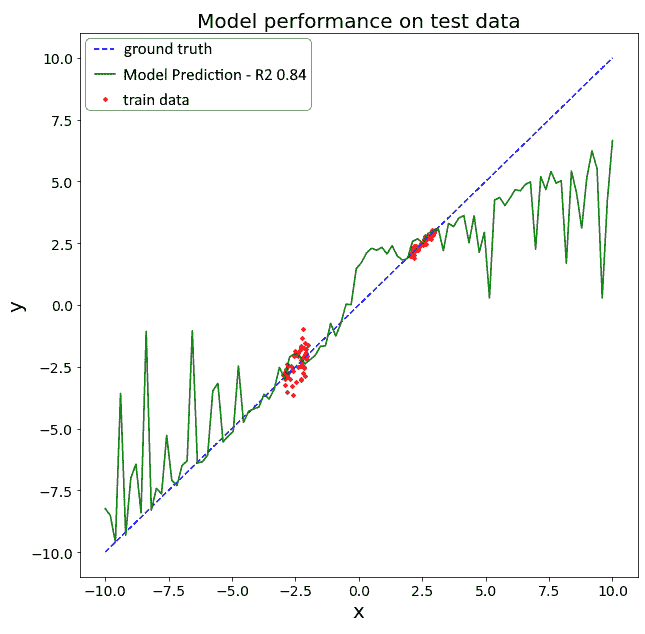
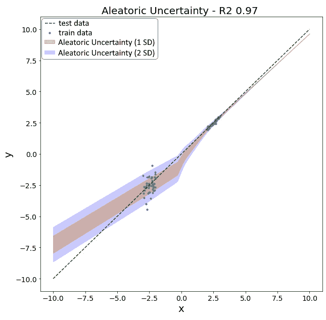
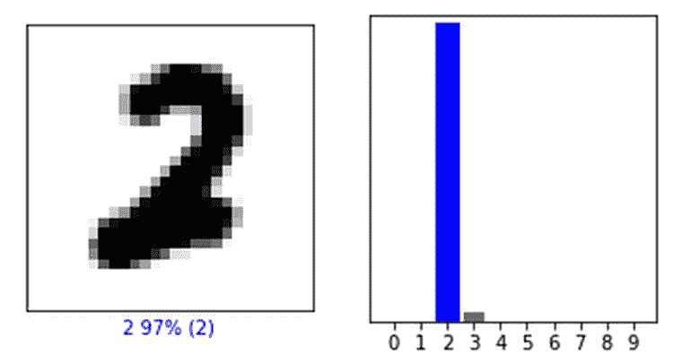
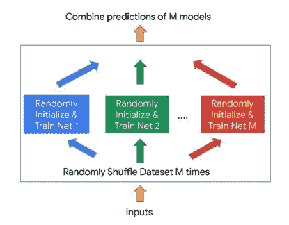
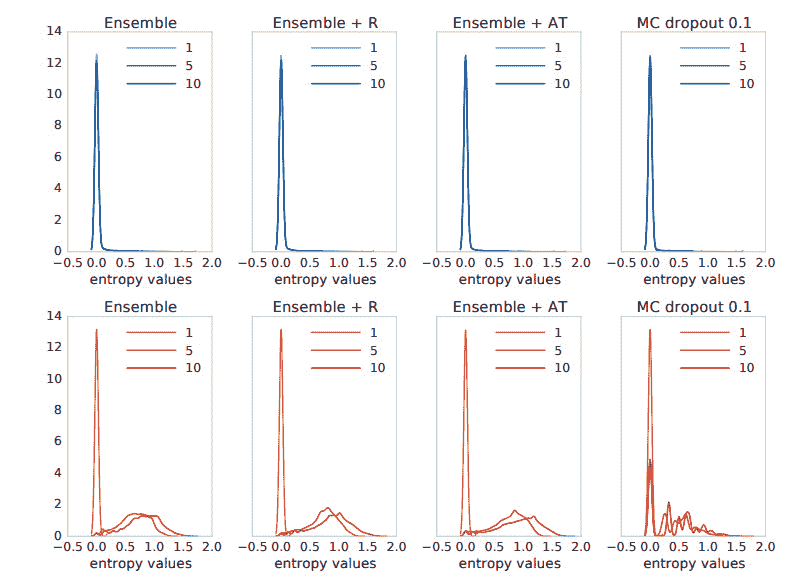

# 5

# ML 流水线、模型评估与不确定性处理

本章从介绍 AI/ML 工作流开始。随后，本章深入探讨用于分类、回归、生成和强化学习的不同 ML 算法。还讨论了与这些算法的可靠性和可信度相关的问题。我们首先介绍 ML 流水线的各个组件，并解释了持续训练的必要性。接着，本章简要探讨了分类、回归和聚类任务中重要的 AI/ML 算法。进一步地，我们讨论了识别学习算法中的偏差和模型预测不确定性的原因。

本章将通过以下几个部分来覆盖这些主题：

+   了解 ML 流水线的不同组件

+   ML 任务和算法

+   模型预测中的不确定性原因

+   分类算法中的不确定性

+   回归算法中的不确定性

进一步，我们将编写 Python 代码来量化回归任务中的 aleatoric 和 epistemic 不确定性。

# 技术要求

本章要求您使用 Python 3.8，并安装一些必要的 Python 包：

+   `TensorFlow 2.7.0`

+   `NumPy`

+   `matplotlib`

+   Keras-Uncertainty – 安装方法如下：

    ```py
    !pip install --user git+https://github.com/mvaldenegro/keras-uncertainty.git
    ```

# 了解 ML 流水线的不同组件

正如任何数据科学家所知道的，ML 的效果取决于它所训练的数据。在现实世界中，数据是混乱和复杂的。因此，构建一个成功的 ML 系统不仅仅是构建算法。它还需要一个庞大且复杂的基础设施来支持。这包括从收集和清洗数据到部署和监控模型的各个方面。问题更加复杂的是，系统中的任何变动都可能引发连锁反应。例如，超参数的轻微调整可能需要改变数据的收集和处理方式。因此，构建一个成功的 ML 系统是一项极为复杂的任务。


图 5.1 – ML 工作流

我们可以将 ML 工作流分为五个主要组件：

+   **数据提取**：这是为训练模型收集所需数据的阶段。它是从一个更大的数据集中识别相关信息并将其转换为可用于进一步分析的格式的过程。这可以手动完成，但通常使用自动化算法来完成。数据提取可以用来从电子邮件列表中提取联系信息，识别股票价格趋势，或发现潜在的新客户。数据可以以不同形式存在（表格数据、图像文件、文本等）。数据的选择由具体用例的业务需求决定。例如，如果你的用例是零售领域的人工智能，你将拥有诸如产品图片和标签等数据。数据提取的过程通常从预处理开始，预处理涉及从数据集中识别相关信息。一旦相关信息被识别出来，它就会被转换为机器学习算法可以使用的格式。这使得算法能够专注于最相关的信息并忽略无关数据，从而提高机器学习算法的准确性，并帮助加快训练过程。

+   **数据工程**：在这一阶段，数据会被分析、清洗、探索，并预处理后传入模型。该阶段可能涉及将一个或多个特征合并和/或对数据进行降维处理，以提高计算效率。数据工程的目标是创建一个既准确又能代表现实世界的、可重复的数据集。

+   **模型训练**：这是一个迭代过程，其中进行模型实验。它包括选择最佳模型、进行超参数调优，并使用所需的指标验证训练过的模型。找到一组合适的超参数是一门艺术，在早期的机器学习发展中，只有一些专家能够有效地做到这一点。因此，许多人曾称机器学习为“炼金术”。然而，今天，借助强大可靠的优化器和 AutoML 功能，我们能够生成可靠且可重复的结果。值得一提的是，这一步骤是时间密集型和计算密集型的。

+   **模型部署**：最终模型部署到生产环境。监控模型的性能非常重要，一旦性能下降，应报告并采取相应的措施。已部署的模型需要监控 *数据漂移* 和 *概念漂移*。我们将在 *第六章* 中详细讨论这些概念。

+   **用户界面**：一旦模型部署完成，它就可以被使用。它将接收用户输入并进行预测，结果可以通过可视化仪表板分享出去。

根据专业水平和需求，机器学习管道的不同组件可以手动完成、作为 MLOps 自动化（详细信息请参考 *第六章*），或完全自动化为 CI/CD 流程。

# 机器学习任务和算法

一般来说，机器学习任务可以分为四类：分类、回归、聚类和降维（*图 5.2*）。



图 5.2 – 不同的机器学习任务和常见算法

对于每个任务，都存在许多标准算法。为了完整性，我们将列出机器学习任务及其常见算法：

+   **分类**：当数据需要被分为不同的类别或类时，我们使用分类算法。这是一个监督学习问题，目标是根据训练数据预测新样本的离散类别标签。分类是机器学习中最常用的技术之一，应用广泛，从识别垃圾邮件到人脸识别。分类的基本思想是构建一个模型，能够学习输入数据与类别标签之间的关系。然后，这个模型可以用于对新数据点进行预测。对于分类任务，有多种不同的算法可以选择，每种算法都有其优缺点。算法的选择主要取决于数据的性质和预测精度的要求。

+   **回归**：在机器学习中，回归是一种用于预测连续值的技术，比如价格或重量。它假设预测变量和响应变量之间存在线性关系。换句话说，随着预测变量的增加，响应变量也会按固定量增加（或减少）。回归模型可用于识别哪些预测因子对确定响应变量的值最为重要，也可用于估计预测中的不确定性。尽管回归方法简单，但它是一个强大的工具，能够解决许多实际问题。回归问题与分类问题一样，是一种监督学习问题。

+   **聚类**：聚类是机器学习中的一种技术，它将相似的数据点分组在一起。它被用于细分客户、分类文档和识别数据中的模式。有许多不同的聚类算法，但它们都遵循相同的原理：通过找到数据点之间的相似性，将数据划分为多个组，称为簇。聚类是一种无监督学习技术，这意味着它不需要标记数据。这使得聚类特别适合用于探索性数据分析。聚类可以用来在数据中寻找结构，生成关于数据如何组织的假设，并识别异常值。通过将相似的数据点聚集在一起，聚类可以简化复杂的数据集，使其更易于处理。聚类是机器学习和数据科学中的一项基本工具。它可以单独使用，也可以与其他技术结合使用来解决各种问题。许多聚类算法，如 K 均值，基于无监督学习范式。

+   **降维**：在机器学习中，降维是减少数据集中特征数量的过程。这样做有多种原因，例如减少训练时间或提高模型的性能。降维有许多不同的方法，最合适的方法将取决于数据集和所期望的结果。一些常见的方法包括**主成分分析**（**PCA**）和**线性判别分析**（**LDA**）。一般来说，降维可以作为提高机器学习模型的有用工具。然而，重要的是要为特定数据集和预期结果仔细选择合适的方法。否则，它可能会损害模型的性能。

以下表格列出了常用于每个任务的一些算法和深度学习模型。

| **分类** | **回归** | **聚类** | **降维** |
| --- | --- | --- | --- |

|

+   逻辑回归

+   支持向量机

+   决策树分类器

+   随机森林分类器

+   XGBOOST 分类器

+   朴素贝叶斯分类器

+   多层感知机

+   卷积神经网络

|

+   线性回归

+   岭回归

+   决策树回归

+   随机森林回归器

+   支持向量机回归器

+   神经网络回归器

+   Lasso 回归器

|

+   K 均值

+   基于密度的空间聚类

+   高斯混合模型

+   亲和传播聚类

+   平衡迭代缩减和聚类层次

+   均值漂移聚类

+   聚合层次聚类

+   **排序点以识别聚类结构**（**OPTICS**）

|

+   主成分分析

+   T 分布随机邻居嵌入

+   奇异值分解

+   线性判别分析

+   因子分析

+   多维尺度分析

+   随机森林

|

表 5.1 – ML 算法表

*表 5.1* 中列出的算法采用了监督学习或无监督学习范式。然而，机器学习还有第三种范式——**强化学习**（**RL**）。它已经被探索用于训练人工智能代理进行游戏、用于自动驾驶汽车，以及在 AutoML 中找到适合不同任务的最佳模型和超参数。

此外，近年来，研究人员已经开发出了可以生成数据的 AI 算法（例如，**生成对抗网络**、**变分自编码器**、**扩散模型**等）。这些算法已经被探索用于生成文本、图像、艺术作品等。

每种算法都有其优缺点，因此选择最优算法来完成任务通常需要通过不同算法进行反复迭代，并选择在评估指标上表现最好的算法。然而，为了构建一个负责任的 AI 解决方案，重要的是要对模型进行偏差和公平性评估，并且让最终用户意识到模型预测的不确定性。

在接下来的章节中，我们将讨论不确定性以及如何估计模型预测中的不确定性。

# 机器学习中的不确定性

机器学习与不确定性是密不可分的。毕竟，机器是从本身就具有不确定性的数据中学习的。这些数据可能是嘈杂的、不完整的，甚至完全错误的。因此，机器从这些数据中得出的任何结论都将受到某种程度的不确定性影响。因此，我们需要意识到在任何结果中固有的不确定性，并适当考虑它。只有这样，我们才能在决策过程中最大限度地利用机器学习。为了说明这一点，这里给出一个使用 `EfficientNet` 的预测，它是 `ImageNet` 数据集中得分最高的网络之一（Tan 和 Le，2019）。

`EfficientNet` 接收以下图像：



图 5.3 – 来自 ImageNet 数据集的 EfficientNetB0 输入

它返回以下输出：

```py
Predicted: [('n04326547', 'stone_wall', 0.81027746)]
```

如你所见，在展示一张木头原木的照片时，模型将其预测为 `'stone_wall'`，置信度为 81%。

在我们深入探讨机器学习中的不确定性之前，回顾一下人类如何应对不确定性会非常有帮助。如果你被问到一个问题——比如“*今天的纳斯达克指数是多少？*”——如果你关注股市，你可能会给出其数值，或者可能会说它是看涨的还是看跌的，具体情况而定。但如果你不关心股市，你可能会简单地说“*我不知道*。”然而，机器学习算法无论输入是什么，都会给出一个预测。因此，如果你有一个训练过的机器学习算法来分类花卉，它会告诉你你是何种花卉，即使人类的识别并不是它的领域。如果我们的机器学习模型也能说“*抱歉，我不知道——它不在我的领域内!*”那该多好。例如，考虑自动驾驶汽车：它应该能够告诉司机“*嘿，我不确定我看到的是否是行人。你能接管吗？*”当我们使用深度学习模型进行重要决策时，比如提供贷款、提供医疗服务等等，这一点变得尤为重要。

解决这个问题的一种方法是量化预测中的不确定性，这样当模型做出预测时，它会告诉我们对预测的信心有多大，或者它的预测有多可靠。在本节中，我们将探讨一些不确定性如何定量描述的方法。但首先，让我们看看不确定性的不同类型以及它们的成因。

## 不确定性的类型

在机器学习中，我们通常讨论两种不同类型的不确定性。第一种是**随机不确定性**，指的是数据中的固有噪声。例如，两个测量同一事物的人可能会得到略有不同的结果。另一种不确定性是**认知不确定性**，指的是我们对模型本身缺乏知识。例如，如果我们试图预测股票价格，总会存在一些不确定性，因为我们无法了解股市的所有信息。不确定性是机器学习中的一个重要部分，理解不同类型的不确定性可以帮助我们构建更好的模型。

让我们深入探讨不确定性的类型。

### 随机不确定性

随机不确定性代表了由于自然过程的随机性而存在的不确定性。这是固有的不确定性，由于概率变异性而存在。例如，在抛硬币时，总会存在一定程度的不确定性，无法预测下次抛掷是否会是正面或反面。无论我们有多少数据，都无法消除这种不确定性。再举个例子，如果我们试图预测天气，由于大气的混沌特性，总会存在一些不确定性。我们无法消除这种不确定性。本质上，每次重复实验时，结果都会有一定的变异。

### 认知不确定性

认识论不确定性源于知识缺乏或信息不足。知识缺乏的原因可能有很多，例如对基础过程理解不充分、对现象的知识不完整等。这种类型的不确定性是可以减少的。

例如，你可以获取更多数据，进行更多实验，等等。你也可以尝试通过使用更强大的模型或更长时间的训练来减少不确定性。

### 预测不确定性

在机器学习（ML）中，我们主要关注预测中的不确定性，也叫预测不确定性。根据输入数据，预测不确定性有三种类型：

+   **领域内不确定性**：这种不确定性的原因是训练数据分布不均，例如，类别 A 的样本比类别 B 更多。这种不确定性可以通过提高数据质量来减少。

+   **领域转移不确定性**：当训练数据分布与实际情况发生显著变化时，会产生这种不确定性。例如，当一个模型被训练用来识别面部时，当面部被遮挡，或人戴眼镜、帽子或口罩时，模型的表现就会变差。通过在训练中加入遮挡样本，可以改善模型的性能。

+   **领域外（OOD）不确定性**：顾名思义，当输入来自一个完全未知的子空间时，就会产生这种不确定性。例如，如果我们训练一个识别狗照片的模型，并将其输入一张人类的照片，机器学习算法无法判断该输入是否超出了其已学习的领域。

### 不确定性的原因

不确定性有多种原因（有关更多细节，请参阅 Zio 和 Pedroni 2012 年的出版物——详见*进一步阅读*部分）：

+   **知识缺乏**：在监督学习任务中，这可以被理解为缺乏能够 encapsulate 输入和输出之间关系的数据。这种缺乏可能是定量的——例如，我们可能不知道特征的概率分布——也可能是定性的，特征及其分布已知，但描述问题的特征却未知。通过获取更多数据，并与领域专家密切合作，可以减少这种不确定性的来源。

+   **数据过剩**：尽管如今我们可以存储和访问大量数据，但问题在于如何找到与使用案例相关的特征。严格的特征工程和数据探索有助于选择相关的特征。

+   **数据的冲突性**：当我们构建一个机器学习模型时，输入特征和输出变量应该具有某种因果关系。然而，尽管有专家知识，我们永远无法确定数据中看到的相关性是否也是因果关系。一个有趣的关于幽默相关性的例子可以在这个网站上找到：[`www.fastcompany.com/3030529/hilarious-graphs-prove-that-correlation-isnt-causation`](https://www.fastcompany.com/3030529/hilarious-graphs-prove-that-correlation-isnt-causation)。

+   **测量误差**：通过传感器测量物理量时，由于测量设备本身的性质，总是会有一定程度的不确定性。

+   **语言歧义**：在不同的语境下，词语常常有不同的含义。尽管自然语言处理和新型变换器架构（Vaswani, 2017）取得了巨大进展，能够几乎像人类一样对话（[`blog.google/technology/ai/lamda/`](https://blog.google/technology/ai/lamda/)），我们仍然没有能够理解人类语言复杂性的系统。

+   **分析师意见的主观性**：最后，还有一个人类因素。由于数据分析师的主观解读，可能会存在不确定性。同一组数据可能会根据数据分析师的文化背景和能力，导致不同的解释。

正如我们所看到的，虽然有一些方法可以减少不确定性的原因，但完全消除它们是不可能的。因此，在本章的接下来的部分，我们将找到量化和减少不同机器学习任务中不确定性的方法。

## 量化不确定性

我们可以将文献中现有的深度神经网络不确定性量化方法分为四种类型。这些方法基于所使用的深度神经网络的数量（单一或多重）和性质（确定性或随机性）。*图 5.4* 显示了文献中不同类型的不确定性量化方法。



图 5.4 – 不同的不确定性量化方法

让我们了解这些方法：

+   **单网络确定性方法**：传统神经网络在训练后固定权重，因此对于相同的输入，每次预测结果都是相同的。在单网络确定性方法中，通常使用传统神经网络，但为了向模型添加不确定性分数，可以通过改变网络架构或损失函数来修改网络（**内部方法**）。另外，还有一些方法（**外部方法**），即模型和训练不发生变化，而是通过额外的组件来测量不确定性。例如，训练两个神经网络，一个用于实际的预测任务，另一个用于预测第一个网络预测中的不确定性。

+   **贝叶斯方法**：这些方法使用贝叶斯方法。在**变分推理方法**中，通常的做法是通过在一系列可处理的分布上优化，来近似后验分布。这是通过最小化 KL 散度来实现的。**采样方法**基于马尔科夫链蒙特卡洛（MCMC）方法。**拉普拉斯近似方法**通过近似对数后验分布，并基于此推导出网络权重的正态分布。

+   **集成方法**：这些方法使用多个传统的确定性神经网络。多个模型的预测结果会合并成一个预测结果。由于该方法依赖于多种集成，变化可以通过使用随机初始化和数据打乱来引入。使用如袋装法（bagging）和提升法（boosting）等方法来改变训练数据的分布，以及数据增强，是常见的使用多个模型的方法。

+   **测试时增强方法**：这里的想法是通过数据增强技术从原始测试数据中创建多个测试数据。增强后的测试数据可以探索不同的视角，并能够捕捉不确定性。

在这四种方法中，单网络确定性方法非常直接，易于实现，并且计算开销较小。近年来，贝叶斯方法引起了大量关注，随着像 TensorFlow Probability 这样的框架的出现，实验这些方法变得更加容易。

# 回归任务中的不确定性

假设我们考虑一个传感器，其输出可以通过线性过程建模，定义为 *y =* *x*。

假设我们从范围[-2.5,2.5]内对 *x* 进行采样。由于传感器固有的物理过程（例如，白噪声），总会引入一些噪声。此外，传感器可能具有如温度或压力等限制要求。下图展示了我们传感器的数据：



图 5.5 – 数据中的不同类型的不确定性

我们可以看到，在左下角，由于某些故障，存在较高的随机不确定性。同时，也有一些较大的空白区域，那里没有观察到训练数据，这可能导致该输入范围内的较高的知识性不确定性。

在讨论如何衡量这些不确定性之前，让我们先建立一个模型并在训练数据上进行训练。

我们使用 TensorFlow 的 Dense 层来构建模型。我们从输入层开始，然后使用 `for` 循环添加隐藏层，每个隐藏层后跟一个 `Dropout` 层，最后跟一个 `Dense` 输出层：

```py
def build_model(layers_shape, input_dim, output_dim):
    inputs = Input(shape=(input_dim,))
    hidden = Dense(layers_shape[0], activation='relu', kernel_regularizer=l2(0.004))(inputs)
    hidden = Dropout(0.05)(hidden, training=True)
    for i in range(len(layers_shape)-1):
        hidden = Dense(layers_shape[i+1], activation='relu', kernel_regularizer=l2(0.004))(hidden)
        hidden = Dropout(0.05)(hidden, training=True)
    outputs = Dense(output_dim)(hidden)
    model = Model(inputs, outputs)
    return model
model = build_model(layers_shape=[5,10,20,10,5], input_dim= 1, output_dim=1)
model.summary()
```

这里需要注意的一个重要点是，Dropout 层的`training`参数被设置为`True`。这意味着即使在推理过程中也会应用 Dropout，因此，我们将会得到预测结果的变化。模型摘要如下：

```py
Model: "model"
______________________________________________________
 Layer (type)             Output Shape         Param #
======================================================
 input_1 (InputLayer)    [(None, 1)]              0
 dense (Dense)            (None, 5)               10
 dropout (Dropout)        (None, 5)               0
 dense_1 (Dense)          (None, 10)             60
 dropout_1 (Dropout)      (None, 10)             0
 dense_2 (Dense)          (None, 20)             220
 dropout_2 (Dropout)      (None, 20)             0
 dense_3 (Dense)          (None, 10)             210
 dropout_3 (Dropout)      (None, 10)             0
 dense_4 (Dense)          (None, 5)              55
 dropout_4 (Dropout)      (None, 5)              0
 dense_5 (Dense)          (None, 1)              6
======================================================
Total params: 561
Trainable params: 561
Non-trainable params: 0
______________________________________________________
```

我们使用 `rmsprop` 优化器，并使用均方误差作为损失函数：

```py
model.compile(optimizer='rmsprop', loss='mse', metrics=['mae'])
```

我们使用在*图 5.5*中绘制的训练数据（红点）对其进行训练：

```py
history = model.fit(x_data, y_data, batch_size=10, epochs=200, shuffle=True, verbose=1)
```

以下图表（*图 5.6*）展示了随着训练的进行，损失的变化情况。我们可以看到，模型很早就学会了，并且在大约 25 个周期后，损失函数没有显著下降：



图 5.6 – 模型学习过程中的训练损失

现在让我们看看这个模型在测试数据上的表现。我们将输入范围设置为`[-10, 10]`：

```py
x_test = np.linspace(-10,10,100)
y_pred = model.predict(x_test)
```

让我们绘制数据：

```py
fig, ax = plt.subplots(1,1,figsize=(10,10))
ax.scatter(x_data, y_data, s=10, label='train data', color='red')
ax.plot(x_test, x_test, ls='--', label='ground truth', color='blue')
ax.plot(x_test, y_pred, label='Model Prediction - R2 {:.2f}'.format(r2_score(x_test, y_pred)), color='green')
ax.set_xlabel('x')
ax.set_ylabel('y')
ax.legend()
ax.set_title('Model performance on test data');
```

以下图表展示了模型在测试数据集上的表现：



图 5.7 – 模型在测试数据集上的表现

我们可以看到，在测试数据上，R2 分数为 0.98。大部分情况下，这是一个很棒的模型。然而，正如我们之前所说，数据中确实存在知识性和随机性不确定性较高的区域。

让我们首先探讨知识性不确定性。我们对测试数据集进行大约 500 次评估，这意味着我们使用训练好的模型对相同的测试数据进行 500 次预测。这相当于模拟一个高斯过程。每次，我们都会得到测试数据中每个输入标量的输出值范围。因此，我们可以计算后验分布的标准差，并将其作为知识性不确定性的度量：

```py
predictions = []
for _ in range(500):
  predictions += [model.predict(x_test,verbose=0)]
mean, std = np.mean(np.array(predictions), axis=0), np.std(np.array(predictions), axis=0)
fig, ax = plt.subplots(1,1,figsize=(10,10))
ax.plot(x_test, x_test, ls='--', color='green', label='test data')
ax.scatter(x_data, y_data, color='blue', label='train data')
ax.set_title('{} - R2 {:.2f}'.format('Epistemic Uncertainity', r2_score(x_test, mean)))
ax.set_xlabel('x')
ax.set_ylabel('y')
ax.fill_between(np.squeeze(x_test), np.squeeze(mean+1*std), np.squeeze(mean-1*std),  alpha=0.4, label='Epistemic Uncertainty', color='orange')
ax.legend();
```

*图 5.8*展示了我们模型的知识性不确定性：


图 5.8 – 测试数据集上的知识性不确定性

从图中可以看出，认知不确定性在我们没有足够训练数据的区域较高。在这里我们想提到，通常，要访问认知不确定性，必须构建一个贝叶斯近似模型，以便捕获权重的变化。可以使用 TensorFlow Probability 中的 `VariableLayer` 实现这一点。然而，在这里，我们利用了 Dropout 层可以作为贝叶斯近似（Gal 和 Ghahramani，2017）的事实。

认知不确定性是模型的属性。而随机不确定性则是数据的属性。随机不确定性有两种类型。一种是`y`，还有它的方差。使用 TensorFlow Probability 的`DistributionLambda`层也可以实现相同的效果。

我们使用与之前相同的数据，并定义异方差随机损失函数（Kendal 和 Gal，2017）：


这里，*N* 是数据样本的数量，*y*i 是真实值，ŷi 是预测输出。输入的方差是 σ²。现在，如果你查看这个函数，第一个项是均方误差的缩放版本，确保模型预测接近真实值。然而，如果预测不准确，分母中的方差项（不确定性）会增大，从而减少第一个项的贡献。第二个项确保模型不会不断增加不确定性。

让我们看看回归不确定性是如何工作的：

1.  以下 Python 代码实现了前述的损失函数：

    ```py
    # aleatoric loss function
    def aleatoric_loss(y_true, y_pred):
        N = y_true.shape[0]
        se = K.pow((y_true[:,0]-y_pred[:,0]),2)
        inv_std = K.exp(-y_pred[:,1])
        mse = K.mean(inv_std*se)
        reg = K.mean(y_pred[:,1])
        return 0.5*(mse + reg)
    ```

1.  接下来，我们构建模型。之前，输出层只有一个神经元。现在，我们将有两个神经元，一个对应预测输出`y`，另一个对应方差：

    ```py
    def build_model(layers_shape, input_dim, output_dim):
        inputs = Input(shape=(input_dim,))
        hidden = Dense(layers_shape[0], activation='relu', kernel_regularizer=l2(0.004))(inputs)
        for i in range(len(layers_shape)-1):
            hidden = Dense(layers_shape[i+1], activation='relu', kernel_regularizer=l2(0.004))(hidden)
        outputs = Dense(output_dim)(hidden)
        model = Model(inputs, outputs)
        return model
    model = build_model(layers_shape=[5,10,20,10,5], input_dim= 1, output_dim=2)
    model.summary()
    ```

这是模型摘要：

```py
Model: "model"
___________________________________________________________
 Layer (type)                Output Shape              Param #
===========================================================
 input_1 (InputLayer)        [(None, 1)]               0
 dense (Dense)               (None, 5)                 10
 dense_1 (Dense)             (None, 10)                60
 dense_2 (Dense)             (None, 20)                220
 dense_3 (Dense)             (None, 10)                210
 dense_4 (Dense)             (None, 5)                 55
 dense_5 (Dense)             (None, 2)                 12
===========================================================
Total params: 567
Trainable params: 567
Non-trainable params: 0
___________________________________________________________
```

1.  现在，为了训练模型，我们需要重新调整数据的形状，以适应模型的变化：

    ```py
    x_data_reshaped = x_data.reshape(x_data.shape[0], 1)
    y_data_reshaped = np.vstack([y_data, np.zeros(y_data.shape)]).T
    ```

1.  现在让我们定义优化器。我们将它保持为与第一次相同的`rmsprop`，并将损失函数更改为我们定制的损失函数：

    ```py
    model.compile(optimizer='rmsprop', loss=aleatoric_loss, metrics=['mae'])
    ```

1.  最后，进行训练：

    ```py
    model.fit(x_data_reshaped, y_data_reshaped,
              batch_size=10, epochs=1000, shuffle=True, verbose=1)
    ```

1.  现在让我们绘制随机不确定性：

    ```py
    x_test=np.linspace(-10,10,100)
    p = np.array([model.predict(x_test, verbose=0)])
    mean, epistemic_std = np.mean(p[:,:,0], axis=0), np.std(p[:,:,0], axis=0)
    aleatoric_std = np.exp(0.5*np.mean(p[:,:,1], axis=0))
    fig, ax = plt.subplots(1,1,figsize=(10,10))
    ax.scatter(x_data, y_data, s=10, label='train data')
    ax.plot(x_test, x_test, ls='--', label='test data', color='green')
    ax.fill_between(np.squeeze(x_test), np.squeeze(mean+1*aleatoric_std), np.squeeze(mean-1*aleatoric_std),  alpha=0.4, label='Aleatoric Uncertainty (1 SD)', color='orange')
    ax.fill_between(np.squeeze(x_test), np.squeeze(mean+2*aleatoric_std), np.squeeze(mean-2*aleatoric_std),  alpha=0.2, label='Aleatoric Uncertainty (2 SD)', color='blue')
    ax.set_xlabel('x')
    ax.set_ylabel('y')
    ax.set_title('{} - R2 {:.2f}'.format('Aleatoric Uncertainity', r2_score(x_test, mean)))
    ax.legend()
    ```

随机不确定性的图如下所示：



图 5.9 – 测试数据集上的随机不确定性

从图中可以看出，在 **-2.5** 附近，随机不确定性较高，因为这是我们原始训练数据中数据本身噪声较多的地方。这种类型的不确定性在一些需要做出可能关系到生死的决策的应用中可能会带来问题，例如自动驾驶汽车的情况。因此，需要构建能够不仅做出预测，而且在预测时还能评估认知不确定性和随机不确定性（不确定性评分）的模型。

既然我们已经看到如何在回归任务中建模不确定性，现在让我们转向在分类任务中量化不确定性。

# 分类任务中的不确定性

在分类任务中，标准做法是在最后一层使用**SoftMax 激活**函数。默认情况下，这个 SoftMax 激活已经包含了一定的置信度测量（*图 5.10*）。然而，SoftMax 并不是非常可靠。例如，考虑一个训练用来分类马和斑马的模型，当它看到一只狗时，它不会说 50% 是马，50% 是斑马，而是会假设它是一只黑色的狗。它可能会认为它更像一匹马，并以 60% 的概率将其分类为马。



图 5.10 – 来自 MNIST 数据的图像及其 SoftMax 置信度

从数学上讲，分类任务使用最大类概率来确定类别：


这里，*K* 是类别的总数，pk 是该预测中类别 *k* 的 SoftMax 值。一些研究人员也尝试使用 SoftMax 预测的熵 。最大概率直接表示了确定性，而熵则描述了随机变量中的平均信息量。

尽管这些方法简单且直接使用，但它们并不可靠，尤其是当我们面对像医学诊断这样的关键决策 AI 模型时。



图 5.11 – 深度集成架构

量化分类任务中的不确定性的一种方法是使用集成方法。Lakshminarayanan 等人在他们的论文中表明，当模型面对域外数据时，使用集成方法比其他方法更有效。他们训练了一个深度神经网络的集成（*图 5.11*），并使用了整个 MNIST 训练数据集。经过训练的模型的预测结果被如下方式结合：


这里，*M* 是集成模型的数量。在论文中，*M=5*，*y* 是输入 *x* 的预测结果，θm 实例是网络参数。如你所见，对于分类任务，这对应于平均预测概率。此外，他们还生成了对抗性样本，并对集成中的每个网络进行了对抗训练。*图 5.12* 显示了 MNIST 和 NotMNIST 数据集的结果：



图 5.12 – MNIST 数据集（蓝色）和 NotMNIST 数据集（红色）的熵值

正如图中所示，集成方法在面对 NotMNIST 数据集时表现更好，因为 NotMNIST 的熵值分布范围更广，且峰值降低了。他们还将他们的方法与贝叶斯方法（加入蒙特卡洛丢弃）进行了比较。图中显示集成方法给出了更好的结果。因此，他们表明，深度集成方法为分布外数据生成了低置信度的输出。一般来说，对于数据集偏移和跨领域分布，深度集成方法相比其他方法表现出一致的更好性能。

# 用于基准测试和量化不确定性的工具

已经有很多工作致力于量化不确定性并为不确定性和鲁棒性创建基准。在本节中，我们将介绍一些突出的工作。请记住，这些标准仍处于初期阶段，因此，许多工具和 GitHub 仓库可能存在一定的局限性。

## 不确定性基准库

由 Google Brain 研究团队、牛津大学、剑桥大学、哈佛大学和德克萨斯大学的研究人员开发的**不确定性基准库**包含一组基准，您可以使用这些基准来比较不同深度学习方法的性能。这些基准是使用高质量方法实现的，并且适用于多种任务。您可以使用这些基准来开始自己的实验。完整的工作可以通过 GitHub 仓库访问，网址为[`github.com/google/uncertainty-baselines`](https://github.com/google/uncertainty-baselines)。

目前没有稳定版本。然而，用户可以通过 Git 直接安装并进行实验。该库旨在为用户提供一个模块化、框架无关、硬件无关的工具。

## Keras-Uncertainty

使用 scikit-learn 中的`make_moon`方法创建合成分类数据。我们训练了五个模型，并使用 Keras-Uncertainty 库绘制了各自的不确定性。


图 5.13 – 二分类问题的不确定性

## 鲁棒性指标

由 Google Research 开发的鲁棒性指标库提供了可以帮助评估分类模型的函数和方法。它定义了三组指标：

+   **分布外泛化**：该指标评估模型准确分类具有相似性但可能具有不同视角的物体的能力。

+   **稳定性**：该指标评估模型在输入发生变化时预测的稳定性，以及模型在自然干扰下的表现效果。

+   **不确定性**：该指标衡量模型估计的概率与实际概率之间的接近度。

鲁棒性度量库甚至可以用于非视觉模型。实际上，如果你有分类任务，可以尝试使用这个库。它依赖于 TensorFlow 和 TensorFlow Probability，因此在使用之前，您需要先在系统上安装它们。

# 总结

本章首先介绍了机器学习管道的不同组成部分。接着我们讨论了各种机器学习任务以及为这些任务使用的不同算法。

本章的主要主题是深度学习中的不确定性。这种不确定性可能来自数据、模型，或者两者兼而有之。我们讨论了两种不确定性类型：随机不确定性和认知不确定性。本章还讨论了文献中用来量化不确定性的各种方法，并深入探讨了不确定性的原因。接着，我们实现了用于回归任务的量化不确定性的算法。最后，本章讨论了用于量化分类任务不确定性的方法。在深度学习中，需要开发不确定性和鲁棒性的基准和基线。尽管该领域正在进行大量研究，但不确定性和鲁棒性仍然是人工智能和机器学习中的关键研究问题。

在下一章中，我们将深入探讨超参数的概念，以及如何使用 AutoML 和 MLOps 来简化机器学习工作流。

# 参考文献

+   *EfficientNet: 重新思考卷积神经网络的模型缩放*。在*国际机器学习会议*上，Tan, M., & Le, Q.（2019 年 5 月）。（第 6105-6114 页）。PMLR. [`proceedings.mlr.press/v97/tan19a/tan19a.pdf`](http://proceedings.mlr.press/v97/tan19a/tan19a.pdf)

+   *决策分析中的不确定性表征*，Zio, E., & Pedroni, N.（2012 年）。FonCSI. [`www.researchgate.net/publication/266391086_Uncertainty_characterization_in_risk_analysis_for_decision-making_practice`](https://www.researchgate.net/publication/266391086_Uncertainty_characterization_in_risk_analysis_for_decision-making_practice)

+   *Attention is all you need. 神经信息处理系统的进展*，Vaswani, A., Shazeer, N., Parmar, N., Uszkoreit, J., Jones, L., Gomez, A. N., ... & Polosukhin, I.（2017 年）。30\. [`proceedings.neurips.cc/paper/2017/file/3f5ee243547dee91fbd053c1c4a845aa-Paper.pdf`](https://proceedings.neurips.cc/paper/2017/file/3f5ee243547dee91fbd053c1c4a845aa-Paper.pdf)

+   *Dropout 作为贝叶斯近似：在深度学习中表示模型的不确定性*。在*国际机器学习会议*上，Gal, Y., & Ghahramani, Z.（2016 年 6 月）。（第 1050-1059 页）。PMLR. [`proceedings.mlr.press/v48/gal16.pdf`](http://proceedings.mlr.press/v48/gal16.pdf)

+   *我们在贝叶斯深度学习中需要哪些不确定性用于计算机视觉？* 在*神经信息处理系统的进展*中，Kendall, A., & Gal, Y.（2017 年）。30\. [`arxiv.org/pdf/1703.04977.pdf`](https://arxiv.org/pdf/1703.04977.pdf)

+   *深度神经网络中的不确定性调查*，Gawlikowski, J., Tassi, C. R. N., Ali, M., Lee, J., Humt, M., Feng, J., ... & Zhu, X. X. (2021)。arXiv 预印本 arXiv:2107.03342\。 [`arxiv.org/pdf/2107.03342.pdf`](https://arxiv.org/pdf/2107.03342.pdf)

+   *深度学习中的不确定性量化综述：技术、应用与挑战*，Abdar, M., Pourpanah, F., Hussain, S., Rezazadegan, D., Liu, L., Ghavamzadeh, M., ... & Nahavandi, S. (2021)。发表于 *信息融合*，76，243-297 页。[`arxiv.org/pdf/2011.06225.pdf`](https://arxiv.org/pdf/2011.06225.pdf)

+   *使用深度集成方法进行简单且可扩展的预测不确定性估计*。发表于 *神经信息处理系统进展*，Lakshminarayanan, B., Pritzel, A., & Blundell, C. (2017)。第 30 页。[`arxiv.org/pdf/1612.01474.pdf`](https://arxiv.org/pdf/1612.01474.pdf)

+   *鲁棒性指标*，J. Djolonga, F. Hubis, M. Minderer, Z. Nado, J. Nixon, R. Romijnders, D. Tran, 和 M. Lucic. 2020 年。[`github.com/google-research/robustness_metrics`](https://github.com/google-research/robustness_metrics)

+   *不确定性基准：深度学习中不确定性与鲁棒性的基准测试*，Nado, Z., Band, N., Collier, M., Djolonga, J., Dusenberry, M. W., Farquhar, S., ... & Tran, D. (2021)。arXiv 预印本 arXiv:2106.04015\。[`arxiv.org/pdf/2106.04015`](https://arxiv.org/pdf/2106.04015)

+   *卷积神经网络的鲁棒性与可转移性*，Djolonga, J., Yung, J., Tschannen, M., Romijnders, R., Beyer, L., Kolesnikov, A., ... & Lucic, M. (2021)。发表于 *IEEE/CVF 计算机视觉与模式识别会议论文集*（第 16458-16468 页）。[`arxiv.org/pdf/2007.08558.pdf`](https://arxiv.org/pdf/2007.08558.pdf)
