# 6

# 超参数调优、MLOps 和 AutoML

开发一个**机器学习**（**ML**）模型是一个迭代的过程；那么多的模型，每个模型又有大量的超参数，这使得初学者感到复杂。本章继续上章内容，解释了在 ML 管道中需要持续训练的原因。它将提供目前可用于你的 ML 工作流的 AutoML 选项，扩展在无代码/低代码解决方案有用的情况，并探讨主要云服务商在易用性、功能性和模型可解释性方面提供的解决方案。本章还将探讨如 Kubeflow 和 Vertex AI 等编排工具，它们可以帮助你管理 ML 模型的持续训练和部署。

完成本章后，你将熟悉超参数调优的概念以及流行的现成 AutoML 和 ML 编排工具。

在本章中，以下主题将通过以下章节进行讲解：

+   介绍 AutoML

+   介绍 H2O AutoML

+   使用 Azure AutoML

+   了解 AWS SageMaker Autopilot

+   MLOps 的需求

+   TFX – 一个可扩展的端到端 AI/ML 工作流平台

+   了解 Kubeflow

+   Katib 用于超参数调优

+   Vertex AI

# 技术要求

本章要求你安装 Python 3.8，并且安装以下 Python 包：

+   TensorFlow (>=2.7.0)

+   NumPy

+   Matplotlib

+   你需要按以下方式安装 H2O：

    ```py
    pip install -f http://h2o-release.s3.amazonaws.com/h2o/latest_stable_Py.html h2o
    ```

或者，你可以通过以下方式安装：

```py
conda install -c h2oai h2o
```

+   安装 Azure ML 客户端库：

    ```py
    pip install azure-ai-ml
    ```

# AutoML 介绍

任何在机器学习领域工作过的人都能告诉你，构建 ML 模型是一个复杂且迭代的过程。你从一个数据集和一组特征开始，然后在这些数据上训练模型。随着数据的增加，你会加入更多的特征，并重新训练模型。这个过程会持续下去，直到你拥有一个能很好地泛化到新数据的模型。这个任务被多种超参数所复杂化，而这些超参数与模型表现之间存在一种非线性关系。选择合适的模型和选择最优的超参数依然被许多人认为是炼金术。

注意事项

你可以参考*Has artificial intelligence become alchemy? Matthew Hutson, Science, Vol 360, Issue 6388*获取更多信息。

AI 是否是炼金术是一个热门的辩论话题。虽然许多开始实验 AI 的人觉得它像炼金术一样，但也有专家，包括我们这些作者，认为事实并非如此。AI 就像任何其他实验科学一样，基于技术基础。最初，AI 的重点是开发 AI 模型和架构，但现在重点逐渐转向负责任且可解释的 AI。随着越来越多的工作发生在这个领域，我们将能够像理解其他技术一样理解 AI。

找到合适的模型、完美的特征以及最佳的超参数集可能是一个耗时且令人沮丧的任务。**自动化机器学习**（**AutoML**）帮助你选择一个模型和超参数。

它使得初创公司和低预算组织能够在不需要投资昂贵且难以找到的 AI 人才的情况下，受益于 AI 的强大功能。因此，为了降低机器学习的门槛，并帮助来自其他领域的专家在他们的任务中使用机器学习，大多数在机器学习领域的主要参与者都在研究自动生成机器学习模型的技术。

广义上，我们可以将构建 AI 模型分为以下三个迭代过程。这个过程在*图 6.1*中进行了说明：

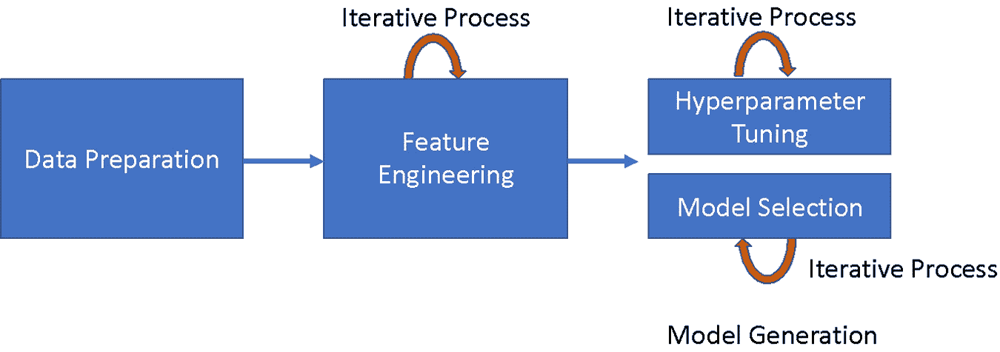

图 6.1 – 机器学习流程中的迭代过程

让我们逐一讨论每个过程：

+   **特征工程**：特征工程是机器学习过程中的一个重要部分。简而言之，它是从现有数据中创建和选择（新的）特征的过程，这些特征有助于模型训练。这可以通过多种方式完成，但最常见的方法是变换或聚合。变换涉及将现有数据转化为新形式，例如将文本转化为数值。聚合则是将多个数据点合并为单一值，例如求一组数字的平均值。特征工程可能非常耗时，但它往往是构建准确模型的关键。通过细心的规划和执行，创建强有力的特征是可能的，它们可以对你的机器学习结果产生决定性影响。

+   **超参数调优**：这是通过微调超参数来优化机器学习算法以获得更好性能的过程。超参数是一组控制模型训练过程的变量，它们与机器学习模型的参数（例如，神经网络中的权重和偏差）不同，后者是在训练过程中学习的。超参数调优在任何机器学习项目中都至关重要，因为它可以显著影响模型的性能。然而，这一过程可能是耗时且昂贵的，特别是在处理大型和复杂数据集时。超参数调优有多种方法，包括手动调优、网格搜索和随机搜索。每种方法都有其优缺点，选择合适的方法对于解决当前问题至关重要。

+   **模型选择**：模型选择是选择最适合特定任务的机器学习算法的过程。在选择深度学习模型时，需要考虑多个因素，如数据类型、期望输出和可用的计算资源。模型选择过程可能令人生畏。近年来，深度学习模型在特定任务上达到了接近人类的表现。这些模型中的许多是由 AI 专家精心设计的，而找到最佳模型及其架构的过程并不简单。相反，这涉及大量的人工直觉以及许多尝试和失败。

对于不熟悉深度学习技术的领域专家来说，AutoML 可以轻松帮助他们创建机器学习解决方案。AutoML 旨在简化创建机器学习模型的过程，并通过自动化整个机器学习管道（包括数据准备、特征工程和自动模型生成）来降低手动构建机器学习解决方案的成本。最终，AutoML 的目标是让深度学习变得更加易于接触，让每个人都能从其强大功能中受益。

自动化创建和调优机器学习（ML）端到端管道提供了更简单的解决方案。它有助于减少生成这些管道的时间，并最终可能生成比手工设计的模型更优的架构。这是一个活跃且开放的研究领域，AutoML 的首篇研究论文于 2016 年底发布。

大多数商业化的 AutoML 平台接收结构化数据，并假设数据准备和特征工程已经完成，但它们仍提供模型生成。模型生成可以分为两个部分——搜索空间和优化方法。搜索空间确定可以设计的不同模型结构（如支持向量机、*k*-最近邻和深度神经网络），而优化方法通过调整模型参数来细化选定的模型，从而提高其性能。自动化**神经架构搜索**（**NAS**）如今正受到越来越多的关注。在他们的调查论文中，Elsken 等人将 NAS 分为以下三个主要部分：

+   **搜索空间**：这由一组操作组成，定义了如何将这些操作连接起来形成有效的网络架构。

+   **搜索算法**：这涉及用于在搜索空间中找到高性能模型架构的算法。

+   **模型评估**：这涉及预测所提议模型的性能。

*图 6.2* 提供了 NAS 管道的概览，列出了在该过程中采用的各种方法、算法和策略：

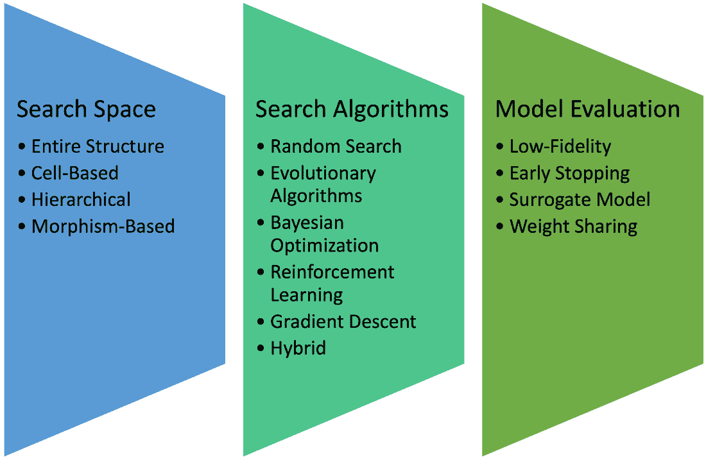

图 6.2 – NAS 流水线概述（改编自《AutoML：当前状态的调查》，Xin He 等，Knowledge-Based Systems 212 (2021): 106622 的图 5）

现在让我们探索一些提供 AutoML 服务的平台。

# 介绍 H2O AutoML

H2O 是由 **H2O.ai** 开发的一个快速、可扩展的机器学习和深度学习框架，采用开源 Apache 许可证发布。根据公司官网的信息，截至撰写本文时，已有超过 20,000 个组织在其机器学习/深度学习需求中使用 H2O。公司提供了许多产品，如 H2O AI Cloud、H2O Driverless AI、H2O Wave 和 H2O Sparkling Water。在本节中，我们将探讨其开源产品 H2O AutoML。

**H2O AutoML** 是一个旨在创建用户友好的机器学习界面的努力，旨在使初学者和非专家也能使用。它自动化了训练和调优多种候选模型的过程。该界面的设计使得用户只需指定数据集、输入和输出特征，以及对训练模型的总数或时间限制的任何要求。其余的工作由 AutoML 完成；它会在指定的时间内识别表现最好的模型，并提供一个 *排行榜*。通常观察到，堆叠集成模型（由所有先前训练的模型组成的集成模型）通常位居排行榜的顶部。高级用户有无数选项可供选择；这些选项及其各种功能的详细信息可以在 [`docs.h2o.ai/h2o/latest-stable/h2o-docs/automl.html`](http://docs.h2o.ai/h2o/latest-stable/h2o-docs/automl.html) 上查看。

你可以在他们的官网上了解更多关于 H2O 的信息：[`h2o.ai`](http://h2o.ai)。

让我们在合成数据上尝试 H2O AutoML。在开始之前，确保你已经安装了 H2O：

1.  使用 scikit-learn 的 `make_circles` 方法，我们首先创建一个合成数据集并将其保存为 CSV 文件：

    ```py
    from sklearn.datasets import make_circles
    import pandas as pd
    X, y = make_circles(n_samples=1000, noise=0.2, factor=0.5, random_state=9)
    df = pd.DataFrame(X, columns=['x1','x2'])
    df['y'] = y
    df.head()
    df.to_csv('circle.csv', index=False, header=True)
    ```

1.  接下来，我们启动 H2O 服务器 – 在使用 H2O 之前，这是一个必要的步骤。可以通过 `init()` 函数来完成：

    ```py
    import h2o
    h2o.init()
    ```

一旦 H2O 服务器初始化完成，它将显示有关 H2O 集群的详细信息，如 *图 6.3* 所示：

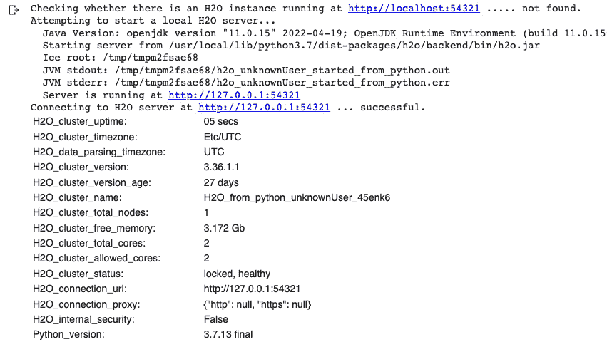

图 6.3 – H2O 初始化命令的输出

1.  接下来，我们读取之前创建的合成数据文件。由于我们希望将问题视为分类问题（无论数据点是否位于圆内），我们将 `y` 标签重新定义为 `asfactor()` – 这将告诉 H2O AutoML 模块将 `y` 变量视为分类变量，从而将问题视为分类问题。数据集按 60:20:20 的比例划分为训练集、验证集和测试集：

    ```py
    class_df = h2o.import_file("circle.csv",\
                        destination_frame="circle_df")
    class_df['y'] = class_df['y'].asfactor()
    train_df,valid_df,test_df = class_df.split_frame(ratios=[0.6, 0.2],\
                       seed=133)
    ```

1.  现在，我们从 H2O 调用 AutoML 模块，并在我们的训练数据集上进行训练。AutoML 将搜索最多 10 个模型 – 你可以更改 `max_models` 参数，以增加或减少要测试的模型数量：

    ```py
    from h2o.automl import H2OAutoML as AML
    automl = AML(max_models = 13, max_runtime_secs=75, seed=27)
    automl.train(training_frame= train_df, \
            validation_frame=valid_df, \
            y = 'y', x=['x1','x2'])
    ```

对于每个模型，H2O 提供了性能摘要。例如，在*图 6.4*中，您可以参考 `BinomialGLM` 的评估摘要：

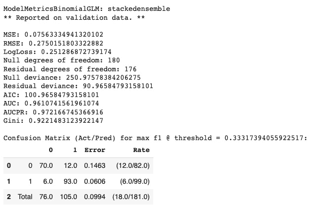

图 6.4 – H2O AutoML 模型的性能摘要

1.  您可以在排行榜上查看所有由 H2O AutoML 评估的模型的性能：

    ```py
    lb = automl.leaderboard
    lb.head()
    ```

*图 6.5* 显示了排行榜的一部分：


图 6.5 – 排行榜摘要 – H2O AutoML

除了 AutoML，H2O 还提供了模型解释的方法。请参阅*第九章*以及书籍 GitHub 仓库中的 H2O Jupyter 笔记本，了解更多关于 H2O 提供的模型可解释性特性。

接下来，我们将探索 Microsoft AutoML 工具——Azure AutoML。

与 Azure AutoML 一起工作

Azure 提供了适用于表格、文本和图像数据的 AutoML 解决方案。Azure 使用贝叶斯优化来寻找最佳的模型架构，并结合协同过滤来搜索最适合数据转换的最佳管道。要使用 Azure AutoML，您需要拥有 Azure 订阅账户，创建 Azure 机器学习工作区，并创建计算集群。

Azure AutoML 是一项基于云的服务，支持分类、回归和时间序列预测任务。它不仅执行超参数调优和模型搜索，还可以执行特征工程任务。

您可以使用 ML Studio（提供无代码界面）或通过 Python SDK 与 Azure AutoML 交互。

使用 Python SDK 构建 AutoML 管道的基本步骤如下：

1.  使用以下代码连接到 Azure 机器学习工作区：

    ```py
    credential = DefaultAzureCredential()
    ml_client = None
    try:
        ml_client = MLClient.from_config(credential)
    except Exception as ex:
        print(ex)
        # Enter details of your AML workspace
        subscription_id = ""
        resource_group = ""
        workspace = ""
        ml_client = MLClient(credential, subscription_id, resource_group, workspace)
    ```

1.  获取数据并将其转换为 ML 表格格式。

1.  使用 `automl` 模块配置 AutoML 作业。

1.  提交作业进行训练。

1.  获取最佳模型。

每个步骤都有不同的配置设置，具体取决于您的需求。例如，您可以选择交叉验证策略的类型、评估指标和最大训练时间。您还可以选择是否使用自动特征工程。如果您希望在不同的平台和设备上运行模型，您还可以配置 Azure AutoML，只查看那些可以转换为**开放神经网络交换**（**ONNX**）标准的模型，ONNX 是一个用于存储深度学习模型的开源格式。微软为免费试用提供了 200 美元的额度——试用期结束后，您可以选择按需付费或购买订阅。

# 了解 Amazon SageMaker Autopilot

当你启用 Autopilot 功能使用 Amazon SageMaker 时，AutoML 过程中的许多耗时步骤都会自动处理。它会自动检查你的数据，选择适合你问题类型的算法，并清理数据，以便更轻松地进行模型训练和调优。必要时，Autopilot 会自动对所有潜在算法进行交叉验证重采样，以评估它们预测数据的能力，尤其是它们在未曾学习的情况下如何预测其他数据。此外，它还会生成指标来评估其机器学习模型候选的预测质量。通过自动化这些 AutoML 过程中的基本步骤，你的机器学习体验将大大简化。它会按性能顺序对所有经过调优的模型进行排名，并迅速确定能够以最小努力使用的最高性能模型。

你可以通过多种方式使用 Autopilot，无论是完全自动化（因此得名），还是通过不同程度的人类指导，或通过 Amazon SageMaker Studio 进行无代码操作，或者通过 AWS SDK 中的一种进行基于代码的操作。Autopilot 目前支持以下问题类型——回归、二分类和多分类。它支持 CSV 或 Parquet 格式的表格数据，每列代表特定数据类型的特征，每行代表一个观测值。列可以存储数值、类别、文本或时间序列数据，数据形式为逗号分隔的字符串。Autopilot 允许你在大小达到数百 GB 的数据集上构建机器学习模型。

以下图表概述了 Azure AutoML Autopilot 管理的任务：


图 6.6 – Azure AutoML Autopilot 管道

在本节中，我们介绍了 AutoML，并简要讨论了各种 AutoML 平台。尽管每个服务都有其独特的工作流程和用户体验，但它们都始于相同的两步——激活 API 并将数据传输到存储库或*桶*中。启动实验运行后，模型可以导出到本地或立即部署。

这些框架之间的主要区别在于入口方式——基于 Web、通过命令行，或使用 SDK。现在我们已经介绍了 AutoML，接下来将进入 MLOps，构建模型、部署并管理模型的自动化过程。

# MLOps 的需求

从 AI 研究到生产的旅程漫长且充满障碍。完整的 AI/ML 工作负载，无论是构建模型、部署模型，还是分配网络资源，都很繁琐，因为每一步的变化都会导致其他步骤的变化。即使在深度学习方面取得了进展，将一个想法从研究转化为生产的过程依然可能相当漫长。

*图 6**.7* 显示了 ML 系统的不同组件。我们可以看到，实际上只有 ML 系统的一小部分参与了实际的学习和预测；然而，它需要庞大而复杂的基础设施支持。问题在于 **改变任何事物都会改变一切**（**CACE**），即使是微小的调整超参数、改变学习设置或修改数据选择方法，都可能意味着整个系统都需要做出改变：

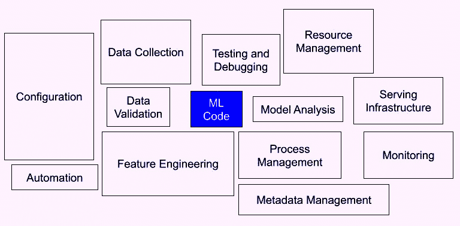

图 6.7 – ML 系统的不同组件

在 IT 行业中，速度、可靠性和信息获取是成功的关键因素，因此，提供竞争优势。无论组织的职能如何，都需要 IT 敏捷性。当考虑基于 AI/ML 的解决方案和产品时，这一点尤为重要。目前，大多数行业仍然手动执行 ML 任务，构建 ML 模型和部署之间存在巨大的延迟。这在 *图 6**.8* 中有所展示：

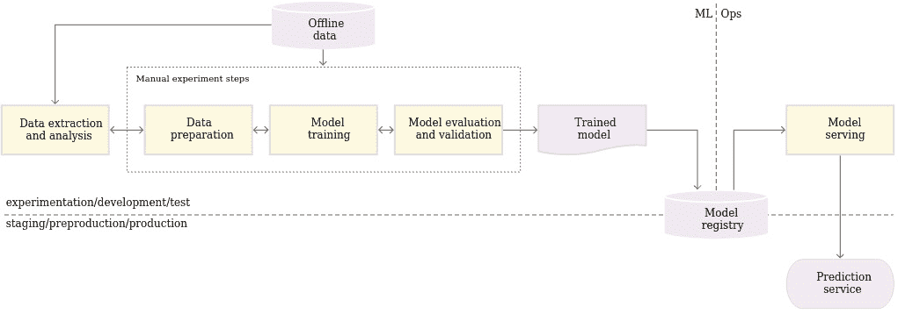

图 6.8 – ML 产品生命周期（图片来源：图 2: https://cloud.google.com/architecture/mlops-continuous-delivery-and-automation-pipelines-in-machine-learning）

收集到的数据经过准备和处理（如标准化、特征工程等），以为 ML 模型提供输入。模型训练后，经过多种度量标准和技术的模型评估，将其发送到模型注册表，并容器化以供服务。

从数据分析到模型服务，每个任务都是手动进行的。此外，从一个任务到另一个任务的过渡也是手动的。数据科学家独立于运维团队工作；训练好的模型交给开发团队，由他们在其 API 基础设施中部署该模型。这可能会导致训练与服务的偏差——即，模型在训练期间的表现与部署后的表现之间存在差异（即服务时的表现）。

由于模型开发与最终部署分离，发布迭代很少。此外，一个巨大的障碍是缺乏主动的性能监控。预测服务没有跟踪或维护模型预测的日志，这对于检测模型行为和性能的任何退化或漂移是必需的。从理论上讲，如果模型很少更改或训练，这一手动过程可能是足够的。然而，在实际操作中，模型在部署到现实世界后常常失败。失败的原因是多方面的：

+   **模型退化**：随着时间的推移，模型的准确度会下降。在传统的机器学习管道中，没有持续监控来识别模型性能的下降并加以纠正。最终，最终用户将承受这个问题。假设你为一家时尚公司提供服务，该公司根据客户的过去购买记录和时尚趋势推荐新款服装。然而，风格随着时间的变化而发生显著变化；秋季的“流行色”在冬季不再适用。如果你的模型不采纳最新的时尚数据并利用这些数据为客户提供推荐，他们会抱怨，最终，网站的用户群体将会缩小。最终，业务团队会注意到这一点，并且在很久之后，通过识别问题，你将被要求根据最新数据更新模型。如果可以持续监控模型的性能，并且有系统来实施针对新数据的持续训练，这种情况是可以避免的。见*图 6.9*：

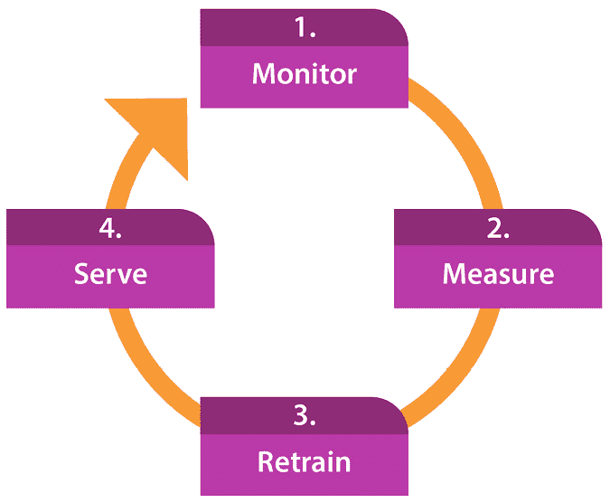

图 6.9 – 持续训练

+   **数据漂移**：训练和测试数据集的输入特征与输出联合分布之间的差异可能导致数据集漂移。当模型最初部署时，真实世界的数据与训练数据集有相似的分布，但这种分布会随着时间的推移发生变化。例如，你建立了一个基于当时可用数据来检测网络入侵的模型。六个月后，你认为它还能像部署时那样有效吗？可能能，但很有可能会迅速偏离——在快速变化的互联网世界里，六个月几乎就是六代！如果有选项可以基于最新数据对指标进行切片，这个问题就能得到解决。

+   **反馈循环**：无意中的反馈可能会操控模型的预测并影响其训练数据。假设某人正在为一家音乐流媒体公司工作，该公司利用推荐系统根据用户的听歌历史和个人资料推荐新专辑。系统推荐的专辑信心度，假设超过 70%。现在，公司决定增加一个喜欢或不喜欢的功能。最初，公司会感到兴奋，因为推荐的专辑会获得越来越多的点赞。然而，随着时间的推移，用户的观看历史将影响模型的预测。因此，系统将开始推荐与用户之前听过的音乐类似的内容，可能会错过用户可能会喜欢的新音乐。持续的系统指标监控是解决此类问题的潜在方案。

要了解机器学习模型所带来的技术债务，我建议您阅读 Sculley 等人所写的论文《*机器学习：技术债务的高利贷信用卡*》。在这篇论文中，详细讨论了机器学习中的技术债务，并涵盖了使用 AI/ML 解决方案的系统所带来的维护成本。

尽管完全消除技术债务既不可能也不必要，但采用整体方法可以减少技术债务。所需的是一个能够将标准 DevOps 管道集成到我们的机器学习工作流中的系统——即机器学习管道自动化，或 MLOps。

MLOps，或称为机器学习（ML）的 DevOps，是一系列最佳实践，旨在将软件**开发**（**Dev**）和**运维**（**Ops**）整合，以加快机器学习模型和预测即服务应用程序的交付。MLOps 的主要目标是提高模型开发、部署和管理的质量与速度，同时减少与部署相关的风险，使其成为在市场中获得竞争优势的重要工具。

数据科学家和工程师之间的紧密协作对于将机器学习模型部署到生产环境中是必不可少的。因此，MLOps 有助于自动化机器学习工作流，并支持端到端的追踪，从数据准备到模型训练，从预测到服务交付。它还使机器学习模型可复现并可审计，这对于遵守诸如 GDPR 等监管要求至关重要。虽然 MLOps 的实施可能比较困难，但有许多工具和框架可以提供帮助，例如**持续集成**（**CI**）的 Jenkins，**持续交付**（**CD**）的 Spinnaker，以及用于机器学习模型管理的 Kubeflow。许多开源工具也可以用来创建 MLOps 管道。除了选择合适的工具外，文化和协作在实施 MLOps 时同样重要。一个成功的跨职能 MLOps 团队是必不可少的。还需要清晰地理解业务目标以及机器学习如何帮助实现这些目标。最终，MLOps 的目标是加速进程，同时保持高质量和合规性。如果做得正确，它可以帮助企业通过加速机器学习模型和应用交付获得优势。

让我们来看看不同的机器学习模型生命周期步骤（参考*图 6.8*）。这些步骤可以通过手动方式或通过自动化管道完成。这些步骤的自动化水平决定了从训练新模型到模型部署之间的时间差，因此可以帮助解决前一部分讨论的问题。自动化机器学习管道应该能够完成以下任务：

+   **允许不同的团队独立工作**：理想情况下，许多团队会参与到 AI/ML 工作流中，从数据收集、数据摄取、模型开发到模型部署。正如*《MLOps 的需求》*部分所讨论的那样，任何一个团队的改变都会影响到其他团队（CACE）。理想的 ML 管道自动化应该允许团队在各自的组件上独立工作，而不受其他团队干扰。

+   **在生产环境中主动监控模型**：构建模型并不是最大的挑战，真正的挑战在于保持模型在生产环境中的准确性。只有在生产中的模型被积极监控、日志被维护且在模型性能低于某个阈值时触发警报，才能实现这一点。这使得你能够检测到性能的任何退化。可以通过进行在线模型验证来实现这一目标。

+   **适应数据漂移**：模型应该随新数据模式的出现而进化，这些新模式在新数据进入时出现。这可以通过在生产管道中增加一个自动化的数据验证步骤来实现。任何数据模式的偏差（缺失特征或特征值异常）应触发数据科学团队进行调查。数据统计特性发生重大变化时，应触发模型的再训练。

+   **持续训练（CT）**：在 AI/ML 领域，每周都会出现新的模型架构，你可能急于试验最新的模型或调整超参数。自动化管道应支持持续训练。当生产模型性能低于其阈值，或检测到数据发生显著漂移时，持续训练变得必要。

+   **可重复性**：此外，可重复性是 AI 领域的一个重要问题，甚至到了 NeurIPS 这样顶级 AI 会议设立可重复性主席的地步。研究人员的目标是提交一个可重复性检查表，帮助其他人复现结果。模块化的组件允许团队独立工作并进行更改而不影响其他团队，这有助于团队将问题缩小到特定组件，从而帮助实现可重复性。

+   **CI/CD**：为了在生产级别上实现快速且可靠的更新，应该建立一个**强大的 CI/CD 系统**。快速、可靠且安全地交付 AI/ML 解决方案可以提升组织的整体表现。

+   **测试**：最后，你可能希望在将模型应用于实际流量之前进行 A/B 测试；这可以通过将新模型配置为处理 10%到 20%的实际流量来实现。如果新模型表现更好，工程师/开发人员可以将所有流量转交给新模型；否则，回滚到旧模型。

本质上，我们需要 MLOps 作为一个集成的工程解决方案，统一 ML 系统的开发和操作。这将允许数据科学家探索各种模型架构，尝试特征工程技术和超参数，并自动将更改推送到部署环境中。*图 6.10* 显示了 ML CI/CD 自动化流水线的不同阶段：

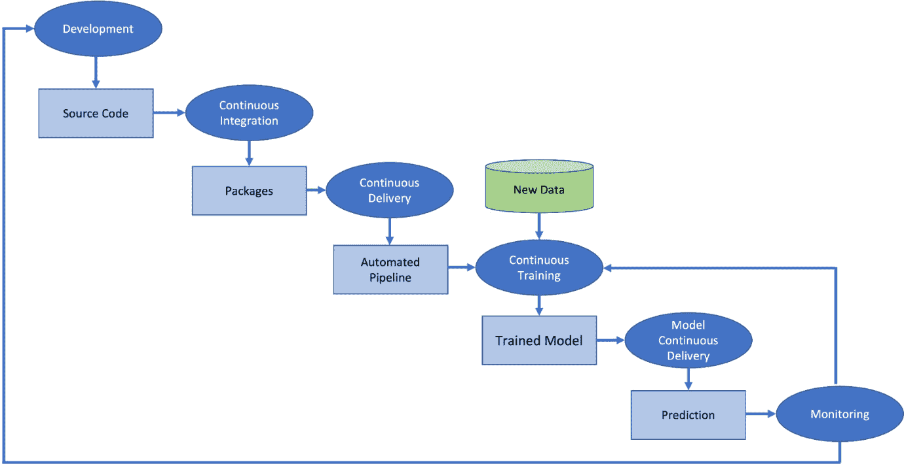

图 6.10 – 带有 CI/CD 的自动化 ML 流水线的各个阶段

完整的自动化流水线包含六个阶段：

1.  **开发/实验**：在此阶段，数据科学家反复尝试各种 ML 算法和架构。一旦满意，他们会将模型的源代码推送到源代码仓库。

1.  **流水线的 CI**：此阶段涉及构建源代码，并识别和输出需要稍后部署的包、可执行文件和工件。

1.  **流水线的 CD**：在*阶段 2* 中生成的工件被部署到目标环境。

1.  **CT**：根据设置的触发器，训练后的模型在此阶段被推送到模型注册表。

1.  **模型的 CD**：在此阶段，部署一个模型预测服务。

1.  **监控**：在此阶段，收集模型性能统计数据，并用来设置触发器以执行流水线或新的实验周期。

在接下来的章节中，我们将介绍一些可以用于实施 MLOps 的 **GCP**（即 **Google Cloud Platform**）工具。我们将讨论 Cloud Run、TensorFlow 扩展和 Kubeflow，后者是本章的重点（以及 Vertex AI）。

# TFX – 一个可扩展的端到端 AI/ML 工作流平台

**TensorFlow 扩展** (**TFX**) 是一个可扩展的端到端平台，用于创建和部署 TensorFlow AI/ML 工作流。TFX 包括用于数据验证、数据预处理、特征工程、AI/ML 模型创建与训练、模型性能评估，最后将模型提供为 REST 和 gRPC API 的库。你可以通过它为多个 Google 产品提供支持来衡量 TFX 的价值，例如 Chrome、Google 搜索和 Gmail。Google、Airbnb、PayPal 和 Twitter 都在使用 TFX。作为一个平台，TFX 使用多个库来创建端到端的 ML 过程。

让我们看看这些库以及它们能做什么：

+   **TensorFlow 数据验证** (**TFDV**)：该库包括用于探索和验证数据的模块。它可以让你查看用于训练和/或测试模型的数据。它提供的统计摘要可用于发现数据中的任何异常。它包括一个自动化的模式创建工具，用于描述期望的数据范围。它还可以在比较不同实验和运行时检测数据漂移。

+   **TensorFlow 转换** (**TFT**)：你可以使用 TFT 对数据进行大规模预处理。TFT 库的函数可以用来评估数据、转换数据并进行高级特征工程活动。使用 TFT 的优势在于它可以模块化预处理过程。TensorFlow 和 Apache Beam 的结合使你能够处理整个数据集——例如，获取最大值和最小值或所有可用的类别——并将数据批次转换为张量。它还利用了 Google Dataflow，这是一项云服务。

+   **TensorFlow Estimator 和 Keras**：这是你可以用来设计和训练模型的标准 TensorFlow 框架。它还为你提供了大量的预训练模型。

+   **TensorFlow 模型分析** (**TFMA**)：这使你能够以分布式方式评估训练好的模型，处理海量数据，并使用训练时设定的相同模型评估指标。它可以让你分析并理解训练好的模型。

+   **TensorFlow 服务** (**TFServing**)：最后，当你对训练好的模型满意时，你可以通过 REST 和 gRPC API 将其交付到在线生产环境中。

这里的图表展示了不同的库如何集成，形成基于 TFX 的 AI/ML 流水线：

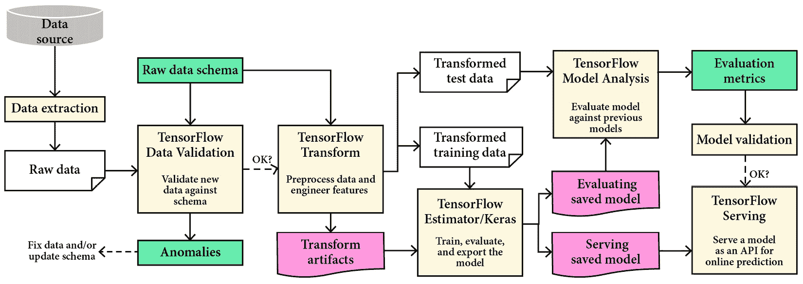

图 6.11 – 基于 TFX 的 AI/ML 流水线（图片来源：图 4: https://cloud.google.com/architecture/mlops-continuous-delivery-and-automation-pipelines-in-machine-learning）

这些阶段中的每一个都可以手动执行；然而，如前一节关于 MLOps 所提到的那样，最好让这些过程自动化执行。为了实现这一点，我们需要一个协调工具，将机器学习工作流中的各个模块（组件）连接起来——这正是 Kubeflow 发挥作用的地方，接下来的章节将讨论这一主题。

# 理解 Kubeflow

你可以使用 Kubeflow 管理整个 AI/ML 生命周期。它是一个原生 Kubernetes **操作支持系统** (**OSS**) 平台，用于在混合云和多云环境中开发、部署和管理可扩展的端到端机器学习工作负载。Kubeflow Pipelines 是 Kubeflow 的一项服务，帮助自动化整个 AI/ML 生命周期，使你能够编排、组织和自动化你的 AI/ML 工作负载。

它是一个开源项目，以下提交图表表明它是一个活跃且不断发展的项目。Kubeflow 的一个关键目标是简化任何人设计、实施和管理可移植、可扩展的机器学习。撰写本文时，Kubeflow 的 GitHub 项目已有 121,000 个星标和超过 2,000 个分叉 ([`github.com/kubeflow/kubeflow/graphs/contributors`](https://github.com/kubeflow/kubeflow/graphs/contributors))：


图 6.12 – 对 Kubeflow GitHub 仓库的贡献

最棒的是，即使你对 Kubernetes 了解不多，你也可以使用 Kubeflow API 来设计你的 AI/ML 工作流。Kubeflow 可以在本地 PC 和任何云平台（如 GCP、Azure、AWS）上使用，支持单节点或集群指定；它旨在在不同环境下可靠地运行。Google 在 2022 年 11 月发布了 Kubeflow 1.2，允许组织在不同环境中运行他们的 ML 流程。Kubeflow 基于以下三个基本原则：

+   **可组合性**：Kubeflow 通过使用特定于 ML 的框架（如 TensorFlow、PyTorch 等）和库（如 scikit-learn 和 pandas），扩展了 Kubernetes 执行独立且可调整任务的能力。这为 AI/ML 工作流中的不同任务提供了不同的库。例如，数据准备和测试可能需要不同版本的 TensorFlow。因此，AI/ML 流程中的每个工作都可以独立容器化并处理。

+   **可移植性**：你可以从任何你想要的地方执行所有 AI/ML 工作流组件——无论是在云端、内部服务器，还是在度假时用笔记本电脑——只要它们都在 Kubeflow 上运行。

+   **可扩展性**：当你需要更多资源时，可以使用它们，且在不再需要时释放它们。Kubeflow 提升了 Kubernetes 在最大化资源可用性和最小化手动操作的情况下扩展资源的能力。

使用 Kubeflow 的一些优势如下：

+   它基于一个共同的基础设施进行标准化。

+   它使用开源、云原生生态系统来创建、编排、部署和运行可扩展、可移植的 AI/ML 工作负载，贯穿 AI/ML 生命周期。

+   它在混合云和多云环境中运行 AI/ML 工作流。

+   此外，在**GKE**（即**Google Kubernetes Engine**）上运行时，你可以利用 GKE 的企业级安全性、日志记录、自动扩展和身份识别功能。

Kubeflow 使用**自定义资源定义**（**CRDs**）来填充集群。它利用容器和 Kubernetes，因此可以在任何已经使用 Kubernetes 的地方使用。

下面列出的 Kubeflow 应用和组件可以用来在 Kubernetes 上组织你的 AI/ML 工作流：

+   **Jupyter notebooks**: Jupyter notebooks 是 AI/ML 从业者进行快速数据分析的事实标准工具。绝大多数数据科学项目都是从 Jupyter notebook 开始的。它们构成了现代云原生机器学习管道的基础。Kubeflow notebooks 允许您在本地执行实验，或者您可以在 notebook 中处理数据、训练模型并进行服务。Notebooks 与架构中的其他部分很好地配合，通过集群的 IP 地址提供对 Kubeflow 集群中其他服务的访问。它们也兼容访问控制和身份验证。Kubeflow 允许您设置多个 notebook 服务器，每个服务器可以运行多个 notebooks。根据服务器的项目或团队，每个 notebook 服务器属于特定的命名空间。Kubeflow 通过命名空间支持多个用户，使得协作和访问控制变得更加容易。在 Kubeflow 上使用 notebook 允许您动态扩展资源。最棒的是，它包括您在 Jupyter 中训练模型所需的所有插件/依赖项，包括 TensorBoard 可视化和可定制的计算资源。Kubeflow Notebooks 提供与本地 Jupyter notebooks 相同的体验，但增加了可扩展性、访问控制、协作和直接提交作业到 Kubernetes 集群的好处。

+   **Kubeflow User Interface (UI)**: 用于运行管道、创建和启动实验、探索管道的图形、配置和输出，甚至调度运行的用户界面。

+   **Katib**: 超参数调优是 AI/ML 工作流中的一个重要步骤。找到正确的超参数空间可能是一个耗时的过程。Katib 促进了超参数调优、早期停止和神经架构搜索（NAS）。它有助于根据所选指标确定最佳的生产配置。

+   **Kubeflow Pipelines**: Kubeflow Pipelines 使您能够创建一系列阶段，涵盖从数据收集到提供训练好的模型的所有内容。由于它们基于容器，每个阶段都是可移植和可扩展的。Kubeflow Pipelines 可用于协调端到端的机器学习工作流。Kubeflow Pipelines 利用机器学习操作可以分解成一系列标准阶段这一事实，这些阶段可以以有向图的形式进行排列。每个 Kubeflow 管道作业都是一个自包含的代码单元，打包为 Docker 镜像，包含输入（参数）和输出。这种作业容器化使得可移植性成为可能，因为管道是自包含的程序，可以在任何地方运行。此外，相同的代码可以在另一个 AI/ML 管道中重复使用——任务可以被复用。

+   **Metadata（元数据）**：在 AI/ML 工作流中，跟踪和管理元数据是非常有用的。元数据的跟踪可以用于执行实时模型评估，有助于检测数据漂移或训练与服务之间的偏差。它还可以用于审计和合规，帮助您查看哪些模型正在生产中并监控其表现。元数据组件默认随 Kubeflow 安装。许多 Kubeflow 组件会写入元数据服务器。此外，您还可以通过您的代码将数据写入元数据服务器。可以通过 Kubeflow UI 来查看元数据——通过工件存储。

+   **KFServing**：这允许您在任意框架上提供 AI/ML 模型服务。它包括自动扩展、网络和金丝雀发布等功能，且具有一个易于使用的界面来将模型提供到生产环境。通过使用 YAML 文件，您可以配置资源来服务和计算模型及其预测。金丝雀发布使您能够在不影响用户体验的情况下测试和更新模型。

+   **Fairing**：这是一个 Python 包，允许您在混合云环境中构建、训练和部署您的 AI/ML 模型。

总结来说，*Kubeflow 提供了一套兼容的工具和工件，它们是运行生产级 AI/ML 应用的核心*。这帮助组织在整个机器学习生命周期中标准化统一的建模基础设施。AI/ML 工作流中的另一个重要步骤是超参数调优，因此接下来我们将探讨 Katib，它是一个 Kubernetes 集群，提供超参数调优和 NAS 的选项。

# Katib 用于超参数调优

Katib 是一个可扩展的、原生 Kubernetes 的 AutoML 平台，支持超参数调优和 NAS。*图 6.13* 显示了 Katib 的设计。要了解其工作原理，读者应参考 *Katib: A Distributed General AutoML Platform* *on Kubernetes*：

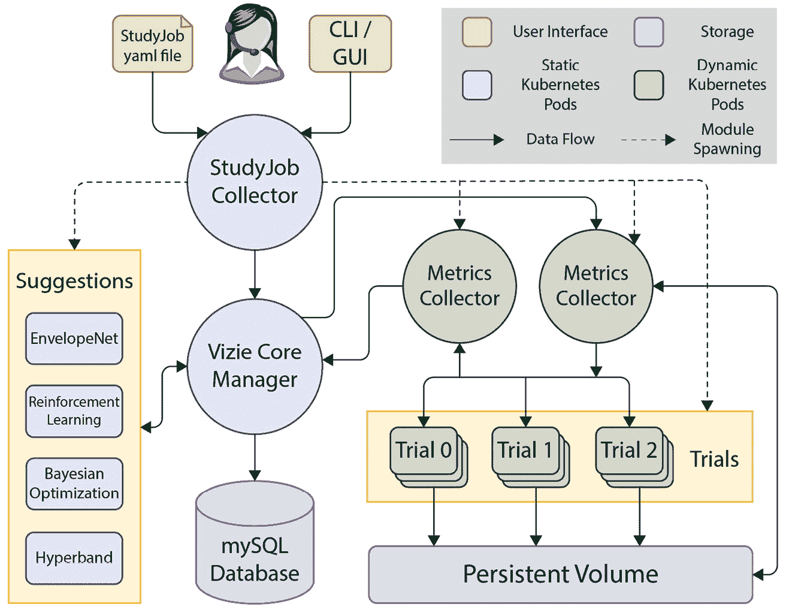

图 6.13 – Katib 作为通用 AutoML 系统的设计（论文中的图 2：https://www.usenix.org/system/files/opml19papers-zhou.pdf）

Katib 通过 YAML 文件规范、Jupyter Notebook 和 Python SDK 支持命令行超参数调优。它还提供图形界面来指定调优设置并可视化结果，如下所示：

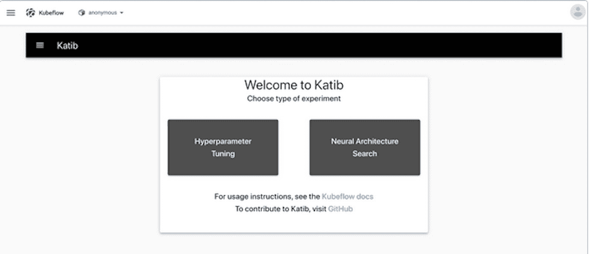

图 6.14 – Katib 的图形界面

Katib 允许您选择度量标准，并决定是减少还是增加它。您可以选择要调整的超参数，并查看整个实验和各个运行的结果。

*图 6.15* 展示了 Katib 运行的结果，以验证准确度为指标，学习率、层数和优化器作为需要调优的超参数：

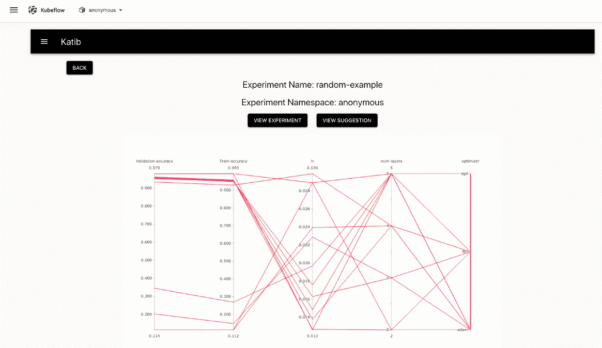

图 6.15 – Katib 生成的超参数调整结果

另一个有趣的平台，既支持 MLOps 又支持 AutoML，是 Google 提供的 Vertex AI，我们接下来将介绍它。

# Vertex AI

Kubeflow 允许您编排 MLOps 工作流程。但是，您仍然需要处理 Kubernetes 集群。一个更好的解决方案是根本不需要担心集群的管理——这就是 Vertex AI 管道的用武之地。您可以在 Vertex AI 中使用 Kubeflow 管道或 TFX 管道。Vertex AI 为 ML 工作流的每个步骤提供工具，从管理数据集到不同的模型训练方式，评估和部署，以及进行预测。简而言之，Vertex AI 为您的 AI 需求提供了一站式解决方案。无论您是一个没有编码经验但有一个可以利用 AI 的好点子的初学者，还是一个经验丰富的 AI 工程师，Vertex AI 都能为您带来一些价值。Vertex AI 的 AutoML 功能使初学者可以轻松开始 ML；您只需加载数据，使用 Vertex AI 提供的数据探索工具，并开始训练模型。

专业的 AI 工程师可以创建自己的训练循环，通过云端训练他们的模型，并使用端点将其投入生产。此外，Vertex AI 允许您进行本地模型训练、部署和监控。Vertex AI 是一个全面的 AI/ML 平台，具有简化的用户界面，如*图 6**.16*所示：

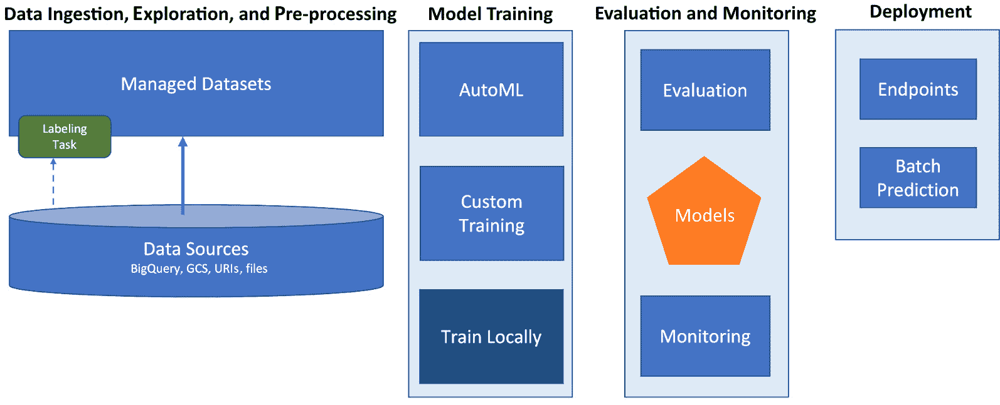

图 6.16 – Vertex AI 完整 AI/ML 工作流的统一界面

*图 6**.17*展示了 Vertex AI 仪表板；在接下来的章节中，我们将探讨其许多有用的功能：

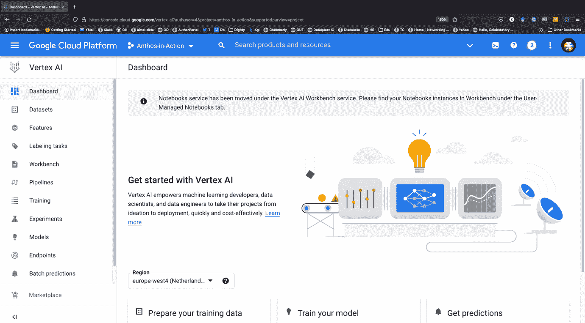

图 6.17 – Vertex AI 仪表板

接下来，我们将探讨 Vertex AI 支持的数据类型及其处理方法。

## 数据集

图像、视频、文本和表格都受 Vertex AI 支持。您可以在下表中查看使用 Vertex AI 管理的数据集完成的 AI/ML 任务的详细信息：

| **数据类型** **的类型** | **支持的任务** |
| --- | --- |
| 图像 |

+   图像分类（单标签）

+   图像分类（多标签）

+   图像目标检测

+   图像分割

|

| 视频 |
| --- |

+   视频动作识别

+   视频分类

+   视频物体跟踪

|

| 文本 |
| --- |

+   文本分类（单标签）

+   文本分类（多标签）

+   文本实体提取

+   文本情感分析

|

| 表格 |
| --- |

+   回归

+   分类

+   预测

|

表 6.1 – Vertex AI 支持的数据类型和 AI 任务类型

对于图像、视频和文本数据集，如果没有标签，您可以使用 Google 提供的标注服务。包含图像 URI 和标签的文件也可以从您的计算机导入。此外，您还可以从 Google Cloud Storage 导入数据。需要注意的是，上传的数据将使用 Google Cloud Storage 来存储您从计算机上传的文件。Vertex AI 仅支持 `.csv` 文件用于表格数据。您可以从本地计算机、云服务或从 BigQuery 导入它们。

Vertex AI 允许您在指定数据后浏览和分析数据。如果数据没有标签，您可以直接在浏览器中浏览数据并分配标签。此外，Vertex AI 提供了自动化或手动执行测试-训练验证分割的选项。*图 6.18* 展示了使用 Vertex AI 管理数据集服务对 HR 分析数据进行的分析（[`www.kaggle.com/arashnic/hr-analytics-job-change-of-data-scientists?select=aug_train.csv`](https://www.kaggle.com/arashnic/hr-analytics-job-change-of-data-scientists?select=aug_train.csv)）。

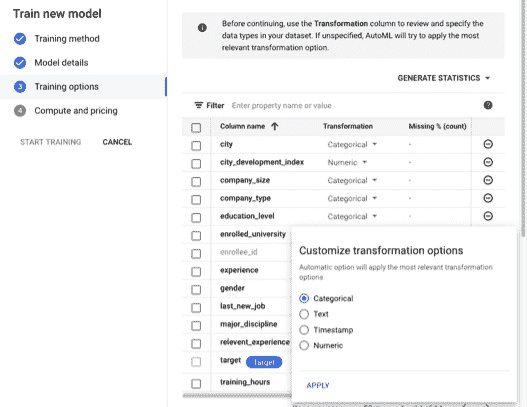

图 6.18 – AutoML 配置用于表格数据 – 选择训练参数和变换

Vertex AI 还提供了**特征库**选项，可用于分析数据的特征。使用相同的特征数据分布进行训练和服务可以帮助减少训练-服务偏差。此外，**特征库**还可以帮助识别模型或数据漂移。此外，Vertex AI 为需要此服务的用户提供数据标注服务。

## Vertex AI 中的训练和实验

您已完成和正在进行的训练任务将在 Vertex AI 仪表板的**训练**选项卡中显示。这也可以作为一个全新训练序列的起点。只需选择**创建**，然后再次选择**创建**，然后按照屏幕上的提示完成该过程。如果选择 AutoML 路径，您可以指定应用于表格数据的变换，并选择用于训练的特征。目标函数也可以自定义。完成选择后，您只需设置您能够投入的训练时间（最短为一个小时）。如果模型在训练过程中没有取得进展，最好提前停止训练，如*图 6.19*所示。

**实验**选项卡可以让您跟踪、可视化和比较 ML 实验，并与他人分享：


图 6.19 – AutoML 配置用于表格数据 – 选择预算和提前停止

我们已使用 HR 分析数据（[`www.kaggle.com/arashnic/hr-analytics-job-change-of-data-scientists?select=aug_train.csv`](https://www.kaggle.com/arashnic/hr-analytics-job-change-of-data-scientists?select=aug_train.csv)）展示了如何预测数据科学家是否打算换工作。在训练模型时，我们使用了除了注册 ID 之外的所有可用数据。数据文件中有一列显示数据科学家是否积极寻找工作，我们使用此列作为目标列。

Vertex AI 中的模型与端点

**模型**标签包含关于训练模型的全面信息。这些模型已完整评估了测试数据集（当使用托管数据集训练时）。此外，对于表格数据，所有特征的特征重要性也可以访问。数据可以在仪表盘上以可视化或直接以文本的形式查看。

模型训练的预算为每小时 1 个节点。训练总时长约为 1 小时 35 分钟。AutoML 训练的模型在*图 6.20*中展示了测试数据集评估结果：

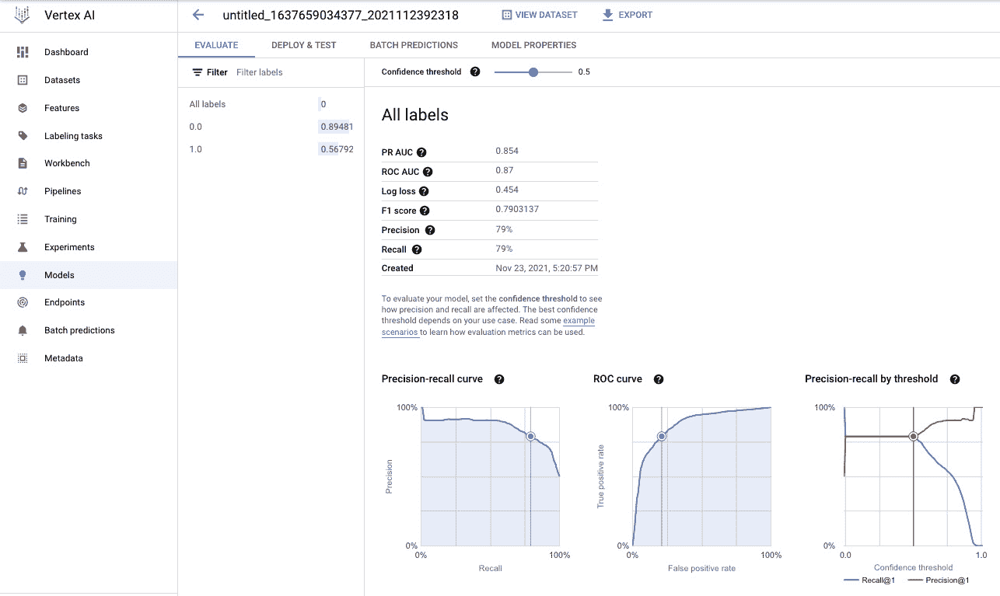

图 6.20 – 测试数据集的模型评估

现在请参考下图，展示了矩阵和特征重要性：

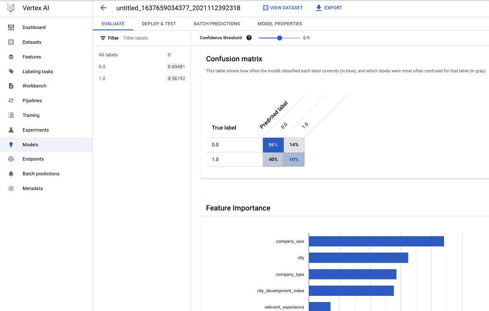

图 6.21 – 混淆矩阵和特征重要性

仪表盘使得检查模型预测变得简单。为了测试，模型必须部署到端点。Vertex AI 还提供了将模型保存在容器中的选项（以 TensorFlow **SavedModel** 格式），然后可以将模型用于任何其他本地或云服务。让我们继续选择**部署到端点**，将模型发送到某个地方。以下是可用的部署选项：

+   为端点命名。

+   选择流量拆分 – 对于单个模型，流量为 100%，但如果有多个模型，可以拆分流量。

+   选择最少数量的计算节点。

+   选择机器类型。

+   如果选择了模型可解释性选项，Vertex AI 为表格数据提供了一个采样的 Shapley 可解释性方法。

+   选择你希望关注的模型方面（特征漂移或训练与服务偏差），并相应调整警报设置。

初步设置完成后，部署过程快速且简单。现在让我们来测试一下预测（支持单次和批量预测）。从*图 6.22*可以清晰看出，数据科学家在选择的输入条件下，信心水平约为 0.67，因此并未积极寻求就业。我们可以使用 REST API 或 Python 客户端向模型发送测试请求。Vertex AI 端点提供了相关代码，支持这两种示例请求。

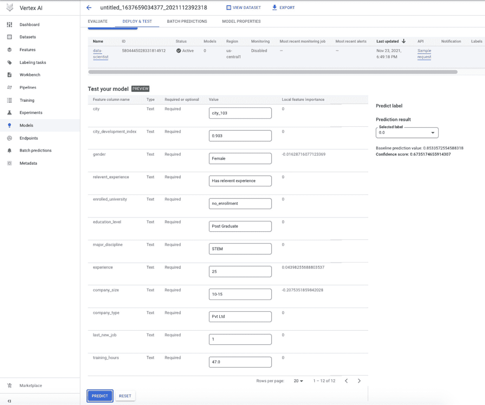

图 6.22 – 模型预测

项目中部署的所有模型和端点分别列在仪表板的 **Models** 和 **Endpoints** 标签页中。

## Vertex AI Workbench

Vertex AI Workbench 与 JupyterLab 和 Jupyter Notebook 兼容。用户可以选择预制的笔记本或托管笔记本。在托管笔记本中，所有流行的深度学习框架和模块都已包含，您甚至可以使用 Docker 镜像添加自己的 Jupyter 内核。用户管理的笔记本提供了许多有用的起点。用户可以根据需要配置笔记本，选择 **虚拟中央处理单元**（**vCPUs**）和 **图形处理单元**（**GPUs**）。如果你是 Vertex AI 的新手，建议从托管笔记本开始。然而，如果你需要更多的管理权限，用户管理的笔记本是更好的选择。

要进入您的 JupyterLab 环境，在笔记本创建完成后，点击 **OPEN** **JUPYTERLAB** 链接。


图 6.23 – Vertex AI Workbench 中的 Jupyter 笔记本列表

Vertex AI Workbench 可以与 TFX 或 Kubeflow 配合使用，执行数据探索、模型构建、训练并运行代码。

Vertex AI 提供了统一的界面，涵盖所有 AI/ML 流程组件。您可以为模型训练和实验设置管道。该界面提供了一种简单的方法来调整超参数。可以选择自定义训练，允许用户从容器中选择并直接加载代码进行训练。Vertex AI 还集成了 AutoML，以加速 ML 工作流。通过 AutoML，您可以在受控数据集上获得高效的 ML 模型，并且所需的 ML 技能最少。使用特征归因，Vertex AI 还为其模型提供了解释性。当您的模型完成后，您可以选择端点进行批量或单次预测，并将模型部署到这些端点上。部署的最重要方面是能够在边缘设备上进行部署，并将模型放置在数据所在的位置。

# 总结

本章提供了有关 AutoML 和 MLOps 的全面概述。首先介绍了 AutoML 的概念，并解释了如何使用它自动化训练和调整大量候选模型的过程。本章还包括了使用 H2O AutoML 的实践示例，并讨论了 Microsoft Azure 和 Amazon SageMaker Autopilot 提供的 AutoML 功能。接着，本章介绍了 MLOps 的概念以及将其纳入 AI/ML 工作流的重要性。

本章简要介绍了 TFX 的特点，TFX 是一个基于 TensorFlow 的工具包，用于构建完整的机器学习管道。它提供了一系列库和预构建组件，可以轻松地用来构建和部署机器学习模型。

还介绍了 Kubeflow，一个旨在简化在 Kubernetes 上运行机器学习工作负载的开源项目，使其具有可移植性和可扩展性。我们还展示了如何使用 Katib 进行超参数调优，Katib 是一个基于 Kubernetes 的超参数调优系统。

最后，我们探索了谷歌的 Vertex AI。该平台提供了一个简单易用的接口，用于构建、部署和管理机器学习模型。通过使用 Vertex AI，我们训练并部署了一个基于人力资源分析数据训练的模型。

现在你已经熟悉了机器学习管道以及用于自动化的各种工具，在接下来的章节中，我们将讨论数据收集中的公平性概念。

# 进一步阅读

+   *大规模图像分类器的演化*。发表于*国际机器学习会议*，第 2902-2911 页，PMLR，2017 年，Real, Esteban, Moore, Sherry, Selle, Andrew, Saxena, Saurabh, Suematsu, Yutaka Leon, Tan, Jie, Le, Quoc V., 和 Kurakin, Alexey：[`proceedings.mlr.press/v70/real17a/real17a.pdf`](http://proceedings.mlr.press/v70/real17a/real17a.pdf)。

+   *通过强化学习进行神经架构搜索*。*arXiv 预印本 arXiv:1611.01578*（2016），Zoph, Barret, 和 Le, Quoc V：[`arxiv.org/pdf/1611.01578.pdf`](https://arxiv.org/pdf/1611.01578.pdf)。

+   *神经架构搜索：综述*。*机器学习研究杂志*，20，第 1 期（2019）：1997-2017，Elsken, Thomas, Metzen, Jan Hendrik, 和 Hutter, Frank：[`www.jmlr.org/papers/volume20/18-598/18-598.pdf?ref=https://githubhelp.com`](https://www.jmlr.org/papers/volume20/18-598/18-598.pdf?ref=https://githubhelp.com)。

+   *H2O AutoML：可扩展的自动化机器学习*。发表于*ICML 自动化机器学习研讨会论文集*，2020 年，LeDell, Erin, 和 Poirier, Sebastien：[`www.automl.org/wp-content/uploads/2020/07/AutoML_2020_paper_61.pdf`](https://www.automl.org/wp-content/uploads/2020/07/AutoML_2020_paper_61.pdf)。

+   *走向自动化机器学习：AutoML 方法和工具的评估与比较*，Truong, Anh, Walters, Austin, Goodsitt, Jeremy, Hines, Keegan, Bruss, C. Bayan, 和 Farivar, Reza。发表于 2019 年 IEEE 第 31 届人工智能工具国际会议（ICTAI），第 1471-1479 页，IEEE，2019 年：[`arxiv.org/pdf/1908.05557&ved=2ahUKEwjS0Zes2ermAhUqTt8KHdCF AhkQFjAGegQIBxAS&usg=AOvVaw0b_JUomS-A1rtsy7v5ZA64.pdf`](https://arxiv.org/pdf/1908.05557&ved=2ahUKEwjS0Zes2ermAhUqTt8KHdCF%20AhkQFjAGegQIBxAS&usg=AOvVaw0b_JUomS-A1rtsy7v5ZA64.pdf)

+   *AutoML：最前沿技术的调查。基于知识的系统*，212（2021）：106622，He, Xin, Zhao, Kaiyong, 和 Chu, Xiaowen。: https://arxiv.org/pdf/1908.00709.pdf?arxiv.org。

+   *机器学习系统中的隐性技术债务*，Sculley, David, Holt, Gary, Golovin, Daniel, Davydov, Eugene, Phillips, Todd, Ebner, Dietmar, Chaudhary, Vinay, Young, Michael, Crespo, Jean-Francois, 和 Dennison, Dan。《神经信息处理系统进展》，28（2015）：[`proceedings.neurips.cc/paper/2015/file/86df7dcfd896fcaf2674f757a2463eba-Paper.pdf`](https://proceedings.neurips.cc/paper/2015/file/86df7dcfd896fcaf2674f757a2463eba-Paper.pdf)。

+   *基于 Kubernetes 的分布式通用 AutoML 平台*，Zhou, Jinan, Velichkevich, Andrey, Prosvirov, Kirill, Garg, Anubhav, Oshima, Yuji, 和 Dutta, Debo. Katib。发表于 2019 年 USENIX 运维机器学习大会（OpML 19），第 55–57 页，2019 年：[`www.usenix.org/system/files/opml19papers-zhou.pdf`](https://www.usenix.org/system/files/opml19papers-zhou.pdf)。

# 第三部分：模型优化与生命周期管理的设计模式

本书的这一部分深入探讨了围绕人工智能和机器学习系统的关键伦理问题和挑战，重点关注公平性、可解释性和模型治理。首先，讨论了各种公平性概念以及公平数据收集的重要性，突出了偏见数据对模型性能和社会影响的作用。接着，讨论了模型优化中的公平性，提出了减少偏差和确保公平结果的技术方法。还讨论了模型可解释性；我们将探索解释复杂模型的方法和工具，并促进对 AI 系统的信任。最后，书中探讨了人工智能的更广泛伦理影响和挑战，强调了在 AI 解决方案的开发和部署中，模型治理、问责制和透明度的重要性。通过提供理论洞察和实际指导，本部分将帮助你深入理解 AI 和机器学习的伦理维度，推动负责任和公平的 AI 系统的开发与部署。

本部分由以下章节组成：

+   *第七章*，*公平性概念与公平数据收集*

+   *第八章*，*模型优化中的公平性*

+   *第九章*，*模型可解释性*

+   *第十章*，*伦理学与模型治理*
