# 8

# 模型优化中的公平性

**机器学习**（**ML**）在近年来取得了巨大的进步，应用范围从金融到医疗保健。然而，这些系统往往不透明，并且可能对某些群体存在偏见。为了让 ML 发挥其潜力，我们必须确保它是公平且无偏的。

在*第七章*中，我们讨论了数据生成中的公平性概念。在本章中，我们将介绍优化约束和技术，这些对于优化和获取公平的机器学习（ML）模型至关重要。本章的重点是让你了解由研究揭示的新型自定义优化器，这些优化器可用于构建公平的监督式、无监督式和半监督式 ML 模型。从更广泛的角度来看，你将学习创建和定义模型约束的基础步骤，这些约束可以在训练过程中被不同的优化器使用。你还将了解如何使用适当的指标评估这些基于约束的模型，以及使用优化技术时所带来的额外训练开销，这将帮助你设计自己的算法。

本章将涵盖以下主题：

+   机器学习中公平性概念的应用

+   公平性问题的显性与隐性缓解

+   分类任务的公平性约束

+   回归任务的公平性约束

+   聚类任务的公平性约束

+   强化学习中的公平性约束

+   推荐任务的公平性约束

+   公平性挑战

# 技术要求

本章要求你具备 Python 3.8 及以下一些 Python 库：

+   TensorFlow 2.7.0

+   NumPy

+   Matplotlib

# 机器学习中的公平性概念

公平性是一个主观的术语。根据文化、时间、种族等不同，公平的含义各不相同。我们可以不厌其烦地讨论社会中的公平话题；然而，在本章中，我们关注的是与机器学习相关的公平性。在*第七章*中，你已经熟悉了公平性的概念，以及数据在你 ML 模型的公平性中所扮演的重要角色。在本章中，我们将进一步扩展公平性的概念。

正如你可能已经意识到的那样，公平性并没有统一的定义。例如，从组织的角度来看，公平可以有三个不同的维度（Cropanzano 等，2001 年，见*进一步阅读*）：

+   **分配公平性**：算法在分配重要资源时应当公平，例如在招聘中。

+   **互动公平性**：算法应该能够解释其背后的原理，且算法提供的解释应该被相关人员认为是公平的，例如，为什么 *A* 应该比 *B* 获得晋升。

+   **程序公平性**：算法在组织内对不同子群体的使用不应产生不同的结果，例如，女性和男性的推荐结果不应不同。如果有不同，应该是因为可以解释的社会或生物学原因。

这些内容在*图 8.1*中有所展示。

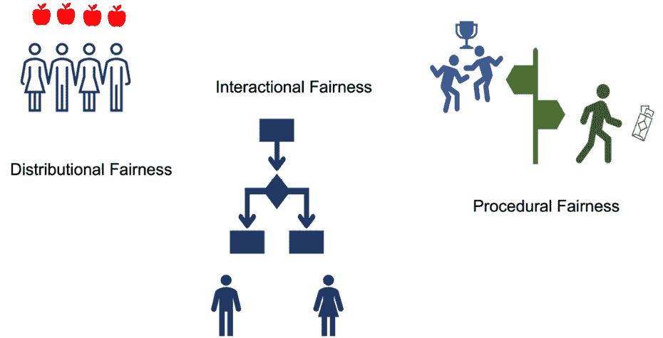

图 8.1 – 组织中公平性的不同维度

偏见和公平性是机器学习领域常常交替使用的两个术语。然而，我们认为它们应当加以区分。借鉴 Booth 的观点（[`dl.acm.org/doi/fullHtml/10.1145/3462244.3479897`](https://dl.acm.org/doi/fullHtml/10.1145/3462244.3479897)），我们将偏见定义为一种系统性错误，它基于特定的输入信息（如性别和地理位置）改变模型的决策。通常被称为测量偏见，这种偏见的产生要么是因为向输入特征空间添加了不必要的信息（**构建污染**），要么是因为模型没有捕捉到你正在测量的所有方面（**构建缺失**）。这里的**构建**是指那些不能直接测量的特征，而需要通过测量来推断。*图 8.2*展示了偏见的不同来源。


图 8.2 – 测量来源（改编自 Booth 等，2021）

一个有偏的模型不一定是坏事——模型可能是有偏的，但仍然是公平的（*图 8.3*）。正如 Pessach 等人在《算法公平性》一文中所阐述的那样，一个模型可以同时考虑 SAT 成绩和人口统计信息来进行录取选择，并根据学生是否来自特权背景或非特权背景不平等地分配名额，倾向于那些来自贫困背景的学生。虽然这样的模型是*有偏的*，但它是*公平的*，因为来自贫困背景的学生为了取得该成绩必须克服更多挑战，并且可能具有更高的潜力。

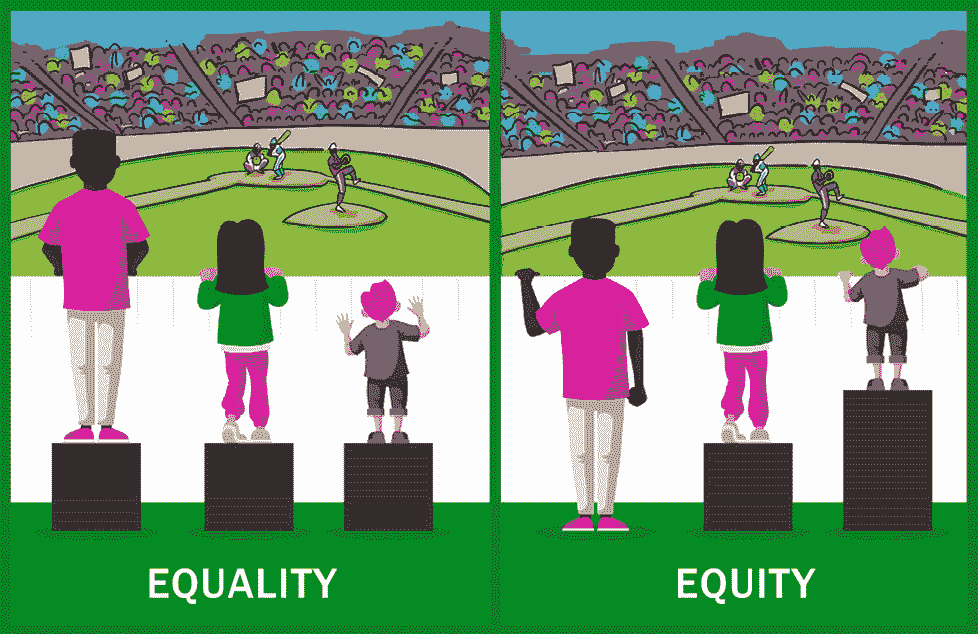

图 8.3 – 基于候选人的人口统计信息等进行的资源分配偏见可以通过为社会中代表性不足的群体提供工具来实现公平的算法

现在我们已经划定了公平性和偏见之间的界限，接下来我们将探讨不公平性及其缓解方法。

# 不公平性缓解方法

近年来，研究人员开发了各种技术来缓解 AI 模型中的不公平性。这些方法可以应用于模型开发的不同阶段：

+   **预处理**：预处理方法通过调整训练数据的分布，使敏感群体平衡。

+   **后处理**：后处理方法通过在模型训练完成后对预测结果进行校准来工作。

+   **处理中**：这些方法将公平性直接纳入模型设计中。

在*第七章*中，我们讨论了预处理方法和技术。在本章中，我们将首先讨论处理中不公平性缓解方法，随后讨论应用于不同机器学习任务的各种公平性约束。

## 处理中方法

使用处理中方法具有一定的优势：

+   已经观察到，机器学习模型通常会放大数据中存在的偏见。使用处理中技术来缓解不公平性可以帮助解决这个问题。因为放大的问题是由算法引起的，而处理中方法在模型优化的同时考虑了公平性，可以帮助减少或消除这个问题。

+   微调预训练模型已成为根据有限的训练数据定制不同任务建模的流行方法。尽管从预训练模型中进行迁移学习缓解了对大量训练数据的需求，但由于预训练模型通常是在有偏数据上训练的，预训练模型中的偏见问题变得更加关键。通过使用对比学习等技术，可以利用处理中方法来缓解预训练模型中的不公平性。

开发高效的处理中方法仍然是一个挑战。现有的算法不足，我们需要专注于开发新的方法，以解决当敏感属性未披露或不可用时的公平性问题。

处理中不公平性缓解方法可以进一步细分为两类：**隐式方法**和**显式方法**。在显式方法中，通过在目标函数中引入公平性度量，使用公平性约束或正则化参数来实现不公平性缓解。另一方面，隐式方法依赖于修改深度学习模型的学习策略——例如，在训练过程中加入对抗样本。显式方法易于实现，且通常具有灵活性。现在让我们探索如何通过显式方法来缓解不公平性。

注意

在*第七章*中，我们讨论了许多公平性衡量指标。在本章中，我们将称一个算法为公平的，如果它能够在其设计的公平性指标上取得良好的结果。

在本章的其余部分，我们将讨论各种不公平性缓解的技术。具体来说，我们将处理两个特定的公平性问题：

+   **不同的待遇**：不同的待遇是指基于个人的种族、性别或其他受保护特征而对其进行不同对待的情况。例如，如果一个算法在主要是男性的数据上进行训练，它可能会为男性候选人预测更高的薪资增长，而为女性候选人预测较低的薪资增长，尽管他们拥有相同的工作经验年数。通常，不同的待遇源于偏见数据，或在训练模型时使用敏感信息。

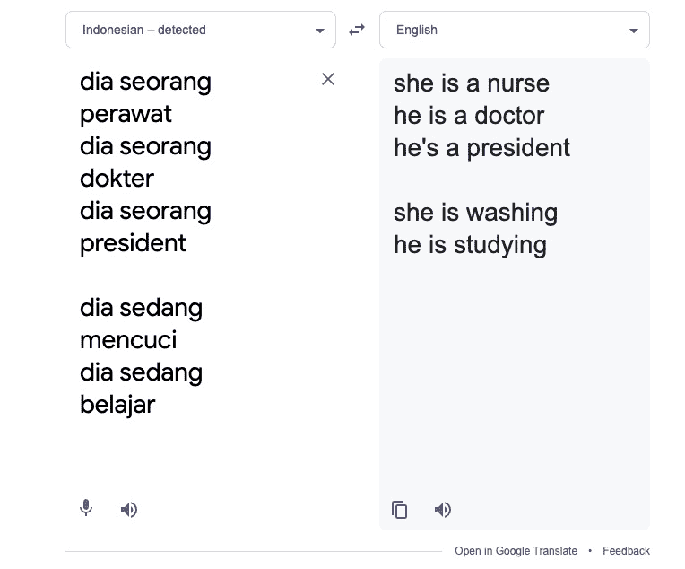

图 8.4 – Google 翻译算法的不公平待遇示例（摘自 Fitria，2021）

+   **不同的影响**：不同的影响是指模型在处理某些群体时存在差异，即使模型没有明确地在对应的敏感属性上进行训练。例如，如果一个算法在主要是男性的数据上进行训练，它可能会学会将男性名字与高职位关联，将女性名字与低职位关联。这种情况可能在模型无意中创建了一些与敏感信息相关的代理属性时发生。

# 显式不公平性缓解

如前一节所讨论的，通过在损失函数中添加正则化项或包括约束来显式地减轻不公平性。在本节中，我们将扩展关于显式不公平性缓解技术的内容，并探讨一些最近提出的策略。

## 分类任务的公平性约束

首先，让我们了解一下机器学习中的分类任务。假设*Y*、*X*和*S*是随机变量，分别对应类别/标签、非敏感输入特征和敏感输入特征。我们的训练数据集 D 将由这些随机变量的实例组成：

D = { (y, x, s) }

分类任务的目标是找到一个由参数Θ定义的模型 M，使其能够在给定敏感和非敏感特征的情况下正确预测类别的条件概率 M[Y|X,S; Θ]。模型参数通过使用**最大似然估计**（**MLE**）来估计：


让我们看看如何修改这个损失函数以减轻不公平性。

### 添加偏见移除正则化器

Kamishima 等人提出的论文《公平意识分类器与偏见移除正则化器》引入了一个偏见移除正则化项到损失函数中，如下图所示：

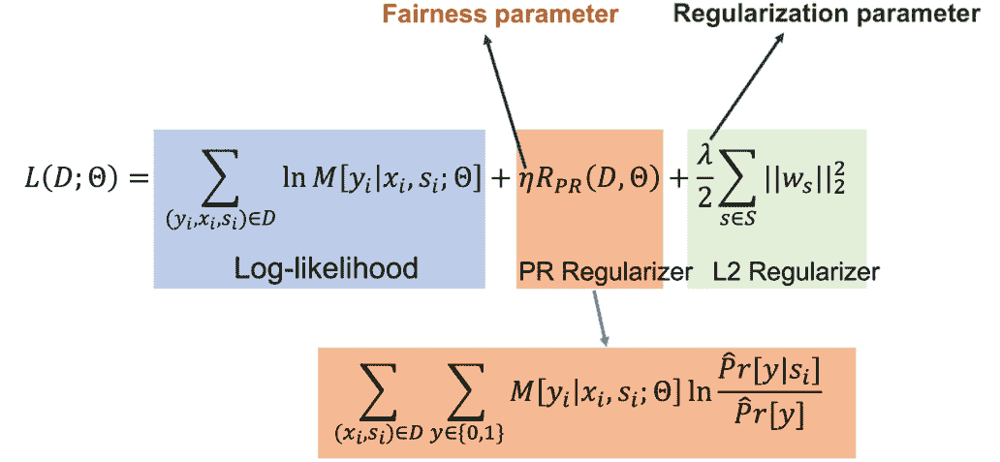

图 8.5 – 向损失函数中添加偏见移除正则化项

为了衡量模型的公平性，`util`模块包含了`CVS`函数来计算得分。为了有一个对比点，首先构建一个简单的分类器是很有益的：

1.  首先，我们创建一个函数来创建一个简单的四层神经网络分类器。在每一层之间，我们添加了丢弃层进行正则化，以避免过拟合：

    ```py
    def Classifier(n_features, n_hidden=32, p_dropout=0.2,train=True):
        with nn.parameter_scope('classifier'):
            layer1 = PF.affine(n_features, n_hidden, name='layer1')
            layer1 = F.relu(layer1)
            if (train):
                layer1 = F.dropout(layer1,p_dropout)
            layer2 = PF.affine(layer1, n_hidden, name='layer2')
            layer2 = F.relu(layer2)
            if (train):
                layer2 = F.dropout(layer2,p_dropout)
            layer3 = PF.affine(layer2, n_hidden, name='layer3')
            layer3 = F.relu(layer3)
            if (train):
                layer3 = F.dropout(layer3,p_dropout)
            layer4 = PF.affine(layer3, 1, name='layer4')
        return layer4
    ```

上述代码利用了 NNabla（以`nn`导入）库来构建网络。

1.  现在，如果我们使用之前的函数创建一个简单的分类器，并在`Adult`数据集上进行训练（[`archive.ics.uci.edu/ml/datasets/Adult`](https://archive.ics.uci.edu/ml/datasets/Adult)），结果将显示准确率和 CV2NB 得分：

    ```py
    Classifier accuracy :  84.85797101449275 Classifier CV2NB Score : 0.1644
    ```

1.  但是现在，如果你包含偏见移除正则化项并使用修改后的损失函数重新训练相同的分类器，你会发现 CV2NB 得分有所提高：

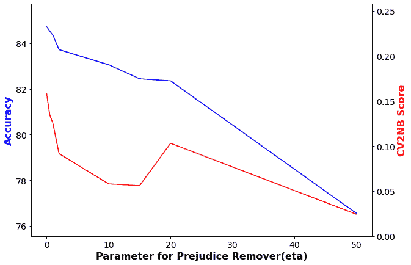

图 8.6 – 在成人数据集上添加偏见移除正则化项到损失函数后，准确率与 CV2NB 得分的对比

在上图中，我们可以看到，随着η（公平性参数）的增加，CV2NB 得分也有所提高。更大的公平性参数值会增强公平性。然而，我们可以看到，增加公平性的代价是准确性；二者之间必须找到一个平衡点。并且，你可以看到，带有偏见移除正则化项的分类器的 CV2NB 得分为 0.16，相比于没有使用偏见移除正则化项的分类器（*图 8.6*），得分更高，从而证明了添加正则化项可以创建一个更公平的模型。

### 修改目标

这方面的很多工作是由 M. B. Zafar 完成的。那些对他完整的工作感兴趣的人可以参考他的 GitHub 仓库：[`github.com/mbilalzafar/fair-classification`](https://github.com/mbilalzafar/fair-classification)。我们将考虑两种不同的分类器：**支持向量机**和**逻辑回归**。这两种分类器的共同点在于，它们都基于寻找一个决策边界来分隔类别。在支持向量机中，决策边界是通过最大化最小支持向量之间的距离来找到的，而在逻辑回归中，决策边界是通过最小化对数损失函数来找到的。

为了简单起见，我们考虑二元分类器的情况。对于线性二元分类器，决策边界定义如下：

ΘTX = 0

这里，Θ指的是定义决策边界的超平面系数。

为了使其生效，针对不公平对待的公平性是通过确保敏感属性（*S*）不参与决策/预测来保证的。按照我们的做法，这意味着 S ∩ X = ∅；也就是说，它们是互不相交的。

对于差异影响，使用 80%规则（更一般地称为 p 规则）作为公平性指标。将 80%规则转换为距离边界，它意味着如果 dθ(*x*)是特征向量*x*到决策边界的有符号（或定向）距离，则具有特定敏感特征的用户与没有该敏感特征的用户在正有符号距离上的比率不低于 80:100。数学上，对于一个二元敏感属性，s ∈ {0,1}，我们可以将 p 规则表示如下：


为了缓解不公平，Zafar 等人引入了决策边界协方差的概念。他们将其定义为用户的敏感特征与用户输入特征到决策边界的有符号距离之间的协方差。数学上，它可以表示为：


简化后，这个表达式被缩减为以下形式：


因为这是一个凸函数，所以很容易将其纳入分类器目标中。让我们来实践一下。我们创建了一个具有两个敏感特征和一个非敏感特征的合成数据集。以下图表显示了生成的数据点。


图 8.7 – 使用两个敏感特征和一个非敏感特征生成的合成数据（仅显示 200 个样本点）

我们生成的数据的详细信息如下：

```py
Total data points: 4000
# non-protected examples: 1873
# protected examples: 2127
Non-protected in positive class: 1323 (71%)
Protected in positive class: 677 (32%)
```

如果我们不使用任何公平性约束，训练一个简单的分类器，那么得到的准确度是 87%，但该分类器仅遵循 41%的 p 规则，而不是期望的 80%。现在，我们可以采取两种策略：

+   **在公平性约束下最大化准确度**：在这种情况下，约束条件设置为使 p 规则得到满足，同时最大化分类器的准确度。通过以下方式实现：

在满足和的条件下最小化 L(D,Θ)

这里，*c*表示协方差阈值。它指定了敏感特征与输入特征到决策边界的有符号距离之间的协方差的上限。协方差阈值提供了准确度与公平性之间的权衡。

当*c*减小（c → 0）时，分类器在牺牲准确度的情况下变得更加公平。以下是使用公平性约束训练的分类器的结果。

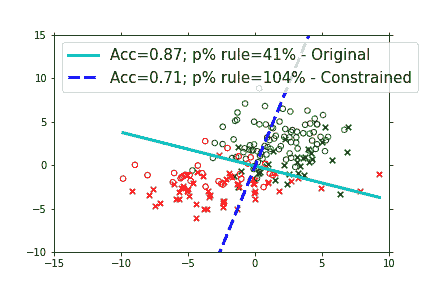

图 8.8 – 在合成数据上训练的无约束和有约束的逻辑回归分类器的决策边界

你可以看到分类器的准确率略微下降（71%），但 p-rule 值是 104%——这意味着分类器是公平的。正类中的受保护与非受保护比例是 53:51。图表还展示了原始分类器和受限分类器的决策边界。

+   **在准确性约束下最大化公平性**：在这种情况下，我们最小化协方差决策边界，前提是受限分类器的损失（L(D,Θ)）小于无约束分类器的损失（L(D,Θ*)）——换句话说，以下是：

最小化 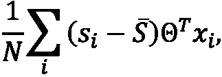 约束条件为 。

这里，Li 表示训练集中第*i*个用户的损失。下图展示了使用这些约束所获得的结果。

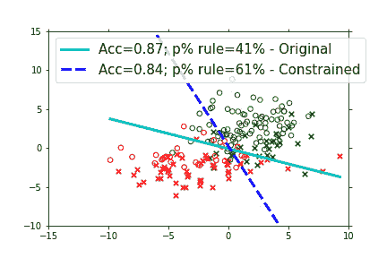

图 8.9 – 在合成数据上训练的无约束与有约束的逻辑回归分类器的决策边界

我们可以看到，现在 p-rule 从 41%提高到了 61%，而准确率的下降并不显著。对于企业来说，这一点很重要。你不能推出一个公平但不准确的产品。

上述图表是使用 Kamishima 小组提供的代码生成的，使用了以下参数：

```py
n_samples = 2000 # Number of data points
disc_factor = math.pi / 4.0 # represents f in the paper-- decrease it to generate more discrimination
gamma = 2000.0
```

这种方法有助于缓解分类任务中的不公平影响。该方法可以扩展到许多分类任务中。

## 回归任务的公平性约束

在回归中，任务的变化是从找到决策边界变为找到一个包含大多数数据点的超平面。当决策空间较小且离散时，分类器表现良好，但更常见的是决策空间是连续的。例如，与其判断一个人是否会违约（一个二元问题），更有意义的是让决策者知道一个人违约的概率（一个介于 0 和 1 之间的连续值）。在这些场景中，回归是更好的选择。主要的区别是，在分类的情况下使用的是对数损失函数，而在回归中，传统的损失函数是**均方误差**（**MSE**）。这意味着我们可以像分类器一样添加正则化项，从而得到一个公平的回归。实际上，Berk 等人曾尝试过这种方法，并提出了一个适用于回归和分类任务的公平性通用框架：


这里，*L*是常规的损失函数（对于分类器，常规损失是对数损失，对于回归，我们通常使用均方误差（MSE）损失）。他们添加了一个λ加权的公平性损失项 fp。为了防止过拟合，还有标准的 L2 正则化项。这种方法可以应用于任何具有凸优化函数的模型。

使用这种方法，他们能够实现个体和群体的公平性。让我们看看具体是如何做到的。

### 使用公平性惩罚项的个体公平性

继续我们之前的术语，让*s*是一个二元敏感特征，s ∈ {0,1}。它告诉我们用户是否属于敏感群体。因此，对于个体公平性，惩罚项定义如下：


这里，*d*是一个非负函数，表示敏感和非敏感群体之间输出的绝对差异（|yi – yj|），*n*1 是属于敏感群体的个体数，*n*2 是不属于敏感群体的个体数。

我们可以看到，每当模型将敏感和非敏感输入区分对待时，都会受到惩罚。

### 使用公平性惩罚项的群体公平性

现在，对于群体公平性，我们希望两个群体样本的预测平均相似。这通过以下公平性惩罚项定义：


现在，为了验证这种方法是否真的适用于回归案例，我们使用 UCI ML 存储库提供的**社区与犯罪**数据集（[`archive.ics.uci.edu/ml`](http://archive.ics.uci.edu/ml)）。数据集包含与美国不同社区的人均暴力犯罪率相关的特征。这里的敏感特征是个体的*种族*，任务是预测犯罪率。

*图 8**.10*显示了数据集的公平损失与 MSE 损失。这里，**单一**指的是只为两个敏感群体建立一个模型的情况，而**分开**则是指我们有单独的模型。

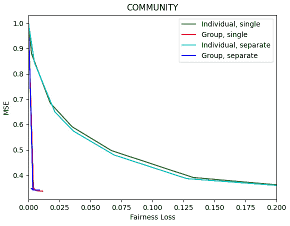

图 8.10 – 社区与犯罪数据集的 MSE 损失与公平性

我们可以再次看到，在精度方面追求公平性是有代价的。因此，在定义关心的公平类型时，建模者必须谨慎，特定于其应用程序作出决策，并在预测精度与公平性之间找到适当的平衡。

## 聚类任务的公平性约束

聚类任务涉及将给定的数据点分组成簇。虽然有监督聚类算法，但无监督聚类更为常见。在这里，提供数据点 X = {xp ∈ RM,p = 1, … , N}，任务是将它们分配到*K*个簇中。设*M*为簇分配向量：M = [m1, … , mN ] ∈ [0,1]NK。现在，假设数据包含敏感信息，例如，不同人口统计学群体的*J*。我们可以将敏感信息表示为向量，Sj = [sj, p] ∈ {0,1}N，因此如果点*p*分配给群体*j*，则 sj, p = 1；否则为 0。

K-means 是最广泛使用的聚类算法之一，它通过最小化各个数据点与代表性聚类中心之间的距离之和，将给定数据点聚类为 *K* 个簇。我们可以加入公平性惩罚。在论文《变分公平聚类》中，作者将所需人口比例和簇 *m* 内人口的边际概率（Pm=[P(j|m)]) 之间的 Kullback-Leibler 散度项加入到了目标函数中。在簇分配向量和人口信息向量的层面上，边际概率可以表示如下：


这里的 *T* 表示数学中的转置运算符。修改后的目标函数如下图所示：


图 8.11 – 带有公平性惩罚的聚类任务损失函数

有趣的是，公平性惩罚通过所需人口比例 *U* 和相应边际概率 *Pk* 之间的交叉熵项表示。这个惩罚项可以进一步分解为两个部分，一个是凸的，另一个是凹的。鼓励你阅读原论文以获取完整的数学证明，包括界限、收敛性和单调性保证（[`arxiv.org/abs/1906.08207`](https://arxiv.org/abs/1906.08207)）。

*表 8.1* 列出了在不同数据集上应用这些公平性约束的结果。合成数据集是根据人口统计分布创建的；两个数据集都包含 450 个数据点和两个人口群体。在合成数据集中，两个群体的所需比例相等；然而，在合成不均衡数据集中，我们为两个群体分别创建了 310 和 140 个数据点：

| **数据集** | **聚类能量** | **公平性误差** | **平均平衡** |
| --- | --- | --- | --- |
| 合成不均衡（样本数量 = 450，J = 2，l = 10） | 159.75 | 0.00 | 0.33 |
| 合成数据集（样本数量 = 450，J = 2，l = 10） | 207.80 | 3.69 | 0.01 |
| 成人（样本数量 = 32,561，J = 2，l = 10） | 9,507 | 0.27 | 0.48 |
| 银行（样本数量 = 41,108，J = 3，l = 10） | 8,443.88 | 0.69 | 0.15 |
| Census II（样本数量 = 2,458,285，J = 2，l = 10） | 922,558.03 | 26.22 | 0.44 |

表 8.1 – 使用带有公平性惩罚的 K-means 聚类在不同数据集上列出聚类目标、公平性误差和平均平衡的表格

*图 8.12* 显示了在合成数据集和合成不均衡数据集上应用带有公平性惩罚的 K-means 聚类所获得的聚类结果。

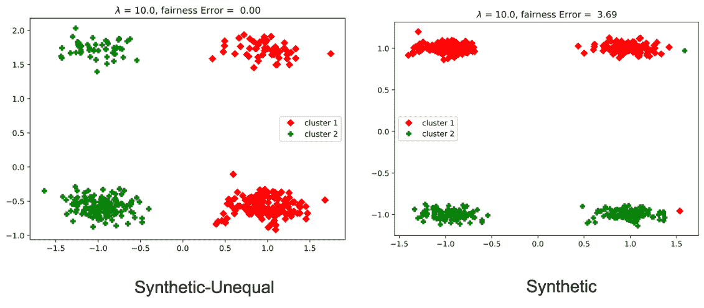

图 8.12 – 使用带有公平性惩罚的 K-means 聚类在两个数据集上的聚类结果

相同的方法也可以应用于 K-median 聚类算法和 Ncut 聚类算法。

## 强化学习任务的公平性约束

强化学习与用于回归和分类任务的监督学习、以及用于聚类任务的无监督学习有很大的不同。它的不同之处在于，算法在这里并不知道期望的输出。它所做的每一个选择不仅影响当前学习，还会影响未来的结果。在强化学习中，算法从环境中获得反馈；正是这种反馈帮助它进行学习。

为了定义强化学习任务，我们可以说系统由代理（强化学习代理或算法）和环境组成。代理可以通过状态向量`s`感知环境，可以通过动作`a`对环境进行改变，环境可能通过奖励`r`反馈给代理（*图 8.13*）。代理的目标是找到一个最优策略π(s,a)，以最大化奖励。

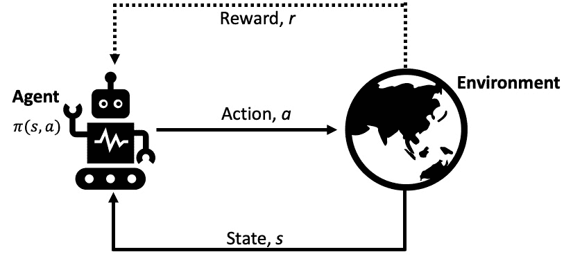

图 8.13 – 强化学习框架

我们可以将一个简单的强化学习问题表示为一个多臂老虎机问题。这个问题假设一个赌徒在一排老虎机中进行赌博。他们需要决定每次玩哪个老虎机臂，以最大化他们的奖励。我们可以定义该问题有*N*个老虎机，赌徒的任务是在每个时间步*t*选择一个老虎机臂：


在每个时间步*t*，赌徒会收到一个奖励，rt ∈ [0, 1]N，这个奖励由一个固定的分布决定，E[rt(it)] = μ(it)。然而，赌徒并不知道这个分布。它们唯一能观察到的是奖励 rt(it)。赌徒的目标是选择一个臂的顺序，以最大化总奖励：

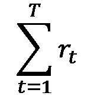

最优老虎机臂的最佳奖励概率如下：

 其中，

为了训练我们的代理扮演赌徒的角色，我们可以将我们的损失函数定义为一个遗憾函数——表示代理在时间步*t*未选择最优老虎机臂所带来的遗憾：

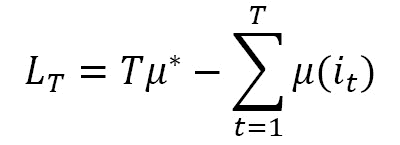

我们可以将多臂问题看作一个资源分配问题——有限的资源应该被分配以获得最大性能。当强化学习代理开始时，它不知道哪种动作会产生好的奖励，因此大多数强化学习代理使用一种叫做探索与利用的技术。其思想是，代理最初通过选择随机动作来探索所有可能的动作，从中学习（**探索**），然后当足够的经验积累后，使用由学到的策略指导的动作（**利用**）。用来实现探索/利用的算法之一是**ε贪心算法**（Mnih，2015）。

探索与利用之间总是存在权衡。在ɛ贪婪算法中，通过减小探索参数ɛ来实现探索与利用之间的平衡。另一种实现探索与利用平衡的方法是使用**上置信界限**（**UCB**）。UCB 算法通过维护每个动作的预期奖励估计来工作。在每个步骤中，算法选择具有最高预期奖励的动作。然而，UCB 算法还在每个估计中添加了一项鼓励探索的项。这个项基于估计的不确定性，并且随着某个动作被执行的次数减少而增加。因此，UCB 算法在探索与利用之间达到了平衡，并且在在线环境中通常表现优于其他算法。

在本节中，我们将应用公平性约束来解决基于多臂赌博机的资源分配问题。目的是将公平性概念引入资源分配中。如今，基于 AI 的程序在分配资源（如医疗、贷款和补贴）时做出决策。我们能否确保这一分配过程的公平性？另外，分配过程中的公平性是否对合作产生影响？

解决这个问题的一种方法是由 Claure 等人在论文《*带有公平性约束的多臂赌博机，用于向人类队友分配资源*》中提出的。他们对个体分配资源的次数设置了公平使用约束限制，确保所有用户都能获得所需资源。他们修改了无约束的 UCB 算法，通过使用其过去的经验奖励均值以及每次被抽取的频率来估计每个臂的预期奖励。

为了评估他们的方法，他们考虑了一个协作俄罗斯方块游戏的环境，将两人小组配对，并要求他们使用该算法共同完成一局俄罗斯方块游戏。算法会在每个时间步骤决定由哪一位玩家控制下落的方块。然后，他们询问参与者是否觉得算法给他们分配轮次是公平的：即他们对游戏公平性的感知。

下表展示了不同约束限制下，参与者的感知：

| **约束限制** | **参与者的感知** |
| --- | --- |
| 25%, 33% | *“我感觉更有能力的玩家被分配了更多的轮次，这很有道理，但也是我觉得不公平的原因。”* |
| 50% | *“我认为这场比赛是公平的，它让我们轮流进行，每次都让我觉得自己在为比赛做出同等的贡献。”* |

表 8.1 – 参与者在实验中对于不同约束限制的感知

他们的研究表明，使用他们变种的算法，资源可以公平地分配。这增加了个体之间的信任，而不会降低表现。

## 推荐系统的公平性约束

推荐系统用于为产品、服务、潜在朋友或内容提供建议。它们依赖于反馈数据，并通常通过机器学习算法运行。例如，一个在线书店可能使用推荐系统根据类别对书籍进行分类，并向购买过某本书的顾客推荐类似的书籍。Facebook 使用推荐系统向用户推荐潜在的朋友。YouTube 使用推荐系统向观看某个视频的用户推荐相关视频。一般来说，推荐系统用于解决**冷启动**问题，即在数据不足的情况下很难为新用户或新物品提供推荐。

推荐系统根据其所依赖的信息类型分为三类：协同过滤、基于内容的过滤和混合过滤。协同过滤推荐系统依赖于社区的集体智慧来进行推荐。基于内容的推荐系统使用关于物品本身的信息来进行推荐。混合推荐系统结合了协同过滤和基于内容的两种方法进行推荐。这些方法各有优缺点，适合特定应用的最佳推荐系统将取决于具体需求。

近年来，推荐系统在我们生活的许多方面变得越来越普及。从在线购物到社交媒体，这些系统在帮助我们找到所需的产品、服务和内容方面发挥着关键作用。然而，这些系统并不完美。特别是，它们常常会受到各种偏见的影响，导致不公平的推荐。例如，一个推荐系统可能会无意中偏向某些用户群体。这可能导致一些用户得到无法使用的推荐，甚至可能导致歧视性行为。因此，解决推荐系统中的不公平问题至关重要。幸运的是，近年来这一领域已经取得了进展，现在已经有许多方法可以帮助减轻这一问题。随着持续的研究，推荐系统有望变得更加公平和包容，适用于所有用户。

推荐系统是一个多方平台，涉及三个利益相关方：消费者、供应商和平台：

+   **消费者**是平台的用户。他们来寻求建议。因为他们可能在寻找某些东西，或在做决定时遇到困难，比如在购买什么时。消费者预期平台能够提供公平和客观的建议。

+   **供应商**或提供者位于推荐系统的另一端。他们提供服务，并从消费者那里获得一定的收益。

+   最后，是**平台**本身。它将消费者和供应商连接起来，并从中获益。

因此，当我们谈论推荐系统中的公平性时，我们也需要明确我们讨论的是哪种类型的公平性。通常，我们讨论两种类型的公平性，即提供者公平性和消费者公平性：

+   **提供者公平性** 关注的是被排名或推荐的项目。在这里，公平性的概念是相似的项目或项目组应该以相似的方式被排名或推荐。例如，考虑两篇关于相同主题的文章。如果其中一篇因为拥有更多的浏览量而被排名更高，这就是不公平的，因为它赋予了流行度更多的权重，而不是质量。为了解决这个问题，算法可以考虑其他因素，如时效性、分享次数和点赞数，以更准确地评估质量。通过考虑这些因素，算法对两篇文章都会更加公平。

+   **消费者公平性** 关注的是接收或使用数据或服务的用户。在这种情况下，一个公平的推荐算法应该确保用户或用户群体接收到相同的推荐或排名。继续以推荐系统推荐文章为例，如果两个读者拥有相同的教育背景和兴趣，算法应该向他们推荐相同或相似的文章，而不考虑性别或年龄等敏感属性。

实现推荐系统公平性的一种方法是将其视为分类算法，其中 *推荐* 是一个类别。另一种方法是将推荐系统视为排序问题；在这里，推荐是一个有序列表 *L*。我们已经讨论了如何在分类任务中添加公平性约束。在本节中，我们将讨论基于 Celis 等人论文 *Ranking with Fairness Constraints* 中提出的方法，如何在排序中添加公平性约束。基本思路是对不同组的项目在前 *k* 个位置出现的数量施加约束。

让我们从定义排序问题开始。我们有 *m* 个项目，目标是输出一个 *n* 个项目的列表（n ≪ m），该列表对消费者或提供者最有价值。我们定义一个数字 *Wij*，它表示如果第 *i* 个项目（*i* ∈ [m]）排在第 *j* 位时所贡献的价值。获取 *Wij* 的方法不止一种。我们可以将其定义为一个 **排序最大化问题**。在这里，任务是为每个项目分配一个位置，以最大化总价值。

为了确保公平性，Celis 等人添加了约束条件，限制了具有属性 *l* 的对象在排名前 *k* 位中出现的数量，这些约束以上界 (*U*l,k) 和下界 (*L*l,k) 的形式存在。我们可以通过二进制矩阵 *x* 来表示项目的位置，*x* 是一个 *n* x *m* 的矩阵。这个二进制矩阵的 *x*ij 元素告诉我们，第 *i* 个项目是否排在第 *j* 位。约束条件被施加在矩阵上：


在这里，{1, 2, ... , p} 是属性的集合，Pl ⊑ [m] 表示具有属性 *l* 的项的集合。通过这一变化，排名最大化将变为以下形式：


以下图示说明了这一点：

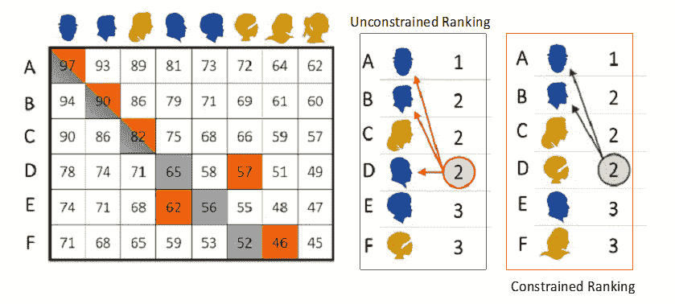

图 8.14 – W 的样本矩阵。数值表示最佳无约束排名（灰色）和有约束排名（橙色）。在前六个位置的男性数量上有一个上限约束为 2（图像改编自论文《排名与推荐中的公平性：概述》）

决策中的公平性是一个我们才刚刚开始理解的重要问题。例如，当有很多求职者或贷款申请者时，如果每个人看起来都同样合适，决定谁应该获得职位、贷款或其他决策就变得非常困难，甚至是不可能的。然而，根据种族等因素，某些候选人可能比其他人更值得考虑，这可能会造成社会上的不利影响，即便当事人并未意识到这一点。

# 公平性的挑战

各种机器学习公平性方法的开发引起了研究界越来越多的关注，我们也取得了显著进展。然而，仍然存在一些需要进一步研究的挑战。在这一部分中，我们简要讨论了构建公平模型时存在的不同挑战。

## 缺失的敏感属性

即使很少或者没有已知的敏感属性，机器学习模型中的公平性问题依然是一个挑战。实现公平性通常意味着确保生成的模型不会对任何特定群体存在偏见。当训练数据不包含个体敏感属性信息时，这一点尤其难以实现。目前大多数现有方法假设敏感属性是显式已知的。然而，随着隐私问题的日益关注，以及如 GDPR 等法规的出台，企业需要保护敏感数据。

## 多个敏感属性

本章中介绍的技术仅适用于一个敏感属性。然而，数据中可能存在多个敏感属性，例如性别和种族。当数据中存在多个敏感属性时，一个对某个敏感属性做出公平预测的模型，可能会对其他敏感属性做出不公平的预测。一个训练为性别公平的模型，仍然可能对种族不公平。多属性公平性目前是一个相对较少研究的问题，未来应当进一步探索。

## 公平性度量的选择

我们在本章中已经看到，缓解算法不公平性的不同技术设计取决于所期望的公平性度量。选择正确的公平性度量标准至关重要，并且这取决于具体考虑的情境。

## 个人公平性与群体公平性的权衡

群体公平性关注确保受保护群体（如女性）在机器学习模型的结果中得到公平表现。个体公平性则关注确保具有相似敏感属性（如种族或性别）的个体在模型中获得类似对待。群体公平性和个体公平性有不同的目标。现有的不公平性缓解算法通常只关注其中一个目标。因此，一个为了个体公平性优化的模型可能对群体不公平，反之亦然。然而，也可能存在两种公平性都希望实现的情况。

## 解释与公平性

通过利用可解释的机器学习技术，我们可以更好地理解我们的模型并进行调试。这可以作为识别和消除偏见并实现公平性的工具。例如，在情感分析任务中，我们可以通过分析每个群体的最重要特征，利用模型解释技术来检测种族偏见。

## 公平性与模型性能

公平性约束通常限制机器学习模型的决策空间，从而在公平性和模型性能之间产生权衡。需要对公平性约束和模型性能之间的关系进行系统的理论研究。

## 有限的数据集

用于研究公平性的数据集非常有限。下表列出了可用于基准测试公平性缓解算法的一些数据集：

| **数据集** | **描述** | **大小** | **领域** |
| --- | --- | --- | --- |
| 德国信用卡数据集 | 包含个人状态、性别、信用评分和住房状况等属性。可用于研究与性别和信用相关的公平性问题。 | 1,000 | 金融 |
| UCI 成人数据集 | 该数据集包含年龄、职业、教育、种族、性别、婚姻状况以及个人年收入是否超过 50K 美元等属性。 | 48,842 | 社会 |
| 面部多样性数据集 | 这是一个大型注释面部图像数据集。除了图像外，它还包含有关肤色、性别和面部对称性的信息。 | 100 万 | 面部图像 |
| COMPAS 数据集 | 该数据集包含来自布劳沃德县被告的记录，包括他们的监禁时间和人口统计信息。 | 18,610 | 社会 |
| 社区和犯罪数据集 | 该数据来自美国各社区，来源于美国 LEMAS 调查和 FBI 统一犯罪报告。 | 1,994 | 社会 |
| 议会代表基准数据集 | 该数据包含来自三个欧洲国家（冰岛、瑞典、芬兰）和三个非洲国家（南非、塞内加尔、卢旺达）国家议会成员的数据。 | 1,270 | 面部图像 |
| WinoBias 数据集 | 一个用于评估共指解析系统的文本集合，包含关于 40 个职业的句子，每个职业使用不同的人称代词描述多次，旨在揭示和解决性别偏见。 | 3,160 | 共指解析 |
| 青少年司法系统再犯数据集 | 该数据集包含 2002 至 2010 年间，在加泰罗尼亚青少年司法系统中犯下罪行的青少年罪犯的数据。 | 4,753 | 社会 |

表 8.2 – 用于公平性基准测试的有用数据集表

这些是研究算法公平性时广泛使用的数据集。

# 总结

本章讨论了应用于不同机器学习任务的公平性约束。我们从分类任务开始，讨论了如何在损失函数中添加正则化项以减少不公平性。本章还讨论了如何修改损失函数（目标函数）以缓解不公平性。随后，我们讨论了回归任务，同样，我们展示了如何通过添加正则化项来确保算法公平。我们讨论了个体公平性和群体公平性的惩罚项。接着，我们探讨了可以添加到聚类任务中的公平性项。我们还讨论了强化学习，并展示了如何将公平性约束添加到遗憾函数中。接下来是推荐任务，我们展示了如何通过上下界形式的公平性约束来缓解不公平性。我们还讨论了推荐任务与其他任务的异同。最后，我们讨论了公平性面临的挑战。我们看到，在这一领域仍有很多工作要做。目前，大多数公平性算法仍处于初始阶段。我们需要在现有的深度学习和机器学习框架中采纳公平性策略，以便广泛应用。在下一章中，我们将讨论人工智能中的可解释性。

# 进一步阅读

+   *组织公平性的三条道路，* Cropanzano, R., Rupp, D. E., Mohler, C. J., 和 Schminke, M. (2001)。([`www.emerald.com/insight/content/doi/10.1016/S0742-7301(01)20001-2/full/html`](https://www.emerald.com/insight/content/doi/10.1016/S0742-7301(01)20001-2/full/html))

+   *多模态机器学习中的偏见与公平性：自动化视频面试的案例研究，* Booth, B. M., Hickman, L., Subburaj, S. K., Tay, L., Woo, S. E., 和 D’Mello, S. K. (2021 年 10 月)。收录于 *2021 年国际多模态交互会议论文集* (第 268-277 页) ([`dl.acm.org/doi/fullHtml/10.1145/3462244.3479897`](https://dl.acm.org/doi/fullHtml/10.1145/3462244.3479897))

+   *算法公平性*。arXiv 预印本 arXiv:2001.09784，Pessach, D. 和 Shmueli, E. (2020)。([`arxiv.org/pdf/2001.09784.pdf`](https://arxiv.org/pdf/2001.09784.pdf))

+   *使用谷歌翻译中的性别偏见：问题与解决方案*。*语言圈：语言与文学期刊*，15(2)，Fitria, T. N. (2021)。([`journal.unnes.ac.id/nju/index.php/LC/article/download/28641/11534`](https://journal.unnes.ac.id/nju/index.php/LC/article/download/28641/11534))

+   *机器学习：一种概率视角*。MIT 出版社，Murphy, K. P. (2012)。([`storage.googleapis.com/pub-tools-public-publication-data/pdf/38136.pdf`](https://storage.googleapis.com/pub-tools-public-publication-data/pdf/38136.pdf))

+   *具有偏见移除正则化器的公平感知分类器*。收录于*欧洲联合机器学习与数据库知识发现大会*（第 35-50 页），Springer，Berlin，Heidelberg。Kamishima, T., Akaho, S., Asoh, H., 和 Sakuma, J.（2012 年 9 月）。([`link.springer.com/content/pdf/10.1007/978-3-642-33486-3_3.pdf`](https://link.springer.com/content/pdf/10.1007/978-3-642-33486-3_3.pdf))

+   *三种朴素贝叶斯方法用于无歧视分类*。收录于*数据挖掘与知识发现*，21(2)，第 277-292 页，Calders, T. 和 Verwer, S.（2010 年）。([`link.springer.com/content/pdf/10.1007/s10618-010-0190-x.pdf`](https://link.springer.com/content/pdf/10.1007/s10618-010-0190-x.pdf))

+   *公平约束：公平分类机制*。收录于*人工智能与统计*（第 962-970 页），PMLR，Zafar, M. B., Valera, I., Rogriguez, M. G., 和 Gummadi, K. P.（2017 年 4 月）。([`proceedings.mlr.press/v54/zafar17a/zafar17a.pdf`](https://proceedings.mlr.press/v54/zafar17a/zafar17a.pdf))

+   *公平回归的凸框架*，Berk, R., Heidari, H., Jabbari, S., Joseph, M., Kearns, M., Morgenstern, J., ... 和 Roth, A.（2017 年）。arXiv 预印本 arXiv:1706.02409。([`arxiv.org/pdf/1706.02409`](https://arxiv.org/pdf/1706.02409))

+   *UCI 机器学习库*，2013，Lichman, M. URL: [`archive.ics.uci.edu/ml`](http://archive.ics.uci.edu/ml)

+   *通过深度强化学习实现人类级控制。《自然》*，518(7540)，第 529-533 页，Mnih, V., Kavukcuoglu, K., Silver, D., Rusu, A. A., Veness, J., Bellemare, M. G., ... 和 Hassabis, D.（2015 年）。([`www.nature.com/articles/nature14236?wm=book_wap_0005`](https://www.nature.com/articles/nature14236?wm=book_wap_0005))

+   *排名与推荐中的公平性：概述*。*VLDB 期刊*，第 1-28 页，Pitoura, E., Stefanidis, K., 和 Koutrika, G.（2021 年）。([`link.springer.com/article/10.1007/s00778-021-00697-y`](https://link.springer.com/article/10.1007/s00778-021-00697-y))

+   *带有公平性约束的排名*。arXiv 预印本 arXiv:1704.06840，Celis, L. E., Straszak, D., 和 Vishnoi, N. K.（2017 年）。([`arxiv.org/pdf/1704.06840.pdf`](https://arxiv.org/pdf/1704.06840.pdf))
