# 11

# 模型适应性的伦理

本章详细介绍了如何在组织中为模型治理目的检测不同类型的模型漂移。本章的主要目标是展示机器学习（ML）模型的变异，通过多个示例让你意识到检测数据变化和模型指标变动所需的不同统计量的重要性。这将帮助数据科学家和 MLOps 专业人员选择合适的漂移检测机制，并遵循正确的模型指标性能阈值，以控制由于错误预测带来的风险。你将学会如何量化和解释模型漂移，并解答与模型校准需求相关的问题。这还将使你能够理解设计合理校准模型的范围。

本章将覆盖以下内容：

+   数据和模型漂移的适应性框架

+   如何解释在漂移或校准条件下的机器学习模型

+   理解模型校准的必要性

# 技术要求

本章要求你使用 Python 3.8 并在开始之前运行以下命令：

+   `pip` `install` `alibi-detect`

+   `pip` `install` `river`

+   `pip` `install` `detecta`

+   `pip install nannyml (``dependency numpy==1.21.0)`

+   `git` `clone` [`github.com/zelros/cinnamon.git`](https://github.com/zelros/cinnamon.git)

+   `python3` `setup.py install`

+   `git` `clone` [`github.com/Western-OC2-Lab/PWPAE-Concept-Drift-Detection-and-Adaptation.git`](https://github.com/Western-OC2-Lab/PWPAE-Concept-Drift-Detection-and-Adaptation.git)

安装步骤中提到的`alibi-detect`包可以在 GitHub 上找到。作为参考，你可以在[`github.com/SeldonIO/alibi-detect`](https://github.com/SeldonIO/alibi-detect)查看该项目的更多细节。

# 数据和模型漂移的适应性框架

数据处理取决于数据访问的方式，基于其可用性，无论是顺序数据还是连续数据。随着不同模式的输入数据处理和建模技术的建立，各种因素（内部和外部）会导致数据分布发生动态变化。这种变化被称为**概念漂移**，它对生产中的机器学习模型构成了若干威胁。在概念漂移术语中，关于数据分布的变化，**窗口**一词用来指代用于训练当前或最近预测器的最新已知概念。

概念漂移的例子可以在电子商务系统中看到，其中机器学习算法分析用户的购物模式，并提供个性化的相关产品推荐。导致概念漂移的因素包括婚姻、搬迁到不同地理区域等事件。COVID-19 疫情导致了消费者购买行为的剧烈变化，因为人们被迫转向电子商务平台进行在线购物。这导致了对产品的需求远高于预期，从而在供应链网络中的需求预测中产生了高错误率。电子商务、供应链和银行行业已经经历了数据模式的变化，导致模型漂移。

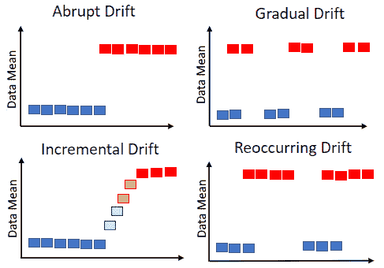

图 11.1 – 四种概念漂移类型

如*图 11.1*所示，概念漂移有四种类型，可能由各种内部或外部因素，甚至是对抗性活动引起：

+   **突变**：由行为变化引起

+   **增量**：突发变化，具有较慢的衰减

+   **重现**：类似于季节性趋势

+   **渐变**：缓慢、长期的变化

其他间接因素，如学习速度、报告正确特征（或度量单位）时的错误，以及分类或预测准确性的巨大变化，也可能导致概念漂移。*图 11.2*中进行了说明。为了解决概念漂移，我们需要更新导致漂移的模型。这可能是盲目更新或使用加权数据训练、模型集成、增量模型更新，或者应用在线学习模式。

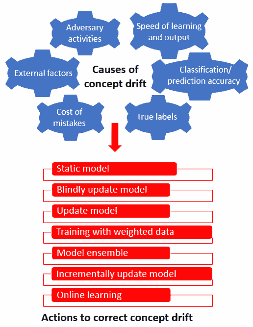

图 11.2 – 漂移因素和补救措施的不同类型

我们根据数据到达模式（批处理或在线）对概念漂移检测器（如*图 11.3*所示）进行分类。批处理检测技术可以进一步分为全批次检测和部分批次检测技术。批次的大小和样本是将其分类为全批次或部分批次检测的两个因素。在线检测器则根据其调整参考窗口的能力来检测漂移。检测窗口通常是一个滑动窗口，随着新的实例到来而移动，通常被称为当前概念。然而，也有使用固定参考窗口来检测概念漂移的情况。

在线检测器通过评估前*W*个数据点计算的测试统计量来工作，然后更新测试统计量。更新可以以较低的成本按顺序进行，从而帮助我们检测测试统计量是否超出阈值。超过阈值的值表示已经发生了漂移。

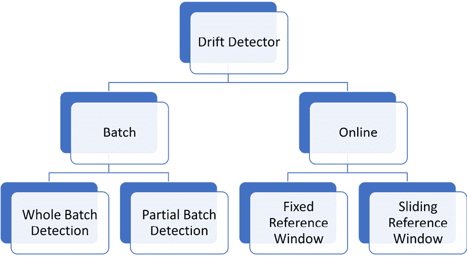

图 11.3 – 常用的漂移检测器

*图 11.3*展示了无监督批量基础（固定窗口）和基于在线（固定和滑动窗口）漂移检测技术的概念，这些方法在必要的数据分布比较和显著性测试后，用来检测是否存在漂移。批量方法可能需要在批次上进行实例选择和统计计算，以确认漂移条件的测试，从而推断是否发生了漂移。这里的数字表示检测在线和离线漂移所需的步骤顺序。

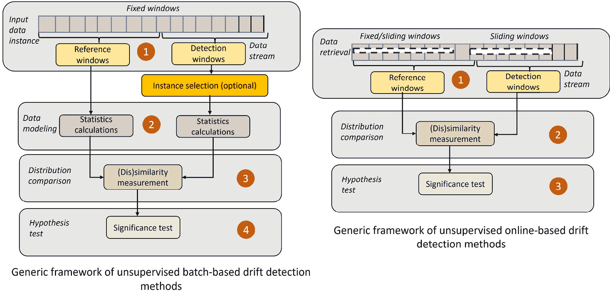

图 11.4 – 在线和批量漂移检测方法

一个在线漂移自适应框架的例子是**性能加权概率平均集成**（**PWPAE**）框架，能够在 IoT 异常检测应用场景中有效使用。

该框架可以部署在 IoT 云服务器上，利用来自 IoT 设备的无线媒介处理大数据流。这个集成自适应漂移检测器由四个基础学习器组成，帮助进行实时漂移检测：

+   一个带有**ADWIN 漂移检测器**的**自适应随机森林**（**ARF**）模型（简称**ARF-ADWIN**）

+   一个带有**DDM 漂移检测器**的 ARF 模型（简称**ARF-DDM**）

+   一个带有**ADWIN 漂移检测器**的**流随机补丁**（**SRP**）模型（简称**SRP-ADWIN**）

+   一个带有**DDM 漂移检测器**的 SRP 模型（简称**SRP-DDM**）

四个基础在线学习器通过根据它们的准确性和分类概率加权组合在一起。让我们在 CICIDS2017（[`www.unb.ca/cic/datasets/ids-2017.html`](https://www.unb.ca/cic/datasets/ids-2017.html)）模拟入侵检测数据集上尝试 PWPAE 框架，该数据集包含良性和近期常见的攻击，类似于真实世界的例子：

1.  为了运行 PWPAE，让我们首先从`river`包中导入必要的模块：

    ```py
    from river import metrics
    from river import stream
    from river import tree,neighbors,naive_bayes,ensemble,linear_model
    from river.drift import DDM, ADWIN
    ```

1.  然后，我们使用`X_train`和`y_train`设置 PWPAE 模型进行训练，并在`X_test`和`y_test`上进行测试。以下代码片段展示了如何使用 PWPAE 模型：

    ```py
    name = "Proposed PWPAE model"
    t, m = PWPAE(X_train, y_train, X_test, y_test)
    acc_fig(t, m, name)
    ```

训练结果和比较输出在*图 11.5*中进行了可视化。


图 11.5 – PWPAE 与 Hoeffding 树（HT）和提升袋装（LB）模型的性能结果

PWPAE 的准确率为 99.06%，超越了其他模型的准确率。

让我们研究一些有监督的漂移检测策略，其中可以获得实际的预测反馈，并与预测结果一起使用，以产生误差指标。

## 统计方法

统计方法帮助我们比较和评估两种不同的分布。散度因子或距离度量可以用来衡量两种分布在不同时间点的差异，以了解它们的行为。这有助于及时检测模型的性能指标，并找出导致变化的特征。

### 库尔巴克–莱布勒散度

**库尔巴克–莱布勒**（**KL**）散度，也通常称为**相对熵**，量化了一个概率分布与另一个概率分布之间的差异。数学上，它可以表示为以下公式：


*Q* 是旧数据的分布，*P* 是新数据的分布，我们为此计算散度，|| 表示散度。当 *P*（*x*）很高而 *Q*（*x*）很低时，散度会很高。另一方面，如果 *P*（*x*）较低而 *Q*（*x*）较高，散度会很高，但不会太高。当 *P*（*x*）和 *Q*（*x*）相似时，散度会很低。以下代码为一个均值为 5，标准差为 4 的（*P*，*Q*，*M*）分布生成一个 KL 散度图：

```py
x = np.arange(-10, 10, 0.001)
q = norm.pdf(x, 5, 4)
plt.title('KL(P||Q) = %1.3f' % kl_divergence(p, q))
plt.plot(x, p)
plt.plot(x, q, c='red')
```

由于 KL 散度导致的分布模式变化在*图 11.6*中有所展示：

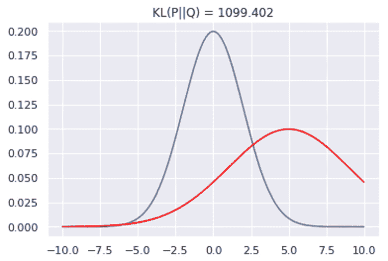

图 11.6 – KL 散度

还有更多形式的散度，接下来我们将讨论这些。

### 詹森–香农散度

**詹森–香农**（**JS**）散度使用 KL 散度，并可以通过以下数学公式表示：


KL 散度与 JS 散度之间的一个区别是，JS 散度是对称的，并且具有强制性的有限值。由于 JS 散度导致的分布模式变化在*图 11.7*中有所展示：

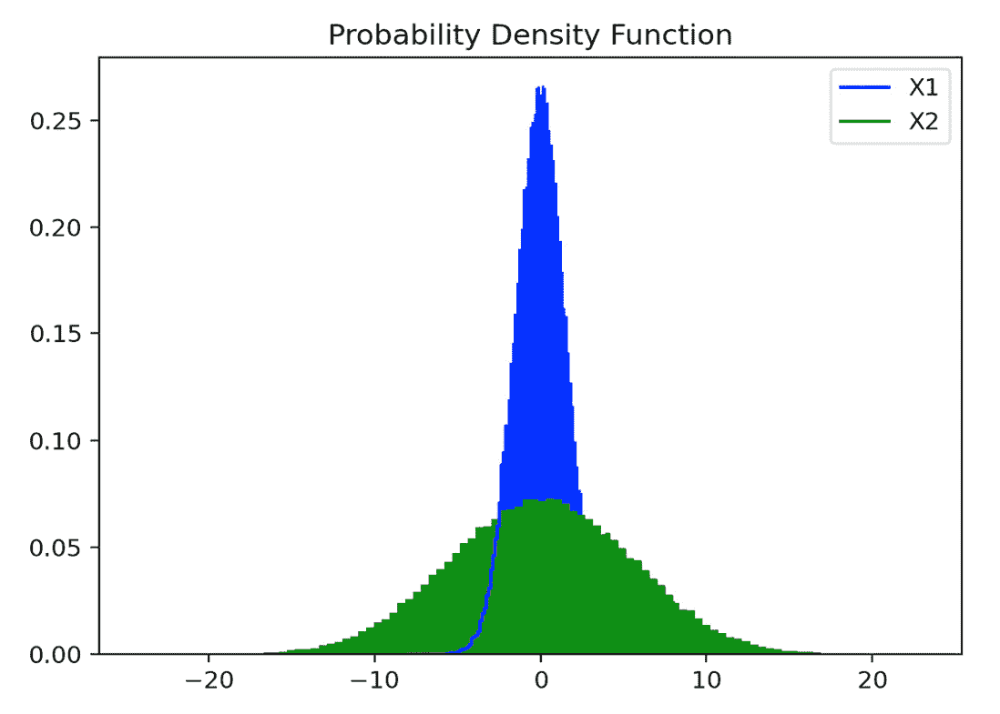

图 11.7 – JS 散度

为了计算 JS 和 KL 散度，我们运行以下代码片段：

1.  首先，我们为分布 1 创建一个正态分布：

    ```py
    data1 = scipy.stats.norm.rvs(size=100000, loc=0, scale=1.5, random_state=123)
    hist1 = np.histogram(data1, bins=100)
    hist1_dist = scipy.stats.rv_histogram(hist1)
    import matplotlib.pyplot as plt
    X1 = np.linspace(-8.0, -2.0, 1000)
    plt.title("PDF")
    plt.hist(data1, density=True, bins=100,  color ='blue')
    plt.plot(X1, hist1_dist.pdf(X1), label='PDF', color = 'blue')
    ```

1.  接下来，我们创建另一个正态分布，这就是我们的第二个分布：

    ```py
    data2 = scipy.stats.norm.rvs(size=100000, loc=0, scale=5.5, random_state=123)
    hist2 = np.histogram(data2, bins=100)
    hist2_dist = scipy.stats.rv_histogram(hist2)
    X2 = np.linspace(4.0, 8.0, 1000)
    plt.title("Probability Density Function")
    plt.hist(data2, density=True, bins=100, color ='green')
    plt.plot(X2, hist2_dist.pdf(X2), label='PDF', color = 'green')
    plt.legend(['X1', 'X2'])
    ```

1.  在下一步中，我们首先评估概率分布 1 与 `Y1` 和 `Y2` 的均值之间的 KL 散度，同样地，我们也评估概率分布 2：

    ```py
    Y1 = hist1_dist.pdf(X1)
    Y2 = hist2_dist.pdf(X2)
    M = (Y1 + Y2) / 2
    d1 = scipy.stats.entropy(Y1, M, base=2)
    print("KL div Y1 and M", d1)
    d2 = scipy.stats.entropy(Y2, M, base=2)
    print("KL div Y2 and M", d2)
    ```

1.  上一步的输出如下所示：

    ```py
    KL div X1 and X2 0.21658815880427068
    KL div Y1 and M 1.0684247605300703
    KL div Y2 and M 0.1571132219534354
    ```

1.  在下一步中，我们首先评估分布之间的 JS 散度，也评估每个分布内部的 JS 散度：

    ```py
    js_dv = (d1 + d2) / 2
    js_distance = np.sqrt(js_dv)
    print("JS Dist d1 and d2", js_distance)
    ```

我们将其与 SciPy 计算的分布之间的 JS 散度进行比较：

```py
js_distance_scipy = scipy.spatial.distance.jensenshannon(Y1, Y2)
print("JS Dist d1 and d2 of Scipy", js_distance_scipy)
js_distance_scipy = scipy.spatial.distance.jensenshannon(X1, X2)
print("JS Dist X1 and X2 of Scipy", js_distance_scipy)
dx1 = scipy.stats.entropy(Y1, X1, base=2)
dx2 = scipy.stats.entropy(Y2, X2, base=2)
js_dv = (dx1 + dx2) / 2
print("JS Div X1 and X2", js_dv)
```

上述步骤的输出如下所示：

```py
JS Dist d1 and d2 0.7827956254615587
JS Dist d1 and d2 of Scipy 0.6037262820103958
JS Dist X1 and X2 of Scipy 0.1941318696014193
JS Div X1 and X2 1.3749093686870903
```

第一个距离给出了对称的 JS 散度，而第二个评估的度量给出了 JS 距离，这是 JS 散度的平方根。评估出的第三个和第四个距离度量分别给出了 `X1`、`X2` 和 `dx1`、`dx2` 之间的 JS 距离。这里的 `dx1` 和 `dx2` 表示从 `Y1`、`X1` 和 `Y2`、`X2` 分布中生成的熵。

### 科尔莫哥罗夫–斯米尔诺夫检验

两样本**Kolmogorov-Smirnov**（**KS**）检验是一种常用的非参数方法，用于区分两个样本。通过 KS 检验识别的数据变化模式如*图 11.8*所示。**累积分布函数**（**CDF**）表示在样本中低于*x*的观察值的百分比。这可以通过以下步骤获得：  

1.  对样本进行排序  

1.  计算样本内观察值的数量是否小于或等于*x*  

1.  将步骤 2 中计算的分子除以样本上的总观察值数量  

漂移检测器的目的是在两个分布函数观察到变化时，检测漂移模式，这会导致两个样本形态的变化：  

  

图 11.8 – KS 检验  

### **人口稳定性指数**  

**人口稳定性指数**（**PSI**）是一种监测和衡量两个样本或两个时间段之间人口行为变化的指标。它作为一个风险评分卡指标，用于提供一个时间外验证样本与建模样本之间的风险估计，包括依赖变量和独立变量。PSI 的应用还可以扩展到社会人口学研究中比较两个或更多人口的教育、收入和健康状况。  

**模型蒸馏**是一种技术，它允许将知识从一个大网络转移到一个小网络，该小网络在简化架构上使用从原始模型提取的软目标（输出分布或 logits）训练第二个模型。这为通过比较原始模型和蒸馏模型的输出分布来检测对抗性和恶意数据以及数据漂移铺平了道路。  

现在让我们通过一个例子，看看如何在漂移检测的背景下通过模型蒸馏检测器检测对抗得分。KS 检验已被用作评分函数，以便在参考批次和测试数据的对抗得分之间进行简单的一维检验。较高的对抗得分表示有害的漂移，并为恶意数据漂移设置标志。在这里，我们可以从 Google Cloud 桶中提取预训练的模型蒸馏检测器，或者从头开始训练一个：  

1.  首先，我们从`alibi_detect`导入必要的包：  

    ```py
    from alibi_detect.cd import KSDrift
    from alibi_detect.ad import ModelDistillation
    from alibi_detect.models.tensorflow.resnet import scale_by_instance
    from alibi_detect.utils.fetching import fetch_tf_model, fetch_detector
    from alibi_detect.utils.tensorflow.prediction import predict_batch
    from alibi_detect.utils.saving import save_detector
    from alibi_detect.datasets import fetch_cifar10c, corruption_types_cifar10c
    ```

1.  然后，我们定义并训练蒸馏模型：

    ```py
    from tensorflow.keras.layers import Conv2D, Dense, Flatten, InputLayer
    from tensorflow.keras.regularizers import l1
    def distilled_model_cifar10(clf, nb_conv_layers=8, distl_model_filters1=256, nb_dense=40, kernel1=8, kernel2=8, kernel3=8, ae_arch=False):
        distl_model_filters1 = int(distl_model_filters1)
        distl_model_filters2 = int(distl_model_filters1 / 2)
        distl_model_filters3 = int(distl_model_filters1 / 4)
        layers = [InputLayer(input_shape=(64, 64, 3)),
                  Conv2D(distl_model_filters1, kernel1, strides=2, padding='same')]
        if nb_conv_layers > 2:
            layers.append(Conv2D(distl_model_filters2,
    kernel2, strides=2, padding='same', activation=tf.nn.relu, kernel_regularizer=l1(1e-5)))
        if nb_conv_layers > 2:
            layers.append(Conv2D(distl_model_filters3, kernel3, strides=2, padding='same',
                                 activation=tf.nn.relu, kernel_regularizer=l1(1e-5)))
        layers.append(Flatten())
        layers.append(Dense(nb_dense))
        layers.append(Dense(clf.output_shape[1], activation='softmax'))
        distilled_model = tf.keras.Sequential(layers)
        return distilled_model
    ```

1.  接下来，根据我们的配置，我们可以选择加载一个预训练模型或训练一个新模型：  

    ```py
    load_pretrained = True
    detector_type = 'adversarial'
    detector_name = 'model_distillation'
    filepath = os.path.join(filepath, detector_name)
    if load_pretrained:
        ad = fetch_detector(filepath, detector_type, dataset, detector_name, model=model)
    else:
        distilled_model = distilled_model_cifar10(clf)
        print(distilled_model.summary())
        ad = ModelDistillation(distilled_model=distilled_model, model=clf)
        ad.fit(X_train, epochs=50, batch_size=128, verbose=True)
        save_detector(ad, filepath)
    ```

1.  我们现在绘制每个严重程度级别的平均得分和标准差。我们将模型准确性图定义为有害和无害得分的均值和标准差：  

    ```py
    def evaluate_plot_model_accuracy():
    mu_noharm, std_noharm = [], []
    mu_harm, std_harm = [], []
    acc = [clf_accuracy['original']]
    for k, v in score_drift.items():
       mu_noharm.append(v['noharm'].mean())
       std_noharm.append(v['noharm'].std())
       mu_harm.append(v['harm'].mean())
       std_harm.append(v['harm'].std())
       acc.append(v['acc'])
    ```

图表（见*图 11.9*）展示了不同数据损坏严重度等级下的平均危害评分（从左侧开始的折线图）和 ResNet-32 准确率（右侧显示的柱状图）。级别 0 对应原始测试集。我们展示了不同恶意（损坏）数据及其严重度对模型的影响。

危害评分表示由于数据损坏而给出错误预测的实例。即使是无害的预测也存在，这些预测（如*Y*轴上标注为黄色的危害指数所示）在数据损坏后保持不变，这是由于恶意对抗样本的注入。进一步总结，我们可以在*图 11.9*中看到，随着危害评分的增加（由青色柱状图表示），损坏严重度加剧，准确率下降（由蓝色折线表示）。

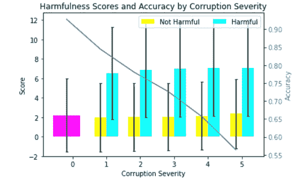

图 11.9 – 提取型漂移检测器检测数据损坏严重度

还有一些其他方法可以归类为上下文方法。

### 上下文方法

这些方法的目的是比较并评估训练集与测试集之间的差异，并在预测结果存在显著差异时评估漂移情况。

#### 树的特征

该方法允许你基于数据和预测时间戳训练一个简单的树模型，时间戳作为独立输入特征之一，与其他特征一起使用。通过分析树模型的特征重要性，显而易见，不同时间点的数据对模型的影响有助于揭示由概念漂移引起的差异。树的分裂以及基于时间戳的特征分裂，有助于解释漂移带来的变化。

#### 洗牌与重采样（SR）

数据在假定的漂移点处被分为训练集和测试集，然后使用训练集训练模型，并通过测试集评估模型的错误率。通过洗牌相同的数据集并重新计算错误度量，重复相同的训练和测试机制。当天订单数据的错误率与洗牌数据的平均错误率之间的差异超过指定阈值时，认为检测到了漂移。这也是一个计算密集型机制，因为它涉及在漂移发生时训练多个模型。

## 统计过程控制

这种漂移检测器控制机制确保当生产中的模型随着时间产生变化的准确度指标时，模型的误差能够得到管理。尽管这种方法在短时间内有效检测到突发性、渐进性和增量性的漂移，但提取样本标签时可能存在较高的延迟。要求有标签数据的限制使得该方法更难以广泛应用。

### 漂移检测方法（DDM）

这种漂移检测方法是最早设计的方法之一。假设输入数据呈现二项分布，且伯努利试验变量（或单一数据点）根据预测误差率推断漂移的发生。

该算法记录**最小误差概率**（*p*）率和二项分布的**最小标准差**（*s*），当*p + s*达到其最小值时。若*p + s*的值超过**最小误差概率**（pmin）与**最小标准差的倍数**（smin）的和，则认为存在漂移。我们可以表示为（p + s）>（pmin + 3 ✶ *s*min）。

推荐的乘数因子是 3。当变化发生缓慢时，该方法有局限性，此时缓存/内存可能会溢出。

### 早期漂移检测方法（EDDM）

这种方法虽然与 DDM 类似，但通过计算两个误差之间的**均值**（*m*）和**标准差**（*s*）来关注渐进式漂移。它记录（*m* + 2 ✶ *s*），当该值达到最大值时，会将这两个值分别保存为 mmax 和 smax。当比率（*m* + 2 ✶ *s*）/（*m* + 2 ✶ *s*max）低于阈值（*β*；推荐值为 0.9）时，漂移被检测到，并应触发警报。

### CUSUM 和 Page-Hinkley

**累积和**（**CUSUM**）及其变种**Page-Hinkley**（**PH**）都依赖于顺序分析技术，通常基于平均高斯信号。这些方法通过检测当观察值与均值之间的差异超过用户定义的阈值时发出警报。由于这些变化对参数值敏感，这种方法的一个缺点是可能会触发误报。这些方法可以广泛应用于数据流。

#### CUSUM

该漂移检测算法使用 CUSUM 检测均值的微小变化。当变化前后的概率分布已知时，CUSUM 过程通过考虑延迟和误报频率来优化目标函数。它具有额外的优点，即在最大似然的解释上简单直观。它是无记忆的、单侧的和不对称的，只能检测观察值与均值之间差异的增加。

CUSUM 检测器是一种基于核的方法，持续比较数据库中的样本。漂移判断的指标叫做**最大均值差异**（**MMD**）。该程序非常适合大数据量，因为它无需比较变化前后的分布，而是集中于当前数据来识别漂移。CUSUM 已经被增强，使用嵌套滑动窗口的双均值方法，这被称为**基于数据流的双 CUSUM**（**DCUSUM-DS**）。CUSUM 的另一个变体是 DCUSUM-DS，它使用双均值的 CUSUM。DCUSUM-DS 算法在嵌套滑动窗口中工作，通过两次计算窗口内数据的平均值来检测漂移。检测到平均值后，它提取新特征，然后生成累积和受控图表，以避免虚假推断。这种方法的一个主要优点是，它可以检测到新特征并重新运行分析，以确保正确检测漂移，而不仅仅依赖于检测到的平均值。

CUSUM 的基于核的变体不需要变化前后的分布，而是依赖于变化前分布中的样本数据库，利用该数据库与进入的观察样本进行持续比较。用户选择的核函数和比较的统计指标是 MMD。**核累积和**（**KCUSUM**）算法在拥有大量背景数据的情况下效果良好，尤其是在需要检测与背景数据偏差的情况下。

该算法可以配置一个阈值，设置超过该阈值时触发警报。漂移阈值的大小（例如，80%、50%或 30%）帮助我们获得识别漂移的正确指标。因此，当数据或模型模式出现任何偏差时，需要触发警报。例如，算法可以设置为非常大的幅度，并且 80%的阈值边界将使其比设置为 30%时更频繁地检测到漂移。检测器返回以下值：

+   `ta`：变化检测指标 —— 返回值表示报警时间（检测到变化时的索引）

+   `tai`：变化的起始索引 —— 显示变化开始时的索引

+   `taf`：变化的结束索引 —— 表示变化结束时的索引（如果`ending`为`True`）

+   `amp`：表示变化的幅度（如果`ending`为`True`）

配置参数的一种方法是从一个非常大的`threshold`值开始，并将`drift`设置为预期变化的一半。我们还可以调整`drift`，使得`g`有超过 50%的时间为`0`。然后，我们可以微调`threshold`，以便获得所需的虚假警报或延迟检测漂移的数量。为了更快地检测漂移，我们需要减小`drift`，而为了减少虚假警报并最小化小变化的影响，我们需要增大`drift`。

以下代码片段演示了如何使用 CUSUM 漂移探测器：

```py
from detecta import detect_cusum
x = np.random.randn(500)/5
x[200:300] += np.arange(0, 4, 4/100)
ta, tai, taf, amp = detect_cusum(x, 4, .025, True, True)
x = np.random.randn(500)
x[200:300] += 6
detect_cusum(x, 3, 1.5, True, True)
x = 2*np.sin(2*np.pi*np.arange(0, 2.8, .01))
ta, tai, taf, amp = detect_cusum(x, 1.8, .05, True, True)
```

前面的代码能够检测出不同数据区间之间的漂移，通过漂移百分比、阈值和变化实例的数量来进行说明。

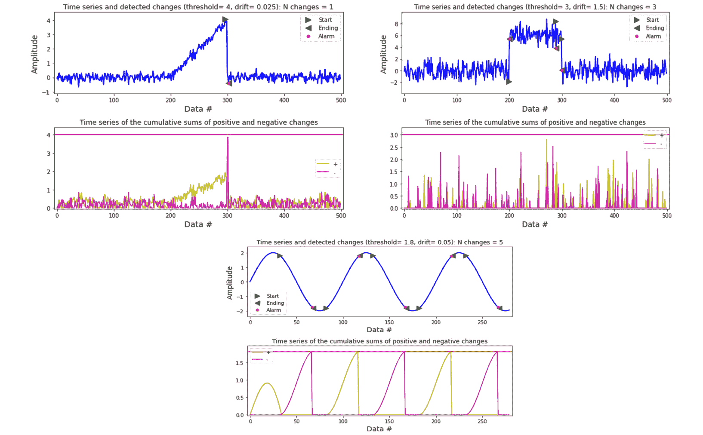

图 11.10 – CUSUM 漂移探测器变化检测

这里使用的基于阈值的漂移检测技术展示了(*图 11.10*)在检测漂移时，CUSUM 对正负变化的作用。

#### 协变量和先验概率数据漂移

协变量漂移是由于内部或外部因素引起的一个或多个独立特征的分布发生变化，但输入*X*和目标*Y*之间的关系保持不变。当协变量数据漂移时，输入特征*X*的分布发生变化，而在先验概率变化下，输入变量的分布保持不变，但目标变量的分布发生变化。目标分布的变化导致了先验概率数据漂移。为了实现协变量漂移，我们将一个正态分布的均值进行偏移。

该模型现在正在新区域的特征空间中进行测试，导致模型错误分类新的测试观测。在没有真实测试标签的情况下，无法衡量模型的准确性。在这种情况下，漂移探测器可以帮助检测是否发生了协变量漂移或先验概率漂移。如果是后者，可以通过在参考集的标签上初始化探测器来监控先验漂移的代理，然后将其输入到模型的预测标签中，以识别漂移。

以下步骤展示了如何通过与初始数据集上训练的原始模型进行比较来检测数据漂移：

1.  首先，我们采用多变量正态分布，然后指定参考数据以初始化探测器：

    ```py
    shift_norm_0 = multivariate_normal([2, -4], np.eye(2)*sigma**2)
    X_0 = shift_norm_0.rvs(size=int(N_test*phi1),random_state=2)
    X_1 = ref_norm_1.rvs(size=int(N_test*phi2),random_state=2)
    ```

1.  我们堆叠参考分布，并通过与`true_slope`进行比较来估计漂移，`true_slope`已被设置为`-1`：

    ```py
    phi1 = phi1*1.5
    phi2 = phi2*2.5
    true_slope = -1
    shift_norm_0 = multivariate_normal([3, -8], np.eye(2)*sigma**2)
    X_0 = shift_norm_0.rvs(size=int(N_test*phi1),random_state=2)
    X_1 = ref_norm_1.rvs(size=int(N_test*phi2),random_state=2)
    X_test = np.vstack([X_0, X_1])
    y_test = true_model(X_test,true_slope)
    plot(X_test,y_test,true_slope,clf=clf)
    print('Mean test accuracy %.2f%%' %(100*clf.score(X_test,y_test)))
    pred = detector.predict(X_test)
    print('Is drift? %s!' %labels[pred['data']['is_drift']])
    ```

该代码片段生成以下图表，以演示无漂移与协变量漂移的用例，显示出漂移情况下（右侧）均值准确度较低，而没有漂移时（左侧）较高。


图 11.11 – 协变量数据漂移

1.  当*图 11.11*展示协变量数据漂移时，以下代码演示了 MMD 方法的使用，其中计算了*X*ref | *C*和*X*test | *C*的核**条件**均值嵌入之间的期望平方差，以评估测试统计量：

    ```py
    def detect_prior_drift():
        label_detector = MMDDrift(y_ref.reshape(-1,1), backend='tensorflow', p_val=.05)
        y_pred = clf.predict(X_test)
        label_detector.predict(y_pred.reshape(-1,1))
    detect_prior_drift()
    ```

1.  我们得到以下输出：

    ```py
    {'data': {'is_drift': 1,
      'distance': 0.107620716,
      'p_val': 0.0,
      'threshold': 0.05,
      'distance_threshold': 0.013342142},
     'meta': {'name': 'MMDDriftTF',
      'detector_type': 'offline',
      'data_type': None,
      'version': '0.9.0',
      'backend': 'tensorflow'}}
    ```

MMD 探测器在`0.1076`的距离下检测到漂移，漂移检测的阈值为`0.013342`。

#### 最小二乘密度差异

`[0,1]`并预测相同的二元结果。

来自`alibi_detect`的 LSDD 在线漂移检测器需要一个**期望运行时间**（**ERT**）（反向的**假阳性率**（**FPR**）），使得检测器在没有漂移的情况下运行平均步数，之后才可能产生错误检测。若 ERT 较高，检测器的敏感度降低，响应变慢，因此该配置会在 ERT 和期望检测延迟之间调整权衡，以针对理想的 ERT 进行优化。模拟所需配置的最佳方式是选择比所需 ERT 大一个数量级的训练数据：

1.  在以下代码片段中，模型在白葡萄酒样本上进行训练，这些样本形成了参考分布，而红葡萄酒样本则来自漂移的分布。接下来的步骤展示了如何运行 LSDD 漂移检测，并帮助比较无漂移与有漂移的情况：

    ```py
    white, red = np.asarray(white, np.float32), np.asarray(red, np.float32)
    n_white, n_red = white.shape[0], red.shape[0]
    col_maxes = white.max(axis=0)
    white, red = white / col_maxes, red / col_maxes
    white, red = white[np.random.permutation(n_white)], red[np.random.permutation(n_red)]
    X = white[:, :-1]
    X_corr = red[:, :-1]
    X_train = X[:(n_white//2)]
    X_ref = X[(n_white//2) :(3*n_white//4)]
    X_h0 = X[(3*n_white//4):]
    X_ref = np.concatenate([X_train, X_ref], axis=0)
    ```

1.  在第一次运行中，没有设置检测器，我们没有检测到任何漂移：

    ```py
    n_runs = 550
    times_h0 = [time_run(cd, X_h0, window_size) for _ in range(n_runs)]
    print (f"Average run-time under no-drift: {np.mean(times_h0)}")
    _ = scipy.stats.probplot(np.array(times_h0), dist=scipy.stats.geom, sparams=1/ert, plot=plt)
    ```

上述代码产生如下输出：

```py
Average run-time under no-drift: 47.72
```

1.  以下代码片段从`alibi_detect`导入`LSDDDriftOnline`并通过参考数据、`ert`、`window_size`、运行次数以及原始分布和当前分布的 TensorFlow 后端来设置漂移检测器。然后，在线漂移检测器以`ert`值为`50`和`window_size`为`10`运行：

    ```py
    X_new_ref = np.concatenate([X_train, X_ref], axis=0)
    from alibi_detect.cd import LSDDDriftOnline
    def lsdd_detector():
        cd = LSDDDriftOnline(
            X_new_ref, ert, window_size, backend='tensorflow', n_bootstraps=5500,
        )
     times_h0 = [time_run(cd, X_h0, window_size) for _ in range(n_runs)]
        print(f"Average run-time under no-drift: {np.mean(times_h0)}")
        _ = scipy.stats.probplot(np.array(times_h0), dist=scipy.stats.geom, sparams=1/ert, plot=plt)
    ```

这将产生以下输出：

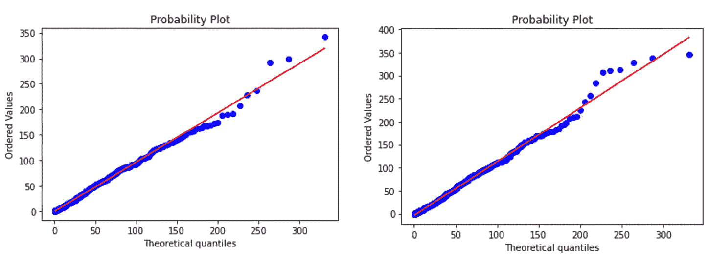

图 11.12 – LSDD 漂移检测器

*图 11.12* 演示了使用 LSDD 进行在线漂移检测。在这里，我们让检测器运行可配置的次数（50）或迭代，并配置 5,500 次自助法（bootstraps）来检测漂移。自助法用于运行模拟并配置阈值。更大的数量有助于提高获取 ERT 的准确性，通常配置为比 ERT 大一个数量级。

我们得到如下输出：

```py
Average run-time under drift: 54.39
```

此外，我们观察到，在第一次运行时，保留的参考数据上的检测器遵循几何分布，均值为 ERT，且没有漂移。然而，一旦检测到漂移，检测器反应非常迅速，如*图 11.12*所示。

#### Page-Hinkley

这种漂移检测方法通过计算观察值及其均值来检测变化，直到当前时刻。如果发现观察均值超过阈值 lambda 值，则不会发出任何警告信号，而是运行 PH 测试来检测概念漂移。数学上，它可以表示为：


当 gt– Gt > h 时，会触发警报。

现在，让我们逐步了解使用 PH 方法检测漂移的过程：

1.  以下代码示例演示了我们如何模拟两个分布：

    ```py
    import random
    from river import drift
    import matplotlib.pyplot as plt
    import numpy as np
    rng = random.Random(123456)
    ph = drift.PageHinkley()
    ```

1.  现在，我们组合并绘制一个由三种数据分布组成的数据流：

    ```py
    data_stream = rng.choices([50, 100], k=1200) + rng.choices(range(600, 900), k=5000) + rng.choices(range(200, 300), k=5000)
    plt.plot(data_stream)
    plt.show()
    ```

1.  现在，我们更新漂移检测器并查看是否检测到变化：

    ```py
    for I, val in enumerate(data_stream):
         in_drift, in_warning = ph.update(val)
         if in_drift:
           print (""Change detected at index {i}, input value: {val"")
    ```

1.  我们得到以下输出。我们看到在不同时间点检测到图表的三个不同分布的漂移。变化检测点打印在图表的两侧。

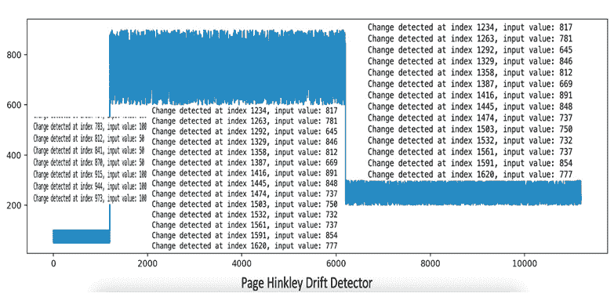

图 11.13 – 使用 PH 探测器在分布的三个范围内检测到漂移

### 快速 Hoeffding 漂移检测方法

**快速 Hoeffding 漂移检测方法**（**FHDDM**）允许持续追踪正确预测概率的滑动窗口值以及观察到的最大概率值。当正确预测概率低于最大配置值，并且概率差异超过阈值时，就认为发生了漂移。

### 配对学习器

**配对学习器**（**PL**）机制包括两个学习器，一个是对所有数据进行训练的稳定学习器，另一个是对最近数据进行训练的学习器。每当稳定学习器在预测中出错而最近学习器没有出错时，计数器就会递增。为了弥补错误，每当最近学习器在预测中出错时，计数器就会递减。一旦计数器的增量超过指定的阈值，就认为发生了漂移。该机制涉及大量计算，用于训练新模型并保持两个学习器。

### 指数加权滑动平均概念漂移检测

在**指数加权滑动平均概念漂移检测**（**ECDD**）方法中，通过连续计算预测的均值和标准差，使用**指数加权滑动平均**（**EWMA**）预测。它通常用于监控和检测流分类器的误分类率。当预测值超过均值加上标准差的倍数时，就检测到漂移。

### 特征分布

这种漂移检测技术通过识别*p(y|x)*由于*p(x)*的相应变化来实现，无需反馈响应。可以使用任何多元无监督漂移检测技术来检测这种变化。

### 回归模型中的漂移

要在回归模型中检测漂移，您需要取回归误差（一个实数）并对误差数据应用任何无监督漂移检测技术。

### 集成和层次漂移检测器

集成检测器主要基于一致性水平工作，其中一致性可以从少数、全部或大多数学习者中得出。层次化检测器仅在第一级检测器通过任何先前讨论的漂移检测技术检测到漂移后才会起作用。然后，可以使用一致性方法在其他级别验证结果，从下一级开始。一些集成和层次漂移检测算法包括**线性前馈率**（**LFR**）、**选择性检测器集成**（**eDetector**）、**漂移检测集成**（**DDE**）和**层次假设测试**（**HLFR**）。

现在我们已经了解了不同类型的概念漂移检测技术，接下来我们讨论在漂移/校准时的模型可解释性。

### 使用 PCA 进行多变量漂移检测

为了从多变量数据分布中检测漂移，我们通过**主成分分析**（**PCA**）将数据压缩到一个低维空间，然后再解压数据以恢复原始特征表示。由于我们在转换过程中仅保留相关信息，重建误差（通过原始数据和转换数据之间的欧氏距离评估）帮助我们识别一个或多个特征之间数据关系的变化。在第一步中，我们在原始参考数据集上计算 PCA，并存储带有允许上下限阈值的重建误差。然后对新数据重复此过程，在该过程中我们使用 PCA 对数据进行压缩和解压。当重建误差超过上限或下限阈值时，表示数据分布发生了变化。

以下代码演示了如何检测多变量特征漂移：

1.  在第一步中，我们进行必要的导入：

    ```py
    import numpy as np
    import pandas as pd
    import matplotlib.pyplot as plt
    import seaborn as sns
    import nannyml as nml
    from scipy.spatial.transform import Rotation
    ```

1.  接下来，我们基于其三个特征进行随机数据设置：

    ```py
    # analyze with reference and analysis periods
    # Days/week * Hours/day * events/hour
    DPP = 7*24*24
    np.random.seed(23)
    s1 = np.random.randn(DPP*22)
    x1 = s1 + np.random.randn(DPP*22)/8
    x2 = s1 + np.random.randn(DPP*22)/8
    x3 = np.random.randn(DPP*22)/8
    xdat = np.array([x1, x2, x3]).T
    rot = Rotation.from_euler('z', 90, degrees=True)
    # following matrix multiplication implementation, we need a 3xN data matrix hence we transpose
    ydat = np.matmul(rot.as_matrix(), xdat.T).T
    # drift is sudden and affects last 5-7 weeks
    dataar = np.concatenate(
    (xdat[:-5*DPP], ydat[-5*DPP:]),
    axis=0)
    datadf = pd.DataFrame(dataar, columns=['feature1', 'feature2', 'feature3'])
    datadf = datadf.assign(ordered = pd.date_range(start='1/3/2020', freq='5min', periods=22*DPP))
    datadf['week'] = datadf.ordered.dt.isocalendar().week - 1
    datadf['partition'] = 'reference'
    datadf.loc[datadf.week >= 8, ['partition']] = 'analysis'
    datadf = datadf.assign(y_pred_proba = np.random.rand(DPP*22))
    datadf = datadf.assign(y_true = np.random.randint(2, size=DPP*22))
    ```

1.  接下来，我们可以进一步解释独立特征，但目标是按照以下方式设置漂移检测器：

    ```py
    rcerror_calculator = nml.DataReconstructionDriftCalculator(
    feature_column_names=feature_column_names,
    timestamp_column_name='ordered',
    chunk_size=DPP
    ).fit(reference_data=reference)
    rcerror_results = rcerror_calculator.calculate(data=analysis)
    figure = rcerror_results.plot(plot_reference=True)
    figure.show()
    ```

1.  这产生了*图 11.14*中所示的结果，在其中我们看到数据从 0.84 漂移到 0.80。

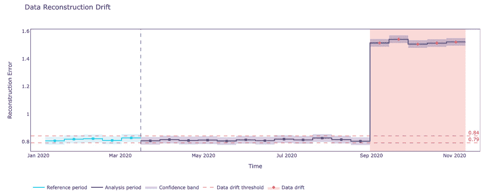

图 11.14 – 使用 PCA 的多变量漂移检测器

# 理解概念漂移/校准过程中的模型可解释性

在上一节中，我们学习了不同类型的概念漂移。现在，让我们研究如何通过可解释的机器学习来解释它们：

1.  首先，我们导入创建回归模型和漂移解释库所需的包。加利福尼亚住房数据集已被用来解释概念漂移：

    ```py
    from xgboost import XGBRegressor
    from cinnamon.drift import ModelDriftExplainer, AdversarialDriftExplainer
    from sklearn import datasets
    from sklearn.datasets import fetch_california_housing
    from sklearn.datasets import fetch_openml
    california = fetch_openml(name="house_prices", as_frame=True)
    california_df = pd.DataFrame(california.data, columns=california.feature_names)
    RANDOM_SEED = 2021
    ```

1.  然后，我们训练 XGBoost 回归模型：

    ```py
    model = XGBRegressor(n_estimators=1000, booster="gbtree",objective="reg:squarederror", learning_rate=0.05,max_depth=6,seed=RANDOM_SEED, use_label_encoder=False)
    model.fit(X=X_train, y=y_train, eval_set=[(X_test, y_test)], early_stopping_rounds=20, verbose=10)
    ```

1.  在下一步中，我们使用 `ModelDriftExplainer` 拟合我们的训练模型，绘制预测图，并提取任何漂移，如果解释器观察到的话：

    ```py
    drift_explainer = ModelDriftExplainer(model)
    drift_explainer.fit(X_train, X_test, y_train, y_test)
    drift_explainer.plot_prediction_drift()
    drift_explainer.get_prediction_drift()
    ```

下图说明了在两个不同数据集中的漂移检测差异。

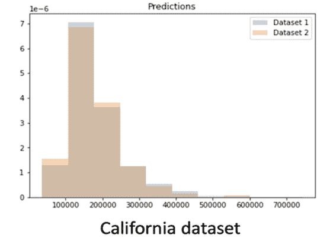

图 11.15 – 两个数据集的输入特征或数据分布的漂移

在*图 11.15*中，可以明显看出预测分布中没有出现明显的漂移。

1.  然后，我们绘制目标标签来评估预测结果中是否有漂移：

    ```py
    drift_explainer.plot_target_drift()
    drift_explainer.get_target_drift()
    ```

然而，如*图 11.16*所示，我们并没有观察到目标标签的明显漂移：

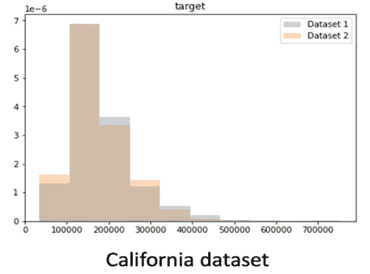

图 11.16 – 加利福尼亚住房数据集目标数据分布的漂移

1.  在接下来的步骤中，当我们评估加利福尼亚住房训练集和测试集的数据性能指标时，我们可以看到性能指标的均值和解释方差出现了数据漂移：

    ```py
    drift_explainer.get_performance_metrics_drift()
    ```

在运行加利福尼亚住房数据集的漂移解释器时，我们得到以下输出：

```py
PerformanceMetricsDrift(dataset1=RegressionMetrics (mse=10567733.794917172, explained_variance=0.9983637108518892), dataset2=RegressionMetrics(mse=540758766.1766539, explained_variance=0.9088298308495063))
```

1.  我们的下一个任务是绘制基于树的方法计算出的漂移值，获取加利福尼亚住房数据集的特征重要性，并在数据集上使用`AdversarialDriftExplainer`。如*图 11.17*所示，`Neighborhood_OldTown`和`BsmtQual_Gd`特征是受到漂移影响最大的特征：


图 11.17 – 结果漂移中的特征重要性

1.  最终，我们可以绘制每个特征并评估它们的漂移，如*图 11.18*所示。这里，`Neighborhood_OldTown`，第一个特征，在训练集和测试集之间没有显示出明显的漂移：

    ```py
    drift_explainer.plot_feature_drift('Neighborhood_Old_Town')
    drift_explainer.get_feature_drift('Neighborhood_Old_Town')'
    ```

前面的代码片段输出以下结果，显示两个数据集之间的差异不显著，因为`p_value`是 0.996 > 0.05：

```py
DriftMetricsNum(mean_difference=-0.022504892367906065, wasserstein=0.022504892367906093, ks_test=BaseStatisticalTestResult (statistic=0.022504892367906065, pvalue=0.996919812985332))
```

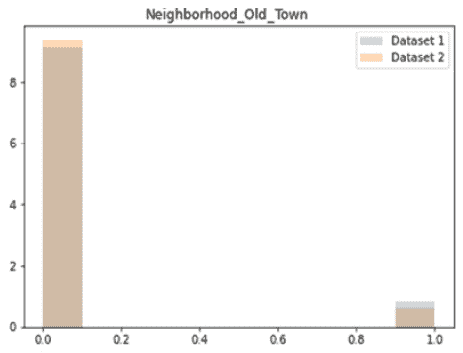

图 11.18 – 由于 Neighborhood_Old_Town 特征导致的分布差异/漂移

在了解漂移后，作为数据科学家，我们还需要理解在发生变化时，何时需要对模型进行校准。

理解模型校准的必要性

推荐系统（基于内容的过滤或混合系统）几乎在所有行业领域中都得到了应用，包括零售、电信、能源和公用事业。使用用户到用户或项目到项目嵌入的深度学习推荐模型，通过可解释性特征建立了信任和信心，并改善了用户体验。深度学习推荐系统通常使用注意力分布来解释神经网络的性能，但在**自然语言处理**（**NLP**）的情况下，这种解释受到深度神经网络校准不良的限制。

已观察到，由于过度自信或缺乏自信，模型的可靠性会受到影响，特别是对于设计用于医疗保健（疾病检测）和自动驾驶等领域的模型。在模型的可靠性受到质疑的情况下，使用像模型校准这样的度量标准至关重要，因为它能够确保模型预测的概率与其真实正确性的可能性相关联，从而决定模型的性能。

换句话说，当一个经过校准的模型具有较高的置信度（比如超过 80%）时，可以称其为真实有效的模型，此时超过 80%的预测结果被准确分类。我们还可以通过模型校准来绘制可靠性图。这可以作为模型的准确性，通过将可靠性解释为模型对预测的置信度的函数来实现。过于自信的模型的可靠性图低于身份函数，而缺乏信心的模型的可靠性图则高于身份函数。我们还可以看到，经过校准的真实模型提供了完美的分类边界，其中可靠性图可以作为身份函数进行基准测试。

*图 11.19*包含了**深度基于物品的协同过滤**（**DeepICF**）模型的可靠性图。DeepICF 通过使用非线性神经网络训练所有交互物品对，检查物品之间的非线性和高阶关系。它有助于我们理解如何在不同组中建模预测，并通过可靠性图研究准确性与置信度之间的权衡。


图 11.19 – DeepICF 模型的可靠性图

我们将模型的预测结果按置信度分成不同的区间，并计算每个区间的准确性。*图 11.19*展示了 DeepICF 模型（带有注意力网络：[`www.researchgate.net/publication/333866071_Model_Explanations_under_Calibration`](https://www.researchgate.net/publication/333866071_Model_Explanations_under_Calibration)）随着置信度的增加，正负类别的预测变得过于自信。DeepICF 模型是一个深度神经网络，它通过学习用户和物品的潜在低维嵌入生成。通过逐元素点积，神经网络层捕捉用户和物品之间的配对交互。此外，该模型还使用基于注意力的池化方法生成固定大小的输出向量。这导致在不平衡和负偏态数据集上准确性下降，表明通过注意力分布生成的模型解释在过于自信的预测下变得不那么可靠。

现在，让我们讨论一下当我们看到模型预测结果出现漂移时，如何将可解释性和模型校准结合起来。

## 可解释性与校准

通过解决数据集中的不平衡问题并为注意力分布添加稳定性，可以实现模型可解释性和适当的模型校准。然而，另一个需要解决的问题是由概念漂移引起的校准漂移。在医疗行业中，一个明显的例子是由于患者特征和不同健康中心、地区及国家的疾病发生率或流行率变化，导致风险预测校准不佳。当一个算法在高疾病发生率的环境中训练时，它会受到模型输入的主导，导致风险估计过高。当这种校准漂移由于模型在非静态环境中的部署发生时，这些模型需要重新训练和重新校准。重新校准有助于修复模型的准确性和置信度，从而提高可靠性图。

现在，让我们通过一个例子来看看为什么在以下情况下有必要对推荐模型进行校准：

+   当由于人口中新客户群体的加入而观察到用户偏好的变化时

+   当观察到现有客户中用户偏好的变化时

+   当有促销/活动或新产品发布时

在以下示例中，我们将研究如何将后处理逻辑嵌入到底层推荐算法中，以确保推荐结果变得更加校准。为了说明这个问题，我们将使用`movielens-20m-dataset`：

1.  为了计算推荐系统的效用指标，我们必须计算用户-项目交互分布与推荐分布之间的 KL 散度。在这里，我们选择了一个相关的 lambda 项，用来控制评分和校准之间的权衡。lambda 值越高，最终推荐结果被校准的概率越大：

    ```py
    def compute_recommendation_utility(reco_items, interacted_distr, lmbda=0.65):
        total_score = 0.0
        reco_distr = compute_likely_genres(items_to_recommend)
        kl_div = evaluate_kl_divergence(interacted_distr, reco_distr)
        for item in items_to_recommend:
            total_score += item.score
        rec_utility = (1 - lmbda) * total_score - lmbda * kl_div
        return rec_utility
    ```

1.  这里定义的效用函数在每次迭代时都会被调用，以更新列表并选择最大化效用函数的项目：

    ```py
    def calibrate_recommendations(items, interacted_distr, topn, lmbda=0.65):
        calib_rec_items = []
        for _ in range(topn):
            max_utility = -np.inf
            for rec_item in items:
                if rec_item in calib_rec_items:
                    continue
                rec_utility = compute_recommendation_utility(calib_rec_items + [rec_item], interacted_distr, lmbda)
                if rec_utility > max_utility:
                    max_utility = rec_utility
                    best_item = rec_item
            calib_rec_items.append(best_item)
        return calib_rec_items
    ```

1.  lambda 项允许我们将控制器(lambda)调整到极高的水平，以生成修改后的校准推荐列表。现在，让我们对校准后的计算推荐进行区分和评估（以优化评分𝑠），并与原始推荐及用户与项目的历史关系进行比较。这里，𝑠(𝑖)表示推荐系统预测的项目评分，𝑖∈𝐼，s(I) = ∑i ∈ Is(i)表示新生成列表中所有项目评分的总和：

    ```py
    calib_rec_item_distr = compute_likely_genres(calib_items_to_recommend)
    calib_reco_kl_div = evaluate_kl_divergence(interacted_distr, calib_rec_item_distr)
    reco_kl_div = evaluate_kl_divergence(interacted_distr, reco_distr)
    distr_comparison_plot(interacted_distr, calib_rec_item_distr)
    ```

在这里，我们观察到校准后的推荐在类型覆盖面上更广，并且其分布看起来类似于用户过去互动的分布和校准度量。KL 散度还确保从校准推荐生成的值低于原始推荐的分数。即使校准推荐分布的精度（0.125）低于原始分布的精度（0.1875），我们仍然可以进一步控制 λ，达到精度与校准之间的可接受平衡。

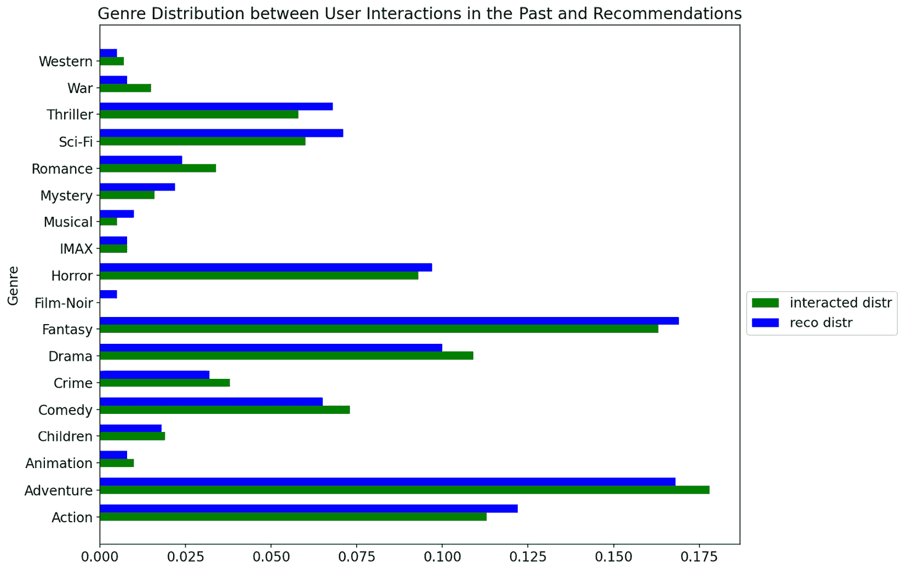

图 11.20 – 比较用户历史分布和校准推荐分布

在前面的讨论中，我们看到了由于输入数据和模型的变化，开发校准模型的重要性。现在，让我们从伦理 AI 的角度，讨论如何将公平性纳入模型并构建校准模型。

## 校准和公平性的挑战

到目前为止，我们已经了解了什么是跨不同人群子群体的公平机器学习模型，使得预测结果在所有种族、民族、性别和其他人口类别中都不会存在偏差。从 AI 伦理的角度来看，我们还应尝试设计公平且校准的模型，并在过程中理解与其相关的风险。为了设计一个公平且校准的模型，至关重要的是，赋予预测概率为 *p* 的群体，在通用机器学习模型中能够看到公平的代表性。为了实现这一点，我们应该让这组成员的 *p* 部分属于分类问题中的正实例。

因此，为了证明两个组之间的公平性，G1 和 G2（例如非洲裔美国人和白人被告），满足两组公平性的最佳方式是校准条件在每个组内的每个个体上同时成立。

然而，校准和误差率约束有着相互冲突的目标。研究表明，校准仅在存在单一误差约束时是容忍的（即各组之间的假阴性率相等）。此外，在使用校准概率估计时，跨不同人群群体最小化误差差异变得越来越困难。即使目标得以满足，得到的解决方案也类似于一个通用分类器，它仅优化一部分预测结果。因此，总结来说，无法设计出一个完全公平且校准的模型。

# 总结

在本章中，我们学习了与概念漂移相关的不同思想。这些思想可以应用于流式数据（批处理流）、实时数据以及训练好的机器学习模型。我们还学习了统计方法和上下文方法如何在通过判断模型漂移来估计模型度量指标时发挥重要作用。本章还回答了一些关于模型漂移和可解释性的重要问题，并帮助你理解模型校准。在校准的背景下，我们还讨论了公平性与校准，以及如何同时实现两者的局限性。

在下一章中，我们将学习更多关于模型评估技术以及如何处理模型构建流程中的不确定性。

# 进一步阅读

+   *8 种概念漂移检测* *方法*：[`www.aporia.com/blog/concept-drift-detection-methods/`](https://www.aporia.com/blog/concept-drift-detection-methods/)

+   *关于公平性与* *校准*：[`proceedings.neurips.cc/paper/2017/file/b8b9c74ac526fffbeb2d39ab038d1cd7-Paper.pdf`](https://proceedings.neurips.cc/paper/2017/file/b8b9c74ac526fffbeb2d39ab038d1cd7-Paper.pdf)

+   *校准的* *推荐系统*：[`ethen8181.github.io/machine-learning/recsys/calibration/calibrated_reco.html`](http://ethen8181.github.io/machine-learning/recsys/calibration/calibrated_reco.html)
