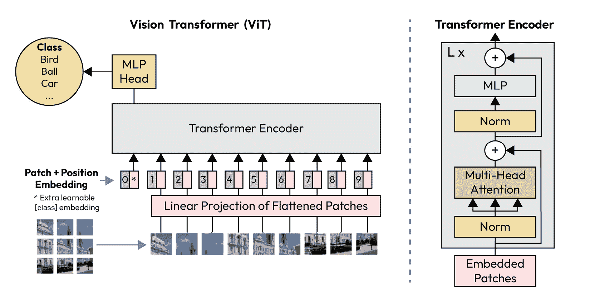
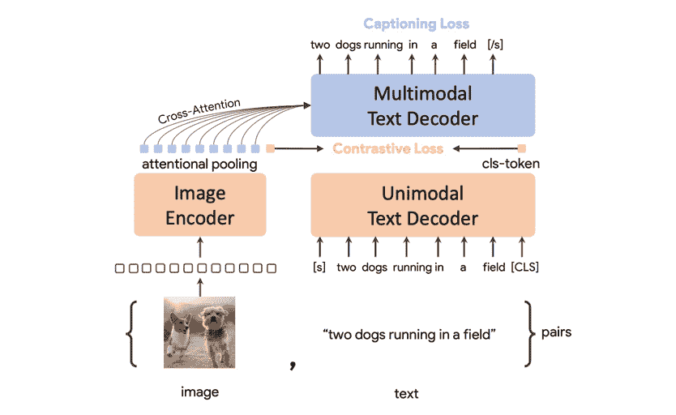
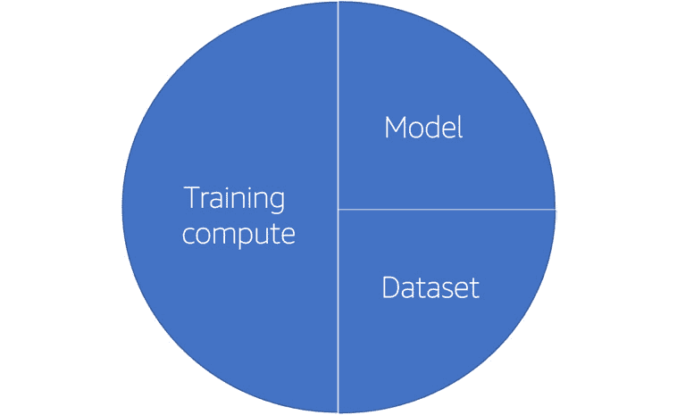

# 3

# 模型准备

在本章中，你将学习如何决定哪个模型最适合作为你预训练方案的基础。你将学会如何考虑模型的参数大小，以及关键的损失函数和它们如何在生产中决定性能。最后，你将结合缩放法则和数据集的预期大小，选择模型的上限和下限大小，以指导你的实验。

在本章中，我们将涵盖以下主题：

+   寻找最佳基础模型

+   寻找你的预训练损失函数

+   解决模型大小问题

+   规划未来的实验

# 寻找最佳基础模型

到了本书的这一部分，你应该已经学会了如何选择使用场景，如何找到数据集，以及如何将其与研究数据集进行对比。你特别应该已经学会了如何将这个数据集与开源社区中可用的数据集进行对比。接下来是有趣的部分：选择你的模型！

很可能，你已经心中有几个候选模型。如果你在处理自然语言，可能会考虑**生成预训练变换器**（**GPT**）系列中的某个模型用于生成任务，BERT 用于分类任务，或者 T5 用于类似翻译的任务。如果是视觉任务，你可能会选择 CoCa *(1)*、CLIP *(2)*，或者联合掩码的视觉和语言模型 *(3)*。对于多模态数据集，你可以选择直接来自视觉领域的模型，或者根据具体的使用场景选择一个更独特的模型。

在*第一章*《预训练基础模型介绍》中，我们简要介绍了这些最先进的模型，并深入探讨了它们背后的核心基于变换器的神经网络架构。让我们简要回顾一下这些模型，并强调它们为何重要：

+   **编码器**。广义上讲，编码器架构接受较长的输入，比如一长句子或长嵌入，并将其压缩成更紧凑的表示。一个编码器可能会接收一个长度为 500 的输入，通过一系列神经网络，将其压缩成一个长度为 50 的输出。编码器模型通过 BERT 及其后续系列（包括 DeBERTa、RoBERTa、XLM、AlBERT 等）得到了广泛应用。如果你感兴趣，DeBERTa 在这里被提到，因为尽管它采用了更新的注意力机制，使用了一个解耦目标函数并结合了新颖的增强掩码解码器，但它仍然普遍适用于分类任务。

重要提示

如果你希望保持模型较小，并且确信不需要任何生成能力，那么可以选择仅包含编码器的模型架构。这意味着你应该计划不使用此模型进行文本生成、零样本性能、摘要生成以及问答的最后步骤。

+   **解码器**：解码器模型架构正好与编码器相反。它接收密集输入，例如长度为 50 的输入，并利用可学习的前馈网络将其重新组合成更大的空间，例如长度为 250 的输出。我们将在本章稍后深入探讨这一过程的细节（提示：这一切都与*预训练损失函数*有关）。解码器单一模型首次进入全球舞台是通过 GPT-4 模型*(4)*，如今像 OPT 和 BLOOM 这样的开源选项也已问世。

如果你想专注于模型的生成能力，可以选择解码器单一模型（即扩散模型）。如果你需要强大的总结能力、生成能力或生成高质量图像的能力，解码器单一模型是最佳选择。

+   **扩散模型**：如果你想预训练一个图像生成模型，例如 DALL-E 2*(5)*、Imagen*(6)*、Flamingo*(7)*和 Stable Diffusion，那么你需要使用扩散模型。扩散模型是一些非常有趣的训练系统，它们通过使用多个预训练模型来嵌入联合的视觉和语言对。最终，通过 U-Net 将它们连接起来，U-Net 在训练过程中逐步加入噪声，然后再去除噪声。模型通过将生成的图像与给定的描述进行对比，学习如何生成图像，并根据图像与描述的差距来更新模型权重。

+   **组合编码器-解码器模型**：当前最常见的编码器和解码器混合使用的神经网络应用场景是翻译。这个类别的模型因 T5*(8)*而闻名，它能够在大规模的情况下处理一种语言的字符串与另一种语言的翻译对。T5 之后发展成了 BART、FLAN-T5、M2M、MBart、BigBird 等模型。

当你确信翻译是你使用场景的核心时，选择一个组合编码器-解码器模型。这可能适用于从提示中写代码、总结文档或转移风格等场景。

现在，想一想，你需要哪一种模型？希望此时你已经能够确定其中一个主要类别。

## 从最小的基础模型开始。

在本章中，我们将学习如何使用扩展法则来解决模型的大小问题。然而，在此时，引入**基础模型**的概念是有帮助的。基础模型通常是可用模型中最小的版本。例如，你可以在 Hugging Face Hub 或与论文相关的 GitHub 网站上找到这些模型。基础模型通常包含几亿个参数，因此它们适合放在单个 GPU 上。它们不占用太多 GPU 内存，在大多数环境中也可以很好地存储在磁盘上。基础模型在生产中运行非常快，因为神经网络的实际大小较小，计算可以更快地完成，数据也需要经过较少的层才能输出最终结果。所有这些好处意味着，将基础模型投入生产并在整个管道中使用它要比使用更大的模型容易得多。因此，在与客户合作时，我强烈建议从你能找到的最小模型开始实验，只有在该模型不再提供你需要的效果时，再逐步增大模型的规模。

在本章后面，我们将讨论何时、何地以及如何设计包含更大模型的实验。在*第十四章*中，我们将学习如何通过 MLOps 管道将这些实验付诸实践！

## 权衡 —— 简单与复杂

在应用机器学习时，一个有帮助的方面是考虑这个简单的维度：简单与复杂。一个简单的模型可能更小，可能包含更少的创新操作。它在 Hugging Face Hub 上的描述可能字面上更短。它可能有更少的 GitHub 问题，但可能有更多相关的论文。从一个简单的工件开始是为你的团队提供健康开端的好方法。你希望在项目初期获得成功，而不是在启动时就遇到困难。一个简单的项目，例如在几 GB 数据上对 BERT 进行微调，可能是一个不错的选择。当你在实际用例上测试完后，并且有更多的无监督数据时，你可以简单地尝试继续在这个无监督数据集上进行预训练。

重要说明

从一个简单的工件开始是为你的团队提供健康开端的好方法。你希望在项目初期获得成功，而不是在启动时就遇到困难。

另一方面，复杂性可能会提升模型性能，超越简单模型所能达到的水平。这包括模型、数据集和计算规模的扩展，以及在预处理、训练和部署管道中融入多个模型。

正如我们在本书中所看到的，仅仅依靠规模对许多用例来说是一种有前景的策略。然而，在微调章节中，我们将探讨如何通过指令微调、思维链微调以及带有人工反馈的强化学习等技术，在不必扩大参数规模的情况下提高模型性能。这些都是有前景的趋势！

### 权衡——应用于许多用例与仅限于单一用例

在设计整体解决方案或产品时，另一个关键方面是你扩展到尽可能多用例的能力。这符合最大化投资回报的基本经济学原则。在这个项目中，你将有两个重要的投资：

+   你的时间

+   你的计算成本，我们将在接下来的关于 GPU 的章节中深入探讨。

这两者都是你所在组织的资源分配，用于产生某些输出，或者在这种情况下，生成一个模型。这个模型能够解决的每一个用例*都是你项目创造价值的潜在路径*。每次你对这个模型进行微调，将其部署到生产中用于应用，或用它进行下游分析，或者将其集成到演示或报告中时，你就为你的组织创造了从对项目投资中获取价值的途径。当你的项目能够解决尽可能多的用例时，你就为成功打下了基础。

在预训练和微调的情况下，这是一个容易解决的问题。首先，看看你组织中已经部署了多少模型。如果这些是基于变换器的模型，那么它们很可能是从某些开源模型中微调出来的产物。将这些开源模型视为你的目标范围。你的团队使用 BERT 吗？RoBERTa？GPT-2？选择覆盖尽可能多下游任务的模型。

另外，如果这些用例具有极高的价值，你可以考虑解决数量更少的用例。搜索就是一个很好的例子。从电子商务到酒店业，从客户服务到产品交付，当搜索引擎获得大量流量时，它很可能是一个高价值的业务。搜索是大型预训练模型的顶级应用，特别适用于那些希望利用前沿技术产生最大影响的新项目。

### 寻找最佳基础模型的战术方法

实际上，这是我思考如何找到最佳基础模型的方式。首先，像在*第二章*中做的那样，列出你希望模型解决的关键用例。查看模型排行榜，比如我们在*第一章*中讨论过的排行榜，看看哪些模型似乎始终排在前列。考虑这些模型的基础架构，并将其与您的顶级用例进行比较。如果你找到一个最近的模型，且它有开源代码样本和模型权重，并且看起来与您正在探索的用例匹配良好，那么我建议从这个模型开始。

如果你想挑战自己，试着重新设想模型的低层次方面作为改进的方向。这可能是对神经网络的更新，或者是这些网络的组合，甚至是可能改善整体目标的自定义操作符。记住，你要把准确性和效率作为关键指标！

一旦你确定了最适合的基础模型或想要考虑的一组顶级模型，就该深入探讨这个模型的一个关键要素，它决定了模型的学习能力：预训练损失函数。

# 找到你的预训练损失函数

我们在*第一章*中介绍了这个话题，作为*预训练目标*，或者在视觉领域中作为*前置任务*。记住，这些本质上是不同的词语，但指的是同一件事：你的模型在执行**自监督学习**时会优化的数学量。这很有价值，因为它使你能够接触到大量的无监督数据，而这些数据通常比有监督数据更容易获得。通常，这个预训练函数会注入某种噪声，然后尝试从虚假数据中学习真实数据的模式（**如 GPT 的因果语言建模**）。一些函数会注入掩码并学习如何预测被掩盖的词（**如 BERT 的掩码语言建模**）。还有一些会用合理的替代词替换某些词，从而减少所需数据集的总体大小（**如 DeBERTa 的标记检测**）。

重要提示

当我们预训练我们的模型时，我们使用一个预训练损失函数来赋予模型识别数据集各个方面的能力，最终从虚假中预测出真实。

那么，为什么这么重要呢？为什么我们如此关心预训练目标？它将如何影响你的项目？你应该关心预训练损失函数的原因是，它是决定你的模型可以在哪里使用以及其表现如何的主要因素。在前一节中，我们将某些类型的模型架构（编码器、解码器和混合架构）映射到不同的机器学习用例（分类、生成和翻译）。这种映射存在的真正原因就是因为预训练损失函数！

考虑仅解码器模型，尤其是 GPT-3 和类似的候选模型。这里的预训练函数被称为*因果*，因为它是从左到右工作的。预训练函数会从一个基础文本字符串开始，比如半句话，然后使用解码器尝试生成剩余的句子。通常，你会将这个与目标度量（比如困惑度）配对，来考虑你生成的字符串与根文本的接近程度。随着训练的继续，神经网络会优化困惑度度量，通过调整权重使得总体损失减少，一步步提高模型的性能。

有趣的是，鉴于基于 GPT 的模型近期表现出色，我们开始看到它们在各种使用场景中得到应用，并且具备零样本性能。这意味着一旦你大规模训练了 GPT 模型，你就可以将其用于无须提供前置示例的提示场景，完成分类、实体抽取、情感分析、问答等任务。虽然从严格意义上说，你仍然是在进行文本生成，但这种方式的使用可以解决的不仅仅是开放性内容生成问题。

接下来，让我们看看在视觉、语言和多模态场景中，不同模型的预训练损失函数。

## 视觉中的预训练损失函数——ViT 与 CoCa

我们已经学习了很多关于核心的变换器模型架构的知识，现在你应该对这种模型在自然语言处理中的工作方式有所了解。但计算机视觉呢？视觉变换器*(9)*朝这个方向迈出了重要一步，弥合了自然语言处理（NLP）中的进展，并将这些成果带给了视觉社区。特别地，**视觉变换器（ViT）**展示了完全可以从模型中去除卷积操作。一个预训练的 ViT 减少了训练下游模型所需的整体计算资源，并且这些模型的表现与当时顶级的基于卷积的方法相媲美。

当然，卷积神经网络（CNN）今天仍然在使用，且在许多场景下，它们的表现明显优于 ViT。CNN 的核心优势在于它能够很好地保持图像的视觉结构。卷积操作的核心过程是将图像的所有像素从左到右、从上到下地渲染为密集的表示。这种方法的一个好处是**归纳偏差**，即模型在训练过程中对像素之间的相互关系产生的学习偏好。这是 CNN 能够学习视觉的核心原因。ViT 没有这种能力，而是将像素当作令牌进行处理。由于其核心的自注意力机制，ViT 在扩展性方面提供了一些优势，但在较小的数据集和模型中，CNN 可能更为常见。近期的研究*(5)*已经开始弥补 ViT 的这一缺陷，为它们引入了归纳偏差。

那么它是如何工作的呢？通过一个编码器！这个解决方案从一种基本的数据处理技术开始，它将输入展平。将二维图像取出，简单地重塑成一个*展平的二维补丁*序列。接着，编码器应用*线性投影*过程，将图像的所有部分合并成一个单独的行，并包括位置信息，这样内容的位置仍然能为模型所知。这个单独的行被送入变换器编码器，而变换器编码器本身使用自注意力过程。编码器不断缩小行的大小，直到最终得到标签行。然后，模型从可用的类别中选择一个。最后，损失函数与实际标签相结合，提供了一个可学习的信号，供模型更新其权重并在下一轮训练中提高准确性。让我们来看一下这个过程。

图 3.1 – ViT

值得注意的是，ViT *仍然是一个有效的监督学习过程*。显然，这里的学习方法依赖于事先已知的标签。这与语言领域中的预训练方式有很大不同，因为语言中的标签通常是未知的。但这种基础的视觉迁移仍然能提升下游模型的准确性，因此值得评估。虽然有一些项目*(10)*尝试在视觉中实现真正的无监督方法，但个人而言，我尚未见过在视觉领域中严格优于监督方法的情况。也许这就是两个领域之间的核心区别。也许下个月我会被证明是错的。

另一个在视觉领域至关重要的预训练损失函数是对比损失。我们在第一章中提到过这个概念，但现在我想带你深入了解。我们将重点介绍一个使用此方法的模型：**CoCA**。有趣的是，作者尝试将我们迄今为止提到的三种模型架构统一起来：仅编码器、仅解码器和混合编码器-解码器。经过训练的模型能够解决视觉识别、视觉-语言对齐、图像描述、端到端微调、冻结特征评估以及零-shot 迁移等用例（稍后书中会详细讨论零-shot）。事实上，CoCA 使用了两种预训练目标：一个用于处理图像，另一个用于处理文本。让我们来详细了解一下！

工作流程中的图像部分与 ViT 类似；它先取一张图像，应用展平过程，然后将其输入到编码器中。事实上，CoCA 的基础实现默认使用 ViT！然而，它并不是直接在编码器的输出端产生分类结果，而是将这些密集数组以两种方式使用：

+   首先，作为最终解码器的输入

+   其次，作为*中间* *损失函数*的输入

这被称为**对比损失**，因为它有效地将视觉内容与文本内容进行对比。最终的输出随后应用**标注损失**，提高模型在最后阶段为提供的图像进行标签或标注时生成文本的准确性。这就是为什么这个模型被命名为 CoCa：对比标注生成器。

图 3.2 – 对比损失与标注损失

在工作流的语言部分，我们看到一个解码器。解码器接收提供的文本输入，例如图像的原始标注。然后，它应用另一个扁平化过程，将单词进行分词和嵌入，为解码器做准备。接着，解码器将单词的维度降到更低，输出一个更密集的标注表示。然后，这个表示被作为输入提供给对比损失函数，从而更好地实现图像与文本之间的联合比较。

这是 CoCa 的加权损失函数：

+    = CoCa 的整体损失

+    = 对比损失

+    = 标注损失

+    = 用于加权对比损失的超参数

+    = 用于加权标注损失的超参数

最后，整个模型使用这两种损失函数的加权组合作为全局损失函数。你可能会问，他们是如何确定这些权重的？通过实验！这些实验几乎肯定依赖于数据集和任务。如果你使用 CoCa 来解决一个视觉数据极其丰富但语言数据非常薄弱的使用场景，你可能会考虑从较高的对比损失权重开始。然而，如果你的语言数据一开始就非常优秀，而视觉数据只有轻微的信息量，你可能会从较高的标注损失权重开始。

通过这种方式，你可以开始理解我们是如何为模型选择超参数的。这是后续章节的内容，所以现在，我希望你能培养一种直觉，即*每个模型的具体实现可以根据你的数据集和使用场景高度个性化*。阅读这些论文并了解这些最先进的模型如何工作是一个有助于你加深自己分析和理解的步骤。你可以并且应该把这些知识应用到你的工作中去获取更多收益！

## 语言中的预训练损失函数 – Alexa 教师模型

在这一点上，你应该已经对我们讨论过的**掩码语言建模**感到相当熟悉，尤其是它如何在语言中实现仅编码器的模型，如 BERT。你还应该了解**因果语言建模**，它使得像 GPT 这样的仅解码器模型成为可能。现在，让我们看看当我们将两者结合时会发生什么！

Alexa 教师模型（11）就在我写这段文字的几周前发布，作为一名亚马逊员工，我可以告诉你，看到自己公司推出一个大型语言模型的感觉真好！但这并不是我在这里提到它的唯一原因。我认为你应该了解**Alexa 教师** **模型**（**AlexaTM**）有两个原因：

+   首先，它使用一个叫做*少量学习（few-shot learning）*的概念，轻松地将关于人类语言交流的知识从一种语言转移到另一种语言。正如我们在*第十三章*的提示工程中将要学习的那样，少量学习意味着你给模型提供一些*推理*的示例。这些少量示例能帮助模型更准确地回应。这对于语言来说尤其有用，因为它允许语言研究人员为*低资源语言*开发解决方案，从而为相关社区引入一些数字技术。

+   其次，使用这种少量学习方法，一个拥有 200 亿参数的 AlexaTM 模型在同样的问题上，能够超越一个 540 亿参数的 27 倍大模型 PaLM *(12)*。这是一个至关重要的时刻，我希望我们在未来几年能看到这种趋势。虽然在机器学习模型中，规模更大有时意味着更好，但并不总是如此，有时甚至可能更差。记住，较小的模型训练速度更快，使用起来更简便，推理速度也更快，所以如果准确性相同或更好，总是选择小模型。

那么，它是如何工作的呢？类似于 CoCa 示例，我们现在追踪了两个损失函数。第一个你已经熟悉：**因果语言建模**，简称**CLM**。在这里，CLM 过程尝试预测一句话的结尾。现在，AlexaTM 20B 将其与**去噪损失函数**结合在一起。去噪过程在 BART *(13)* 中被引入，作为一种在编码器和解码器的组合上进行联合学习的方法，特别是*通过引入噪声*。给定的文档通过编码器故意被破坏，加入掩码。然后，解码器被要求预测文档是否是原始的。实际上，加入噪声然后尝试区分噪声与真实信息的过程，和对抗学习有些相似。

图 3.3 – Alexa 教师模型

有趣的是，AlexaTM 20B 只在**20%的时间**内使用 CLM 预训练目标。这是为了引入模型在少量样本情况下表现良好的能力。在这段时间里，模型完全不产生噪声；它只是尝试完成句子。这通过提供一个信号来表示，信号出现在 20%的句子的开头[CLM]。作者还随机向模型输入了 20%和 80%的文档，以确保它在短文本和长文本的情况下都能表现良好。为了快速启动训练，他们还从一个 10B 预训练编码器开始，并在达到 100,000 步后解冻。整个过程在 128 个 A100 GPU（NVIDIA 硬件）上进行了 120 天，这相当于在 Amazon SageMaker 分布式训练中使用 16 个`ml.p4d.24xlarge`实例。更多关于 SageMaker 训练的内容将会介绍！

供你参考，AlexaTM 中的“教师”指的是一种称为**蒸馏**的过程。**蒸馏**是另一种传递知识的方式，可以与微调相媲美。在微调中，我们将额外的层附加到较大的基础模型上，然后通常在一个较小的有监督数据集上运行它。在蒸馏中，我们将一个较大的“教师”模型与一个较小的“学生”模型配对。然后，学生模型被训练以生成与教师模型相同的概率分布，但计算成本要低得多。*第十章*全部讲述了微调模型的方法，并附有代码示例。

## 改变你的预训练损失函数

现在我们已经调查了在视觉、语言和多模态场景中一些最顶尖的预训练损失函数，你可能会想：就这些吗？我该如何使用这些信息呢？

这个问题的答案很大程度上取决于你在机器学习领域的经验年限。如果你刚开始入门，那么你当然不需要过分关注项目中的这一方面。只需选择最适合的模型，理解它是如何学习的，然后继续推进你的项目。然而，随着经验的增加，你可能开始想要尝试调整预训练损失函数，这很好！随着你在机器学习方面的成长，特别是作为开发者或科学家，回馈社区自己独特的创意是非常有价值的。在整个建模过程中，发明新的预训练损失函数或其他任何新的优化方法，不仅极具价值，而且令人满足。在这一过程中，你可以真正为某个领域设立新的技术标准，甚至可能是你自己发明的新领域！

# 解决你的模型大小问题

现在你已经选择了最佳的基础模型，并理解了它的预训练机制，同时在上一章中识别了你的数据集及其整体大小，接下来让我们开始了解你可以瞄准的模型大小！

你可能还记得，在*第一章*中，我们介绍了一个核心概念——*规模法则*。这个大胆的观点是由 Kaplan 等人在 2020 年提出的，建议了计算训练集群的整体规模、数据集和模型之间的正式关系。在 Kaplan 之前，大多数机器学习从业者已经理解到这三者之间存在某种一般关系，但他的团队勇敢地通过幂律的实证研究来证明了这一点。

你需要理解的基本内容可以通过一个简单的图示来展示。为了更好地训练你的模型，无论是在实现最高准确度方面，还是在充分利用你整体计算预算方面，考虑以下关键项作为一个基本关系是很有帮助的。

就个人而言，我发现以视觉化的方式来考虑这一点是非常有帮助的。你的模型学习任何关于真实世界的知识，根本的方式是通过数据集本身。自然地，你可以看到，随着模型的规模增加，你希望数据集在某种程度上也要增大。随着数据集的增加，模型也应该在一定程度上增大。

图 3.4 – 机器学习的相互关系

你甚至可以从人类学习的角度来思考这一点。当我们获得更多经验、更多知识、更多理解时，我们的大脑实际上会构建新的路径，以解读、存储和从这些经验中学习。你拥有的新的经历越多，解决的问题越多，你的大脑就会越进化，存储所需的信息。反之，当我们的经历和新挑战减少时，我们的大脑会失去一定的弹性，无法作出相应的反应。这就是生物优化的一个例子！

完成这个类比，我们的生活经验就像是一个数据集。每一个新的挑战、新的关系、新的经历和新的问题就像是往数据集中添加额外的记录和方面。类似地，我们的大脑就像是一个模型。我们的身体自然地处理在大脑中建立和释放路径的过程，这个过程是动态的，依据我们最新的经历。作为计算机科学家，我们所要做的就是通过一种叫做*训练*的过程，用代码来复制这一过程。

在跨视觉、语言和多模态场景的预训练方面，请知道这种关系仍然适用。如果你将一个大型、复杂的模型与一个小数据集配对，很可能会出现*过拟合*的情况。过拟合意味着你可能在训练集上获得极高的准确率，但完全无法进行良好的泛化，也无法在训练过程之外提供有意义的结果。另一方面，如果你将一个小型模型与一个极大的数据集配对，*你很可能会出现欠拟合*。这意味着你可能在训练集上表现不佳，更不用说在其他地方了。

将计算与模型和数据集大小相匹配完全是关于成本优化的问题。*横向扩展*存在固有的权衡，这意味着向你的集群中添加更多计算资源。这与*纵向扩展*不同，后者意味着将实例升级到更大和更新的版本。大多数团队会在尽量用尽可能多的机器来降低运行时间与尽量少用机器但需要多天、数周甚至数月才能完成训练之间找到一个自然的平衡。你需要在这两者之间找到一个合适的中间地带。我们将在*第五章*中深入探讨这些话题，包括核心的分布式方法，如模型并行和数据并行，*分布式基础*。

案例研究——亚马逊搜索通过分布式训练将运行时间缩短七倍

寻找速度与每小时成本之间自然平衡的一个很好的例子是*亚马逊搜索*！搜索团队，正如你所料，负责帮助你在[amazon.com](http://amazon.com)上找到你最感兴趣的产品。每次你在亚马逊上寻找某样东西时，查询都会通过我们的搜索引擎，精确找到你正在寻找的内容。

科学家和开发者重视快速迭代的能力。他们喜欢尽快测试想法，快速获得反馈，然后迅速进入下一个版本。这使他们能够*优化*，或者简单地快速改进他们的想法。保持实验的灵活性有助于降低研发的整体成本，因为它减少了从初步产品构思到全面发布所需的时间。

在亚马逊，SageMaker 与搜索团队合作，推出了对 PyTorch Lightning 的原生支持，并优化了节点间通信项目——分布式数据并行。因此，搜索团队能够将训练从 1 个节点扩展到 8 个节点，将整体训练时间从 99 分钟缩短到 13.5 分钟！

他们并没有改变模型大小或数据集，保持这两者不变，只是加入了数据并行策略，复制模型并将数据分发到所有加速器（GPU）。这使他们能够进行横向扩展，向集群中添加额外节点，从而减少了整体作业时间。

我们将在后续章节中深入探讨这些分布式概念，但现在，只需知道，*当你使用分布式策略并在集群中增加额外节点时，你可以缩短训练模型所需的时间*。

## 解决模型大小问题的实际方法

现在你已经对数据、模型和计算资源之间的关系有了较好的理解，我们来深入探讨如何确定适合你的配置！

大多数团队会把计算预算视为固定的。把这个数字看作你应该计划向高级领导层申请批准的项目预算。正如我们在*第二章*中学到的，你应该将这个数字视为你业务中增加的准确度所带来的整体价值的某一部分。

第二个真正的瓶颈是你的数据集大小。弄清楚你的候选数据集有多大。在视觉任务中，你可能是在计算图像数量；在语言任务中，你可能是在计算标记数量。我仍然喜欢以 GB 为基准，因为它容易理解且可以跨领域转化。一般来说，一个好的起点是找到你受到启发的模型和论文，深入研究它们，了解它们的数据集有多大，并以此作为你的基准。这些大小范围通常从几十 GB 到几个 PB 不等。对于那些刚接触机器学习的人来说，这是一个很好的起点。遵循已经验证过的专家经验路径是开始成功项目的好方法。然而，对于那些不新手的人，我们快速看一下如何利用缩放法则来计算最佳模型大小。

## 不是所有的缩放法则都一样

首先，了解一下，虽然模型、数据和计算大小之间的关系在直觉上是可以理解的，但精确的数学公式实际上可能会有很大差异。正如我们在*第二章*中学到的，Kaplan 使用了数学术语！，这表示两个量是“成比例”的。换句话说，当两个项被比例符号等号连接时，我们知道这两个量是相关的，但我们并不知道确切的常数项来支配这个关系。

这就是大型深度学习模型的情况。不同的论文和研究团队在这方面有各自的偏好，例如 Kaplan 倾向于保持模型规模较大，而数据集相对较小，而 Hoffman 则建议两者都要增加。Kaplan 最初提出自回归模型，或者基于解码器的模型，作为最*样本高效*的模型。然而，AlexaTM 项目表明，联合编码器和解码器实际上可能更高效。所有这些都说明，尽管缩放法则可以建议最佳的模型设置，结果会有所不同。

接下来，让我们尝试定义你想在实验中构建的模型大小的下限和上限。

# 规划未来的实验

既然你已经对在计算预算和数据限制下想要针对的模型大小有所了解，让我们来学习如何将每一次作业的执行*视为一次实验*。从根本上讲，机器学习过程中的每个阶段都可以看作是一次独特的实验。你在项目中某些阶段的输入保持不变；这些可以称为你的**因变量**。而有些输入会发生变化；这些则是你的*自变量*。在项目中积累技能需要时间，简单来说，改变某些东西并观察结果。只需确保你只改变一项内容，这样结果才会有实证依据！

关键是要明白，你整个项目的范围*不会*一蹴而就。很多时候，这是因为在项目中积累技能需要时间。即使你从一支经验丰富的团队开始，坦率来说，这种情况非常少见，机器学习的生态系统本身变化如此之快，以至于每隔几个月，你就会学习到一些新的内容。因此，计划为学习所有最新发布的内容预留额外的时间。

一开始，尽量从最小的实验开始。让你的模型的最小版本在本地 IDE 上运行。根据模型的大小和你需要的硬件，你可以选择多种计算选项，从 Jupyter notebooks 和更强大的选项，到你的笔记本电脑、免费的计算实验环境等。在 AWS 上，我们通过我们的完全托管机器学习服务 Amazon SageMaker 提供了各种这些选项。

在对数据集的一小部分展示出有趣的结果之后，我喜欢直接进入远程 SageMaker 训练任务。你将在下一章中了解更多关于 SageMaker 上的训练，但现在我只想让你知道，*你可以轻松且无缝地根据需求在 Amazon SageMaker 上扩展和缩减训练工作量*。本书中所有的实践指南将聚焦于如何高效地实现这一点。在你的项目中，你可以考虑在 SageMaker Training API 上工作，直到成功运行作业。我会坚持做这项工作，直到你在一台拥有多个 GPU 的单实例上运行：我常用的是 `g` 系列，配备四个 GPU。这个可以是 `ml.g4dn.12xlarge`，也可以是 `ml.g5.12xlarge`。接下来的章节会详细说明这些配置！使用多个 GPU *将需要数据和/或模型并行化策略*，这一部分内容会在 *第五章*中讲解。

一旦你成功地在 SageMaker 远程训练和多个 GPU 上运行，那么就该提高一切了。增加数据的规模。记住，模型、数据、计算能力以及关键超参数（如学习率和批量大小）和模型架构本身是相互关联的。找到合适的设置是*第七章*的全部内容。

一旦你开始增加，额外的复杂性就会出现。你需要确保你的损失足够减少，但同时也要保持 GPU 的高利用率。你想调试和改进工作中的运算符和通信，但也需要评估训练吞吐量。当你的工作出现故障时，几乎可以确定它会发生，你希望尽快将其恢复，但也要确保准确性。

深入这些细节，解构它们，帮助你让项目重新回到正轨，避免尽可能多的障碍并利用已知问题的机会，正是*第三部分*的重点。

简而言之，预训练大模型有许多不同的离散阶段。整本书的目标是帮助你安全地应对这些阶段。在下一章，我们将深入探讨 GPU 本身，揭示如何最佳利用这些高效的处理器，也被称为**加速器**。

# 总结

在本章中，你学习了如何找到最佳的基础模型，包括架构基础、最常见的使用案例和模态，同时你获得了从最小模型开始的一般指导。你了解了关键的权衡，比如简单与复杂的平衡，以及多种使用案例与单一使用案例的应用。你收到了关于如何找到支持良好的基础模型的策略性指导。你学习了如何找到预训练损失函数，包括掩蔽语言建模、因果语言建模，以及在视觉模型中常见的如 ViT 和 CoCa 等模型。我们探讨了 Alexa 教师模型，并了解了如何通过扩展法则计算我们的模型规模，结合亚马逊搜索的案例研究。

下一步：与加速器一起工作！

# 参考文献

请阅读以下内容以获取更多本章涉及的部分主题的信息：

1.  *CoCa: 对比性字幕生成器是图像-文本基础模型：* [`arxiv.org/abs/2205.01917`](https://arxiv.org/abs/2205.01917)

1.  *CLIP: 连接文本和* *图像：* [`openai.com/blog/clip/`](https://openai.com/blog/clip/)

1.  *面向多模态表示学习的遮罩视觉与语言建模：* [`arxiv.org/pdf/2208.02131.pdf`](https://arxiv.org/pdf/2208.02131.pdf)

1.  *语言模型是少量样本* *学习者：* [`arxiv.org/abs/2005.14165`](https://arxiv.org/abs/2005.14165)

1.  *基于 CLIP 潜变量的层次化文本条件图像生成：* [`cdn.openai.com/papers/dall-e-2.pdf`](https://cdn.openai.com/papers/dall-e-2.pdf)

1.  *逼真的文本到图像扩散模型与深度语言理解：* [`arxiv.org/abs/2205.11487`](https://arxiv.org/abs/2205.11487)

1.  *Flamingo：一种少样本学习的视觉语言模型：* [`arxiv.org/pdf/2204.14198.pdf`](https://arxiv.org/pdf/2204.14198.pdf)

1.  *探索统一文本到文本变换器的迁移学习极限：* [`arxiv.org/pdf/1910.10683.pdf`](https://arxiv.org/pdf/1910.10683.pdf)

1.  *一张图片值 16X16 个词：用于大规模图像识别的变换器：* [`arxiv.org/pdf/2010.11929.pdf`](https://arxiv.org/pdf/2010.11929.pdf)

1.  *在非策划数据上无监督图像特征预训练：* [`arxiv.org/pdf/1905.01278.pdf`](https://arxiv.org/pdf/1905.01278.pdf)

1.  *Alexa 教师模型：预训练和提炼多十亿参数编码器用于自然语言理解系统：* [`arxiv.org/pdf/2206.07808.pdf`](https://arxiv.org/pdf/2206.07808.pdf)

1.  *Alexa 教师模型：预训练和提炼多十亿参数编码器用于自然语言理解系统：* [`arxiv.org/pdf/2208.01448.pdf`](https://arxiv.org/pdf/2208.01448.pdf)

1.  *BART：用于自然语言生成、翻译和理解的去噪序列到序列预训练：* [`arxiv.org/pdf/1910.13461.pdf`](https://arxiv.org/pdf/1910.13461.pdf)

# 第二部分：配置你的环境

在第二部分，你将学习如何为大规模预训练配置你的环境。我们将深入探讨**图形处理单元**（**GPU**）、并行化基础知识以及数据集准备的第二部分。

本节包含以下章节：

+   *第四章*，*云中的容器和加速器*

+   *第五章*，*分布基础知识*

+   *第六章*，*数据集准备：第二部分，数据加载器*
