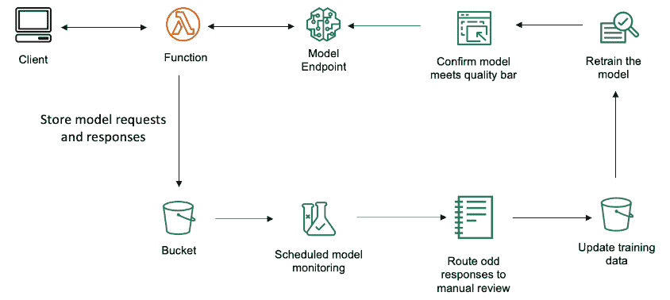
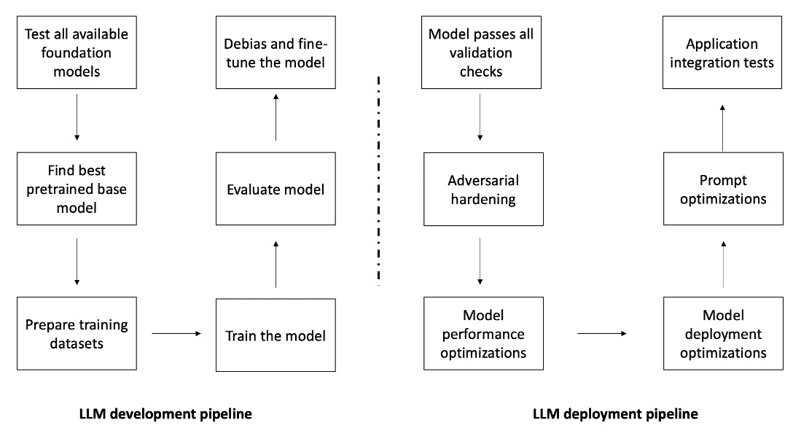
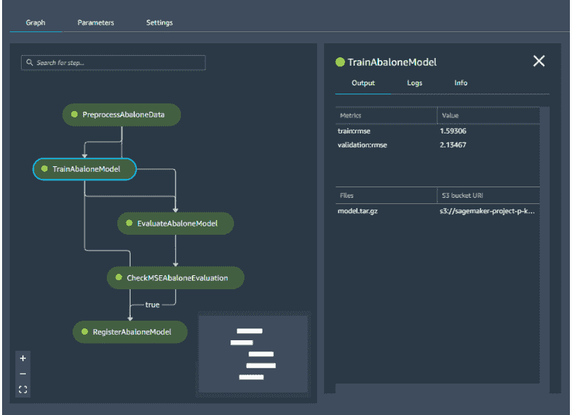

# 14

# MLOps 在视觉和语言中的应用

本章将介绍机器学习操作与协调的核心概念，也称为 MLOps。这包括构建管道、持续集成与部署、环境间的推广等内容。我们将探讨如何监控模型预测并进行人工干预审计。我们还将寻找独特的方式，以支持在 MLOps 管道中使用大型视觉和语言模型。

本章将涵盖以下主题：

+   什么是 MLOps？

+   持续集成与持续部署

+   模型监控与人工干预

+   基础模型的 MLOps

+   AWS 提供的 MLOps 服务

# 什么是 MLOps？

本书中我们已经涵盖了如此庞大的内容，几乎令人难以想象。从预训练的绝对基础开始，我们一步步深入探讨了用例、数据集、模型、GPU 优化、分布式基础、优化、超参数、与 SageMaker 的配合、微调、偏差检测与缓解、托管模型及提示工程等内容。现在，我们将进入将*所有内容* *结合在一起*的艺术与科学。

**MLOps**代表**机器学习操作**。广义来说，它包括一整套技术、人员和流程，供您的组织采纳，以简化机器学习工作流。在前几章中，您学习了如何构建 RESTful API 来托管模型，并且获得了改进提示工程的技巧。在这里，我们将重点讨论*构建部署工作流*，以将该模型集成到您的应用程序中。

就个人而言，我认为 MLOps 中的管道（**pipeline**）部分最为关键。**管道**是一个由多个步骤组成的流程，用于协调机器学习工作流。这可以包括自动重新训练模型、超参数调整、审计与监控、应用测试与集成、推广到更安全的环境、漂移与偏差检测，以及对抗性强化等内容。

图 14.1 – 机器学习操作的管道

管道是您可以使用多种软件工具构建的工具。如果您使用的是 SageMaker 本地工具，并且还没有一个协调栈，您可以从查看**SageMaker 管道**开始。或者，如果您已经在使用某个协调栈，例如 AirFlow、KubeFlow、Ray、MLFlow 或 StepFunctions，您也可以继续使用它们，并简单地调用 SageMaker API 来处理您的机器学习工作流。

流水线的核心组件是*步骤*。一个步骤可能是**数据预处理**、**模型训练**、**模型评估**、**人工审核**、**模型部署**等。一个基本的流水线将通过你定义的多个步骤。流水线通常以**触发器**开始，触发器是某个事件，它将通知系统引入流水线。你的触发器可能是上传到 S3、提交到代码库、某个时间点、数据集更新或客户事件。通常，你会看到一个触发器启动整个流水线，在前一步骤完成后启动每个后续步骤。

让我们继续讨论常见的 MLOps 流水线。

## 常见的 MLOps 流水线

让我们来看几个在机器学习中常见的流水线：

+   **模型部署流水线**：在这里，核心任务是指向你的预训练模型工件，特别是推理脚本和模型本身，并将这些内容放入你选择的任何部署选项中。你可能会使用**SageMaker 实时端点**进行产品推荐，或者使用**异步端点**来托管大型语言模型。你可能通过**多容器端点**使用不同的镜像，甚至通过**多模型端点**使用不同的模型。无论如何，最基本的流水线步骤可能如下所示：

    1.  更新模型工件。

    1.  创建一个新端点。

    1.  测试端点。

    1.  如果测试成功，将生产流量指向该端点。如果测试失败，通知开发团队。

+   **模型再训练流水线**：模型再训练流水线适用于那些需要定期再训练模型的使用场景。每次有新数据时都需要再训练，可能是每隔几小时，或者每个月一次。对于像重新运行报告或笔记本这样的简单场景，你可以使用 SageMaker 的*notebook job*功能（自 2022 年 12 月推出）按计划运行笔记本。然而，如果你希望基于更新的数据触发此再训练，则流水线将非常有用。或者，如果模型或数据集很大并且需要分布式训练，流水线将是一个理想的选择。你的流水线步骤可能如下所示：

    1.  上传新数据。

    1.  运行预处理。

    1.  训练模型。

    1.  调整模型。

    1.  触发部署流水线。

+   **环境推广流水线**：某些客户，特别是那些在安全敏感环境中工作的客户（例如高度监管的行业），要求通过越来越安全的环境来升级应用程序。在这里，*环境*一词指的是一个隔离的计算边界，通常是一个全新的 AWS 账户，或者更简单地说，是一个不同的区域。此流水线的步骤可能如下所示：

    1.  从开发账户中的数据科学家触发流水线。

    1.  将资源提升到测试账户。

    1.  测试端点。

    1.  如果端点通过测试，将其提升到生产账户。如果端点未通过测试，通知数据科学家。

    1.  在生产账户中，创建端点。

    1.  将生产流量设置到端点。

正如你无疑注意到的那样，每个管道都可以相互交互。它们可以作为独立步骤触发彼此，与其他组件交互，并持续添加价值。它们的基本组件也是可互换的 – 你可以轻松替换一些步骤，定义你需要的整体系统。

支撑其中大部分概念的一个概念是**微服务**。你可以把每个管道都视为一个微服务，从某些输入开始并生成输出。为了最大化跨团队的价值，你可以构建和维护每个步骤或整个管道的基本模板，以便未来的团队更容易使用它们。

正如我们在*第十二章*中学到的那样，*如何部署你的模型*，你可以使用很多技术来改进你的模型以进行部署。这包括量化和压缩、偏差检测和对抗性硬化 *(1)*。个人而言，我倾向于看到许多方法在模型上执行得很少，比如当它首次从研发团队移交到部署团队时。对于定期的重新训练，我会避免过度的计算资源，假设模型的大部分基本更新已在更近期的版本中工作。

# 持续集成和持续部署

在机器学习中，我们倾向于看两种略有不同的堆栈。一方面，你有模型创建和部署过程。这包括你的模型工件、数据集、指标和目标部署选项。正如我们之前讨论的那样，你可能创建一个管道来自动化这个过程。另一方面，你有真正的软件应用程序，你想要暴露你的模型。这可能是一个视觉搜索移动应用程序、问答聊天、图像生成服务、价格预测仪表板，或者真正使用数据和自动化决策来改进的任何其他过程。

许多软件堆栈使用他们自己的**持续集成和持续部署**（**CI**/**CD**）管道，无缝连接应用程序的所有部分。这可以包括集成测试、单元测试、安全扫描和机器学习测试。**集成**是指将应用程序组合在一起，而**部署**则是指采取步骤将应用程序投入生产环境。

我们之前看过的许多管道可能被认为是 CD 管道，特别是当它们涉及更新生产中的服务时。持续集成管道可能包括指向应用程序的步骤，测试各种响应，并确保模型作出适当的响应。让我们仔细看看。

图 14.2 – 机器学习的 CI/CD 选项

我在这里想表达的是，*你有许多选项可以设置你的管道*。对于一个大规模的基础模型，比如你自己的预训练大语言模型或文本到视觉模型，你可能会拥有由不同团队为拼图的不同部分开发的极其强大的多个代码库。将这些代码库整合在一起，使用它们的片段相互支持，并通过强大的单元测试尽可能地自动化，以确保整体的最高性能是符合你最佳利益的。与模型开发分开，你可能还会有一个部署管道，能够检查所有必要条件，为模型准备好实时流量并成功地与客户端应用进行通信。

既然我们已经讨论了一些关于一般运营的基础话题，那么让我们仔细看看与机器学习特别相关的两个关键方面——模型监控和人工介入。

# 模型监控和人工介入

在*第十一章*中，我们探讨了关于偏见检测、缓解和监控的大型视觉与语言模型的相关话题。这些内容主要集中在评估模型的背景下。现在，我们已经进入了关于模型部署的部分，重点是运营，我们来更仔细地看看模型监控。

一旦你将模型部署到任何应用中，能够查看该模型随时间变化的表现就变得极其有用。这对于我们之前讨论的任何用例都是如此——聊天、通用搜索、预测、图像生成、推荐、分类、问答等等。所有这些应用都从能够看到你的模型随时间变化的趋势并提供相关警报中受益。

例如，假设你有一个价格预测模型，它根据经济状况为某个特定产品建议价格。你在某些经济条件下训练模型，也许是 1 月的经济条件，并在 2 月部署了该模型。在部署期间，模型继续关注那些相同的条件并帮助定价。然而，你可能没有意识到，3 月时整个市场状况发生了变化。我们的世界变化如此迅速，以至于整个行业可能已经发生了颠覆。你的模型进入世界时认为一切看起来和训练时完全一样。除非你重新校准模型，否则它不会意识到情况已经不同。

但是，您该如何知道何时重新校准模型呢？通过模型监控！使用 Amazon SageMaker，包括我们完全托管的模型监控功能，您可以轻松运行测试，学习训练数据的汇总统计信息。然后，您可以安排作业将这些汇总与传入端点的数据进行比较。这意味着，随着新数据与您的模型互动，您可以将所有这些请求存储在 S3 中。请求存储之后，您可以使用模型监控服务安排作业，将这些推理请求与您的训练数据进行对比。这很有用，因为您可以利用它向自己发送警报，了解模型在推理上的趋势，尤其是在您需要触发重新训练作业时。模型监控的基本概念同样适用于视觉和语言；唯一的问题是如何生成汇总统计信息。

那么，模型监控与人为参与有何关系呢？因为您还可以使用来自托管模型的触发器来*触发人工审核*。如下面的图所示，您可以引入一些软件检查，以确认模型输出的内容是否大致符合您的预期。如果不符合，您可以触发人工审核。这使用了 SageMaker 的另一个选项——**增强型人工智能**（**A2I**），而这个功能又依赖于 SageMaker Ground Truth。换句话说，如果模型没有按预期工作，您可以将预测请求和响应发送给团队进行人工审核。这有助于您的团队对整体解决方案建立更多信任，更不用说提升您的数据集以便为模型的下一次迭代做准备了！让我们直观地看一下这个过程。

图 14.3 – 带有人类参与的模型监控

在前面的图中，您可以看到各种组件或微服务，您可以将它们组合起来，提供一个完整的管道，同时进行模型监控并保持人为参与。首先，您的客户端应用可以与一个 Lambda 函数进行交互，而该函数又会调用一个 SageMaker 模型。您可以通过自己在 Lambda 中编写代码，将模型请求和响应存储在 S3 存储桶中，或者您也可以设置 SageMaker 端点来为您完成此操作。一旦您将记录存储在 S3 中，就可以运行**模型监控**作业。这可以利用 SageMaker 的功能——模型监控，来学习训练数据与推理数据之间的统计差异，并在这些差异超出大范围时向您发送警报。或者，您也可以编写自己的对比脚本，并在 SageMaker 的训练或处理作业中运行这些任务。

一旦你对模型的整体响应情况有了一定的了解，接下来的最佳策略是尽可能地融入人工反馈。在生成领域尤其如此，在这里，内容的准确性、风格和语气是大多数组织的首要标准。一个很好的选择是**SageMaker Ground Truth**！正如我们在*第二章*中学习的数据准备部分所述，这是一个完全托管的服务，你可以用它来增加标注数据集，并实时增强模型响应。

这里的类似方法是使用多个模型来确认预测结果。试想你快速处理了一份文档，并希望准确提取其中的内容。你的客户将 PDF 文件上传到你的网站，你通过机器学习模型解析它，并希望确认或否定某个字段的内容。增加利益相关者对系统准确性的信心的一种方式就是使用不止一个模型。也许你使用的是自己的模型，一个托管在 SageMaker 中的定制深度学习模型，同时，你也可以指向一个完全托管的 AWS 服务，如 Textract，它可以从视觉表单中提取数字化自然语言。然后，你可能还会有一个 Lambda 函数来查看两个模型是否对结果一致。如果一致，那么你可以直接回复客户！如果不一致，则可以将请求路由到人工审核。

监控模型的方法有无数种，其中包括将这些方法与人类结合的方式！不过，现在让我们继续探讨与视觉和语言相关的 MLOps 组件。

# 基础模型的 MLOps

现在，你已经对 MLOps 有了一个清晰的了解，并且掌握了一些关于如何使用“人工在环”和模型监控的思路，接下来让我们从 MLOps 的角度具体探讨视觉和语言模型中哪些方面值得我们关注。

这个问题的答案并不那么显而易见，因为从某个角度来看，视觉和语言只是机器学习和人工智能的略微不同的方面。一旦你配置好了合适的包、图像、数据集、访问权限、治理和安全性，其他部分应该会自然而然地流畅进行。然而，达到这一点的过程却是一场艰难的斗争！

构建一个大型语言模型的管道并非易事。正如我之前提到的，我认为这其中至少涉及两个非常不同的方面。从其中的一方面来看，你需要关注整个模型开发生命周期。正如我们在本书中所学到的，这涉及到大量的开发工作。从数据集、模型和脚本准备到训练和评估循环，再到性能和超参数优化，有无数种技术需要追踪，以便构建你的基础模型。

一旦你拥有了基础模型，为开发做准备就变成了一个不同的问题。正如我们之前讨论的，*对抗性强化*包括了一系列技术，你可以用它们来提升模型在目标领域中的表现。从*第十章*中学到的微调和评估，*第十一章*中的偏差检测与缓解，以及*第十二章*中的部署技术，都可以直接应用到这里。对我来说，将这些内容放在一个专注于部署的不同流程中似乎很自然。让我们通过下图来看看这些内容。

图 14.4 – LLM 开发与部署流程

使这件事变得更加复杂的是，*这些不同的步骤中有许多使用了相似的软件包和函数*。这意味着，要实现每一个步骤，你可能需要指向至少一个，甚至可能是几个 `git` 仓库和软件包。当你将这些步骤解耦，使用不同的容器、资源和步骤来管理每个部分时，这有助于每个团队独立工作。我们都知道，基础模型的开发速度在未来几年只会加快，因此可以预见的是，每一个步骤都会需要你定期暂停，捕捉最新的开源脚本或研究技术，进行开发和测试，并将它们重新集成到更大的流程中。

现在，让我们学习一下视觉领域的 MLOps。

## 视觉领域的 MLOps

视觉基础模型与我们之前为语言模型提出的建议相比如何？在某种程度上，差别不大。你依然是在处理图像、脚本、软件包、数据集和模型质量。你仍然希望保持模型的最新状态，并且尽可能多地融入人类反馈。正如我们在本书中迄今所看到的，模型和评估指标会有所不同，数据集也会大不相同，任务也并非完全相同。然而，许多基本的逻辑仍然是通用的。不过，值得提醒的是——在语言领域的微调与视觉领域的微调是完全不同的。

### 关于视觉领域的过拟合和呼吁常识的警告

请记住，视觉*比语言更容易受到过拟合的影响*。为了理解这一点，我们可以考虑这两种模式之间的根本区别。语言本质上是离散的；我们通过字母和单词来表达整个世界，而这些项本身就是非连续的。你可以说，语言的整个模式等同于世界上所有语言词典的总和，词典本身只是人类不断使用、发展和表达的词语的近似。词语的排列、它们的解释以及在广泛的人类生活经验中的意义是无穷无尽的。

视觉完全不同。该模式本身是连续的；尽管像素本身当然是有起止的，但图像中物体之间的界定几乎是主观的。我们使用指标来量化标记物体之间的质量和差异，比如*交集与并集比*。物体会旋转；在不同的光照和背景下，它们似乎完全变化。即使是完全不同类型的物体，例如动物与杯子、路标与衣物、家具与自然景观，它们的模式可能看起来也非常相似。虽然视觉和语言都在进入模型时被分解成嵌入，但神经网络在捕捉内容的意义并将其推断到其他环境中的能力，似乎在语言和视觉中是非常不同的。语言微调在许多情况下效果很好，而视觉微调通常在初期表现较差。

就个人而言，我觉得另一种机器学习技术非常有趣，它在本质上似乎是这些结合模式的核心——常识推理。机器常识指的是确保概念、物体以及这些物体的定义特征之间的逻辑一致性。大多数人擅长这一点，比如知道水是湿的，重物被丢到空中会下落，火会产生热量，等等。

然而，计算机在这方面做得非常糟糕。它们似乎根本无法理解物理维度的存在；当然，生物学层面对它们来说完全是个异常。图像生成器不了解食物必须进入嘴巴才能算作进食。图像分类器常常把斑马与家具混淆。语言模型不理解人类沟通的节奏，偶尔让使用者感到不堪重负。电影生成器经常让人反感多于愉悦，因为它们无法识别婴儿首先掌握的基本辨别能力——人类及其动作。对于人类来说，杯子和动物都是物体，可能偶尔还会有一些相似的风格特征，但在物理世界里，它们分别来自完全不同的领域。对计算机而言，似乎这个物理维度根本不存在。它们实际上只是在学习你提供的二维图像中存在的内容。这就是我们一开始使用标签的原因——通过将物理世界转化为像素，赋予模型一定的意义。

我有幸在去年与叶津·崔*(2)*见面并进行了简短的交流。她在世界顶尖的自然语言处理会议之一——计算语言学协会年会上发表了主题演讲，讲述了一个引人入胜的假设性预测，关于未来 60 年自然语言研究的走向。我被她对人文学科、哲学以及深层科学发现的热情深深打动。她在一个极少有人关注机器常识的时代开始了这方面的探索，事实上，她今天开玩笑说，当时她还遭到积极反对，因为大家都认为在这个话题上发表文章几乎是不可能的。从那时起，她已经成为这个领域可能最顶尖的专家，主要通过语言和视觉作为她的研究方式。从那时起，我对常识产生了浓厚的兴趣，想要更详细地探讨它。

我在想，人类的知识本身是否具有内在的关系性，甚至可能是多模态的。我们在大脑中构建概念，是基于经历——无论是亲身体验、感知、想象还是理解。这些心理概念引导着我们的言语和行动，有时通过语言表达，有时则完全通过身体语言表达。或许我们需要更深层的表示来引导模态的交融。或许语言能帮助我们的视觉模型更快适应新领域。也许这是因为它提供了一些常识。

实际上，我之所以提到这一点，是因为如果你准备开始进行视觉微调工作，我希望你提前知道，这不会是件容易的事，而且在语言领域对你有效的东西，可能并不会像你想的那样顺利迁移到视觉领域。我还想提到这一点，是因为我希望你们这些未来的研究人员要有勇气，相信直觉，挑战自己的假设。现在我们已经了解了基础模型的 MLOps，让我们来看一看 AWS 提供的一些服务，帮助简化流程并加速你掌握这一主题！

# AWS 提供的 MLOps 服务

幸运的是，AWS 提供了各种工具来简化这一过程！其中一个很棒的功能叫做**血缘追踪**。SageMaker 可以自动为关键工件创建血缘*(3)*，甚至跨账户创建血缘。这包括数据集工件、镜像、算法规格、数据配置、训练作业组件、端点和检查点。这与**实验 SDK** 集成，允许你以编程方式在大规模上比较实验和结果。让我们通过可视化来看一下。我们甚至会为你生成一个可视化图，展示所有这些是如何关联的！请查看下图。

图 14.5 – SageMaker 自动创建血缘追踪

如你所见，追踪血缘的第一步是运行 SageMaker 中的关键资源，如训练作业、镜像和处理作业。你可以使用自动追踪的实体，也可以定义自己的实体。为了生成如前图所示的血缘视图，你可以使用**血缘查询语言**。如果你想直接进入带有可视化解决方案的笔记本，可以查看*参考资料*部分中的点（4）。血缘追踪的详细说明见此处 – *(5)*，查询语言的定义见此处 – *(6)*。通过 SageMaker 血缘追踪，你可以轻松追踪一个模型是如何训练的以及它被部署到哪里。

它是如何工作的？你可以使用*LineageFilter API*来查找与模型工件相关的不同对象，如端点。你还可以搜索与端点相关的试验组件，查找与模型相关的数据集，并在关联项的图谱中前后穿梭。拥有这些关系的程序化访问，使得将所有必要资源放入管道和其他治理结构中变得更加容易。

一旦你识别了资源，如何将它们封装成一个管道？正如我们在本章之前提到的，许多基础的 AWS 和 SageMaker 资源都可以作为独立的构建模块使用。这些资源包括模型、相关的模型工件、部署配置、关联的训练和处理作业、超参数调优和容器。这意味着你可以使用 AWS SDK for Python，**boto3**和**SageMaker Python SDK**来编程地指向并执行所有资源和任务。将这些资源封装到一个管道中意味着使用你偏好的工具堆栈来自动化操作它们。实现这一点的一种方式是**SageMaker Pipelines**！

## SageMaker Pipelines 简介

如果你正在使用 SageMaker 原生资源，例如作业、端点、模型工件和 Docker 镜像，那么通过 Pipelines SDK 构造*(7)*将它们连接起来应该不会增加太多额外的负担。SageMaker Pipelines 是一个托管功能，你可以使用它来创建、运行和管理 AWS 上的完整机器学习工作流。一旦你为 SageMaker 定义了基础的 Python SDK 对象，如训练作业、评估指标、超参数调优和端点，你就可以将这些对象传递给 Pipelines API 并将其创建为一个图！接下来让我们在下面的图中更详细地探讨这一点。

图 14.6 – SageMaker Pipelines

如果你想要查看一个类似于前面图中所示的图形的笔记本示例，可以访问 GitHub 上的资源*(8)*。核心思路是，你将管道的每个部分单独构建，比如数据处理、训练和评估步骤，然后将这些部分传递给 SageMaker Pipelines API，创建一个连接的图。

如你在上面的图中看到的，这在 SageMaker Studio 中以可视化方式呈现！这使得数据科学家更容易开发、审查、管理和执行这些管道。Studio 还提供了许多其他与 MLOps 相关的功能，例如特征存储、模型注册、端点管理、模型监控和推理推荐器。如果你想更深入了解这些话题，可以查阅 AWS Well-Architected Framework 关于机器学习的完整白皮书*(9)*。

现在我们已经了解了 AWS 的 MLOps 产品，让我们通过一个完整的回顾来结束本章内容。

# 总结

在本章中，我们介绍了 MLOps 的核心概念，尤其是在视觉和语言的背景下。我们讨论了机器学习操作，包括使其运行的一些技术、人员和流程。我们特别关注了流水线方面，学习了构建它们的有用技术，如 SageMaker Pipelines、Apache Airflow 和 Step Functions。我们研究了与机器学习相关的几种不同类型的流水线，如模型部署、模型再训练和环境推广。我们讨论了核心操作概念，如 CI 和 CD。我们了解了模型监控和人机协同设计模式。我们学习了 MLOps 中一些适用于视觉和语言的特定技术，如大型语言模型的常见开发和部署流水线。我们还探讨了语言中可能有效的核心方法，如何由于模态之间的根本差异以及当前学习系统的运作方式，在视觉中固有地不太可靠。我们通过讨论常识推理，快速走了一遍哲学路线，然后通过介绍 AWS 的 MLOps 关键产品，如 SageMaker Lineage、Experiments 和 Pipelines，结束了本章内容。

现在，让我们通过最后一章讨论未来趋势来结束本书。

# 参考文献

请阅读以下内容，以获取本章中涵盖的几个主题的更多信息：

1.  *通过对抗模型* *级联强化深度神经网络*：[`arxiv.org/pdf/1802.01448.pdf`](https://arxiv.org/pdf/1802.01448.pdf)

1.  *Yejin* *Choi*：[`homes.cs.washington.edu/~yejin/`](https://homes.cs.washington.edu/~yejin/)

1.  *Amazon SageMaker ML 谱系* *追踪*：[`docs.aws.amazon.com/sagemaker/latest/dg/lineage-tracking.html`](https://docs.aws.amazon.com/sagemaker/latest/dg/lineage-tracking.html)

1.  *aws/amazon-sagemaker-examples*：[`github.com/aws/amazon-sagemaker-examples/blob/main/sagemaker-lineage/sagemaker-lineage.ipynb`](https://github.com/aws/amazon-sagemaker-examples/blob/main/sagemaker-lineage/sagemaker-lineage.ipynb)

1.  *谱系追踪* *实体*：[`docs.aws.amazon.com/sagemaker/latest/dg/lineage-tracking-entities.html`](https://docs.aws.amazon.com/sagemaker/latest/dg/lineage-tracking-entities.html)

1.  *查询谱系* *实体*：[`docs.aws.amazon.com/sagemaker/latest/dg/querying-lineage-entities.html`](https://docs.aws.amazon.com/sagemaker/latest/dg/querying-lineage-entities.html)

1.  *SageMaker* *流水线*：[`sagemaker.readthedocs.io/en/stable/workflows/pipelines/index.html`](https://sagemaker.readthedocs.io/en/stable/workflows/pipelines/index.html)

1.  *aws/amazon-sagemaker-examples*：[`github.com/aws/amazon-sagemaker-examples/blob/main/sagemaker-pipelines/tabular/train-register-deploy-pipeline-model/train%20register%20and%20deploy%20a%20pipeline%20model.ipynb`](https://github.com/aws/amazon-sagemaker-examples/blob/main/sagemaker-pipelines/tabular/train-register-deploy-pipeline-model/train%20register%20and%20deploy%20a%20pipeline%20model.ipynb)

1.  *机器学习镜头 AWS Well-Architected* *框架*：[`docs.aws.amazon.com/pdfs/wellarchitected/latest/machine-learning-lens/wellarchitected-machine-learning-lens.pdf`](https://docs.aws.amazon.com/pdfs/wellarchitected/latest/machine-learning-lens/wellarchitected-machine-learning-lens.pdf)
