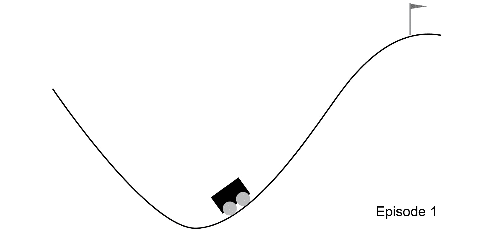
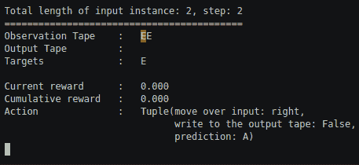
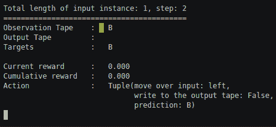
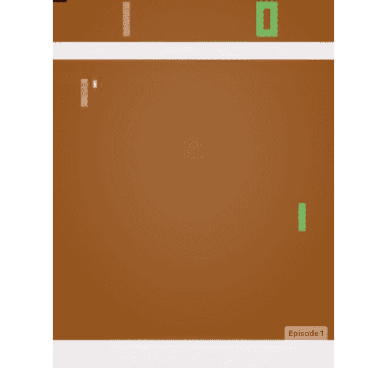
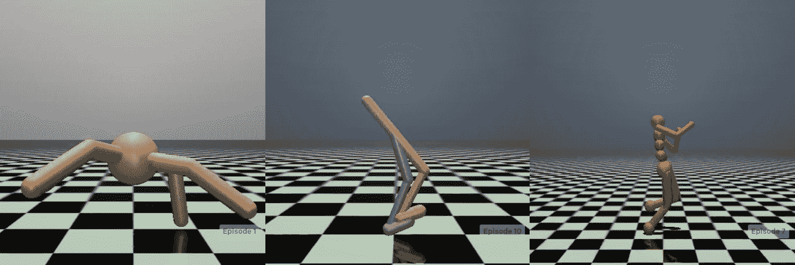
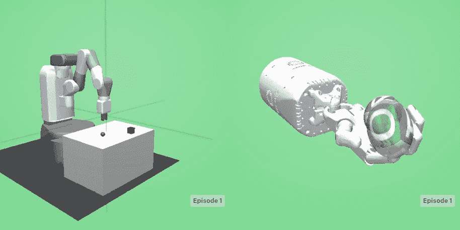
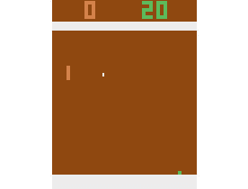

# 4\. 使用 OpenAI 和 TensorFlow 进行强化学习入门

概述

本章将介绍一些关键技术和概念，帮助你入门强化学习。你将熟悉并使用两个 OpenAI 工具：Gym 和 Universe。你将学习如何处理这些环境的接口，以及如何为特定问题创建自定义环境。你将构建一个策略网络，使用 TensorFlow，将环境状态输入其中以获取相应的动作，并保存策略网络的权重。你还将学习如何使用另一个 OpenAI 资源——Baselines，并用它来训练强化学习智能体解决经典的控制问题。在本章结束时，你将能够使用我们介绍的所有元素，构建并训练一个智能体，玩经典的 Atari 视频游戏，从而实现超越人类的表现。

# 介绍

在上一章中，你已经了解了 TensorFlow 和 Keras，以及它们的关键特性和应用，并了解了它们如何协同工作。你学习了如何使用 TensorFlow 实现深度神经网络，涵盖了所有主要主题，即模型创建、训练、验证和测试，使用的是最先进的机器学习框架。在本章中，我们将利用这些知识构建能够解决一些经典强化学习问题的模型。

强化学习是机器学习的一个分支，它最接近人工智能的理念。训练一个人工系统来学习某个任务，既没有任何先验信息，也只是通过与环境的互动经验来完成，这一目标代表了复制人类学习的雄心壮志。将深度学习技术应用于该领域，最近大大提高了性能，使我们能够解决各个领域的问题，从经典的控制问题到视频游戏，甚至是机器人运动控制。本章将介绍你可以使用的各种资源、方法和工具，帮助你熟悉在该领域起步时通常遇到的背景和问题。特别是，我们将关注**OpenAI Gym**和**OpenAI Universe**，这两个库允许我们轻松创建环境，以便训练强化学习（RL）智能体，以及 OpenAI Baselines，一个为最先进的强化学习算法提供清晰简单接口的工具。在本章结束时，你将能够利用顶尖的库和模块，轻松训练一个最先进的强化学习智能体，解决经典的控制问题，并在经典的视频游戏中实现超越人类的表现。

现在，让我们开始我们的旅程，从第一个重要的概念开始：如何正确地建模一个适合强化学习的环境，以便我们可以训练一个智能体。为此，我们将使用 OpenAI Gym 和 Universe。

# OpenAI Gym

在本节中，我们将学习 OpenAI Gym 工具。我们将探讨它创建的动机及其主要元素，学习如何与它们互动，以正确训练强化学习算法，解决最前沿的基准问题。最后，我们将构建一个具有相同标准化接口的自定义环境。

共享标准基准对于衡量机器学习算法的性能和最新进展至关重要。虽然在监督学习领域，自学以来已有许多不同的示例，但在强化学习领域却并非如此。

为了满足这一需求，OpenAI 于 2016 年发布了 OpenAI Gym（[`gym.openai.com/`](https://gym.openai.com/)）。它的构思是让它成为强化学习领域的标准，就像 ImageNet 和 COCO 数据集之于监督学习一样：一个标准的共享环境，强化学习方法的性能可以在其中直接衡量和比较，以识别出最优方法并监控当前的进展。

OpenAI Gym 作为强化学习问题的典型马尔科夫决策过程（MDP）模型和多种环境之间的接口，涵盖了智能体必须解决的不同类型问题（从经典控制到 Atari 视频游戏），以及不同的观察和动作空间。Gym 完全独立于与之接口的智能体结构以及用于构建和运行智能体的机器学习框架。

这是 Gym 提供的环境类别列表，涵盖从简单到困难的任务，涉及多种不同的数据类型：

+   **经典控制与玩具文本**：小规模、简单的任务，常见于强化学习文献中。这些环境是开始熟悉 Gym 并与智能体训练建立信心的最佳场所。

    下图展示了经典控制问题的一个示例——CartPole：

    

图 4.1：经典控制问题 - CartPole

下图展示了经典控制问题的一个示例——MountainCar：



图 4.2：经典控制问题 - 山地车

+   **算法**：在这些环境中，系统必须从示例中自学，独立地执行计算任务，从多位数加法到字母数字字符序列反转等。

    下图展示了代表算法问题集实例的截图：

    

图 4.3：算法问题 - 复制输入序列的多个实例

下图展示了代表算法问题集实例的截图：



图 4.4：算法问题——复制输入序列的实例

+   **雅达利**：Gym 集成了 **Arcade Learning Environment**（**ALE**），这是一个软件库，提供了一个接口，可以用来训练代理玩经典的雅达利视频游戏。它在强化学习研究中起到了重要作用，帮助实现了杰出的成果。

    以下图展示了由 ALE 提供的雅达利视频游戏 Breakout：

    

图 4.5：雅达利视频游戏 Breakout

以下图展示了由 ALE 提供的雅达利视频游戏 Pong：



图 4.6：雅达利视频游戏 Pong

注意

前述图像来自 OpenAI Gym 的官方文档。请参阅以下链接以获取更多雅达利游戏的视觉示例：[`gym.openai.com/envs/#atari`](https://gym.openai.com/envs/#atari)。

+   **MuJoCo 和机器人技术**：这些环境展示了在机器人控制领域中常见的挑战。其中一些环境利用了 MuJoCo 物理引擎，MuJoCo 专为快速准确的机器人仿真而设计，并提供免费的试用许可证。

    以下图展示了三个 MuJoCo 环境，它们提供了机器人运动任务的有意义概述：

    

图 4.7：三个 MuJoCo 驱动的环境——Ant（左），Walker（中），Humanoid（右）

注意

前述图像来自 OpenAI Gym 的官方文档。请参阅以下链接以获取更多 MuJoCo 环境的视觉示例：[`gym.openai.com/envs/#mujoco`](https://gym.openai.com/envs/#mujoco)。

+   以下图展示了“机器人技术”类别中的两个环境，在这些环境中，强化学习代理被训练执行机器人操作任务：



图 4.8：两个机器人环境——FetchPickAndPlace（左）和 HandManipulateEgg（右）

注意

前述图像来自 OpenAI Gym 的官方文档。请参阅以下链接以获取更多机器人环境的视觉示例：[`gym.openai.com/envs/#robotics`](https://gym.openai.com/envs/#robotics)。

+   **第三方环境**：第三方开发的环境也可以使用，涵盖了非常广泛的应用场景、复杂度和数据类型（[`github.com/openai/gym/blob/master/docs/environments.md#third-party-environments`](https://github.com/openai/gym/blob/master/docs/environments.md#third-party-environments)）。

## 如何与 Gym 环境互动

为了与 Gym 环境交互，首先必须创建和初始化环境。Gym 模块使用`make`方法，并将环境的 ID 作为参数，来创建并返回其新实例。要列出给定 Gym 安装中所有可用的环境，只需运行以下代码：

```py
from gym import envs
print(envs.registry.all())
```

这将输出以下内容：

```py
[EnvSpec(DoubleDunk-v0), EnvSpec(InvertedDoublePendulum-v0), 
EnvSpec(BeamRider-v0), EnvSpec(Phoenix-ram-v0), EnvSpec(Asterix-v0), 
EnvSpec(TimePilot-v0), EnvSpec(Alien-v0), EnvSpec(Robotank-ram-v0), 
EnvSpec(CartPole-v0), EnvSpec(Berzerk-v0), EnvSpec(Berzerk-ram-v0), 
EnvSpec(Gopher-ram-v0), ...
```

这是一个所谓的`EnvSpec`对象的列表。它们定义了特定的环境相关参数，比如要实现的目标、定义任务何时完成的奖励阈值，以及单个回合允许的最大步数。

一个有趣的地方是，可以轻松添加自定义环境，正如我们稍后将看到的那样。得益于这一点，用户可以使用标准接口实现自定义问题，从而使标准化的现成强化学习算法可以轻松处理这些问题。

环境的基本元素如下：

+   **观察** (object)：一个特定于环境的对象，表示可以观察到的环境内容；例如，机械系统的运动学变量（即速度和位置）、棋盘游戏中的棋子位置，或视频游戏中的像素帧。

+   **动作** (object)：一个特定于环境的对象，表示智能体可以在环境中执行的动作；例如，机器人的关节旋转和/或关节扭矩、棋盘游戏中的合法移动，或视频游戏中按下的多个按钮组合。

+   **奖励** (float)：通过执行指定动作完成最后一步所获得的奖励量。不同任务的奖励范围不同，但为了完成环境任务，目标始终是增加奖励，因为这是强化学习智能体试图最大化的内容。

+   **完成** (bool)：这表示回合是否已结束。如果为 true，环境需要重置。大多数（但不是所有）任务被划分为明确的回合，其中一个终止回合可能表示机器人已摔倒、棋盘游戏已达到最终状态，或智能体在视频游戏中失去了最后一条生命。

+   **信息** (dict)：这包含了环境内部的诊断信息，对于调试和强化学习（RL）智能体训练都很有用，即使在标准基准测试比较中不允许使用。

环境的基本方法如下：

+   `reset()`：输入：无，输出：观察。重置环境，将其带回起始点。该方法没有输入并输出相应的观察。它必须在环境创建后立即调用，并且每当达到最终状态时（`done`标志为`True`）都要调用。

+   `step(action)`：输入：动作，输出：观察 – 奖励 – 结束 – 信息。通过应用选定的输入动作，推进环境一步。返回新状态的观察结果，该状态是从先前状态到新状态的过渡所获得的奖励。`done`标志用于指示新状态是否是终止状态（分别为`True/False`），以及包含环境内部信息的`Info`字典。

+   `render()`：输入：无，输出：环境渲染。渲染环境，仅用于可视化/展示目的。在代理训练过程中不使用该功能，代理只需要观察来了解环境的状态。例如，它通过动画图形展示机器人运动，或输出视频游戏视频流。

+   `close()`：输入：无，输出：无。优雅地关闭环境。

这些元素使我们能够通过执行随机输入、训练代理并运行它，简单地与环境进行完全交互。事实上，这是标准强化学习情境化的实现，描述了代理与环境的交互。在每个时间步，代理执行一个动作。与环境的这种交互会导致从当前状态到新状态的过渡，产生对新状态的观察和奖励，并将这些作为结果返回。作为初步步骤，以下练习展示了如何创建一个 CartPole 环境，重置它，在每个步骤随机采样一个动作后运行 1,000 步，最后关闭它。

## 练习 4.01：与 Gym 环境交互

在本练习中，我们将通过查看经典控制示例 CartPole 来熟悉 Gym 环境。按照以下步骤完成此练习：

1.  导入 OpenAI Gym 模块：

    ```py
    import gym
    ```

1.  实例化环境并重置它：

    ```py
    env = gym.make('CartPole-v0')
    env.reset()
    ```

    输出将如下所示：

    ```py
    array([ 0.03972635,  0.00449595,  0.04198141, -0.01267544])
    ```

1.  运行环境`1000`步，在遇到终止状态时渲染并重置。如果所有步骤完成，关闭环境：

    ```py
    for _ in range(1000):
        env.render()
        # take a random action
        _, _, done, _ = env.step(env.action_space.sample())
        if done:
            env.reset()
    env.close()
    ```

    它渲染环境并播放 1,000 步。下图展示了从整个序列的第 12 步中提取的一帧：


图 4.9：CartPole 环境中 1,000 步渲染的其中一帧

注意

要访问本节的源代码，请参考[`packt.live/30yFmOi`](https://packt.live/30yFmOi)。

本节目前没有在线交互示例，需要在本地运行。

这表明黑色小车可以沿着轨道（水平线）移动，杆子通过铰链固定在小车上，允许它自由旋转。目标是控制小车，左右推动它，以保持杆子的垂直平衡，如前图所示。

## 动作空间和观察空间

为了与环境适当地交互并在其上训练智能体，一个基本的初步步骤是熟悉其动作空间和观察空间。例如，在前面的练习中，动作是从环境的动作空间中随机采样的。

每个环境都由 `action_space` 和 `observation_space` 特征定义，它们是 `Space` 类的实例，描述了 Gym 所要求的动作和观察。以下代码片段打印了 `CartPole` 环境的相关信息：

```py
import gym
env = gym.make('CartPole-v0')
print("Action space =", env.action_space)
print("Observation space =", env.observation_space)
```

输出如下两行：

```py
Action space = Discrete(2)
Observation space = Box(4,)
```

`Discrete` 空间表示非负整数集合（自然数加上 0）。它的维度定义了哪些数字代表有效的动作。例如，在 `CartPole` 案例中，它的维度是 `2`，因为智能体只能将小车向左或向右推，因此可接受的值为 0 或 1。`Box` 空间可以看作是一个 n 维数组。在 `CartPole` 案例中，系统状态由四个变量定义：小车位置和速度，以及杆子相对于竖直方向的角度和角速度。因此，“盒子观察”空间的维度为 4，有效的观察将是一个包含四个实数的数组。在后面的情况下，检查其上下限是很有用的。可以通过以下方式进行：

```py
print("Observations superior limit =", env.observation_space.high)
print("Observations inferior limit =", env.observation_space.low)
```

它会打印出如下内容：

```py
Observations superior limit = array([ 2.4, inf, 0.20943951, inf])
Observations inferior limit = array([-2.4, -inf,-0.20943951, -inf])
```

有了这些新元素，就可以编写一个更完整的代码片段来与环境交互，利用所有之前介绍的接口。以下代码展示了一个完整的循环，执行 `20` 轮，每轮 `100` 步，渲染环境，获取观察结果，并在执行随机动作时打印它们，一旦到达终止状态则重置：

```py
import gym
env = gym.make('CartPole-v0')
for i_episode in range(20):
    observation = env.reset()
    for t in range(100):
        env.render()
        print(observation)
        action = env.action_space.sample()
        observation, reward, done, info = env.step(action)
        if done:
            print("Episode finished after {} timesteps".format(t+1))
            break
env.close()
```

前面的代码运行了 `20` 轮，每轮 `100` 步，同时呈现环境，正如我们在 *练习 4.01*，*与 Gym 环境交互* 中所见。

注意

在前面的案例中，我们将每轮运行 100 步，而不是之前的 1,000 步。这样做没有特别的原因，只是因为我们运行了 20 个不同的轮次，而不是一个，所以我们选择 100 步以保持代码执行时间足够短。

除此之外，这段代码还会打印出每一步操作后环境返回的观察序列。以下是一些作为输出的行：

```py
[-0.061586   -0.75893141  0.05793238  1.15547541]
[-0.07676463 -0.95475889  0.08104189  1.46574644]
[-0.0958598  -1.15077434  0.11035682  1.78260485]
[-0.11887529 -0.95705275  0.14600892  1.5261692 ]
[-0.13801635 -0.7639636   0.1765323   1.28239155]
[-0.15329562 -0.57147373  0.20218013  1.04977545]
Episode finished after 14 timesteps
[-0.02786724  0.00361763 -0.03938967 -0.01611184]
[-0.02779488 -0.19091794 -0.03971191  0.26388759]
[-0.03161324  0.00474768 -0.03443415 -0.04105167]
```

从之前的代码示例来看，我们可以看到目前的动作选择是完全随机的。正是在这一点上，经过训练的智能体会有所不同：它应该根据环境观察选择动作，从而恰当地响应它所处的状态。因此，通过用经过训练的智能体替换随机动作选择来修改之前的代码，如下所示：

1.  导入 OpenAI Gym 和 CartPole 模块：

    ```py
    import gym
    env = gym.make('CartPole-v0')
    ```

1.  运行 `20` 轮，每轮 `100` 步：

    ```py
    for i_episode in range(20):
        observation = env.reset()
        for t in range(100):
    ```

1.  渲染环境并打印观察结果：

    ```py
            env.render()
            print(observation)
    ```

1.  使用智能体的知识来选择行动，前提是给定当前环境状态：

    ```py
            action = RL_agent.select_action(observation)
    ```

1.  步进环境：

    ```py
            observation, reward, done, info = env.step(action)
    ```

1.  如果成功，则跳出内部循环并开始一个新的回合：

    ```py
            if done:
                print("Episode finished after {} timesteps"\
                      .format(t+1))
                break
    env.close()
    ```

在训练好的智能体下，行动将被最优选择，因为会利用当前智能体所处状态的函数来最大化期望的奖励。此代码将产生类似于之前的输出。

那么，我们该如何从零开始训练一个智能体呢？正如你在本书中将学到的那样，存在许多不同的方法和算法可以用来实现这个相当复杂的任务。通常，它们都需要以下元素的元组：当前状态、选择的动作、执行选择动作后获得的奖励，以及执行选择动作后到达的新状态。

因此，基于前面的代码片段再次展开，加入智能体训练步骤，代码如下所示：

```py
import gym
env = gym.make('CartPole-v0')
for i_episode in range(20):
    observation = env.reset()
    for t in range(100):
        env.render()
        print(observation)
        action = RL_agent.select_action(observation)
        new_observation, reward, done, info = env.step(action)
        RL_agent.train(observation, action, reward, \
                       new_observation)
        observation = new_observation
        if done:
            print("Episode finished after {} timesteps"\
                  .format(t+1))
            break
env.close()
```

与前一个代码块的唯一区别在于以下这一行：

```py
        RL_agent.train(observation, action, reward, new_observation)
```

这指的是智能体训练步骤。此代码的目的是让我们对训练一个 RL 智能体在给定环境中所涉及的所有步骤有一个高层次的了解。

这是采用的方法背后的高层次思路，用于在 Gym 环境中进行强化学习智能体的训练。它通过一个非常简洁的标准接口提供访问所有所需的细节，从而使我们能够访问一个极其庞大的不同问题集，利用这些问题来衡量算法和技术的效果。

## 如何实现一个自定义的 Gym 环境

Gym 提供的所有环境都非常适合用于学习，但最终你需要训练一个智能体来解决一个自定义问题。一种实现这一目标的好方法是创建一个专门针对问题领域的自定义环境。

为了做到这一点，必须创建一个派生自`gym.Env`的类。它将实现前一节中描述的所有对象和方法，以支持典型的强化学习环境中，智能体与环境之间的交互周期。

以下代码片段展示了一个框架，指导自定义环境的开发：

```py
import gym
from gym import spaces
class CustomEnv(gym.Env):
    """Custom Environment that follows gym interface"""
    metadata = {'render.modes': ['human']}
    def __init__(self, arg1, arg2, ...):
      super(CustomEnv, self).__init__()
      # Define action and observation space
      # They must be gym.spaces objects
      # Example when using discrete actions:
      self.action_space = spaces.Discrete(N_DISCRETE_ACTIONS)
      # Example for using image as input:
      self.observation_space = spaces.Box\
                               (low=0, high=255, \
                                shape=(HEIGHT, WIDTH, \
                                       N_CHANNELS), \
                                dtype=np.uint8)
    def step(self, action):
      # Execute one time step within the environment
      ...
      # Compute reward
      ...
      # Check if in final state
      ...
      return observation, reward, done, info
    def reset(self):
      # Reset the state of the environment to an initial state
      ...
      return observation
    def render(self, mode='human', close=False):
      # Render the environment to the screen
      ...
      return
```

在构造函数中，定义了`action_space`和`observation_space`。如前所述，它们将包含智能体在环境中可以执行的所有可能动作，以及智能体能够观察到的所有环境数据。它们将归属于特定问题：特别地，`action_space`将反映智能体可以控制的与环境互动的元素，而`observation_space`将包含我们希望智能体在选择行动时考虑的所有变量。

`reset`方法将被调用以定期将环境重置为初始状态，通常在第一次初始化后以及每次回合结束后。它将返回观测值。

`step` 方法接收一个动作作为输入并执行它。这将导致环境从当前状态过渡到新状态，并返回与新状态相关的观察结果。这也是奖励计算的方法，奖励是由动作产生的状态转换的结果。新状态会被检查是否为终止状态，如果是，返回的 `done` 标志会被设置为 `true`。最后，所有有用的内部信息会以 `info` 字典的形式返回。

最后，`render` 方法负责渲染环境。其复杂性可能从简单的打印语句到使用 OpenGL 渲染 3D 环境的复杂操作不等。

在本节中，我们研究了 OpenAI Gym 工具。我们概述了它的背景和构思动机，详细介绍了其主要元素，并展示了如何与这些元素交互，从而正确地训练一个强化学习算法来解决最前沿的基准问题。最后，我们展示了如何构建一个具有相同标准化接口的自定义环境。

# OpenAI Universe – 复杂环境

OpenAI Universe 是 OpenAI 在 Gym 发布几个月后推出的。它是一个软件平台，用于在不同应用程序上衡量和训练通用人工智能，应用领域涵盖从视频游戏到网站的各种内容。它使得 AI 代理能够像人类一样使用计算机：环境状态通过屏幕像素表示，动作是所有可以通过操作虚拟键盘和鼠标执行的操作。

使用 Universe，可以将任何程序适配成 Gym 环境，从而将程序转化为 Gym 环境。它使用 **虚拟网络计算**（**VNC**）技术执行程序，这是一种允许通过网络共享图形桌面来远程控制计算机系统的软件技术，传输键盘和鼠标事件并接收屏幕帧。通过模拟远程桌面背后的执行，它不需要访问程序内存状态、定制源代码或特定的 API。

以下代码片段展示了如何在一个简单的 Python 程序中使用 Universe，其中一个脚本化的动作会在每一步中执行：

1.  导入 OpenAI Gym 和 OpenAI Universe 模块：

    ```py
    import gym
    # register Universe environments into Gym
    import universe
    ```

1.  实例化 OpenAI Universe 环境并重置它：

    ```py
    # Universe env ID here
    env = gym.make('flashgames.DuskDrive-v0')
    observation_n = env.reset()
    ```

1.  执行预定的动作与环境进行交互并渲染环境：

    ```py
    while True:
        # agent which presses the Up arrow 60 times per second
        action_n = [[('KeyEvent', 'ArrowUp', True)] \
                    for _ in observation_n]
        observation_n, reward_n, done_n, info = env.step(action_n)
        env.render()
    ```

上述代码成功地在浏览器中运行了一个 Flash 游戏。

Universe 的目标是促进 AI 代理的发展，使其能够将过去的经验应用到掌握复杂的新环境中，这将是实现人工通用智能的一个关键步骤。

尽管近年来人工智能取得了巨大成功，但所有开发的系统仍然可以被认为是“狭义人工智能”。这是因为它们只能在有限的领域内实现超过人类的表现。构建一个具有通用问题解决能力、与人类常识相当的系统，需要克服将代理经验带到全新任务中的目标。这将使代理避免从零开始训练，随机进行数千万次试验。

现在，让我们看看 OpenAI Universe 的基础设施。

## OpenAI Universe 基础设施

以下图示有效描述了 OpenAI Universe 的工作原理：它通过一个通用接口公开所有环境，这些环境将在后文详细描述：通过利用 VNC 技术，它使环境充当服务器，代理充当客户端，后者通过观察屏幕的像素（环境的观察）并产生键盘和鼠标命令（代理的行动）来操作远程桌面。VNC 是一项成熟的技术，是通过网络与计算机进行远程交互的标准技术，例如云计算系统或去中心化基础设施中的情况：


图 4.10：VNC 服务器-客户端 Universe 基础设施

Universe 的实现具有以下一些显著特点：

+   **通用性**：通过采用 VNC 接口，它无需模拟器或访问程序的源代码或内存状态，从而在计算机游戏、网页浏览、CAD 软件使用等领域开辟了大量机会。

+   **对人类的熟悉性**：人类可以轻松地使用它为 AI 算法提供基准，这对于通过记录 VNC 流量的方式初始化代理并提供人类演示非常有用。例如，人类可以通过 VNC 使用 OpenAI Universe 提供的任务之一并记录相应的流量。然后，它可以用来训练代理，提供良好的策略学习范例。

+   **标准化**：利用 VNC 技术确保了在所有主要操作系统中都具有可移植性，这些操作系统默认安装有 VNC 软件。

+   **调试的简便性**：通过简单地将客户端连接到环境的 VNC 共享服务器进行可视化，可以轻松地在训练或评估过程中观察代理的状态。节省 VNC 流量也很有帮助。

## 环境

本节中，我们将探讨 Universe 中已经提供的最重要的几类问题。每个环境由一个 Docker 镜像组成，并托管一个 VNC 服务器。该服务器作为接口，负责以下任务：

+   发送观察信息（屏幕像素）

+   接收操作（键盘/鼠标命令）

+   通过 Web Socket 服务器为强化学习任务提供信息（奖励信号、诊断元素等）

现在，让我们来看看不同类别的环境。

### Atari 游戏

这些是 ALE 中的经典 Atari 2600 游戏。在 OpenAI Gym 中已经遇到过，它们也是 Universe 的一部分。

### Flash 游戏

Flash 游戏的景观提供了大量相较于 Atari 更先进图形的游戏，但仍然具备简单的机制和目标。Universe 的初始版本包含了 1,000 个 Flash 游戏，其中 100 个还提供了作为功能的奖励。

在 Universe 方法中，有一个重要的方面需要解决：代理如何知道自己表现得如何，这与与环境交互后返回的奖励相关。如果你无法访问应用程序的内部状态（即其 RAM 地址），那么唯一的方法就是从屏幕上的像素中提取这些信息。许多游戏都有与之关联的分数，这些分数会在每一帧中打印出来，可以通过某些图像处理算法解析。例如，Atari Pong 在画面的顶部显示两位玩家的分数，因此可以解析这些像素来获取分数。Universe 开发了一个基于卷积神经网络的高性能图像到文本模型，该模型嵌入到 Python 控制器中，并在 Docker 容器内运行。在可以应用的环境中，它从帧缓存中提取用户的分数，并通过 Web Socket 提供这些信息，从帧缓存中获取并通过 Web Socket 提供分数信息。

### 浏览器任务

Universe 基于使用网页浏览器的方式，增加了一组独特的任务。这些环境将 AI 代理放置在常见的网页浏览器前，呈现需要使用网络的问题：阅读内容、浏览网页和点击按钮，同时只观察像素，使用键盘和鼠标。根据任务的复杂度，从概念上看，这些任务可以分为两类：迷你比特世界和现实世界浏览器任务：

+   **迷你比特世界**：

    这些环境就像 MNIST 数据集对图像识别的作用一样，属于浏览器任务的基本构建块：它们是可以在复杂的浏览问题中找到的基础组件，训练更容易，但也富有洞察力。它们是难度各异的环境，例如，你需要点击特定的按钮或使用电子邮件客户端回复消息。

+   **现实世界浏览器任务**：

    相对于前一类别，这些环境要求代理解决更现实的问题，通常以向代理发出的指令形式呈现，代理必须在网站上执行一系列操作。例如，要求代理预订特定航班，这需要它与平台进行交互，以找到正确的答案。

## 运行 OpenAI Universe 环境

作为一个通过公共接口可以访问的大量任务集合，运行环境只需要执行几个步骤：

+   安装 Docker 和 Universe，可以使用以下命令完成：

    ```py
    git clone https://github.com/openai/universe && pip install -e universe
    ```

+   启动一个运行时，这是一个将相似环境集合在一起的服务器，暴露两个端口：`5900`和`15900`。端口`5900`用于 VNC 协议交换像素信息或键盘/鼠标操作，而`15900`用于维护`WebSocket`控制协议。以下代码片段展示了如何从 PC 控制台启动运行时（例如 Linux shell）：

    ```py
    # -p 5900:5900 and -p 15900:15900 
    # expose the VNC and WebSocket ports
    # --privileged/--cap-add/--ipc=host 
    # needed to make Selenium work
    $ docker run --privileged --cap-add=SYS_ADMIN --ipc=host \
        -p 5900:5900 -p 15900:15900 quay.io/openai/universe.flashgames
    ```

使用此命令，Flash 游戏的 Docker 容器将被下载。然后，您可以使用 VNC 查看器查看并控制创建的远程桌面。目标端口是`5900`。也可以通过 Web 服务器使用端口`15900`和密码`openai`使用基于浏览器的 VNC 客户端。

以下代码片段与我们之前看到的完全相同，唯一的区别是它新增了 VNC 连接步骤。这意味着输出结果也相同，因此这里不再重复报告。如我们所见，编写自定义代理非常简单。观察包括一个 NumPy 像素数组，操作是 VNC 事件（鼠标/键盘交互）的列表：

```py
import gym
import universe # register Universe environments into Gym
# Universe [environment ID]
env = gym.make('flashgames.DuskDrive-v0')
"""
If using docker-machine, replace "localhost" with specific Docker IP
"""
env.configure(remotes="vnc://localhost:5900+15900")
observation_n = env.reset()
while True:
    # agent which presses the Up arrow 60 times per second
    action_n = [[('KeyEvent', 'ArrowUp', True)] \
                for _ in observation_n]
    observation_n, reward_n, done_n, info = env.step(action_n)
    env.render()
```

通过利用相同的 VNC 连接，用户可以观看代理的操作，并使用键盘和鼠标发送操作命令。VNC 界面将环境管理作为服务器进程，使我们能够在远程机器上运行环境，从而可以利用内部计算集群或云解决方案。更多信息，请参阅 OpenAI Universe 网站（[`openai.com/blog/universe/`](https://openai.com/blog/universe/)）。

## 验证 Universe 基础设施

Universe 的一个固有问题是架构选择带来的观察和执行操作的延迟。事实上，代理必须实时运行，并对波动的操作和观察延迟负责。大多数环境目前无法用现有技术解决，但 Universe 的创建者进行了测试，确保强化学习代理确实能够学习。在这些测试中，针对 Atari 游戏、Flash 游戏和浏览器任务的奖励趋势验证了即使在如此复杂的环境下，仍然能够取得成果。

现在我们已经介绍了 OpenAI 的强化学习工具，我们可以继续学习如何在这个上下文中使用 TensorFlow。

# 用于强化学习的 TensorFlow

在本节中，我们将学习如何使用 TensorFlow 创建、运行和保存一个策略网络。策略网络是强化学习的基础之一，甚至可以说是最重要的一部分。正如本书中所展示的，它们是知识容器的强大实现，帮助代理基于环境观察选择行动。

## 使用 TensorFlow 实现策略网络

构建策略网络与构建常见的深度学习模型并没有太大的不同。它的目标是根据其接收到的输入输出“最佳”动作，这代表环境的观察。因此，它充当环境状态与与之关联的最优代理行为之间的链接。在这里，最优意味着做出最大化代理累计预期奖励的行为。

为了尽可能清晰，我们将重点放在这里的一个特定问题上，但是相同的方法可以用来解决其他任务，比如控制机器人手臂或教授人形机器人步态。我们将看到如何为经典控制问题创建策略网络，这也将是本章后续练习的核心。这个问题是“CartPole”问题：目标是保持垂直杆的平衡，使其始终保持直立。在这里，唯一的方法是沿 x 轴的任一方向移动小车。下图显示了这个问题的一个帧：


图 4.11：CartPole 控制问题

正如我们之前提到的，策略网络将环境的观察与代理可以采取的动作联系起来。因此，它们分别充当输入和输出。

正如我们在前一章中看到的，这是构建神经网络所需的第一个信息。要检索输入和输出维度，您必须实例化环境（在本例中，通过 OpenAI Gym 实现），并打印关于观察和动作空间的信息。

让我们通过完成以下练习来执行这个第一个任务。

## 练习 4.02：使用 TensorFlow 构建策略网络

在这个练习中，我们将学习如何为给定的 Gym 环境使用 TensorFlow 构建策略网络。我们将学习如何考虑其观察空间和动作空间，这构成了网络的输入和输出。然后，我们将创建一个深度学习模型，该模型能够根据环境观察生成代理的行动。这个网络是需要训练的部分，也是每个强化学习算法的最终目标。按照以下步骤完成这个练习：

1.  导入所需的模块：

    ```py
    import numpy as np
    import gym
    import tensorflow as tf
    ```

1.  实例化环境：

    ```py
    env = gym.make('CartPole-v0')
    ```

1.  打印出动作和观测空间：

    ```py
    print("Action space =", env.action_space)
    print("Observation space =", env.observation_space)
    ```

    这将打印如下内容：

    ```py
    Action space = Discrete(2)
    Observation space = Box(4,)
    ```

1.  打印出动作和观测空间的维度：

    ```py
    print("Action space dimension =", env.action_space.n)
    print("Observation space dimension =", \
          env.observation_space.shape[0])
    ```

    输出如下所示：

    ```py
    Action space dimension = 2
    Observation space dimension = 4
    ```

    正如您从前面的输出中可以看到的那样，动作空间是一个离散空间，维度为 `2`，意味着它可以取值 `0` 或 `1`。观测空间是 `Box` 类型，维度为 `4`，意味着它由四个实数组成，位于下限和上限之内，正如我们已经在 CartPole 环境中看到的那样，它们是 [`±2.4`, `± inf`, `±0.20943951`, `±inf`]。

    有了这些信息，现在可以构建一个可以与 CartPole 环境交互的策略网络。以下代码块展示了多种可能的选择之一：它使用了两个具有`64`个神经元的隐藏层和一个具有`2`个神经元的输出层（因为这是动作空间的维度），并使用`softmax`激活函数。模型总结打印出了模型的大致结构。

1.  构建策略网络并打印其总结：

    ```py
    model = tf.keras.Sequential\
            ([tf.keras.layers.Dense(64, activation='relu', \
              input_shape=[env.observation_space.shape[0]]), \
              tf.keras.layers.Dense(64, activation='relu'), \
              tf.keras.layers.Dense(env.action_space.n, \
              activation="softmax")])
    model.summary()
    ```

    输出结果如下：

    ```py
    Model: "sequential_2"
    _________________________________________________________________
    Layer (type)               Output Shape                  Param #   =================================================================
    dense (Dense)             (None, 64)                      320       _________________________________________________________________
    dense_1 (Dense)             (None, 64)                     4160      _________________________________________________________________
    dense_2 (Dense)             (None, 2)                       130       =================================================================
    Total params: 4,610
    Trainable params: 4,610
    Non-trainable params: 0
    ```

如你所见，模型已经创建，并且我们也有一个详细的模型总结，它为我们提供了关于模型的重要信息，包括网络的层次结构、参数等。

注意

要访问此特定部分的源代码，请参考[`packt.live/3fkxfce`](https://packt.live/3fkxfce)。

你也可以在[`packt.live/2XSXHnF`](https://packt.live/2XSXHnF)上在线运行这个示例。

一旦策略网络构建并初始化完成，就可以输入数据了。当然，由于网络尚未训练，它会生成随机的输出，但仍然可以使用，例如在选择的环境中运行一个随机智能体。这正是我们在接下来的练习中将要实现的：神经网络模型将通过`predict`方法接受环境步骤或`reset`函数提供的观察，并输出动作的概率。选择具有最高概率的动作，并用它在环境中进行步进，直到回合结束。

## 练习 4.03：用环境状态表示喂给策略网络

在本练习中，我们将用环境状态表示喂给策略网络。这个练习是*练习 4.02*，*使用 TensorFlow 构建策略网络*的延续，因此，为了完成它，你需要执行前一个练习的所有步骤，然后直接开始这个练习。按照以下步骤完成本练习：

1.  重置环境：

    ```py
    t = 1
    observation = env.reset()
    ```

1.  启动一个循环，直到回合完成。渲染环境并打印观察结果：

    ```py
    while True:
        env.render()
        # Print the observation
        print("Observation = ", observation)
    ```

1.  将环境观察输入网络，让它选择合适的动作并打印：

    ```py
        action_probabilities =model.predict\
                              (np.expand_dims(observation, axis=0))
        action = np.argmax(action_probabilities)
        print("Action = ", action)
    ```

1.  通过所选的动作步进环境。打印接收到的奖励，并在终止状态达到时关闭环境：

    ```py
        observation, reward, done, info = env.step(action)
        # Print received reward
        print("Reward = ", reward)
        # If terminal state reached, close the environment
        if done:
            print("Episode finished after {} timesteps".format(t+1))
            break
        t += 1
    env.close()
    ```

    这将产生以下输出（仅显示最后几行）：

    ```py
    Observation =  [-0.00324467 -1.02182257  0.01504633  1.38740738]
    Action =  0
    Reward =  1.0
    Observation =  [-0.02368112 -1.21712879  0.04279448  1.684757  ]
    Action =  0
    Reward =  1.0
    Observation =  [-0.0480237  -1.41271906  0.07648962  1.99045154]
    Action =  0
    Reward =  1.0
    Observation =  [-0.07627808 -1.60855467  0.11629865  2.30581208]
    Action =  0
    Reward =  1.0
    Observation =  [-0.10844917 -1.80453455  0.16241489  2.63191088]
    Action =  0
    Reward =  1.0
    Episode finished after 11 timesteps
    ```

    注意

    要访问此特定部分的源代码，请参考[`packt.live/2AmwUHw`](https://packt.live/2AmwUHw)。

    你也可以在[`packt.live/3kvuhVQ`](https://packt.live/3kvuhVQ)上在线运行这个示例。

通过完成这个练习，我们已经构建了一个策略网络，并用它来指导智能体在 Gym 环境中的行为。目前，它的行为是随机的，但除了策略网络训练（将在后续章节中解释）之外，整体框架的其他部分已经就绪。

## 如何保存一个策略网络

强化学习的目标是有效地训练网络，使其学会如何在每个给定的环境状态下执行最优动作。RL 理论研究的是如何实现这一目标，正如我们将看到的那样，不同的方法已经取得了成功。如果其中一种方法已经应用于之前的网络，那么训练后的模型需要被保存，以便在每次运行智能体时加载。

要保存策略网络，我们需要遵循保存普通神经网络的相同步骤，将所有层的权重保存到文件中，以便在以后加载到网络中。以下代码展示了这一实现的例子：

```py
save_dir = "./"
model_name = "modelName"
print("Saving best model to {}".format(save_dir))
model.save_weights(os.path.join(save_dir,\
                                'model_{}.h5'.format(model_name)))
```

这将产生以下输出：

```py
Saving best model to ./
```

在这一部分，我们学习了如何使用 TensorFlow 创建、运行并保存一个策略网络。一旦输入（环境状态/观察）和输出（智能体可以执行的动作）明确后，它与标准的深度神经网络没有太大区别。该模型也被用于运行智能体。当输入环境状态时，它为智能体生成了需要执行的动作。由于网络尚未经过训练，智能体的行为是随机的。本节唯一缺少的部分是如何有效地训练策略网络，这也是强化学习的目标，书中将在后续章节中详细讲解。

现在我们已经学会了如何使用 TensorFlow 构建一个策略网络，接下来让我们深入探讨另一个 OpenAI 资源，它将帮助我们轻松训练一个强化学习（RL）智能体。

# OpenAI Baselines

到目前为止，我们已经研究了两种不同的框架，它们使我们能够解决强化学习问题（OpenAI Gym 和 OpenAI Universe）。我们还研究了如何使用 TensorFlow 创建智能体的大脑——策略网络。

下一步是训练智能体，并让它仅通过经验学会如何采取最优行动。学习如何训练一个 RL 智能体是本书的终极目标。我们将看到最先进的方法是如何工作的，并了解它们所有的内部元素和算法。但即使在我们深入了解这些方法如何实现之前，也可以依靠一些工具来简化任务。

OpenAI Baselines 是一个基于 Python 的工具，构建于 TensorFlow 之上，提供了一套高质量、最先进的强化学习算法实现库。它可以作为开箱即用的模块使用，也可以进行定制和扩展。我们将使用它来解决一个经典控制问题和一个经典的 Atari 视频游戏，通过训练一个定制的策略网络。

注意

请确保在继续之前，按照前言中提到的说明安装了 OpenAI Baselines。

## 近端策略优化

了解 **近端策略优化**（**PPO**）的高级概念是值得的。在描述这一最先进的强化学习算法时，我们将保持在最高的层级，因为要深入理解它的工作原理，你需要熟悉接下来几章中将介绍的主题，从而为你在本书结束时学习和构建其他最先进的强化学习方法做好准备。

PPO 是一种强化学习方法，属于策略梯度家族。该类算法的目标是直接优化策略，而不是构建一个值函数来生成策略。为了做到这一点，它们会实例化一个策略（在我们的案例中，是深度神经网络的形式），并构建一种计算梯度的方法，用于定义如何调整策略函数的近似参数（在我们这里是深度神经网络的权重），以直接改进策略。词语“proximal”（近端）暗示了这些方法的一个特定特点：在策略更新步骤中，调整策略参数时，更新会受到约束，从而避免策略偏离“起始策略”太远。所有这些方面都对用户透明，感谢 OpenAI Baselines 工具，它会在后台处理这些任务。你将在接下来的章节中了解这些方面。

注意

请参考以下论文以了解更多关于 PPO 的内容：[`arxiv.org/pdf/1707.06347.pdf`](https://arxiv.org/pdf/1707.06347.pdf)。

## 命令行使用

如前所述，OpenAI Baselines 使我们能够轻松训练最先进的强化学习算法，用于 OpenAI Gym 问题。例如，以下代码片段在 Pong Gym 环境中训练一个 PPO 算法，训练步数为 2000 万步：

```py
python -m baselines.run --alg=ppo2 --env=PongNoFrameskip-v4
    --num_timesteps=2e7 --save_path=./models/pong_20M_ppo2
    --log_path=./logs/Pong/
```

它将模型保存在用户定义的保存路径中，以便可以通过以下命令行指令重新加载策略网络的权重，并将训练好的智能体部署到环境中：

```py
python -m baselines.run --alg=ppo2 --env=PongNoFrameskip-v4
    --num_timesteps=0 --load_path=./models/pong_20M_ppo2 --play
```

通过仅修改命令行参数，你可以轻松地在每个 OpenAI Gym 环境中训练所有可用方法，而不需要了解它们的内部工作原理。

## OpenAI Baselines 中的方法

OpenAI Baselines 为我们提供了以下强化学习算法实现：

+   **A2C**：优势行为者-评论家

+   **ACER**：具有经验回放的行为者-评论家

+   **ACKTR**：使用 Kronecker 因子化信赖域的行为者-评论家

+   **DDPG**：深度确定性策略梯度

+   **DQN**：深度 Q 网络

+   **GAIL**：生成对抗模仿学习

+   **HER**：后视经验回放

+   **PPO2**：近端策略优化

+   **TRPO**：信赖域策略优化

对于即将进行的练习和活动，我们将使用 PPO。

## 自定义策略网络架构

尽管 OpenAI Baselines 具有开箱即用的可用性，但它也可以进行自定义和扩展。特别是，作为本章接下来两节内容中将使用的部分，可以为策略网络架构的模块提供自定义定义。

有一个方面需要明确，那就是网络将作为环境状态或观测的编码器。OpenAI Baselines 将负责创建最终层，这一层负责将潜在空间（嵌入空间）与适当的输出层连接。后者的选择取决于所选环境的动作空间类型（是离散还是连续？可用动作有多少个？）。

首先，用户需要导入 Baselines 注册表，这允许他们定义一个自定义网络，并使用自定义名称进行注册。然后，他们可以通过使用自定义架构定义一个自定义的深度学习模型。通过这种方式，我们能够随意更改策略网络架构，测试不同的解决方案，以找到适合特定问题的最佳方案。实践示例将在接下来的练习中呈现。

现在，我们准备训练我们的第一个 RL 代理，并解决一个经典的控制问题。

# 训练 RL 代理解决经典控制问题

在本节中，我们将学习如何训练一个能够解决经典控制问题 CartPole 的强化学习代理，所有的学习都基于前面解释的概念。我们将利用 OpenAI Baselines，并根据前面部分的步骤，使用自定义的全连接网络作为策略网络，将其作为输入传递给 PPO 算法。

让我们快速回顾一下 CartPole 控制问题。这是一个经典的控制问题，具有连续的四维观测空间和离散的二维动作空间。记录的观测值包括小车沿运动轨迹的位移和速度，以及杆的角度和角速度。动作是小车在轨道上的左右移动。奖励是每一步不导致终止状态时为 +1.0，当杆的角度超过 15 度或小车移出设定的轨道边界（+/- 2.4）时，环境进入终止状态。如果在完成 200 步之前没有结束，环境就被认为是已解决的。

现在，让我们通过完成一个练习来将这些概念结合起来。

## 练习 4.04：使用 PPO 算法解决 CartPole 环境

本次练习中的 CartPole 问题将使用 PPO 算法解决。我们将采用两种略有不同的方法，以便学习使用 OpenAI Baselines 的两种方法。第一种方法将利用 Baselines 的基础设施，但采用自定义路径，其中使用用户定义的网络作为策略网络。在经过“手动”训练后，它将在环境中运行，而不依赖于 Baselines 的自动化。这将让你有机会深入了解底层发生了什么。第二种方法会更简单，我们将直接采用 Baselines 预定义的命令行接口。

将构建一个自定义的深度网络，该网络将编码环境状态并在潜在空间中创建嵌入。然后，OpenAI Baselines 模块将负责创建策略（和值）网络的剩余层，以将嵌入空间与动作空间连接起来。

我们还将创建一个特定的函数，该函数是通过自定义 OpenAI Baselines 函数创建的，目的是构建符合基础设施要求的 Gym 环境。虽然它本身没有特别的价值，但为了便于使用所有 Baselines 模块，这是必须的。

注意

为了正确运行此练习，您需要安装 OpenAI Baselines。请参阅前言以获取安装说明。

此外，为了正确训练 RL 智能体，需要多个回合，因此训练阶段可能需要几个小时才能完成。将在本次练习结束时提供预训练智能体的权重集，以便您可以查看训练好的智能体如何运行。

按照以下步骤完成此练习：

1.  打开一个新的 Jupyter Notebook，并导入所有所需的模块，包括 OpenAI Baselines 和 TensorFlow，以使用 PPO 算法：

    ```py
    from baselines.ppo2.ppo2 import learn
    from baselines.ppo2 import defaults
    from baselines.common.vec_env import VecEnv, VecFrameStack
    from baselines.common.cmd_util import make_vec_env, make_env
    from baselines.common.models import register
    import tensorflow as tf
    ```

1.  定义并注册一个自定义的多层感知器作为策略网络。在此，定义了一些参数，使得您可以轻松控制网络架构，用户可以指定隐藏层的数量、每个隐藏层的神经元数量以及它们的激活函数：

    ```py
    @register("custom_mlp")
    def custom_mlp(num_layers=2, num_hidden=64, activation=tf.tanh):
        """
        Stack of fully-connected layers to be used in a policy /
        q-function approximator
        Parameters:
        ----------
        num_layers: int   number of fully-connected layers (default: 2)
        num_hidden: int   size of fully-connected layers (default: 64)
        activation:       activation function (default: tf.tanh)
        Returns:
        -------
        function that builds fully connected network with a 
        given input tensor / placeholder
        """
        def network_fn(input_shape):
            print('input shape is {}'.format(input_shape))
            x_input = tf.keras.Input(shape=input_shape)
            h = x_input
            for i in range(num_layers):
                h = tf.keras.layers.Dense\
                    (units=num_hidden, \
                     name='custom_mlp_fc{}'.format(i),\
                     activation=activation)(h)
            network = tf.keras.Model(inputs=[x_input], outputs=[h])
            network.summary()
            return network
        return network_fn
    ```

1.  创建一个函数，构建符合 OpenAI Baselines 要求格式的环境：

    ```py
    def build_env(env_id, env_type):
        if env_type in {'atari', 'retro'}:
            env = make_vec_env\
                  (env_id, env_type, 1, None, gamestate=None,\
                   reward_scale=1.0)
            env = VecFrameStack(env, 4)
        else:
            env = make_vec_env\
                  (env_id, env_type, 1, None,\
                   reward_scale=1.0, flatten_dict_observations=True)
        return env
    ```

1.  构建`CartPole-v0`环境，选择必要的策略网络参数，并使用已导入的特定 PPO `learn`函数进行训练：

    ```py
    env_id = 'CartPole-v0'
    env_type = 'classic_control'
    print("Env type = ", env_type)
    env = build_env(env_id, env_type)
    hidden_nodes = 64
    hidden_layers = 2
    model = learn(network="custom_mlp", env=env, \
                  total_timesteps=1e4, num_hidden=hidden_nodes, \
                  num_layers=hidden_layers)
    ```

    在训练过程中，模型将产生类似于以下的输出：

    ```py
    Env type =  classic_control
    Logging to /tmp/openai-2020-05-11-16-00-34-432546
    input shape is (4,)
    Model: "model"
    _________________________________________________________________
    Layer (type)                 Output Shape              Param #  
    =================================================================
    input_1 (InputLayer)         [(None, 4)]               0        
    _________________________________________________________________
    custom_mlp_fc0 (Dense)       (None, 64)                320      
    _________________________________________________________________
    custom_mlp_fc1 (Dense)       (None, 64)                4160     
    =================================================================
    Total params: 4,480
    Trainable params: 4,480
    Non-trainable params: 0
    _________________________________________________________________
    -------------------------------------------
    | eplenmean               | 22.3          |
    | eprewmean               | 22.3          |
    | fps                     | 696           |
    | loss/approxkl           | 0.00013790815 |
    | loss/clipfrac           | 0.0           |
    | loss/policy_entropy     | 0.6929994     |
    | loss/policy_loss        | -0.0029695872 |
    | loss/value_loss         | 44.237858     |
    | misc/explained_variance | 0.0143        |
    | misc/nupdates           | 1             |
    | misc/serial_timesteps   | 2048          |
    | misc/time_elapsed       | 2.94          |
    | misc/total_timesteps    | 2048          |
    ```

    这显示了策略网络的架构，以及一些与训练过程相关的量的记账信息，其中前两个是，例如，平均回合长度和平均回合奖励。

1.  在环境中运行训练好的智能体并打印累计奖励：

    ```py
    obs = env.reset()
    if not isinstance(env, VecEnv):
        obs = np.expand_dims(np.array(obs), axis=0)
    episode_rew = 0
    while True:
        actions, _, state, _ = model.step(obs)
        obs, reward, done, info = env.step(actions.numpy())
        if not isinstance(env, VecEnv):
            obs = np.expand_dims(np.array(obs), axis=0)
        env.render()
        print("Reward = ", reward)
        episode_rew += reward
        if done:
            print('Episode Reward = {}'.format(episode_rew))
            break
    env.close()
    ```

    输出应类似于以下内容：

    ```py
    #[...]
    Reward =  [1.]
    Reward =  [1.]
    Reward =  [1.]
    Reward =  [1.]
    Reward =  [1.]
    Reward =  [1.]
    Reward =  [1.]
    Reward =  [1.]
    Reward =  [1.]
    Reward =  [1.]
    Episode Reward = [28.]
    ```

1.  使用内置的 OpenAI Baselines 运行脚本，在`CartPole-v0`环境中训练 PPO：

    ```py
    !python -m baselines.run --alg=ppo2 --env=CartPole-v0 
    --num_timesteps=1e4 --save_path=./models/CartPole_2M_ppo2 
    --log_path=./logs/CartPole/
    ```

    输出的最后几行应该类似于以下内容：

    ```py
    -------------------------------------------
    | eplenmean               | 20.8          |
    | eprewmean               | 20.8          |
    | fps                     | 675           |
    | loss/approxkl           | 0.00041882397 |
    | loss/clipfrac           | 0.0           |
    | loss/policy_entropy     | 0.692711      |
    | loss/policy_loss        | -0.004152138  |
    | loss/value_loss         | 42.336742     |
    | misc/explained_variance | -0.0112       |
    | misc/nupdates           | 1             |
    | misc/serial_timesteps   | 2048          |
    | misc/time_elapsed       | 3.03          |
    | misc/total_timesteps    | 2048          |
    -------------------------------------------
    ```

1.  使用内置的 OpenAI Baselines 运行脚本在 `CartPole-v0` 环境中运行训练好的模型：

    ```py
    !python -m baselines.run --alg=ppo2 --env=CartPole-v0 
    --num_timesteps=0
        --load_path=./models/CartPole_2M_ppo2 --play
    ```

    输出的最后几行应类似于以下内容：

    ```py
    episode_rew=27.0
    episode_rew=27.0
    episode_rew=11.0
    episode_rew=11.0
    episode_rew=13.0
    episode_rew=29.0
    episode_rew=28.0
    episode_rew=14.0
    episode_rew=18.0
    episode_rew=25.0
    episode_rew=49.0
    episode_rew=26.0
    episode_rew=59.0
    ```

1.  使用提供的预训练权重查看训练代理的表现：

    ```py
    !wget -O cartpole_1M_ppo2.tar.gz \
    https://github.com/PacktWorkshops/The-Reinforcement-Learning-\
    Workshop/blob/master/Chapter04/cartpole_1M_ppo2.tar.gz?raw=true
    ```

    输出将类似于以下内容：

    ```py
    Saving to: 'cartpole_1M_ppo2.tar.gz'
    cartpole_1M_ppo2.ta 100%[===================>]  53,35K  --.-KB/s    in 0,05s  
    2020-05-11 15:57:07 (1,10 MB/s) - 'cartpole_1M_ppo2.tar.gz' saved [54633/54633]
    ```

    你可以使用以下命令读取 `.tar` 文件：

    ```py
    !tar xvzf cartpole_1M_ppo2.tar.gz
    ```

    输出的最后几行应类似于以下内容：

    ```py
    cartpole_1M_ppo2/ckpt-1.index
    cartpole_1M_ppo2/ckpt-1.data-00000-of-00001
    cartpole_1M_ppo2/
    cartpole_1M_ppo2/checkpoint
    ```

1.  使用内置的 OpenAI Baselines 运行脚本在 CartPole 环境上训练 PPO：

    ```py
    !python -m baselines.run --alg=ppo2 --env=CartPole-v0 
    --num_timesteps=0 --load_path=./cartpole_1M_ppo2 –play
    ```

    输出将类似于以下内容：

    ```py
    episode_rew=16.0
    episode_rew=200.0
    episode_rew=200.0
    episode_rew=200.0
    episode_rew=26.0
    episode_rew=176.0
    ```

    这一步将向你展示一个训练好的代理如何行为，从而能够解决 CartPole 环境。它使用一组为策略网络准备好的权重。输出将类似于*步骤 5*中所示，确认环境已被解决。

    注意

    若要访问此特定部分的源代码，请参阅 [`packt.live/2XS69n8`](https://packt.live/2XS69n8)。

    本节目前没有在线交互示例，需要在本地运行。

在本次练习中，我们学习了如何训练一个强化学习代理，解决经典的 CartPole 控制问题。我们成功地使用了一个自定义的全连接网络作为策略网络。这使我们得以窥见 OpenAI Baselines 命令行界面提供的自动化背后的运行机制。在这个实践练习中，我们还熟悉了 OpenAI Baselines 的现成方法，确认它是一个可以轻松使用来训练强化学习代理的简单资源。

## 活动 4.01：训练强化学习代理来玩经典视频游戏

在本次活动中，挑战是采用我们在*练习 4.04*中使用的方法，*使用 PPO 算法解决 CartPole 环境*，创建一个能够在经典的 Atari 视频游戏 Pong 中实现超越人类表现的强化学习机器人。游戏表示方式如下：两个挡板，每个玩家一个，可以上下移动。目标是让白色球通过对方的挡板来得分。游戏在其中一个玩家的得分达到`21`时结束。

需要采用类似于我们在*练习 4.04*中看到的方法，*使用 PPO 算法解决 CartPole 环境*，并使用自定义卷积神经网络，它将作为环境观察（像素帧）的编码器：


图 4.12：Pong 游戏的一帧画面

将使用 OpenAI Gym 创建环境，同时使用 OpenAI Baselines 模块训练一个自定义的策略网络，利用 PPO 算法。

正如我们在*练习 4.04*中看到的，*使用 PPO 算法解决 CartPole 环境*，自定义方法（即使用特定的 OpenAI 模块）和简单方法（即使用内置的一般命令行接口）都会实现（分别在*步骤 1*到*5*和*步骤 6*中）。

注意

为了运行这个练习，你需要安装 OpenAI Baselines。请参考前言中的安装说明。

为了正确训练 RL 代理，需要多个回合，因此训练阶段可能需要几个小时才能完成。你可以在这个地址找到一组你可以使用的预训练代理权重：[`packt.live/2XSY4yz`](https://packt.live/2XSY4yz)。使用它们来查看训练好的代理的表现。

以下步骤将帮助你完成这个活动：

1.  从 OpenAI Baselines 和 TensorFlow 中导入所有需要的模块，以便使用`PPO`算法。

1.  定义并注册一个自定义的卷积神经网络作为策略网络。

1.  创建一个函数来构建符合 OpenAI Baselines 要求的环境格式。

1.  构建`PongNoFrameskip-v4`环境，选择所需的策略网络参数并进行训练。

1.  在环境中运行训练好的代理，并打印累计奖励。

1.  使用内置的 OpenAI Baselines 运行脚本在`PongNoFrameskip-v0`环境中训练 PPO。

1.  使用内置的 OpenAI Baselines 运行脚本在`PongNoFrameskip-v0`环境中运行训练好的模型。

1.  使用提供的预训练权重来查看训练好的代理的表现。

    在这个活动的结束时，代理应该能够大部分时间轻松获胜。

    代理的最终得分大部分时间应类似于以下帧所表示的得分：

    

图 4.13：渲染后的实时环境的一帧

注意

本活动的解决方案可以在第 704 页找到。

# 总结

本章向我们介绍了一些关键的技术和概念，让我们可以开始学习强化学习。前两节介绍了两个 OpenAI 工具，OpenAI Gym 和 OpenAI Universe。这些都是包含大量控制问题的集合，涵盖了广泛的背景和情境，从经典任务到视频游戏，从浏览器使用到算法推导。我们学习了这些环境的接口是如何被规范化的，如何与它们进行交互，以及如何为特定问题创建自定义环境。接着，我们学习了如何使用 TensorFlow 构建策略网络，如何根据环境状态输入以获取相应的动作，并且如何保存策略网络的权重。我们还研究了另一个 OpenAI 资源，Baselines。我们解决了一些问题，演示了如何训练强化学习代理程序来解决经典的控制任务。最后，在本章介绍的所有元素的基础上，我们构建了一个代理程序，并训练它玩经典的 Atari 视频游戏，从而实现了超越人类的表现。

在下一章中，我们将深入探讨强化学习中的动态规划。
