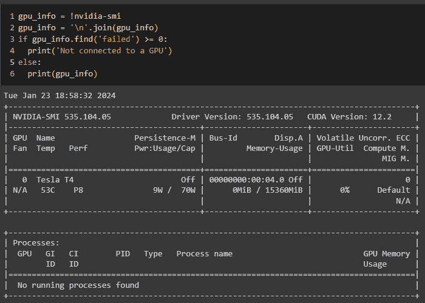
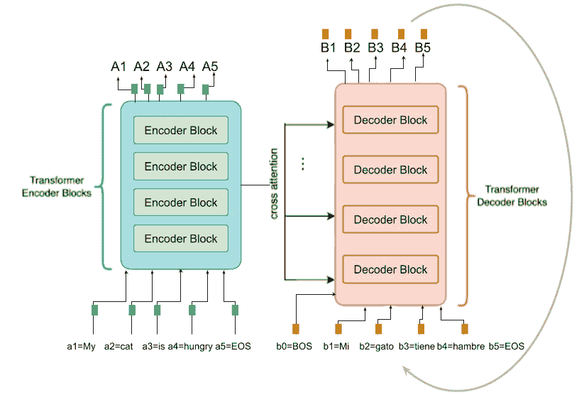
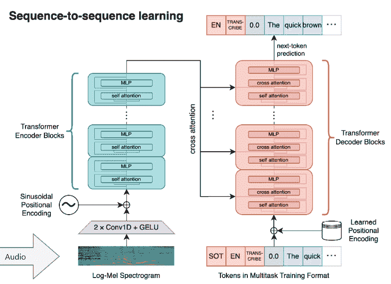
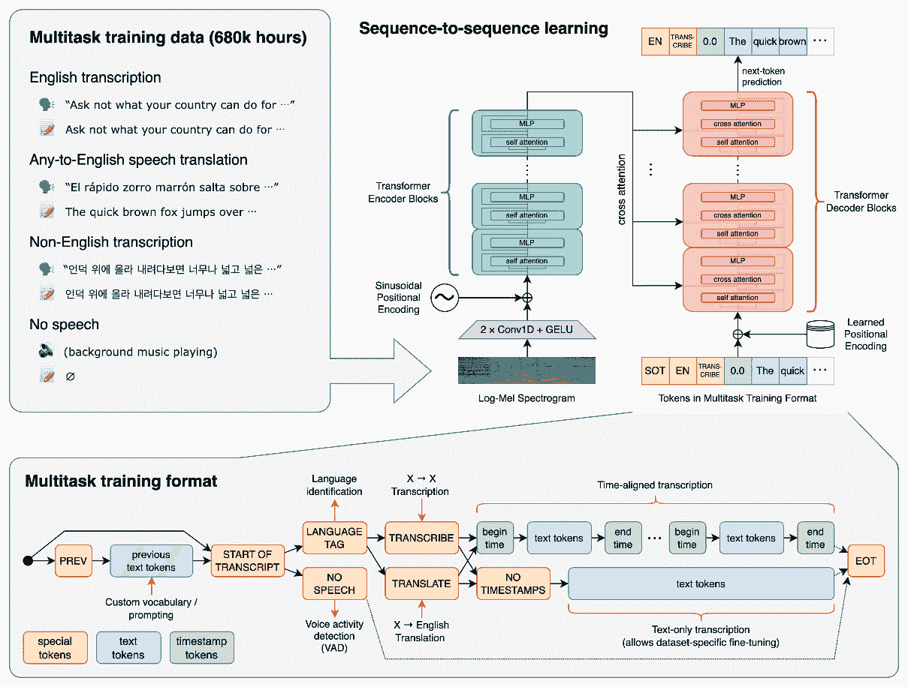
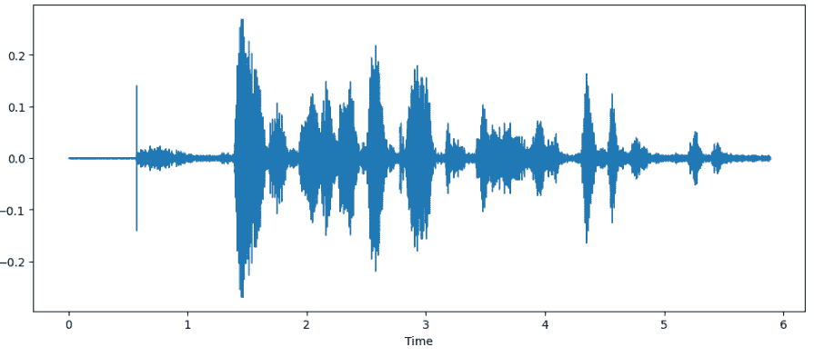

# 3

# 深入探讨 Whisper 架构

当我们踏上深入 OpenAI Whisper 世界的第三章时，我们将进一步探讨支撑这一先进语音识别系统的架构细节。本章名为 *深入探讨 Whisper 架构*，旨在全面了解构成 Whisper 背后的 Transformer 模型。

Transformer 模型，一个彻底改变了机器学习领域的概念，是 Whisper 架构中的关键组件。它是驱动系统将口语语言准确转换为书面文本的引擎。理解 Transformer 模型就像理解 Whisper 的核心，本章旨在通过清晰和精准的解释帮助你深入理解其复杂性。

我们将首先介绍 Transformer 模型，并解释其在 Whisper 中的作用和意义。我们将提供对该模型的广泛理解，为更详细地探索其机制打下基础。接着，我们将深入分析编码器-解码器机制，这是 Transformer 模型的一个重要方面。本节将阐明该模型如何处理和转换输入数据，帮助你深入了解 Whisper 的语音识别能力。

在我们导航 Whisper 架构的过程中，我们还将讨论 Transformer 模型如何推动有效的语音识别。我们将突出该模型在提高 Whisper 准确性和效率方面的作用，帮助你更深入理解系统如何实现其卓越的性能。

在本章中，我们将涵盖以下主题：

+   理解 Whisper 中的 Transformer 模型

+   探索 Whisper 的多任务和多语言能力

+   在大规模数据上使用弱监督训练 Whisper

+   深入了解数据、注释和模型训练

+   将 Whisper 与其他 OpenAI 技术集成

到本章结束时，你将全面理解 Transformer 模型及其在 Whisper 中的作用。你将深入探索 Whisper 的架构，理解其编码器-解码器机制，以及它如何推动有效的语音识别。这些知识将帮助你更好地理解随后的章节，在这些章节中，我们将探讨 Whisper 的多任务和多语言能力、在大规模数据上使用弱监督训练 Whisper 的方法，以及如何将 Whisper 与其他 OpenAI 技术集成。

在我们继续探索 Whisper 的世界时，请记住，理解像 Whisper 这样的 ASR 系统的架构，不仅仅是理解其技术层面。它还包括欣赏这种技术的变革潜力。它是关于想象一个声音技术深深融入我们日常生活的未来，推动效率、可访问性和创新。因此，当我们深入探讨 Whisper 的架构时，我们也会思考这种技术的变革潜力，以及如何利用它塑造更美好的未来。

引用伟大的建筑师 Louis Kahn 的话：“*伟大的建筑必须从不可衡量的开始，在设计时必须通过可衡量的手段，而最终必须是不可衡量的*。”同样，正如我们在本章中深入研究 Whisper 架构的可衡量方面时，让我们保持对这项技术不可衡量潜力的关注。让我们一起深入探索！

# 技术要求

对于本章，我们将利用 Google Colaboratory 的可访问性和经济性。Whisper 的小型模型需要至少 12 GB 的 GPU 内存。因此，我们必须尽力确保为我们的 Colab 获得一个不错的 GPU！不幸的是，使用 Google Colab 的免费版（免费版提供的是特斯拉 T4 16 GB）越来越难以获取一个好的 GPU。然而，使用 Google Colab Pro，我们应该不会遇到问题，可以分配到 V100 或 P100 GPU。

要获取 GPU，在 Google Colab 的主菜单中，点击**运行时** | **更改运行时类型**，然后将**硬件加速器**从**无**更改为**GPU**。

我们可以通过运行以下代码来验证是否已分配 GPU，并查看其规格：

```py
gpu_info = !nvidia-smi
gpu_info = '\n'.join(gpu_info)
if gpu_info.find('failed') >= 0:
  print('Not connected to a GPU')
else:
  print(gpu_info)
```

这是输出结果：



图 3.1 – Google Colab 中 gpu_info 输出的示例

当然，可以在你喜欢的环境中运行。Jupyter 笔记本和 Google Colab 的链接可以在[`github.com/PacktPublishing/Learn-OpenAI-Whisper/tree/main/Chapter03`](https://github.com/PacktPublishing/Learn-OpenAI-Whisper/tree/main/Chapter03)找到。

本章的笔记本是一个重要的伴侣。它不仅仅作为补充，而是作为你学习 Whisper 世界过程中不可或缺的一部分。这个笔记本提供了如何处理音频数据并利用 Hugging Face 生态系统的实践探索，任何希望有效实现 Whisper 的人都需要掌握这些内容。该笔记本涵盖了以下关键学习目标：

+   介绍如何使用 Hugging Face 处理音频数据，展示本章的理论概念如何转化为实际的编码练习。

+   演示基本的音频处理技巧，如加载、播放和可视化音频文件——这些技巧对任何使用 Whisper 或任何自动语音识别（ASR）技术的人来说都至关重要。

+   向更高级应用的初步步骤，包括微调 Whisper 模型所需的预处理——这一话题将在*第四章*中进一步展开。

通过本笔记本，您将获得与本章理论知识互补的实践经验，为更高级的 Whisper 模型微调技术打下基础。

# 理解 Whisper 中的 transformer 模型

在本节中，我们将探索 transformer 模型如何在自然语言处理（NLP）领域带来突破，并理解其机制，使得 Whisper 能够准确地将口语转换为书面语言。我们将详细介绍其编码器-解码器结构以及优化方法，使其在语音处理任务中无可匹敌。通过学习，我们将深入了解这一先进模型架构的内部工作原理，理解它如何驱动 Whisper 的强大功能，并解锁跨语言的应用。

## 引入 transformer 模型

作为 OpenAI Whisper 的专家，我经常被问到：“是什么让这个**ASR**系统如此先进？”答案就在于它的核心：开创性的 transformer 模型架构。一切始于 2017 年 Vaswani 等人发表的论文《Attention Is All You Need》。引入 transformer 模型标志着 NLP 领域的一个重要范式转变。在此之前，序列转换模型（即将一个领域的序列转换为另一个领域的序列）主要基于 RNN，包括 LSTM 网络和 CNN。

RNN 和 LSTM 按顺序处理数据，它们通过将信息从一个序列步骤传递到下一个步骤来保持某种形式的记忆。然而，它们也有局限性，例如操作难以并行化（因为每一步都依赖于前一步）以及由于梯度消失等问题，难以学习序列中的长程依赖关系。

transformer 模型引入了一种全新的架构，它完全依赖于注意力机制，摒弃了循环和卷积操作。这是与之前的范式的显著区别，后者通常使用复杂的 RNN 或 CNN 与注意力机制相结合来连接模型的编码器和解码器组件。

注意力机制使得 transformer 模型在预测输出序列的每一部分时能够聚焦于输入序列的不同部分，从而有效地捕捉输入的*上下文*，无论它的位置如何。这对于像翻译这样的任务尤其重要，因为一个单词的相关性可能会严重依赖于句子中其他地方的单词。

Transformer 的自注意力机制使得它在生成输出时，能够衡量输入序列每个部分的相关性，这对于正确解读口语语言至关重要。这使得模型能够并行处理输入序列的所有部分，显著提高训练效率，并更有效地学习长程依赖关系。为了说明这一点，我们可以考虑一个实际的句子翻译任务。假设我们有句子：“I arrived at the bank after crossing the river.” 在这个上下文中，单词“bank”指的是河岸。然而，“bank”也可以指金融机构。“bank”的正确解释取决于它在句子中的上下文，特别是单词“river”的存在。

Transformer 模型使用自注意力机制来衡量句子中每个单词的相关性，以便在翻译时使用。当模型处理单词“bank”时，它会为相关的单词（“arrived”，“crossing”，“river”）分配更高的注意力分数，以帮助确定“bank”的正确含义。通过这种方式，模型能够正确地将句子翻译成另一种语言，并保持“bank”一词的原意。

这种机制还允许模型并行处理输入序列的所有部分，从而显著提高训练效率。传统的序列到序列模型，如 RNN，会一步一步地处理输入序列，这对于长序列来说可能非常耗时。相反，Transformer 可以同时处理输入序列中的所有单词，从而缩短训练时间。

此外，自注意力机制帮助模型更有效地学习数据中的长程依赖关系。在我们的例子中，尽管单词“bank”和“river”被其他几个单词分隔开，但模型仍然能够理解它们之间的关系。这种能力对于文本摘要或问答等任务至关重要，在这些任务中，理解整个上下文是非常重要的。

自注意力机制

自注意力机制使得 Transformer 模型能够理解输入数据中的上下文。它通过计算注意力分数，确定在预测特定输出元素时每个输入部分应该给予多少关注。这个机制对于准确转录语音至关重要，因为它使得模型能够考虑句子或对话的整个上下文，而不是单独处理每个单词。

引入 Transformer 已经在各种任务中带来了最先进的性能，包括机器翻译、文本摘要和问答。它还为后续模型（如 BERT、GPT 等）的发展铺平了道路，进一步推动了自然语言处理的可能性。

向变换器模型的转变是如此显著，以至于它重新定义了 NLP 领域的最佳实践，改变了从顺序处理到更具并行性和上下文感知的方法。这不仅提升了基准任务的表现，还为 NLP 应用开辟了新天地，成为该领域一个真正具有变革性的时刻。

### 审视变换器模型框架

变换器模型包含编码器和解码器。编码器处理输入的音频帧，而解码器生成转录后的文本输出。编码器和解码器都有重复的块，其中包含以下内容：

+   **多头自注意力层**：这些层使得模型能够理解上下文，并在转录时衡量每个单词的相关性。这对正确解释口语语言至关重要。

+   **位置相关的前馈层**：这些层处理来自注意力层的特征，并将信息在整个模型中传播。

与以往的序列模型不同，自注意力层使得模型在转录每个单词时能够考虑到整个上下文。这为我们带来了显著的性能提升。

以下图示说明了变换器中编码器-解码器模型的*自回归*生成步骤：



图 3.2 – 变换器编码器-解码器模型（基于变换器的编码器-解码器模型。Patrick von Platen. 2020 年 10 月 10 日。https://huggingface.co/blog/encoder-decoder）

在前述图中，编码器用绿色表示，解码器用橙色表示，演示了将英语短语“My cat is hungry”翻译成西班牙语“Mi gato tiene hambre”。翻译涉及一系列步骤，具体如下：

**步骤 1**：最初，编码器分析整个输入序列**a1:5** = “my cat is hungry”（通过浅绿色向量可视化，并将其转换为一系列上下文感知的编码向量**A1:5**）。例如，向量**a2**捕捉到的编码不仅仅反映了“cat”这个单词，还包含了周围单词“My”，“cat”，“is”和“hungry”的上下文相关性，以及句子结束标记“EOS”。

**步骤 2**：接着，这个编码序列**A1:5**，以及句子起始（BOS）向量**b0**，被输入到解码器中。解码器随后解读这些输入，生成第一个 logit 值**B1**（以更深的橙色表示），从而建立初始目标向量**b1**的条件概率。

**步骤 3**：接下来，第一个目标向量 **b1**，对应于“Mi”，由概率分布（由灰色箭头表示）得出并重新引入解码器。此时，解码器会评估 **b0 = “BOS”** 和 **b1 = “Mi”**，以确定下一个目标向量 **b2** 的条件概率。

**步骤 3…n**：这个过程会持续迭代进行，直到获得下一个目标向量 **b2 = “gato”**。该过程保持自回归方式，直到在第六步识别出 **句末**（**EOS**）向量，并以此顺序继续进行。

需要明确的是，编码器的作用仅限于初步处理，它将**a1:n** 转换为 **A1:n**。在随后的步骤中，解码器直接使用已经预先计算好的 **A1:n** 编码。

### 优化自动语音识别

在 Whisper 中应用于 ASR 时，transformer 利用大量数据集处理多种语言和任务。对于训练，**连接主义时间分类**（**CTC**）巧妙地将音频输入与文本输出对齐，而无需显式的对齐注释。

这使得该模型能够适应语音变化，如语速或停顿。与以往的深度学习模型不同，transformer 可以处理对话中的说话人重叠。通过这些优化，Whisper 能够准确地转录现实世界的语音。

Whisper 使用的是一个序列到序列模型，采用 transformer 编码器-解码器架构。这将音频映射到文本的过程中分阶段进行。首先，原始音频被转换成显示语音频率的**对数梅尔频谱图**。然后，编码器处理该频谱图以提取基本特征。最后，解码器使用这些特征逐个预测文本转录。Whisper 可以通过优化音频与文本之间的映射，自动将语音转换为文本。这个逐步的处理流程使得模型能够学习输入音频和输出文本之间的对齐。*图 3.3* 总结了 Whisper 模型：



图 3.3 – Whisper 模型。该模型采用标准的 transformer 编码器-解码器架构。音频的对数梅尔频谱图输入到编码器。编码器将学习到的特征传递给解码器。解码器然后基于音频特征和前一个单词逐个预测地转录语音（https://cdn.openai.com/papers/whisper.pdf）

用于语音识别的序列到序列模型采用了编码器-解码器架构。编码器从音频语音输入中提取显著特征，并将其编码为隐藏状态表示。解码器充当内部语言模型，处理这些表示以生成口语文本的转录。将语言模型融入模型中被称为深度融合（deep fusion）。这与浅层融合方法（例如，将外部语言模型与单独的编码器结合，连接 CTC 编码器与 n-gram 语言模型；请参见研究论文：[`arxiv.org/pdf/2011.01991.pdf`](https://arxiv.org/pdf/2011.01991.pdf)）形成对比。深度融合对整个模型进行端到端训练，使用相同的数据和损失函数。这种方法提供了更灵活的训练，并比浅层融合技术表现更好，正如基准测试所示（请参见研究论文：[`arxiv.org/abs/2210.13352`](https://arxiv.org/abs/2210.13352)）。

通过利用深度学习的突破和丰富可用的训练数据，Whisper 采用变换器架构推动了自动语音识别（ASR）的边界。随着模型的不断改进，系统的多功能性也将提升。理解这些机制有助于深入了解 Whisper 在与其他语音技术相比时的出色能力。

## 研究变换器模型在 Whisper 中的作用

变换器模型是 OpenAI 的 Whisper 的重要组成部分，它基于一种深度学习架构，利用自注意力机制以一种捕捉语言上下文和细微差别的方式处理序列数据，如语音。

Whisper 的变换器模型对语音识别中的输入数据（即与口语单词相对应的数据）进行编码。输入音频被分割成通常为 30 秒的块，并转换为对数梅尔频谱图。然后，这个频谱图被传递给编码器，编码器使用自注意力机制在生成输出时对输入序列的每个部分的相对重要性进行加权。

解码器经过训练，以预测与处理过的音频输入相对应的文本字幕。它通过逐个生成单词的方式进行预测，并考虑编码器处理的整个序列，以保持上下文的连贯性。解码器还使用自注意力机制，在预测输出序列的每个部分时，集中关注输入序列的不同部分。

变换器模型在 Whisper 中的作用至关重要，因为它有效地驱动了系统将口语语言转换为书面文本的能力。其架构，尤其是自注意力机制，使得 Whisper 能够捕捉到口语单词的上下文和含义，这对准确的转录至关重要。该模型的可扩展性和从大规模数据集学习的能力为 Whisper 的强大和适应性提供了支持，使其成为一种强大的语音识别工具，适用于各种语言和应用场景。

在探讨了变换器模型在 Whisper 先进语音识别中的关键作用后，让我们更深入地了解这项技术的核心——编码器-解码器机制，并揭示这些组件是如何协同工作，将口语转化为准确的书面文本的。

## 解读编码器-解码器机制

与其他变换器模型一样，Whisper 的架构是基于编码器-解码器机制。如*图 3.3*所示，编码器-解码器机制是一个两步过程。编码器接受输入数据（在此为语音），并将其转换为向量，以模型可以理解的方式表示数据。这些向量捕捉了输入数据的上下文信息。然后，解码器利用这些向量，逐步生成输出数据（在此为文本）。

### Whisper 中的编码

在 Whisper 的框架中，编码器将口语作为输入，并将其转换为一系列向量。这个序列捕捉了语音的上下文信息，如单词顺序和语音细节。接着，解码器利用这一序列，逐字生成相应的文本，同时保持单词的顺序和上下文。

编码器按阶段处理输入数据，每一阶段都增加了一层抽象。它首先将原始音频转换为一系列特征向量，然后通过多个变换器模型的层进行处理。每一层都包含自注意力机制和前馈神经网络，帮助捕捉输入数据中的复杂模式和依赖关系。

编码器的输出是一个上下文敏感的输入数据表示序列。这些表示捕捉了相应输入特征向量中的信息以及来自整个输入序列的信息。这使得解码器能够生成准确的转录结果，即使输入数据中存在噪声或其他失真。

编码器同时处理多种语言和任务的能力是 Whisper 的另一关键特性，使其成为多种应用的多功能工具，从转录服务到语音助手。

### Whisper 中的解码

在 Whisper 的变换器模型中，解码器与编码器协同工作，执行语音识别任务。编码器处理输入音频并创建上下文表示，解码器则利用该表示预测相应的文本输出。以下是解码器执行的基本处理阶段：

1.  **预测文本**：解码器通过对音频输入的编码表示进行训练，预测文本字幕。它通过逐字生成的方式来实现，并且考虑由编码器处理的整个序列，以保持口语的上下文。

1.  **处理特殊标记**：Whisper 的解码器还利用独特的标记来执行多个任务，如提供短语级时间戳和指示转录过程中的不同功能。这些标记是模型词汇的一部分，并在解码阶段引导模型的行为。

1.  **耦合输入输出表示**：解码器采用耦合的输入输出标记表示和学习的位置嵌入。这使得模型能够理解单词在整个句子或对话中的顺序和位置。

1.  **执行自回归生成**：该架构遵循经典的编码器-解码器结构，这意味着解码器依赖于自回归生成过程。该过程涉及根据之前生成的单词预测每个后续单词，确保输出文本具有连贯性并与上下文相关。

1.  **处理错误**：解码器的设计和训练使其能够处理语音中的变异，如口音、背景噪音和专业术语。这种鲁棒性部分归功于 Whisper 所训练的大型多样化数据集，该数据集包括广泛的语言和音频条件。

总结来说，Whisper 架构中的解码器根据编码的音频输入生成书面文本。它是一个复杂的组件，使用学习到的模式、独特的标记和自回归生成过程，生成准确的转录文本，反映出口语语言的上下文和细微差别。解码器的有效性证明了 Transformer 模型能够处理复杂任务，如语音识别和翻译，使 Whisper 成为语音识别领域的强大工具。

下一节将探讨语音识别系统如何在翻译、摘要和关键词识别等领域之间进行适配的技术创新。我们将深入了解 Whisper 优化的模型架构、广泛的多语言数据集，以及其引人注目的零-shot 迁移学习能力，这些都为其语言灵活性提供了支持。

# 探索 Whisper 的多任务和多语言能力

正如我们在上一节中看到的，Transformer 模型架构是赋能 Whisper 高级语音识别能力的核心。然而，故事并不止于此。Whisper 拥有令人瞩目的多功能性，不仅仅是将英语音频转录为文本。其灵活的设计支持在 90 种语言之间无缝切换，执行翻译、摘要和关键词识别等多种任务。这种能够在语言多样化环境中适应性地进行多任务处理的能力，显著扩展了 Whisper 在全球商业和消费者需求中的实际应用。

在接下来的部分中，我们将探讨驱动 Whisper 多功能性的技术创新，包括其优化的多任务模型架构、广泛的多语言训练数据，以及引人注目的零-shot 转移学习能力。理解这些能力为将 Whisper 有效集成到跨文化和多功能语音识别项目中提供了宝贵的见解，从语音助手解决方案到报告系统。

## 评估 Whisper 处理多任务的能力

当我第一次了解到 Whisper 的多任务能力时，我不得不承认——我感到震惊。作为有经验的技术专业人员，我们知道大多数 AI 系统都专注于单一任务。语言模型生成文本。计算机视觉模型分析图像。语音识别工具转录音频。

但是 Whisper 打破了这一模式。它的架构支持从同一个模型执行多种类型的语音处理任务，这一非凡的能力为语音 AI 系统的多功能性树立了新的标准。

那么，Whisper 是如何实现这一魔法的呢？这一发现让我开始了一个引人入胜的探索，揭开其灵活设计背后的秘密。而我所发现的仅仅加深了我对其优雅创新的欣赏。

### 揭示潜在连接

关键的洞察是，从本质上讲，所有语音任务都依赖于理解语言。因此，通过在多任务的多样语音数据上训练 Whisper 的模型，它能在抽象的潜在层面上学习任务之间的连接。

OpenAI 的 Whisper ASR 系统中的**潜在连接**对于提高语音识别准确性至关重要。这些连接是支撑 Whisper 的 Transformer 模型架构的一部分。Transformer 模型以其编码器-解码器结构著称，利用自注意力机制来衡量输入数据中不同部分的重要性。

在语音识别中，潜在连接帮助模型捕捉语音输入中不同部分之间的依赖关系，即使这些部分在序列中相隔较远。这在语音识别中尤为重要，因为一个词的意思可能依赖于对话中早些时候或稍后出现的词提供的上下文。通过有效地捕捉这些依赖关系，潜在连接有助于提高 Whisper ASR 系统生成的转录准确性。

此外，Whisper 中的 Transformer 模型是在大规模数据上通过弱监督训练的。这种方法涉及在大量带有限制标注的数据上训练模型，让它从更广泛的上下文中学习，并在复杂或模糊的情况下提高其性能。这种训练方法与潜在连接在捕捉长距离依赖关系上的强大能力相结合，促成了 Whisper 在语音识别任务中的高准确性。

例如，转录西班牙语音频需要理解西班牙语的词汇和语法。将西班牙语语音翻译成英语依赖于两种语言之间的映射。总结西班牙语对话要求挑选出关键的语义概念。

尽管表面上有所不同，所有这些任务都涉及到对口语单词背后意义的探究——这就是语言学家所说的语义学。通过自监督学习，Whisper 在接触各种语言任务时，隐性地建立起这些关键的连接。

语言学语义学

语言学语义学是研究意义的学科，用以理解人类通过语言表达的意思。它涉及对单词、短语，最终是整个文本的意义进行解释。语义学关注单词之间的关系，以及它们如何共同创造意义，通常重点讨论指称（直接的或词典意义）和隐含意义（单词所引发的想法或感情）。在人工智能和机器学习中，理解语义对自然语言处理（NLP）任务至关重要，如语言翻译、情感分析和信息提取。

### 适应性支持的架构

但是，仅仅吸收大量的训练数据是不够的。Whisper 的架构在至关重要的方面支持知识的可适应性和多样化应用：

+   自注意力机制使模型在转录时能够考虑每个单词周围的上下文。这使得像*right*这样的词能够根据整个句子的意思进行正确解读，从而提高准确性。

+   多语种训练使 Whisper 能够接触到跨语言的词汇、语法和发音多样性。识别这些跨语言的模式使得模型在面对训练时未明确出现的新语言时能更好地进行泛化。

+   编码器-解码器结构非常适合跨领域（如语言或任务）转换输入音频。灵活性是关键。这一能力被称为**软对齐**。

软对齐

在训练过程中使用软对齐来将输入音频与对应的转录文本对齐。这个对齐是*软的*，因为它是基于概率的，意味着它依据某些音频部分与转录文本某些部分对应的可能性来进行。训练中的软对齐意味着模型不会对严格的输入-输出配对做出僵硬假设。这使得模型能够处理更自由、变化多端的现实世界语音。

在 Whisper 中，模型在许多来自网络的多语种和多任务监督数据上进行训练。模型使用一种变体的 CTC 损失函数，这使得它能够以*软的*或概率的方式处理输入音频与其对应转录之间的对齐。这种软对齐使得模型能够处理语音速率和音频数据中的其他时间变化。

这种方法的优势在于它不需要显式的音频数据分段或对齐，而这在自动语音识别（ASR）中是一个具有挑战性的任务。在传统的 ASR 系统中，将音频数据与其对应的转录文本对齐通常需要精确的分段，将音频划分成较小、可管理的片段，对应于语音单元，例如单词或音素。这个过程既复杂又容易出错，特别是在处理语音变化时，如不同的口音、语速和背景噪声。

取而代之的是，Whisper 采用了一种概率性的方法，通过使用 CTC 损失函数进行软对齐。这种方法基于音频的某些部分与转录文本的特定部分相对应的可能性，而不是僵硬地将固定的音频段与文本对齐。这种方法使得模型能够处理广泛的现实世界语音变异性，如语速变化以及音频数据中的其他时间变化。因此，模型在训练过程中学习到隐式地对齐音频和文本数据，从而实现更强大、更准确的语音识别，而无需复杂且劳动密集的显式分段。

## 更深入地探索 Whisper 的多语言能力

当我们深入探索时，Whisper 在赋予其出色的多语言能力方面展现了高超的 AI 工程技术。激发 Whisper 灵活语言能力的火花源自于其数据。Whisper `large-v3` 是在 100 万小时的弱标注音频和 400 万小时的伪标注音频上训练的，这些音频是使用 `large-v2` 收集的。

伪标签

伪标签是一种半监督学习技术，用于提高机器学习模型的性能。在训练最新的 Whisper 模型版本 3 时，伪标签技术涉及利用模型对无标签数据的预测来生成伪标签。伪标签在无标签数据量庞大而标注数据相对较少的场景中尤为有用。

假设我们拥有大量各种语言的音频录音，但其中许多并没有相应的文本标签来指示所说内容。为了训练 Whisper，我们最初使用了之前的模型版本（`large-v2`）来处理这些无标签的录音。`large-v2` 模型监听音频并尽最大努力转录语音，有效地为这些录音生成 *伪* 标签。

尽管不完全准确，这些伪标签为训练下一版本模型（`large-v3`）提供了起点。然后，`large-v3` 模型从这个扩展的数据集中学习，包括原始的标注数据和新的伪标注数据。该方法使模型能够在缺乏完全标注数据的情况下，改善其对多种语言语音的理解和识别。当使用模型对未标注数据的预测来创建新的训练材料时，这种技术被称为伪标签化，应用于训练 Whisper 的最新模型。

重要的是，这些数据涵盖了 90 种语言——使得模型接触到了前所未有的语言多样性。通过利用互联网规模的数据和先进技术，Whisper 吸收了词汇、语法、口音以及跨地理区域和语言家族的其他语言细微差别。

这种庞大的数据规模和多样性打通了跨语言解决语音任务之间的固有联系——转化了模型隐式理解的抽象*语言*本身。

### 优化模型架构

但单纯的大量数据是不够的——还需要与优化的模型设计相平衡。Whisper 利用我们之前探讨的多功能变换器架构，进行输入音频和输出文本之间的可调编码与解码。

语音识别中的独特之处在于，Whisper 在训练过程中采用了一个时间限制的自注意力窗口。这在转录单词时考虑了局部上下文，帮助提高了在长序列中进行准确性和计算效率。

此外，加入**随机深度**和**丢弃法**在训练过程中引入随机性，帮助 Whisper 更好地泛化，减少对任何特定神经元的依赖。结合跨目标的多任务学习，例如转录、翻译和识别，模型发展出了灵活的语言处理能力。

随机深度和丢弃法

随机深度和丢弃法是两种技术，用于在训练机器学习模型时引入随机性，包括 Whisper ASR，以防止过拟合并改善泛化能力。

随机深度是一种正则化技术，它在训练过程中随机省略（或*丢弃*）深度神经网络中的特定层。其核心思想是在训练时通过跳过某些层来减少网络的复杂性，同时在测试时仍然使用整个网络。这种方法有助于防止过拟合，特别是在深度网络中，通过向训练过程中添加噪声并鼓励网络学习更强大的特征。它还有降低训练计算成本的附加好处。

另一方面，Dropout 是一种在训练过程中随机*丢弃*（即设置为零）某些神经元输出的技术。与随机深度类似，Dropout 是一种正则化方法，旨在防止过拟合。通过随机丢弃神经元，Dropout 强迫网络学习冗余的表示，从而使其对特定神经元丢失更具鲁棒性，并提高其从训练数据到未见数据的泛化能力。

在 Whisper ASR 的背景下，这些技术可以提高训练模型的鲁棒性和泛化能力。将随机性引入训练过程可以帮助模型更好地处理现实世界语音数据的多变性和不可预测性。

### 跨语言的零样本迁移

数据与技术的协同作用解锁了 Whisper 最具科幻色彩的能力——识别在训练过程中从未明确接触过的语言！这在语音识别中被称为 **零样本迁移学习**。通过接触足够多样化的训练数据，Whisper 学会了概括语言结构，并解码它从未见过的新语言。

这种跨语言的迁移能力使得该模型可以用于实际的语音识别任务，而无需为每种新语言准备定制的训练数据。这是一种高效的方法，模仿了人类在学习多种语言后，推断不熟悉语言的含义和模式的能力。这项技术推动了语音 AI 系统（如 Whisper）在全球不同语言观众中的适应性和广泛应用的边界。因此，Whisper 模型可以显著适应那些在其训练过程中未明确覆盖的语言。这种适应性源于模型对多语言训练的接触，在此过程中它学习了语言之间的联系。因此，即使没有对特定语言的直接训练，模型也能有效处理未见过的语言。这种多语言训练方法具有显著的优势：它允许在不需要昂贵的数据收集和重新训练的情况下高效地部署到新的目标语言。

从技术层面来看，Whisper 并不记忆词汇，而是发现贯穿所有人类语言的更深层次的普遍结构。语言学家假设，常见的认知能力塑造了口语语言——这些模式是 Whisper 通过接触足够多样化的语言数据提取出来的。这使得 Whisper 对陌生语言具有几乎像魔法一样的适应能力——这是推动多语言语音 AI 边界的一个显著成就！

通过在没有明确示例的情况下高效地对未见过的语言进行泛化，零样本迁移学习使得部署 Whisper 更加方便，适用于各种全球使用场景。这项技术推动了语音 AI 系统的多功能性和广泛适用性的边界，以服务全球讲述数千种语言的用户。

## 认识到多任务处理和多语言能力在 ASR 系统中的重要性

在结束我们对 Whisper 出色的多任务处理和多语言技能的探讨时，值得思考这些能力为何对于语音识别系统在应对现实场景中至关重要。

### 满足不同最终用户的需求。

简单来说，人类语言的不可预测变异性要求具备灵活多样的自动语音识别（ASR）模型。无论是多种语言、技术词汇、声学条件，还是多种语言任务，最终用户都有多样化的需求。

Whisper 提供 90 种语言的多语言支持，涵盖了浪漫语言、日耳曼语言、斯拉夫语言等多个语言家族。这种广泛性能够处理在不同语言之间进行交流的国际用户群体。该模型架构还支持零-shot 转移——无需明确的训练数据，就能够识别新语言。

此外，通过适当的参数设置，Whisper 可以处理诸如医学术语或法律术语等用户经常需要准确解读的专业词汇。该模型通过训练多样化的网络数据集，获得了超出常用短语的广泛词汇覆盖。

### 擅长多任务处理。

从技术角度来看，Whisper 之所以能够具备多样的多任务能力，归功于其特定的架构优化。

+   训练过程中的软对齐可以防止严格的输入输出对齐导致过拟合，从而提高模型的泛化能力。

+   多任务学习使得模型能够接触到相关任务之间的联系，从而实现灵活的知识转移。

+   随机深度和 dropout 提供了随机性，减少了对特定神经元的依赖，从而提高了模型的鲁棒性。

这些方法使得单一模型能够熟练地在转录、翻译、情感分析、关键词识别及其他语音处理目标之间灵活转换，同时不失准确性。

### 使投资具有未来保障，以应对趋势的变化。

语音识别模型是长期投资，旨在随着时间的推移在各个地区扩展。鉴于当前技术变化的速度，灵活性对于保护价值至关重要。Whisper 的多语言零-shot 能力和多任务设计能够主动为系统的未来需求提供保障。

无论是在新兴市场中语言的意外增长，还是新型语音使用场景，Whisper 都能提供避免被固定假设束缚的保险。这种适应性确保了企业不会因为趋势变化而使系统成为过时的“白象”。

### 为更强大的对话代理铺平道路。

最后，通过展示 Whisper 在语言和声学多样性处理方面的高超能力，OpenAI 提升了语音识别研究的标准。这些令人印象深刻的能力激励他人突破常规，重新审视是否需要独立、专门的系统。

单一语言或任务孤立学习的时代即将结束。用户应得的且日益期待的是全面的语音解决方案。未来，像 Whisper 这样的集成功能模型将为更强大的对话代理铺平道路，使其能够理解自然语言中的各种精彩与挑战！

接下来，我们将探讨 Whisper 使用弱监督策略的训练方法，如何有效利用大规模数据集——即使在人工标注有限的情况下。

# 使用弱监督在大规模数据上训练 Whisper

在介绍了 Whisper 的多任务变压器架构后，我们将进一步探讨其复杂的训练策略，这些策略赋予了 Whisper 先进的语音识别能力。Whisper 不仅仅依赖小规模、精心注释的数据集，它还利用了数 TB 的网络语音数据，并结合半监督技术。

接下来的部分将深入探讨 Whisper 的网页规模数据积累、通过机器教师进行伪标注以及架构支持，这些都促进了从噪声标签中学习的过程。我们将逐步介绍数据编程范式、自我训练、随机深度和预训练方面的创新，这些都是 Whisper 成功的关键。最终，你将理解弱监督如何使得语音理解能力无与伦比——为方言和词汇的定制化开辟了道路，而大规模的强标注在现实中依然难以实现。

## 引入弱监督

传统的监督学习范式长期以来一直是机器学习的金标准。它通过大量标注数据训练模型，其中既有输入也有期望输出。然而，这种方法也有其局限性。标注数据既费时又昂贵，并且为每个任务获取大量标注数据并不总是可行的。这就是弱监督发挥作用的地方。

### 什么是弱监督？

弱监督是一种机器学习范式，它利用不太准确或*噪声*标签来训练模型。这些标签可以通过多种方式生成，如启发式方法、众包或数据增强。弱监督的关键思想是将这些噪声标签作为真实标签的代理，前提是理解它们可能并不 100%准确。

弱监督的优势在于，它使我们能够在比完全监督学习更大规模的基础上训练模型。通过利用弱标注数据，我们可以在数百万甚至数十亿的样本上训练模型，从而显著提升性能。

弱监督的概念，虽然对于训练像 OpenAI 的 Whisper 这样的模型有很大优势，但也有一些缺点是值得考虑的：

+   **准确性**：弱监督模型的准确性可能低于完全监督学习。模型可能会学习到不正确的模式或关联，导致性能不理想。

+   **模型复杂性**：弱监督通常需要更复杂的模型和训练过程。这些模型需要处理标签中的噪声，这可能增加模型的复杂性以及训练所需的计算资源。

+   **评估困难**：由于缺乏真实标签，评估使用弱监督训练的模型性能可能非常具有挑战性。这使得准确评估和比较模型的表现变得困难。

+   **训练数据中的偏差**：如果弱标签存在任何偏差，这种偏差可能会传递到模型中，导致偏差预测。这一问题在机器学习中较为常见，在弱监督中尤其成问题，因为标签的可靠性较差。

+   **依赖标签函数**：弱监督在很大程度上依赖于标签函数，而这些标签函数的可靠性和准确性可能存在差异。

这些考虑因素突出了在训练复杂模型（如 Whisper）时，特别需要注意弱监督潜在的局限性和挑战。

### 弱监督中的框架和技术

在弱监督中，采用了多个技术框架和方法论来增强训练过程并提高模型性能。

在弱监督中，使用的关键框架之一是**数据编程范式**。这种方法涉及创建一组标签函数，它们是启发式规则或远程监督技术，用于标记一个大型未标记的数据集。这些标签函数可能包含噪声并且可能相互冲突，但它们通过生成模型结合起来，为训练数据生成概率标签。

另一个重要的技术是**多任务学习**，即在多个相关任务上同时训练模型，通过利用任务之间的共性和差异来提高泛化能力。这在弱监督场景中特别有用，因为某些函数的数据可能有限或存在噪声。

**迁移学习**也是弱监督中的一个关键技术。它涉及在一个大型带标签数据集（源任务）上训练模型，然后在一个较小的、相关的数据集（目标任务）上进行微调。这种方法允许模型利用源任务中获得的知识，提升在目标任务上的表现，尤其在目标任务的带标签数据稀缺时，特别有用。

除此之外，弱监督中还使用了其他几种技术，如**自训练**（模型用于标注其训练数据）、**协同训练**（两个模型在数据的不同视角上进行训练，并相互标注对方的数据）、以及**主动学习**（模型主动选择最具信息量的示例进行标注）。

这些框架和方法论并非互斥，通常会结合使用，以在弱监督场景中取得最佳效果。它们代表了机器学习领域中一些最先进的技术，并处于弱监督研究的前沿。然而，需要注意的是，尽管这些技术在弱监督场景中被广泛使用，但 OpenAI 的文档中并未明确详细说明 Whisper 中是否应用了所有这些框架。正如之前讨论的，Whisper 的训练方法论利用了弱监督的原则，但是否使用了其中的每一种技术并未明确说明。

当然，使用弱监督训练机器学习模型也有若干挑战：

+   **标签质量**：弱监督的主要挑战是标签的质量。由于标签不像完全监督学习中使用的标签那样精确和准确，模型可能学习到错误的模式或关联，导致次优的表现。

+   **模型复杂性**：弱监督通常需要更复杂的模型和训练过程。例如，模型可能需要考虑标签中的噪声，这会增加它们的复杂性并且需要更多的计算资源来进行训练。

+   **评估困难**：评估使用弱监督训练的模型的性能可能会面临挑战。由于没有真实标签，准确评估并与其他模型进行比较可能变得困难。

+   **训练数据中的偏差**：如果弱标签存在某种偏差，这种偏差可能会传递到模型中，导致偏差预测。这是机器学习中的一个常见问题，在弱监督中尤为突出，因为标签的可靠性较差。

+   **标签函数的依赖性**：在弱监督中，标签函数生成弱标签。这些函数可能引入自身的偏差和错误，弱标签的质量高度依赖于这些函数的质量。

尽管面临这些挑战，弱监督仍然是训练机器学习模型的一种有前景的方法，尤其在大量标注数据不可用时。使用弱监督时，仔细考虑这些挑战并制定缓解策略至关重要。

## 理解弱监督在训练 Whisper 中的作用

弱监督在训练 Whisper 的最先进语音识别能力中发挥了重要作用。通过采用这种半监督方法，模型的设计者能够利用更多来自互联网的语音训练数据，而无需准确标注。这对于将对现实世界语言细微差别的深刻理解嵌入系统至关重要。在接下来的部分，我们将深入探讨弱监督如何在 Whisper 中发挥作用，以及它如何对灌输现实世界语言理解至关重要。我们还将探索在训练过程中有效管理标签噪声的各种策略。之后，我们将在*认识使用大规模数据进行* *训练*的好处部分进一步扩展我们对数据编程流程的理解。

### 收集多样化的语音数据

弱监督训练的起点是收集来自公共网络源的大规模异构语音数据集：播客、有声书、YouTube 视频、讨论论坛、教育讲座以及电影对话语料库等等。

这样，Whisper 能够接触到比较小的朗读语音数据集更多的语音模式，来自更多说话者的语音。自然的语速、重叠的对话、技术性词汇——这些现实世界的元素为 Whisper 的实际应用做好了准备。

弱监督依赖于快速聚合公网上的 TB 级数据，而不是昂贵的人工标注。然而，在语言、说话者人口统计和话题等维度上最大化多样性仍然是一个工程挑战。定制的网页爬虫和启发式采样方法解决了这一问题，收集异构的训练数据。

### 程序化生成噪声标签

收集到大量未标注的语音数据后，下一阶段是通过编程方式生成*足够好*的标签，以便于训练。正如我们之前提到的，这个过程叫做伪标签化。伪标签化过程包括几个步骤：

1.  模型最初是在少量标注数据上进行训练的。

1.  然后，训练好的模型会为未标注的数据预测标签，从而生成伪标签。

1.  通过将原始标注数据和新生成的伪标签数据结合起来，重新训练模型。

这些技术作为启发式标签函数，通过关联文本、元数据提示或分类模型来谨慎地推导噪声标签。不同来源之间的无确定性程度差异显著——翻译工具提供的是近似的短语对齐，而关键词提取器则提供准确但稀疏的信号。

Whisper 通过使用概率图模型协调不同的标签生成器，捕获启发式标签方法之间的依赖关系。这指导了将不完美的来源聚合为具有校准信心评分的一致性训练标签。

### 支持半监督学习

至关重要的是，Whisper 使用了以下架构创新，支持对弱监督方法至关重要的半监督目标：

+   **自我训练**：这种方法通过重新训练模型来逐步增长标签数据，训练过程仅限于高置信度区域，以最小化噪声积累，且使用主动学习查询来识别需要人工验证的易错候选。这种方法在半监督学习中非常有效，允许模型从其高置信度的预测中学习，逐步提高其准确性。

+   **随机深度**：引入独特的随机深度层，意味着在训练过程中随机丢弃模型的某些模块。这一策略可以防止模型过度依赖特定参数，提升其对噪声标签的鲁棒性。在半监督学习环境中，处理固有的不确定性和变异性时，这是一种有益的技术。

+   **中间预训练**：这涉及在重建任务（如掩蔽）上的中间自监督预训练。中间预训练步骤提供了功能性正则化，并帮助在模型进行标签感知调优之前学习稳健的数据表示。它有助于减少在弱监督数据中常见的过拟合错误，这是半监督学习场景中的一大挑战。

综合来看，这些创新提高了 Whisper 在应对半监督学习挑战方面的能力，尤其是在标签数据稀缺或噪声较大的情况下。每项技术都提升了模型的整体鲁棒性和准确性，使其非常适合于在完全监督学习不可行的实际应用中使用。

让我们理解这些架构创新如何转化为可衡量的性能提升。

### 性能提升的基准测试

弱监督训练策略在 ASR 系统中已被证明非常有效，通过对标准 LibriSpeech 测试集上的指标进行比较得到了验证。下表突出显示了两种不同的训练方法及其相应的**词错误率**（**WERs**）：

| **训练方法** | **WER** |
| --- | --- |
| 完全监督（仅清洁数据） | 5.8% |
| 弱监督（噪声网络数据） | 3.2% |

表 3.1 – 两种不同训练方法的词错误率（WER）

完全监督方法依赖于清洁且标注准确的数据，获得了 5.8% 的 WER。相比之下，利用噪声网络数据的弱监督方法，显著优于完全监督方法，达到了 3.2% 的 WER。这一显著改进凸显了弱监督在 ASR 中的有效性。

LibriSpeech 测试集

LibriSpeech 测试集收集了来自公共领域有声书的英语语音数据。它是更大规模的 LibriSpeech 语料库的一部分，该语料库是一个广泛使用的 ASR 研究数据集。该测试集专门用于评估 ASR 模型的性能，为不同系统之间的比较提供标准基准。

LibriSpeech 测试集被分为两个子集：*test-clean* 和 *test-other*。*test-clean* 子集包含较清晰的录音，背景噪声较少，一般对 ASR 模型的转录较为容易。另一方面，*test-other* 子集包含更具挑战性的录音，具有各种类型的噪声和失真。这些子集让研究人员能够评估他们的 ASR 模型在不同条件下的表现。

LibriSpeech 测试集衡量的是自动语音识别（ASR）模型在语音识别研究中的字错误率（WER）。WER 是 ASR 中的一个标准度量，用于计算模型转录错误的单词百分比。通过比较 LibriSpeech 测试集上的 WER，研究人员可以评估不同 ASR 模型或同一模型不同版本的相对性能。

弱监督利用包含不准确或标注不精确的大规模数据集。尽管数据中可能存在噪声，但数据集的量和多样性使得模型能够学习到稳健的语音表示。这种方法在获取大量完全标注数据既不实际又过于昂贵时尤其具有优势。弱监督在减少 WER 上的成功可以归因于几个因素：

+   **数据的多样性**：嘈杂的网络数据通常包括各种口音、方言和说话风格，这有助于模型更好地在实际场景中进行泛化。

+   **数量重于质量**：可用于弱监督的大量数据弥补了单个数据点质量较低的缺点。通过接触大量示例，模型能够辨别模式并纠正错误。

+   **正则化效应**：在嘈杂数据上训练可以起到正则化作用，防止模型对较小、较干净数据集的特异性过拟合。

+   **成本效益**：弱监督利用现成的网络数据，减少了昂贵且耗时的数据标注过程。

+   **创新的训练技术**：数据编程、多任务学习和迁移学习常常在弱监督中使用，以应对数据中的噪声并提高学习效率。

来自 LibriSpeech 测试集的结果表明，弱监督是完全监督学习的可行替代方案，并且在 ASR 任务中可能带来更优的表现。这个发现对于开发像 Whisper 这样的 ASR 系统特别相关，其中在各种条件下准确转录语音的能力至关重要。在训练这类模型时采用弱监督是一条有前景的方向，可以使 ASR 系统更加准确、稳健和多功能。

总结来说，网络规模的弱监督是解锁 Whisper 高级语音识别能力的关键。战略性地聚合不完美的标签函数，便于高效地获取庞大而杂乱的数据集。然后，定制的模型架构能够在不确定的情况下提取实际的知识，最终实现了最先进的性能。

当我们意识到半监督学习在提升 Whisper 能力方面的细微差别时，我们必须关注技术进步的另一个关键方面：利用广泛的数据集。这引出了下一个关键话题：*认识到使用大规模数据进行训练的好处*。

## 认识到使用大规模数据进行训练的好处

使用大规模数据训练像 OpenAI 的 Whisper 这样的自动语音识别（ASR）模型带来了前所未有的好处。与依赖较小、精确标注数据集的传统方法相反，这种方法基于一个原则：接触庞大、丰富的数据集可以显著提升模型理解和解读人类语音的能力，涵盖其所有复杂性。

使用大规模数据的一个最重要的好处是能够捕捉到丰富的语言多样性。人类的语言多样性不仅体现在不同的语言上，还包括口音、方言和俚语等方面。通过为 Whisper 提供包含这些变化的大规模数据集，模型能够熟练地理解并转录来自不同语言背景的语音。这就像是在多元文化的环境中成长，自然而然地学习理解不同语言的变化和口音，即使是在嘈杂的环境中。

### 在嘈杂环境中导航

现实中的语音很少是干净无噪声的。大规模数据集通常包含背景噪音、重叠的对话以及不同的音质。对这些数据进行训练使得 Whisper 在现实场景中能够强大地表现出来，因为理想的录音条件通常是例外，而不是常态。这种强大的适应性对于繁忙的城市街道或办公环境中的实际应用至关重要。

人类对话是复杂的。它们涉及到打断、非线性的话语结构以及各种情感和语调。大规模的数据集通常包含这样的对话复杂性，使得 Whisper 能够学习并适应人类沟通的自然流动。这种学习不仅仅是理解单词，还包括把握上下文、情感暗示以及言语中未言明的细微差别。

### 拥抱全球语言变体

在大规模数据集上训练 Whisper 还使其能够接触到各种全球语言变体。这种接触在今天互联互通的世界中至关重要，因为 ASR 系统越来越需要理解并转录多语言内容。从欧洲语言的播客到亚洲方言的 YouTube 视频，每一份数据都丰富了 Whisper 的语言库。

大规模数据的一个有趣之处是，并非所有数据都需要完美标注。Whisper 可以从不完美的、*嘈杂*数据中学习，使训练过程更像人类学习语言——通过接触和上下文理解，而不是死记硬背。这种方法还避免了为大量数据集进行精细标注所需的庞大资源。

不同行业通常使用特定的行话和术语。大规模数据集，尤其是那些来自法律或医疗等专业领域的数据，为 Whisper 提供了必要的行业特定语言的暴露。这使得它成为需要准确转录服务的专业人士的宝贵工具，它能够理解行业语言的细微差别。

使用大规模数据训练 Whisper 就像是在为它准备一场穿越人类语言多样化景观的旅程。就像一个旅行丰富的人对不同的文化和语言有着深刻理解一样，Whisper 通过接触庞大且多样的数据集，熟练地应对人类交流的复杂性。这场由大规模数据驱动的旅程，不仅仅是构建一个高效的 ASR 系统，更是在创造一项尽可能自然、准确地理解和与人类声音互动的技术。

现在你已经了解了这些半监督训练策略，接下来的步骤是深入挖掘数据——包括标注、利用和模型优化过程。在接下来的部分中，我们将阐述为语音识别系统策划最佳数据集的原则。你将获得组建特定领域语料库、有效标注相关示例以及微调模型（如 Whisper）以最大化目标应用场景中准确性的实际技能。

# 获取数据、标注和模型训练的洞察

现在我们已经讲解了 Whisper 的半监督训练方法，接下来的步骤是深入挖掘如何策划最佳数据，以推动针对性性能提升。虽然 Web 规模的语料库提供了一个强有力的起点，但针对特定应用的微调需要定制数据集的开发。

记住我们之前学过的关于变压器如何处理序列的概念。传统的序列到序列模型（例如 RNN）是逐步处理输入序列的，这对于长序列来说可能比较耗时。而变压器则可以同时处理输入序列中的所有词语，从而加快训练时间。Whisper 的变压器序列到序列模型已经在多种语音处理任务上进行了训练，包括多语言语音识别、翻译、口语语言识别和语音活动检测。如*图 3.4*所示，这些任务通过一组标记共同表示，由解码器进行预测，从而使单一模型能够取代传统语音处理管道中的多个阶段。多任务训练格式使用一组独特的标记作为任务指示符或分类目标：



图 3.4 – 使用变压器的 Whisper 序列到序列训练方法（Whisper 的 GitHub 仓库：https://github.com/openai/whisper/tree/main）

接下来的几节将解锁收集领域数据的最佳实践、高效注释最小可行样本的技巧，以及跟踪指标以确保数据完整性。我们将涵盖音频条件、说话人特征和标签分布的精确监控，以最大化模型的学习效果。到最后，您将掌握组建领域适应数据集的可操作技能——为行业术语或特定声学环境需要精确调优的语音识别提供支持。

## 理解数据选择和注释的重要性

在我们深入优化 Whisper 性能的原则时，理解针对语音识别目标量身定制的训练数据策划最佳实践是一个至关重要的起点。虽然弱监督有助于利用现有的网络语音数据，但针对细分应用的微调则需要更多定制化的数据策划。

本节将探讨组建领域特定数据集时的考虑因素、如何高效地优先进行标注工作，以及注释方法——揭示这些要素为何对释放 Whisper 的全部潜力至关重要。

### 收集领域内的训练样本

尽管在大规模网络语料上进行预训练为 Whisper 提供了强大的通用语音理解能力，但在专业应用场景下，最佳性能仍然需要领域内的训练数据。

例如，一个医疗语音助手需要接触到术语密集的医患对话，并且还要考虑到医院的环境噪音，才能可靠地转录医学检查内容。而新闻转录模型则需要国际英语方言中的政治记者发布会录音。

领域内数据与目标部署环境的匹配，使 Whisper 接触到必要的词汇、语音特征和语言模式——相比网络预训练，这将带来 30%-50%的准确度提升。

然而，收集小众数据集可能会面临挑战。记录真实的患者对话需要遵循严格的医疗隐私政策，而新闻机构则严格保护内部媒体资产。

在这里，弱监督下的数据编程策略有助于挖掘小众数据。通过混合和破坏网络数据，组装合成的领域内训练集提供了一种务实的替代方案。

### 优先标注相关数据

在训练 OpenAI 的 Whisper 时，选择正确的标注数据至关重要。标注就像是给数据贴标签：我们告诉系统每一条数据的含义。这一步对于帮助 Whisper 正确理解和解读语音至关重要。

想象我们有一个庞大的拼图，拼图中包含了不同的声音和单词。首先挑选最具辨识度的拼图块将有助于更快地完成图像，选择特定数据进行标注将使 Whisper 的训练更加高效。这意味着我们不需要标注每一个声音，而是专注于那些能帮助 Whisper 学习最多的声音。

一个令人兴奋的方面是发现数据中的*类别*。可以把这些看作是具有共同特征的群体或类别。例如，Whisper 可能会遇到各种不同的英语口音。每种口音都可以看作是一个不同的类别。通过聚焦标注这些口音的代表性样本，我们帮助 Whisper 更准确地学习并理解这些口音。

聚焦于标注是关于如何明智地利用我们的资源。我们不是标注所有内容，而是有策略地挑选代表不同类别或群体的数据。通过这种方式，Whisper 可以在不被淹没的情况下学习广泛的语音模式。

总结来说，优先考虑标注数据意味着选择最具信息性和多样性的样本，这些样本能够帮助 Whisper 更有效地学习人类语音的复杂性。这就像通过展示各种例子来教孩子——通过这种方式，他们学会了识别并理解周围世界的多样性。

### 采用高效准确的标注方法

在 Whisper 训练的精细过程里，标注起着至关重要的作用。本节将深入探讨高效且准确的标注方法如何对将原始音频转化为丰富标注数据集至关重要。最佳实践语音标注包括以下内容：

+   **音频分段**：将一个复杂的音频文件视为一个连续的数据流。我们的第一个音频分段任务是将该流分割成更小、更易管理的单元。这类似于将冗长的代码库划分为功能模块，以便更好地阅读和维护。每个音频段都有准确的时间戳，确保了精确的开始和结束。这个精细的过程得到了语言变更检测工具的支持，类似于编程中的语法高亮，帮助标注员识别音频中的语言转换。

+   **二次转录**：Whisper 的标注过程采用了二次转录方法。在第一次转录时，标注员将音频段转录下来，类似于编写代码时的初步草稿，关注于结构的准确性。第二次转录则是对这些转录内容进行精细修订，类似于代码审查和调试，确保在考虑语境的同时，语义的一致性和准确性得到保证。

+   **解决方案追踪**：在软件开发中，追踪变化和决策对于理解项目的演变至关重要。同样，在 Whisper 的标注过程中，每一个在转录过程中作出的决策，尤其是在解决歧义时，都会被仔细记录。这提供了全面的审计追踪，提供了对语言处理细节的深入理解，帮助完善模型的准确性。

这些技术确保了标注质量的准确性和一致性——这是语音识别的必要条件，因为任何偏差都会严重影响准确性。

最终，直观的界面使标注员能够提高处理繁琐文档的效率。以显示音频波形的网格概念为基础，想象一个复杂的数据显示工具面板。这些网格提供音频波形的详细视觉表现，类似于统计分析中表示数据点的图表。标注员使用这些波形，波形展现了语调、节奏等方面，帮助他们做出更明智的音频分段和标注决策。配合编辑工具和可搜索的分段列表，这种设置提供了高度的控制力和精确度，使标注员能够高效地导航音频数据，类似于数据分析师利用先进的查询和可视化工具筛选大数据集。

战略性数据收集、选择性标注和界面工具的最终结合，能够高效地交付专为扩展 Whisper 语言技能而构建的训练集。对专业词汇、音响学和对话的全面覆盖，为跨越复杂语音领域的卓越转录能力铺平了道路。

现在我们已经探讨了高效准确的标注方法如何提升 Whisper 的学习过程，接下来我们来深入了解这些精确标注的数据如何在训练 Whisper 理解和解读我们多样化的声音与语言世界中发挥关键作用。

## 学习数据如何在训练 Whisper 时被利用

现在我们已经讨论了优化数据集策划的考虑因素，接下来要解决的核心问题是，Whisper 在训练过程中如何消费语音数据？理解数据利用的复杂性揭示了将标注数据集转化为增强转录能力的方法。

在本节中，我们将解构数据摄取、转换和模型集成的关键阶段，揭示录音如何最终表现为语言理解。追溯这一过程还将揭示监控数据利用信号的技术，以确保数据的完整性。

### 从异构格式中摄取数据

第一步是从各个来源聚合语音数据，并提供多种音频编码格式，如 MP3、WAV 和 M4A，同时提供如 Word、文本文件或电子表格等格式的文本转录。

这些原始的摄取负载会经过归一化管道，转化为优化的机器可读张量用于学习。音频被解码为一致的格式，然后被切分成固定时长的窗口（例如 30 秒），这使得模型更容易处理。文本去除杂项并被分解为单词/字符令牌。

对于可选的辅助建模，还会记录伴随的元数据，如说话者的年龄、性别、种族等。输出的同质化、机器可读的数据集促进了训练过程中高效的数据加载和批处理。

### 应用增强以提升多样性

域特定数据在摄取后仍然有可能使模型过拟合到狭窄的数据分布，导致无法泛化。应用数据增强可以提升多样性。

*混合背景噪音*通过模拟公共环境提供声学鲁棒性训练。*调节音高和节奏*减少了对狭窄语音风格假设的依赖。*合成原始网页语音片段的组合*更好地再现了自然对话的动态。

战略性地扭曲训练数据迫使模型更多地关注语言模式而非记忆，从而提高了模型的泛化能力。本章节的配套 Colab 笔记本提供了一个示例，展示如何使用 Hugging Face 的`transformers`类来便捷地进行大规模的音频数据集增强：

```py
from transformers import WhisperFeatureExtractor
feature_extractor = WhisperFeatureExtractor.from_pretrained("openai/whisper-small")
def prepare_dataset(example):
    audio = example["audio"]
    features = feature_extractor(
        audio["array"], sampling_rate=audio["sampling_rate"], padding=True
    )
    return features
minds = minds.map(prepare_dataset)
```

在这个代码片段中，我们首先从`transformers`库加载`WhisperFeatureExtractor`。然后，我们定义一个`prepare_dataset`函数，该函数从我们的数据集中提取一个示例音频，并应用特征提取器。最后，我们使用`map`函数将此预处理步骤应用于整个数据集，将每个音频文件转化为适合 Whisper 模型的格式。

### 监控数据利用以确保完整性

如果不加以关注，数据采集或增强中的缺陷可能会致命地破坏完整性。缺失的转录、错误的音频匹配、不同步的片段或过度增强的噪音都可能破坏学习和表现。因此，理解监控使用在确保训练过程完整性中的关键作用是至关重要的。这涉及到精心监督数据的转换过程，类似于一位技艺精湛的工匠保证他们工艺的质量。

想象我们正在打造一幅马赛克，每一块瓷砖代表着我们庞大数据集中独特的声音或短语。为了创造一个真正代表人类言语多样性的马赛克，我们必须确保没有任何单一的颜色或图案主导了整幅画面。这正是覆盖率指标在 Whisper 训练中发挥作用的地方。

*覆盖率指标*就像是一位细致的策展人，审视我们的马赛克是否均衡多样。它们帮助我们识别某些口音或方言是否被低估，确保 Whisper 理解的言语像我们设想的马赛克一样丰富多彩。例如，如果我们的覆盖率指标揭示出乡村方言的代表性不足，我们可以相应地丰富数据集。这确保了 Whisper 的理解不仅限于城市的流利表达，还能适应乡村言语中的朴素细微差别。

然后是增强的微妙艺术——它是关于在不扭曲言语本质的前提下丰富数据集。*增强封顶*就像是一场精确与克制的舞蹈。我们引入背景噪音、音高和节奏的变化，但始终在精心校准的范围内。这确保了 Whisper 能够在不失去其想要理解的言语旋律的情况下，学会在自然世界的噪音中找到方向。

想象我们的马赛克在一位专家工匠的细致审查下，每一块瓷砖都被仔细检查其质量和贴合度。人工抽查在*数据验证*中有着相似的作用，服务于 Whisper 的训练。它们涉及眼光敏锐的专家，他们细心地审查数据，捕捉那些自动化系统可能忽略的微妙差异和错误。这个过程就像是工艺的最后润色，确保每一个训练数据的细节都与预期结果完美契合。这是将人类直觉与技术精确结合的艺术，精细化 Whisper 对人类言语中千变万化细微之处的解读能力。这样可以防止过度的扭曲导致意义的丧失。

这些检查措施共同验证了高质量输入语音和监督的协调交付，这是在语音信号与语言之间建立正确联系的关键。

### 使用采样和顺序随机化

当模型处理跨越数百万样本的数 TB 语音数据时，按顺序馈送数据可能会导致学习的偏斜。样本顺序偏差或课程假设的出现可能会扭曲模型的理解。在机器学习中，课程假设是指根据特定数据序列或复杂度的假设，结构化地逐步暴露模型于训练数据，这种做法认为特定的序列或数据复杂度有助于更有效的学习。这些假设会影响在训练阶段向模型提供数据的顺序和复杂度。但在 Whisper 训练的背景下，仍需谨慎应用，以避免对模型学习潜力施加不必要的限制。

**随机数据洗牌**是一种在训练过程中随机打乱数据样本顺序的技术。此方法有助于防止模型学习到数据中的任何潜在顺序模式，避免导致偏向预测。通过随机化数据的顺序，模型在每个训练轮次中能够接触到更多样化的样本，这有助于它学习数据的更具泛化性的表示。

**负采样**则是训练批次中使用的一种技术，帮助模型更好地区分正例和负例。在这种情况下，*正例*是与期望输出对齐的样本，而*负例*则是那些不符合期望的样本。通过在训练批次中包括这些对比性的*负样本*，模型被挑战去学习更具鲁棒性的表示，从而更好地应对边界情况。

在机器学习模型中使用随机数据洗牌和负采样是一种增强其鲁棒性和泛化能力的有效策略，特别是在处理大型和多样化数据集时。这些技术对于避免偏差并确保模型能够有效处理各种数据场景至关重要。

### 跟踪诸如困惑度等指标

在训练像 OpenAI 的 Whisper 这样的 AI 模型时，跟踪诸如**困惑度**等指标至关重要。这些指标是模型学习进度的代理指标，能够有效反映模型如何消化和从所提供的数据中学习。

困惑度

在语言建模目标的背景下，困惑度（Perplexity）衡量的是模型在遇到与语音片段对齐的文本标签时有多么惊讶或不确定。困惑度随时间的降低表明模型在提高对学习到的音频模式与文本表示之间连贯性的理解。这意味着模型对所遇到的数据变得不那么*惊讶*，暗示它在有效学习训练数据。

除了困惑度，**准确率**是另一个重要指标，特别适用于如语音转文本等分类任务。准确率衡量模型如何利用训练数据中提供的注释。较高的准确率意味着模型有效地学习了正确的音频和文本数据关联。

WER 是语音识别中的基本指标。它衡量模型转录文本与参考转录文本之间的错误百分比。对于评估 Whisper 在理解和转录口语语言的准确性至关重要。

在类别不平衡的场景中，**F1 分数**是精确度和召回率的调和平均值。它提供了对 Whisper 性能的更深入理解，特别是当假阳性或假阴性带来重大后果时。较少为人知的指标有**受试者工作特征**（**ROC**）**曲线**和**曲线下面积**（**AUC**）。它们用于评估分类模型在不同阈值设置下的性能。ROC AUC 对于处理概率输出非常有用，它提供了对真实与假阳性率之间权衡的洞察。

在受欢迎程度的另一端，**混淆矩阵**工具通常用于可视化分类算法的性能。它展示了实际分类与预测分类的对比，帮助我们理解模型在区分不同类别方面的表现。同样的说法适用于**均方误差**（**MSE**）和**均方根误差**（**RMSE**）；它们提供了模型区分类别的表现度量。在 Whisper 中，回归任务、MSE 和 RMSE 对量化估计值与实际值之间的平均平方差至关重要。它们是模型预测准确性的关键指标。

**数据利用直方图**是另一种用于诊断样本中忽视区域的工具。这些直方图有助于识别模型未能有效学习的数据部分，从而为训练过程中的针对性改进提供支持。与直方图一起监控**梯度的范数**和**学习率**可以帮助诊断训练问题。例如，可以识别消失或爆炸的梯度，从而调整学习过程。

这些指标和工具一起帮助确保模型充分利用数据集，并能够引导注意力集中在需要改进的领域。可视化音频信号可以提供关于其特征的宝贵洞察。以下是如何使用 Python 中的 `librosa` 库绘制音频样本波形的示例：

```py
import librosa
import matplotlib.pyplot as plt
import librosa.display
array = example["audio"]["array"]
sampling_rate = example["audio"]["sampling_rate"]
plt.figure().set_figwidth(12)
librosa.display.waveshow(array, sr=sampling_rate)
```

这段代码从数据集中提取一个音频示例，获取音频数组和采样率，然后使用`librosa`库的`display.waveshow()`函数绘制波形图。生成的可视化效果（*图 3.5*）帮助我们观察音频信号在时间上的振幅变化，这对理解音频数据的结构和识别模式非常有用：



图 3.5 – 音频波形图

这一数据摄取、转化和集成过程使 Whisper 能够被赋予标注的语言知识。精心管理这个过程有助于更有效地进行大规模学习，将艰辛的人类信号转化为非凡的语音理解能力。

在深入了解 Whisper 训练中的数据利用细节后，我们将转向揭示模型如何精心训练的复杂过程，这一过程进一步提升了其卓越的语音识别能力。

## 探索 Whisper 模型训练的过程

我们现在已经到达一个有趣的转折点。手头有了翻译后的数据集，下一步就是将积累的语音语言理解能力积极传递给 Whisper。这一知识转移通过在训练步骤中不断调整模型参数来实现——塑造语言连接。

理解这个运行时的*优化过程*对监控健康的进展和诊断问题非常有价值。我们将从配置训练方案到跟踪评估信号，逐步走过关键阶段，最终实现全面的语音掌握。

### 配置训练参数和基础设施

启动机器学习模型的训练会涉及到一个微妙的平衡，即配置控制学习动态的超参数与可用计算资源之间的平衡。这个平衡至关重要，以确保高效的学习和最佳的模型性能。最重要的超参数包括批量大小、学习率、训练步骤和启用硬件加速。我们来详细看看每一个：

+   **批量大小**：批量大小是一个关键的超参数，决定了在模型更新其内部参数之前处理的样本数量。它代表了计算效率与学习稳定性之间的权衡。较大的批量大小可以让模型每次更新时处理更多的样本，从而加速训练。然而，这也需要更多的内存，并可能由于需要对更多样本的梯度进行平均，导致学习不稳定。相反，较小的批量大小可能导致更稳定的学习和更好的泛化能力，但会以训练速度较慢为代价。

+   **学习率**：学习率是另一个关键超参数，决定了模型更新参数时的步长。它控制了模型更新的激进程度。较高的学习率可能使模型快速收敛，但也可能导致超过最优解。另一方面，较低的学习率可以导致更精确的收敛，但也可能使模型陷入次优解或收敛速度过慢。

+   **训练步数**：训练步数是一个超参数，决定了训练过程的持续时间。它代表了计算资源与模型性能之间的权衡。更多的训练步数使模型能够学习更复杂的模式，但也需要更多的计算资源，并可能导致过拟合。相反，较少的训练步数可以节省计算资源，但可能导致欠拟合。

+   **硬件加速**：硬件加速器，如**图形处理单元**（**GPU**）和**张量处理单元**（**TPU**），可以显著加快训练过程。这些设备旨在高效地执行并行计算，这是机器学习任务中的常见要求。因此，使用硬件加速器可以更高效地利用计算资源。

错误配置这些参数可能导致学习过程偏离或进展缓慢，浪费本可以用来调整参数的宝贵时间。为避免这种情况，通常有益于先对小规模的运行进行性能分析，或者从参考模型中继承超参数设置。这种方法有助于简化设置阶段，确保学习过程高效收敛。

### 从检查点启动

在生成式人工智能中，利用现有知识的能力是一个改变游戏规则的因素。OpenAI 的 Whisper 就是在这一点上表现出色，它提供了初始化检查点——这些预训练模型概括了原始训练中所获得的宝贵通用语音知识。这些检查点不仅仅是静态快照；它们是动态的知识库，体现了 Whisper 学习过程的精髓。

Whisper 利用这些检查点，而不是从头开始，以启动其学习过程。这种方法转移了对语音和语言的内在理解，有效避开了获得基本语言能力所需的繁重工作。实质上，这些检查点充当了跳板，加速了针对性专业化的过程。

通过检查点进行的知识转移类似于机器学习中持续学习技术的原理。它提供了一个宝贵的起点，节省了本来需要花费数小时到数天来重新发现基本语音概念的时间。这不仅仅是节省时间的措施；它是一种战略性举措，使 Whisper 能够集中精力改进其能力并扩展其知识库。

检查点的力量在于其封装和传递知识的能力。它们体现了 Whisper 的学习历程， encapsulating 了所学的教训、克服的挑战以及获得的知识。通过利用这些检查点，Whisper 可以迅速投入到优化和扩展其能力的工作中，而不是从头开始。

### 跟踪训练动态

机器学习模型中的训练动态涉及许多相互关联的过程，这些过程对模型的性能至关重要。这些过程从批量数据通过编码器和解码器层的前向传播开始，生成预测结果。接下来是量化损失，即模型预测与目标标签之间的差距。然后，损失会被反向传播，以更新模型参数，从而最小化损失。这个过程会在整个数据集上重复进行一个训练周期。

积极监控诸如损失值和预测准确率等指标在训练周期中的变化至关重要。它为模型的学习进度提供了诊断性的*脉搏*，并能提醒我们潜在的问题，如过拟合或标签噪声，这些问题可能会影响模型的性能。

除了这些核心过程之外，还可以引入补充技术来*规范*训练过程并优化模型的效果。这些技术包括通过随机深度和丢弃法向模型中引入噪声，以防止模型依赖于脆弱的模式。**集成方法**，即从模型检查点中选择强健的解决方案，也可以提升模型性能。

此外，采用循环学习率可以快速探索解决方案空间，并更专注地优化模型参数。以下是采用循环学习率在训练如 Whisper 这样的模型中的优势：

+   **克服局部最小值**：训练深度学习模型时的一个重大挑战是避免陷入局部最小值——训练过程中的一些不是最优解的点。循环学习率通过允许模型跳出这些局部最小值来帮助解决这个问题。当学习率增加时，它为模型提供了一股能量，帮助它摆脱这些次优点。

+   **加速收敛**：传统的学习率调度通常从较高的学习率开始，随着时间推移逐渐减小。虽然这种方式通常有效，但速度较慢。循环学习率通过周期性地提高学习率来促使解决方案空间的更快速探索，从而加速了收敛过程。

+   **减少对微调学习率调度的需求**：找到合适的学习率调度方案可能是繁琐的，并且需要大量实验。由于其本身的特点，循环学习率减少了这种微调的需求。循环方法会自动调整学习率，帮助在探索和利用解决方案空间之间找到良好的平衡。

+   **改进的泛化能力**：通过调节学习率，模型能够接触到更广泛的训练场景。这可以使模型更强大，能够更好地泛化未见过的数据，因为它不会过度优化训练数据的特定特征。

+   **对训练过程各阶段的适应性**：周期性学习率在不同的训练阶段都有可能带来益处。例如，较高的学习率可以用于初期的快速收敛。较低的学习率可以帮助在后期阶段微调模型的参数。

所有这些技术都是创造性的缓冲区，帮助我们克服优化的瓶颈，从而更全面地理解数据。

集成

集成指的是将多个预测模型组合成一个模型，这个模型通常比单个模型更准确。这种方法基于这样一个观点：通过聚合多个模型的预测结果，一个模型的错误可能会被其他模型弥补，从而提高整体性能。机器学习中的集成方法可以分为两大类：序列集成技术和并行集成技术。

序列集成技术，如**自适应提升**（**AdaBoost**），按顺序生成基学习器，其中前一个学习器的性能会影响每个后续学习器。学习器根据准确性加权，最终的预测是基于加权投票。

并行集成技术，如随机森林，通过相互独立地生成基学习器，鼓励学习器之间的多样性。最终的预测通常是通过平均所有学习器的预测结果（回归任务）或通过多数投票（分类任务）来进行的。

### 监控评估集

在机器学习中，特别是在训练像 Whisper 这样的模型时，评估数据集作为评估训练环境外能力的关键基准。通过这些数据集，可以估算模型的泛化性能，作为模型能否将其学习到的知识应用于新的、未见过的数据的试金石。

密切关注这些评估集所衍生的指标对于确定训练过程何时结束至关重要。评估数据集在 Whisper 的训练中起着至关重要的作用，作为模型是否准备好用于实际应用的重要指示器。这些数据集与训练集不同，对于评估 Whisper 处理未见数据的能力至关重要，确保其性能不仅限于它所训练的场景。

这些数据集的主要用途是监控过拟合现象，过拟合指的是模型在训练数据上表现出色，但在新的、未见过的数据上表现较差。通过定期对评估数据集进行测试，帮助发现任何过拟合的迹象，确保模型保持稳健和具有良好的泛化能力。

评估数据集上的表现也告诉我们何时结束训练。如果 Whisper 在这些数据集上的表现达到平台或下降，进一步的训练可能不会带来显著改进，表明已准备好部署。

此外，评估数据集帮助微调 Whisper 的参数以实现最佳性能。它们有助于确保模型在部署到实际应用程序之前达到必要的准确性和可靠性标准。

这些数据集在微调 Whisper 以达到最佳性能方面起到关键作用，保证其在多种实际场景中的效果和可靠性。

### 导出部署就绪的检查点

训练旅程的最后一步包括导出在训练周期中保存的表现最佳的快照。这些检查点包含模型的参数，代表模型学习的顶峰，并准备好在客户应用程序中部署。

这些导出的检查点不仅仅是静态的工件，而是 Whisper 语言掌握的编码精髓。一旦部署，它们将直接向最终用户提供 Whisper 卓越的语音识别能力，为客户边缘带来实际价值。

此外，随着新数据的出现，改进之旅并不会在部署后结束。该模型可以进行重新训练和优化，持续提升其转录能力。这种迭代过程确保 Whisper 作为 ASR 提供者保持竞争优势，随着语音和语言领域不断变化而不断调整和进化。

细致配置、紧密反馈循环和战略正则化技术的结合确保了像 Whisper 这样的模型从其训练的数据中提取最大价值。这种全面的方法将大量的语音数据转化为高性能的语音识别引擎，以在各个规模上满足并超越用户需求。

现在我们已经全面了解了 Whisper 的训练复杂性，让我们探索当其与 OpenAI 的其他开创性技术集成时所展现的协同潜力，打开了增强能力和应用的领域之门。

# 将 Whisper 与其他 OpenAI 技术集成

当我们揭示 Whisper 的能力时，一个引人入胜的新领域出现了——将其语音能力与 OpenAI 的其他尖端 AI 技术进行协同。集成 Whisper 不仅仅是孤立操作，还解锁了在视觉、语言和声学理解等多种模式交汇处的新可能性。

以下部分将探讨使这些融合系统驱动更先进应用的技术纽带。我们将介绍连接表示、级联自然语言任务，甚至通过语音上下文引导生成图像的策略。到最后，你将能拓展想象力，将 Whisper 与 DALL-E、CLIP 等工具结合，从而提高性能并解锁多感官情境化增强的体验。

## 理解 AI 模型之间的协同作用

随着我们逐步解开 Whisper 的内在工作原理，新的前沿领域正等待着它与其他前沿 OpenAI 技术的协同。多种工具包，从代码编写的 GitHub Copilot 到创意图像生成的 DALL-E，当与 Whisper 互联时，承载着令人兴奋的可能性。

那么，哪些领域会从这种跨学科融合中显著受益呢？首先，我们通过理解结合视觉、语言和语音识别等多模态时可能的协同效应来扎实我们的探索。这个跨学科的视角揭示了 Whisper 集成能够推动的相关问题。

### 丰富情境背景以增强视觉理解

人类能够无缝整合视觉和听觉信号，从而全面推理环境。然而，历史上，计算机视觉和语音理解往往各自发展，无法弥合这个鸿沟。然而，将 Whisper 的语音表示与视觉分析工具如**对比语言-图像预训练**（**CLIP**）结合，能够突破单纯依赖像素的局限。这预示着更多的上下文视觉智能应用：

+   **定位噪音源**：利用语音线索定位故障机器

+   **理解社会动态**：利用对话细节来完善关系图谱

通过这种方式，Whisper 帮助将上下文的视觉理解向人类水平逼近。

CLIP

OpenAI 的 CLIP 是一个独特地连接视觉和语言的模型。它在各种互联网文本与图像的配对数据上进行训练，但与大多数 AI 模型不同，它不需要在训练过程中直接将图像与其描述配对。相反，它通过广泛地关联图像和文本来学习，使其能够理解并生成未曾见过的图像描述。

CLIP 和 Whisper 之间的协同作用体现在它们互补的能力上。Whisper 可以将口语转换为书面文本，而 CLIP 可以根据这些文本理解并生成图像描述。这种结合在语音识别和图像理解应用中尤其强大。

让我们探索一个情境，来说明这个应用。假设有一个视力障碍者在公共博物馆中导航。他们佩戴着集成了 Whisper 语音识别和 CLIP 语言-图像理解的可穿戴设备。

当个体走过不同的展览区时，他们可以询问关于周围环境的问题，如“*我面前是什么？*”或提出具体的请求，例如“*描述我面前的画作*”。Whisper 准确地将这些口头查询转录为文本。可穿戴设备上有一台相机，能够捕捉到个体周围环境的图像。CLIP 处理这些图像，并根据其训练过的文本描述理解图像内容。例如，它可以识别并理解一幅画、一件雕塑或任何其他展品。

该组合系统将口头查询与视觉上下文关联起来。例如，对于“描述我面前的画作”这一陈述，Whisper 转录的文本引导 CLIP 专注于视觉框架中的特定物体（画作）。然后，CLIP 提供画作的详细描述，转化为语音并通过耳机传递给用户。

这些好处显而易见：视障人士可以实时获得与环境相关的描述，增强了他们与周围环境的互动体验。本质上，Whisper 与 CLIP 的结合提供了一种更自然、互动的方式来获取信息，用户可以通过说话询问自己周围的情况。这项技术可以扩展到各种环境，如户外地标、教育场所或日常街道导航，为视障用户提供更丰富的情境意识。

### 推动自然对话系统的发展

语音识别为对话代理提供了关键的基础设施，用于接收问题或命令。这通常是下游自然语言处理（如文本生成或语义分析）的起点。

Whisper 的功能不仅仅局限于将口语转换为文本。它捕捉并解读了语音中常被忽视的微妙元素，而这些元素在沟通中扮演着重要角色。这些元素包括停顿长度、打断和轻微的确认，它们为对话提供了宝贵的上下文。

将 Whisper 与像 GPT 这样的模型整合，预示着更自然的对话流。这将带来更具吸引力和人性化的互动，改变我们与 AI 系统的互动方式。

### 解锁多模态人格和叙事

处理和解释多模态数据的能力是 Whisper 最强大的特点之一。这一能力使得对话的上下文和内容能得到更全面的理解，从而提升生成回答的质量和相关性。

Whisper 保留重要听觉元素的能力是其与其他语音识别系统的关键区别。虽然其他系统可能忽视人类语言的细微差别，Whisper 旨在捕捉和解读这些微妙之处。这一能力使 Whisper 能够提供更准确、细腻的口语语言解读，从而提升生成文本的质量。

通过多模态 Osprey AI 和 Whisper 提升农业洞察力

在快速发展的农业技术领域，整合 OpenAI 的 Whisper 和 Osprey AI 提出了一个全新的植物和作物分析方法。这一组合为农民和农艺师提供了一种变革性的解决方案，使他们能够更深入地了解农业实践。

Osprey AI 是一个前沿的**多模态大语言模型**（**MLLM**），擅长解读和综合多种数据形式，包括文本、图像和音频。这项技术在从结合的视觉和文本信息中生成全面的叙述和洞察方面尤为有效。它是需要详细分析和情境理解的应用的理想工具。让我们通过农业场景来探索 Osprey AI 和 Whisper 如何显著提升田间分析：

- **Whisper 在田间的应用**：农民或农艺师使用集成 Whisper 的设备口头描述他们在检查作物时的观察。他们可能会报告诸如“这些番茄植物的叶子出现黄色斑点”或询问类似“这一排玉米枯萎的叶子可能是什么原因？”等问题。Whisper 高效地将这些口头输入转换为准确的文本。

- **将视觉数据与 Osprey AI 相结合**：同时，设备会捕捉相关植物的图像。这些图像和来自 Whisper 的转录文本将输入到 Osprey AI。借助 MLLM 能力，Osprey AI 分析综合数据，全面了解植物的状况。

- **全面的作物分析**：Osprey AI 处理视觉和文本数据，以识别潜在问题，如营养缺乏、害虫侵扰或疾病。例如，农民提到的番茄叶子上的黄色斑点将与图像一起分析。Osprey AI 可能得出特定的营养缺乏症或疾病诊断，并提供治疗建议。

- **实时反馈与指导**：这一整合为农民提供了作物健康的实时反馈和可操作的洞察。它可以建议具体的干预措施，如调整灌溉、施用特定肥料或使用针对观察到的情况量身定制的害虫控制方法。

通过将 Whisper 与 Osprey AI 结合应用于农业，农民可以获得一个强大的工具，简化作物健康监测和维护的过程，并提供精确、数据驱动的最佳作物管理建议。这一创新方法标志着精准农业的重大进步，使农民能够做出更明智的决策，从而提高作物健康和产量。

在探索了 Whisper 先进的训练过程和在多种应用中的潜力后，让我们进一步探讨它与其他前沿技术的集成如何进一步增强和拓展 Whisper 的能力，为我们与这一变革性工具的旅程开启新的视野。

## 学习集成如何增强 Whisper 的能力

正如我们所见，Whisper 在跨多种语言和任务的语音识别中展现了显著的能力。然而，集成互补的 AI 技术能够释放更大的潜力——增强 Whisper 的能力并推动创新应用的实现。

本节将探讨各种集成方式，这些方式可以*增强*Whisper 的优势。通过理解其中的技术协同效应，您将获得构建超越 Whisper 单一转录能力的系统的技能。让我们开始吧！

### 通过多编码器融合提升性能

一个有影响力的集成策略将多个编码器结合在一起，这些编码器专注于不同的模态，之后进行联合处理。例如，融合语音编码器如 Whisper 和视觉编码器如 CLIP，使我们能够利用语音和图像来理解复杂的环境。

这种架构在合并解码阶段之前提供了多角度的输入场景分析。识别机械噪声源或分析社会群体动态等挑战，得益于视觉和听觉的联合理解。

关键在于找到合适的融合方法，以最有效地协同不同的编码方式：

+   **多阶段级联**将一个编码器的输出作为输入传递给另一个编码器。这种方式链式地构建了上下文理解。

+   **编码器拼接**直接结合向量表示以保留模态特性。联合解码器随后学习最佳的混合策略。

+   **共享权重的双编码器网络**迫使跨模态的学习模式保持一致。这有助于在编码器之间传递知识。

因此，通过创造性地将 Whisper 与视觉 AI（如 CLIP）融合，应用能够同时利用两种感知世界的最佳特点！

### 通过语音链条扩展 NLP 能力

Whisper 还与大型语言模型如 GPT-4 强有力地互联。以对话代理为例——虽然对话系统可以接收文本查询，但加入 Whisper 作为语音前端可以让互动更加自然。

但其好处不仅仅是免提操作。Whisper 捕捉到了诸如停顿长度、打断和确认等在文本中丢失的细微差别。将这些语音动态传播到语言模型中，提升了上下文理解和更自然的代理响应！

这个语音到文本再到行动的流程是 NLP 能力的倍增器：

+   多步推理链连接不同模态

+   语音在语言之外增加了额外的交互信号

+   更加丰富的上下文理解使下游处理更加完善

通过 Whisper 解锁语音访问服务，极大地扩展了它们的可访问性和用户体验。

### 通过定位推动创意应用的发展

最后，不同模态之间的接口也能激发创造力！在 NLP 和 ASR 的上下文中，通过将语言与现实世界的知识或多模态数据相连接来增强这些系统的过程被称为**定位**。

定位是指建立成功交流与理解所需的共同信息，无论是人与人之间，还是人机之间。在 ASR 中，定位可以指整合视觉或其他多模态信息来帮助识别和解释口语。例如，针对多模态语音识别的细粒度定位，涉及使用图像中不同部分的视觉信息来提高与这些视觉元素相关的语音识别。这可以帮助 ASR 系统恢复更广泛的单词类型，包括实体、形容词和动词，通过定位与口语内容相关的图像中的相关区域。例如，提出了一种**语音场景图定位网络**（**SGGNet²**），通过利用场景图的结构稳健地对口语进行定位，这在语音引导的导航任务中尤为有效（[`arxiv.org/abs/2307.07468`](https://arxiv.org/abs/2307.07468)）。

当我们考虑有根据的语言学习的前景时，像 OpenAI 的 Whisper 这样的模型的能力变得愈发重要。Whisper 在各个领域的语音识别中展现了惊人的准确性，为更多具有上下文感知的应用奠定了基础。现在，让我们来看看一些例子，展示集成 Whisper 如何显著提升各行业的交互系统。

## 检查一些从 Whisper 集成中受益的应用示例

我们探索了增强 Whisper 强大功能的强力集成——从视觉定位到创造性叙述。但这些技术机会如何在具体应用中转化为影响用户的能力呢？这一部分将概述一些有前景的应用，以激发将 AI 协同作用转化为实际解决方案的想法。

### 为虚拟助手注入情感智能

随着我们深入探索 AI，Whisper 集成最有前景的应用之一就是增强虚拟助手的情感智能。像 Alexa、Siri 和 Google Assistant 这样的虚拟助手已经成为我们日常生活的一部分，帮助我们完成从设置提醒到控制智能家居设备等任务。然而，这些助手在传达同理心和解读细微的社交线索时常常出现困难，使得互动显得机械且缺乏个性。

通过集成 Whisper，我们可以为这些虚拟助手解锁一个全新的互动维度。Whisper 强大的语音识别能力使其能够捕捉到语音中的细微差别，如停顿、叹息、笑声和激动的插话。这使得虚拟助手能够根据对话的语境做出恰当的反应，从而增强其亲和力和可爱度。

想象一下，一个虚拟助手能够与用户互动，展现出沮丧的情绪，庆祝兴奋的好消息，或是在适当的时候礼貌地打断对话。这种情感技能的智能可以改变用户体验，让互动更加自然和富有吸引力。就像是与一个了解你情绪并相应回应的朋友对话，而不是一个单纯执行命令的机器。

### 用动态图像讲故事

Whisper 集成的另一个令人兴奋的应用是儿童学习应用领域。传统上，这些应用会展示静态插图，并配合朗读的文字。但如果我们能让这些插图生动起来，并通过 Whisper 的语音编码动态引导呢？

当年轻读者听到充满幻想的故事和有趣的教育概念时，相关的图像可以实时生成，与 unfolding 的叙事情境相匹配。这会创造一个身临其境的环境，展示故事中提到的人物、地点和事物，并与音频同步。想象一个孩子在听关于勇敢骑士与龙战斗的故事，随着故事的发展，屏幕上的图像会变化以反映叙事内容。骑士冲锋，龙喷吐火焰，公主欢呼——这一切与音频完美同步。

这种动态图像使得学习体验更加引人入胜，帮助理解和记忆。这是一种让故事栩栩如生、激发年轻人热爱学习的强大方式。

### 通过语音搜索多媒体档案

Whisper 的集成还彻底改变了我们搜索多媒体档案的方式。传统的内容管理系统在处理语音数据时存在困难，主要集中在文本搜索上。然而，通过利用 Whisper，我们可以实现基于语音的信息检索，甚至是视频和音频文件内部的检索。

无论是搜索公司会议记录、视频讲座还是广播档案，Whisper 驱动的语音查询都能快速定位匹配搜索标准的多媒体时刻。这种语音驱动的能力扩展了对丰富、未开发的视听知识库的访问和发现。

想象一下，只需说“*找到我们讨论营销策略的那一部分*”，就能在长时间的视频会议中找到特定的时刻，或者学生能够通过命令“*展示教授讲解量子力学的那一课*”定位到一系列录制讲座中的某个特定主题。这种便利性和高效性能够节省无数小时，并使信息检索变得轻松。

# 总结

在这一章中，当我们解开 Whisper 的内部机制时，让我们在继续探索定制路径之前，巩固在本次探索过程中揭示的关键见解。

我们从突出 Whisper 变换器模型骨干中的开创性架构进展开始，这些进展将语音识别提升到新的高度。突破性的编码器-解码器机制有效地从输入语音中提取信号，准确生成反映一致意义的转录。

层次化变换器和时间限制的自注意力机制使我们能够选择性地聚焦于相关的发音区域，在细节和速度之间找到平衡，这对于对话响应性至关重要。通过在 90 种语言中进行广泛的预训练，Whisper 发展出了超越以往 ASR 系统中模板匹配的多元化理解能力。

这些策略将手动工作转化为最大的语音识别提升，解锁了行业术语或噪音环境的定制化。我们了解到，通过调整解码器序列长度、束搜索宽度和上下文窗口，我们可以定制 Whisper 的准确性。

下一章将扩展讨论这些策略如何帮助将语音识别从机械化转录转变为灵活的语言理解。
